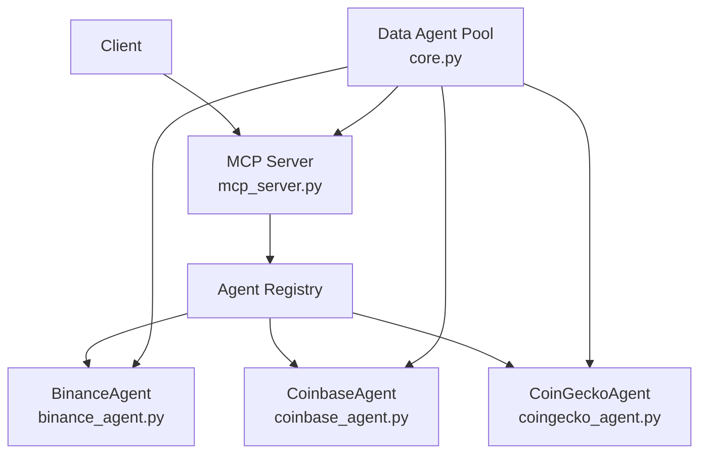
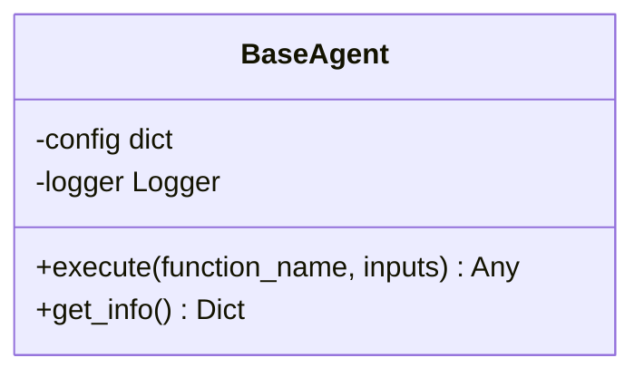
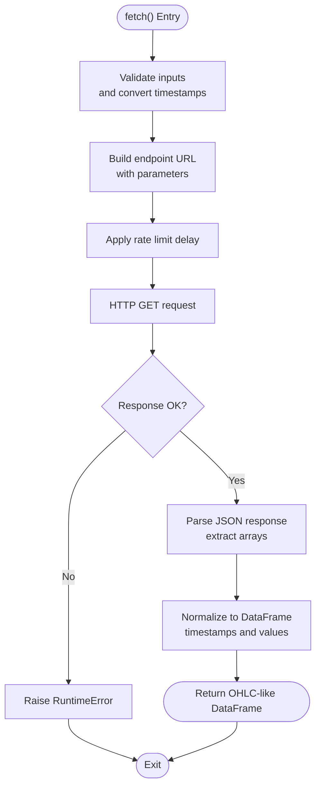
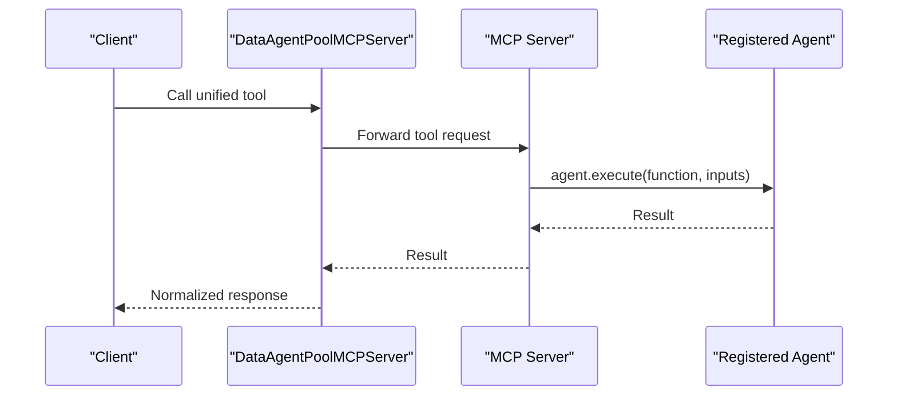
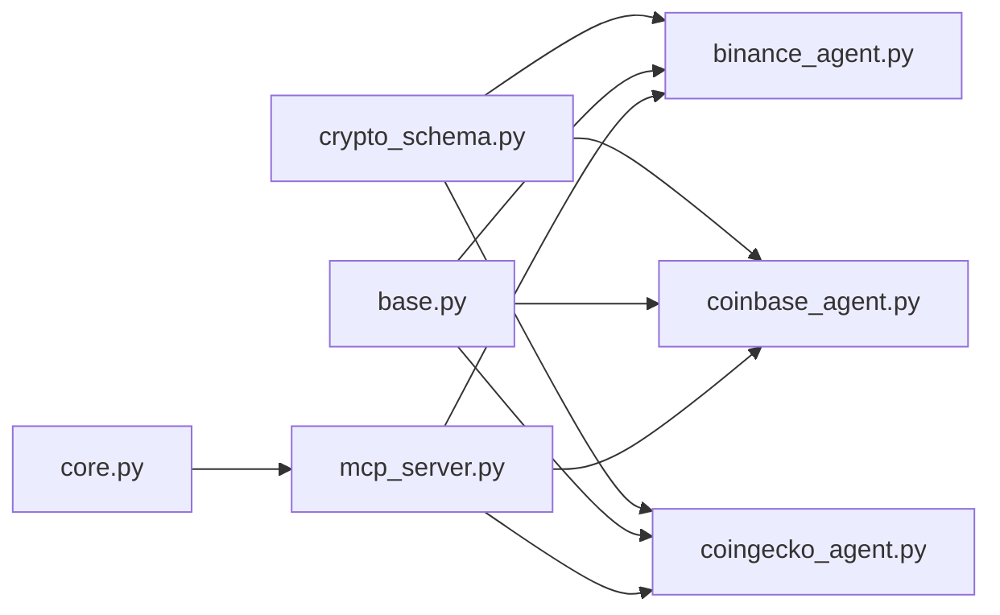

# Cryptocurrency Data

<cite>
**Referenced Files in This Document**
- [binance.yaml](file://FinAgents/agent_pools/data_agent_pool/config/binance.yaml)
- [coinbase.yaml](file://FinAgents/agent_pools/data_agent_pool/config/coinbase.yaml)
- [coingecko.yaml](file://FinAgents/agent_pools/data_agent_pool/config/coingecko.yaml)
- [crypto_schema.py](file://FinAgents/agent_pools/data_agent_pool/schema/crypto_schema.py)
- [base.py](file://FinAgents/agent_pools/data_agent_pool/base.py)
- [core.py](file://FinAgents/agent_pools/data_agent_pool/core.py)
- [binance_agent.py](file://FinAgents/agent_pools/data_agent_pool/agents/crypto/binance_agent.py)
- [coinbase_agent.py](file://FinAgents/agent_pools/data_agent_pool/agents/crypto/coinbase_agent.py)
- [coingecko_agent.py](file://FinAgents/agent_pools/data_agent_pool/agents/crypto/coingecko_agent.py)
- [mcp_server.py](file://FinAgents/agent_pools/data_agent_pool/mcp_server.py)
- [main.py](file://FinAgents/agent_pools/data_agent_pool/main.py)
</cite>

## Table of Contents
1. [Introduction](#introduction)
2. [Project Structure](#project-structure)
3. [Core Components](#core-components)
4. [Architecture Overview](#architecture-overview)
5. [Detailed Component Analysis](#detailed-component-analysis)
6. [Dependency Analysis](#dependency-analysis)
7. [Performance Considerations](#performance-considerations)
8. [Troubleshooting Guide](#troubleshooting-guide)
9. [Conclusion](#conclusion)

## Introduction
This document describes the cryptocurrency data subsystem of the Agentic Trading Application. It explains how the system integrates with major crypto exchanges and data providers (Binance, Coinbase, and CoinGecko), documents the unique characteristics of cryptocurrency markets, and details data normalization processes for crypto pairs, spot vs futures contracts, and token standards. It also covers real-time streaming capabilities, order book data handling, OHLCV candle generation, configuration examples, exchange rate conversions, and integration with decentralized finance (DeFi) protocols.

## Project Structure
The cryptocurrency data subsystem is organized around a modular agent architecture:
- Configuration files define provider-specific endpoints, credentials, and constraints.
- Pydantic models define typed configuration schemas.
- Agent implementations encapsulate provider-specific logic.
- A Data Agent Pool coordinates agent lifecycles and exposes unified tools.
- An MCP server enables dynamic agent execution and registration.

```mermaid
graph TB
subgraph "Crypto Config"
B["binance.yaml"]
C["coinbase.yaml"]
G["coingecko.yaml"]
end
subgraph "Schema"
S["crypto_schema.py"]
end
subgraph "Base"
Base["base.py"]
end
subgraph "Agents"
Bin["binance_agent.py"]
Cb["coinbase_agent.py"]
Cg["coingecko_agent.py"]
end
subgraph "Pool & MCP"
Core["core.py"]
M["mcp_server.py"]
Main["main.py"]
end
B --> Bin
C --> Cb
G --> Cg
S --> Bin
S --> Cb
S --> Cg
Base --> Bin
Base --> Cb
Base --> Cg
Core --> M
M --> Bin
M --> Cb
M --> Cg
```

**Diagram sources**
- [binance.yaml:1-17](file://FinAgents/agent_pools/data_agent_pool/config/binance.yaml#L1-L17)
- [coinbase.yaml:1-16](file://FinAgents/agent_pools/data_agent_pool/config/coinbase.yaml#L1-L16)
- [coingecko.yaml:1-18](file://FinAgents/agent_pools/data_agent_pool/config/coingecko.yaml#L1-L18)
- [crypto_schema.py:1-35](file://FinAgents/agent_pools/data_agent_pool/schema/crypto_schema.py#L1-L35)
- [base.py:1-61](file://FinAgents/agent_pools/data_agent_pool/base.py#L1-L61)
- [binance_agent.py:1-102](file://FinAgents/agent_pools/data_agent_pool/agents/crypto/binance_agent.py#L1-L102)
- [coinbase_agent.py:1-18](file://FinAgents/agent_pools/data_agent_pool/agents/crypto/coinbase_agent.py#L1-L18)
- [coingecko_agent.py:1-315](file://FinAgents/agent_pools/data_agent_pool/agents/crypto/coingecko_agent.py#L1-L315)
- [core.py:1-835](file://FinAgents/agent_pools/data_agent_pool/core.py#L1-L835)
- [mcp_server.py:1-68](file://FinAgents/agent_pools/data_agent_pool/mcp_server.py#L1-L68)
- [main.py:1-6](file://FinAgents/agent_pools/data_agent_pool/main.py#L1-L6)

**Section sources**
- [binance.yaml:1-17](file://FinAgents/agent_pools/data_agent_pool/config/binance.yaml#L1-L17)
- [coinbase.yaml:1-16](file://FinAgents/agent_pools/data_agent_pool/config/coinbase.yaml#L1-L16)
- [coingecko.yaml:1-18](file://FinAgents/agent_pools/data_agent_pool/config/coingecko.yaml#L1-L18)
- [crypto_schema.py:1-35](file://FinAgents/agent_pools/data_agent_pool/schema/crypto_schema.py#L1-L35)
- [base.py:1-61](file://FinAgents/agent_pools/data_agent_pool/base.py#L1-L61)
- [binance_agent.py:1-102](file://FinAgents/agent_pools/data_agent_pool/agents/crypto/binance_agent.py#L1-L102)
- [coinbase_agent.py:1-18](file://FinAgents/agent_pools/data_agent_pool/agents/crypto/coinbase_agent.py#L1-L18)
- [coingecko_agent.py:1-315](file://FinAgents/agent_pools/data_agent_pool/agents/crypto/coingecko_agent.py#L1-L315)
- [core.py:1-835](file://FinAgents/agent_pools/data_agent_pool/core.py#L1-L835)
- [mcp_server.py:1-68](file://FinAgents/agent_pools/data_agent_pool/mcp_server.py#L1-L68)
- [main.py:1-6](file://FinAgents/agent_pools/data_agent_pool/main.py#L1-L6)

## Core Components
- Configuration models: Typed configuration for Binance, Coinbase, and CoinGecko, including API base URLs, endpoints, default intervals, authentication, and constraints.
- Base agent: Shared interface for dynamic method dispatch, configuration management, and logging.
- Provider agents:
  - BinanceAgent: Implements historical OHLCV retrieval and current price fetching for spot trading pairs.
  - CoinbaseAgent: Provides spot price helpers for crypto fiat pairs.
  - CoinGeckoAgent: Implements current price, historical price/market data, trending coins, search, and supported coins discovery with rate limiting and request handling.
- Data Agent Pool: Orchestrates agent lifecycle, health checks, and unified tool exposure via MCP.
- MCP server: Registers agents and exposes a tool to execute agent functions dynamically.

Key responsibilities:
- Normalize provider-specific data into common schemas (OHLCV, current price, market caps, volumes).
- Enforce rate limits and timeouts per provider.
- Support real-time and historical data workflows.

**Section sources**
- [crypto_schema.py:1-35](file://FinAgents/agent_pools/data_agent_pool/schema/crypto_schema.py#L1-L35)
- [base.py:11-61](file://FinAgents/agent_pools/data_agent_pool/base.py#L11-L61)
- [binance_agent.py:7-102](file://FinAgents/agent_pools/data_agent_pool/agents/crypto/binance_agent.py#L7-L102)
- [coinbase_agent.py:4-18](file://FinAgents/agent_pools/data_agent_pool/agents/crypto/coinbase_agent.py#L4-L18)
- [coingecko_agent.py:10-315](file://FinAgents/agent_pools/data_agent_pool/agents/crypto/coingecko_agent.py#L10-L315)
- [core.py:66-835](file://FinAgents/agent_pools/data_agent_pool/core.py#L66-L835)
- [mcp_server.py:14-68](file://FinAgents/agent_pools/data_agent_pool/mcp_server.py#L14-L68)

## Architecture Overview
The subsystem follows an agent-centric MCP architecture:
- Configuration files define provider endpoints and constraints.
- Agents implement provider-specific logic and inherit shared base functionality.
- The MCP server loads agents and exposes a generic tool to execute functions by name.
- The Data Agent Pool manages agent processes, health, and provides unified tools for historical data retrieval and orchestration.



**Diagram sources**
- [mcp_server.py:1-68](file://FinAgents/agent_pools/data_agent_pool/mcp_server.py#L1-L68)
- [core.py:66-835](file://FinAgents/agent_pools/data_agent_pool/core.py#L66-L835)
- [binance_agent.py:1-102](file://FinAgents/agent_pools/data_agent_pool/agents/crypto/binance_agent.py#L1-L102)
- [coinbase_agent.py:1-18](file://FinAgents/agent_pools/data_agent_pool/agents/crypto/coinbase_agent.py#L1-L18)
- [coingecko_agent.py:1-315](file://FinAgents/agent_pools/data_agent_pool/agents/crypto/coingecko_agent.py#L1-L315)

## Detailed Component Analysis

### Configuration Models and Providers
- BinanceConfig: Includes base URL, endpoints for spot price and OHLCV, default interval, authentication keys, and constraints (timeout and rate limit).
- CoinbaseConfig: Similar structure tailored for Coinbase endpoints and defaults.
- CoinGeckoConfig: Adds default vs currency and supports optional Pro API key.

These models enable type-safe configuration loading and validation.

**Section sources**
- [crypto_schema.py:18-35](file://FinAgents/agent_pools/data_agent_pool/schema/crypto_schema.py#L18-L35)
- [binance.yaml:1-17](file://FinAgents/agent_pools/data_agent_pool/config/binance.yaml#L1-L17)
- [coinbase.yaml:1-16](file://FinAgents/agent_pools/data_agent_pool/config/coinbase.yaml#L1-L16)
- [coingecko.yaml:1-18](file://FinAgents/agent_pools/data_agent_pool/config/coingecko.yaml#L1-L18)

### Base Agent Pattern
- Provides dynamic method dispatch via execute(function_name, inputs).
- Centralizes logging and exposes agent info for introspection.
- Enables uniform behavior across all provider agents.



**Diagram sources**
- [base.py:11-61](file://FinAgents/agent_pools/data_agent_pool/base.py#L11-L61)

**Section sources**
- [base.py:11-61](file://FinAgents/agent_pools/data_agent_pool/base.py#L11-L61)

### Binance Agent
Responsibilities:
- Fetch historical OHLCV data for spot trading pairs with configurable intervals.
- Retrieve current spot prices.
- Validate configuration for API keys and enforce constraints.

Data normalization:
- Returns OHLCV with timestamp, open, high, low, close, and volume aligned to the requested interval.
- Converts ISO timestamps to milliseconds for API compatibility.

Real-time and streaming:
- Current price method included; streaming order book and incremental updates are not implemented in the referenced file.

Spot vs futures:
- The referenced implementation targets spot trading pairs and does not include futures-specific logic.

Token standards:
- No token standard handling in the referenced implementation.

**Section sources**
- [binance_agent.py:7-102](file://FinAgents/agent_pools/data_agent_pool/agents/crypto/binance_agent.py#L7-L102)
- [binance.yaml:3-17](file://FinAgents/agent_pools/data_agent_pool/config/binance.yaml#L3-L17)

### Coinbase Agent
Responsibilities:
- Provides helpers for spot price retrieval for crypto/fiat pairs.
- Demonstrates a minimal agent implementation pattern.

Real-time and streaming:
- Spot price helpers included; streaming order book and incremental updates are not implemented in the referenced file.

Spot vs futures:
- The referenced implementation targets spot pairs and does not include futures-specific logic.

Token standards:
- No token standard handling in the referenced implementation.

**Section sources**
- [coinbase_agent.py:4-18](file://FinAgents/agent_pools/data_agent_pool/agents/crypto/coinbase_agent.py#L4-L18)
- [coinbase.yaml:3-16](file://FinAgents/agent_pools/data_agent_pool/config/coinbase.yaml#L3-L16)

### CoinGecko Agent
Responsibilities:
- Fetch historical price/market data with rate limiting and request handling.
- Retrieve current prices with market caps, volumes, and 24h changes.
- Obtain comprehensive market data, trending coins, search results, and supported coins list.

Data normalization:
- Converts CoinGecko timestamps to pandas DatetimeIndex.
- Returns normalized OHLC-like series for price and aggregates market cap and total volume.

Rate limiting and reliability:
- Implements per-request delay based on rate limit per minute.
- Uses timeouts and structured error handling for API failures.

Real-time and streaming:
- Current price retrieval included; streaming order book and incremental updates are not implemented in the referenced file.

Spot vs futures:
- The referenced implementation focuses on spot market data and does not include futures-specific logic.

Token standards:
- No token standard handling in the referenced implementation.



**Diagram sources**
- [coingecko_agent.py:60-120](file://FinAgents/agent_pools/data_agent_pool/agents/crypto/coingecko_agent.py#L60-L120)

**Section sources**
- [coingecko_agent.py:10-315](file://FinAgents/agent_pools/data_agent_pool/agents/crypto/coingecko_agent.py#L10-L315)
- [coingecko.yaml:1-18](file://FinAgents/agent_pools/data_agent_pool/config/coingecko.yaml#L1-L18)

### Data Agent Pool and MCP Integration
- The Data Agent Pool manages agent processes, health checks, and exposes unified tools.
- The MCP server registers agents and exposes a generic tool to execute functions by name.
- The main entrypoint runs the MCP app.



**Diagram sources**
- [core.py:374-587](file://FinAgents/agent_pools/data_agent_pool/core.py#L374-L587)
- [mcp_server.py:17-30](file://FinAgents/agent_pools/data_agent_pool/mcp_server.py#L17-L30)
- [main.py:1-6](file://FinAgents/agent_pools/data_agent_pool/main.py#L1-L6)

**Section sources**
- [core.py:66-835](file://FinAgents/agent_pools/data_agent_pool/core.py#L66-L835)
- [mcp_server.py:1-68](file://FinAgents/agent_pools/data_agent_pool/mcp_server.py#L1-L68)
- [main.py:1-6](file://FinAgents/agent_pools/data_agent_pool/main.py#L1-L6)

## Dependency Analysis
- Configuration files depend on typed schemas to ensure correctness.
- Agents depend on BaseAgent for shared behavior and on configuration models for provider-specific settings.
- The MCP server depends on the agent registry to resolve and execute functions.
- The Data Agent Pool depends on MCP clients to coordinate agent processes and health checks.



**Diagram sources**
- [crypto_schema.py:1-35](file://FinAgents/agent_pools/data_agent_pool/schema/crypto_schema.py#L1-L35)
- [base.py:1-61](file://FinAgents/agent_pools/data_agent_pool/base.py#L1-L61)
- [binance_agent.py:1-102](file://FinAgents/agent_pools/data_agent_pool/agents/crypto/binance_agent.py#L1-L102)
- [coinbase_agent.py:1-18](file://FinAgents/agent_pools/data_agent_pool/agents/crypto/coinbase_agent.py#L1-L18)
- [coingecko_agent.py:1-315](file://FinAgents/agent_pools/data_agent_pool/agents/crypto/coingecko_agent.py#L1-L315)
- [mcp_server.py:1-68](file://FinAgents/agent_pools/data_agent_pool/mcp_server.py#L1-L68)
- [core.py:1-835](file://FinAgents/agent_pools/data_agent_pool/core.py#L1-L835)

**Section sources**
- [crypto_schema.py:1-35](file://FinAgents/agent_pools/data_agent_pool/schema/crypto_schema.py#L1-L35)
- [base.py:1-61](file://FinAgents/agent_pools/data_agent_pool/base.py#L1-L61)
- [binance_agent.py:1-102](file://FinAgents/agent_pools/data_agent_pool/agents/crypto/binance_agent.py#L1-L102)
- [coinbase_agent.py:1-18](file://FinAgents/agent_pools/data_agent_pool/agents/crypto/coinbase_agent.py#L1-L18)
- [coingecko_agent.py:1-315](file://FinAgents/agent_pools/data_agent_pool/agents/crypto/coingecko_agent.py#L1-L315)
- [mcp_server.py:1-68](file://FinAgents/agent_pools/data_agent_pool/mcp_server.py#L1-L68)
- [core.py:1-835](file://FinAgents/agent_pools/data_agent_pool/core.py#L1-L835)

## Performance Considerations
- Rate limiting: CoinGecko agent implements per-minute rate limiting; Binance and Coinbase configs include rate limit constraints that should be enforced in implementations.
- Timeouts: Each provider configuration defines a timeout; ensure consumers respect these limits.
- Historical data volume: Large date ranges produce substantial datasets; consider chunking and pagination where applicable.
- Real-time streaming: Not implemented in the referenced files; adding WebSocket or SSE streams would require additional infrastructure and backpressure handling.

[No sources needed since this section provides general guidance]

## Troubleshooting Guide
Common issues and resolutions:
- Missing API keys: Validation raises errors when required keys are absent; ensure configuration files are populated.
- Invalid inputs: Parameter validation raises errors for malformed timestamps or unsupported intervals; confirm ISO format and supported values.
- Rate limit exceeded: CoinGecko agent applies delays; adjust frequency or upgrade to a paid tier if needed.
- MCP connectivity: Use health checks to verify agent readiness; restart agents if health checks fail.
- Data shape mismatches: Normalize provider outputs into consistent schemas before downstream processing.

**Section sources**
- [binance_agent.py:94-102](file://FinAgents/agent_pools/data_agent_pool/agents/crypto/binance_agent.py#L94-L102)
- [coingecko_agent.py:279-298](file://FinAgents/agent_pools/data_agent_pool/agents/crypto/coingecko_agent.py#L279-L298)
- [core.py:557-587](file://FinAgents/agent_pools/data_agent_pool/core.py#L557-L587)

## Conclusion
The cryptocurrency data subsystem provides a scalable, typed configuration layer, reusable base agent patterns, and provider-specific implementations for Binance, Coinbase, and CoinGecko. It emphasizes data normalization, rate limiting, and MCP-based orchestration. While current implementations focus on historical and current spot market data, the architecture supports extension for real-time streaming, futures contracts, and DeFi integrations by adding provider-specific logic and streaming clients.