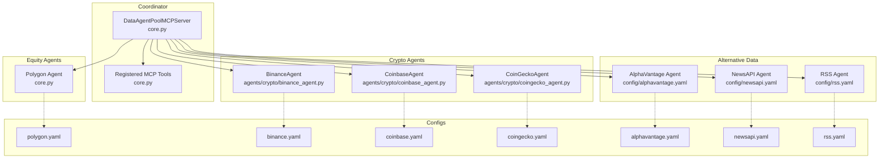
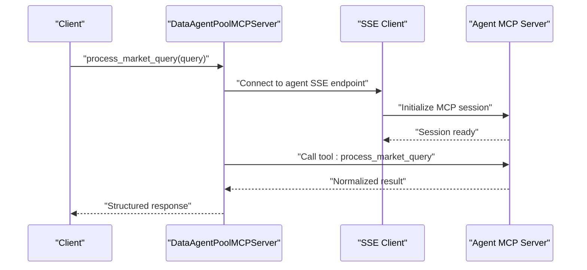
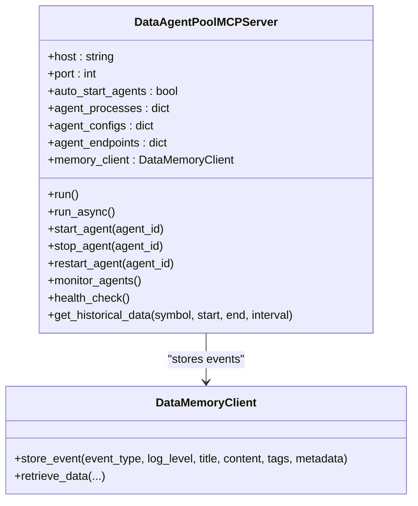
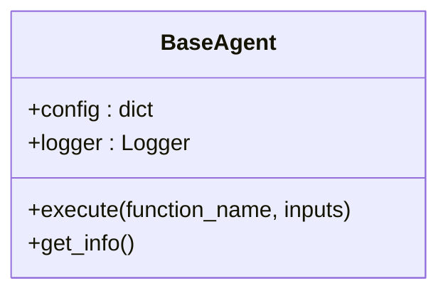
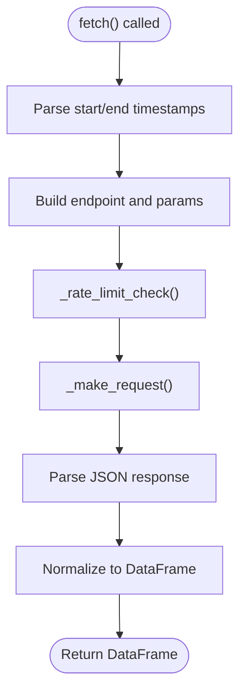
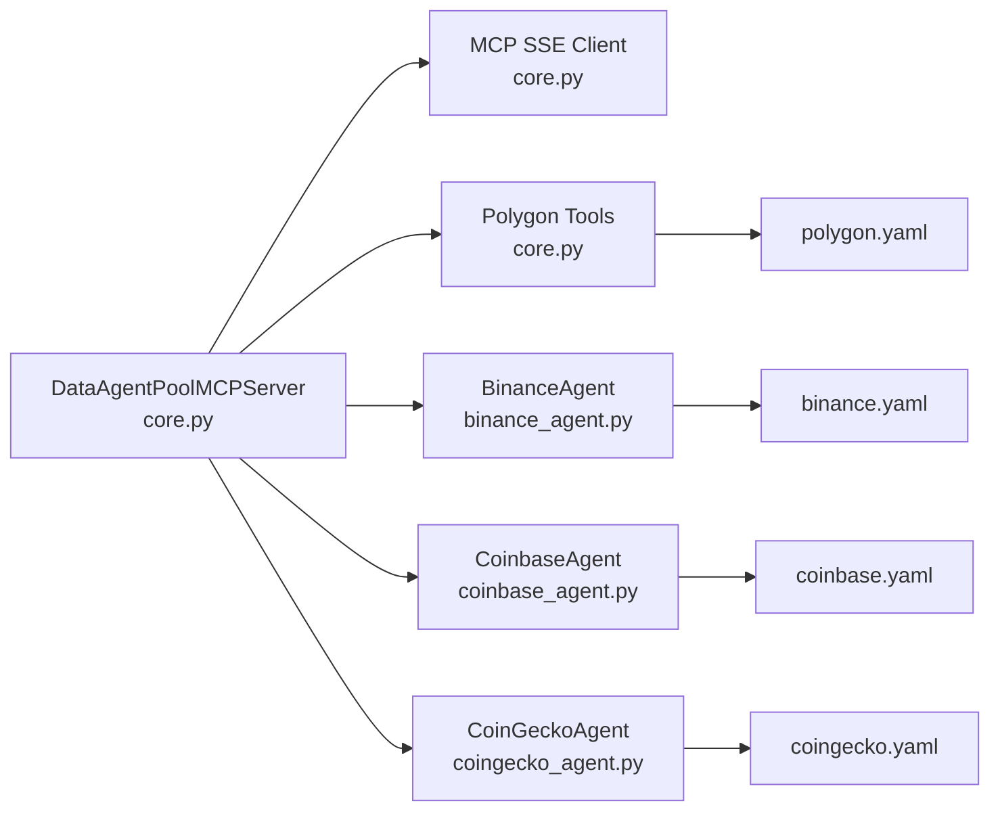
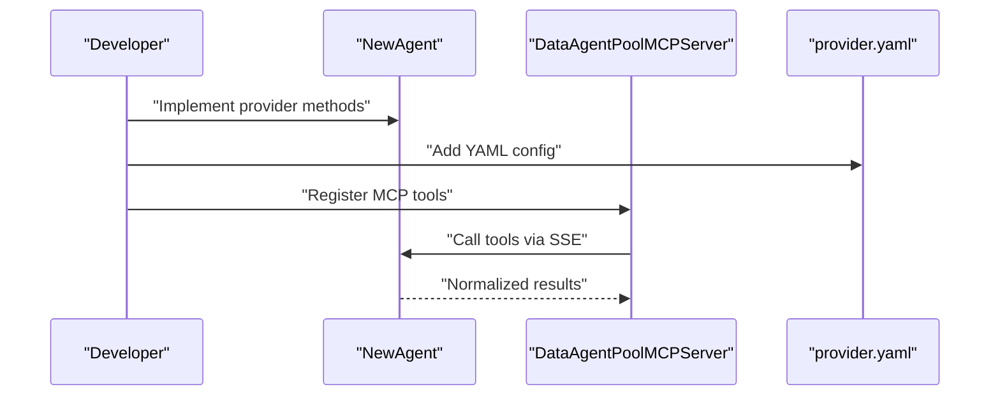

# Data Agent Pool

<cite>
**Referenced Files in This Document**
- [core.py](file://FinAgents/agent_pools/data_agent_pool/core.py)
- [base.py](file://FinAgents/agent_pools/data_agent_pool/base.py)
- [polygon.yaml](file://FinAgents/agent_pools/data_agent_pool/config/polygon.yaml)
- [binance.yaml](file://FinAgents/agent_pools/data_agent_pool/config/binance.yaml)
- [coinbase.yaml](file://FinAgents/agent_pools/data_agent_pool/config/coinbase.yaml)
- [coingecko.yaml](file://FinAgents/agent_pools/data_agent_pool/config/coingecko.yaml)
- [alphavantage.yaml](file://FinAgents/agent_pools/data_agent_pool/config/alphavantage.yaml)
- [newsapi.yaml](file://FinAgents/agent_pools/data_agent_pool/config/newsapi.yaml)
- [rss.yaml](file://FinAgents/agent_pools/data_agent_pool/config/rss.yaml)
- [binance_agent.py](file://FinAgents/agent_pools/data_agent_pool/agents/crypto/binance_agent.py)
- [coinbase_agent.py](file://FinAgents/agent_pools/data_agent_pool/agents/crypto/coinbase_agent.py)
- [coingecko_agent.py](file://FinAgents/agent_pools/data_agent_pool/agents/crypto/coingecko_agent.py)
- [alpaca_agent.py](file://FinAgents/agent_pools/data_agent_pool/agents/equity/alpaca_agent.py)
- [main.py](file://FinAgents/agent_pools/data_agent_pool/main.py)
</cite>

## Table of Contents
1. [Introduction](#introduction)
2. [Project Structure](#project-structure)
3. [Core Components](#core-components)
4. [Architecture Overview](#architecture-overview)
5. [Detailed Component Analysis](#detailed-component-analysis)
6. [Dependency Analysis](#dependency-analysis)
7. [Performance Considerations](#performance-considerations)
8. [Troubleshooting Guide](#troubleshooting-guide)
9. [Conclusion](#conclusion)
10. [Appendices](#appendices)

## Introduction
This document describes the Data Agent Pool responsible for multi-source market data integration. It covers the architecture for collecting data from equities (Polygon), cryptocurrencies (Binance, Coinbase, CoinGecko), and alternative data sources (news, social media). It documents data normalization processes, real-time streaming capabilities, historical data retrieval, MCP-based communication with data providers, caching strategies, error handling, configuration examples, rate limiting considerations, data quality validation, and integration patterns for custom data providers.

## Project Structure
The Data Agent Pool is organized around a central coordinator (DataAgentPoolMCPServer) that manages multiple data agents. Each agent encapsulates provider-specific logic and is configured via YAML files. The coordinator exposes a unified MCP interface and can spawn and monitor agent processes.

**Diagram sources**
- [core.py:66-128](file://FinAgents/agent_pools/data_agent_pool/core.py#L66-L128)
- [binance_agent.py:7-26](file://FinAgents/agent_pools/data_agent_pool/agents/crypto/binance_agent.py#L7-L26)
- [coinbase_agent.py:4-12](file://FinAgents/agent_pools/data_agent_pool/agents/crypto/coinbase_agent.py#L4-L12)
- [coingecko_agent.py:10-34](file://FinAgents/agent_pools/data_agent_pool/agents/crypto/coingecko_agent.py#L10-L34)
- [polygon.yaml:1-17](file://FinAgents/agent_pools/data_agent_pool/config/polygon.yaml#L1-L17)
- [binance.yaml:1-17](file://FinAgents/agent_pools/data_agent_pool/config/binance.yaml#L1-L17)
- [coinbase.yaml:1-16](file://FinAgents/agent_pools/data_agent_pool/config/coinbase.yaml#L1-L16)
- [coingecko.yaml:1-18](file://FinAgents/agent_pools/data_agent_pool/config/coingecko.yaml#L1-L18)
- [alphavantage.yaml:1-48](file://FinAgents/agent_pools/data_agent_pool/config/alphavantage.yaml#L1-L48)
- [newsapi.yaml:1-15](file://FinAgents/agent_pools/data_agent_pool/config/newsapi.yaml#L1-L15)
- [rss.yaml:1-13](file://FinAgents/agent_pools/data_agent_pool/config/rss.yaml#L1-L13)

**Section sources**
- [core.py:66-128](file://FinAgents/agent_pools/data_agent_pool/core.py#L66-L128)
- [polygon.yaml:1-17](file://FinAgents/agent_pools/data_agent_pool/config/polygon.yaml#L1-L17)
- [binance.yaml:1-17](file://FinAgents/agent_pools/data_agent_pool/config/binance.yaml#L1-L17)
- [coinbase.yaml:1-16](file://FinAgents/agent_pools/data_agent_pool/config/coinbase.yaml#L1-L16)
- [coingecko.yaml:1-18](file://FinAgents/agent_pools/data_agent_pool/config/coingecko.yaml#L1-L18)
- [alphavantage.yaml:1-48](file://FinAgents/agent_pools/data_agent_pool/config/alphavantage.yaml#L1-L48)
- [newsapi.yaml:1-15](file://FinAgents/agent_pools/data_agent_pool/config/newsapi.yaml#L1-L15)
- [rss.yaml:1-13](file://FinAgents/agent_pools/data_agent_pool/config/rss.yaml#L1-L13)

## Core Components
- DataAgentPoolMCPServer: Central coordinator that starts/stops agent processes, registers MCP tools, proxies requests to agents, monitors health, and integrates with memory storage.
- BaseAgent: Shared base class for all agents, providing dynamic method dispatch and logging.
- Agent Configurations: YAML files define provider endpoints, credentials, timeouts, rate limits, and optional features like caching and LLM support.
- Agent Implementations: Provider-specific agents (e.g., BinanceAgent, CoinbaseAgent, CoinGeckoAgent) implement data fetching and normalization.

Key responsibilities:
- Unified MCP interface for natural language queries and structured data requests
- Process lifecycle management (start, stop, restart, monitor)
- Health checks and automatic restarts
- Memory integration for storing historical data events
- Batch operations across symbols and intervals

**Section sources**
- [core.py:66-128](file://FinAgents/agent_pools/data_agent_pool/core.py#L66-L128)
- [base.py:11-61](file://FinAgents/agent_pools/data_agent_pool/base.py#L11-L61)

## Architecture Overview
The Data Agent Pool uses MCP (Model Context Protocol) over Server-Sent Events (SSE) to communicate with agent servers. The coordinator maintains a registry of agent endpoints and spawns agent processes when auto-start is enabled. Requests are proxied to the appropriate agent tool, and results are normalized and optionally stored in memory.

**Diagram sources**
- [core.py:339-373](file://FinAgents/agent_pools/data_agent_pool/core.py#L339-L373)
- [core.py:379-420](file://FinAgents/agent_pools/data_agent_pool/core.py#L379-L420)

## Detailed Component Analysis

### DataAgentPoolMCPServer
Responsibilities:
- Manage agent processes and endpoints
- Register MCP tools for query routing and batch operations
- Health monitoring and automatic restarts
- Memory integration for historical data storage
- Graceful shutdown handling

Key tools:
- process_market_query: Route natural language market queries to Polygon agent
- fetch_market_data: Direct structured fetch for a symbol
- get_company_info: Retrieve company information
- batch_fetch_market_data: Batch fetch across multiple symbols
- get_historical_data: Retrieve and persist historical data with fallback to synthetic data
- list_agents, start_agent, stop_agent, restart_agent, health_check

**Diagram sources**
- [core.py:66-128](file://FinAgents/agent_pools/data_agent_pool/core.py#L66-L128)
- [core.py:40-49](file://FinAgents/agent_pools/data_agent_pool/core.py#L40-L49)
- [core.py:588-752](file://FinAgents/agent_pools/data_agent_pool/core.py#L588-L752)

**Section sources**
- [core.py:66-128](file://FinAgents/agent_pools/data_agent_pool/core.py#L66-L128)
- [core.py:142-208](file://FinAgents/agent_pools/data_agent_pool/core.py#L142-L208)
- [core.py:307-338](file://FinAgents/agent_pools/data_agent_pool/core.py#L307-L338)
- [core.py:379-587](file://FinAgents/agent_pools/data_agent_pool/core.py#L379-L587)
- [core.py:588-752](file://FinAgents/agent_pools/data_agent_pool/core.py#L588-L752)

### BaseAgent
Provides:
- Dynamic method execution via execute(function_name, inputs)
- Logging via a logger named after the class
- Information retrieval via get_info()

**Diagram sources**
- [base.py:11-61](file://FinAgents/agent_pools/data_agent_pool/base.py#L11-L61)

**Section sources**
- [base.py:11-61](file://FinAgents/agent_pools/data_agent_pool/base.py#L11-L61)

### Equity Agents

#### Polygon Agent
- Endpoint mapping and defaults are defined in configuration.
- The coordinator proxies queries to Polygon via MCP tools.
- Historical data retrieval supports intervals and stores results in memory.

Configuration highlights:
- Base URL, endpoints, default interval, authentication keys, timeouts, rate limits, and LLM enablement.

**Section sources**
- [polygon.yaml:1-17](file://FinAgents/agent_pools/data_agent_pool/config/polygon.yaml#L1-L17)
- [core.py:379-471](file://FinAgents/agent_pools/data_agent_pool/core.py#L379-L471)
- [core.py:588-752](file://FinAgents/agent_pools/data_agent_pool/core.py#L588-L752)

#### Alpaca Agent
- Minimal implementation demonstrating agent pattern with quote and data fetch methods.

**Section sources**
- [alpaca_agent.py:1-19](file://FinAgents/agent_pools/data_agent_pool/agents/equity/alpaca_agent.py#L1-L19)

### Cryptocurrency Agents

#### Binance Agent
- Implements historical OHLCV fetching and current price retrieval.
- Validates configuration for API keys and secrets.
- Demonstrates structured DataFrame return for normalized data.

**Section sources**
- [binance_agent.py:1-102](file://FinAgents/agent_pools/data_agent_pool/agents/crypto/binance_agent.py#L1-L102)
- [binance.yaml:1-17](file://FinAgents/agent_pools/data_agent_pool/config/binance.yaml#L1-L17)

#### Coinbase Agent
- Minimal implementation returning mock spot prices.

**Section sources**
- [coinbase_agent.py:1-18](file://FinAgents/agent_pools/data_agent_pool/agents/crypto/coinbase_agent.py#L1-L18)
- [coinbase.yaml:1-16](file://FinAgents/agent_pools/data_agent_pool/config/coinbase.yaml#L1-L16)

#### CoinGecko Agent
- Implements rate limiting, request throttling, and multiple endpoints:
  - Historical price data
  - Current prices
  - Market data
  - Trending coins
  - Search and supported coins list
- Validates configuration including API key requirements for Pro tier.

**Diagram sources**
- [coingecko_agent.py:60-119](file://FinAgents/agent_pools/data_agent_pool/agents/crypto/coingecko_agent.py#L60-L119)

**Section sources**
- [coingecko_agent.py:1-315](file://FinAgents/agent_pools/data_agent_pool/agents/crypto/coingecko_agent.py#L1-L315)
- [coingecko.yaml:1-18](file://FinAgents/agent_pools/data_agent_pool/config/coingecko.yaml#L1-L18)

### Alternative Data Agents

#### AlphaVantage Agent
- News sentiment endpoint with configurable features, caching, and LLM integration.
- Supports topic filtering, time-range filtering, and article limits.

**Section sources**
- [alphavantage.yaml:1-48](file://FinAgents/agent_pools/data_agent_pool/config/alphavantage.yaml#L1-L48)

#### NewsAPI Agent
- Headlines and everything endpoints with rate limiting.

**Section sources**
- [newsapi.yaml:1-15](file://FinAgents/agent_pools/data_agent_pool/config/newsapi.yaml#L1-L15)

#### RSS Agent
- Default RSS feed endpoint with periodic polling.

**Section sources**
- [rss.yaml:1-13](file://FinAgents/agent_pools/data_agent_pool/config/rss.yaml#L1-L13)

## Dependency Analysis
- Coordinator depends on MCP SSE client libraries and agent process management.
- Agent implementations depend on BaseAgent and provider-specific schemas/configs.
- Configuration files define provider endpoints, credentials, and constraints.

**Diagram sources**
- [core.py:51-53](file://FinAgents/agent_pools/data_agent_pool/core.py#L51-L53)
- [binance_agent.py:4-5](file://FinAgents/agent_pools/data_agent_pool/agents/crypto/binance_agent.py#L4-L5)
- [coinbase_agent.py:1-2](file://FinAgents/agent_pools/data_agent_pool/agents/crypto/coinbase_agent.py#L1-L2)
- [coingecko_agent.py:6-7](file://FinAgents/agent_pools/data_agent_pool/agents/crypto/coingecko_agent.py#L6-L7)
- [polygon.yaml:1-17](file://FinAgents/agent_pools/data_agent_pool/config/polygon.yaml#L1-L17)
- [binance.yaml:1-17](file://FinAgents/agent_pools/data_agent_pool/config/binance.yaml#L1-L17)
- [coinbase.yaml:1-16](file://FinAgents/agent_pools/data_agent_pool/config/coinbase.yaml#L1-L16)
- [coingecko.yaml:1-18](file://FinAgents/agent_pools/data_agent_pool/config/coingecko.yaml#L1-L18)

**Section sources**
- [core.py:51-53](file://FinAgents/agent_pools/data_agent_pool/core.py#L51-L53)
- [binance_agent.py:4-5](file://FinAgents/agent_pools/data_agent_pool/agents/crypto/binance_agent.py#L4-L5)
- [coinbase_agent.py:1-2](file://FinAgents/agent_pools/data_agent_pool/agents/crypto/coinbase_agent.py#L1-L2)
- [coingecko_agent.py:6-7](file://FinAgents/agent_pools/data_agent_pool/agents/crypto/coingecko_agent.py#L6-L7)

## Performance Considerations
- Rate limiting: Each agent enforces provider-specific constraints. For example, CoinGecko implements minimum request intervals derived from rate limits.
- Timeout tuning: Configuration files specify per-provider timeouts to prevent long-blocking calls.
- Backoff and retries: The coordinator’s health monitoring includes restart logic for failed agents.
- Batch operations: The pool supports batch fetching across symbols to reduce overhead.
- Caching: Some alternative data agents (e.g., AlphaVantage) include caching configuration for reduced API load.

Recommendations:
- Align batch sizes with provider rate limits.
- Use jittered backoff for health checks.
- Monitor memory storage throughput when persisting large historical datasets.

**Section sources**
- [coingecko_agent.py:35-41](file://FinAgents/agent_pools/data_agent_pool/agents/crypto/coingecko_agent.py#L35-L41)
- [coingecko.yaml:14-18](file://FinAgents/agent_pools/data_agent_pool/config/coingecko.yaml#L14-L18)
- [alphavantage.yaml:25-28](file://FinAgents/agent_pools/data_agent_pool/config/alphavantage.yaml#L25-L28)

## Troubleshooting Guide
Common issues and resolutions:
- Agent process not starting: Verify auto-start configuration and process logs. The coordinator captures stdout/stderr during startup.
- Agent health failures: The monitor attempts health checks via MCP tools and restarts agents on failure.
- MCP client errors: Responses are wrapped with structured error messages; inspect returned status and error fields.
- Memory storage failures: Errors are logged and persisted as memory events for diagnostics.

Operational controls:
- Use list_agents to inspect endpoints and process status.
- Use start_agent, stop_agent, restart_agent to manage lifecycle.
- health_check returns pool and agent statuses for quick diagnosis.

**Section sources**
- [core.py:142-208](file://FinAgents/agent_pools/data_agent_pool/core.py#L142-L208)
- [core.py:307-338](file://FinAgents/agent_pools/data_agent_pool/core.py#L307-L338)
- [core.py:339-373](file://FinAgents/agent_pools/data_agent_pool/core.py#L339-L373)
- [core.py:557-586](file://FinAgents/agent_pools/data_agent_pool/core.py#L557-L586)

## Conclusion
The Data Agent Pool provides a scalable, MCP-driven orchestration layer for multi-source market data. It unifies heterogeneous data providers behind a single interface, supports batch operations and health monitoring, and integrates with memory storage for historical data persistence. Configuration-driven rate limits, timeouts, and optional caching help maintain reliability and performance.

## Appendices

### Configuration Examples
- Polygon: Define base URL, endpoints, default interval, authentication, timeouts, and rate limits.
- Binance: Configure base URL, endpoints, default interval, API keys, timeouts, and rate limits.
- Coinbase: Configure base URL, endpoints, default interval, API keys, timeouts, and rate limits.
- CoinGecko: Configure base URL, endpoints, default vs currency, API key (Pro), timeouts, and rate limits.
- AlphaVantage: Configure base URL, endpoints, API key, rate limits, features, caching, and LLM settings.
- NewsAPI: Configure base URL, endpoints, default interval, API key, and rate limits.
- RSS: Configure base URL, endpoints, default interval, and rate limits.

**Section sources**
- [polygon.yaml:1-17](file://FinAgents/agent_pools/data_agent_pool/config/polygon.yaml#L1-L17)
- [binance.yaml:1-17](file://FinAgents/agent_pools/data_agent_pool/config/binance.yaml#L1-L17)
- [coinbase.yaml:1-16](file://FinAgents/agent_pools/data_agent_pool/config/coinbase.yaml#L1-L16)
- [coingecko.yaml:1-18](file://FinAgents/agent_pools/data_agent_pool/config/coingecko.yaml#L1-L18)
- [alphavantage.yaml:1-48](file://FinAgents/agent_pools/data_agent_pool/config/alphavantage.yaml#L1-L48)
- [newsapi.yaml:1-15](file://FinAgents/agent_pools/data_agent_pool/config/newsapi.yaml#L1-L15)
- [rss.yaml:1-13](file://FinAgents/agent_pools/data_agent_pool/config/rss.yaml#L1-L13)

### Real-Time Streaming and Historical Retrieval
- Real-time: Agents expose current price endpoints (e.g., Binance, Coinbase, CoinGecko).
- Historical: The coordinator’s get_historical_data retrieves data via Polygon and persists events to memory, with synthetic data fallback when real data is unavailable.

**Section sources**
- [binance_agent.py:71-92](file://FinAgents/agent_pools/data_agent_pool/agents/crypto/binance_agent.py#L71-L92)
- [coinbase_agent.py:8-18](file://FinAgents/agent_pools/data_agent_pool/agents/crypto/coinbase_agent.py#L8-L18)
- [coingecko_agent.py:121-163](file://FinAgents/agent_pools/data_agent_pool/agents/crypto/coingecko_agent.py#L121-L163)
- [core.py:588-752](file://FinAgents/agent_pools/data_agent_pool/core.py#L588-L752)

### Data Normalization Processes
- Standardized column sets for OHLCV and price series across agents.
- Timestamp normalization to UTC-aware datetimes.
- Structured metadata for downstream consumers (e.g., symbol, interval, source).

**Section sources**
- [binance_agent.py:56-64](file://FinAgents/agent_pools/data_agent_pool/agents/crypto/binance_agent.py#L56-L64)
- [coingecko_agent.py:107-114](file://FinAgents/agent_pools/data_agent_pool/agents/crypto/coingecko_agent.py#L107-L114)

### MCP-Based Communication
- SSE-based MCP client initialization and tool invocation.
- Tool registration and proxying within the coordinator.

**Section sources**
- [core.py:339-373](file://FinAgents/agent_pools/data_agent_pool/core.py#L339-L373)
- [core.py:379-587](file://FinAgents/agent_pools/data_agent_pool/core.py#L379-L587)

### Caching Strategies
- AlphaVantage agent configuration includes cache directory and TTL for news sentiment data.

**Section sources**
- [alphavantage.yaml:25-28](file://FinAgents/agent_pools/data_agent_pool/config/alphavantage.yaml#L25-L28)

### Error Handling
- Structured error responses from MCP client calls.
- Memory events for retrieval failures and warnings for synthetic data fallback.

**Section sources**
- [core.py:371-372](file://FinAgents/agent_pools/data_agent_pool/core.py#L371-L372)
- [core.py:729-752](file://FinAgents/agent_pools/data_agent_pool/core.py#L729-L752)

### Integration Patterns for Custom Data Providers
Steps to integrate a new provider:
1. Create a new agent class inheriting from BaseAgent and implement provider-specific methods (e.g., fetch, get_current_price).
2. Add a YAML configuration file defining base URL, endpoints, authentication, constraints, and optional features.
3. Extend the coordinator to register MCP tools for the new agent and update agent configs and endpoints.
4. Optionally implement rate limiting and caching within the agent class.
5. Test with the coordinator’s health_check and batch tools.

**Diagram sources**
- [base.py:11-61](file://FinAgents/agent_pools/data_agent_pool/base.py#L11-L61)
- [core.py:379-587](file://FinAgents/agent_pools/data_agent_pool/core.py#L379-L587)

**Section sources**
- [base.py:11-61](file://FinAgents/agent_pools/data_agent_pool/base.py#L11-L61)
- [core.py:379-587](file://FinAgents/agent_pools/data_agent_pool/core.py#L379-L587)