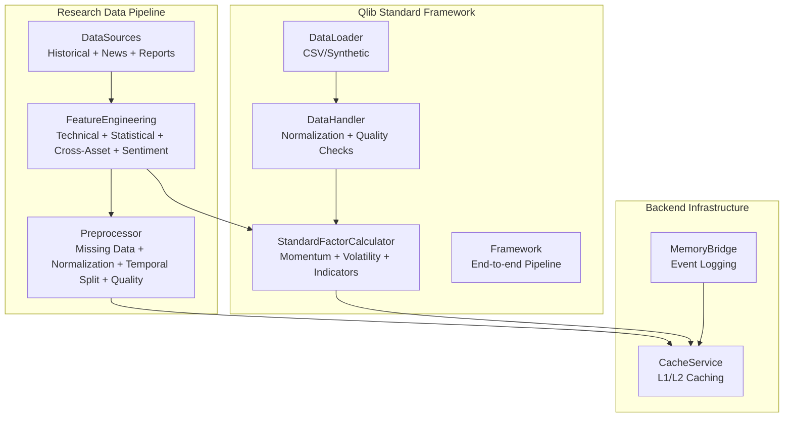
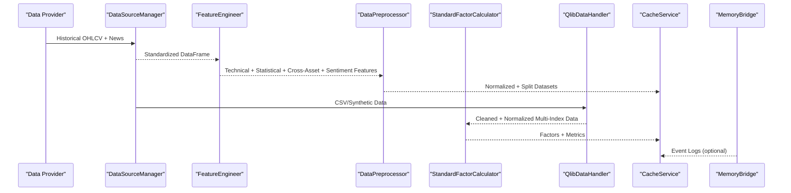
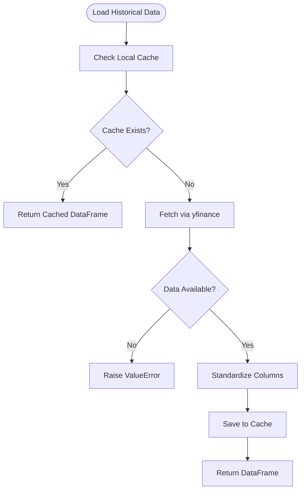
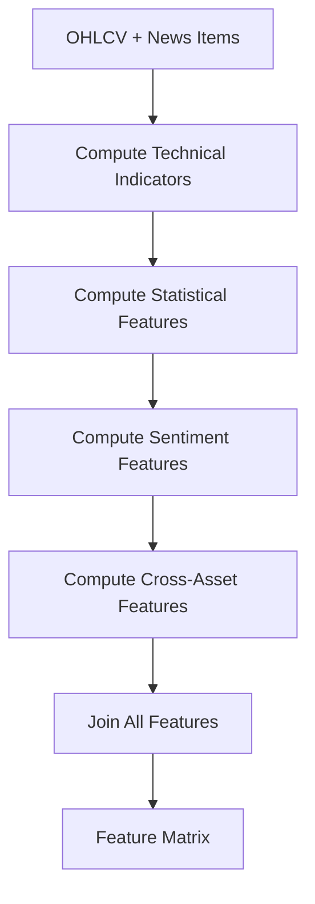
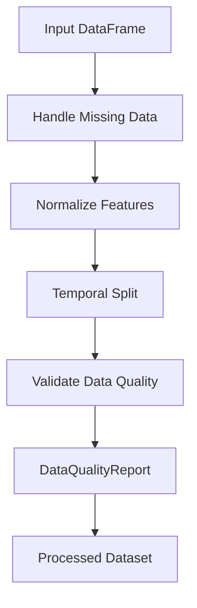
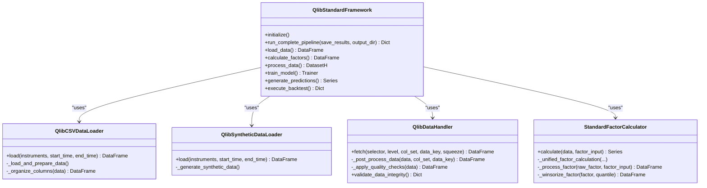
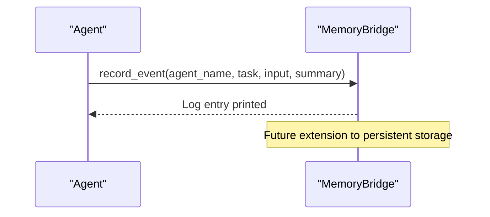
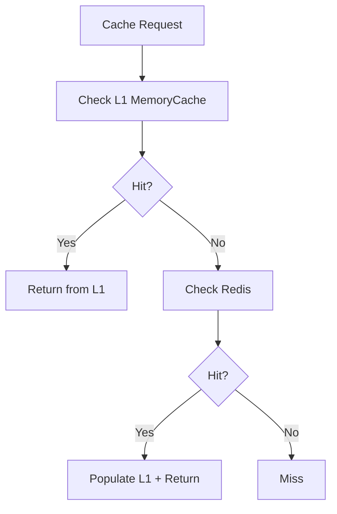
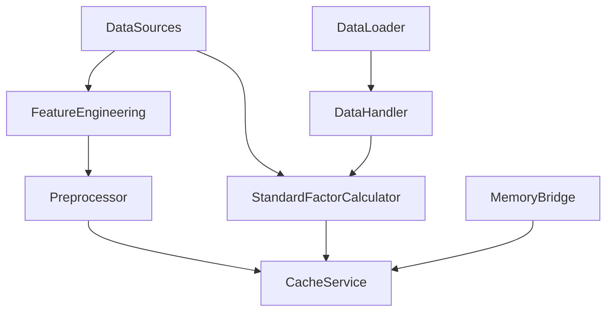

# Data Normalization and Processing

<cite>
**Referenced Files in This Document**
- [feature_engineering.py](file://FinAgents/research/data_pipeline/feature_engineering.py)
- [preprocessor.py](file://FinAgents/research/data_pipeline/preprocessor.py)
- [data_sources.py](file://FinAgents/research/data_pipeline/data_sources.py)
- [standard_factor_calculator.py](file://FinAgents/agent_pools/alpha_agent_pool/qlib_local/standard_factor_calculator.py)
- [data_handler.py](file://FinAgents/agent_pools/alpha_agent_pool/qlib_local/qlib_standard/data_handler.py)
- [data_loader.py](file://FinAgents/agent_pools/alpha_agent_pool/qlib_local/qlib_standard/data_loader.py)
- [framework.py](file://FinAgents/agent_pools/alpha_agent_pool/qlib_local/qlib_standard/framework.py)
- [cache_service.py](file://backend/cache/cache_service.py)
- [memory_bridge.py](file://FinAgents/agent_pools/data_agent_pool/memory_bridge.py)
- [feature_engineering.py](file://FinAgents/agent_pools/data_agent_pool/agents/equity/feature_engineering.py)
</cite>

## Table of Contents
1. [Introduction](#introduction)
2. [Project Structure](#project-structure)
3. [Core Components](#core-components)
4. [Architecture Overview](#architecture-overview)
5. [Detailed Component Analysis](#detailed-component-analysis)
6. [Dependency Analysis](#dependency-analysis)
7. [Performance Considerations](#performance-considerations)
8. [Troubleshooting Guide](#troubleshooting-guide)
9. [Conclusion](#conclusion)

## Introduction
This document explains the data normalization and processing workflows across the system, focusing on:
- Standardization of data formats from diverse providers into unified schemas
- Feature engineering pipeline including technical indicators, price transformations, and composite metrics
- Memory bridge integration for persistent data storage and retrieval
- Data validation rules, quality checks, and error handling mechanisms
- Examples of transformation workflows, caching strategies, and performance optimization techniques for large datasets

## Project Structure
The data processing stack spans research-grade preprocessing, provider-agnostic feature engineering, Qlib-backed standardization, and backend caching and memory bridging.

**Diagram sources**
- [data_sources.py:54-132](file://FinAgents/research/data_pipeline/data_sources.py#L54-L132)
- [feature_engineering.py:17-354](file://FinAgents/research/data_pipeline/feature_engineering.py#L17-L354)
- [preprocessor.py:43-404](file://FinAgents/research/data_pipeline/preprocessor.py#L43-L404)
- [data_loader.py:17-218](file://FinAgents/agent_pools/alpha_agent_pool/qlib_local/qlib_standard/data_loader.py#L17-L218)
- [data_handler.py:24-494](file://FinAgents/agent_pools/alpha_agent_pool/qlib_local/qlib_standard/data_handler.py#L24-L494)
- [standard_factor_calculator.py:12-325](file://FinAgents/agent_pools/alpha_agent_pool/qlib_local/standard_factor_calculator.py#L12-L325)
- [framework.py:28-702](file://FinAgents/agent_pools/alpha_agent_pool/qlib_local/qlib_standard/framework.py#L28-L702)
- [cache_service.py:58-202](file://backend/cache/cache_service.py#L58-L202)
- [memory_bridge.py:7-31](file://FinAgents/agent_pools/data_agent_pool/memory_bridge.py#L7-L31)

**Section sources**
- [data_sources.py:54-132](file://FinAgents/research/data_pipeline/data_sources.py#L54-L132)
- [feature_engineering.py:17-354](file://FinAgents/research/data_pipeline/feature_engineering.py#L17-L354)
- [preprocessor.py:43-404](file://FinAgents/research/data_pipeline/preprocessor.py#L43-L404)
- [data_loader.py:17-218](file://FinAgents/agent_pools/alpha_agent_pool/qlib_local/qlib_standard/data_loader.py#L17-L218)
- [data_handler.py:24-494](file://FinAgents/agent_pools/alpha_agent_pool/qlib_local/qlib_standard/data_handler.py#L24-L494)
- [standard_factor_calculator.py:12-325](file://FinAgents/agent_pools/alpha_agent_pool/qlib_local/standard_factor_calculator.py#L12-L325)
- [framework.py:28-702](file://FinAgents/agent_pools/alpha_agent_pool/qlib_local/qlib_standard/framework.py#L28-L702)
- [cache_service.py:58-202](file://backend/cache/cache_service.py#L58-L202)
- [memory_bridge.py:7-31](file://FinAgents/agent_pools/data_agent_pool/memory_bridge.py#L7-L31)

## Core Components
- DataSources: Unified interface for historical market data, simulated news, and synthetic reports. Implements local CSV caching and standardizes column names.
- FeatureEngineering: Computes technical indicators, statistical features, cross-asset features, and sentiment features from OHLCV and news items.
- Preprocessor: Handles missing data, normalization, temporal splitting, and comprehensive data quality validation.
- Qlib Standard Framework: Integrates DataLoader, DataHandler, StandardFactorCalculator, and end-to-end pipeline orchestration.
- CacheService: Two-level caching (L1 in-memory + L2 Redis) with namespace-aware keys and TTL controls.
- MemoryBridge: Event logging for task execution tracking and retrospective analysis.

**Section sources**
- [data_sources.py:54-132](file://FinAgents/research/data_pipeline/data_sources.py#L54-L132)
- [feature_engineering.py:17-354](file://FinAgents/research/data_pipeline/feature_engineering.py#L17-L354)
- [preprocessor.py:43-404](file://FinAgents/research/data_pipeline/preprocessor.py#L43-L404)
- [data_loader.py:17-218](file://FinAgents/agent_pools/alpha_agent_pool/qlib_local/qlib_standard/data_loader.py#L17-L218)
- [data_handler.py:24-494](file://FinAgents/agent_pools/alpha_agent_pool/qlib_local/qlib_standard/data_handler.py#L24-L494)
- [standard_factor_calculator.py:12-325](file://FinAgents/agent_pools/alpha_agent_pool/qlib_local/standard_factor_calculator.py#L12-L325)
- [framework.py:28-702](file://FinAgents/agent_pools/alpha_agent_pool/qlib_local/qlib_standard/framework.py#L28-L702)
- [cache_service.py:58-202](file://backend/cache/cache_service.py#L58-L202)
- [memory_bridge.py:7-31](file://FinAgents/agent_pools/data_agent_pool/memory_bridge.py#L7-L31)

## Architecture Overview
The system standardizes heterogeneous market data into unified schemas and applies robust feature engineering and normalization. It supports both research-focused preprocessing and Qlib-backed production workflows, with caching and memory bridging for performance and persistence.

**Diagram sources**
- [data_sources.py:75-132](file://FinAgents/research/data_pipeline/data_sources.py#L75-L132)
- [feature_engineering.py:29-354](file://FinAgents/research/data_pipeline/feature_engineering.py#L29-L354)
- [preprocessor.py:55-392](file://FinAgents/research/data_pipeline/preprocessor.py#L55-L392)
- [data_loader.py:53-106](file://FinAgents/agent_pools/alpha_agent_pool/qlib_local/qlib_standard/data_loader.py#L53-L106)
- [data_handler.py:24-494](file://FinAgents/agent_pools/alpha_agent_pool/qlib_local/qlib_standard/data_handler.py#L24-L494)
- [standard_factor_calculator.py:12-325](file://FinAgents/agent_pools/alpha_agent_pool/qlib_local/standard_factor_calculator.py#L12-L325)
- [cache_service.py:108-202](file://backend/cache/cache_service.py#L108-L202)
- [memory_bridge.py:7-31](file://FinAgents/agent_pools/data_agent_pool/memory_bridge.py#L7-L31)

## Detailed Component Analysis

### DataSources: Unified Schema and Caching
- Loads historical OHLCV data with local CSV cache fallback and standardizes column names.
- Provides simulated news and synthetic reports for research and backtesting.
- Implements cache directory management and file naming conventions for symbol-date-interval combinations.

**Diagram sources**
- [data_sources.py:75-132](file://FinAgents/research/data_pipeline/data_sources.py#L75-L132)

**Section sources**
- [data_sources.py:54-132](file://FinAgents/research/data_pipeline/data_sources.py#L54-L132)

### FeatureEngineering: Technical Indicators and Composite Metrics
- Computes RSI, MACD, Bollinger Bands, ATR, OBV, rolling moments, z-scores, cross-asset correlations, beta, and sentiment features.
- Joins sentiment and cross-asset features with technical indicators and statistical features.
- Ensures required columns and minimum row counts before computation.

**Diagram sources**
- [feature_engineering.py:29-354](file://FinAgents/research/data_pipeline/feature_engineering.py#L29-L354)

**Section sources**
- [feature_engineering.py:17-354](file://FinAgents/research/data_pipeline/feature_engineering.py#L17-L354)

### Preprocessor: Missing Data, Normalization, Splitting, and Quality
- Handles missing data via forward/backward fill, interpolation, or dropping rows.
- Supports z-score, min-max, and robust normalization with parameter tracking.
- Performs temporal train/validation/test splits respecting chronological order.
- Validates data quality including missing ratios, outliers, date gaps, duplicates, and generates a quality score.

**Diagram sources**
- [preprocessor.py:55-314](file://FinAgents/research/data_pipeline/preprocessor.py#L55-L314)

**Section sources**
- [preprocessor.py:43-404](file://FinAgents/research/data_pipeline/preprocessor.py#L43-L404)

### Qlib Standard Framework: Standardization and Factor Calculation
- DataLoader converts CSV/synthetic data into Qlib’s multi-index format with feature/label column groups.
- DataHandler applies normalization processors, handles infinities, fills NA, and enforces final quality checks.
- StandardFactorCalculator computes momentum, volatility, technical indicators, and cross-sectional factors with winsorization and clipping.
- Framework orchestrates end-to-end pipeline: load → factor → process → train → predict → backtest.

**Diagram sources**
- [data_loader.py:17-218](file://FinAgents/agent_pools/alpha_agent_pool/qlib_local/qlib_standard/data_loader.py#L17-L218)
- [data_loader.py:220-341](file://FinAgents/agent_pools/alpha_agent_pool/qlib_local/qlib_standard/data_loader.py#L220-L341)
- [data_handler.py:24-494](file://FinAgents/agent_pools/alpha_agent_pool/qlib_local/qlib_standard/data_handler.py#L24-L494)
- [standard_factor_calculator.py:12-325](file://FinAgents/agent_pools/alpha_agent_pool/qlib_local/standard_factor_calculator.py#L12-L325)
- [framework.py:28-702](file://FinAgents/agent_pools/alpha_agent_pool/qlib_local/qlib_standard/framework.py#L28-L702)

**Section sources**
- [data_loader.py:17-218](file://FinAgents/agent_pools/alpha_agent_pool/qlib_local/qlib_standard/data_loader.py#L17-L218)
- [data_loader.py:220-341](file://FinAgents/agent_pools/alpha_agent_pool/qlib_local/qlib_standard/data_loader.py#L220-L341)
- [data_handler.py:24-494](file://FinAgents/agent_pools/alpha_agent_pool/qlib_local/qlib_standard/data_handler.py#L24-L494)
- [standard_factor_calculator.py:12-325](file://FinAgents/agent_pools/alpha_agent_pool/qlib_local/standard_factor_calculator.py#L12-L325)
- [framework.py:28-702](file://FinAgents/agent_pools/alpha_agent_pool/qlib_local/qlib_standard/framework.py#L28-L702)

### Memory Bridge Integration
- Provides a lightweight event logging mechanism for task execution tracking and retrospective analysis.
- Can be extended to integrate with persistent memory systems, vector databases, or graph-based storage.

**Diagram sources**
- [memory_bridge.py:7-31](file://FinAgents/agent_pools/data_agent_pool/memory_bridge.py#L7-L31)

**Section sources**
- [memory_bridge.py:7-31](file://FinAgents/agent_pools/data_agent_pool/memory_bridge.py#L7-L31)

### Backend Caching Strategies
- Two-level caching: L1 in-memory (LRU with TTL) and L2 Redis (namespaced keys).
- Namespaces: market_data, signals, agent_memory, portfolio.
- TTLs optimized for hot-path data (e.g., market data refreshed frequently).
- Methods: get/set for market data, signals, agent memory, and portfolio summaries.

**Diagram sources**
- [cache_service.py:108-202](file://backend/cache/cache_service.py#L108-L202)

**Section sources**
- [cache_service.py:58-202](file://backend/cache/cache_service.py#L58-L202)

## Dependency Analysis
- DataSources depends on pandas/numpy and optional yfinance for provider data.
- FeatureEngineering depends on pandas/numpy for vectorized computations.
- Preprocessor composes FeatureEngineer and provides validation/reporting.
- Qlib components depend on pandas/numpy and Qlib handlers for normalization and processing.
- CacheService depends on Redis client for L2 caching.
- MemoryBridge is a lightweight utility for event logging.

**Diagram sources**
- [data_sources.py:54-132](file://FinAgents/research/data_pipeline/data_sources.py#L54-L132)
- [feature_engineering.py:17-354](file://FinAgents/research/data_pipeline/feature_engineering.py#L17-L354)
- [preprocessor.py:43-404](file://FinAgents/research/data_pipeline/preprocessor.py#L43-L404)
- [data_loader.py:17-218](file://FinAgents/agent_pools/alpha_agent_pool/qlib_local/qlib_standard/data_loader.py#L17-L218)
- [data_handler.py:24-494](file://FinAgents/agent_pools/alpha_agent_pool/qlib_local/qlib_standard/data_handler.py#L24-L494)
- [standard_factor_calculator.py:12-325](file://FinAgents/agent_pools/alpha_agent_pool/qlib_local/standard_factor_calculator.py#L12-L325)
- [cache_service.py:58-202](file://backend/cache/cache_service.py#L58-L202)
- [memory_bridge.py:7-31](file://FinAgents/agent_pools/data_agent_pool/memory_bridge.py#L7-L31)

**Section sources**
- [data_sources.py:54-132](file://FinAgents/research/data_pipeline/data_sources.py#L54-L132)
- [feature_engineering.py:17-354](file://FinAgents/research/data_pipeline/feature_engineering.py#L17-L354)
- [preprocessor.py:43-404](file://FinAgents/research/data_pipeline/preprocessor.py#L43-L404)
- [data_loader.py:17-218](file://FinAgents/agent_pools/alpha_agent_pool/qlib_local/qlib_standard/data_loader.py#L17-L218)
- [data_handler.py:24-494](file://FinAgents/agent_pools/alpha_agent_pool/qlib_local/qlib_standard/data_handler.py#L24-L494)
- [standard_factor_calculator.py:12-325](file://FinAgents/agent_pools/alpha_agent_pool/qlib_local/standard_factor_calculator.py#L12-L325)
- [cache_service.py:58-202](file://backend/cache/cache_service.py#L58-L202)
- [memory_bridge.py:7-31](file://FinAgents/agent_pools/data_agent_pool/memory_bridge.py#L7-L31)

## Performance Considerations
- Vectorized computations: FeatureEngineer and StandardFactorCalculator rely on pandas/numpy for efficient rolling and group-wise operations.
- Multi-index alignment: Qlib’s multi-index format ensures cross-sectional and temporal consistency for factor calculations.
- Caching tiers: L1 in-memory cache minimizes latency for hot data; Redis provides distributed caching and persistence.
- Winsorization and clipping: Reduce influence of extreme outliers in factor calculations, improving model stability.
- Temporal splitting: Prevents leakage and aligns training/validation/test sets chronologically.

[No sources needed since this section provides general guidance]

## Troubleshooting Guide
- Data validation failures:
  - Missing required columns or insufficient rows trigger explicit errors in FeatureEngineer and Qlib components.
  - DataHandler validates index structure, missing data ratios, infinite values, and duplicate indices.
- Missing data handling:
  - Preprocessor offers configurable strategies (forward-fill, interpolate, drop).
- Normalization pitfalls:
  - Zero variance features produce division-by-zero warnings; ensure sufficient variability or drop constant features.
- Cache availability:
  - CacheService gracefully degrades if Redis is unavailable; L1 cache remains functional.
- Memory bridge:
  - Current implementation prints entries; extend to persistent storage for production use.

**Section sources**
- [feature_engineering.py:47-53](file://FinAgents/research/data_pipeline/feature_engineering.py#L47-L53)
- [data_handler.py:428-494](file://FinAgents/agent_pools/alpha_agent_pool/qlib_local/qlib_standard/data_handler.py#L428-L494)
- [preprocessor.py:240-314](file://FinAgents/research/data_pipeline/preprocessor.py#L240-L314)
- [cache_service.py:83-103](file://backend/cache/cache_service.py#L83-L103)
- [memory_bridge.py:7-31](file://FinAgents/agent_pools/data_agent_pool/memory_bridge.py#L7-L31)

## Conclusion
The system provides a robust, extensible pipeline for standardizing market data, computing rich features, and applying rigorous normalization and validation. It integrates Qlib’s standardized workflows for production-grade factor calculation and backtesting, while leveraging two-tier caching and a memory bridge for performance and persistence. The modular design enables easy extension for additional providers, features, and storage backends.