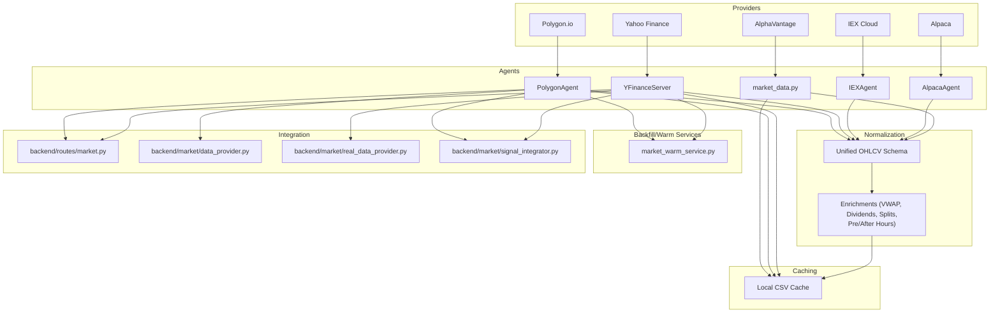
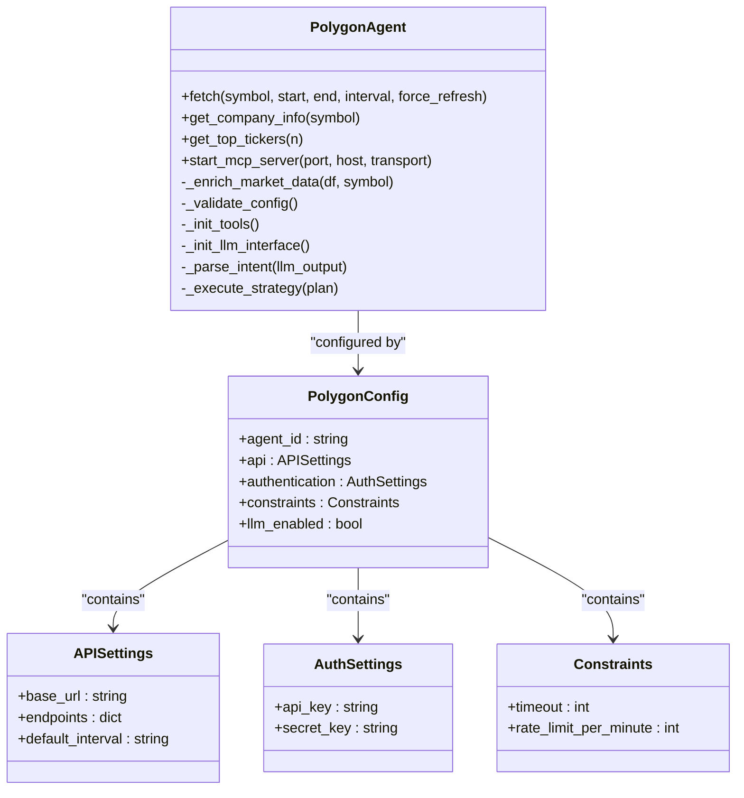
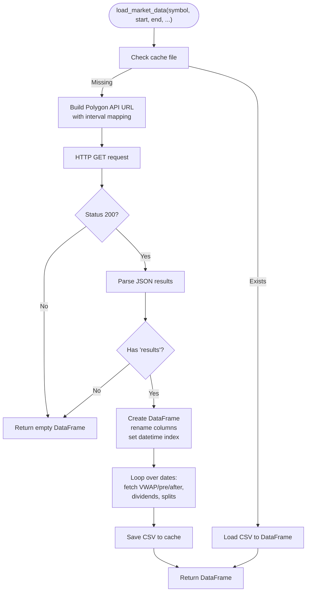
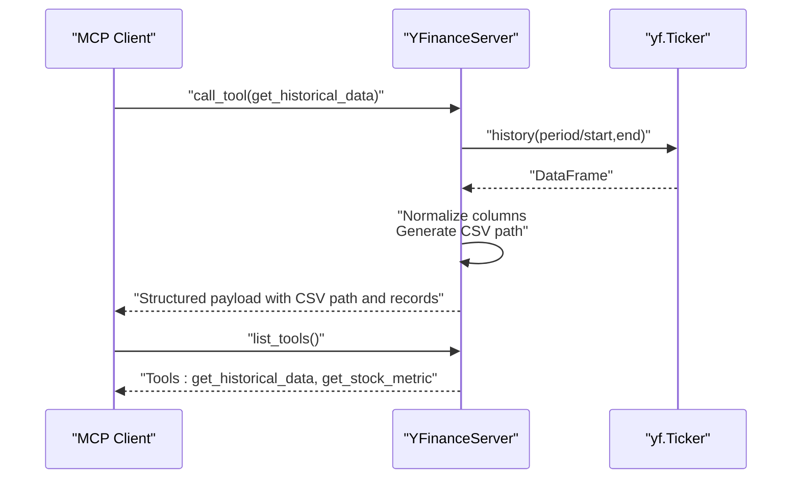
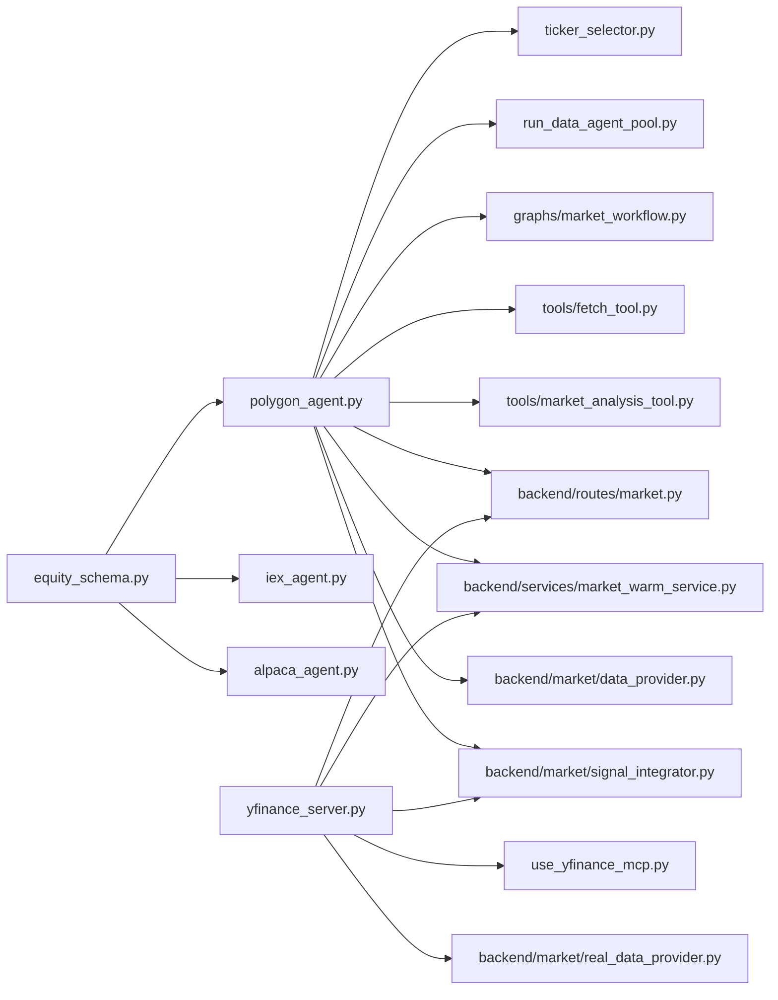

# Equity Market Data

<cite>
**Referenced Files in This Document**
- [polygon_agent.py](file://FinAgents/agent_pools/data_agent_pool/agents/equity/polygon_agent.py)
- [market_data.py](file://FinAgents/agent_pools/data_agent_pool/agents/equity/market_data.py)
- [iex_agent.py](file://FinAgents/agent_pools/data_agent_pool/agents/equity/iex_agent.py)
- [alpaca_agent.py](file://FinAgents/agent_pools/data_agent_pool/agents/equity/alpaca_agent.py)
- [yfinance_server.py](file://FinAgents/agent_pools/data_agent_pool/agents/equity/yfinance_server.py)
- [polygon.yaml](file://FinAgents/agent_pools/data_agent_pool/config/polygon.yaml)
- [iex.yaml](file://FinAgents/agent_pools/data_agent_pool/config/iex.yaml)
- [alpaca.yaml](file://FinAgents/agent_pools/data_agent_pool/config/alpaca.yaml)
- [alphavantage.yaml](file://FinAgents/agent_pools/data_agent_pool/config/alphavantage.yaml)
- [yfinance.yaml](file://FinAgents/agent_pools/data_agent_pool/config/yfinance.yaml)
- [equity_schema.py](file://FinAgents/agent_pools/data_agent_pool/schema/equity_schema.py)
- [use_yfinance_mcp.py](file://FinAgents/agent_pools/data_agent_pool/agents/equity/use_yfinance_mcp.py)
- [graphs/market_workflow.py](file://FinAgents/agent_pools/data_agent_pool/graphs/market_workflow.py)
- [tools/fetch_tool.py](file://FinAgents/agent_pools/data_agent_pool/tools/fetch_tool.py)
- [tools/market_analysis_tool.py](file://FinAgents/agent_pools/data_agent_pool/tools/market_analysis_tool.py)
- [ticker_selector.py](file://FinAgents/agent_pools/data_agent_pool/agents/equity/ticker_selector.py)
- [run_data_agent_pool.py](file://FinAgents/agent_pools/data_agent_pool/run_data_agent_pool.py)
- [main.py](file://main.py)
- [backend/routes/market.py](file://backend/routes/market.py)
- [backend/services/market_warm_service.py](file://backend/services/market_warm_service.py)
- [backend/market/data_provider.py](file://backend/market/data_provider.py)
- [backend/market/real_data_provider.py](file://backend/market/real_data_provider.py)
- [backend/market/signal_integrator.py](file://backend/market/signal_integrator.py)
- [backend/analytics/portfolio_analytics.py](file://backend/analytics/portfolio_analytics.py)
- [examples/polygon_batch_mcp_coordinated.csv](file://examples/polygon_batch_mcp_coordinated.csv)
- [examples/polygon_individual_mcp_coordinated.csv](file://examples/polygon_individual_mcp_coordinated.csv)
</cite>

## Table of Contents
1. [Introduction](#introduction)
2. [Project Structure](#project-structure)
3. [Core Components](#core-components)
4. [Architecture Overview](#architecture-overview)
5. [Detailed Component Analysis](#detailed-component-analysis)
6. [Dependency Analysis](#dependency-analysis)
7. [Performance Considerations](#performance-considerations)
8. [Troubleshooting Guide](#troubleshooting-guide)
9. [Conclusion](#conclusion)
10. [Appendices](#appendices)

## Introduction
This document describes the equity market data subsystem that integrates multiple US equity data providers: Polygon (formerly Polygon.io), AlphaVantage, IEX Cloud, Alpaca, and Yahoo Finance. It explains how provider-specific data is normalized into unified schemas, how real-time streaming and historical retrieval work, and how batch processing is orchestrated. It also covers configuration, rate limiting, data quality validation, and practical examples of queries and technical indicator calculations integrated with the broader trading system.

## Project Structure
The equity market data subsystem is organized around provider-specific agents, shared configuration, and integration points with the backend trading services and frontend.

```mermaid
graph TB
subgraph "Data Agent Pool"
PA["polygon_agent.py"]
MA["market_data.py"]
IA["iex_agent.py"]
AA["alpaca_agent.py"]
YA["yfinance_server.py"]
TS["ticker_selector.py"]
CFG["polygon.yaml<br/>iex.yaml<br/>alpaca.yaml<br/>alphavantage.yaml<br/>yfinance.yaml"]
SCH["equity_schema.py"]
end
subgraph "Integration"
RUN["run_data_agent_pool.py"]
WF["graphs/market_workflow.py"]
FT["tools/fetch_tool.py"]
MAT["tools/market_analysis_tool.py"]
UYF["use_yfinance_mcp.py"]
end
subgraph "Backend"
BR["backend/routes/market.py"]
BD["backend/services/market_warm_service.py"]
DP["backend/market/data_provider.py"]
DR["backend/market/real_data_provider.py"]
SI["backend/market/signal_integrator.py"]
PA --> BR
YA --> BR
PA --> BD
YA --> BD
PA --> DP
YA --> DR
PA --> SI
YA --> SI
end
PA --> CFG
IA --> CFG
AA --> CFG
YA --> CFG
PA --> SCH
IA --> SCH
AA --> SCH
MA --> CFG
MA --> SCH
PA --> TS
PA --> RUN
YA --> UYF
PA --> WF
PA --> FT
PA --> MAT
```

**Diagram sources**
- [polygon_agent.py:1-568](file://FinAgents/agent_pools/data_agent_pool/agents/equity/polygon_agent.py#L1-L568)
- [market_data.py:1-183](file://FinAgents/agent_pools/data_agent_pool/agents/equity/market_data.py#L1-L183)
- [iex_agent.py:1-21](file://FinAgents/agent_pools/data_agent_pool/agents/equity/iex_agent.py#L1-L21)
- [alpaca_agent.py:1-19](file://FinAgents/agent_pools/data_agent_pool/agents/equity/alpaca_agent.py#L1-L19)
- [yfinance_server.py:1-350](file://FinAgents/agent_pools/data_agent_pool/agents/equity/yfinance_server.py#L1-L350)
- [polygon.yaml:1-17](file://FinAgents/agent_pools/data_agent_pool/config/polygon.yaml#L1-L17)
- [iex.yaml:1-16](file://FinAgents/agent_pools/data_agent_pool/config/iex.yaml#L1-L16)
- [alpaca.yaml:1-16](file://FinAgents/agent_pools/data_agent_pool/config/alpaca.yaml#L1-L16)
- [alphavantage.yaml:1-48](file://FinAgents/agent_pools/data_agent_pool/config/alphavantage.yaml#L1-L48)
- [yfinance.yaml:1-45](file://FinAgents/agent_pools/data_agent_pool/config/yfinance.yaml#L1-L45)
- [equity_schema.py:1-34](file://FinAgents/agent_pools/data_agent_pool/schema/equity_schema.py#L1-L34)
- [run_data_agent_pool.py](file://FinAgents/agent_pools/data_agent_pool/run_data_agent_pool.py)
- [graphs/market_workflow.py](file://FinAgents/agent_pools/data_agent_pool/graphs/market_workflow.py)
- [tools/fetch_tool.py](file://FinAgents/agent_pools/data_agent_pool/tools/fetch_tool.py)
- [tools/market_analysis_tool.py](file://FinAgents/agent_pools/data_agent_pool/tools/market_analysis_tool.py)
- [ticker_selector.py](file://FinAgents/agent_pools/data_agent_pool/agents/equity/ticker_selector.py)
- [use_yfinance_mcp.py](file://FinAgents/agent_pools/data_agent_pool/agents/equity/use_yfinance_mcp.py)
- [backend/routes/market.py](file://backend/routes/market.py)
- [backend/services/market_warm_service.py](file://backend/services/market_warm_service.py)
- [backend/market/data_provider.py](file://backend/market/data_provider.py)
- [backend/market/real_data_provider.py](file://backend/market/real_data_provider.py)
- [backend/market/signal_integrator.py](file://backend/market/signal_integrator.py)

**Section sources**
- [polygon_agent.py:1-568](file://FinAgents/agent_pools/data_agent_pool/agents/equity/polygon_agent.py#L1-L568)
- [market_data.py:1-183](file://FinAgents/agent_pools/data_agent_pool/agents/equity/market_data.py#L1-L183)
- [iex_agent.py:1-21](file://FinAgents/agent_pools/data_agent_pool/agents/equity/iex_agent.py#L1-L21)
- [alpaca_agent.py:1-19](file://FinAgents/agent_pools/data_agent_pool/agents/equity/alpaca_agent.py#L1-L19)
- [yfinance_server.py:1-350](file://FinAgents/agent_pools/data_agent_pool/agents/equity/yfinance_server.py#L1-L350)
- [polygon.yaml:1-17](file://FinAgents/agent_pools/data_agent_pool/config/polygon.yaml#L1-L17)
- [iex.yaml:1-16](file://FinAgents/agent_pools/data_agent_pool/config/iex.yaml#L1-L16)
- [alpaca.yaml:1-16](file://FinAgents/agent_pools/data_agent_pool/config/alpaca.yaml#L1-L16)
- [alphavantage.yaml:1-48](file://FinAgents/agent_pools/data_agent_pool/config/alphavantage.yaml#L1-L48)
- [yfinance.yaml:1-45](file://FinAgents/agent_pools/data_agent_pool/config/yfinance.yaml#L1-L45)
- [equity_schema.py:1-34](file://FinAgents/agent_pools/data_agent_pool/schema/equity_schema.py#L1-L34)

## Core Components
- PolygonAgent: Provider-specific agent for Polygon.io with historical OHLCV, enriched fields (VWAP, pre/post market), company info, and top-ticker selection. Includes MCP server with natural language processing and tool-based interfaces.
- market_data.py: Standalone Polygon.io historical loader with caching and enrichment.
- IEXAgent: Minimal IEX Cloud integration with summary and quote endpoints.
- AlpacaAgent: Minimal Alpaca integration with quote and bar data stubs.
- YFinanceServer: MCP server exposing historical data and metrics via yfinance, with CSV export and resource endpoints.
- Configuration and Schema: Shared Pydantic models and YAML configs define provider endpoints, credentials, constraints, and feature flags.
- Tools and Workflow: Fetch tool, market analysis tool, and workflow graph coordinate batch and coordinated requests.

**Section sources**
- [polygon_agent.py:22-568](file://FinAgents/agent_pools/data_agent_pool/agents/equity/polygon_agent.py#L22-L568)
- [market_data.py:18-142](file://FinAgents/agent_pools/data_agent_pool/agents/equity/market_data.py#L18-L142)
- [iex_agent.py:4-21](file://FinAgents/agent_pools/data_agent_pool/agents/equity/iex_agent.py#L4-L21)
- [alpaca_agent.py:4-19](file://FinAgents/agent_pools/data_agent_pool/agents/equity/alpaca_agent.py#L4-L19)
- [yfinance_server.py:29-350](file://FinAgents/agent_pools/data_agent_pool/agents/equity/yfinance_server.py#L29-L350)
- [equity_schema.py:4-34](file://FinAgents/agent_pools/data_agent_pool/schema/equity_schema.py#L4-L34)
- [polygon.yaml:1-17](file://FinAgents/agent_pools/data_agent_pool/config/polygon.yaml#L1-L17)
- [iex.yaml:1-16](file://FinAgents/agent_pools/data_agent_pool/config/iex.yaml#L1-L16)
- [alpaca.yaml:1-16](file://FinAgents/agent_pools/data_agent_pool/config/alpaca.yaml#L1-L16)
- [alphavantage.yaml:1-48](file://FinAgents/agent_pools/data_agent_pool/config/alphavantage.yaml#L1-L48)
- [yfinance.yaml:1-45](file://FinAgents/agent_pools/data_agent_pool/config/yfinance.yaml#L1-L45)

## Architecture Overview
The subsystem integrates five providers through standardized agent interfaces and a shared configuration schema. PolygonAgent and YFinanceServer expose MCP servers for natural language and programmatic access. Historical data is cached locally and normalized into a unified schema. Real-time and streaming capabilities are primarily provided by YFinanceServer’s MCP transport and backend route handlers.

**Diagram sources**
- [polygon_agent.py:22-568](file://FinAgents/agent_pools/data_agent_pool/agents/equity/polygon_agent.py#L22-L568)
- [yfinance_server.py:29-350](file://FinAgents/agent_pools/data_agent_pool/agents/equity/yfinance_server.py#L29-L350)
- [iex_agent.py:4-21](file://FinAgents/agent_pools/data_agent_pool/agents/equity/iex_agent.py#L4-L21)
- [alpaca_agent.py:4-19](file://FinAgents/agent_pools/data_agent_pool/agents/equity/alpaca_agent.py#L4-L19)
- [market_data.py:18-142](file://FinAgents/agent_pools/data_agent_pool/agents/equity/market_data.py#L18-L142)
- [backend/routes/market.py](file://backend/routes/market.py)
- [backend/services/market_warm_service.py](file://backend/services/market_warm_service.py)
- [backend/market/data_provider.py](file://backend/market/data_provider.py)
- [backend/market/real_data_provider.py](file://backend/market/real_data_provider.py)
- [backend/market/signal_integrator.py](file://backend/market/signal_integrator.py)

## Detailed Component Analysis

### PolygonAgent
- Responsibilities:
  - Historical OHLCV retrieval with configurable intervals.
  - Enrichment of daily aggregates with VWAP, pre-market, after-hours, dividends, and splits.
  - Company reference data lookup.
  - Top ticker discovery via volume and volatility selector.
  - MCP server with tools for natural language processing and direct data fetching.
- Data normalization:
  - Converts provider timestamps to datetime index.
  - Standardizes column names to lowercase open/high/low/close/volume.
  - Adds derived fields (vwap, trades, pre_market, after_market, dividend, split).
- Real-time/streaming:
  - Exposes MCP tools for programmatic access; real-time streaming is not implemented in this agent.
- Batch processing:
  - Supports multi-step execution plans parsed from LLM output.
  - Caching per symbol/date/interval to reduce API calls.
- Configuration:
  - Uses PolygonConfig with base_url, endpoints, authentication, constraints, and llm_enabled flag.

**Diagram sources**
- [polygon_agent.py:22-568](file://FinAgents/agent_pools/data_agent_pool/agents/equity/polygon_agent.py#L22-L568)
- [equity_schema.py:4-34](file://FinAgents/agent_pools/data_agent_pool/schema/equity_schema.py#L4-L34)

**Section sources**
- [polygon_agent.py:22-568](file://FinAgents/agent_pools/data_agent_pool/agents/equity/polygon_agent.py#L22-L568)
- [equity_schema.py:29-34](file://FinAgents/agent_pools/data_agent_pool/schema/equity_schema.py#L29-L34)
- [polygon.yaml:1-17](file://FinAgents/agent_pools/data_agent_pool/config/polygon.yaml#L1-L17)

### market_data.py (Polygon.io Historical Loader)
- Responsibilities:
  - Loads historical OHLCV for a symbol within a date range.
  - Caches results to CSV for reuse.
  - Enriches daily bars with VWAP, trades, pre/post-market, dividends, and splits.
- Data normalization:
  - Ensures datetime index and lowercase column names.
  - Adds extra fields extracted from separate endpoints.
- Rate limiting:
  - Relies on provider limits; local caching reduces repeated calls.

**Diagram sources**
- [market_data.py:18-142](file://FinAgents/agent_pools/data_agent_pool/agents/equity/market_data.py#L18-L142)

**Section sources**
- [market_data.py:18-142](file://FinAgents/agent_pools/data_agent_pool/agents/equity/market_data.py#L18-L142)

### IEXAgent
- Responsibilities:
  - Provides market summary and quote stubs.
- Integration:
  - Minimal implementation; intended as a placeholder for IEX Cloud integration.

**Section sources**
- [iex_agent.py:4-21](file://FinAgents/agent_pools/data_agent_pool/agents/equity/iex_agent.py#L4-L21)
- [iex.yaml:1-16](file://FinAgents/agent_pools/data_agent_pool/config/iex.yaml#L1-L16)

### AlpacaAgent
- Responsibilities:
  - Provides equity quote and bar data stubs.
- Integration:
  - Minimal implementation; intended as a placeholder for Alpaca integration.

**Section sources**
- [alpaca_agent.py:4-19](file://FinAgents/agent_pools/data_agent_pool/agents/equity/alpaca_agent.py#L4-L19)
- [alpaca.yaml:1-16](file://FinAgents/agent_pools/data_agent_pool/config/alpaca.yaml#L1-L16)

### YFinanceServer (MCP)
- Responsibilities:
  - Exposes MCP tools for historical data retrieval and metric extraction.
  - Supports CSV export and resource endpoints for current stock info.
- Data normalization:
  - Standardizes OHLCV columns to lowercase and ensures date formatting.
- Streaming:
  - Uses MCP transport; real-time streaming is not implemented here.

**Diagram sources**
- [yfinance_server.py:229-336](file://FinAgents/agent_pools/data_agent_pool/agents/equity/yfinance_server.py#L229-L336)

**Section sources**
- [yfinance_server.py:29-350](file://FinAgents/agent_pools/data_agent_pool/agents/equity/yfinance_server.py#L29-L350)
- [yfinance.yaml:1-45](file://FinAgents/agent_pools/data_agent_pool/config/yfinance.yaml#L1-L45)

### Configuration Examples
- Polygon.io:
  - Base URL, endpoints, default interval, authentication key, constraints, and LLM enable flag.
- IEX Cloud:
  - Base URL, endpoints, default interval, API and secret keys, timeouts, and rate limits.
- Alpaca:
  - Base URL, endpoints, default interval, API and secret keys, timeouts, and rate limits.
- AlphaVantage:
  - Base URL, function endpoints, default function, API key, rate limits, request intervals, caching, and feature flags.
- Yahoo Finance:
  - Base URL, endpoints, default interval, optional caching, supported periods/intervals, features, and constraints.

**Section sources**
- [polygon.yaml:1-17](file://FinAgents/agent_pools/data_agent_pool/config/polygon.yaml#L1-L17)
- [iex.yaml:1-16](file://FinAgents/agent_pools/data_agent_pool/config/iex.yaml#L1-L16)
- [alpaca.yaml:1-16](file://FinAgents/agent_pools/data_agent_pool/config/alpaca.yaml#L1-L16)
- [alphavantage.yaml:1-48](file://FinAgents/agent_pools/data_agent_pool/config/alphavantage.yaml#L1-L48)
- [yfinance.yaml:1-45](file://FinAgents/agent_pools/data_agent_pool/config/yfinance.yaml#L1-L45)

### Data Normalization Processes
- Timestamp handling:
  - Convert numeric timestamps to datetime and set as index.
- Column standardization:
  - Rename provider-specific columns to unified lowercase names (open, high, low, close, volume).
- Enrichment pipeline:
  - For daily intervals, fetch daily open/close data to populate VWAP, pre-market, and after-hours fields.
  - Query dividends and splits endpoints to annotate corporate actions.
- Output schema:
  - Unified OHLCV plus derived fields for downstream analytics and trading systems.

**Section sources**
- [polygon_agent.py:241-246](file://FinAgents/agent_pools/data_agent_pool/agents/equity/polygon_agent.py#L241-L246)
- [market_data.py:69-142](file://FinAgents/agent_pools/data_agent_pool/agents/equity/market_data.py#L69-L142)

### Real-Time Streaming and Historical Retrieval
- Real-time streaming:
  - YFinanceServer exposes MCP transport for asynchronous tool execution; real-time streaming is not implemented in PolygonAgent.
- Historical retrieval:
  - PolygonAgent supports multi-day historical ranges with caching and enrichment.
  - YFinanceServer supports period-based and date-range historical retrievals with CSV export.

**Section sources**
- [polygon_agent.py:441-567](file://FinAgents/agent_pools/data_agent_pool/agents/equity/polygon_agent.py#L441-L567)
- [yfinance_server.py:251-336](file://FinAgents/agent_pools/data_agent_pool/agents/equity/yfinance_server.py#L251-L336)

### Batch Processing Workflows
- Coordinated requests:
  - Example CSV files demonstrate batch fetching via MCP coordination for individual and coordinated runs.
- Tool orchestration:
  - Fetch tool and market analysis tool integrate with the agent pool to execute batched queries.

**Section sources**
- [examples/polygon_batch_mcp_coordinated.csv](file://examples/polygon_batch_mcp_coordinated.csv)
- [examples/polygon_individual_mcp_coordinated.csv](file://examples/polygon_individual_mcp_coordinated.csv)
- [tools/fetch_tool.py](file://FinAgents/agent_pools/data_agent_pool/tools/fetch_tool.py)
- [tools/market_analysis_tool.py](file://FinAgents/agent_pools/data_agent_pool/tools/market_analysis_tool.py)

### Integration with the Broader Trading System
- Backend routes:
  - Market route handlers integrate with agents to serve normalized data to the frontend and analytics.
- Warm services:
  - Market warm service preloads data to improve responsiveness.
- Data providers:
  - Data provider and real data provider abstractions encapsulate data access for the trading engine.
- Signal integrator:
  - Normalized market data feeds into the signal integration layer for downstream processing.

**Section sources**
- [backend/routes/market.py](file://backend/routes/market.py)
- [backend/services/market_warm_service.py](file://backend/services/market_warm_service.py)
- [backend/market/data_provider.py](file://backend/market/data_provider.py)
- [backend/market/real_data_provider.py](file://backend/market/real_data_provider.py)
- [backend/market/signal_integrator.py](file://backend/market/signal_integrator.py)

## Dependency Analysis
The subsystem exhibits clear separation of concerns:
- Agents depend on shared configuration and schema models.
- PolygonAgent depends on MCP tooling and LLM chain for natural language processing.
- YFinanceServer depends on yfinance and MCP libraries.
- Backend services depend on agents for data provisioning.

**Diagram sources**
- [equity_schema.py:1-34](file://FinAgents/agent_pools/data_agent_pool/schema/equity_schema.py#L1-L34)
- [polygon_agent.py:1-568](file://FinAgents/agent_pools/data_agent_pool/agents/equity/polygon_agent.py#L1-L568)
- [iex_agent.py:1-21](file://FinAgents/agent_pools/data_agent_pool/agents/equity/iex_agent.py#L1-L21)
- [alpaca_agent.py:1-19](file://FinAgents/agent_pools/data_agent_pool/agents/equity/alpaca_agent.py#L1-L19)
- [yfinance_server.py:1-350](file://FinAgents/agent_pools/data_agent_pool/agents/equity/yfinance_server.py#L1-L350)
- [use_yfinance_mcp.py](file://FinAgents/agent_pools/data_agent_pool/agents/equity/use_yfinance_mcp.py)
- [run_data_agent_pool.py](file://FinAgents/agent_pools/data_agent_pool/run_data_agent_pool.py)
- [graphs/market_workflow.py](file://FinAgents/agent_pools/data_agent_pool/graphs/market_workflow.py)
- [tools/fetch_tool.py](file://FinAgents/agent_pools/data_agent_pool/tools/fetch_tool.py)
- [tools/market_analysis_tool.py](file://FinAgents/agent_pools/data_agent_pool/tools/market_analysis_tool.py)
- [ticker_selector.py](file://FinAgents/agent_pools/data_agent_pool/agents/equity/ticker_selector.py)
- [backend/routes/market.py](file://backend/routes/market.py)
- [backend/services/market_warm_service.py](file://backend/services/market_warm_service.py)
- [backend/market/data_provider.py](file://backend/market/data_provider.py)
- [backend/market/real_data_provider.py](file://backend/market/real_data_provider.py)
- [backend/market/signal_integrator.py](file://backend/market/signal_integrator.py)

**Section sources**
- [polygon_agent.py:1-568](file://FinAgents/agent_pools/data_agent_pool/agents/equity/polygon_agent.py#L1-L568)
- [yfinance_server.py:1-350](file://FinAgents/agent_pools/data_agent_pool/agents/equity/yfinance_server.py#L1-L350)
- [equity_schema.py:1-34](file://FinAgents/agent_pools/data_agent_pool/schema/equity_schema.py#L1-L34)

## Performance Considerations
- Caching:
  - Local CSV caching reduces redundant API calls and accelerates repeated queries.
- Interval mapping:
  - Efficiently maps human-readable intervals to provider-specific multipliers and time spans.
- Request batching:
  - Use MCP coordinated batch flows to minimize overhead and leverage provider throughput.
- Rate limiting:
  - Respect provider rate limits; configure timeouts and retry policies accordingly.
- Data normalization:
  - Minimize transformations by standardizing early and enriching incrementally.

[No sources needed since this section provides general guidance]

## Troubleshooting Guide
- API errors:
  - PolygonAgent raises runtime errors on non-200 responses and validates presence of results.
  - YFinanceServer logs and raises runtime errors for invalid arguments or empty datasets.
- Configuration validation:
  - PolygonAgent validates presence of API keys and LLM enable flag.
- Data quality:
  - Empty results trigger graceful fallbacks; verify date ranges and intervals.
- Rate limiting:
  - Adjust timeouts and retry attempts per provider constraints; monitor rate_limit_per_minute.

**Section sources**
- [polygon_agent.py:223-229](file://FinAgents/agent_pools/data_agent_pool/agents/equity/polygon_agent.py#L223-L229)
- [yfinance_server.py:232-250](file://FinAgents/agent_pools/data_agent_pool/agents/equity/yfinance_server.py#L232-L250)
- [polygon_agent.py:55-60](file://FinAgents/agent_pools/data_agent_pool/agents/equity/polygon_agent.py#L55-L60)
- [polygon.yaml:14-16](file://FinAgents/agent_pools/data_agent_pool/config/polygon.yaml#L14-L16)
- [yfinance.yaml:40-45](file://FinAgents/agent_pools/data_agent_pool/config/yfinance.yaml#L40-L45)

## Conclusion
The equity market data subsystem provides a robust, extensible foundation for integrating multiple US equity data providers. Through standardized configuration, shared schemas, and MCP-based tooling, it normalizes diverse provider formats into a unified OHLCV schema with enriched fields. Historical retrieval, caching, and batch processing workflows support efficient backtesting and live trading. While real-time streaming is not fully implemented in the PolygonAgent, YFinanceServer offers MCP-based asynchronous access suitable for near-real-time scenarios.

[No sources needed since this section summarizes without analyzing specific files]

## Appendices

### Practical Examples
- Market data queries:
  - Use PolygonAgent’s MCP tools to fetch historical data for a symbol and date range.
  - Use YFinanceServer’s get_historical_data tool to retrieve period-based or date-range data with CSV export.
- Technical indicators:
  - Apply rolling means, RSI, MACD, and Bollinger Bands on the normalized OHLCV DataFrame produced by the agents.
- Integration with trading system:
  - Route normalized data through backend routes and services to feed analytics and execution layers.

[No sources needed since this section provides general guidance]