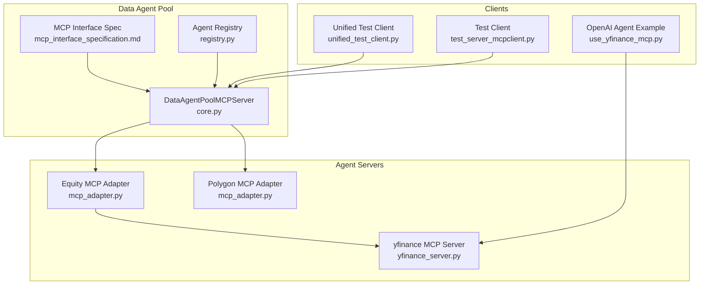
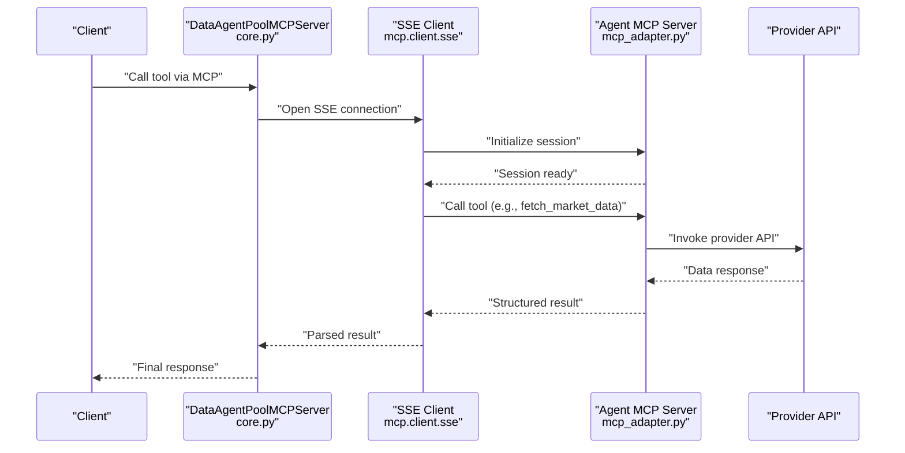
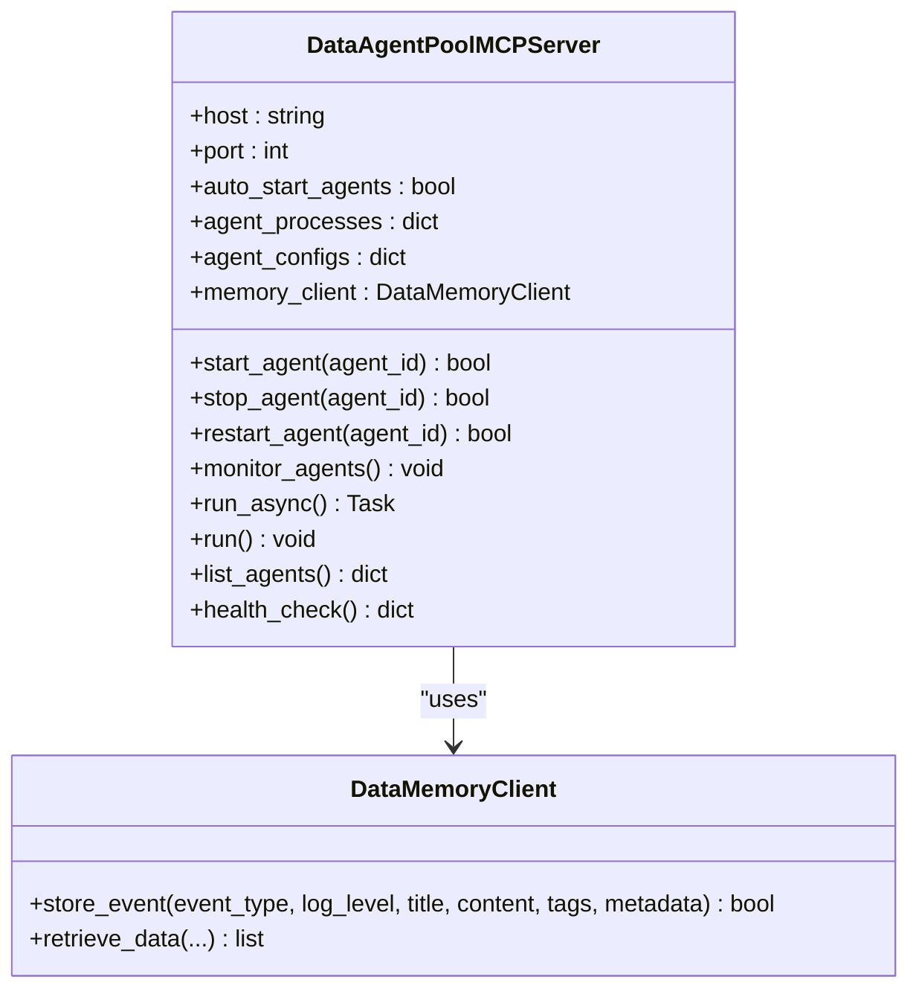
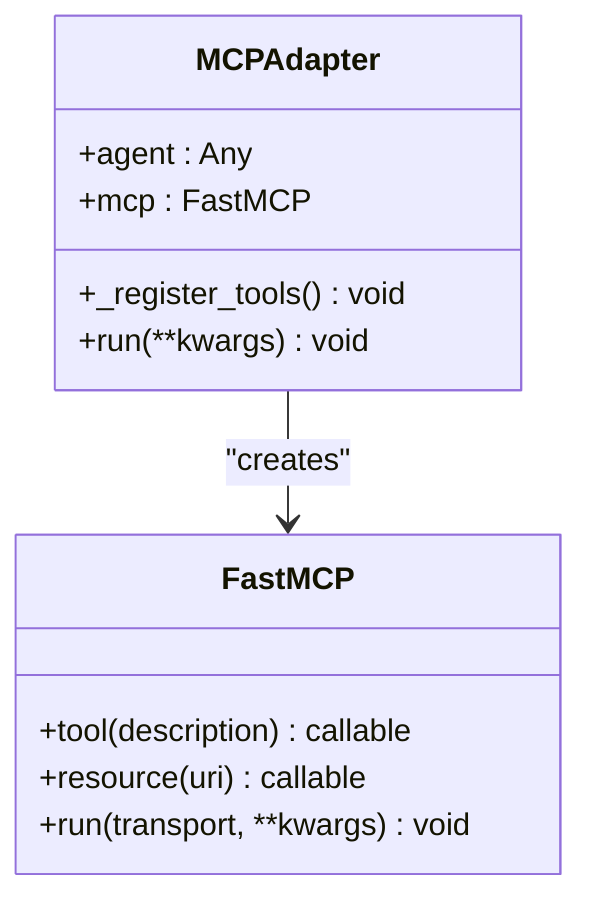
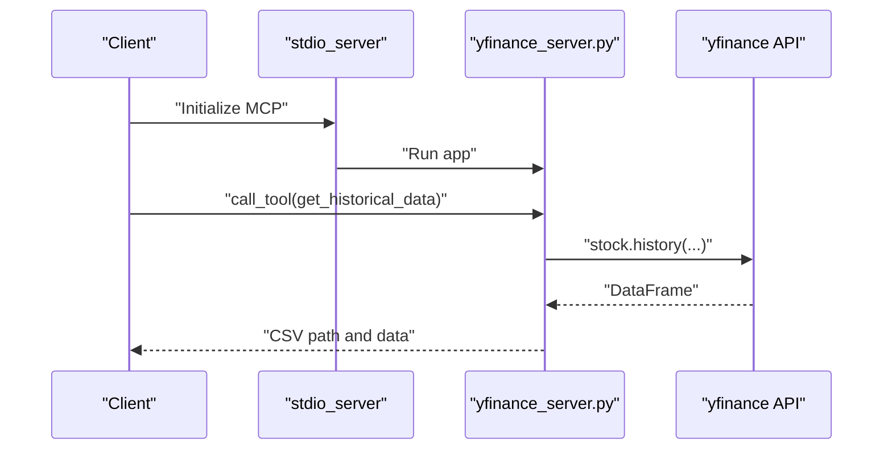
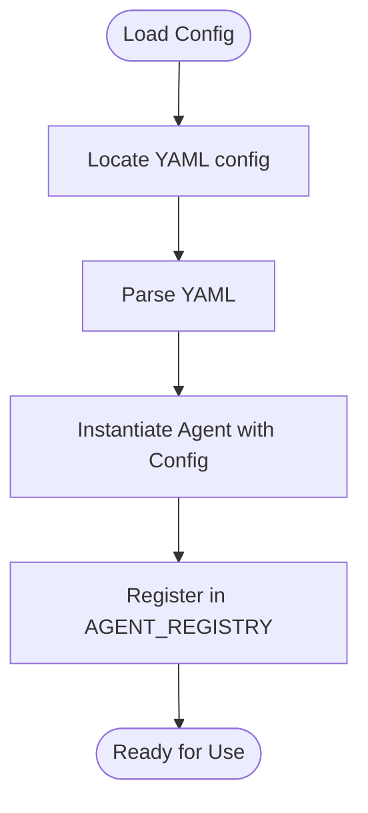
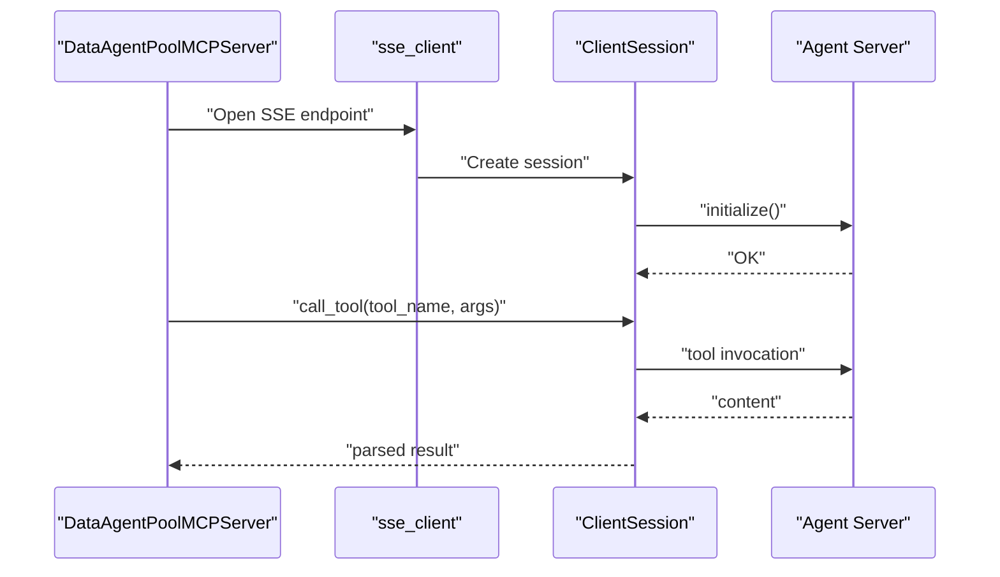
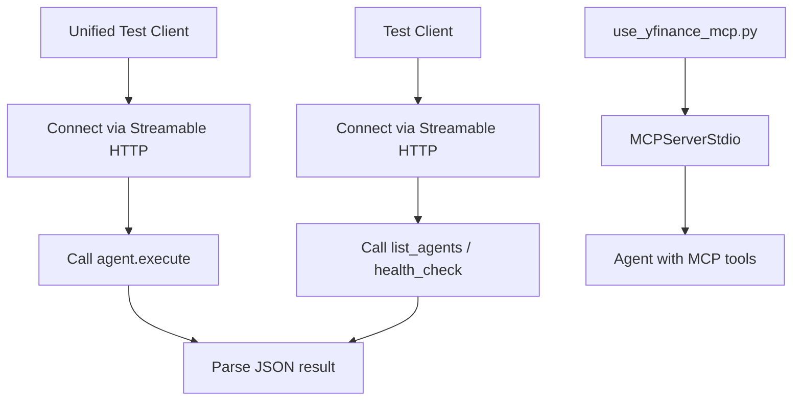
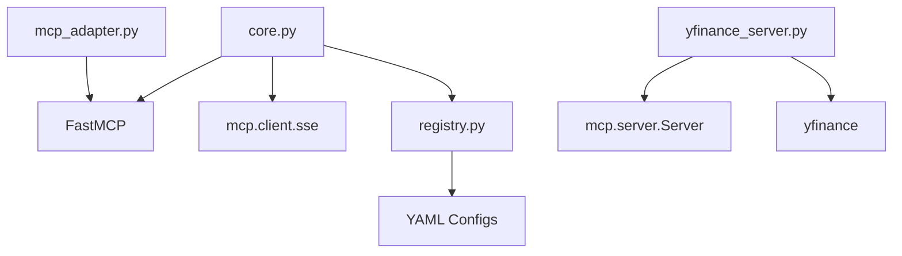

# Model Context Protocol Integration

<cite>
**Referenced Files in This Document**
- [mcp_interface_specification.md](file://FinAgents/agent_pools/data_agent_pool/mcp_interface_specification.md)
- [mcp_server.py](file://FinAgents/agent_pools/data_agent_pool/mcp_server.py)
- [core.py](file://FinAgents/agent_pools/data_agent_pool/core.py)
- [mcp_adapter.py](file://FinAgents/agent_pools/data_agent_pool/agents/equity/mcp_adapter.py)
- [yfinance_server.py](file://FinAgents/agent_pools/data_agent_pool/agents/equity/yfinance_server.py)
- [server.py](file://FinAgents/agent_pools/data_agent_pool/agents/equity/server.py)
- [registry.py](file://FinAgents/agent_pools/data_agent_pool/registry.py)
- [test_server_mcpclient.py](file://FinAgents/agent_pools/data_agent_pool/tests/test_server_mcpclient.py)
- [unified_test_client.py](file://FinAgents/agent_pools/data_agent_pool/unified_test_client.py)
- [fetch_tool.py](file://FinAgents/agent_pools/data_agent_pool/tools/fetch_tool.py)
- [market_analysis_tool.py](file://FinAgents/agent_pools/data_agent_pool/tools/market_analysis_tool.py)
- [use_yfinance_mcp.py](file://FinAgents/agent_pools/data_agent_pool/agents/equity/use_yfinance_mcp.py)
</cite>

## Table of Contents
1. [Introduction](#introduction)
2. [Project Structure](#project-structure)
3. [Core Components](#core-components)
4. [Architecture Overview](#architecture-overview)
5. [Detailed Component Analysis](#detailed-component-analysis)
6. [Dependency Analysis](#dependency-analysis)
7. [Performance Considerations](#performance-considerations)
8. [Troubleshooting Guide](#troubleshooting-guide)
9. [Conclusion](#conclusion)
10. [Appendices](#appendices)

## Introduction
This document explains the Model Context Protocol (MCP) integration within the Data Agent Pool. It covers the MCP server architecture, tool registration, inter-agent communication patterns, the MCP interface specification, message formats, protocol compliance, and the SSE client implementation for real-time streaming. It also provides examples of MCP tool development, client-server communication, error handling strategies, and guidelines for extending the MCP protocol with custom tools and integrating new data providers.

## Project Structure
The MCP integration spans several modules:
- Interface specification and protocol compliance
- Data Agent Pool MCP server and coordinator
- Individual agent MCP adapters and servers
- Registry and configuration loading
- Tests and example clients
- Tools for LangChain integration

**Diagram sources**
- [core.py:66-800](file://FinAgents/agent_pools/data_agent_pool/core.py#L66-L800)
- [mcp_adapter.py:1-61](file://FinAgents/agent_pools/data_agent_pool/agents/equity/mcp_adapter.py#L1-L61)
- [yfinance_server.py:1-350](file://FinAgents/agent_pools/data_agent_pool/agents/equity/yfinance_server.py#L1-L350)
- [registry.py:89-141](file://FinAgents/agent_pools/data_agent_pool/registry.py#L89-L141)
- [mcp_interface_specification.md:1-198](file://FinAgents/agent_pools/data_agent_pool/mcp_interface_specification.md#L1-L198)
- [unified_test_client.py:1-58](file://FinAgents/agent_pools/data_agent_pool/unified_test_client.py#L1-L58)
- [test_server_mcpclient.py:1-42](file://FinAgents/agent_pools/data_agent_pool/tests/test_server_mcpclient.py#L1-L42)
- [use_yfinance_mcp.py:1-233](file://FinAgents/agent_pools/data_agent_pool/agents/equity/use_yfinance_mcp.py#L1-L233)

**Section sources**
- [mcp_interface_specification.md:1-198](file://FinAgents/agent_pools/data_agent_pool/mcp_interface_specification.md#L1-L198)
- [core.py:66-800](file://FinAgents/agent_pools/data_agent_pool/core.py#L66-L800)
- [mcp_adapter.py:1-61](file://FinAgents/agent_pools/data_agent_pool/agents/equity/mcp_adapter.py#L1-L61)
- [yfinance_server.py:1-350](file://FinAgents/agent_pools/data_agent_pool/agents/equity/yfinance_server.py#L1-L350)
- [registry.py:89-141](file://FinAgents/agent_pools/data_agent_pool/registry.py#L89-L141)
- [unified_test_client.py:1-58](file://FinAgents/agent_pools/data_agent_pool/unified_test_client.py#L1-L58)
- [test_server_mcpclient.py:1-42](file://FinAgents/agent_pools/data_agent_pool/tests/test_server_mcpclient.py#L1-L42)
- [use_yfinance_mcp.py:1-233](file://FinAgents/agent_pools/data_agent_pool/agents/equity/use_yfinance_mcp.py#L1-L233)

## Core Components
- MCP Interface Specification: Defines roles, methods, capability schemas, lifecycle, error handling, and governance.
- DataAgentPoolMCPServer: Central coordinator that starts agent processes, proxies tools, monitors health, and integrates memory.
- Agent MCP Adapters: Wrap agents and expose their capabilities as MCP tools.
- Individual Agent Servers: Standalone MCP servers for specific providers (e.g., yfinance).
- Registry: Loads and registers agents with configurations.
- Clients and Tests: Unified test client, MCP client tests, and OpenAI agent example.

**Section sources**
- [mcp_interface_specification.md:10-198](file://FinAgents/agent_pools/data_agent_pool/mcp_interface_specification.md#L10-L198)
- [core.py:66-800](file://FinAgents/agent_pools/data_agent_pool/core.py#L66-L800)
- [mcp_adapter.py:1-61](file://FinAgents/agent_pools/data_agent_pool/agents/equity/mcp_adapter.py#L1-L61)
- [yfinance_server.py:1-350](file://FinAgents/agent_pools/data_agent_pool/agents/equity/yfinance_server.py#L1-L350)
- [registry.py:89-141](file://FinAgents/agent_pools/data_agent_pool/registry.py#L89-L141)
- [unified_test_client.py:1-58](file://FinAgents/agent_pools/data_agent_pool/unified_test_client.py#L1-L58)
- [test_server_mcpclient.py:1-42](file://FinAgents/agent_pools/data_agent_pool/tests/test_server_mcpclient.py#L1-L42)
- [use_yfinance_mcp.py:1-233](file://FinAgents/agent_pools/data_agent_pool/agents/equity/use_yfinance_mcp.py#L1-L233)

## Architecture Overview
The Data Agent Pool uses MCP to unify heterogeneous data providers behind a cohesive interface. The pool server registers coordinating tools and proxies calls to individual agent MCP servers. Agents can run as standalone servers or be adapted into MCP endpoints. SSE is used for client-server streaming transport.

**Diagram sources**
- [core.py:339-373](file://FinAgents/agent_pools/data_agent_pool/core.py#L339-L373)
- [mcp_adapter.py:20-39](file://FinAgents/agent_pools/data_agent_pool/agents/equity/mcp_adapter.py#L20-L39)
- [yfinance_server.py:229-336](file://FinAgents/agent_pools/data_agent_pool/agents/equity/yfinance_server.py#L229-L336)

## Detailed Component Analysis

### MCP Interface Specification
- Roles: Orchestrator (Host), MCP Client SDK (Client), Data Agent (Server)
- Core Methods: agent.execute, server.register, agent.heartbeat
- Capability Schema: agent_id, tools, resources, schema, constraints
- Lifecycle: Startup (register), Invocation (execute), Execution, Monitoring (heartbeat)
- Error Handling: Standard JSON-RPC error format and common codes
- Security: Authentication, authorization, traceability, prompt governance

**Section sources**
- [mcp_interface_specification.md:10-198](file://FinAgents/agent_pools/data_agent_pool/mcp_interface_specification.md#L10-L198)

### Data Agent Pool MCP Server
Responsibilities:
- Manage agent processes (start, stop, restart, monitor)
- Provide unified MCP tools (natural language queries, direct fetch, batch fetch, health checks)
- Proxy calls to individual agent servers using SSE client
- Integrate with memory client for event storage
- Graceful shutdown and signal handling

Key implementation highlights:
- Process management and health checks using subprocess and SSE
- Tool registration for coordinating operations
- Memory integration for storing market data events
- Background monitoring loop for resilience

**Diagram sources**
- [core.py:66-800](file://FinAgents/agent_pools/data_agent_pool/core.py#L66-L800)
- [core.py:40-50](file://FinAgents/agent_pools/data_agent_pool/core.py#L40-L50)

**Section sources**
- [core.py:66-800](file://FinAgents/agent_pools/data_agent_pool/core.py#L66-L800)

### Agent MCP Adapter
Exposes agent capabilities as MCP tools:
- health_check
- fetch_market_data
- analyze_company
- identify_leaders
- process_intent (if available)

The adapter wraps an agent instance and registers tools dynamically. It supports both synchronous and asynchronous tool execution.

**Diagram sources**
- [mcp_adapter.py:1-61](file://FinAgents/agent_pools/data_agent_pool/agents/equity/mcp_adapter.py#L1-L61)

**Section sources**
- [mcp_adapter.py:1-61](file://FinAgents/agent_pools/data_agent_pool/agents/equity/mcp_adapter.py#L1-L61)

### Standalone yfinance MCP Server
A complete MCP server exposing:
- Resources: finance://{symbol}/info
- Tools: get_historical_data, get_stock_metric
- Streaming transport via stdio

**Diagram sources**
- [yfinance_server.py:229-336](file://FinAgents/agent_pools/data_agent_pool/agents/equity/yfinance_server.py#L229-L336)

**Section sources**
- [yfinance_server.py:1-350](file://FinAgents/agent_pools/data_agent_pool/agents/equity/yfinance_server.py#L1-L350)

### Agent Registry and Configuration
- Loads YAML configs per agent
- Preloads default agents into a global registry
- Supports dynamic agent startup and server launching

**Diagram sources**
- [registry.py:82-124](file://FinAgents/agent_pools/data_agent_pool/registry.py#L82-L124)

**Section sources**
- [registry.py:89-141](file://FinAgents/agent_pools/data_agent_pool/registry.py#L89-L141)

### SSE Client Implementation
The pool uses the MCP SSE client to communicate with agent servers:
- Establishes SSE connection to agent endpoints
- Initializes a ClientSession
- Calls tools and parses structured content
- Handles errors and timeouts

**Diagram sources**
- [core.py:339-373](file://FinAgents/agent_pools/data_agent_pool/core.py#L339-L373)

**Section sources**
- [core.py:339-373](file://FinAgents/agent_pools/data_agent_pool/core.py#L339-L373)

### MCP Tool Development Examples
- Unified Test Client: Demonstrates calling agent.execute across multiple agents
- Test Client: Exercises list_agents, agent_status, health_check
- OpenAI Agent Example: Shows connecting an MCP server to an LLM agent

**Diagram sources**
- [unified_test_client.py:1-58](file://FinAgents/agent_pools/data_agent_pool/unified_test_client.py#L1-L58)
- [test_server_mcpclient.py:1-42](file://FinAgents/agent_pools/data_agent_pool/tests/test_server_mcpclient.py#L1-L42)
- [use_yfinance_mcp.py:127-144](file://FinAgents/agent_pools/data_agent_pool/agents/equity/use_yfinance_mcp.py#L127-L144)

**Section sources**
- [unified_test_client.py:1-58](file://FinAgents/agent_pools/data_agent_pool/unified_test_client.py#L1-L58)
- [test_server_mcpclient.py:1-42](file://FinAgents/agent_pools/data_agent_pool/tests/test_server_mcpclient.py#L1-L42)
- [use_yfinance_mcp.py:1-233](file://FinAgents/agent_pools/data_agent_pool/agents/equity/use_yfinance_mcp.py#L1-L233)

### Inter-Agent Communication Patterns
- Centralized coordination via DataAgentPoolMCPServer
- Proxies to individual agent servers using SSE
- Optional internal A2A communication for decentralized collaboration (outside MCP control)
- Stateless agents or externally backed state for scalability

**Section sources**
- [mcp_interface_specification.md:192-198](file://FinAgents/agent_pools/data_agent_pool/mcp_interface_specification.md#L192-L198)
- [core.py:339-373](file://FinAgents/agent_pools/data_agent_pool/core.py#L339-L373)

## Dependency Analysis
- DataAgentPoolMCPServer depends on FastMCP, SSE client, and agent processes
- Agent MCP adapters depend on FastMCP and wrap agent instances
- Standalone servers depend on MCP Server and provider libraries
- Registry depends on YAML configs and agent classes

**Diagram sources**
- [core.py:51-54](file://FinAgents/agent_pools/data_agent_pool/core.py#L51-L54)
- [mcp_adapter.py:1](file://FinAgents/agent_pools/data_agent_pool/agents/equity/mcp_adapter.py#L1)
- [yfinance_server.py:9-19](file://FinAgents/agent_pools/data_agent_pool/agents/equity/yfinance_server.py#L9-L19)
- [registry.py:80-88](file://FinAgents/agent_pools/data_agent_pool/registry.py#L80-L88)

**Section sources**
- [core.py:51-54](file://FinAgents/agent_pools/data_agent_pool/core.py#L51-L54)
- [mcp_adapter.py:1](file://FinAgents/agent_pools/data_agent_pool/agents/equity/mcp_adapter.py#L1)
- [yfinance_server.py:9-19](file://FinAgents/agent_pools/data_agent_pool/agents/equity/yfinance_server.py#L9-L19)
- [registry.py:80-88](file://FinAgents/agent_pools/data_agent_pool/registry.py#L80-L88)

## Performance Considerations
- Stateless HTTP transport for streamable MCP improves throughput and reduces overhead
- Background monitoring and automatic restarts maintain availability
- Asynchronous SSE client prevents blocking during network calls
- Memory integration for event storage avoids recomputation and enables audit trails

[No sources needed since this section provides general guidance]

## Troubleshooting Guide
Common issues and strategies:
- Unknown agent_id: Ensure agent is registered in the registry and reachable via SSE endpoint
- Execution failures: Inspect provider API responses and handle exceptions in agent wrappers
- Timeout or unreachable: Increase timeouts, check network connectivity, and validate SSE endpoints
- Heartbeat anomalies: Confirm periodic heartbeats are enabled and logged

**Section sources**
- [mcp_server.py:22-29](file://FinAgents/agent_pools/data_agent_pool/mcp_server.py#L22-L29)
- [core.py:339-373](file://FinAgents/agent_pools/data_agent_pool/core.py#L339-L373)
- [mcp_interface_specification.md:156-180](file://FinAgents/agent_pools/data_agent_pool/mcp_interface_specification.md#L156-L180)

## Conclusion
The Data Agent Pool integrates MCP to provide a standardized, extensible interface across diverse data providers. The pool coordinates agent processes, exposes unified tools, and ensures resilience through monitoring and SSE-based streaming. The interface specification, adapters, and registry enable straightforward extension with new tools and providers.

[No sources needed since this section summarizes without analyzing specific files]

## Appendices

### MCP Message Formats and Compliance
- agent.execute request/response
- server.register request
- agent.heartbeat request
- Error format and common codes

**Section sources**
- [mcp_interface_specification.md:20-180](file://FinAgents/agent_pools/data_agent_pool/mcp_interface_specification.md#L20-L180)

### Extending MCP with Custom Tools and Providers
- Define agent capabilities and schemas
- Implement tools in agent adapters or standalone servers
- Register tools with FastMCP
- Integrate with the DataAgentPoolMCPServer for coordination

**Section sources**
- [mcp_adapter.py:13-58](file://FinAgents/agent_pools/data_agent_pool/agents/equity/mcp_adapter.py#L13-L58)
- [yfinance_server.py:65-227](file://FinAgents/agent_pools/data_agent_pool/agents/equity/yfinance_server.py#L65-L227)
- [core.py:374-587](file://FinAgents/agent_pools/data_agent_pool/core.py#L374-L587)