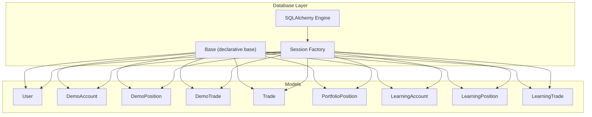
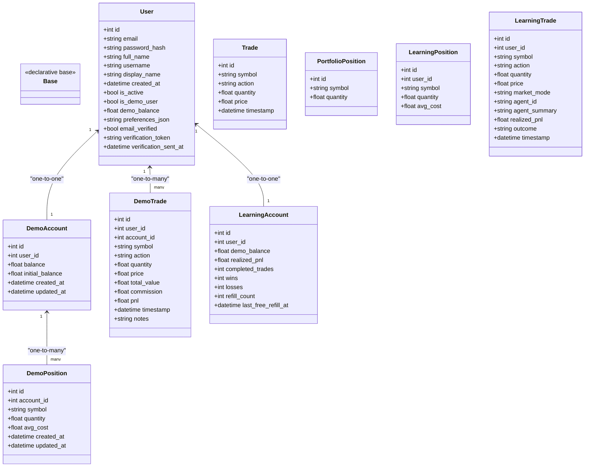
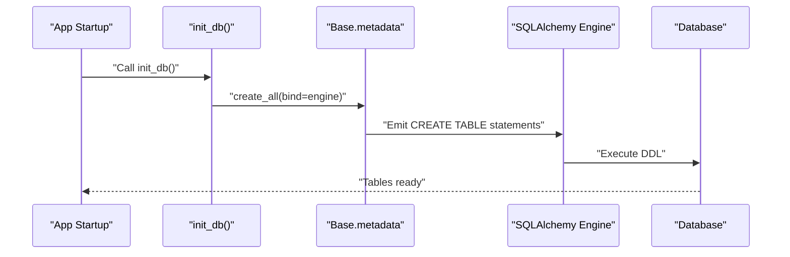
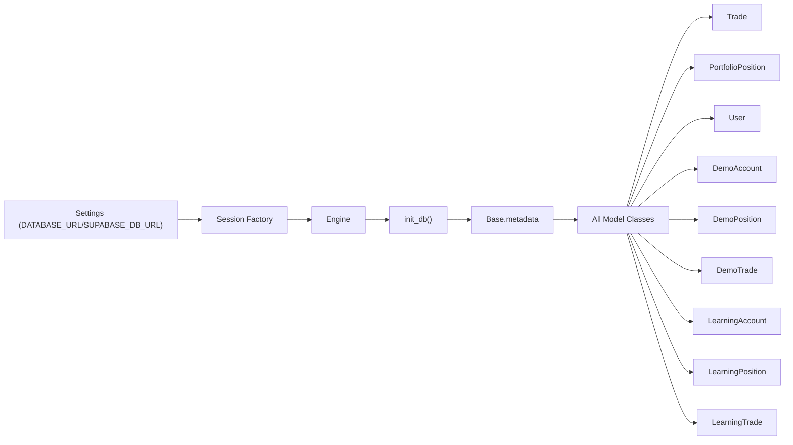

# Database Models

<cite>
**Referenced Files in This Document**
- [backend/db/models/__init__.py](file://backend/db/models/__init__.py)
- [backend/db/base.py](file://backend/db/base.py)
- [backend/db/session.py](file://backend/db/session.py)
- [backend/db/init_db.py](file://backend/db/init_db.py)
- [backend/config/settings.py](file://backend/config/settings.py)
- [backend/db/models/user.py](file://backend/db/models/user.py)
- [backend/db/models/trade.py](file://backend/db/models/trade.py)
- [backend/db/models/portfolio_position.py](file://backend/db/models/portfolio_position.py)
- [backend/db/models/learning_account.py](file://backend/db/models/learning_account.py)
- [backend/db/models/learning_position.py](file://backend/db/models/learning_position.py)
- [backend/db/models/learning_trade.py](file://backend/db/models/learning_trade.py)
</cite>

## Table of Contents
1. [Introduction](#introduction)
2. [Project Structure](#project-structure)
3. [Core Components](#core-components)
4. [Architecture Overview](#architecture-overview)
5. [Detailed Component Analysis](#detailed-component-analysis)
6. [Dependency Analysis](#dependency-analysis)
7. [Performance Considerations](#performance-considerations)
8. [Troubleshooting Guide](#troubleshooting-guide)
9. [Conclusion](#conclusion)
10. [Appendices](#appendices)

## Introduction
This document describes the database schema and data models that support the trading platform. It covers the entities for users, trades, portfolio positions, and learning accounts, along with their relationships, constraints, and typical usage patterns. It also documents database initialization, migration strategies, and performance considerations derived from the repository’s SQLAlchemy setup.

## Project Structure
The database layer is organized around SQLAlchemy declarative models under a shared base class. Models are grouped by domain:
- Users and demo accounts/positions/trades
- Real trading trades and portfolio positions
- Learning accounts, positions, and trades



**Diagram sources**
- [backend/db/base.py:1-5](file://backend/db/base.py#L1-L5)
- [backend/db/session.py:1-29](file://backend/db/session.py#L1-L29)
- [backend/db/models/user.py:1-76](file://backend/db/models/user.py#L1-L76)
- [backend/db/models/trade.py:1-20](file://backend/db/models/trade.py#L1-L20)
- [backend/db/models/portfolio_position.py:1-13](file://backend/db/models/portfolio_position.py#L1-L13)
- [backend/db/models/learning_account.py:1-18](file://backend/db/models/learning_account.py#L1-L18)
- [backend/db/models/learning_position.py:1-14](file://backend/db/models/learning_position.py#L1-L14)
- [backend/db/models/learning_trade.py:1-23](file://backend/db/models/learning_trade.py#L1-L23)

**Section sources**
- [backend/db/models/__init__.py:1-19](file://backend/db/models/__init__.py#L1-L19)
- [backend/db/base.py:1-5](file://backend/db/base.py#L1-L5)
- [backend/db/session.py:1-29](file://backend/db/session.py#L1-L29)
- [backend/db/init_db.py:1-13](file://backend/db/init_db.py#L1-L13)
- [backend/config/settings.py:1-85](file://backend/config/settings.py#L1-L85)

## Core Components
This section documents each model, including fields, data types, primary/foreign keys, and constraints. It also explains relationships and how they connect trading activities to user accounts and position tracking.

- User
  - Purpose: Core user account with authentication and profile fields.
  - Fields: id (primary key), email (unique, indexed), password_hash, full_name, username (unique, indexed), display_name, created_at, is_active, is_demo_user, demo_balance, preferences_json, email_verified, verification_token (indexed), verification_sent_at.
  - Relationships: One-to-one with DemoAccount; one-to-many with DemoTrade; one-to-one with LearningAccount.
  - Constraints: Unique constraints on email and username; non-null defaults for several numeric fields; boolean flags for account state and verification.

- DemoAccount
  - Purpose: Demo trading account per user.
  - Fields: id (primary key), user_id (foreign key to users), balance, initial_balance, created_at, updated_at.
  - Relationships: Belongs to one User; one-to-many with DemoPosition.
  - Constraints: Unique constraint on user_id; defaults for balances; timestamps.

- DemoPosition
  - Purpose: Tracks open positions in demo trading.
  - Fields: id (primary key), account_id (foreign key to demo_accounts), symbol (indexed), quantity, avg_cost, created_at, updated_at.
  - Relationships: Belongs to one DemoAccount.
  - Constraints: Foreign key to demo_accounts; defaults for quantities; indexed symbol for fast lookups.

- DemoTrade
  - Purpose: Records demo trades executed by a user.
  - Fields: id (primary key), user_id (foreign key to users), account_id (foreign key to demo_accounts), symbol (indexed), action (BUY/SELL), quantity, price, total_value, commission, pnl, timestamp (indexed), notes.
  - Relationships: Belongs to User and DemoAccount.
  - Constraints: Indexed symbol and timestamp; computed total_value from quantity and price.

- Trade
  - Purpose: Generic trade record for real trading (no user linkage here).
  - Fields: id (primary key), symbol (indexed), action, quantity, price, timestamp (indexed).
  - Constraints: Indexed symbol and timestamp.

- PortfolioPosition
  - Purpose: Aggregated portfolio holdings summary.
  - Fields: id (primary key), symbol (unique, indexed), quantity.
  - Constraints: Unique symbol ensures single holding per symbol.

- LearningAccount
  - Purpose: Learning/training account metrics and state.
  - Fields: id (primary key), user_id (foreign key to users, unique, indexed), demo_balance, realized_pnl, completed_trades, wins, losses, refill_count, last_free_refill_at.
  - Relationships: One-to-one with User.
  - Constraints: Unique user_id; defaults for numeric metrics.

- LearningPosition
  - Purpose: Per-symbol positions in learning mode.
  - Fields: id (primary key), user_id (foreign key to users, indexed), symbol (indexed), quantity, avg_cost.
  - Relationships: No explicit back-populated relationship in this model.

- LearningTrade
  - Purpose: Recorded trades in learning mode with agent metadata and outcomes.
  - Fields: id (primary key), user_id (foreign key to users, indexed), symbol (indexed), action, quantity, price, market_mode, agent_id, agent_summary, realized_pnl, outcome (OPEN by default), timestamp (indexed).
  - Constraints: Indexed symbol and timestamp; default OPEN outcome.

**Section sources**
- [backend/db/models/user.py:1-76](file://backend/db/models/user.py#L1-L76)
- [backend/db/models/trade.py:1-20](file://backend/db/models/trade.py#L1-L20)
- [backend/db/models/portfolio_position.py:1-13](file://backend/db/models/portfolio_position.py#L1-L13)
- [backend/db/models/learning_account.py:1-18](file://backend/db/models/learning_account.py#L1-L18)
- [backend/db/models/learning_position.py:1-14](file://backend/db/models/learning_position.py#L1-L14)
- [backend/db/models/learning_trade.py:1-23](file://backend/db/models/learning_trade.py#L1-L23)

## Architecture Overview
The database architecture follows a layered pattern:
- Declarative base class defines ORM models.
- Session factory provides scoped sessions.
- Initialization creates tables for declared models.
- Settings configure the database URL and optional Supabase override.



**Diagram sources**
- [backend/db/base.py:1-5](file://backend/db/base.py#L1-L5)
- [backend/db/models/user.py:1-76](file://backend/db/models/user.py#L1-L76)
- [backend/db/models/trade.py:1-20](file://backend/db/models/trade.py#L1-L20)
- [backend/db/models/portfolio_position.py:1-13](file://backend/db/models/portfolio_position.py#L1-L13)
- [backend/db/models/learning_account.py:1-18](file://backend/db/models/learning_account.py#L1-L18)
- [backend/db/models/learning_position.py:1-14](file://backend/db/models/learning_position.py#L1-L14)
- [backend/db/models/learning_trade.py:1-23](file://backend/db/models/learning_trade.py#L1-L23)

## Detailed Component Analysis

### Entity Relationships and Constraints
- Users own demo accounts and trades; demo positions reference demo accounts.
- Users own learning accounts and learning trades; learning positions reference users.
- Generic trades and portfolio positions are standalone records without user linkage in these models.

```mermaid
erDiagram
USERS {
int id PK
string email UK
string username UK
bool is_active
float demo_balance
datetime created_at
}
DEMO_ACCOUNTS {
int id PK
int user_id FK
float balance
float initial_balance
datetime created_at
datetime updated_at
}
DEMO_POSITIONS {
int id PK
int account_id FK
string symbol
float quantity
float avg_cost
datetime created_at
datetime updated_at
}
DEMO_TRADES {
int id PK
int user_id FK
int account_id FK
string symbol
string action
float quantity
float price
float total_value
float commission
float pnl
datetime timestamp
}
TRADES {
int id PK
string symbol
string action
float quantity
float price
datetime timestamp
}
PORTFOLIO_POSITIONS {
int id PK
string symbol UK
float quantity
}
LEARNING_ACCOUNTS {
int id PK
int user_id FK UK
float demo_balance
float realized_pnl
int completed_trades
int wins
int losses
int refill_count
datetime last_free_refill_at
}
LEARNING_POSITIONS {
int id PK
int user_id FK
string symbol
float quantity
float avg_cost
}
LEARNING_TRADES {
int id PK
int user_id FK
string symbol
string action
float quantity
float price
string market_mode
string agent_id
string agent_summary
float realized_pnl
string outcome
datetime timestamp
}
USERS ||--o| DEMO_ACCOUNTS : "owns"
DEMO_ACCOUNTS ||--o{ DEMO_POSITIONS : "holds"
USERS ||--o{ DEMO_TRADES : "executes"
DEMO_ACCOUNTS ||--o{ DEMO_TRADES : "via"
USERS ||--o| LEARNING_ACCOUNTS : "owns"
USERS ||--o{ LEARNING_POSITIONS : "holds"
USERS ||--o{ LEARNING_TRADES : "executes"
TRADES ||--|| PORTFOLIO_POSITIONS : "summarizes"
```

**Diagram sources**
- [backend/db/models/user.py:1-76](file://backend/db/models/user.py#L1-L76)
- [backend/db/models/trade.py:1-20](file://backend/db/models/trade.py#L1-L20)
- [backend/db/models/portfolio_position.py:1-13](file://backend/db/models/portfolio_position.py#L1-L13)
- [backend/db/models/learning_account.py:1-18](file://backend/db/models/learning_account.py#L1-L18)
- [backend/db/models/learning_position.py:1-14](file://backend/db/models/learning_position.py#L1-L14)
- [backend/db/models/learning_trade.py:1-23](file://backend/db/models/learning_trade.py#L1-L23)

### Position Tracking Mechanisms
- Demo positions track symbol, quantity, and average cost per account.
- Learning positions track symbol, quantity, and average cost per user.
- Portfolio positions maintain a unique symbol with aggregated quantity.

Valuation calculation is not implemented in these models. Typical approaches include:
- Market value = SUM(quantity * current_price(symbol)) across positions.
- Unrealized PnL per position = (current_price - avg_cost) * quantity.
- Realized PnL is tracked per learning trade and account.

[No sources needed since this section provides general guidance]

### Portfolio Valuation Calculations
- Current value of a symbol = quantity × current_price(symbol).
- Total portfolio value = sum of all symbol values.
- PnL metrics can be computed by comparing current value to cost basis.

[No sources needed since this section provides general guidance]

### Database Initialization Procedures
- Initialization creates tables for all models imported into the models module initializer.
- The engine is configured via settings, with SQLite as default and optional Supabase override.



**Diagram sources**
- [backend/db/init_db.py:1-13](file://backend/db/init_db.py#L1-L13)
- [backend/db/session.py:1-29](file://backend/db/session.py#L1-L29)
- [backend/config/settings.py:1-85](file://backend/config/settings.py#L1-L85)

**Section sources**
- [backend/db/init_db.py:1-13](file://backend/db/init_db.py#L1-L13)
- [backend/db/session.py:1-29](file://backend/db/session.py#L1-L29)
- [backend/config/settings.py:1-85](file://backend/config/settings.py#L1-L85)

### Migration Strategies
- Current setup uses SQLAlchemy’s metadata creation for schema generation.
- Recommended migration approach:
  - Use Alembic with the existing Base class and models.
  - Initialize migrations from current metadata state.
  - Generate incremental revisions as schema evolves.
  - Apply migrations in deployment pipelines.

[No sources needed since this section provides general guidance]

### Data Access Patterns and Common Queries
Below are typical query patterns inferred from model fields and relationships. Replace placeholders with actual values and add filters as needed.

- Retrieve user demo account and positions
  - Join DemoAccount with DemoPosition on account_id
  - Filter by user_id

- Get recent demo trades for a user
  - Filter DemoTrade by user_id and timestamp range
  - Order by timestamp descending

- Find a user’s learning account
  - Filter LearningAccount by user_id

- Get learning trades for a symbol and user
  - Filter LearningTrade by user_id and symbol
  - Optionally filter by outcome or market_mode

- Aggregate portfolio positions
  - Group by symbol in PortfolioPosition
  - Sum quantities per symbol

- Compute realized PnL for a learning account
  - Sum realized_pnl from LearningTrade where user_id matches

[No sources needed since this section provides general guidance]

## Dependency Analysis
The models depend on a shared declarative base and are initialized through a centralized initializer that binds to the configured engine.



**Diagram sources**
- [backend/config/settings.py:1-85](file://backend/config/settings.py#L1-L85)
- [backend/db/session.py:1-29](file://backend/db/session.py#L1-L29)
- [backend/db/init_db.py:1-13](file://backend/db/init_db.py#L1-L13)
- [backend/db/models/__init__.py:1-19](file://backend/db/models/__init__.py#L1-L19)

**Section sources**
- [backend/db/models/__init__.py:1-19](file://backend/db/models/__init__.py#L1-L19)
- [backend/db/session.py:1-29](file://backend/db/session.py#L1-L29)
- [backend/db/init_db.py:1-13](file://backend/db/init_db.py#L1-L13)

## Performance Considerations
- Indexing: Several models define index=True on frequently filtered or joined columns (e.g., symbol, timestamp, user_id). This improves query performance for lookups and joins.
- Unique constraints: Unique indexes on email, username, user_id in related tables reduce duplication and speed up lookups.
- Pooling and ping: The engine enables pool_pre_ping and uses a modern sessionmaker configuration, aiding reliability in multi-threaded environments.
- SQLite note: The engine allows cross-thread access for SQLite by disabling thread checking, suitable for development but review for production needs.

[No sources needed since this section provides general guidance]

## Troubleshooting Guide
- Schema not created
  - Ensure init_db() is invoked during startup and that all relevant models are imported before create_all().
  - Verify DATABASE_URL or SUPABASE_DB_URL is set correctly.

- Connection issues
  - Confirm engine configuration and that get_settings() loads environment variables.
  - For SQLite, ensure the path exists and is writable.

- Missing tables after migration
  - If using Alembic, ensure migrations are applied and head revision aligns with current models.

[No sources needed since this section provides general guidance]

## Conclusion
The database layer provides a clear separation of concerns across user accounts, demo trading, learning mode, and generic trade/position summaries. The schema supports efficient lookups through strategic indexing and enforces referential integrity via foreign keys. Initialization and session management are straightforward, enabling quick bootstrapping. Extending to production-grade migrations and performance tuning should focus on Alembic-based migrations and connection pooling best practices.

## Appendices

### Appendix A: Field Reference Summary
- Users: id, email (unique), username (unique), password_hash, full_name, display_name, created_at, is_active, is_demo_user, demo_balance, preferences_json, email_verified, verification_token (indexed), verification_sent_at.
- DemoAccount: id, user_id (FK), balance, initial_balance, created_at, updated_at.
- DemoPosition: id, account_id (FK), symbol (indexed), quantity, avg_cost, created_at, updated_at.
- DemoTrade: id, user_id (FK), account_id (FK), symbol (indexed), action, quantity, price, total_value, commission, pnl, timestamp (indexed), notes.
- Trade: id, symbol (indexed), action, quantity, price, timestamp (indexed).
- PortfolioPosition: id, symbol (unique), quantity.
- LearningAccount: id, user_id (FK, unique), demo_balance, realized_pnl, completed_trades, wins, losses, refill_count, last_free_refill_at.
- LearningPosition: id, user_id (FK), symbol (indexed), quantity, avg_cost.
- LearningTrade: id, user_id (FK), symbol (indexed), action, quantity, price, market_mode, agent_id, agent_summary, realized_pnl, outcome, timestamp (indexed).

**Section sources**
- [backend/db/models/user.py:1-76](file://backend/db/models/user.py#L1-L76)
- [backend/db/models/trade.py:1-20](file://backend/db/models/trade.py#L1-L20)
- [backend/db/models/portfolio_position.py:1-13](file://backend/db/models/portfolio_position.py#L1-L13)
- [backend/db/models/learning_account.py:1-18](file://backend/db/models/learning_account.py#L1-L18)
- [backend/db/models/learning_position.py:1-14](file://backend/db/models/learning_position.py#L1-L14)
- [backend/db/models/learning_trade.py:1-23](file://backend/db/models/learning_trade.py#L1-L23)