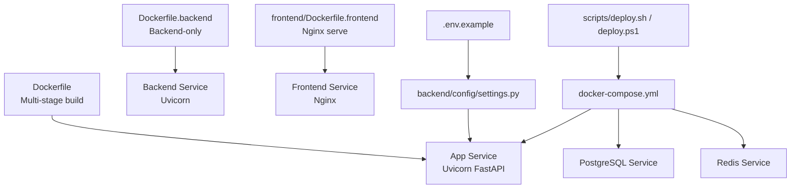
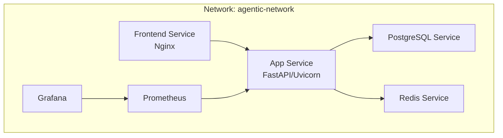
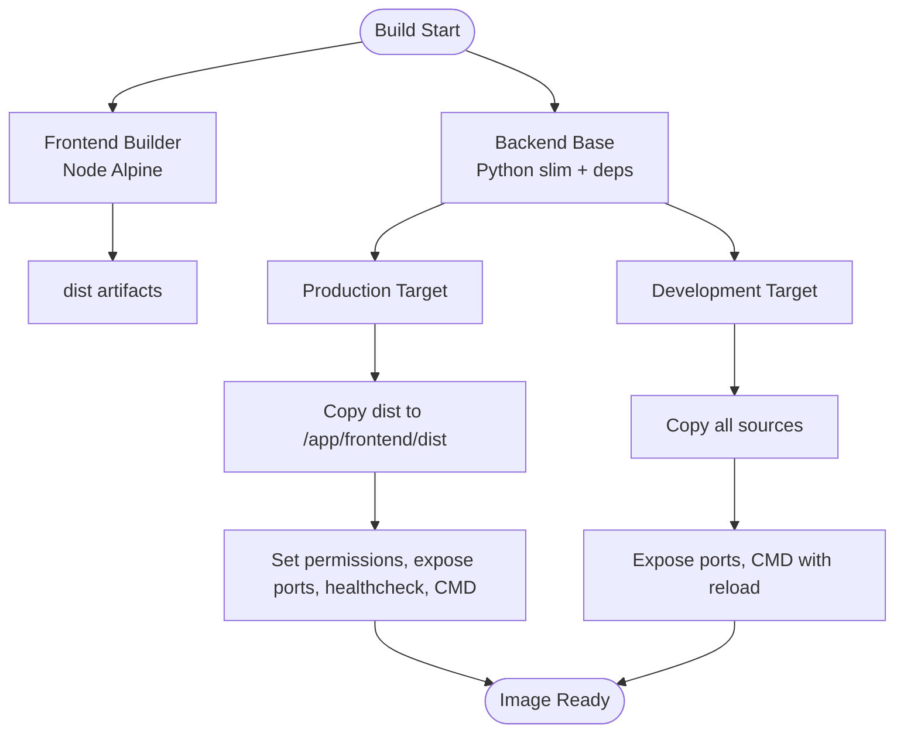
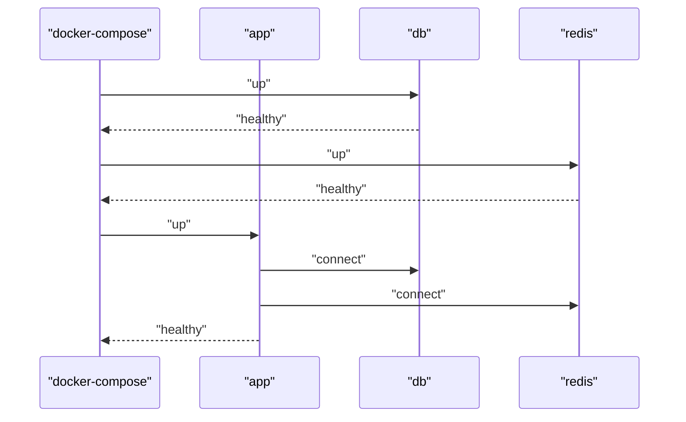
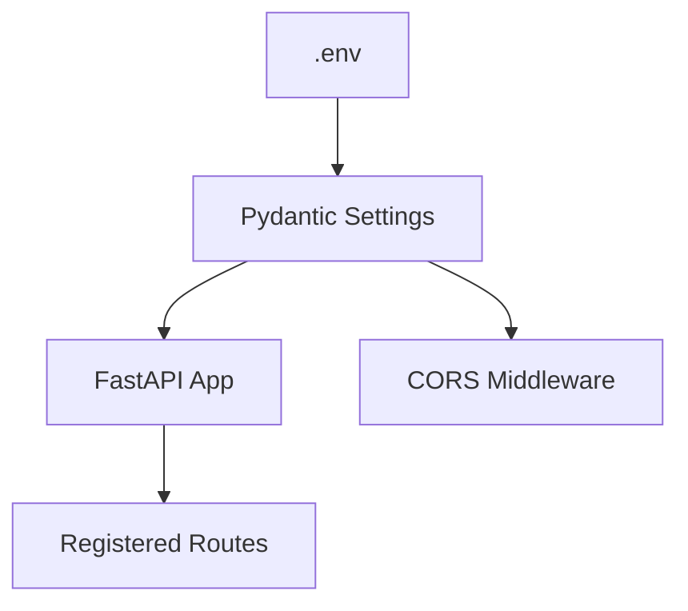
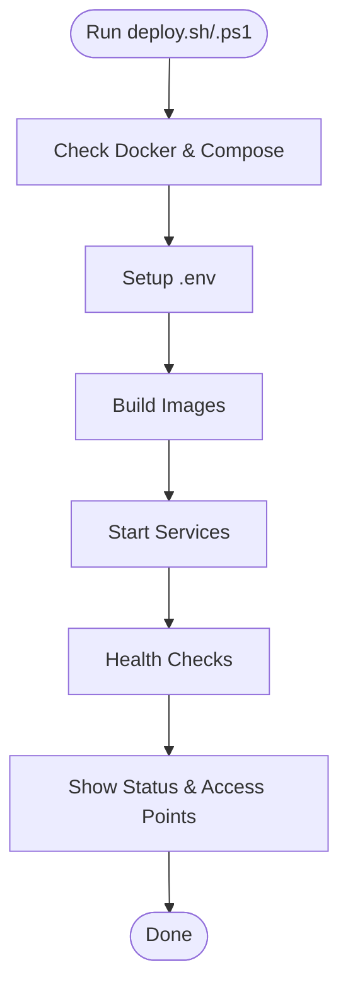
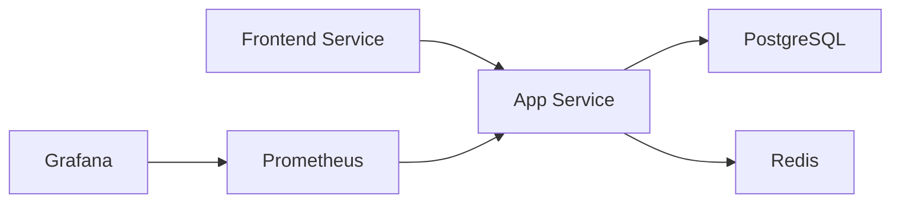

# Containerization and Deployment

<cite>
**Referenced Files in This Document**
- [Dockerfile](file://Dockerfile)
- [Dockerfile.backend](file://Dockerfile.backend)
- [frontend/Dockerfile](file://frontend/Dockerfile)
- [frontend/Dockerfile.frontend](file://frontend/Dockerfile.frontend)
- [docker-compose.yml](file://docker-compose.yml)
- [scripts/deploy.sh](file://scripts/deploy.sh)
- [scripts/deploy.ps1](file://scripts/deploy.ps1)
- [.env.example](file://.env.example)
- [backend/config/settings.py](file://backend/config/settings.py)
- [backend/api/main.py](file://backend/api/main.py)
- [main.py](file://main.py)
- [requirements.txt](file://requirements.txt)
</cite>

## Table of Contents
1. [Introduction](#introduction)
2. [Project Structure](#project-structure)
3. [Core Components](#core-components)
4. [Architecture Overview](#architecture-overview)
5. [Detailed Component Analysis](#detailed-component-analysis)
6. [Dependency Analysis](#dependency-analysis)
7. [Performance Considerations](#performance-considerations)
8. [Troubleshooting Guide](#troubleshooting-guide)
9. [Conclusion](#conclusion)
10. [Appendices](#appendices)

## Introduction
This document provides comprehensive containerization and deployment guidance for the Agentic Trading Application. It covers multi-stage Docker builds for both frontend and backend, docker-compose orchestration, environment-specific configurations, deployment scripts, initialization procedures, and production best practices. The goal is to enable repeatable, secure, and scalable deployments across development, staging, and production environments.

## Project Structure
The repository includes dedicated Docker assets, docker-compose orchestration, and deployment automation scripts. The key elements are:
- Multi-stage Dockerfile for monolithic production image
- Separate Dockerfiles for backend and frontend services
- docker-compose definition for multi-service orchestration
- Cross-platform deployment scripts for Linux/macOS and Windows
- Environment configuration via .env and Pydantic settings
- FastAPI application bootstrapped from main.py

**Diagram sources**
- [Dockerfile:1-110](file://Dockerfile#L1-L110)
- [Dockerfile.backend:1-20](file://Dockerfile.backend#L1-L20)
- [frontend/Dockerfile.frontend:1-26](file://frontend/Dockerfile.frontend#L1-L26)
- [docker-compose.yml:1-166](file://docker-compose.yml#L1-L166)
- [scripts/deploy.sh:1-194](file://scripts/deploy.sh#L1-L194)
- [scripts/deploy.ps1:1-180](file://scripts/deploy.ps1#L1-L180)
- [.env.example:1-111](file://.env.example#L1-L111)
- [backend/config/settings.py:1-85](file://backend/config/settings.py#L1-L85)

**Section sources**
- [Dockerfile:1-110](file://Dockerfile#L1-L110)
- [docker-compose.yml:1-166](file://docker-compose.yml#L1-L166)
- [scripts/deploy.sh:1-194](file://scripts/deploy.sh#L1-L194)
- [scripts/deploy.ps1:1-180](file://scripts/deploy.ps1#L1-L180)
- [.env.example:1-111](file://.env.example#L1-L111)
- [backend/config/settings.py:1-85](file://backend/config/settings.py#L1-L85)

## Core Components
- Monolithic Docker image with multi-stage build:
  - Frontend build stage using Node.js Alpine
  - Backend base stage with Python slim and system dependencies
  - Production stage with non-root user, health checks, and Uvicorn entrypoint
  - Development stage with hot reload and dev tools
- Backend-only Dockerfile for isolated backend service
- Frontend Dockerfile with Nginx serving built assets
- docker-compose orchestration defining app, db, redis, optional frontend, and monitoring stack
- Deployment scripts for Linux/macOS and Windows with environment-aware behavior
- Environment configuration via .env and Pydantic settings

**Section sources**
- [Dockerfile:1-110](file://Dockerfile#L1-L110)
- [Dockerfile.backend:1-20](file://Dockerfile.backend#L1-L20)
- [frontend/Dockerfile.frontend:1-26](file://frontend/Dockerfile.frontend#L1-L26)
- [docker-compose.yml:1-166](file://docker-compose.yml#L1-L166)
- [scripts/deploy.sh:1-194](file://scripts/deploy.sh#L1-L194)
- [scripts/deploy.ps1:1-180](file://scripts/deploy.ps1#L1-L180)
- [.env.example:1-111](file://.env.example#L1-L111)
- [backend/config/settings.py:1-85](file://backend/config/settings.py#L1-L85)

## Architecture Overview
The system runs as a multi-container application:
- Application service exposes FastAPI endpoints and serves static frontend assets
- PostgreSQL stores application data
- Redis provides caching and session storage
- Optional frontend service serves the React SPA via Nginx
- Optional monitoring stack (Prometheus and Grafana) for metrics and dashboards

**Diagram sources**
- [docker-compose.yml:3-166](file://docker-compose.yml#L3-L166)

**Section sources**
- [docker-compose.yml:3-166](file://docker-compose.yml#L3-L166)

## Detailed Component Analysis

### Multi-Stage Docker Build (Monolithic)
The primary Dockerfile implements a four-stage build:
- Stage 1: Frontend builder using Node.js Alpine to compile assets
- Stage 2: Backend base with Python slim, system packages, and pip-installed dependencies
- Stage 3: Production image with non-root user, copied backend code and built frontend, health checks, and Uvicorn command
- Stage 4: Development image with dev dependencies and hot reload enabled

**Diagram sources**
- [Dockerfile:1-110](file://Dockerfile#L1-L110)

**Section sources**
- [Dockerfile:1-110](file://Dockerfile#L1-L110)

### Backend Dockerfile (Backend-only)
A simplified backend-only image:
- Uses Python slim base
- Installs system and Python dependencies
- Copies application source and exposes port 8000
- Runs Uvicorn with multiple workers

**Section sources**
- [Dockerfile.backend:1-20](file://Dockerfile.backend#L1-L20)

### Frontend Dockerfile (Nginx Serve)
A two-stage frontend image:
- Builder stage installs dependencies and builds assets
- Runtime stage serves built assets via Nginx with custom config
- Exposes port 80 and runs Nginx daemon

**Section sources**
- [frontend/Dockerfile.frontend:1-26](file://frontend/Dockerfile.frontend#L1-L26)

### docker-compose Orchestration
The compose file defines:
- app service: monolithic image, environment variables, env_file, volumes, depends_on, healthchecks, and network attachment
- db service: PostgreSQL with persistent volumes, init script, healthcheck, and port mapping
- redis service: Redis persistence, healthcheck, and port mapping
- frontend service: optional separate frontend container
- monitoring stack: Prometheus and Grafana with persistent volumes and provisioning
- named volumes for persistence
- custom bridge network

**Diagram sources**
- [docker-compose.yml:7-42](file://docker-compose.yml#L7-L42)
- [docker-compose.yml:47-66](file://docker-compose.yml#L47-L66)
- [docker-compose.yml:71-86](file://docker-compose.yml#L71-L86)

**Section sources**
- [docker-compose.yml:1-166](file://docker-compose.yml#L1-L166)

### Environment Configuration and Settings
- Environment variables are loaded via .env and consumed by Pydantic settings
- Settings include database, cache, auth, API, CORS, market providers, risk, transaction costs, logging, and metrics
- The FastAPI app reads settings and applies CORS middleware and route registration

**Diagram sources**
- [.env.example:1-111](file://.env.example#L1-L111)
- [backend/config/settings.py:1-85](file://backend/config/settings.py#L1-L85)
- [backend/api/main.py:111-147](file://backend/api/main.py#L111-L147)

**Section sources**
- [.env.example:1-111](file://.env.example#L1-L111)
- [backend/config/settings.py:1-85](file://backend/config/settings.py#L1-L85)
- [backend/api/main.py:1-148](file://backend/api/main.py#L1-L148)
- [main.py:1-2](file://main.py#L1-L2)

### Deployment Scripts
Cross-platform deployment scripts automate:
- Prerequisite checks (Docker and Docker Compose)
- Environment setup (.env creation and secure secret generation for production)
- Image building (development builds both app and frontend; production builds app with production target)
- Service startup (development starts app, db, redis, frontend; production starts app, db, redis)
- Health checks against API, database, and cache
- Status reporting and useful commands

**Diagram sources**
- [scripts/deploy.sh:158-194](file://scripts/deploy.sh#L158-L194)
- [scripts/deploy.ps1:144-180](file://scripts/deploy.ps1#L144-L180)

**Section sources**
- [scripts/deploy.sh:1-194](file://scripts/deploy.sh#L1-L194)
- [scripts/deploy.ps1:1-180](file://scripts/deploy.ps1#L1-L180)

## Dependency Analysis
- Application service depends on database and cache services
- Frontend service optionally depends on the application service
- Monitoring services depend on the application for metrics scraping
- Environment variables drive service configuration and feature toggles
- Python dependencies are declared in requirements.txt and installed during backend build stages

**Diagram sources**
- [docker-compose.yml:3-166](file://docker-compose.yml#L3-L166)

**Section sources**
- [docker-compose.yml:1-166](file://docker-compose.yml#L1-L166)
- [requirements.txt:1-17](file://requirements.txt#L1-L17)

## Performance Considerations
- Multi-stage builds reduce final image size and attack surface
- Non-root user improves security posture
- Health checks enable automatic restarts and readiness gates
- Persistent volumes ensure data durability across restarts
- Uvicorn workers and optimized base images improve runtime performance
- Frontend served via Nginx reduces application load and improves asset delivery

[No sources needed since this section provides general guidance]

## Troubleshooting Guide
Common containerization issues and resolutions:
- Health check failures:
  - Inspect service logs for startup errors
  - Verify environment variables and connectivity to db/redis
  - Confirm migrations and seed routines executed
- Port conflicts:
  - Adjust host port mappings in docker-compose
  - Ensure no conflicting containers are running
- Volume permission errors:
  - Confirm ownership and permissions for mounted directories
  - Rebuild with proper chown steps
- Network connectivity:
  - Validate custom bridge network and service names
  - Ensure depends_on conditions match healthcheck expectations
- Frontend not loading:
  - Confirm frontend service is reachable and Nginx configured correctly
  - Verify build artifacts were copied into the image

**Section sources**
- [docker-compose.yml:35-40](file://docker-compose.yml#L35-L40)
- [Dockerfile:78-83](file://Dockerfile#L78-L83)
- [scripts/deploy.sh:100-129](file://scripts/deploy.sh#L100-L129)
- [scripts/deploy.ps1:80-115](file://scripts/deploy.ps1#L80-L115)

## Conclusion
The Agentic Trading Application provides a robust, production-ready containerization and deployment framework. The multi-stage Docker builds, orchestrated docker-compose setup, and cross-platform deployment scripts enable consistent deployments across environments. By following the outlined procedures and best practices, teams can reliably operate the system in development, staging, and production.

[No sources needed since this section summarizes without analyzing specific files]

## Appendices

### Step-by-Step Deployment Instructions
- Prepare environment:
  - Ensure Docker and Docker Compose are installed
  - Create .env from .env.example and set secrets for production
- Choose environment:
  - Development: ./scripts/deploy.sh dev or .\scripts\deploy.ps1 dev
  - Production: ./scripts/deploy.sh prod or .\scripts\deploy.ps1 prod
  - Testing: ./scripts/deploy.sh test or .\scripts\deploy.ps1 test
- Verify:
  - Check service status and access points
  - Confirm health checks pass for app, db, and redis
- Monitor:
  - Use Prometheus and Grafana dashboards for metrics and alerts

**Section sources**
- [scripts/deploy.sh:158-194](file://scripts/deploy.sh#L158-L194)
- [scripts/deploy.ps1:144-180](file://scripts/deploy.ps1#L144-L180)
- [docker-compose.yml:107-145](file://docker-compose.yml#L107-L145)

### Environment-Specific Configurations
- Development:
  - Hot reload enabled
  - Frontend service included
  - Debug logging and relaxed CORS
- Production:
  - Non-root user and hardened base image
  - Health checks and persistent volumes
  - Secure secrets and strict CORS
- Staging:
  - Mirror production with smaller footprint
  - Optional reduced worker count

**Section sources**
- [Dockerfile:86-110](file://Dockerfile#L86-L110)
- [Dockerfile:24-49](file://Dockerfile#L24-L49)
- [docker-compose.yml:7-42](file://docker-compose.yml#L7-L42)
- [.env.example:1-111](file://.env.example#L1-L111)

### Service Dependencies and Initialization
- Database initialization:
  - PostgreSQL initialized with init script volume
  - Alembic and manual migrations handled at startup
- Cache:
  - Redis persistence enabled with AOF
- Application:
  - Tables created on startup
  - Demo user seeded during lifecycle
  - CORS applied from settings

**Section sources**
- [docker-compose.yml:54-56](file://docker-compose.yml#L54-L56)
- [backend/api/main.py:102-109](file://backend/api/main.py#L102-L109)
- [backend/config/settings.py:73-85](file://backend/config/settings.py#L73-L85)