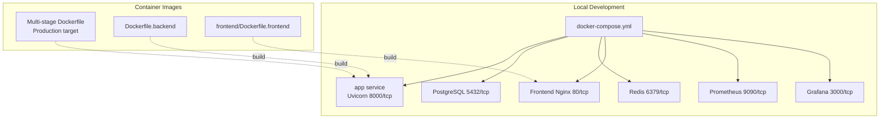
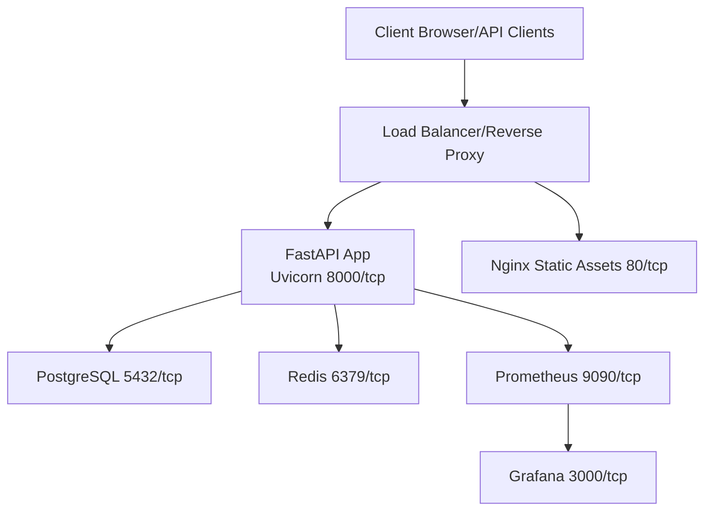
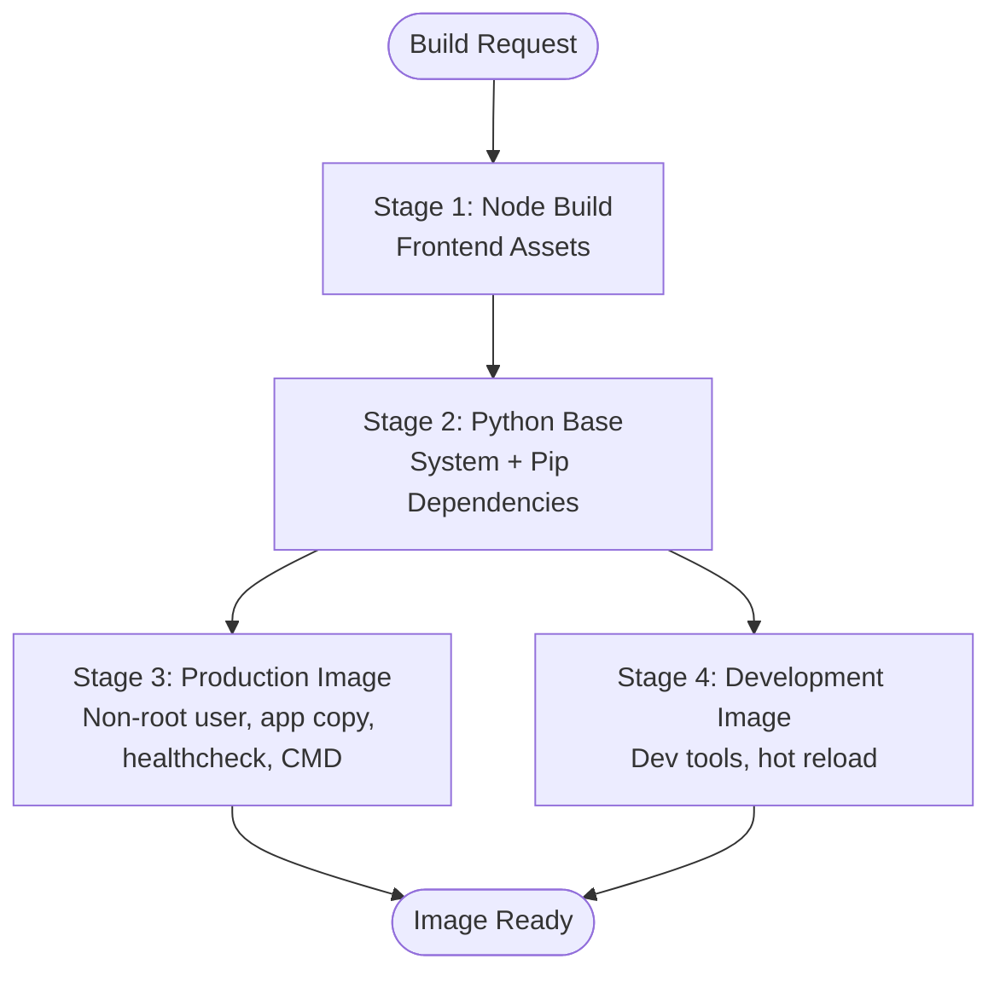
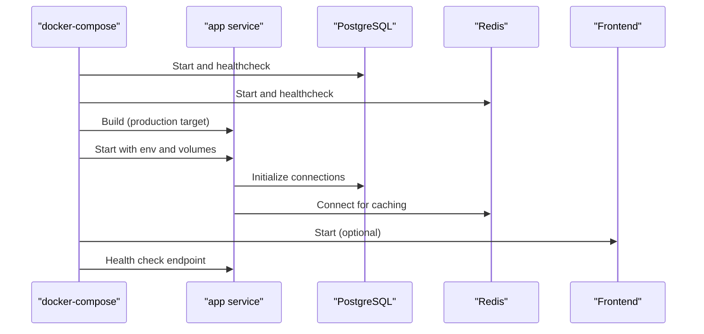
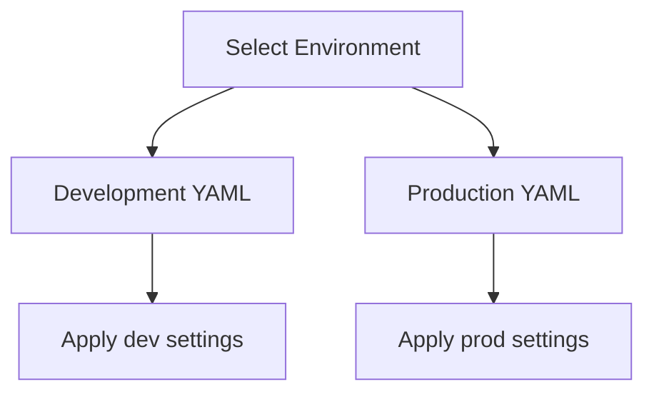
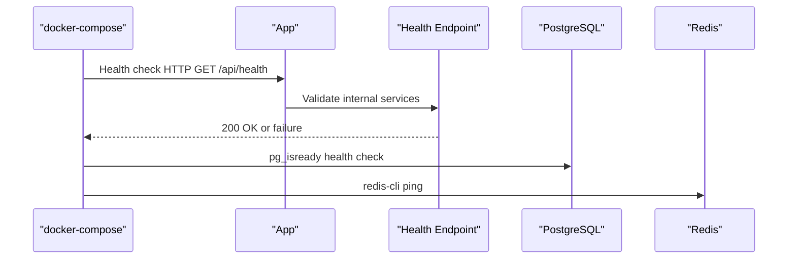
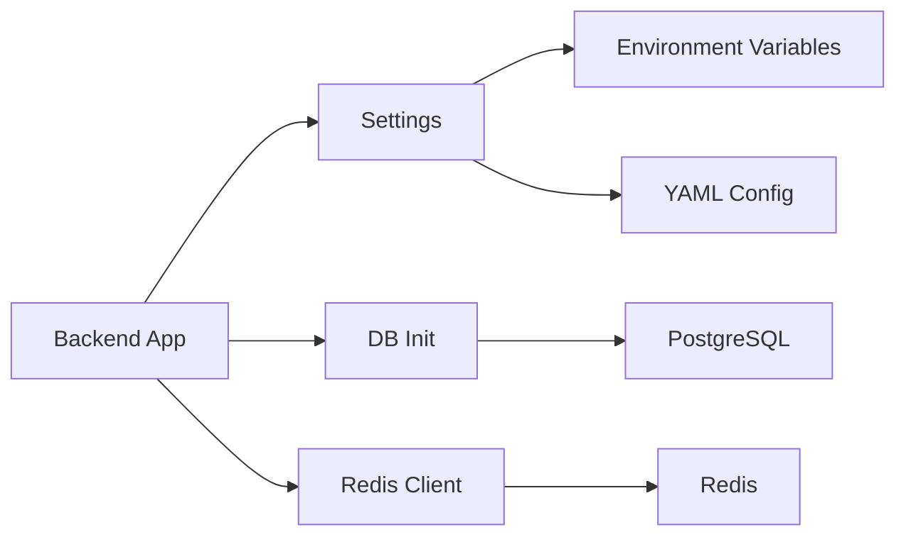

# Deployment and Operations

<cite>
**Referenced Files in This Document**
- [Dockerfile](file://Dockerfile)
- [Dockerfile.backend](file://Dockerfile.backend)
- [docker-compose.yml](file://docker-compose.yml)
- [frontend/Dockerfile](file://frontend/Dockerfile)
- [frontend/Dockerfile.frontend](file://frontend/Dockerfile.frontend)
- [scripts/deploy.sh](file://scripts/deploy.sh)
- [scripts/deploy.ps1](file://scripts/deploy.ps1)
- [FinAgents/memory/config/production.yaml](file://FinAgents/memory/config/production.yaml)
- [FinAgents/memory/config/development.yaml](file://FinAgents/memory/config/development.yaml)
- [render.yaml](file://render.yaml)
- [railway.json](file://railway.json)
- [backend/routes/health.py](file://backend/routes/health.py)
- [backend/logging_config.py](file://backend/logging_config.py)
- [backend/config/settings.py](file://backend/config/settings.py)
- [backend/db/init_db.py](file://backend/db/init_db.py)
- [backend/cache/redis_client.py](file://backend/cache/redis_client.py)
- [backend/api/main.py](file://backend/api/main.py)
</cite>

## Table of Contents
1. [Introduction](#introduction)
2. [Project Structure](#project-structure)
3. [Core Components](#core-components)
4. [Architecture Overview](#architecture-overview)
5. [Detailed Component Analysis](#detailed-component-analysis)
6. [Dependency Analysis](#dependency-analysis)
7. [Performance Considerations](#performance-considerations)
8. [Troubleshooting Guide](#troubleshooting-guide)
9. [Conclusion](#conclusion)
10. [Appendices](#appendices)

## Introduction
This document provides comprehensive deployment and operations guidance for the Agentic Trading Application. It covers containerized deployment strategies, multi-service orchestration with Docker Compose, environment-specific configurations, and production-grade monitoring and diagnostics. It also includes deployment procedures for development, staging, and production environments, along with scaling, backup, and disaster recovery recommendations, and practical troubleshooting steps.

## Project Structure
The project uses a multi-stage Docker build for the monolithic backend with integrated frontend assets, orchestrated via Docker Compose. Supporting deployment targets include Render and Railway for cloud deployments. Environment-specific configuration is managed through YAML files and environment variables.

**Diagram sources**
- [docker-compose.yml:1-166](file://docker-compose.yml#L1-L166)
- [Dockerfile:1-110](file://Dockerfile#L1-L110)
- [Dockerfile.backend:1-20](file://Dockerfile.backend#L1-L20)
- [frontend/Dockerfile.frontend:1-26](file://frontend/Dockerfile.frontend#L1-L26)

**Section sources**
- [docker-compose.yml:1-166](file://docker-compose.yml#L1-L166)
- [Dockerfile:1-110](file://Dockerfile#L1-L110)
- [Dockerfile.backend:1-20](file://Dockerfile.backend#L1-L20)
- [frontend/Dockerfile.frontend:1-26](file://frontend/Dockerfile.frontend#L1-L26)

## Core Components
- Containerization
  - Multi-stage Dockerfile builds a production image with a dedicated non-root user, exposes ports, defines health checks, and sets defaults for Uvicorn.
  - Alternative backend-only Dockerfile for focused backend deployments.
  - Separate frontend Dockerfile for building and serving static assets via Nginx.
- Orchestration
  - docker-compose.yml defines services for the application, PostgreSQL, Redis, optional frontend, Prometheus, and Grafana, including health checks, restart policies, and persistent volumes.
- Environment Management
  - Scripts deploy.sh and deploy.ps1 automate prerequisites, environment setup, image building, service startup, health checks, and status reporting.
  - Environment variables are loaded from .env and injected into services.
- Configuration
  - Environment-specific YAML configuration files for memory systems and orchestrator components.
  - Platform-specific deployment manifests for Render and Railway.

**Section sources**
- [Dockerfile:1-110](file://Dockerfile#L1-L110)
- [Dockerfile.backend:1-20](file://Dockerfile.backend#L1-L20)
- [frontend/Dockerfile.frontend:1-26](file://frontend/Dockerfile.frontend#L1-L26)
- [docker-compose.yml:1-166](file://docker-compose.yml#L1-L166)
- [scripts/deploy.sh:1-194](file://scripts/deploy.sh#L1-L194)
- [scripts/deploy.ps1:1-180](file://scripts/deploy.ps1#L1-L180)
- [FinAgents/memory/config/production.yaml:1-129](file://FinAgents/memory/config/production.yaml#L1-L129)
- [FinAgents/memory/config/development.yaml:1-125](file://FinAgents/memory/config/development.yaml#L1-L125)
- [render.yaml:1-29](file://render.yaml#L1-L29)
- [railway.json:1-14](file://railway.json#L1-L14)

## Architecture Overview
The deployment architecture integrates a FastAPI backend with a PostgreSQL database and Redis cache, served behind Nginx for the frontend. Monitoring is optionally included with Prometheus and Grafana. Health checks are defined at both the container and application levels.

**Diagram sources**
- [docker-compose.yml:1-166](file://docker-compose.yml#L1-L166)
- [backend/api/main.py](file://backend/api/main.py)
- [backend/db/init_db.py](file://backend/db/init_db.py)
- [backend/cache/redis_client.py](file://backend/cache/redis_client.py)

## Detailed Component Analysis

### Containerization Strategies
- Multi-stage build
  - Node stage builds frontend assets.
  - Python slim base installs system and Python dependencies.
  - Production stage creates a non-root user, copies backend code and built assets, exposes ports, defines health checks, and sets Uvicorn as the default command.
  - Development stage adds test and linting tools and enables hot reload.
- Backend-only image
  - Minimal Python 3.11 base, installs system dependencies, installs Python requirements, exposes port 8000, runs Uvicorn with worker count.
- Frontend image
  - Node build stage compiles assets, Nginx stage serves static content with a custom configuration.

**Diagram sources**
- [Dockerfile:1-110](file://Dockerfile#L1-L110)
- [Dockerfile.backend:1-20](file://Dockerfile.backend#L1-L20)
- [frontend/Dockerfile.frontend:1-26](file://frontend/Dockerfile.frontend#L1-L26)

**Section sources**
- [Dockerfile:1-110](file://Dockerfile#L1-L110)
- [Dockerfile.backend:1-20](file://Dockerfile.backend#L1-L20)
- [frontend/Dockerfile.frontend:1-26](file://frontend/Dockerfile.frontend#L1-L26)

### Multi-service Orchestration with Docker Compose
- Services
  - app: Built from the multi-stage Dockerfile, binds ports 8000 and 9090, mounts logs/data/models directories, depends on db and redis, includes health checks, restart policy, and environment variables from .env.
  - db: PostgreSQL 15 Alpine with persistent volume, initialization script, health check, and exposed port.
  - redis: Redis 7 Alpine with persistence, health check, and exposed port.
  - frontend: Optional separate service serving static assets via Nginx.
  - prometheus: Optional monitoring with mounted config and retention settings.
  - grafana: Optional dashboard with provisioning and credentials.
- Networks and volumes
  - Bridge network isolates services; named volumes persist data for databases and caches.

**Diagram sources**
- [docker-compose.yml:1-166](file://docker-compose.yml#L1-L166)

**Section sources**
- [docker-compose.yml:1-166](file://docker-compose.yml#L1-L166)

### Environment-specific Configurations
- Development
  - Lower resource limits, debug logging, permissive CORS, reduced worker count, and development-friendly settings.
- Production
  - Higher concurrency, stricter logging, API key enforcement, TLS-enabled database connectivity, and optimized indexes and constraints.

**Diagram sources**
- [FinAgents/memory/config/development.yaml:1-125](file://FinAgents/memory/config/development.yaml#L1-L125)
- [FinAgents/memory/config/production.yaml:1-129](file://FinAgents/memory/config/production.yaml#L1-L129)

**Section sources**
- [FinAgents/memory/config/development.yaml:1-125](file://FinAgents/memory/config/development.yaml#L1-L125)
- [FinAgents/memory/config/production.yaml:1-129](file://FinAgents/memory/config/production.yaml#L1-L129)

### Deployment Procedures

#### Development Environment
- Prerequisites
  - Docker and Docker Compose installed.
- Steps
  - Ensure .env exists; if missing, create from .env.example and set secrets.
  - Build images targeting development.
  - Start services: app, db, redis, and frontend.
  - Run health checks against the API health endpoint and database/redis readiness.
  - Review status and access points.

**Section sources**
- [scripts/deploy.sh:36-51](file://scripts/deploy.sh#L36-L51)
- [scripts/deploy.sh:53-70](file://scripts/deploy.sh#L53-L70)
- [scripts/deploy.sh:85-98](file://scripts/deploy.sh#L85-L98)
- [scripts/deploy.sh:100-129](file://scripts/deploy.sh#L100-L129)
- [scripts/deploy.sh:158-171](file://scripts/deploy.sh#L158-L171)

#### Staging Environment
- Prerequisites
  - Same as development.
- Steps
  - Use the production target for the app image.
  - Start app, db, and redis.
  - Execute health checks and review logs.
  - Access monitoring dashboards if deployed.

**Section sources**
- [scripts/deploy.sh:72-83](file://scripts/deploy.sh#L72-L83)
- [scripts/deploy.sh:85-98](file://scripts/deploy.sh#L85-L98)

#### Production Environment
- Prerequisites
  - Secure .env with generated secrets for production.
- Steps
  - Build production image.
  - Start essential services only (app, db, redis).
  - Validate health checks and monitor logs.
  - Configure reverse proxy and SSL termination externally.

**Section sources**
- [scripts/deploy.sh:53-70](file://scripts/deploy.sh#L53-L70)
- [scripts/deploy.sh:72-83](file://scripts/deploy.sh#L72-L83)
- [scripts/deploy.sh:100-129](file://scripts/deploy.sh#L100-L129)

### Monitoring and Logging Setup
- Health Checks
  - Application-level health endpoint is defined in the backend routes and used by Docker Compose health checks.
- Logging
  - Centralized logging configuration supports structured JSON and file rotation.
- Metrics and Dashboards
  - Prometheus and Grafana services are defined in docker-compose for metrics collection and visualization.

**Diagram sources**
- [docker-compose.yml:35-40](file://docker-compose.yml#L35-L40)
- [backend/routes/health.py](file://backend/routes/health.py)
- [backend/logging_config.py](file://backend/logging_config.py)

**Section sources**
- [docker-compose.yml:35-40](file://docker-compose.yml#L35-L40)
- [backend/routes/health.py](file://backend/routes/health.py)
- [backend/logging_config.py](file://backend/logging_config.py)

### Scaling Considerations
- Horizontal scaling
  - Increase Uvicorn workers in the production image and adjust the number of replicas in platform-specific manifests.
- Vertical scaling
  - Tune database and Redis resource allocations; configure connection pooling and timeouts.
- Load balancing
  - Place a reverse proxy/load balancer in front of multiple app instances.

**Section sources**
- [Dockerfile.backend:19](file://Dockerfile.backend#L19)
- [Dockerfile:83](file://Dockerfile#L83)
- [railway.json:8](file://railway.json#L8)

### Backup and Disaster Recovery
- Data protection
  - Persistent volumes for PostgreSQL, Redis, Prometheus, and Grafana ensure data survives container recreation.
- Recommendations
  - Schedule regular database dumps and Redis snapshots.
  - Maintain offsite backups and test restoration procedures.

**Section sources**
- [docker-compose.yml:150-158](file://docker-compose.yml#L150-L158)

### Platform Deployment Targets
- Render
  - Docker-based web service with environment variables mapped for database, cache, and API keys.
- Railway
  - Dockerfile-based build with restart policy and start command using dynamic PORT.

**Section sources**
- [render.yaml:1-29](file://render.yaml#L1-L29)
- [railway.json:1-14](file://railway.json#L1-L14)

## Dependency Analysis
The application depends on PostgreSQL for relational data and Redis for caching. The backend loads configuration from environment variables and YAML files, initializes the database, and serves metrics for monitoring.

**Diagram sources**
- [backend/config/settings.py](file://backend/config/settings.py)
- [backend/db/init_db.py](file://backend/db/init_db.py)
- [backend/cache/redis_client.py](file://backend/cache/redis_client.py)
- [backend/logging_config.py](file://backend/logging_config.py)

**Section sources**
- [backend/config/settings.py](file://backend/config/settings.py)
- [backend/db/init_db.py](file://backend/db/init_db.py)
- [backend/cache/redis_client.py](file://backend/cache/redis_client.py)
- [backend/logging_config.py](file://backend/logging_config.py)

## Performance Considerations
- Optimize container resources
  - Limit CPU/memory requests/limits in orchestration and platform manifests.
- Database tuning
  - Adjust pool sizes, connection timeouts, and index strategies based on workload.
- Caching
  - Use Redis effectively for hot-path data and rate limiting.
- Observability
  - Enable structured logging and metrics scraping for proactive capacity planning.

[No sources needed since this section provides general guidance]

## Troubleshooting Guide
Common deployment issues and resolutions:
- Docker or Docker Compose not found
  - Install Docker Engine and Docker Compose per platform-specific instructions.
- Health check failures
  - Inspect app logs, verify database connectivity, and confirm Redis availability.
- Port conflicts
  - Change exposed ports in docker-compose.yml or stop conflicting services.
- Missing .env
  - Create .env from .env.example and populate required secrets, especially for production.
- Database initialization errors
  - Review initialization scripts and permissions; ensure PostgreSQL is healthy before starting the app.

**Section sources**
- [scripts/deploy.sh:36-51](file://scripts/deploy.sh#L36-L51)
- [scripts/deploy.sh:100-129](file://scripts/deploy.sh#L100-L129)
- [docker-compose.yml:50-65](file://docker-compose.yml#L50-L65)
- [docker-compose.yml:74-85](file://docker-compose.yml#L74-L85)

## Conclusion
The Agentic Trading Application is designed for robust, scalable deployment using Docker and Docker Compose, with optional monitoring and platform-specific deployment targets. By following the environment-specific configurations, health checks, and operational procedures outlined here, teams can reliably operate the system across development, staging, and production environments.

[No sources needed since this section summarizes without analyzing specific files]

## Appendices

### Appendix A: Environment Variables Reference
- Database
  - DATABASE_URL: PostgreSQL connection string
- Cache
  - REDIS_URL: Redis connection string
- Security
  - AUTH_TOKEN_SECRET: Secret key for JWT signing
- Market Data APIs
  - POLYGON_API_KEY, FINNHUB_API_KEY, TWELVE_DATA_API_KEY, ALPACA_API_KEY, ALPACA_API_SECRET
- Supabase/Upstash
  - SUPABASE_DB_URL, UPSTASH_REDIS_URL

**Section sources**
- [render.yaml:8-28](file://render.yaml#L8-L28)