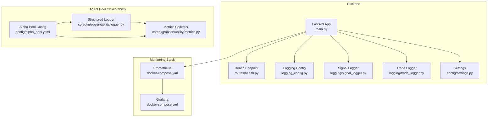
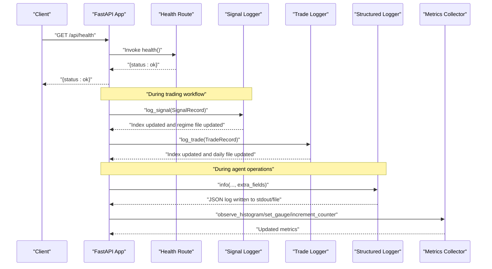
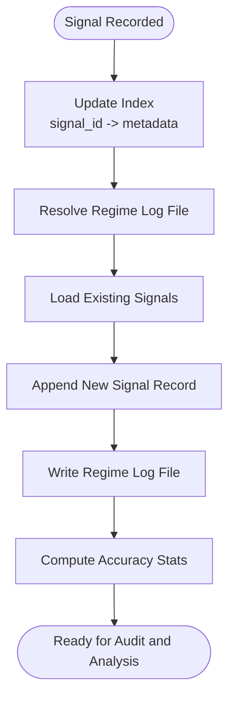
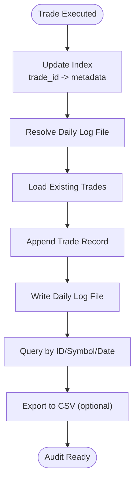
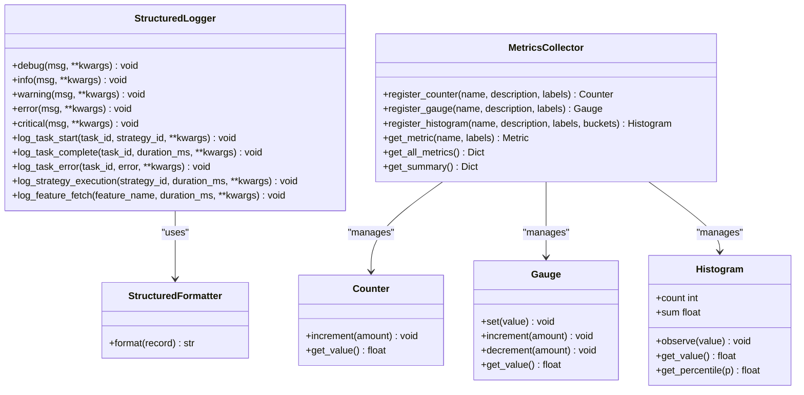
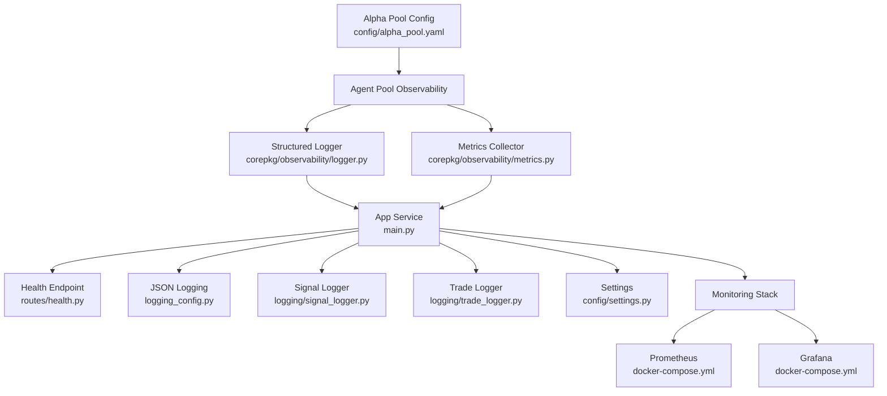

# Monitoring and Logging

<cite>
**Referenced Files in This Document**
- [logging_config.py](file://backend/logging_config.py)
- [signal_logger.py](file://backend/logging/signal_logger.py)
- [trade_logger.py](file://backend/logging/trade_logger.py)
- [logger.py](file://FinAgents/agent_pools/alpha_agent_pool/corepkg/observability/logger.py)
- [metrics.py](file://FinAgents/agent_pools/alpha_agent_pool/corepkg/observability/metrics.py)
- [health.py](file://backend/routes/health.py)
- [settings.py](file://backend/config/settings.py)
- [docker-compose.yml](file://docker-compose.yml)
- [alpha_pool.yaml](file://FinAgents/agent_pools/alpha_agent_pool/config/alpha_pool.yaml)
- [main.py](file://main.py)
</cite>

## Table of Contents
1. [Introduction](#introduction)
2. [Project Structure](#project-structure)
3. [Core Components](#core-components)
4. [Architecture Overview](#architecture-overview)
5. [Detailed Component Analysis](#detailed-component-analysis)
6. [Dependency Analysis](#dependency-analysis)
7. [Performance Considerations](#performance-considerations)
8. [Troubleshooting Guide](#troubleshooting-guide)
9. [Conclusion](#conclusion)
10. [Appendices](#appendices)

## Introduction
This document provides comprehensive guidance for monitoring and logging in the Agentic Trading Application. It covers centralized logging configuration, log formatting, file rotation strategies, health checks, observability via metrics, and practical workflows for building dashboards and alerts. It also documents signal logging for trading activities, trade logging for audit trails, and outlines how to integrate Prometheus and Grafana for system-wide observability.

## Project Structure
The monitoring and logging ecosystem spans backend FastAPI services, agent pool observability utilities, and containerized monitoring stack orchestrated via Docker Compose.

**Diagram sources**
- [main.py](file://main.py)
- [health.py](file://backend/routes/health.py)
- [logging_config.py](file://backend/logging_config.py)
- [signal_logger.py](file://backend/logging/signal_logger.py)
- [trade_logger.py](file://backend/logging/trade_logger.py)
- [logger.py](file://FinAgents/agent_pools/alpha_agent_pool/corepkg/observability/logger.py)
- [metrics.py](file://FinAgents/agent_pools/alpha_agent_pool/corepkg/observability/metrics.py)
- [alpha_pool.yaml](file://FinAgents/agent_pools/alpha_agent_pool/config/alpha_pool.yaml)
- [docker-compose.yml](file://docker-compose.yml)

**Section sources**
- [main.py](file://main.py)
- [docker-compose.yml](file://docker-compose.yml)

## Core Components
- Centralized logging configuration with JSON formatting for machine parsing.
- Signal logger for trading decision and outcome recording with regime-aware persistence.
- Trade logger for audit-ready trade lifecycle tracking with daily rotation and indexing.
- Structured logging and metrics collection for agent pools with correlation IDs and event tagging.
- Health endpoint for service readiness verification.
- Docker Compose monitoring stack with Prometheus and Grafana.

**Section sources**
- [logging_config.py](file://backend/logging_config.py)
- [signal_logger.py](file://backend/logging/signal_logger.py)
- [trade_logger.py](file://backend/logging/trade_logger.py)
- [logger.py](file://FinAgents/agent_pools/alpha_agent_pool/corepkg/observability/logger.py)
- [metrics.py](file://FinAgents/agent_pools/alpha_agent_pool/corepkg/observability/metrics.py)
- [health.py](file://backend/routes/health.py)
- [docker-compose.yml](file://docker-compose.yml)

## Architecture Overview
The system integrates structured logging across backend and agent pools, persists trading signals and trades to JSON files with indexing, exposes a health endpoint, and integrates a Prometheus-Grafana monitoring stack for metrics and dashboards.

**Diagram sources**
- [health.py](file://backend/routes/health.py)
- [signal_logger.py](file://backend/logging/signal_logger.py)
- [trade_logger.py](file://backend/logging/trade_logger.py)
- [logger.py](file://FinAgents/agent_pools/alpha_agent_pool/corepkg/observability/logger.py)
- [metrics.py](file://FinAgents/agent_pools/alpha_agent_pool/corepkg/observability/metrics.py)

## Detailed Component Analysis

### Centralized Logging Configuration
- JSON formatter captures standardized fields including timestamp, level, logger name, message, and optional exception and extra data.
- Root logger configured with stream handler and INFO level; suitable for containerized environments.
- Integrates with backend FastAPI application via import and initialization.

Implementation highlights:
- Custom JSON formatter class with UTC timestamps and optional exception serialization.
- Stream handler with JSON formatter attached to root logger.
- Environment variable-driven configuration supports JSON log output and file paths.

Operational guidance:
- Ensure the application imports the logging configuration module early during startup.
- In containers, rely on stdout JSON logs for ingestion by log collectors.

**Section sources**
- [logging_config.py](file://backend/logging_config.py)

### Signal Logging for Trading Activities
Purpose:
- Persist trading signals with full context (source, type, strength, confidence), regime context, contributing signals, final decision, rationale, expected and actual outcomes.

Key features:
- Regime-based organization of signal logs for contextual analysis.
- Outcome tracking to compute accuracy and directional correctness.
- Indexing for efficient lookup and analytics.

Data model overview:
- SignalRecord fields include identifiers, timing, symbol, signal characteristics, regime metadata, decision details, expectations, realized outcomes, and metadata.

Processing logic:
- Index maintained per signal ID with metadata for filtering and analytics.
- Regime-specific log files organized by sanitized regime names.
- Outcome updates computed by comparing expected direction with realized returns.

Analytics:
- Accuracy statistics aggregated across signals with outcomes.
- Breakdown by decision type and average returns.

**Diagram sources**
- [signal_logger.py](file://backend/logging/signal_logger.py)

**Section sources**
- [signal_logger.py](file://backend/logging/signal_logger.py)

### Trade Logging for Audit Trails
Purpose:
- Maintain a complete audit trail of executed trades with entry/exit details, costs, regime context, and decision rationale.

Key features:
- Daily log rotation by date with dedicated files.
- Indexing for rapid retrieval by trade ID, symbol, or date.
- Summary statistics for recent periods and CSV export capability.

Data model overview:
- TradeRecord fields capture identifiers, direction, pricing, quantities, PnL, regime context, signal attribution, costs, and timestamps.

Processing logic:
- Index stores metadata for quick lookup.
- Daily log files loaded and appended to; updated on exit/close events.
- Summary calculations include win rate, profit factor, and cost aggregation.

**Diagram sources**
- [trade_logger.py](file://backend/logging/trade_logger.py)

**Section sources**
- [trade_logger.py](file://backend/logging/trade_logger.py)

### Structured Logging and Metrics Collection (Agent Pool)
Purpose:
- Provide structured, JSON-formatted logs with correlation IDs and contextual fields.
- Collect counters, gauges, and histograms for performance and capacity insights.

Structured logging:
- Formatter adds timestamp, level, logger name, module, function, line number, exception info, and extra fields.
- Optional file handler writes to dated log files under a logs directory.
- Thread-local correlation ID support enables cross-service tracing.

Metrics collection:
- Counter, Gauge, and Histogram metrics with thread-safe operations.
- Global metrics collector with registration and labeling support.
- Convenience functions for common metric operations.

**Diagram sources**
- [logger.py](file://FinAgents/agent_pools/alpha_agent_pool/corepkg/observability/logger.py)
- [metrics.py](file://FinAgents/agent_pools/alpha_agent_pool/corepkg/observability/metrics.py)

**Section sources**
- [logger.py](file://FinAgents/agent_pools/alpha_agent_pool/corepkg/observability/logger.py)
- [metrics.py](file://FinAgents/agent_pools/alpha_agent_pool/corepkg/observability/metrics.py)

### Health Monitoring and Readiness Checks
- Health endpoint returns a simple JSON response indicating service status and version.
- Docker Compose defines a healthcheck for the main application service that probes the health endpoint.

Operational guidance:
- Use the health endpoint for Kubernetes readiness/liveness probes.
- Combine with external monitoring to trigger alerts on sustained failures.

**Section sources**
- [health.py](file://backend/routes/health.py)
- [docker-compose.yml](file://docker-compose.yml)

### Observability Configuration and Settings
- Backend settings define log level and other operational parameters.
- Agent pool configuration toggles observability features and sets metrics port.
- Docker Compose exposes port 9090 for Prometheus scraping.

Integration points:
- Prometheus configured to scrape the application metrics endpoint.
- Grafana provisioned with Prometheus datasource and basic dashboards.

**Section sources**
- [settings.py](file://backend/config/settings.py)
- [alpha_pool.yaml](file://FinAgents/agent_pools/alpha_agent_pool/config/alpha_pool.yaml)
- [docker-compose.yml](file://docker-compose.yml)

## Dependency Analysis
The monitoring stack is integrated into the application via Docker Compose. The backend FastAPI app exposes a health endpoint consumed by the application’s healthcheck. Structured logging and metrics are available in the agent pool codebase and can be wired into backend services.

**Diagram sources**
- [main.py](file://main.py)
- [health.py](file://backend/routes/health.py)
- [logging_config.py](file://backend/logging_config.py)
- [signal_logger.py](file://backend/logging/signal_logger.py)
- [trade_logger.py](file://backend/logging/trade_logger.py)
- [logger.py](file://FinAgents/agent_pools/alpha_agent_pool/corepkg/observability/logger.py)
- [metrics.py](file://FinAgents/agent_pools/alpha_agent_pool/corepkg/observability/metrics.py)
- [alpha_pool.yaml](file://FinAgents/agent_pools/alpha_agent_pool/config/alpha_pool.yaml)
- [docker-compose.yml](file://docker-compose.yml)

**Section sources**
- [main.py](file://main.py)
- [docker-compose.yml](file://docker-compose.yml)

## Performance Considerations
- JSON logging is lightweight and suitable for high-throughput environments; ensure log consumers can handle volume.
- Signal and trade log persistence uses indexed JSON files; consider filesystem I/O limits and disk throughput.
- Metrics operations are thread-safe and lock-protected; avoid excessive contention by batching updates where appropriate.
- Health checks should be inexpensive; keep endpoint logic minimal.

[No sources needed since this section provides general guidance]

## Troubleshooting Guide
Common scenarios and resolutions:
- No logs in stdout: Verify JSON logging configuration is imported and logger level is INFO or lower.
- Missing signal/trade entries: Confirm index and log files exist and are readable; check for exceptions during write operations.
- Health check failing: Probe the health endpoint directly; inspect application logs for errors; ensure port exposure and network connectivity.
- Metrics not visible in Prometheus: Confirm metrics port is exposed and Prometheus configuration targets the correct endpoint.

Operational commands:
- View application logs: docker-compose logs -f app
- Restart services: docker-compose restart
- Rebuild images: docker-compose build --no-cache

**Section sources**
- [docker-compose.yml](file://docker-compose.yml)

## Conclusion
The Agentic Trading Application provides a robust foundation for observability through structured logging, signal and trade audit trails, and an integrated monitoring stack. By leveraging JSON-formatted logs, indexed persistence, and metrics collection, teams can build reliable dashboards and alerts. Health checks and containerized monitoring simplify deployment and ongoing operations.

[No sources needed since this section summarizes without analyzing specific files]

## Appendices

### Log Formatting and Centralized Configuration
- JSON formatter fields include timestamp, level, logger name, message, and optional exception and extra data.
- Root logger configured with stream handler and INFO level; suitable for containerized deployments.

**Section sources**
- [logging_config.py](file://backend/logging_config.py)

### Signal Logging Workflow
- Index updated on each signal; regime-specific log file appended.
- Outcome updates computed and persisted with correctness assessment.

**Section sources**
- [signal_logger.py](file://backend/logging/signal_logger.py)

### Trade Logging Workflow
- Index updated on each trade; daily log file appended.
- Summary statistics and CSV export supported for reporting.

**Section sources**
- [trade_logger.py](file://backend/logging/trade_logger.py)

### Structured Logging and Metrics Usage
- Use structured logger for contextual logs with correlation IDs.
- Use metrics collector for counters, gauges, and histograms; register metrics globally and observe values during operations.

**Section sources**
- [logger.py](file://FinAgents/agent_pools/alpha_agent_pool/corepkg/observability/logger.py)
- [metrics.py](file://FinAgents/agent_pools/alpha_agent_pool/corepkg/observability/metrics.py)

### Health Endpoint and Readiness
- Health endpoint returns service status and version.
- Docker Compose healthcheck probes the endpoint at regular intervals.

**Section sources**
- [health.py](file://backend/routes/health.py)
- [docker-compose.yml](file://docker-compose.yml)

### Monitoring Stack Setup
- Prometheus and Grafana services defined in Docker Compose.
- Prometheus configuration mounted from host; Grafana provisioned with provisioning directory.

**Section sources**
- [docker-compose.yml](file://docker-compose.yml)