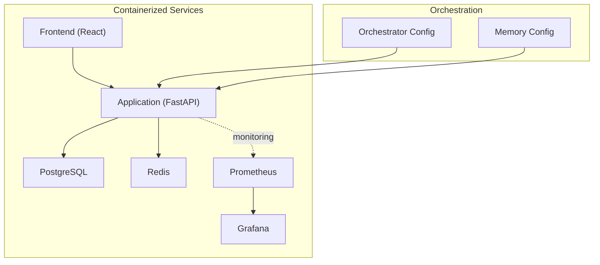
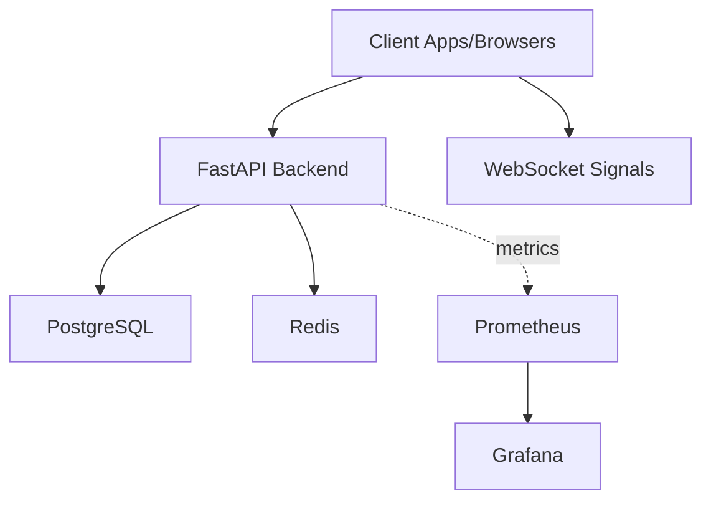
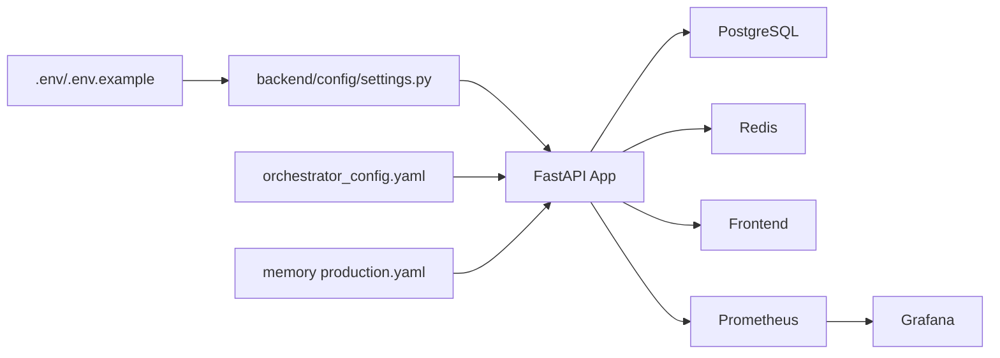

# Operational Procedures

<cite>
**Referenced Files in This Document**
- [README.md](file://README.md)
- [Dockerfile](file://Dockerfile)
- [docker-compose.yml](file://docker-compose.yml)
- [scripts/deploy.sh](file://scripts/deploy.sh)
- [scripts/setup_integration.sh](file://scripts/setup_integration.sh)
- [scripts/restart_alpha_pool_with_sse_fix.sh](file://scripts/restart_alpha_pool_with_sse_fix.sh)
- [backend/config/settings.py](file://backend/config/settings.py)
- [backend/db/init_db.py](file://backend/db/init_db.py)
- [backend/logging_config.py](file://backend/logging_config.py)
- [FinAgents/memory/config/production.yaml](file://FinAgents/memory/config/production.yaml)
- [FinAgents/orchestrator/config/orchestrator_config.yaml](file://FinAgents/orchestrator/config/orchestrator_config.yaml)
- [tests/final_system_validation.py](file://tests/final_system_validation.py)
- [tests/comprehensive_system_validation.py](file://tests/comprehensive_system_validation.py)
- [FinAgents/memory/furtherdocumentation/MEMORY_SYSTEM_DOCUMENTATION_INDEX.md](file://FinAgents/memory/furtherdocumentation/MEMORY_SYSTEM_DOCUMENTATION_INDEX.md)
</cite>

## Table of Contents
1. [Introduction](#introduction)
2. [Project Structure](#project-structure)
3. [Core Components](#core-components)
4. [Architecture Overview](#architecture-overview)
5. [Detailed Component Analysis](#detailed-component-analysis)
6. [Dependency Analysis](#dependency-analysis)
7. [Performance Considerations](#performance-considerations)
8. [Troubleshooting Guide](#troubleshooting-guide)
9. [Backup and Recovery](#backup-and-recovery)
10. [Scaling and Capacity Planning](#scaling-and-capacity-planning)
11. [Runbooks](#runbooks)
12. [Integration Testing and QA](#integration-testing-and-qa)
13. [Conclusion](#conclusion)

## Introduction
This document defines operational procedures for maintaining, updating, and running the Agentic Trading Application. It covers routine maintenance, system updates, configuration management, troubleshooting, backup and recovery, disaster recovery, scaling, performance optimization, incident response, diagnostics, and integration testing. The content is grounded in the repository’s deployment artifacts, configuration files, scripts, and validation suites.

## Project Structure
The system comprises:
- A containerized backend API and agent ecosystem
- A React frontend
- Supporting services (PostgreSQL, Redis, monitoring)
- Scripts for deployment, integration setup, and restarts
- Configuration files for backend settings, memory, and orchestrator

**Diagram sources**
- [docker-compose.yml:1-166](file://docker-compose.yml#L1-L166)
- [backend/config/settings.py:1-85](file://backend/config/settings.py#L1-L85)
- [FinAgents/orchestrator/config/orchestrator_config.yaml:1-356](file://FinAgents/orchestrator/config/orchestrator_config.yaml#L1-L356)
- [FinAgents/memory/config/production.yaml:1-129](file://FinAgents/memory/config/production.yaml#L1-L129)

**Section sources**
- [README.md:252-335](file://README.md#L252-L335)
- [docker-compose.yml:1-166](file://docker-compose.yml#L1-L166)

## Core Components
- Application container: FastAPI backend, production image with health checks and non-root user
- Database: PostgreSQL with initialization
- Caching: Redis for streaming and caching
- Frontend: React app served via Nginx/Docker
- Monitoring: Prometheus and Grafana
- Configuration: Pydantic settings for backend, YAML configs for orchestrator and memory

Key operational responsibilities:
- Maintain service health via health checks
- Manage secrets and environment variables
- Ensure database and cache availability
- Validate configuration correctness before deployments

**Section sources**
- [Dockerfile:1-110](file://Dockerfile#L1-L110)
- [docker-compose.yml:1-166](file://docker-compose.yml#L1-L166)
- [backend/config/settings.py:1-85](file://backend/config/settings.py#L1-L85)
- [backend/db/init_db.py:1-13](file://backend/db/init_db.py#L1-L13)
- [backend/logging_config.py:1-29](file://backend/logging_config.py#L1-L29)
- [FinAgents/orchestrator/config/orchestrator_config.yaml:1-356](file://FinAgents/orchestrator/config/orchestrator_config.yaml#L1-L356)
- [FinAgents/memory/config/production.yaml:1-129](file://FinAgents/memory/config/production.yaml#L1-L129)

## Architecture Overview
The platform runs as orchestrated containers with clear separation of concerns:
- Backend API exposes REST endpoints and WebSocket streams
- PostgreSQL persists trades and portfolio data
- Redis supports caching and real-time signal streaming
- Prometheus/Grafana provide metrics and dashboards
- Orchestrator and Memory subsystems coordinate agent pools and knowledge graph operations

**Diagram sources**
- [README.md:92-114](file://README.md#L92-L114)
- [docker-compose.yml:1-166](file://docker-compose.yml#L1-L166)

## Detailed Component Analysis

### Backend Configuration Management
- Centralized settings via Pydantic settings with environment overrides
- CORS, API host/port, logging levels, market provider timeouts, and provider keys
- Token TTL and algorithm configured for JWT

Operational practices:
- Keep .env synchronized with .env.example
- Rotate secrets in production
- Validate settings before starting services

**Section sources**
- [backend/config/settings.py:1-85](file://backend/config/settings.py#L1-L85)

### Database Initialization and Persistence
- SQLAlchemy models mapped to PostgreSQL
- Initialization script creates tables on startup

Operational practices:
- Ensure DATABASE_URL points to a reachable PostgreSQL instance
- Run initialization during first boot or via migration scripts
- Back up before destructive operations

**Section sources**
- [backend/db/init_db.py:1-13](file://backend/db/init_db.py#L1-L13)

### Logging and Observability
- Structured JSON logging for backend
- Prometheus metrics and Grafana dashboards

Operational practices:
- Monitor logs via container logs or centralized logging
- Use Grafana dashboards for system health
- Tune log levels per environment

**Section sources**
- [backend/logging_config.py:1-29](file://backend/logging_config.py#L1-L29)
- [docker-compose.yml:107-145](file://docker-compose.yml#L107-L145)

### Containerization and Deployment
- Multi-stage Dockerfile builds optimized production image
- Health checks and non-root user for security
- docker-compose orchestrates app, db, redis, frontend, and monitoring

Operational practices:
- Use deploy.sh for environment-specific setups
- Verify health checks pass before considering services healthy
- Persist logs and shared data via named volumes

**Section sources**
- [Dockerfile:1-110](file://Dockerfile#L1-L110)
- [docker-compose.yml:1-166](file://docker-compose.yml#L1-L166)
- [scripts/deploy.sh:1-194](file://scripts/deploy.sh#L1-L194)

### Orchestrator and Agent Coordination
- Orchestrator configuration defines agent pool endpoints, capabilities, and monitoring/alerting
- Supports RL engine, sandbox environments, and alert rules

Operational practices:
- Validate agent pool URLs and health endpoints
- Enable/disable features per environment
- Monitor alert channels and thresholds

**Section sources**
- [FinAgents/orchestrator/config/orchestrator_config.yaml:1-356](file://FinAgents/orchestrator/config/orchestrator_config.yaml#L1-L356)

### Memory System Configuration
- Neo4j-backed memory with MCP, HTTP, and A2A servers
- Indexing, constraints, and logging tuned for production
- Ports and API prefixes defined centrally

Operational practices:
- Ensure Neo4j connectivity and credentials
- Monitor memory statistics and prune as needed
- Enforce API key requirements in production

**Section sources**
- [FinAgents/memory/config/production.yaml:1-129](file://FinAgents/memory/config/production.yaml#L1-L129)

### Integration Setup and Testing
- Setup script provisions Neo4j, starts a temporary memory agent, installs dependencies, and runs integration tests
- Provides status, cleanup, and restart workflows

Operational practices:
- Use setup/test/status/cleanup commands for integration environments
- Verify service readiness before running tests
- Capture logs for failed test runs

**Section sources**
- [scripts/setup_integration.sh:1-314](file://scripts/setup_integration.sh#L1-L314)

### Alpha Agent Pool Restart with SSE Fix
- Script kills existing processes, restarts Alpha Agent Pool with enhanced error handling, and verifies startup

Operational practices:
- Use when SSE-related errors occur
- Inspect restart logs for failure causes
- Confirm service is listening on expected port

**Section sources**
- [scripts/restart_alpha_pool_with_sse_fix.sh:1-37](file://scripts/restart_alpha_pool_with_sse_fix.sh#L1-L37)

## Dependency Analysis
The system’s runtime dependencies and their relationships:

**Diagram sources**
- [backend/config/settings.py:1-85](file://backend/config/settings.py#L1-L85)
- [docker-compose.yml:1-166](file://docker-compose.yml#L1-L166)
- [FinAgents/orchestrator/config/orchestrator_config.yaml:1-356](file://FinAgents/orchestrator/config/orchestrator_config.yaml#L1-L356)
- [FinAgents/memory/config/production.yaml:1-129](file://FinAgents/memory/config/production.yaml#L1-L129)

**Section sources**
- [backend/config/settings.py:1-85](file://backend/config/settings.py#L1-L85)
- [docker-compose.yml:1-166](file://docker-compose.yml#L1-L166)

## Performance Considerations
- Use production-grade Docker image with health checks and non-root user
- Enable Prometheus metrics and Grafana dashboards for continuous monitoring
- Tune market provider timeouts and retry thresholds to balance responsiveness and reliability
- Ensure Redis and PostgreSQL are sized appropriately for expected load
- Apply caching strategies and consider connection pooling for databases and Neo4j

[No sources needed since this section provides general guidance]

## Troubleshooting Guide
Common operational issues and remediation steps:

- API health check failures
  - Verify application container health endpoint
  - Check backend logs for exceptions
  - Confirm database and Redis connectivity

- Database connectivity issues
  - Validate DATABASE_URL and credentials
  - Confirm PostgreSQL is healthy and accepting connections

- Redis connectivity issues
  - Verify REDIS_URL and container health
  - Check for memory pressure or eviction policies

- Frontend access problems
  - Confirm frontend container is running and serving on expected port
  - Check reverse proxy or ingress configuration

- SSE-related Alpha Agent Pool instability
  - Use the restart script to kill lingering processes and restart cleanly
  - Inspect restart logs for persistent errors

- Integration test failures
  - Use the integration setup script to provision Neo4j and start memory agent
  - Run tests with verbose mode and review captured logs

**Section sources**
- [scripts/deploy.sh:100-129](file://scripts/deploy.sh#L100-L129)
- [scripts/restart_alpha_pool_with_sse_fix.sh:1-37](file://scripts/restart_alpha_pool_with_sse_fix.sh#L1-L37)
- [scripts/setup_integration.sh:204-229](file://scripts/setup_integration.sh#L204-L229)

## Backup and Recovery
- PostgreSQL data persisted via named volumes; back up regularly
- Redis persistence enabled via AOF; monitor disk usage
- Application logs stored in mounted volumes; rotate and archive as needed
- Consider automated backups and offsite retention per organizational policy

[No sources needed since this section provides general guidance]

## Scaling and Capacity Planning
- Horizontal scaling
  - Use container replicas for stateless services (API, frontend)
  - Ensure shared state (PostgreSQL, Redis) can handle increased load
- Vertical scaling
  - Increase CPU/RAM for application and database containers
  - Tune JVM/worker settings for Neo4j and application servers
- Auto-scaling
  - Enable orchestrator auto-scaling where supported
  - Monitor resource utilization and adjust thresholds

**Section sources**
- [FinAgents/orchestrator/config/orchestrator_config.yaml:340-344](file://FinAgents/orchestrator/config/orchestrator_config.yaml#L340-L344)

## Runbooks

### Routine Maintenance Tasks
- Update environment variables and secrets
- Rebuild and redeploy containers
- Rotate logs and clean old backups
- Validate configuration files before deployment

**Section sources**
- [scripts/deploy.sh:53-83](file://scripts/deploy.sh#L53-L83)

### System Updates
- Pull latest images or rebuild locally
- Run health checks after updates
- Validate API endpoints and WebSocket streams

**Section sources**
- [scripts/deploy.sh:72-98](file://scripts/deploy.sh#L72-L98)

### Configuration Management
- Maintain separate configuration files per environment
- Use environment variables for sensitive data
- Validate configuration syntax and defaults

**Section sources**
- [backend/config/settings.py:8-13](file://backend/config/settings.py#L8-L13)
- [FinAgents/orchestrator/config/orchestrator_config.yaml:1-30](file://FinAgents/orchestrator/config/orchestrator_config.yaml#L1-L30)
- [FinAgents/memory/config/production.yaml:1-30](file://FinAgents/memory/config/production.yaml#L1-L30)

### Incident Response
- Identify failing service via health checks
- Collect logs from affected containers
- Roll back to last known good image/tag
- Restore from backups if data integrity is compromised

**Section sources**
- [scripts/deploy.sh:100-129](file://scripts/deploy.sh#L100-L129)

### System Diagnostics
- Use Prometheus metrics and Grafana dashboards
- Inspect application logs and structured JSON logs
- Validate database and cache connectivity

**Section sources**
- [docker-compose.yml:107-145](file://docker-compose.yml#L107-L145)
- [backend/logging_config.py:1-29](file://backend/logging_config.py#L1-L29)

### Emergency Procedures
- Stop failing services immediately
- Isolate affected components
- Restore from backups and re-validate

**Section sources**
- [scripts/deploy.sh:131-156](file://scripts/deploy.sh#L131-L156)

## Integration Testing and QA
- Use the integration setup script to provision Neo4j and memory agent, then run integration tests
- Validate system readiness with comprehensive and final validation suites
- Monitor test results and capture logs for failed runs

**Section sources**
- [scripts/setup_integration.sh:204-229](file://scripts/setup_integration.sh#L204-L229)
- [tests/comprehensive_system_validation.py:1-187](file://tests/comprehensive_system_validation.py#L1-L187)
- [tests/final_system_validation.py:1-117](file://tests/final_system_validation.py#L1-L117)

## Conclusion
These operational procedures provide a practical foundation for maintaining and evolving the Agentic Trading Application. By following the deployment, configuration, monitoring, troubleshooting, backup, scaling, and testing practices outlined here, operators can ensure reliable, secure, and high-performing operations across development, staging, and production environments.