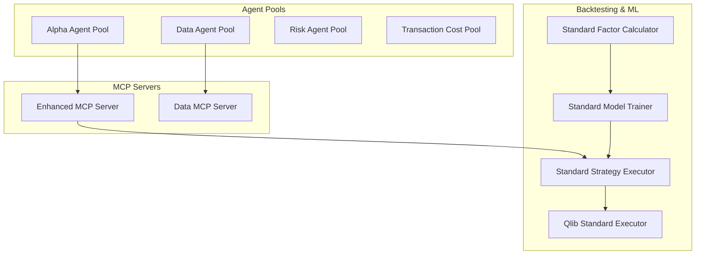
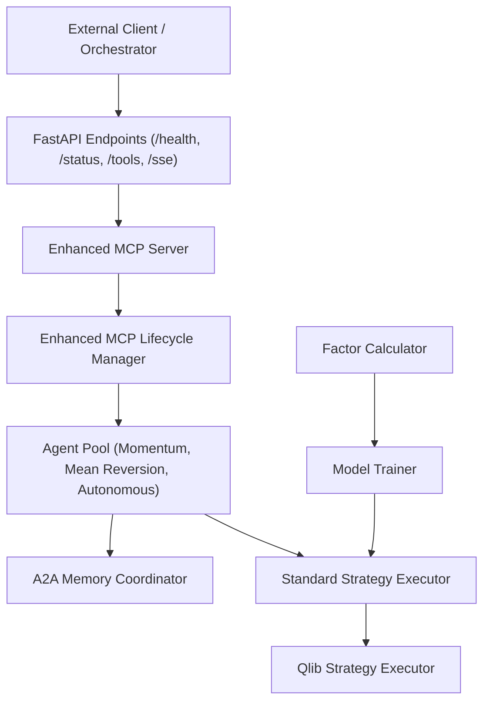
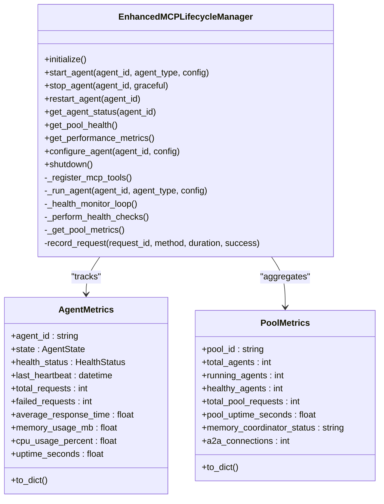
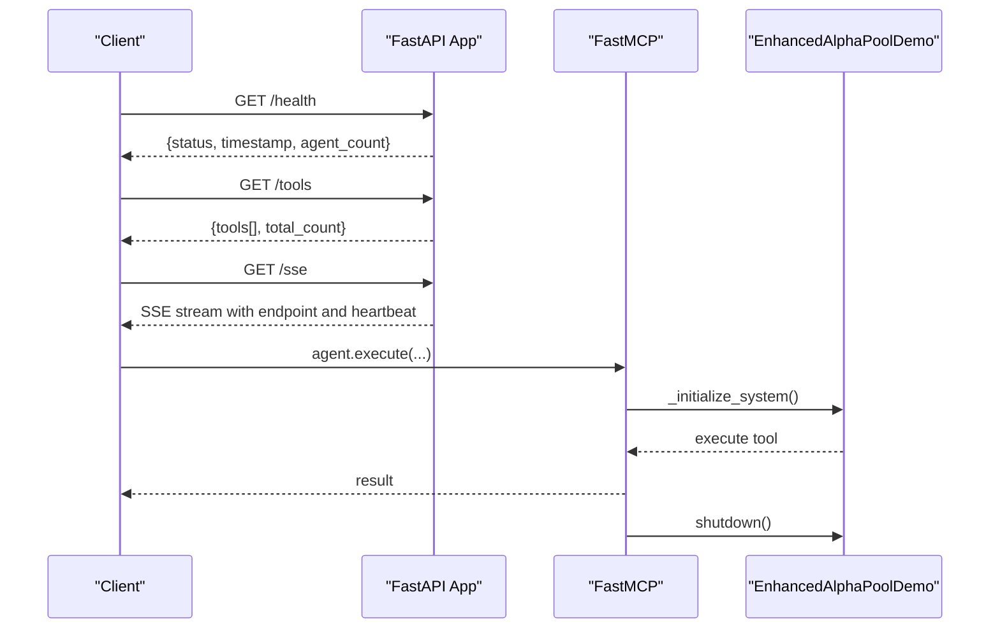
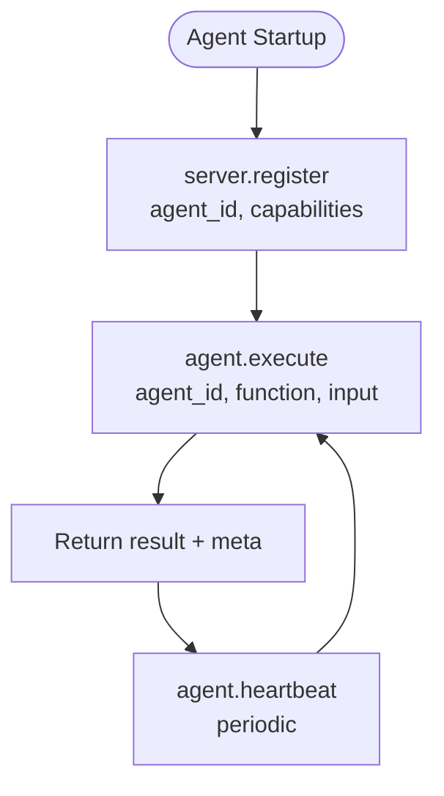
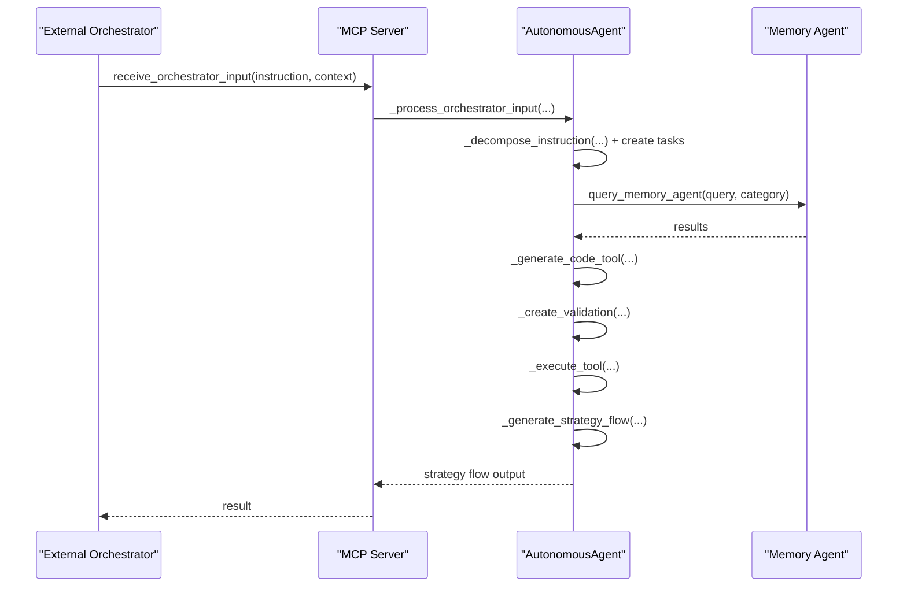
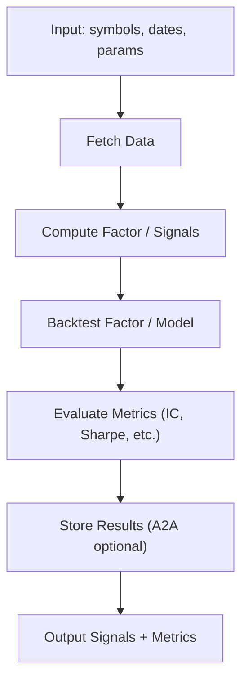
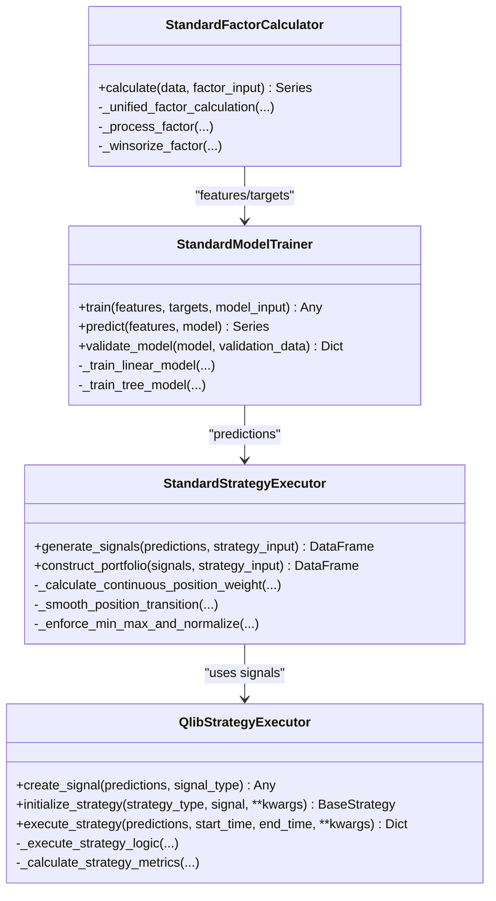
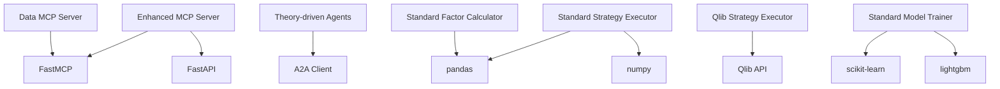

# Advanced Integration Patterns

<cite>
**Referenced Files in This Document**
- [enhanced_mcp_lifecycle.py](file://FinAgents/agent_pools/alpha_agent_pool/enhanced_mcp_lifecycle.py)
- [enhanced_mcp_server.py](file://FinAgents/agent_pools/alpha_agent_pool/enhanced_mcp_server.py)
- [mcp_server.py](file://FinAgents/agent_pools/data_agent_pool/mcp_server.py)
- [mcp_interface_specification.md](file://FinAgents/agent_pools/data_agent_pool/mcp_interface_specification.md)
- [mcp_config.yaml](file://FinAgents/agent_pools/alpha_agent_pool/mcp_config.yaml)
- [autonomous_agent.py](file://FinAgents/agent_pools/alpha_agent_pool/agents/autonomous/autonomous_agent.py)
- [momentum_agent.py](file://FinAgents/agent_pools/alpha_agent_pool/agents/theory_driven/momentum_agent.py)
- [mean_reversion_agent.py](file://FinAgents/agent_pools/alpha_agent_pool/agents/theory_driven/mean_reversion_agent.py)
- [standard_strategy_executor.py](file://FinAgents/agent_pools/alpha_agent_pool/qlib_local/standard_strategy_executor.py)
- [strategy_executor.py](file://FinAgents/agent_pools/alpha_agent_pool/qlib_local/qlib_standard/strategy_executor.py)
- [standard_factor_calculator.py](file://FinAgents/agent_pools/alpha_agent_pool/qlib_local/standard_factor_calculator.py)
- [standard_model_trainer.py](file://FinAgents/agent_pools/alpha_agent_pool/qlib_local/standard_model_trainer.py)
- [factor_pipeline.py](file://FinAgents/agent_pools/alpha_agent_pool/qlib_local/factor_pipeline.py)
- [model_pipeline.py](file://FinAgents/agent_pools/alpha_agent_pool/qlib_local/model_pipeline.py)
</cite>

## Table of Contents
1. [Introduction](#introduction)
2. [Project Structure](#project-structure)
3. [Core Components](#core-components)
4. [Architecture Overview](#architecture-overview)
5. [Detailed Component Analysis](#detailed-component-analysis)
6. [Dependency Analysis](#dependency-analysis)
7. [Performance Considerations](#performance-considerations)
8. [Troubleshooting Guide](#troubleshooting-guide)
9. [Conclusion](#conclusion)
10. [Appendices](#appendices)

## Introduction
This document presents advanced integration patterns and complex system configurations for the agentic trading platform. It focuses on MCP protocol integration, batch data processing, multi-agent coordination, and custom agent development. It also covers advanced API usage patterns, performance optimization techniques, scalable deployment strategies, security considerations, rate limiting, and production deployment patterns. The content synthesizes the repository’s agent pools, MCP servers, orchestration components, and Qlib-backed backtesting infrastructure into a cohesive guide for building and operating sophisticated trading systems.

## Project Structure
The system is organized around:
- Agent pools: theory-driven, autonomous, and data agent pools
- MCP servers: enhanced servers for agent lifecycle and orchestration
- Qlib-backed backtesting and model training pipelines
- Configuration and integration specifications for MCP and A2A protocols

**Diagram sources**
- [enhanced_mcp_server.py:22-375](file://FinAgents/agent_pools/alpha_agent_pool/enhanced_mcp_server.py#L22-L375)
- [mcp_server.py:1-68](file://FinAgents/agent_pools/data_agent_pool/mcp_server.py#L1-L68)
- [strategy_executor.py:21-343](file://FinAgents/agent_pools/alpha_agent_pool/qlib_local/qlib_standard/strategy_executor.py#L21-L343)
- [standard_strategy_executor.py:13-618](file://FinAgents/agent_pools/alpha_agent_pool/qlib_local/standard_strategy_executor.py#L13-L618)
- [standard_factor_calculator.py:12-325](file://FinAgents/agent_pools/alpha_agent_pool/qlib_local/standard_factor_calculator.py#L12-L325)
- [standard_model_trainer.py:25-451](file://FinAgents/agent_pools/alpha_agent_pool/qlib_local/standard_model_trainer.py#L25-L451)

**Section sources**
- [enhanced_mcp_server.py:22-375](file://FinAgents/agent_pools/alpha_agent_pool/enhanced_mcp_server.py#L22-L375)
- [mcp_server.py:1-68](file://FinAgents/agent_pools/data_agent_pool/mcp_server.py#L1-L68)
- [strategy_executor.py:21-343](file://FinAgents/agent_pools/alpha_agent_pool/qlib_local/qlib_standard/strategy_executor.py#L21-L343)
- [standard_strategy_executor.py:13-618](file://FinAgents/agent_pools/alpha_agent_pool/qlib_local/standard_strategy_executor.py#L13-L618)
- [standard_factor_calculator.py:12-325](file://FinAgents/agent_pools/alpha_agent_pool/qlib_local/standard_factor_calculator.py#L12-L325)
- [standard_model_trainer.py:25-451](file://FinAgents/agent_pools/alpha_agent_pool/qlib_local/standard_model_trainer.py#L25-L451)

## Core Components
- Enhanced MCP lifecycle manager: stateful agent lifecycle, health monitoring, metrics, and graceful shutdown for the Alpha Agent Pool.
- Enhanced MCP server: FastAPI + MCP with additional HTTP endpoints, tool registries, and SSE transport.
- Data MCP server: Stateless MCP server for agent execution, registration, and heartbeat.
- Autonomous agent: Self-orchestrating agent with dynamic code generation, task queues, and strategy flow output.
- Theory-driven agents: Momentum and mean reversion agents with A2A memory integration and RL-style feedback loops.
- Qlib-backed executors and trainers: Standard strategy execution, factor calculation, and model training pipelines.

**Section sources**
- [enhanced_mcp_lifecycle.py:83-619](file://FinAgents/agent_pools/alpha_agent_pool/enhanced_mcp_lifecycle.py#L83-L619)
- [enhanced_mcp_server.py:22-375](file://FinAgents/agent_pools/alpha_agent_pool/enhanced_mcp_server.py#L22-L375)
- [mcp_server.py:1-68](file://FinAgents/agent_pools/data_agent_pool/mcp_server.py#L1-L68)
- [autonomous_agent.py:52-800](file://FinAgents/agent_pools/alpha_agent_pool/agents/autonomous/autonomous_agent.py#L52-L800)
- [momentum_agent.py:77-800](file://FinAgents/agent_pools/alpha_agent_pool/agents/theory_driven/momentum_agent.py#L77-L800)
- [mean_reversion_agent.py:1-843](file://FinAgents/agent_pools/alpha_agent_pool/agents/theory_driven/mean_reversion_agent.py#L1-L843)
- [standard_strategy_executor.py:13-618](file://FinAgents/agent_pools/alpha_agent_pool/qlib_local/standard_strategy_executor.py#L13-L618)
- [strategy_executor.py:21-343](file://FinAgents/agent_pools/alpha_agent_pool/qlib_local/qlib_standard/strategy_executor.py#L21-L343)
- [standard_factor_calculator.py:12-325](file://FinAgents/agent_pools/alpha_agent_pool/qlib_local/standard_factor_calculator.py#L12-L325)
- [standard_model_trainer.py:25-451](file://FinAgents/agent_pools/alpha_agent_pool/qlib_local/standard_model_trainer.py#L25-L451)

## Architecture Overview
The system integrates MCP-based orchestration with agent pools, Qlib-backed backtesting, and A2A memory coordination. The enhanced MCP server exposes HTTP endpoints and MCP tools, while the lifecycle manager monitors agent health and performance. Data agents register and execute via MCP, and theory-driven agents integrate with A2A memory for feedback and strategy storage.

**Diagram sources**
- [enhanced_mcp_server.py:57-221](file://FinAgents/agent_pools/alpha_agent_pool/enhanced_mcp_server.py#L57-L221)
- [enhanced_mcp_lifecycle.py:130-153](file://FinAgents/agent_pools/alpha_agent_pool/enhanced_mcp_lifecycle.py#L130-L153)
- [momentum_agent.py:458-599](file://FinAgents/agent_pools/alpha_agent_pool/agents/theory_driven/momentum_agent.py#L458-L599)
- [standard_strategy_executor.py:191-444](file://FinAgents/agent_pools/alpha_agent_pool/qlib_local/standard_strategy_executor.py#L191-L444)
- [strategy_executor.py:194-242](file://FinAgents/agent_pools/alpha_agent_pool/qlib_local/qlib_standard/strategy_executor.py#L194-L242)
- [standard_factor_calculator.py:15-47](file://FinAgents/agent_pools/alpha_agent_pool/qlib_local/standard_factor_calculator.py#L15-L47)
- [standard_model_trainer.py:28-41](file://FinAgents/agent_pools/alpha_agent_pool/qlib_local/standard_model_trainer.py#L28-L41)

**Section sources**
- [enhanced_mcp_server.py:57-221](file://FinAgents/agent_pools/alpha_agent_pool/enhanced_mcp_server.py#L57-L221)
- [enhanced_mcp_lifecycle.py:130-153](file://FinAgents/agent_pools/alpha_agent_pool/enhanced_mcp_lifecycle.py#L130-L153)
- [momentum_agent.py:458-599](file://FinAgents/agent_pools/alpha_agent_pool/agents/theory_driven/momentum_agent.py#L458-L599)
- [standard_strategy_executor.py:191-444](file://FinAgents/agent_pools/alpha_agent_pool/qlib_local/standard_strategy_executor.py#L191-L444)
- [strategy_executor.py:194-242](file://FinAgents/agent_pools/alpha_agent_pool/qlib_local/qlib_standard/strategy_executor.py#L194-L242)
- [standard_factor_calculator.py:15-47](file://FinAgents/agent_pools/alpha_agent_pool/qlib_local/standard_factor_calculator.py#L15-L47)
- [standard_model_trainer.py:28-41](file://FinAgents/agent_pools/alpha_agent_pool/qlib_local/standard_model_trainer.py#L28-L41)

## Detailed Component Analysis

### Enhanced MCP Lifecycle Management
The lifecycle manager extends FastMCP with:
- Agent state tracking and transitions
- Health monitoring and alerts
- Performance metrics aggregation
- Graceful shutdown and A2A coordinator integration
- Request monitoring middleware hook

**Diagram sources**
- [enhanced_mcp_lifecycle.py:83-128](file://FinAgents/agent_pools/alpha_agent_pool/enhanced_mcp_lifecycle.py#L83-L128)
- [enhanced_mcp_lifecycle.py:43-81](file://FinAgents/agent_pools/alpha_agent_pool/enhanced_mcp_lifecycle.py#L43-L81)

**Section sources**
- [enhanced_mcp_lifecycle.py:83-619](file://FinAgents/agent_pools/alpha_agent_pool/enhanced_mcp_lifecycle.py#L83-L619)

### Enhanced MCP Server with HTTP and MCP Tools
The enhanced server adds:
- Root, health, status, info, tools, and SSE endpoints
- MCP tools for alpha signal generation, factor discovery, strategy configuration, backtests, and memory operations
- SSE transport for MCP messages

**Diagram sources**
- [enhanced_mcp_server.py:77-221](file://FinAgents/agent_pools/alpha_agent_pool/enhanced_mcp_server.py#L77-L221)
- [enhanced_mcp_server.py:222-335](file://FinAgents/agent_pools/alpha_agent_pool/enhanced_mcp_server.py#L222-L335)

**Section sources**
- [enhanced_mcp_server.py:57-221](file://FinAgents/agent_pools/alpha_agent_pool/enhanced_mcp_server.py#L57-L221)
- [enhanced_mcp_server.py:222-335](file://FinAgents/agent_pools/alpha_agent_pool/enhanced_mcp_server.py#L222-L335)

### Data Agent Pool MCP Integration
The data MCP server provides:
- Stateless HTTP transport
- agent.execute tool for registered agents
- server.register and agent.heartbeat resources
- Dynamic agent registration and heartbeat recording

**Diagram sources**
- [mcp_server.py:17-68](file://FinAgents/agent_pools/data_agent_pool/mcp_server.py#L17-L68)
- [mcp_interface_specification.md:22-104](file://FinAgents/agent_pools/data_agent_pool/mcp_interface_specification.md#L22-L104)

**Section sources**
- [mcp_server.py:1-68](file://FinAgents/agent_pools/data_agent_pool/mcp_server.py#L1-L68)
- [mcp_interface_specification.md:1-198](file://FinAgents/agent_pools/data_agent_pool/mcp_interface_specification.md#L1-L198)

### Autonomous Agent Coordination and Strategy Flow
The autonomous agent:
- Maintains a persistent task queue and workspace
- Generates analysis tools dynamically
- Creates validation code and executes it
- Produces structured strategy flows compatible with the alpha agent ecosystem

**Diagram sources**
- [autonomous_agent.py:588-692](file://FinAgents/agent_pools/alpha_agent_pool/agents/autonomous/autonomous_agent.py#L588-L692)
- [autonomous_agent.py:183-291](file://FinAgents/agent_pools/alpha_agent_pool/agents/autonomous/autonomous_agent.py#L183-L291)

**Section sources**
- [autonomous_agent.py:52-800](file://FinAgents/agent_pools/alpha_agent_pool/agents/autonomous/autonomous_agent.py#L52-L800)

### Theory-Driven Agents: Momentum and Mean Reversion
- Momentum agent: multi-timeframe analysis, adaptive window selection, RL-style feedback, A2A memory integration, and backtest execution with performance metrics.
- Mean reversion agent: OpenAI Agents SDK-based pipeline with factor computation, backtesting, and evaluation metrics.

**Diagram sources**
- [momentum_agent.py:472-599](file://FinAgents/agent_pools/alpha_agent_pool/agents/theory_driven/momentum_agent.py#L472-L599)
- [mean_reversion_agent.py:169-287](file://FinAgents/agent_pools/alpha_agent_pool/agents/theory_driven/mean_reversion_agent.py#L169-L287)

**Section sources**
- [momentum_agent.py:77-800](file://FinAgents/agent_pools/alpha_agent_pool/agents/theory_driven/momentum_agent.py#L77-L800)
- [mean_reversion_agent.py:1-843](file://FinAgents/agent_pools/alpha_agent_pool/agents/theory_driven/mean_reversion_agent.py#L1-L843)

### Qlib-Backed Strategy Execution and Training
- Standard strategy executor: continuous position weighting, smoothing, leverage constraints, and portfolio construction.
- Qlib strategy executor: signal creation, strategy initialization, and execution results.
- Factor calculator: unified factor computation with winsorization and processing.
- Model trainer: linear and tree-based models with validation metrics.
- Pipelines: factor and model backtesting with evaluation and acceptance criteria.

**Diagram sources**
- [standard_strategy_executor.py:13-618](file://FinAgents/agent_pools/alpha_agent_pool/qlib_local/standard_strategy_executor.py#L13-L618)
- [strategy_executor.py:21-343](file://FinAgents/agent_pools/alpha_agent_pool/qlib_local/qlib_standard/strategy_executor.py#L21-L343)
- [standard_factor_calculator.py:12-325](file://FinAgents/agent_pools/alpha_agent_pool/qlib_local/standard_factor_calculator.py#L12-L325)
- [standard_model_trainer.py:25-451](file://FinAgents/agent_pools/alpha_agent_pool/qlib_local/standard_model_trainer.py#L25-L451)

**Section sources**
- [standard_strategy_executor.py:13-618](file://FinAgents/agent_pools/alpha_agent_pool/qlib_local/standard_strategy_executor.py#L13-L618)
- [strategy_executor.py:21-343](file://FinAgents/agent_pools/alpha_agent_pool/qlib_local/qlib_standard/strategy_executor.py#L21-L343)
- [standard_factor_calculator.py:12-325](file://FinAgents/agent_pools/alpha_agent_pool/qlib_local/standard_factor_calculator.py#L12-L325)
- [standard_model_trainer.py:25-451](file://FinAgents/agent_pools/alpha_agent_pool/qlib_local/standard_model_trainer.py#L25-L451)
- [factor_pipeline.py:25-426](file://FinAgents/agent_pools/alpha_agent_pool/qlib_local/factor_pipeline.py#L25-L426)
- [model_pipeline.py:24-567](file://FinAgents/agent_pools/alpha_agent_pool/qlib_local/model_pipeline.py#L24-L567)

## Dependency Analysis
Key dependencies and relationships:
- MCP servers depend on FastMCP and FastAPI for transport and endpoints.
- Agents depend on A2A clients for memory integration and feedback.
- Strategy executors depend on Qlib and pandas/numpy for computations.
- Factor calculators and model trainers provide inputs to strategy executors.

**Diagram sources**
- [enhanced_mcp_server.py:13-18](file://FinAgents/agent_pools/alpha_agent_pool/enhanced_mcp_server.py#L13-L18)
- [mcp_server.py:3-5](file://FinAgents/agent_pools/data_agent_pool/mcp_server.py#L3-L5)
- [momentum_agent.py:19-25](file://FinAgents/agent_pools/alpha_agent_pool/agents/theory_driven/momentum_agent.py#L19-L25)
- [standard_strategy_executor.py:6-10](file://FinAgents/agent_pools/alpha_agent_pool/qlib_local/standard_strategy_executor.py#L6-L10)
- [strategy_executor.py:14-19](file://FinAgents/agent_pools/alpha_agent_pool/qlib_local/qlib_standard/strategy_executor.py#L14-L19)
- [standard_factor_calculator.py:6-9](file://FinAgents/agent_pools/alpha_agent_pool/qlib_local/standard_factor_calculator.py#L6-L9)
- [standard_model_trainer.py:12-22](file://FinAgents/agent_pools/alpha_agent_pool/qlib_local/standard_model_trainer.py#L12-L22)

**Section sources**
- [enhanced_mcp_server.py:13-18](file://FinAgents/agent_pools/alpha_agent_pool/enhanced_mcp_server.py#L13-L18)
- [mcp_server.py:3-5](file://FinAgents/agent_pools/data_agent_pool/mcp_server.py#L3-L5)
- [momentum_agent.py:19-25](file://FinAgents/agent_pools/alpha_agent_pool/agents/theory_driven/momentum_agent.py#L19-L25)
- [standard_strategy_executor.py:6-10](file://FinAgents/agent_pools/alpha_agent_pool/qlib_local/standard_strategy_executor.py#L6-L10)
- [strategy_executor.py:14-19](file://FinAgents/agent_pools/alpha_agent_pool/qlib_local/qlib_standard/strategy_executor.py#L14-L19)
- [standard_factor_calculator.py:6-9](file://FinAgents/agent_pools/alpha_agent_pool/qlib_local/standard_factor_calculator.py#L6-L9)
- [standard_model_trainer.py:12-22](file://FinAgents/agent_pools/alpha_agent_pool/qlib_local/standard_model_trainer.py#L12-L22)

## Performance Considerations
- Asynchronous agent tasks and health monitoring loops enable concurrent operations without blocking.
- Continuous position weighting and smoothing reduce turnover and stabilize portfolios.
- Factor winsorization and robust preprocessing mitigate outliers and numerical instability.
- Early stopping and validation splits in model training prevent overfitting and reduce training time.
- SSE streaming and lightweight MCP tools minimize overhead for real-time integrations.

[No sources needed since this section provides general guidance]

## Troubleshooting Guide
Common issues and resolutions:
- Agent lifecycle errors: Use the lifecycle manager’s health checks and request monitoring to identify stale agents and high-error-rate conditions.
- MCP tool failures: Validate tool signatures and ensure agent registration and heartbeat mechanisms are functioning.
- A2A memory integration: Confirm memory URL configuration and client initialization; fall back to local storage when A2A is unavailable.
- Backtest execution: Verify signal flow paths and feedback storage; check RL updates and window adaptations.
- Model training: Ensure data alignment, handle infinite values, and use robust scaling and clipping.

**Section sources**
- [enhanced_mcp_lifecycle.py:475-507](file://FinAgents/agent_pools/alpha_agent_pool/enhanced_mcp_lifecycle.py#L475-L507)
- [mcp_server.py:21-29](file://FinAgents/agent_pools/data_agent_pool/mcp_server.py#L21-L29)
- [momentum_agent.py:530-563](file://FinAgents/agent_pools/alpha_agent_pool/agents/theory_driven/momentum_agent.py#L530-L563)
- [standard_model_trainer.py:42-74](file://FinAgents/agent_pools/alpha_agent_pool/qlib_local/standard_model_trainer.py#L42-L74)

## Conclusion
The system demonstrates advanced integration patterns combining MCP-based orchestration, multi-agent coordination, and Qlib-backed backtesting. The enhanced MCP lifecycle and server components provide robust control planes, while theory-driven and autonomous agents deliver flexible, adaptive intelligence. The pipelines for factor calculation, model training, and strategy execution enable scalable, production-ready workflows with strong observability and resilience.

[No sources needed since this section summarizes without analyzing specific files]

## Appendices

### MCP Configuration and Transport
- MCP server configuration specifies transport and endpoint URLs for the Alpha Agent Pool.

**Section sources**
- [mcp_config.yaml:1-6](file://FinAgents/agent_pools/alpha_agent_pool/mcp_config.yaml#L1-L6)

### Advanced API Usage Patterns
- Use the enhanced MCP server endpoints for health checks, status reporting, tool listings, and SSE transport.
- Implement MCP tools for alpha signal generation, factor discovery, strategy configuration, and memory operations.
- Integrate A2A memory for feedback and strategy storage in theory-driven agents.

**Section sources**
- [enhanced_mcp_server.py:77-198](file://FinAgents/agent_pools/alpha_agent_pool/enhanced_mcp_server.py#L77-L198)
- [momentum_agent.py:530-563](file://FinAgents/agent_pools/alpha_agent_pool/agents/theory_driven/momentum_agent.py#L530-L563)

### Batch Data Processing and Scalability
- Use the standard strategy executor for continuous position weighting and portfolio construction across batches of symbols.
- Employ factor calculators with winsorization and processing to handle large datasets efficiently.
- Leverage Qlib strategy executors for standardized signal-based strategies.

**Section sources**
- [standard_strategy_executor.py:191-444](file://FinAgents/agent_pools/alpha_agent_pool/qlib_local/standard_strategy_executor.py#L191-L444)
- [standard_factor_calculator.py:203-225](file://FinAgents/agent_pools/alpha_agent_pool/qlib_local/standard_factor_calculator.py#L203-L225)
- [strategy_executor.py:194-242](file://FinAgents/agent_pools/alpha_agent_pool/qlib_local/qlib_standard/strategy_executor.py#L194-L242)

### Custom Agent Development
- Extend the MCP server with new tools and integrate them into agent workflows.
- Implement custom agents with dynamic code generation and validation frameworks.
- Use A2A memory integration for feedback loops and strategy persistence.

**Section sources**
- [autonomous_agent.py:317-436](file://FinAgents/agent_pools/alpha_agent_pool/agents/autonomous/autonomous_agent.py#L317-L436)
- [mcp_server.py:17-29](file://FinAgents/agent_pools/data_agent_pool/mcp_server.py#L17-L29)

### Security, Rate Limiting, and Production Deployment
- Secure MCP requests with authentication and authorization controls.
- Implement rate limiting at the FastAPI layer and MCP tool invocation boundaries.
- Use graceful shutdown and health monitoring for resilient deployments.
- Containerize services and use environment-specific configurations for production readiness.

[No sources needed since this section provides general guidance]