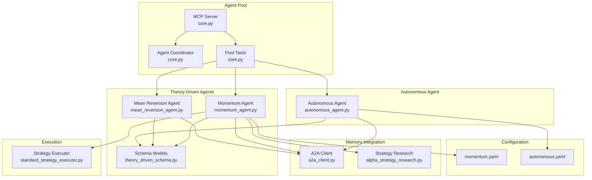
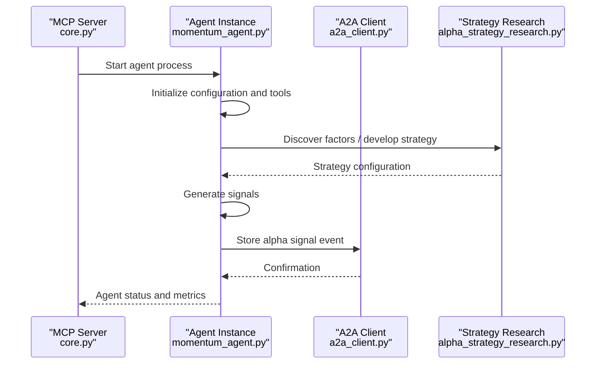
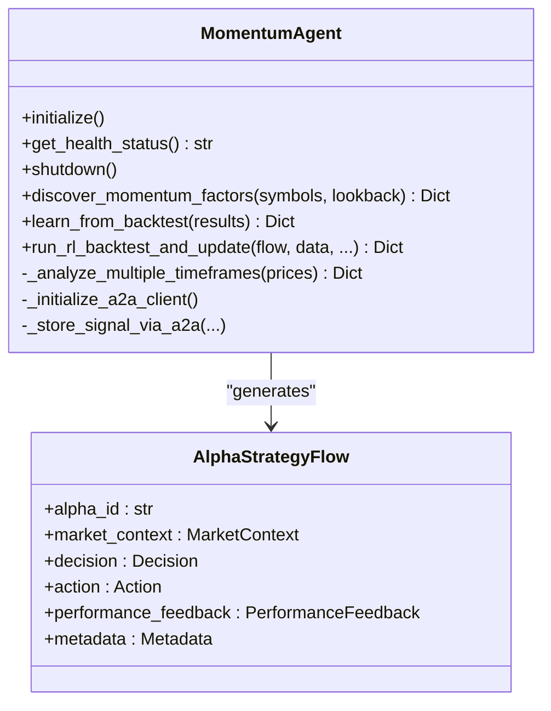
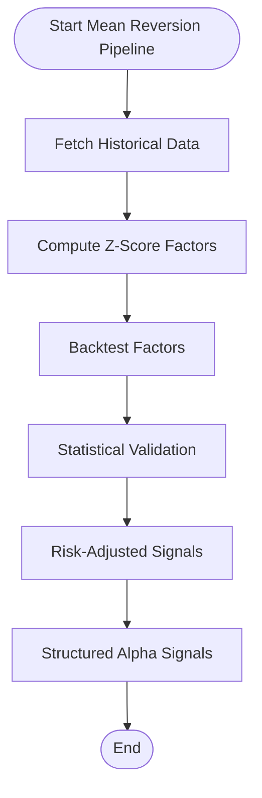
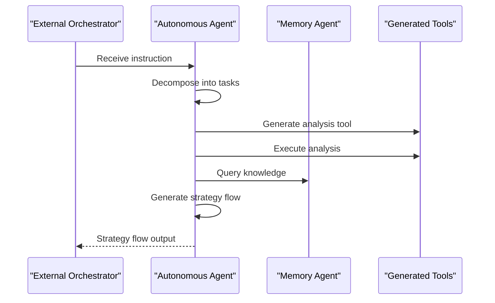
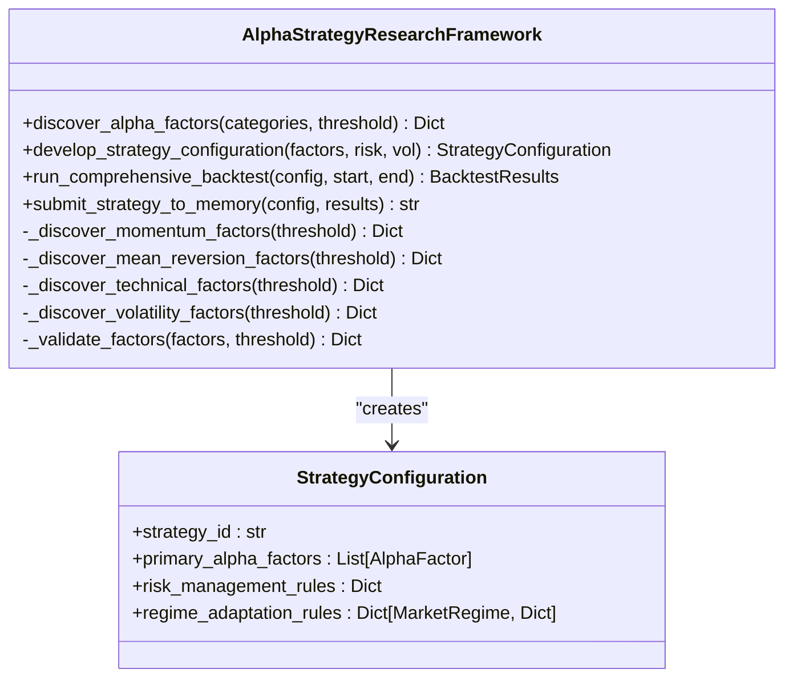
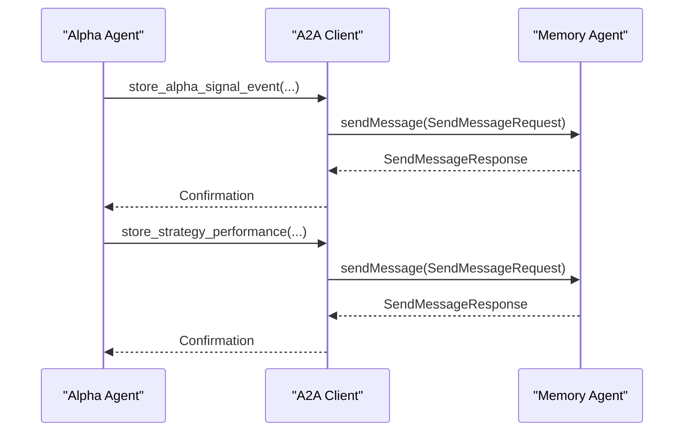
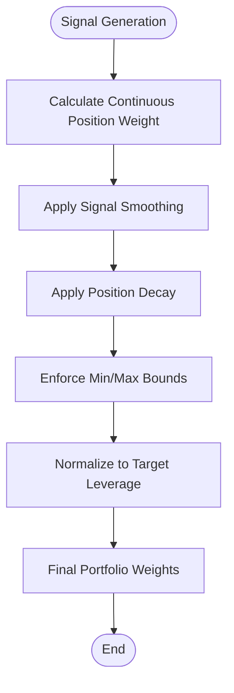
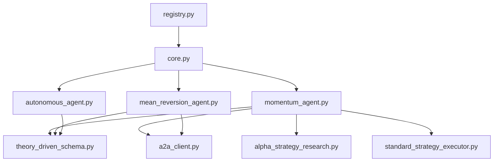

# Agent Development Tutorials

<cite>
**Referenced Files in This Document**
- [README.md](file://FinAgents/agent_pools/alpha_agent_pool/README.md)
- [core.py](file://FinAgents/agent_pools/alpha_agent_pool/core.py)
- [momentum_agent.py](file://FinAgents/agent_pools/alpha_agent_pool/agents/theory_driven/momentum_agent.py)
- [mean_reversion_agent.py](file://FinAgents/agent_pools/alpha_agent_pool/agents/theory_driven/mean_reversion_agent.py)
- [autonomous_agent.py](file://FinAgents/agent_pools/alpha_agent_pool/agents/autonomous/autonomous_agent.py)
- [theory_driven_schema.py](file://FinAgents/agent_pools/alpha_agent_pool/schema/theory_driven_schema.py)
- [momentum.yaml](file://FinAgents/agent_pools/alpha_agent_pool/config/momentum.yaml)
- [autonomous.yaml](file://FinAgents/agent_pools/alpha_agent_pool/config/autonomous.yaml)
- [a2a_client.py](file://FinAgents/agent_pools/alpha_agent_pool/agents/theory_driven/a2a_client.py)
- [alpha_strategy_research.py](file://FinAgents/agent_pools/alpha_agent_pool/alpha_strategy_research.py)
- [standard_strategy_executor.py](file://FinAgents/agent_pools/alpha_agent_pool/qlib_local/standard_strategy_executor.py)
- [agents.py](file://FinAgents/agent_pools/alpha_agent_pool/agents.py)
- [registry.py](file://FinAgents/agent_pools/alpha_agent_pool/registry.py)
</cite>

## Table of Contents
1. [Introduction](#introduction)
2. [Project Structure](#project-structure)
3. [Core Components](#core-components)
4. [Architecture Overview](#architecture-overview)
5. [Detailed Component Analysis](#detailed-component-analysis)
6. [Dependency Analysis](#dependency-analysis)
7. [Performance Considerations](#performance-considerations)
8. [Troubleshooting Guide](#troubleshooting-guide)
9. [Conclusion](#conclusion)
10. [Appendices](#appendices)

## Introduction
This tutorial provides a comprehensive guide to building custom trading agents within the Agentic Trading Application. It covers agent architecture patterns, signal generation algorithms, strategy implementation, and integration with the agent pool system. You will learn how to develop momentum strategies, mean-reversion algorithms, and machine learning-based approaches, along with templates, testing methodologies, debugging techniques, and performance optimization strategies.

## Project Structure
The agent development system centers around the Alpha Agent Pool, which orchestrates multiple specialized agents and integrates with a memory system for distributed coordination and knowledge sharing. Key areas include:
- Agent pool orchestration and lifecycle management
- Theory-driven agents (momentum, mean reversion)
- Autonomous agent for self-orchestrated workflows
- Configuration and schema definitions
- Memory integration via A2A protocol
- Strategy research and backtesting framework
- Position sizing and portfolio construction



**Diagram sources**
- [core.py:431-800](file://FinAgents/agent_pools/alpha_agent_pool/core.py#L431-L800)
- [momentum_agent.py:77-430](file://FinAgents/agent_pools/alpha_agent_pool/agents/theory_driven/momentum_agent.py#L77-L430)
- [mean_reversion_agent.py:1-200](file://FinAgents/agent_pools/alpha_agent_pool/agents/theory_driven/mean_reversion_agent.py#L1-L200)
- [autonomous_agent.py:52-120](file://FinAgents/agent_pools/alpha_agent_pool/agents/autonomous/autonomous_agent.py#L52-L120)
- [theory_driven_schema.py:1-87](file://FinAgents/agent_pools/alpha_agent_pool/schema/theory_driven_schema.py#L1-L87)
- [momentum.yaml:1-24](file://FinAgents/agent_pools/alpha_agent_pool/config/momentum.yaml#L1-L24)
- [autonomous.yaml:1-33](file://FinAgents/agent_pools/alpha_agent_pool/config/autonomous.yaml#L1-L33)
- [a2a_client.py:60-120](file://FinAgents/agent_pools/alpha_agent_pool/agents/theory_driven/a2a_client.py#L60-L120)
- [alpha_strategy_research.py:190-296](file://FinAgents/agent_pools/alpha_agent_pool/alpha_strategy_research.py#L190-L296)
- [standard_strategy_executor.py:13-115](file://FinAgents/agent_pools/alpha_agent_pool/qlib_local/standard_strategy_executor.py#L13-L115)

**Section sources**
- [README.md:1-204](file://FinAgents/agent_pools/alpha_agent_pool/README.md#L1-L204)
- [core.py:431-800](file://FinAgents/agent_pools/alpha_agent_pool/core.py#L431-L800)

## Core Components
- Agent Pool MCP Server: Centralized orchestration with lifecycle management, agent registration, and tool integration.
- Theory-Driven Agents: Specialized agents implementing academic strategies with memory integration.
- Autonomous Agent: Self-orchestrating agent with dynamic code generation and strategy flow output.
- Configuration and Schema: YAML configurations and Pydantic models defining agent behavior and outputs.
- Memory Integration: A2A protocol client for distributed memory coordination and strategy sharing.
- Strategy Research: Academic framework for factor discovery, strategy configuration, and backtesting.
- Execution Engine: Position sizing and portfolio construction for signal implementation.

**Section sources**
- [core.py:431-800](file://FinAgents/agent_pools/alpha_agent_pool/core.py#L431-L800)
- [theory_driven_schema.py:1-87](file://FinAgents/agent_pools/alpha_agent_pool/schema/theory_driven_schema.py#L1-L87)
- [a2a_client.py:60-120](file://FinAgents/agent_pools/alpha_agent_pool/agents/theory_driven/a2a_client.py#L60-L120)
- [alpha_strategy_research.py:190-296](file://FinAgents/agent_pools/alpha_agent_pool/alpha_strategy_research.py#L190-L296)
- [standard_strategy_executor.py:13-115](file://FinAgents/agent_pools/alpha_agent_pool/qlib_local/standard_strategy_executor.py#L13-L115)

## Architecture Overview
The system follows a multi-agent architecture with:
- Central MCP server managing agent lifecycles and tool registration
- A2A protocol for memory coordination and cross-agent learning
- Academic strategy research framework for factor discovery and validation
- Position sizing and portfolio construction for signal execution



**Diagram sources**
- [core.py:573-680](file://FinAgents/agent_pools/alpha_agent_pool/core.py#L573-L680)
- [momentum_agent.py:407-430](file://FinAgents/agent_pools/alpha_agent_pool/agents/theory_driven/momentum_agent.py#L407-L430)
- [a2a_client.py:207-267](file://FinAgents/agent_pools/alpha_agent_pool/agents/theory_driven/a2a_client.py#L207-L267)
- [alpha_strategy_research.py:238-296](file://FinAgents/agent_pools/alpha_agent_pool/alpha_strategy_research.py#L238-L296)

## Detailed Component Analysis

### Momentum Agent
The Momentum Agent implements academic momentum strategies with adaptive window selection, backtesting integration, and A2A memory coordination.

Key capabilities:
- Multi-timeframe momentum analysis with adaptive window selection
- Reinforcement learning updates for optimal window selection
- Backtesting with performance attribution and IC/IR metrics
- A2A protocol integration for memory storage and cross-agent learning



**Diagram sources**
- [momentum_agent.py:77-430](file://FinAgents/agent_pools/alpha_agent_pool/agents/theory_driven/momentum_agent.py#L77-L430)
- [theory_driven_schema.py:47-55](file://FinAgents/agent_pools/alpha_agent_pool/schema/theory_driven_schema.py#L47-L55)

**Section sources**
- [momentum_agent.py:77-430](file://FinAgents/agent_pools/alpha_agent_pool/agents/theory_driven/momentum_agent.py#L77-L430)
- [momentum.yaml:1-24](file://FinAgents/agent_pools/alpha_agent_pool/config/momentum.yaml#L1-L24)
- [theory_driven_schema.py:1-87](file://FinAgents/agent_pools/alpha_agent_pool/schema/theory_driven_schema.py#L1-L87)

### Mean Reversion Agent
The Mean Reversion Agent implements systematic mean reversion strategies with statistical validation and risk management.

Key capabilities:
- Z-score based mean reversion factor construction
- Statistical validation with IC and Sharpe ratio
- Risk-adjusted signal generation with position sizing
- Integration with OpenAI Agents SDK for autonomous execution



**Diagram sources**
- [mean_reversion_agent.py:196-287](file://FinAgents/agent_pools/alpha_agent_pool/agents/theory_driven/mean_reversion_agent.py#L196-L287)

**Section sources**
- [mean_reversion_agent.py:1-200](file://FinAgents/agent_pools/alpha_agent_pool/agents/theory_driven/mean_reversion_agent.py#L1-L200)
- [agents.py:1-163](file://FinAgents/agent_pools/alpha_agent_pool/agents.py#L1-L163)

### Autonomous Agent
The Autonomous Agent demonstrates self-orchestrated workflows with dynamic code generation and strategy flow output.

Key capabilities:
- Task decomposition and autonomous execution planning
- Dynamic code generation for financial analysis
- Strategy flow generation with market context and decision metadata
- Persistent workspace for generated artifacts



**Diagram sources**
- [autonomous_agent.py:52-120](file://FinAgents/agent_pools/alpha_agent_pool/agents/autonomous/autonomous_agent.py#L52-L120)
- [autonomous_agent.py:183-291](file://FinAgents/agent_pools/alpha_agent_pool/agents/autonomous/autonomous_agent.py#L183-L291)

**Section sources**
- [autonomous_agent.py:52-120](file://FinAgents/agent_pools/alpha_agent_pool/agents/autonomous/autonomous_agent.py#L52-L120)
- [autonomous.yaml:1-33](file://FinAgents/agent_pools/alpha_agent_pool/config/autonomous.yaml#L1-L33)

### Strategy Research Framework
The Alpha Strategy Research Framework provides academic methodologies for factor discovery, strategy configuration, and backtesting.

Key capabilities:
- Systematic alpha factor discovery across categories
- Strategy configuration with risk management rules
- Comprehensive backtesting with academic metrics
- Memory integration for distributed strategy storage



**Diagram sources**
- [alpha_strategy_research.py:190-296](file://FinAgents/agent_pools/alpha_agent_pool/alpha_strategy_research.py#L190-L296)
- [alpha_strategy_research.py:503-578](file://FinAgents/agent_pools/alpha_agent_pool/alpha_strategy_research.py#L503-L578)

**Section sources**
- [alpha_strategy_research.py:190-296](file://FinAgents/agent_pools/alpha_agent_pool/alpha_strategy_research.py#L190-L296)
- [alpha_strategy_research.py:503-578](file://FinAgents/agent_pools/alpha_agent_pool/alpha_strategy_research.py#L503-L578)

### Memory Integration (A2A Protocol)
The A2A client provides official protocol integration for distributed memory coordination.

Key capabilities:
- Official A2A protocol compliance
- Agent pool level memory coordination
- Direct alpha agent communication
- Standardized task-based memory operations



**Diagram sources**
- [a2a_client.py:207-316](file://FinAgents/agent_pools/alpha_agent_pool/agents/theory_driven/a2a_client.py#L207-L316)

**Section sources**
- [a2a_client.py:60-120](file://FinAgents/agent_pools/alpha_agent_pool/agents/theory_driven/a2a_client.py#L60-L120)
- [a2a_client.py:207-316](file://FinAgents/agent_pools/alpha_agent_pool/agents/theory_driven/a2a_client.py#L207-L316)

### Position Sizing and Portfolio Construction
The standard strategy executor handles continuous position weighting and portfolio construction.

Key capabilities:
- Continuous position weight calculation based on signal strength
- Signal smoothing and position decay logic
- Per-position min/max constraints and portfolio normalization
- Support for long-only and long/short strategies



**Diagram sources**
- [standard_strategy_executor.py:24-115](file://FinAgents/agent_pools/alpha_agent_pool/qlib_local/standard_strategy_executor.py#L24-L115)
- [standard_strategy_executor.py:147-189](file://FinAgents/agent_pools/alpha_agent_pool/qlib_local/standard_strategy_executor.py#L147-L189)

**Section sources**
- [standard_strategy_executor.py:13-115](file://FinAgents/agent_pools/alpha_agent_pool/qlib_local/standard_strategy_executor.py#L13-L115)
- [standard_strategy_executor.py:147-189](file://FinAgents/agent_pools/alpha_agent_pool/qlib_local/standard_strategy_executor.py#L147-L189)

## Dependency Analysis
The agent system exhibits layered dependencies with clear separation of concerns:



**Diagram sources**
- [core.py:431-800](file://FinAgents/agent_pools/alpha_agent_pool/core.py#L431-L800)
- [momentum_agent.py:77-430](file://FinAgents/agent_pools/alpha_agent_pool/agents/theory_driven/momentum_agent.py#L77-L430)
- [mean_reversion_agent.py:1-200](file://FinAgents/agent_pools/alpha_agent_pool/agents/theory_driven/mean_reversion_agent.py#L1-L200)
- [autonomous_agent.py:52-120](file://FinAgents/agent_pools/alpha_agent_pool/agents/autonomous/autonomous_agent.py#L52-L120)
- [theory_driven_schema.py:1-87](file://FinAgents/agent_pools/alpha_agent_pool/schema/theory_driven_schema.py#L1-L87)
- [a2a_client.py:60-120](file://FinAgents/agent_pools/alpha_agent_pool/agents/theory_driven/a2a_client.py#L60-L120)
- [alpha_strategy_research.py:190-296](file://FinAgents/agent_pools/alpha_agent_pool/alpha_strategy_research.py#L190-L296)
- [standard_strategy_executor.py:13-115](file://FinAgents/agent_pools/alpha_agent_pool/qlib_local/standard_strategy_executor.py#L13-L115)
- [registry.py:23-55](file://FinAgents/agent_pools/alpha_agent_pool/registry.py#L23-L55)

**Section sources**
- [core.py:431-800](file://FinAgents/agent_pools/alpha_agent_pool/core.py#L431-L800)
- [registry.py:23-55](file://FinAgents/agent_pools/alpha_agent_pool/registry.py#L23-L55)

## Performance Considerations
- Adaptive window selection in momentum agents reduces overfitting and improves generalization
- Signal smoothing prevents excessive position churn and reduces transaction costs
- Position decay logic balances responsiveness with stability
- Memory integration via A2A protocol enables distributed learning and cross-agent knowledge transfer
- Academic validation ensures statistical significance and robustness of discovered factors

## Troubleshooting Guide
Common issues and resolutions:
- Port conflicts during agent startup: The MCP server automatically finds available ports and logs alternative assignments
- A2A protocol failures: Fallback HTTP communication is available when the official toolkit is not installed
- Configuration loading errors: YAML configuration files must match expected schema definitions
- Memory bridge connectivity: Health checks validate connections and provide heartbeat monitoring
- Agent lifecycle events: Logging captures startup, shutdown, and error states for debugging

**Section sources**
- [core.py:573-680](file://FinAgents/agent_pools/alpha_agent_pool/core.py#L573-L680)
- [a2a_client.py:116-150](file://FinAgents/agent_pools/alpha_agent_pool/agents/theory_driven/a2a_client.py#L116-L150)
- [registry.py:30-35](file://FinAgents/agent_pools/alpha_agent_pool/registry.py#L30-L35)

## Conclusion
This tutorial demonstrated how to build custom trading agents using the Alpha Agent Pool framework. By leveraging theory-driven strategies, autonomous workflows, academic research methodologies, and memory-integrated coordination, developers can create robust, scalable trading systems. The provided templates, configuration patterns, and integration points serve as a foundation for developing production-ready agents.

## Appendices

### Step-by-Step Tutorial: Building a Momentum Strategy Agent
1. **Configure Agent Settings**: Set up momentum.yaml with desired window and threshold parameters
2. **Implement Signal Generation**: Use multi-timeframe analysis to compute momentum signals
3. **Integrate Memory**: Store alpha signals via A2A protocol for cross-agent learning
4. **Backtest Strategy**: Validate performance using academic metrics (IC, IR, Sharpe ratio)
5. **Deploy Agent**: Start the agent through the MCP server with automatic port management

**Section sources**
- [momentum.yaml:1-24](file://FinAgents/agent_pools/alpha_agent_pool/config/momentum.yaml#L1-L24)
- [momentum_agent.py:656-717](file://FinAgents/agent_pools/alpha_agent_pool/agents/theory_driven/momentum_agent.py#L656-L717)
- [a2a_client.py:207-267](file://FinAgents/agent_pools/alpha_agent_pool/agents/theory_driven/a2a_client.py#L207-L267)

### Step-by-Step Tutorial: Building a Mean Reversion Strategy Agent
1. **Define Research Parameters**: Set symbols, lookback windows, and z-score thresholds
2. **Implement Factor Computation**: Calculate z-scores and statistical significance
3. **Validate Statistical Properties**: Test IC, Sharpe ratio, and t-statistics
4. **Generate Risk-Adjusted Signals**: Apply position sizing and risk controls
5. **Execute Backtesting**: Validate strategy performance across market regimes

**Section sources**
- [mean_reversion_agent.py:196-287](file://FinAgents/agent_pools/alpha_agent_pool/agents/theory_driven/mean_reversion_agent.py#L196-L287)
- [agents.py:1-163](file://FinAgents/agent_pools/alpha_agent_pool/agents.py#L1-L163)

### Step-by-Step Tutorial: Building an Autonomous Agent
1. **Set Up Configuration**: Configure autonomous.yaml with task processing parameters
2. **Implement Task Decomposition**: Break down orchestrator instructions into executable tasks
3. **Generate Analysis Tools**: Create dynamic code tools for financial analysis
4. **Persist Strategy Flows**: Store generated strategy flows with market context
5. **Monitor Execution**: Track task status and validation results

**Section sources**
- [autonomous.yaml:1-33](file://FinAgents/agent_pools/alpha_agent_pool/config/autonomous.yaml#L1-L33)
- [autonomous_agent.py:52-120](file://FinAgents/agent_pools/alpha_agent_pool/agents/autonomous/autonomous_agent.py#L52-L120)
- [autonomous_agent.py:183-291](file://FinAgents/agent_pools/alpha_agent_pool/agents/autonomous/autonomous_agent.py#L183-L291)

### Template: Base Agent Class
```python
class BaseAgent:
    def __init__(self, config):
        self.config = config
        self.initialize()
    
    def initialize(self):
        # Override in subclass
        pass
    
    def execute(self, request):
        # Override in subclass
        pass
    
    def shutdown(self):
        # Override in subclass
        pass
```

### Template: Strategy Flow Output
```python
from schema.theory_driven_schema import AlphaStrategyFlow, MarketContext, Decision

strategy_flow = AlphaStrategyFlow(
    alpha_id="unique_strategy_id",
    version="1.0",
    timestamp=datetime.now().isoformat(),
    market_context=MarketContext(
        symbol="AAPL",
        regime_tag="bull_trending",
        input_features={"momentum": 0.05, "volatility": 0.15}
    ),
    decision=Decision(
        signal="BUY",
        confidence=0.85,
        reasoning="Bullish momentum with strong risk-adjusted return",
        predicted_return=0.02,
        risk_estimate=0.05,
        signal_type="directional",
        asset_scope=["AAPL"]
    )
)
```

**Section sources**
- [theory_driven_schema.py:16-55](file://FinAgents/agent_pools/alpha_agent_pool/schema/theory_driven_schema.py#L16-L55)
- [momentum_agent.py:28-76](file://FinAgents/agent_pools/alpha_agent_pool/agents/theory_driven/momentum_agent.py#L28-L76)

### Testing Methodologies
- Unit testing for individual components (signal generation, position sizing)
- Integration testing for agent pool coordination
- Backtesting validation using academic metrics
- Memory integration testing with A2A protocol
- Performance benchmarking across market regimes

### Debugging Techniques
- Enable detailed logging for agent lifecycle events
- Monitor A2A protocol health checks and connection status
- Validate configuration files against schema definitions
- Use structured error handling with specific exception types
- Implement graceful degradation when optional dependencies are unavailable

### Performance Optimization
- Optimize signal computation through vectorized operations
- Implement caching for expensive computations
- Use asynchronous programming for I/O-bound operations
- Apply position decay to reduce turnover and transaction costs
- Utilize memory integration for cross-agent learning and pattern recognition