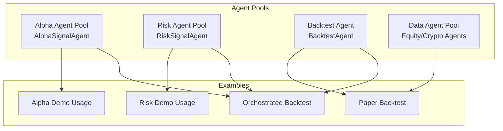
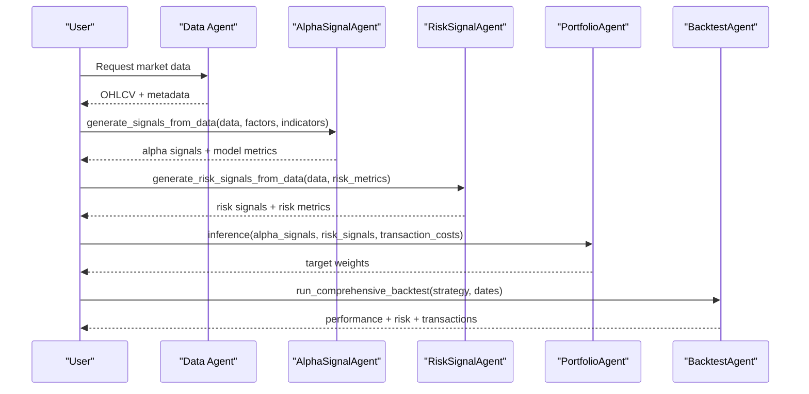
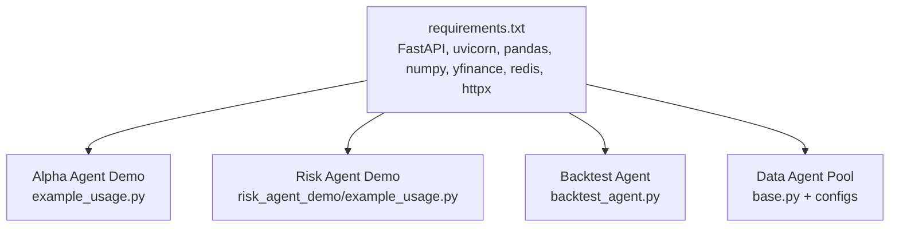

# Basic Usage Examples

<cite>
**Referenced Files in This Document**
- [example_usage.py](file://FinAgents/agent_pools/alpha_agent_demo/example_usage.py)
- [risk_agent_demo/example_usage.py](file://FinAgents/agent_pools/risk_agent_demo/example_usage.py)
- [run_paper_backtest.py](file://FinAgents/agent_pools/portfolio_agent_demo/run_paper_backtest.py)
- [run_backtest_fixed.py](file://examples/run_backtest_fixed.py)
- [backtest_agent.py](file://FinAgents/agent_pools/backtest_agent/backtest_agent.py)
- [BACKTEST_PAPER_INTERFACE.md](file://FinAgents/agent_pools/backtest_agent/BACKTEST_PAPER_INTERFACE.md)
- [base.py](file://FinAgents/agent_pools/data_agent_pool/base.py)
- [README.md](file://FinAgents/agent_pools/alpha_agent_pool/README.md)
- [requirements.txt](file://requirements.txt)
- [alpaca.yaml](file://FinAgents/agent_pools/data_agent_pool/config/alpaca.yaml)
</cite>

## Table of Contents
1. [Introduction](#introduction)
2. [Project Structure](#project-structure)
3. [Core Components](#core-components)
4. [Architecture Overview](#architecture-overview)
5. [Detailed Component Analysis](#detailed-component-analysis)
6. [Dependency Analysis](#dependency-analysis)
7. [Performance Considerations](#performance-considerations)
8. [Troubleshooting Guide](#troubleshooting-guide)
9. [Conclusion](#conclusion)

## Introduction
This guide provides beginner-friendly, step-by-step tutorials for the Agentic Trading Application. You will learn how to:
- Initialize agents and configure them for basic tasks
- Run simple backtests using both synthetic and real market data
- Access market data via data agents
- Generate basic alpha and risk signals
- Understand essential API calls and parameters
- Troubleshoot common setup and environment issues

The examples focus on practical workflows using the Alpha Signal Agent, Risk Signal Agent, Backtest Agent, and the paper-based backtest interface.

## Project Structure
The repository organizes functionality across agent pools, backtesting utilities, data access, and orchestration. Key areas for beginners:
- Alpha Agent Pool: Factor discovery, alpha signal generation, and strategy research
- Risk Agent Pool: Risk metrics computation and risk signal generation
- Backtest Agent: End-to-end backtesting with Qlib integration and paper interface
- Data Agent Pool: Market data access via APIs and MCP servers
- Examples: Ready-to-run scripts demonstrating end-to-end workflows

**Section sources**
- [README.md:1-204](file://FinAgents/agent_pools/alpha_agent_pool/README.md#L1-L204)

## Core Components
This section introduces the primary building blocks you will use in basic workflows.

- Alpha Signal Agent
  - Purpose: Build factors, compute technical indicators, train ML models, and generate alpha signals from market data.
  - Typical usage: generate_signals_from_data with factors, indicators, model type, and thresholds.
  - Outputs: model performance metrics, signal summaries, and feature importance.

- Risk Signal Agent
  - Purpose: Compute risk metrics (volatility, VaR, CVaR, max drawdown, beta, correlation, liquidity) and produce risk signals.
  - Typical usage: generate_risk_signals_from_data with selected metrics and optional market returns.
  - Outputs: overall risk level, risk score, and detailed risk metrics.

- Backtest Agent
  - Purpose: Run comprehensive backtests using Qlib or simplified logic, analyze factor performance, and generate reports.
  - Typical usage: initialize_qlib_data, create_alpha_factor_strategy, run_comprehensive_backtest, analyze_factor_performance, generate_detailed_report.
  - Outputs: performance metrics, risk metrics, transaction cost analysis, and optional visualizations.

- Data Agents (Equity/Crypto)
  - Purpose: Fetch market data from providers (e.g., Alpaca, Polygon, yfinance) and expose tools for orchestration.
  - Typical usage: BaseAgent.execute with function_name and inputs; configure credentials and endpoints.
  - Outputs: OHLCV data, company info, leader identification, and enriched metrics.

**Section sources**
- [example_usage.py:88-163](file://FinAgents/agent_pools/alpha_agent_demo/example_usage.py#L88-L163)
- [risk_agent_demo/example_usage.py:86-145](file://FinAgents/agent_pools/risk_agent_demo/example_usage.py#L86-L145)
- [backtest_agent.py:76-208](file://FinAgents/agent_pools/backtest_agent/backtest_agent.py#L76-L208)
- [base.py:11-61](file://FinAgents/agent_pools/data_agent_pool/base.py#L11-L61)

## Architecture Overview
The basic usage examples follow a layered workflow:
- Data ingestion: Use data agents or synthetic data
- Alpha generation: AlphaSignalAgent computes signals
- Risk generation: RiskSignalAgent computes risk metrics
- Portfolio construction: Combine alpha and risk signals with transaction cost models
- Backtesting: Run simulations and evaluate performance
- Reporting: Summarize metrics and optionally visualize results

**Diagram sources**
- [run_paper_backtest.py:71-256](file://FinAgents/agent_pools/portfolio_agent_demo/run_paper_backtest.py#L71-L256)
- [backtest_agent.py:346-456](file://FinAgents/agent_pools/backtest_agent/backtest_agent.py#L346-L456)

## Detailed Component Analysis

### Initialize and Run Alpha Signal Agent
Step-by-step tutorial:
1. Prepare market data
   - Option A: Use synthetic data generator included in the demo script
   - Option B: Load real data via a data agent (see Data Access section)
2. Instantiate AlphaSignalAgent
3. Define factors and indicators
4. Call generate_signals_from_data with model type and signal threshold
5. Inspect results: model performance, signal summary, and feature importance

Essential parameters:
- data: DataFrame with OHLCV and MultiIndex (date, symbol/instrument)
- factors: list of dicts with keys like factor_name, factor_type, calculation_method, expression/lookback_period
- indicators: list of technical indicator names (e.g., RSI, MACD, Bollinger, MA)
- model_type: linear, lightgbm, random_forest
- signal_threshold: numeric threshold for signal classification

Expected outputs:
- status: success/error
- model_performance: test_correlation, test_mae, n_features, n_samples
- signal_summary: total, long, short, neutral counts
- feature_importance: dict of feature to importance

Common configuration options:
- Use Qlib-compatible expressions for factor definitions
- Adjust lookback periods to match your data frequency

**Section sources**
- [example_usage.py:88-163](file://FinAgents/agent_pools/alpha_agent_demo/example_usage.py#L88-L163)
- [example_usage.py:165-218](file://FinAgents/agent_pools/alpha_agent_demo/example_usage.py#L165-L218)
- [example_usage.py:220-271](file://FinAgents/agent_pools/alpha_agent_demo/example_usage.py#L220-L271)

### Initialize and Run Risk Signal Agent
Step-by-step tutorial:
1. Prepare market data (same as above)
2. Instantiate RiskSignalAgent
3. Choose risk metrics (volatility, VaR, CVaR, max_drawdown, beta, correlation, liquidity)
4. Optionally supply market_returns for beta calculations
5. Call generate_risk_signals_from_data
6. Interpret results: overall risk level, risk score, and detailed metrics

Essential parameters:
- data: DataFrame with OHLCV and date/symbol columns
- risk_metrics: list of desired metrics
- market_returns: optional Series of benchmark returns

Expected outputs:
- overall_risk_level: LOW/MEDIUM/HIGH
- risk_score: numeric score
- risk_metrics: dict of computed metrics
- risk_signals: dict of derived signals

**Section sources**
- [risk_agent_demo/example_usage.py:86-145](file://FinAgents/agent_pools/risk_agent_demo/example_usage.py#L86-L145)
- [risk_agent_demo/example_usage.py:147-187](file://FinAgents/agent_pools/risk_agent_demo/example_usage.py#L147-L187)
- [risk_agent_demo/example_usage.py:188-228](file://FinAgents/agent_pools/risk_agent_demo/example_usage.py#L188-L228)

### Run a Simple Backtest (Paper Interface)
Step-by-step tutorial:
1. Assemble agents: AlphaSignalAgent, RiskSignalAgent, PortfolioAgent
2. Generate mock or real market data
3. Compute alpha signals (e.g., momentum factor)
4. Compute risk signals (e.g., volatility, VaR)
5. Run portfolio inference to get target weights
6. Simulate execution with transaction costs and slippage
7. Aggregate portfolio history and compute performance metrics

Essential parameters:
- start_date/end_date: backtest window
- symbols: asset universe
- transaction_costs: dict with fixed_cost and slippage
- risk thresholds and position sizing constraints

Expected outputs:
- Portfolio value series, returns, cash, risk level
- Performance metrics: total return, Sharpe ratio, max drawdown
- Saved plots and metrics table

**Section sources**
- [run_paper_backtest.py:71-256](file://FinAgents/agent_pools/portfolio_agent_demo/run_paper_backtest.py#L71-L256)

### Run Backtest Using Backtest Agent
Step-by-step tutorial:
1. Initialize BacktestAgent
2. Initialize Qlib data provider (optional; falls back to simplified logic)
3. Create alpha factor strategy with parameters and risk controls
4. Run comprehensive backtest over a date range
5. Analyze factor performance and generate detailed report
6. Optionally optimize parameters and calculate transaction costs

Essential parameters:
- strategy_id: unique identifier for the strategy
- start_date/end_date: backtest period
- benchmark: benchmark asset for comparison
- strategy_params: dict controlling rebalancing, position sizing, leverage, risk budget

Expected outputs:
- performance_metrics: total_return, sharpe_ratio, volatility, max_drawdown
- risk_metrics: VaR, CVaR, drawdown statistics
- transaction_analysis: cost breakdown and impact
- factor_attribution: contribution analysis
- detailed_results: returns, positions, trades

**Section sources**
- [backtest_agent.py:76-208](file://FinAgents/agent_pools/backtest_agent/backtest_agent.py#L76-L208)
- [backtest_agent.py:277-344](file://FinAgents/agent_pools/backtest_agent/backtest_agent.py#L277-L344)
- [backtest_agent.py:346-456](file://FinAgents/agent_pools/backtest_agent/backtest_agent.py#L346-L456)

### Access Market Data via Data Agents
Step-by-step tutorial:
1. Choose a data agent (e.g., Equity/Polygon, Crypto agents)
2. Configure credentials and endpoints (API keys, base URLs, rate limits)
3. Instantiate BaseAgent with configuration
4. Execute tools by name with inputs (e.g., fetch_market_data, analyze_company)
5. Parse results and integrate into downstream agents

Essential parameters:
- Authentication: API keys and secrets
- Endpoints: base URLs and resource paths
- Constraints: timeouts and rate limits

Example configuration:
- Alpaca agent YAML defines base URL, endpoints, and credentials

**Section sources**
- [base.py:11-61](file://FinAgents/agent_pools/data_agent_pool/base.py#L11-L61)
- [alpaca.yaml:1-16](file://FinAgents/agent_pools/data_agent_pool/config/alpaca.yaml#L1-L16)

### Orchestrate Backtests Across Years
Step-by-step tutorial:
1. Initialize Orchestrator (which manages Alpha, Risk, and Portfolio agents)
2. Iterate over years, calling run_pipeline with symbols and date ranges
3. Collect performance metrics (Sharpe ratio, total return)
4. Optionally optimize agent prompts when performance drops below threshold
5. Save optimized prompts for reuse

Expected outputs:
- Performance history per year
- Updated agent instructions

**Section sources**
- [run_backtest_fixed.py:13-66](file://examples/run_backtest_fixed.py#L13-L66)

## Dependency Analysis
The basic usage examples rely on several foundational libraries and configurations.

**Diagram sources**
- [requirements.txt:1-17](file://requirements.txt#L1-L17)
- [example_usage.py:12-21](file://FinAgents/agent_pools/alpha_agent_demo/example_usage.py#L12-L21)
- [risk_agent_demo/example_usage.py:11-20](file://FinAgents/agent_pools/risk_agent_demo/example_usage.py#L11-L20)
- [backtest_agent.py:1-16](file://FinAgents/agent_pools/backtest_agent/backtest_agent.py#L1-L16)
- [base.py:7-8](file://FinAgents/agent_pools/data_agent_pool/base.py#L7-L8)

**Section sources**
- [requirements.txt:1-17](file://requirements.txt#L1-L17)

## Performance Considerations
- Data size and frequency: Larger datasets and higher-frequency data increase computation time for factor construction and backtesting.
- Model choice: Linear models are fast; tree-based models (e.g., LightGBM) offer better performance but take longer to train.
- Lookback windows: Longer windows improve stability but require more data and increase latency.
- Transaction costs: Include realistic slippage and fees to avoid optimistic performance estimates.
- Parallelization: Use batch processing for multiple symbols and rolling windows to speed up computations.

## Troubleshooting Guide
Common setup and environment issues:

- Missing OPENAI_API_KEY
  - Symptom: Interactive examples skip or show warnings.
  - Fix: Set environment variable OPENAI_API_KEY before running scripts that use LLM features.

- Qlib not available or initialization fails
  - Symptom: Qlib components unavailable; fallback to simplified backtesting.
  - Fix: Install Qlib or ensure qlib-data directory exists; verify provider URI and region settings.

- Data provider credentials missing
  - Symptom: Data agent errors due to missing API keys.
  - Fix: Populate API keys and secrets in configuration files (e.g., alpaca.yaml).

- Insufficient data for backtesting
  - Symptom: Error indicating insufficient trading days.
  - Fix: Extend the date range or use longer lookback windows.

- Port conflicts for MCP servers
  - Symptom: Cannot start data or memory servers on configured ports.
  - Fix: Change ports in configuration or stop conflicting services.

- Python path issues
  - Symptom: ImportError when importing agents from demos.
  - Fix: Ensure the working directory includes the repository root so imports resolve correctly.

**Section sources**
- [example_usage.py:283-287](file://FinAgents/agent_pools/alpha_agent_demo/example_usage.py#L283-L287)
- [backtest_agent.py:60-69](file://FinAgents/agent_pools/backtest_agent/backtest_agent.py#L60-L69)
- [alpaca.yaml:10-12](file://FinAgents/agent_pools/data_agent_pool/config/alpaca.yaml#L10-L12)

## Conclusion
You now have practical, beginner-friendly examples to initialize agents, generate signals, access market data, and run simple backtests. Start with the Alpha and Risk demo scripts, then move to the paper backtest and Backtest Agent examples. Use the troubleshooting tips to resolve common setup issues, and adjust parameters to fit your data and performance goals.