# Examples and Tutorials

<cite>
**Referenced Files in This Document**
- [README.md](file://README.md)
- [examples/README.md](file://examples/README.md)
- [examples/alpha_agent_pool_memory_integration_examples.py](file://examples/alpha_agent_pool_memory_integration_examples.py)
- [examples/autonomous_agent_example.py](file://examples/autonomous_agent_example.py)
- [examples/run_backtest_fixed.py](file://examples/run_backtest_fixed.py)
- [FinAgents/agent_pools/backtest_agent/demo.ipynb](file://FinAgents/agent_pools/backtest_agent/demo.ipynb)
- [FinAgents/agent_pools/data_agent_pool/main.py](file://FinAgents/agent_pools/data_agent_pool/main.py)
- [FinAgents/agent_pools/risk_agent_pool/core.py](file://FinAgents/agent_pools/risk_agent_pool/core.py)
- [FinAgents/agent_pools/portfolio_agent_demo/portfolio_agent.py](file://FinAgents/agent_pools/portfolio_agent_demo/portfolio_agent.py)
- [FinAgents/agent_pools/transaction_cost_agent_pool/core.py](file://FinAgents/agent_pools/transaction_cost_agent_pool/core.py)
- [backend/api/main.py](file://backend/api/main.py)
- [backend/routes/agents.py](file://backend/routes/agents.py)
</cite>

## Table of Contents
1. [Introduction](#introduction)
2. [Project Structure](#project-structure)
3. [Core Components](#core-components)
4. [Architecture Overview](#architecture-overview)
5. [Detailed Component Analysis](#detailed-component-analysis)
6. [Dependency Analysis](#dependency-analysis)
7. [Performance Considerations](#performance-considerations)
8. [Troubleshooting Guide](#troubleshooting-guide)
9. [Conclusion](#conclusion)
10. [Appendices](#appendices)

## Introduction
This document provides comprehensive examples and tutorials for building, integrating, and operating the Agentic Trading Application. It focuses on practical implementation guides for:
- Integrating with market data providers
- Implementing custom agents
- Configuring risk controls
- Running backtests
- Using the API and MCP servers
- Building interactive notebooks and demonstration scripts

The goal is to enable hands-on learning and rapid prototyping while maintaining production-grade patterns for scalability, observability, and reliability.

## Project Structure
The repository is organized into:
- FinAgents: Multi-agent orchestration and agent pools (alpha, risk, transaction cost, data, portfolio)
- backend: FastAPI REST API, routes, services, and analytics
- examples: End-to-end notebooks and scripts for training, inference, and integration
- frontend: React trading dashboard (not covered here but integrates with backend APIs)

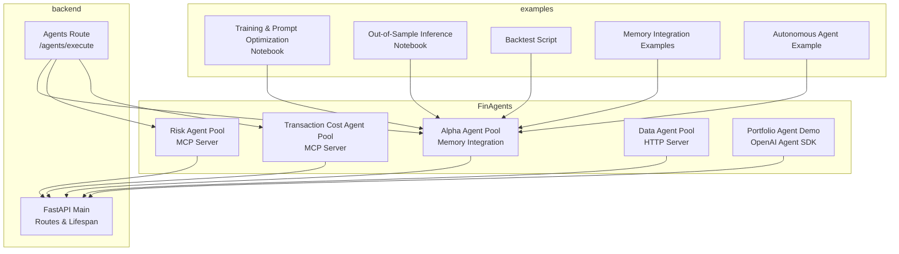

**Diagram sources**
- [FinAgents/agent_pools/risk_agent_pool/core.py:458-519](file://FinAgents/agent_pools/risk_agent_pool/core.py#L458-L519)
- [FinAgents/agent_pools/transaction_cost_agent_pool/core.py:537-554](file://FinAgents/agent_pools/transaction_cost_agent_pool/core.py#L537-L554)
- [FinAgents/agent_pools/data_agent_pool/main.py:1-6](file://FinAgents/agent_pools/data_agent_pool/main.py#L1-L6)
- [FinAgents/agent_pools/portfolio_agent_demo/portfolio_agent.py:155-187](file://FinAgents/agent_pools/portfolio_agent_demo/portfolio_agent.py#L155-L187)
- [backend/api/main.py:111-147](file://backend/api/main.py#L111-L147)
- [backend/routes/agents.py:24-43](file://backend/routes/agents.py#L24-L43)
- [examples/README.md:1-76](file://examples/README.md#L1-L76)

**Section sources**
- [README.md:252-335](file://README.md#L252-L335)
- [backend/api/main.py:111-147](file://backend/api/main.py#L111-L147)

## Core Components
- Agent pools: Specialized orchestration engines exposing MCP tools for external clients.
- Backend API: REST endpoints for agents, signals, portfolio, market data, and health checks.
- Examples: Training/inference notebooks, scripts, and integration demos.

Key capabilities:
- Risk Agent Pool: Natural language parsing, agent selection, and MCP tooling.
- Transaction Cost Agent Pool: Pre/post-trade cost analysis, optimization, and risk-adjusted cost calculations.
- Data Agent Pool: HTTP server for market data services.
- Portfolio Agent Demo: OpenAI Agent SDK-based portfolio construction.
- Examples: Backtesting, memory integration, autonomous agent workflows.

**Section sources**
- [FinAgents/agent_pools/risk_agent_pool/core.py:137-187](file://FinAgents/agent_pools/risk_agent_pool/core.py#L137-L187)
- [FinAgents/agent_pools/transaction_cost_agent_pool/core.py:64-120](file://FinAgents/agent_pools/transaction_cost_agent_pool/core.py#L64-L120)
- [FinAgents/agent_pools/data_agent_pool/main.py:1-6](file://FinAgents/agent_pools/data_agent_pool/main.py#L1-L6)
- [FinAgents/agent_pools/portfolio_agent_demo/portfolio_agent.py:155-187](file://FinAgents/agent_pools/portfolio_agent_demo/portfolio_agent.py#L155-L187)
- [examples/README.md:1-76](file://examples/README.md#L1-L76)

## Architecture Overview
The system combines:
- MCP-based agent pools for specialized tasks (risk, transaction cost, data)
- REST API for orchestration and control-plane operations
- Examples and notebooks for training, inference, and integration

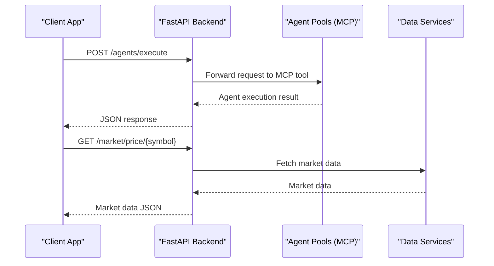

**Diagram sources**
- [backend/routes/agents.py:24-43](file://backend/routes/agents.py#L24-L43)
- [backend/api/main.py:111-147](file://backend/api/main.py#L111-L147)
- [FinAgents/agent_pools/risk_agent_pool/core.py:458-519](file://FinAgents/agent_pools/risk_agent_pool/core.py#L458-L519)
- [FinAgents/agent_pools/transaction_cost_agent_pool/core.py:537-554](file://FinAgents/agent_pools/transaction_cost_agent_pool/core.py#L537-L554)

## Detailed Component Analysis

### Integrating with Market Data Providers
This tutorial shows how to integrate market data services and use them in agent workflows.

Steps:
1. Start the data agent pool server.
2. Use the backend market route to fetch prices.
3. Build agent workflows that consume market data.

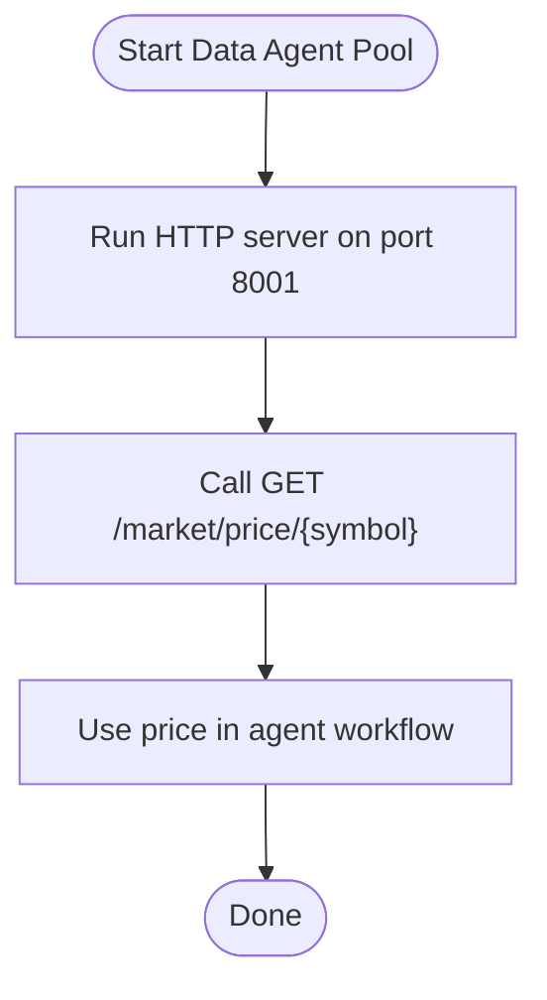

**Diagram sources**
- [FinAgents/agent_pools/data_agent_pool/main.py:1-6](file://FinAgents/agent_pools/data_agent_pool/main.py#L1-L6)
- [backend/api/main.py:111-147](file://backend/api/main.py#L111-L147)

Implementation highlights:
- Data agent pool HTTP server entrypoint.
- Backend market route wiring.

**Section sources**
- [FinAgents/agent_pools/data_agent_pool/main.py:1-6](file://FinAgents/agent_pools/data_agent_pool/main.py#L1-L6)
- [backend/api/main.py:111-147](file://backend/api/main.py#L111-L147)

### Implementing Custom Agents
This tutorial demonstrates building a portfolio agent using the OpenAI Agent SDK and ReAct-style tools.

Steps:
1. Define tools for portfolio construction and submission.
2. Create an agent with instructions and tools.
3. Run inference with alpha, risk, and transaction cost signals.

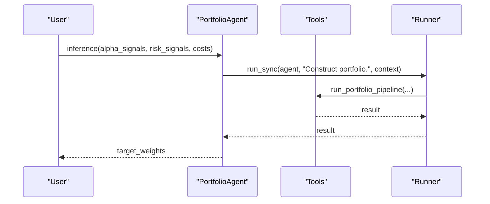

**Diagram sources**
- [FinAgents/agent_pools/portfolio_agent_demo/portfolio_agent.py:155-187](file://FinAgents/agent_pools/portfolio_agent_demo/portfolio_agent.py#L155-L187)
- [FinAgents/agent_pools/portfolio_agent_demo/portfolio_agent.py:88-150](file://FinAgents/agent_pools/portfolio_agent_demo/portfolio_agent.py#L88-L150)

Best practices:
- Keep tools focused and composable.
- Use context to pass signals and parameters.
- Return structured results for downstream consumers.

**Section sources**
- [FinAgents/agent_pools/portfolio_agent_demo/portfolio_agent.py:155-187](file://FinAgents/agent_pools/portfolio_agent_demo/portfolio_agent.py#L155-L187)
- [FinAgents/agent_pools/portfolio_agent_demo/portfolio_agent.py:88-150](file://FinAgents/agent_pools/portfolio_agent_demo/portfolio_agent.py#L88-L150)

### Configuring Risk Controls
This tutorial covers building and running a risk agent pool with MCP tools for natural language risk requests.

Steps:
1. Initialize the RiskAgentPool with OpenAI client and memory bridge.
2. Expose MCP tools: process_risk_analysis_request, calculate_portfolio_risk, get_agent_status.
3. Run the MCP server and health-check endpoint.

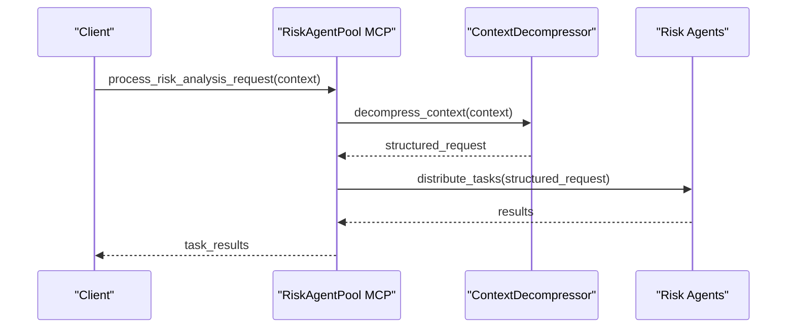

**Diagram sources**
- [FinAgents/agent_pools/risk_agent_pool/core.py:268-320](file://FinAgents/agent_pools/risk_agent_pool/core.py#L268-L320)
- [FinAgents/agent_pools/risk_agent_pool/core.py:458-519](file://FinAgents/agent_pools/risk_agent_pool/core.py#L458-L519)

Operational notes:
- Health check endpoint at /health.
- Parallel task execution across selected agents.
- Fallback parsing when OpenAI is unavailable.

**Section sources**
- [FinAgents/agent_pools/risk_agent_pool/core.py:137-187](file://FinAgents/agent_pools/risk_agent_pool/core.py#L137-L187)
- [FinAgents/agent_pools/risk_agent_pool/core.py:268-320](file://FinAgents/agent_pools/risk_agent_pool/core.py#L268-L320)
- [FinAgents/agent_pools/risk_agent_pool/core.py:458-519](file://FinAgents/agent_pools/risk_agent_pool/core.py#L458-L519)

### Running Backtests
This tutorial covers two approaches:
- Notebook-based training and out-of-sample inference
- Pure Python script for batch backtesting

Steps:
- Train prompts over multiple years using Orchestrator.
- Optimize prompts when Sharpe falls below threshold.
- Save optimized prompts to JSON.

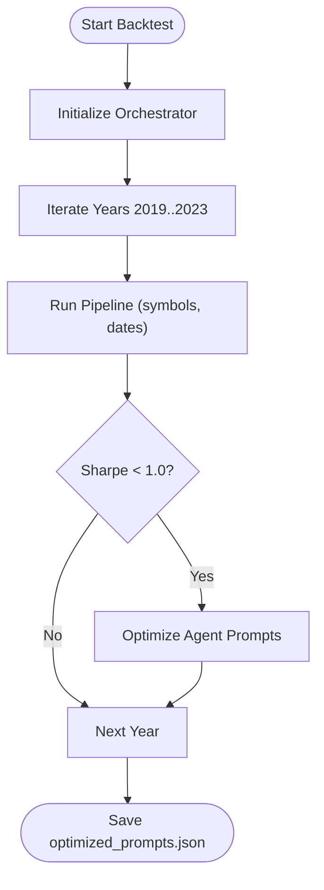

**Diagram sources**
- [examples/run_backtest_fixed.py:13-66](file://examples/run_backtest_fixed.py#L13-L66)
- [examples/README.md:7-28](file://examples/README.md#L7-L28)

Interactive notebook:
- Training and inference notebooks demonstrate world-model simulation and rolling weekly inference.

**Section sources**
- [examples/run_backtest_fixed.py:13-66](file://examples/run_backtest_fixed.py#L13-L66)
- [examples/README.md:1-76](file://examples/README.md#L1-L76)
- [FinAgents/agent_pools/backtest_agent/demo.ipynb:1-70](file://FinAgents/agent_pools/backtest_agent/demo.ipynb#L1-L70)

### API Usage Examples
This tutorial shows how to use the backend REST API for agent execution and listing.

Steps:
- Execute an agent via POST /agents/execute.
- List available agents via GET /agents/list.

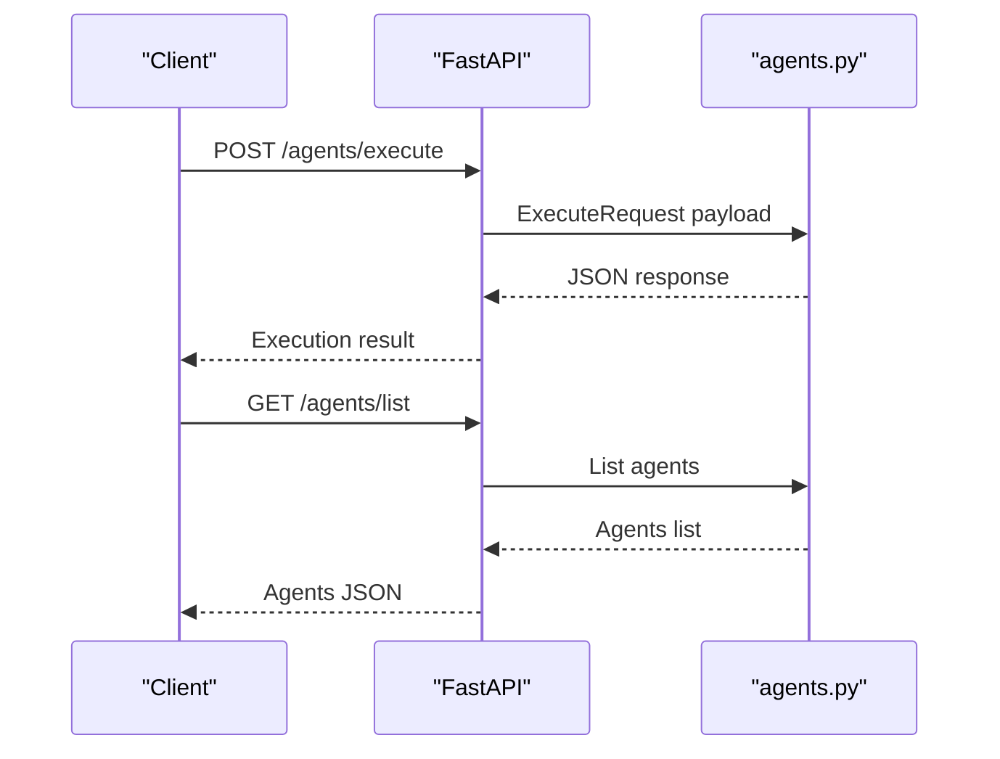

**Diagram sources**
- [backend/routes/agents.py:24-43](file://backend/routes/agents.py#L24-L43)
- [backend/api/main.py:111-147](file://backend/api/main.py#L111-L147)

**Section sources**
- [backend/routes/agents.py:24-43](file://backend/routes/agents.py#L24-L43)
- [backend/api/main.py:111-147](file://backend/api/main.py#L111-L147)

### Memory Integration Patterns
This tutorial demonstrates Alpha Agent Pool memory integration patterns for signals, performance tracking, pattern discovery, and real-time integration.

Highlights:
- Basic memory bridge setup
- Storing and retrieving alpha signals
- Performance tracking and analytics
- Pattern discovery and retrieval
- Real-time event submission and data retrieval

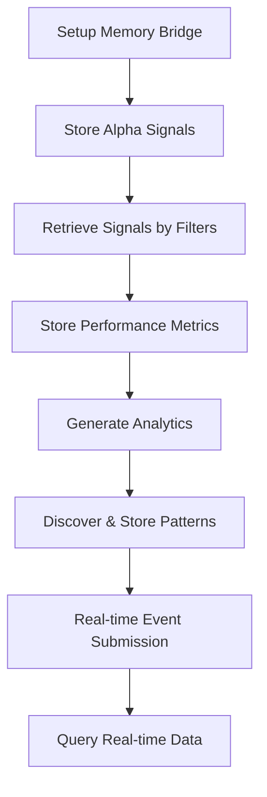

**Diagram sources**
- [examples/alpha_agent_pool_memory_integration_examples.py:48-712](file://examples/alpha_agent_pool_memory_integration_examples.py#L48-L712)

**Section sources**
- [examples/alpha_agent_pool_memory_integration_examples.py:48-712](file://examples/alpha_agent_pool_memory_integration_examples.py#L48-L712)

### Autonomous Agent Workflows
This tutorial demonstrates autonomous agent capabilities: orchestrator input processing, task decomposition, dynamic code generation, validation, and strategy flow generation.

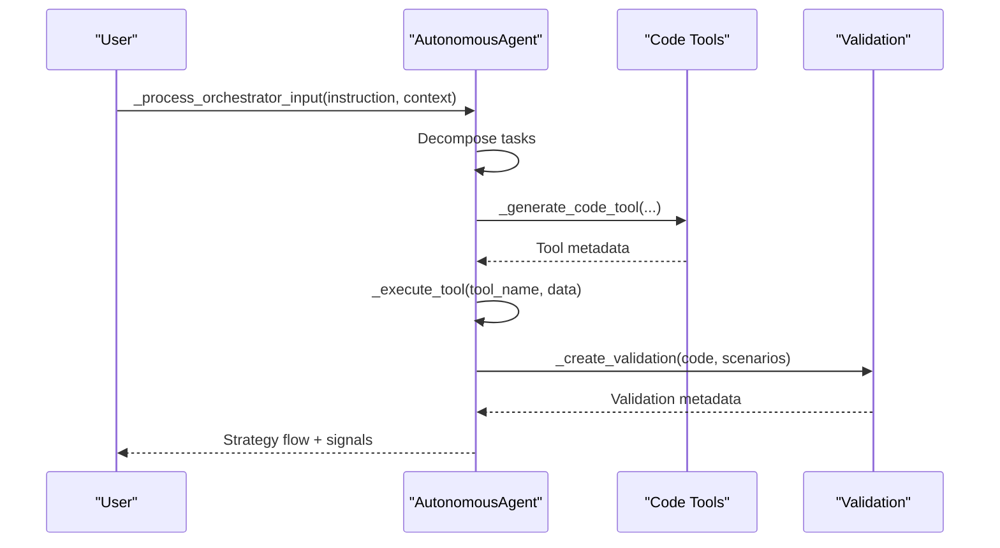

**Diagram sources**
- [examples/autonomous_agent_example.py:18-113](file://examples/autonomous_agent_example.py#L18-L113)
- [examples/autonomous_agent_example.py:113-198](file://examples/autonomous_agent_example.py#L113-L198)

**Section sources**
- [examples/autonomous_agent_example.py:18-113](file://examples/autonomous_agent_example.py#L18-L113)
- [examples/autonomous_agent_example.py:113-198](file://examples/autonomous_agent_example.py#L113-L198)

### Transaction Cost Analysis
This tutorial outlines how to estimate transaction costs, analyze execution quality, optimize portfolio execution, and compute risk-adjusted costs using the Transaction Cost Agent Pool.

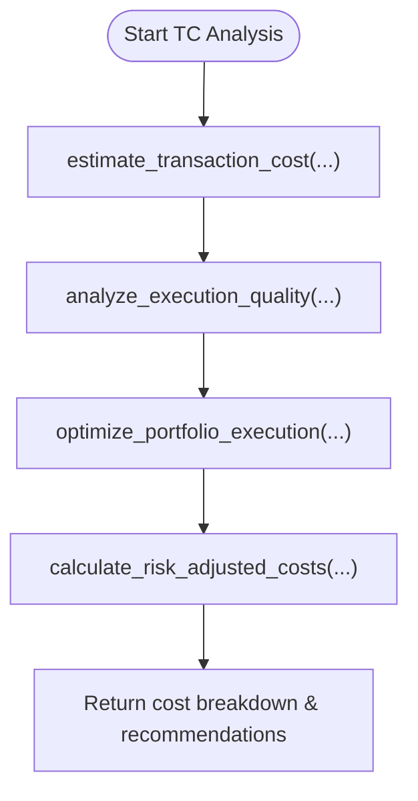

**Diagram sources**
- [FinAgents/agent_pools/transaction_cost_agent_pool/core.py:159-414](file://FinAgents/agent_pools/transaction_cost_agent_pool/core.py#L159-L414)

**Section sources**
- [FinAgents/agent_pools/transaction_cost_agent_pool/core.py:159-414](file://FinAgents/agent_pools/transaction_cost_agent_pool/core.py#L159-L414)

## Dependency Analysis
The system exhibits layered dependencies:
- Agent pools depend on MCP/FastAPI for tooling and HTTP transport.
- Backend API depends on SQLAlchemy models and routes.
- Examples depend on agent pools and notebooks for demonstrations.

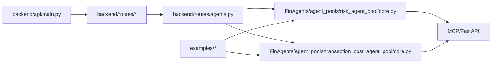

**Diagram sources**
- [backend/api/main.py:111-147](file://backend/api/main.py#L111-L147)
- [backend/routes/agents.py:24-43](file://backend/routes/agents.py#L24-L43)
- [FinAgents/agent_pools/risk_agent_pool/core.py:458-519](file://FinAgents/agent_pools/risk_agent_pool/core.py#L458-L519)
- [FinAgents/agent_pools/transaction_cost_agent_pool/core.py:537-554](file://FinAgents/agent_pools/transaction_cost_agent_pool/core.py#L537-L554)

**Section sources**
- [backend/api/main.py:111-147](file://backend/api/main.py#L111-L147)
- [backend/routes/agents.py:24-43](file://backend/routes/agents.py#L24-L43)
- [FinAgents/agent_pools/risk_agent_pool/core.py:458-519](file://FinAgents/agent_pools/risk_agent_pool/core.py#L458-L519)
- [FinAgents/agent_pools/transaction_cost_agent_pool/core.py:537-554](file://FinAgents/agent_pools/transaction_cost_agent_pool/core.py#L537-L554)

## Performance Considerations
- Use MCP SSE transport for scalable agent communication.
- Parallelize agent tasks where safe to avoid bottlenecks.
- Monitor performance metrics and error rates for agent pools.
- Cache frequently accessed market data and leverage streaming for real-time updates.
- Keep tool implementations modular and deterministic for reproducible backtests.

## Troubleshooting Guide
Common issues and resolutions:
- MCP server startup failures: Verify host/port availability and transport settings.
- OpenAI client initialization: Ensure OPENAI_API_KEY is set or provide client directly.
- Memory agent unavailability: Confirm external memory agent is reachable and configured.
- Backtest script errors: Validate symbol lists and date ranges; catch exceptions and print stack traces.
- Agent execution errors: Inspect agent status via MCP tools and health endpoints.

**Section sources**
- [FinAgents/agent_pools/risk_agent_pool/core.py:207-218](file://FinAgents/agent_pools/risk_agent_pool/core.py#L207-L218)
- [FinAgents/agent_pools/risk_agent_pool/core.py:546-582](file://FinAgents/agent_pools/risk_agent_pool/core.py#L546-L582)
- [examples/run_backtest_fixed.py:61-64](file://examples/run_backtest_fixed.py#L61-L64)

## Conclusion
This guide provides end-to-end examples for integrating market data, implementing custom agents, configuring risk controls, running backtests, and leveraging the API and MCP servers. Use the examples and notebooks as starting points to build production-grade agentic trading workflows.

## Appendices
- Interactive notebooks: Training and inference notebooks in the examples directory.
- Demonstration scripts: Backtest scripts and autonomous agent examples for quick iteration.