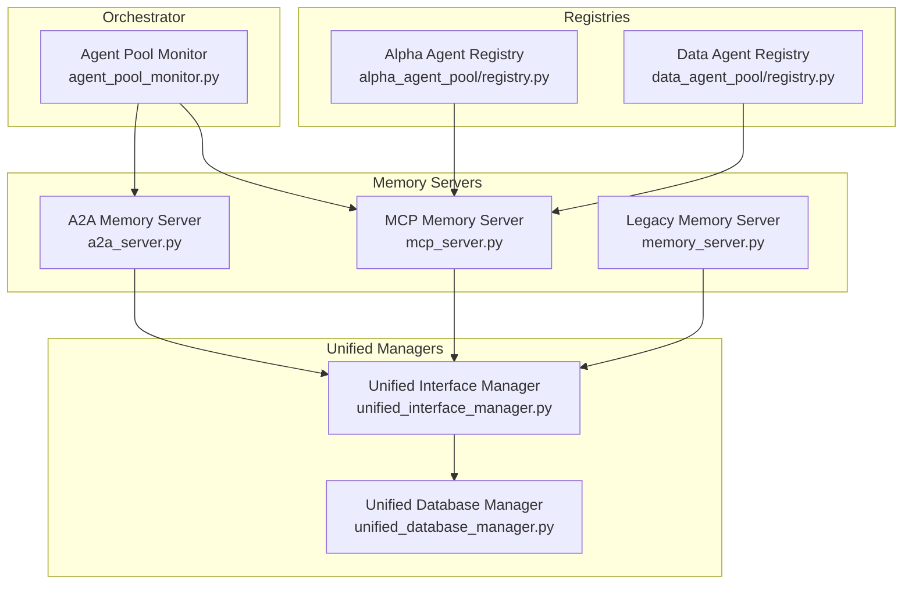
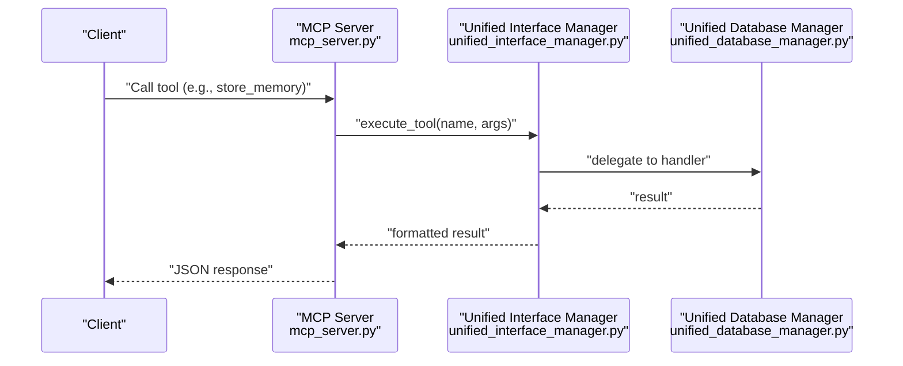
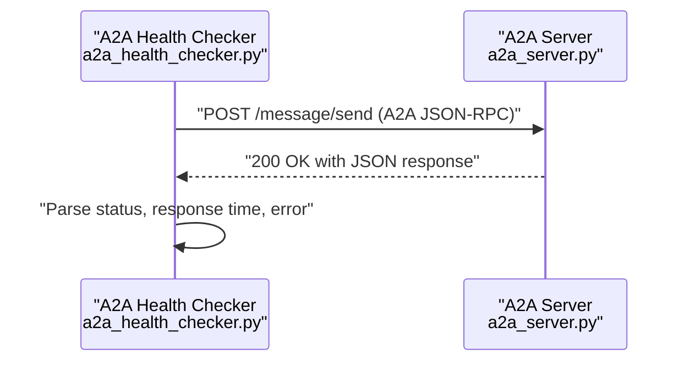
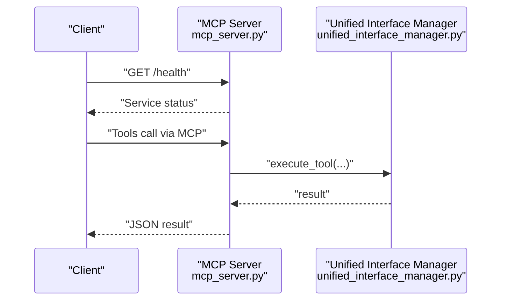
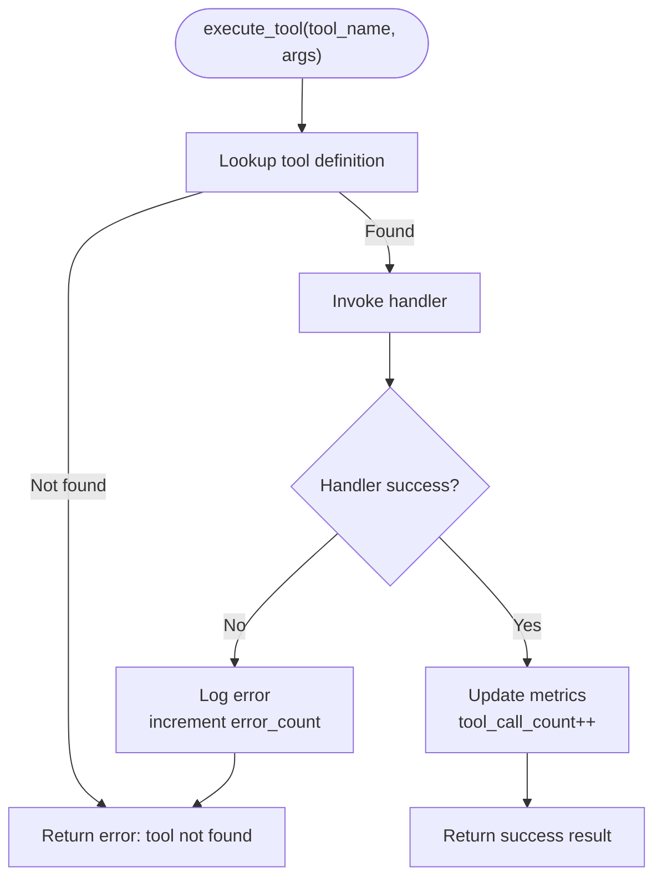
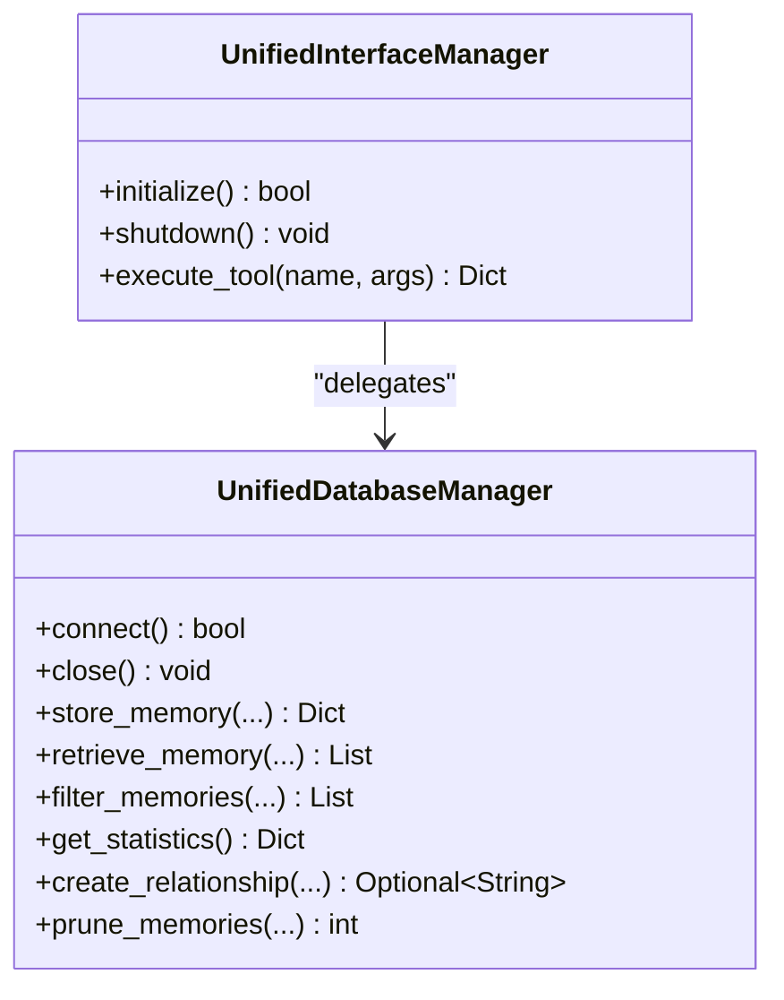
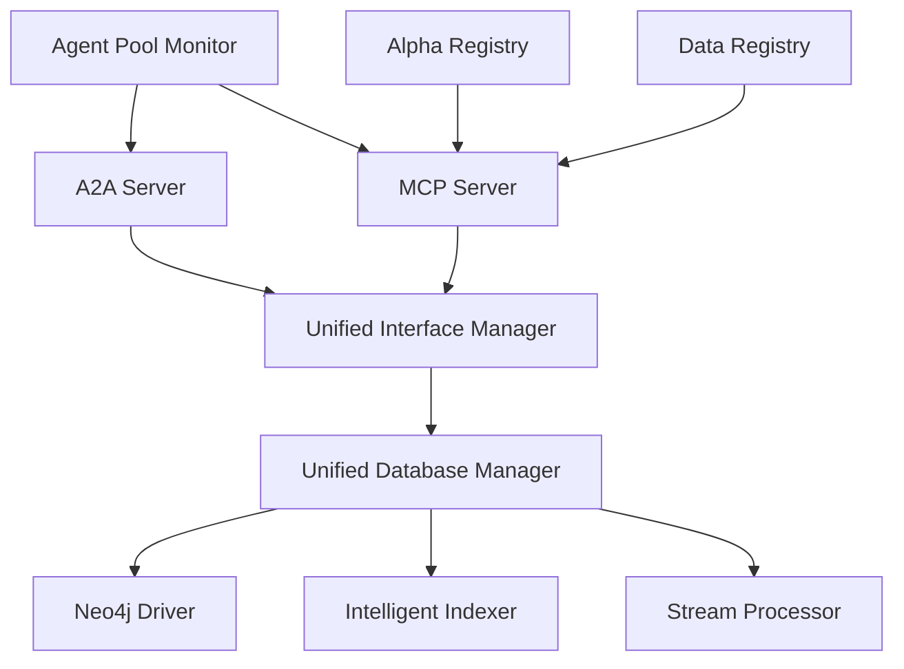
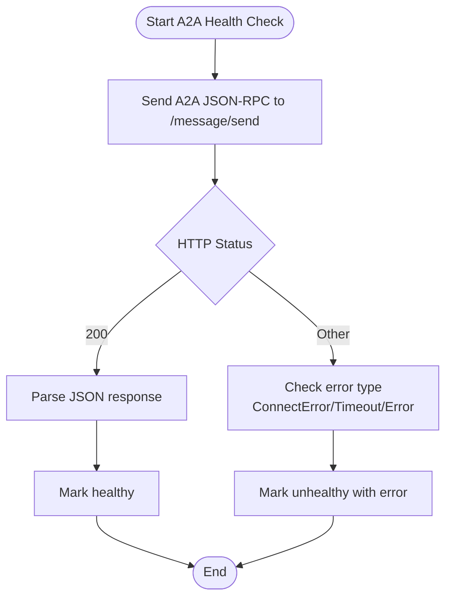
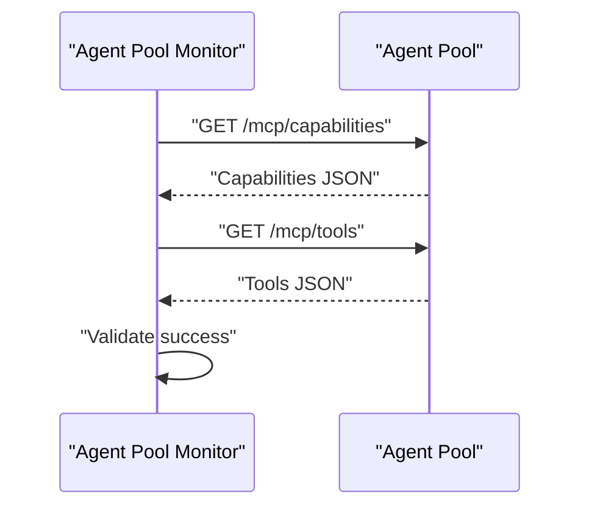

# Troubleshooting and Debugging

<cite>
**Referenced Files in This Document**
- [a2a_health_checker.py](file://FinAgents/memory/a2a_health_checker.py)
- [a2a_server.py](file://FinAgents/memory/a2a_server.py)
- [memory_server.py](file://FinAgents/memory/memory_server.py)
- [mcp_server.py](file://FinAgents/memory/mcp_server.py)
- [unified_interface_manager.py](file://FinAgents/memory/unified_interface_manager.py)
- [unified_database_manager.py](file://FinAgents/memory/unified_database_manager.py)
- [configuration_manager.py](file://FinAgents/memory/configuration_manager.py)
- [agent_pool_monitor.py](file://FinAgents/orchestrator/core/agent_pool_monitor.py)
- [registry.py](file://FinAgents/agent_pools/alpha_agent_pool/registry.py)
- [registry.py](file://FinAgents/agent_pools/data_agent_pool/registry.py)
</cite>

## Table of Contents
1. [Introduction](#introduction)
2. [Project Structure](#project-structure)
3. [Core Components](#core-components)
4. [Architecture Overview](#architecture-overview)
5. [Detailed Component Analysis](#detailed-component-analysis)
6. [Dependency Analysis](#dependency-analysis)
7. [Performance Considerations](#performance-considerations)
8. [Troubleshooting Guide](#troubleshooting-guide)
9. [Conclusion](#conclusion)
10. [Appendices](#appendices)

## Introduction
This document provides comprehensive troubleshooting and debugging guidance for the Agentic Trading Application. It focuses on diagnosing and resolving common issues across:
- Connection problems (network, protocol, and service availability)
- Memory coordination failures (Neo4j connectivity, indexing, and unified interface)
- Agent registration and lifecycle issues (MCP and A2A protocol servers)
- Performance bottlenecks (throughput, latency, and resource contention)
- Automated diagnostics and monitoring setup

The guide includes diagnostic procedures, log analysis techniques, systematic debugging approaches, and practical checklists for recurring failure scenarios.

## Project Structure
The memory subsystem centers around three primary servers and supporting managers:
- A2A (Agent-to-Agent) Memory Server: Implements A2A protocol for agent communication and memory operations.
- MCP Memory Server: Implements Model Context Protocol for tool-based memory operations.
- Unified Interface Manager: Provides a protocol-agnostic facade for tool execution and memory operations.
- Unified Database Manager: Centralizes Neo4j operations, indexing, and analytics.
- Configuration Manager: Manages environment-specific settings for deployment scenarios.
- Agent Pool Monitor: Monitors agent pools and validates MCP connectivity.
- Agent Registries: Manage agent mounting and registration across pools.

**Diagram sources**
- [a2a_server.py:1-659](file://FinAgents/memory/a2a_server.py#L1-L659)
- [mcp_server.py:1-418](file://FinAgents/memory/mcp_server.py#L1-L418)
- [memory_server.py:1-800](file://FinAgents/memory/memory_server.py#L1-L800)
- [unified_interface_manager.py:1-800](file://FinAgents/memory/unified_interface_manager.py#L1-L800)
- [unified_database_manager.py:1-1085](file://FinAgents/memory/unified_database_manager.py#L1-L1085)
- [agent_pool_monitor.py:1-527](file://FinAgents/orchestrator/core/agent_pool_monitor.py#L1-L527)
- [registry.py:1-55](file://FinAgents/agent_pools/alpha_agent_pool/registry.py#L1-L55)
- [registry.py:1-141](file://FinAgents/agent_pools/data_agent_pool/registry.py#L1-L141)

**Section sources**
- [a2a_server.py:1-659](file://FinAgents/memory/a2a_server.py#L1-L659)
- [mcp_server.py:1-418](file://FinAgents/memory/mcp_server.py#L1-L418)
- [memory_server.py:1-800](file://FinAgents/memory/memory_server.py#L1-L800)
- [unified_interface_manager.py:1-800](file://FinAgents/memory/unified_interface_manager.py#L1-L800)
- [unified_database_manager.py:1-1085](file://FinAgents/memory/unified_database_manager.py#L1-L1085)
- [agent_pool_monitor.py:1-527](file://FinAgents/orchestrator/core/agent_pool_monitor.py#L1-L527)
- [registry.py:1-55](file://FinAgents/agent_pools/alpha_agent_pool/registry.py#L1-L55)
- [registry.py:1-141](file://FinAgents/agent_pools/data_agent_pool/registry.py#L1-L141)

## Core Components
- A2A Memory Server: Implements A2A protocol endpoints, agent card, and memory operations with streaming support. It initializes memory and database managers and exposes health and message endpoints.
- MCP Memory Server: Provides MCP protocol compliance with tool definitions for memory storage, retrieval, semantic search, statistics, health checks, and relationship management. Includes HTTP endpoints for health and root info.
- Unified Interface Manager: Registers tools, manages protocol support, and executes tool handlers against the Unified Database Manager. Supports MCP client sessions and OpenAI-style tool definitions.
- Unified Database Manager: Handles Neo4j connections, memory storage/retrieval, filtering, statistics, relationship creation, and pruning. Integrates intelligent indexing and reactive stream processing when available.
- Configuration Manager: Centralizes environment-specific settings for database, server, memory, MCP, A2A, logging, and ports. Validates and exports configurations.
- Agent Pool Monitor: Monitors agent pools, validates MCP connectivity, and supports start/stop/restart operations with health checks and process lifecycle management.
- Agent Registries: Manage agent registration and mounting for data and alpha agent pools, including configuration loading and optional agent services.

**Section sources**
- [a2a_server.py:78-488](file://FinAgents/memory/a2a_server.py#L78-L488)
- [mcp_server.py:110-396](file://FinAgents/memory/mcp_server.py#L110-L396)
- [unified_interface_manager.py:105-783](file://FinAgents/memory/unified_interface_manager.py#L105-L783)
- [unified_database_manager.py:104-800](file://FinAgents/memory/unified_database_manager.py#L104-L800)
- [configuration_manager.py:235-672](file://FinAgents/memory/configuration_manager.py#L235-L672)
- [agent_pool_monitor.py:44-374](file://FinAgents/orchestrator/core/agent_pool_monitor.py#L44-L374)
- [registry.py:23-55](file://FinAgents/agent_pools/alpha_agent_pool/registry.py#L23-L55)
- [registry.py:56-141](file://FinAgents/agent_pools/data_agent_pool/registry.py#L56-L141)

## Architecture Overview
The memory architecture integrates protocol-specific servers behind a unified interface and database manager. The Unified Interface Manager registers tools and delegates to the Unified Database Manager, which connects to Neo4j and optionally leverages intelligent indexing and stream processing.

**Diagram sources**
- [mcp_server.py:142-260](file://FinAgents/memory/mcp_server.py#L142-L260)
- [unified_interface_manager.py:422-458](file://FinAgents/memory/unified_interface_manager.py#L422-L458)
- [unified_database_manager.py:233-352](file://FinAgents/memory/unified_database_manager.py#L233-L352)

**Section sources**
- [mcp_server.py:110-396](file://FinAgents/memory/mcp_server.py#L110-L396)
- [unified_interface_manager.py:105-783](file://FinAgents/memory/unified_interface_manager.py#L105-L783)
- [unified_database_manager.py:104-800](file://FinAgents/memory/unified_database_manager.py#L104-L800)

## Detailed Component Analysis

### A2A Protocol Server
Key responsibilities:
- Agent card exposure and A2A endpoints
- Memory operations with streaming and fallback storage
- Health checks and graceful shutdown

Common issues:
- A2A protocol mismatch leading to HTTP errors
- Memory system unavailability causing degraded responses
- Database connectivity failures impacting health checks

Diagnostic tips:
- Use the A2A Health Checker to validate protocol compliance and response times.
- Inspect server logs for initialization failures and memory manager errors.
- Verify database credentials and Neo4j availability.

**Diagram sources**
- [a2a_health_checker.py:34-119](file://FinAgents/memory/a2a_health_checker.py#L34-L119)
- [a2a_server.py:228-285](file://FinAgents/memory/a2a_server.py#L228-L285)

**Section sources**
- [a2a_server.py:78-488](file://FinAgents/memory/a2a_server.py#L78-L488)
- [a2a_health_checker.py:24-119](file://FinAgents/memory/a2a_health_checker.py#L24-L119)

### MCP Memory Server
Key responsibilities:
- MCP protocol compliance with tool definitions
- HTTP endpoints for health and root info
- Integration with Unified Interface Manager

Common issues:
- Missing MCP dependencies preventing server startup
- Tool execution failures due to interface manager not initialized
- Health endpoint inconsistencies

Diagnostic tips:
- Confirm MCP availability and installation.
- Validate Unified Interface Manager initialization prior to tool execution.
- Use health endpoints to confirm service readiness.

**Diagram sources**
- [mcp_server.py:298-369](file://FinAgents/memory/mcp_server.py#L298-L369)
- [unified_interface_manager.py:422-458](file://FinAgents/memory/unified_interface_manager.py#L422-L458)

**Section sources**
- [mcp_server.py:110-396](file://FinAgents/memory/mcp_server.py#L110-L396)
- [unified_interface_manager.py:105-783](file://FinAgents/memory/unified_interface_manager.py#L105-L783)

### Unified Interface Manager
Key responsibilities:
- Tool registration and protocol support
- Delegation to Unified Database Manager
- MCP client integration and conversation management

Common issues:
- Tool not found or handler missing
- Database connectivity errors
- MCP tool call exceptions and JSON parsing errors

Diagnostic tips:
- Review tool definitions and protocol support lists.
- Inspect error counts and last activity timestamps.
- Validate MCP session and tool response content types.

**Diagram sources**
- [unified_interface_manager.py:422-458](file://FinAgents/memory/unified_interface_manager.py#L422-L458)
- [unified_interface_manager.py:669-698](file://FinAgents/memory/unified_interface_manager.py#L669-L698)

**Section sources**
- [unified_interface_manager.py:105-783](file://FinAgents/memory/unified_interface_manager.py#L105-L783)

### Unified Database Manager
Key responsibilities:
- Neo4j connection management and health monitoring
- Memory storage, retrieval, filtering, statistics, relationships, and pruning
- Integration with intelligent indexer and stream processor

Common issues:
- Neo4j driver unavailable or connection failures
- Index creation and schema initialization errors
- Memory operations timing out or failing

Diagnostic tips:
- Verify Neo4j availability and credentials.
- Check intelligent indexer and stream processor initialization.
- Monitor operation counts and recent activity.

**Diagram sources**
- [unified_database_manager.py:104-800](file://FinAgents/memory/unified_database_manager.py#L104-L800)
- [unified_interface_manager.py:105-783](file://FinAgents/memory/unified_interface_manager.py#L105-L783)

**Section sources**
- [unified_database_manager.py:104-800](file://FinAgents/memory/unified_database_manager.py#L104-L800)
- [unified_interface_manager.py:105-783](file://FinAgents/memory/unified_interface_manager.py#L105-L783)

### Configuration Manager
Key responsibilities:
- Environment-specific configuration loading and validation
- Port configuration and database initialization settings
- Export and save configuration utilities

Common issues:
- Missing configuration files or invalid YAML
- Port conflicts or invalid server ports
- Database credential mismatches

Diagnostic tips:
- Validate environment detection and configuration merging.
- Export configuration to YAML/JSON for inspection.
- Use validation to catch configuration errors early.

**Section sources**
- [configuration_manager.py:235-672](file://FinAgents/memory/configuration_manager.py#L235-L672)

### Agent Pool Monitor
Key responsibilities:
- Continuous health monitoring of agent pools
- MCP connectivity validation
- Start/stop/restart operations with process lifecycle management

Common issues:
- Pool processes not running or ports not listening
- MCP capabilities and tools endpoints unreachable
- Startup timeouts and graceful shutdown failures

Diagnostic tips:
- Use health checks and port probing to diagnose connectivity.
- Validate MCP endpoints and tool availability.
- Implement restart sequences for transient failures.

**Section sources**
- [agent_pool_monitor.py:44-374](file://FinAgents/orchestrator/core/agent_pool_monitor.py#L44-L374)

### Agent Registries
Key responsibilities:
- Agent registration and mounting for data and alpha agent pools
- Configuration loading and optional agent services

Common issues:
- Missing agent service implementations
- Config file not found or malformed
- Registry overwrite warnings

Diagnostic tips:
- Ensure agent service imports and schema compatibility.
- Verify configuration file paths and YAML correctness.
- Use preload functions to initialize agents selectively.

**Section sources**
- [registry.py:23-55](file://FinAgents/agent_pools/alpha_agent_pool/registry.py#L23-L55)
- [registry.py:56-141](file://FinAgents/agent_pools/data_agent_pool/registry.py#L56-L141)

## Dependency Analysis
The memory subsystem exhibits layered dependencies:
- Servers depend on Unified Interface Manager for tool execution.
- Unified Interface Manager depends on Unified Database Manager for database operations.
- Unified Database Manager depends on Neo4j driver and optional intelligent indexer/stream processor.
- Agent Pool Monitor depends on HTTP connectivity and MCP endpoints.
- Registries depend on configuration files and agent service implementations.

**Diagram sources**
- [a2a_server.py:622-632](file://FinAgents/memory/a2a_server.py#L622-L632)
- [mcp_server.py:130-136](file://FinAgents/memory/mcp_server.py#L130-L136)
- [unified_interface_manager.py:140-155](file://FinAgents/memory/unified_interface_manager.py#L140-L155)
- [unified_database_manager.py:172-227](file://FinAgents/memory/unified_database_manager.py#L172-L227)
- [agent_pool_monitor.py:137-209](file://FinAgents/orchestrator/core/agent_pool_monitor.py#L137-L209)
- [registry.py:38-54](file://FinAgents/agent_pools/alpha_agent_pool/registry.py#L38-L54)
- [registry.py:89-141](file://FinAgents/agent_pools/data_agent_pool/registry.py#L89-L141)

**Section sources**
- [a2a_server.py:622-632](file://FinAgents/memory/a2a_server.py#L622-L632)
- [mcp_server.py:130-136](file://FinAgents/memory/mcp_server.py#L130-L136)
- [unified_interface_manager.py:140-155](file://FinAgents/memory/unified_interface_manager.py#L140-L155)
- [unified_database_manager.py:172-227](file://FinAgents/memory/unified_database_manager.py#L172-L227)
- [agent_pool_monitor.py:137-209](file://FinAgents/orchestrator/core/agent_pool_monitor.py#L137-L209)
- [registry.py:38-54](file://FinAgents/agent_pools/alpha_agent_pool/registry.py#L38-L54)
- [registry.py:89-141](file://FinAgents/agent_pools/data_agent_pool/registry.py#L89-L141)

## Performance Considerations
- Connection pooling and timeouts: Configure max pool size and connection acquisition timeouts in the Unified Database Manager.
- Batch operations: Use batch memory storage to improve throughput.
- Indexing and search: Enable intelligent indexing and monitor index status.
- Stream processing: Leverage reactive memory management for real-time updates.
- Monitoring: Track tool call counts, error rates, and last activity timestamps in the Unified Interface Manager.

[No sources needed since this section provides general guidance]

## Troubleshooting Guide

### Connection Problems
Symptoms:
- HTTP 405 or unexpected responses when health checking
- MCP capabilities/tools endpoints unreachable
- Port not listening or service startup timeouts

Resolution steps:
- Use the A2A Health Checker to validate A2A protocol compliance and response times.
- Confirm MCP availability and installation; verify Unified Interface Manager initialization.
- Probe ports and use Agent Pool Monitor to validate connectivity and process status.
- Check configuration for correct host/port settings and environment variables.

Checklist:
- [ ] Verify A2A server responds to A2A JSON-RPC health endpoint
- [ ] Confirm MCP server health and root endpoints
- [ ] Validate port accessibility and process status
- [ ] Review configuration for environment-specific overrides

**Section sources**
- [a2a_health_checker.py:34-119](file://FinAgents/memory/a2a_health_checker.py#L34-L119)
- [mcp_server.py:298-369](file://FinAgents/memory/mcp_server.py#L298-L369)
- [agent_pool_monitor.py:137-209](file://FinAgents/orchestrator/core/agent_pool_monitor.py#L137-L209)
- [configuration_manager.py:597-621](file://FinAgents/memory/configuration_manager.py#L597-L621)

### Memory Coordination Failures
Symptoms:
- Memory storage/retrieval failures
- Database connectivity errors
- Index creation or schema initialization issues

Resolution steps:
- Ensure Neo4j driver is available and credentials are correct.
- Initialize Unified Database Manager and verify health checks.
- Confirm intelligent indexer and stream processor initialization when enabled.
- Use Unified Interface Manager to execute tools and inspect error counts.

Checklist:
- [ ] Confirm Neo4j connection and schema initialization
- [ ] Verify intelligent indexing and stream processor availability
- [ ] Test tool execution via Unified Interface Manager
- [ ] Monitor operation counts and recent activity

**Section sources**
- [unified_database_manager.py:172-227](file://FinAgents/memory/unified_database_manager.py#L172-L227)
- [unified_interface_manager.py:140-155](file://FinAgents/memory/unified_interface_manager.py#L140-L155)
- [unified_interface_manager.py:669-698](file://FinAgents/memory/unified_interface_manager.py#L669-L698)

### Agent Registration Issues
Symptoms:
- Agent services not mounting or missing
- Config file not found or malformed
- Registry overwrite warnings

Resolution steps:
- Verify agent service imports and schema compatibility.
- Ensure configuration files exist and are valid YAML.
- Use preload functions to initialize agents selectively.
- Check registry logs for overwrite warnings and missing services.

Checklist:
- [ ] Confirm agent service imports and availability
- [ ] Validate configuration file paths and YAML correctness
- [ ] Use preload functions for selective initialization
- [ ] Review registry logs for warnings and errors

**Section sources**
- [registry.py:38-54](file://FinAgents/agent_pools/alpha_agent_pool/registry.py#L38-L54)
- [registry.py:89-141](file://FinAgents/agent_pools/data_agent_pool/registry.py#L89-L141)

### Performance Bottlenecks
Symptoms:
- Slow memory operations or tool execution
- High error rates or timeouts
- Resource contention or connection pool exhaustion

Resolution steps:
- Increase connection pool size and adjust connection acquisition timeouts.
- Use batch memory storage for high-throughput scenarios.
- Enable intelligent indexing and monitor index status.
- Leverage stream processing for real-time updates.
- Monitor tool call counts, error rates, and last activity timestamps.

Checklist:
- [ ] Tune connection pool settings
- [ ] Implement batch operations
- [ ] Enable and monitor intelligent indexing
- [ ] Use stream processing for reactive updates
- [ ] Track metrics and error rates

**Section sources**
- [unified_database_manager.py:113-141](file://FinAgents/memory/unified_database_manager.py#L113-L141)
- [unified_interface_manager.py:600-621](file://FinAgents/memory/unified_interface_manager.py#L600-L621)

### Network Connectivity Issues
Symptoms:
- Port not accessible or service not responding
- MCP endpoints unreachable
- Agent pool monitoring reports unhealthy status

Resolution steps:
- Use Agent Pool Monitor to probe ports and validate connectivity.
- Confirm firewall and network policies allow traffic.
- Validate service URLs and base endpoints (/, /health).
- Restart services and verify process status.

Checklist:
- [ ] Probe ports and validate service URLs
- [ ] Confirm firewall/network policies
- [ ] Verify base endpoints (/, /health)
- [ ] Restart services and verify process status

**Section sources**
- [agent_pool_monitor.py:137-209](file://FinAgents/orchestrator/core/agent_pool_monitor.py#L137-L209)
- [mcp_server.py:298-369](file://FinAgents/memory/mcp_server.py#L298-L369)

### Authentication Problems
Symptoms:
- Database connection failures due to invalid credentials
- MCP tool execution errors due to missing API keys
- A2A server health check failures

Resolution steps:
- Verify database credentials and Neo4j configuration.
- Check API key requirements and configuration for MCP server.
- Validate A2A server authentication and agent card configuration.

Checklist:
- [ ] Confirm database credentials and Neo4j configuration
- [ ] Verify API key requirements for MCP server
- [ ] Validate A2A server authentication and agent card

**Section sources**
- [unified_database_manager.py:113-139](file://FinAgents/memory/unified_database_manager.py#L113-L139)
- [mcp_server.py:84-95](file://FinAgents/memory/mcp_server.py#L84-L95)
- [a2a_server.py:59-70](file://FinAgents/memory/a2a_server.py#L59-L70)

### Configuration Errors
Symptoms:
- Invalid configuration files or missing environment variables
- Port conflicts or invalid server ports
- Database credential mismatches

Resolution steps:
- Validate environment detection and configuration merging.
- Export configuration to YAML/JSON for inspection.
- Use validation to catch configuration errors early.
- Adjust port configurations per environment.

Checklist:
- [ ] Validate environment detection and configuration merging
- [ ] Export configuration to YAML/JSON for inspection
- [ ] Use validation to catch configuration errors
- [ ] Adjust port configurations per environment

**Section sources**
- [configuration_manager.py:597-621](file://FinAgents/memory/configuration_manager.py#L597-L621)
- [configuration_manager.py:518-540](file://FinAgents/memory/configuration_manager.py#L518-L540)
- [configuration_manager.py:627-658](file://FinAgents/memory/configuration_manager.py#L627-L658)

### Automated Testing Procedures
Recommended procedures:
- Use the A2A Health Checker to validate A2A protocol compliance and response times.
- Run Agent Pool Monitor to continuously check MCP connectivity and pool status.
- Execute tool calls via MCP server and verify responses.
- Validate configuration exports and environment-specific settings.

Checklist:
- [ ] Run A2A Health Checker and review results
- [ ] Start Agent Pool Monitor and validate MCP connectivity
- [ ] Execute tool calls and verify responses
- [ ] Export and validate configuration files

**Section sources**
- [a2a_health_checker.py:292-331](file://FinAgents/memory/a2a_health_checker.py#L292-L331)
- [agent_pool_monitor.py:456-526](file://FinAgents/orchestrator/core/agent_pool_monitor.py#L456-L526)
- [mcp_server.py:142-260](file://FinAgents/memory/mcp_server.py#L142-L260)
- [configuration_manager.py:505-516](file://FinAgents/memory/configuration_manager.py#L505-L516)

### Monitoring Setup
Setup recommendations:
- Enable logging for Unified Interface Manager and Unified Database Manager.
- Configure health endpoints for MCP and A2A servers.
- Use Agent Pool Monitor for continuous health checks and alerts.
- Track metrics such as tool call counts, error rates, and operation counts.

Checklist:
- [ ] Enable and configure logging for managers
- [ ] Expose health endpoints for servers
- [ ] Configure Agent Pool Monitor for continuous checks
- [ ] Track and alert on key metrics

**Section sources**
- [unified_interface_manager.py:125-129](file://FinAgents/memory/unified_interface_manager.py#L125-L129)
- [unified_database_manager.py:162-166](file://FinAgents/memory/unified_database_manager.py#L162-L166)
- [mcp_server.py:298-369](file://FinAgents/memory/mcp_server.py#L298-L369)
- [a2a_server.py:560-571](file://FinAgents/memory/a2a_server.py#L560-L571)
- [agent_pool_monitor.py:376-397](file://FinAgents/orchestrator/core/agent_pool_monitor.py#L376-L397)

## Conclusion
This guide consolidates practical troubleshooting and debugging strategies for the Agentic Trading Application’s memory and agent systems. By leveraging the A2A Health Checker, Agent Pool Monitor, Unified Interface Manager, and Unified Database Manager, teams can systematically diagnose and resolve connection, memory coordination, agent registration, and performance issues. Adopting the recommended checklists, automated testing procedures, and monitoring setup ensures reliable operations across development, testing, staging, and production environments.

[No sources needed since this section summarizes without analyzing specific files]

## Appendices

### A2A Protocol Resolution Flow

**Diagram sources**
- [a2a_health_checker.py:34-119](file://FinAgents/memory/a2a_health_checker.py#L34-L119)

### MCP Connectivity Validation

**Diagram sources**
- [agent_pool_monitor.py:399-453](file://FinAgents/orchestrator/core/agent_pool_monitor.py#L399-L453)