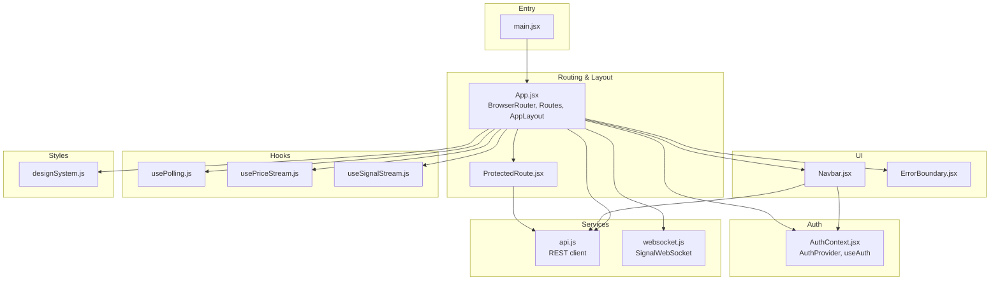
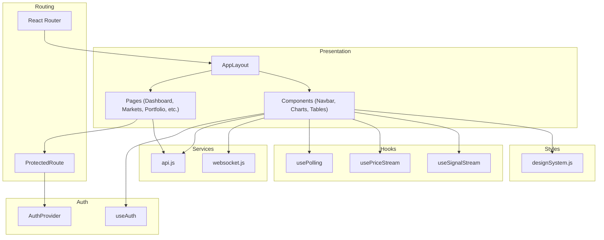
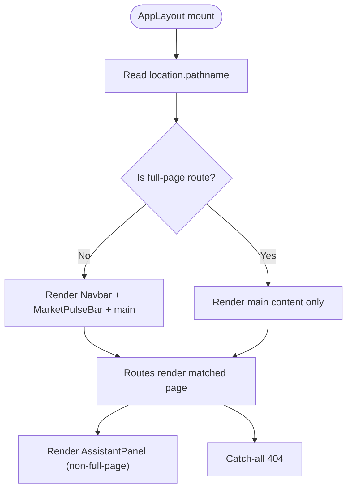
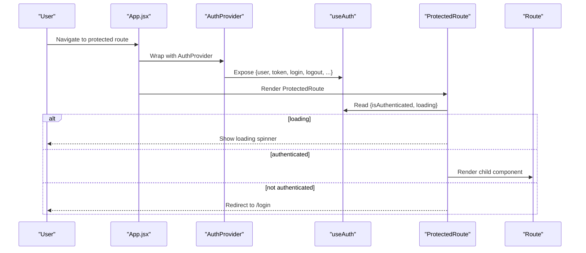
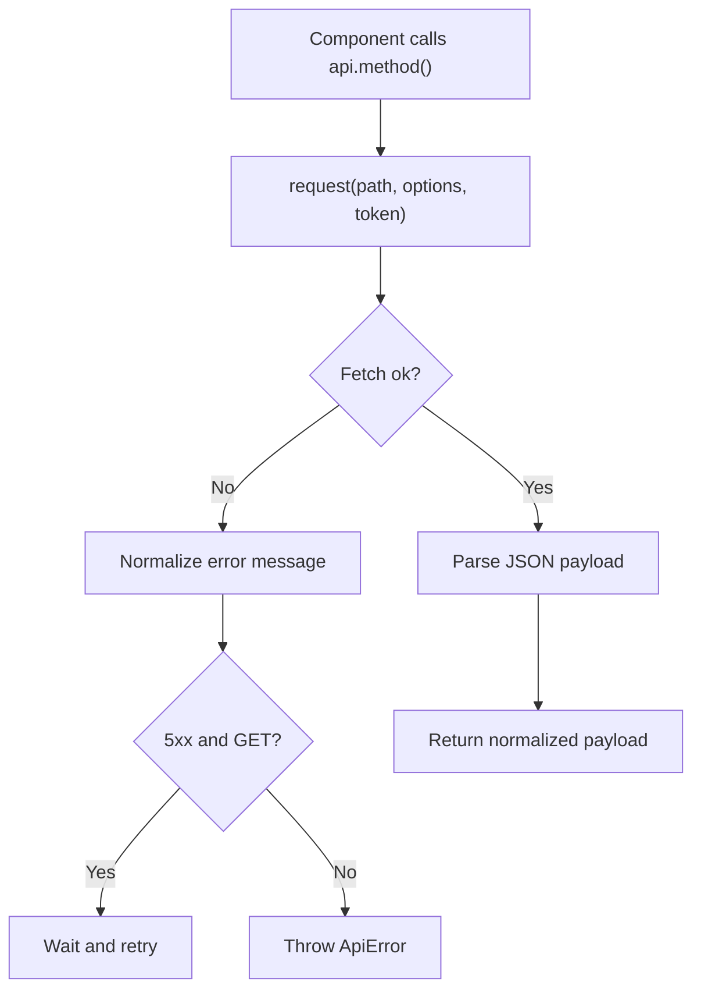
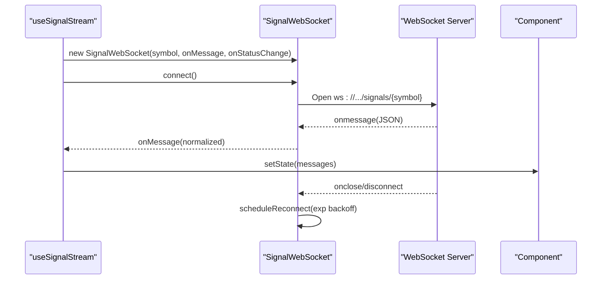
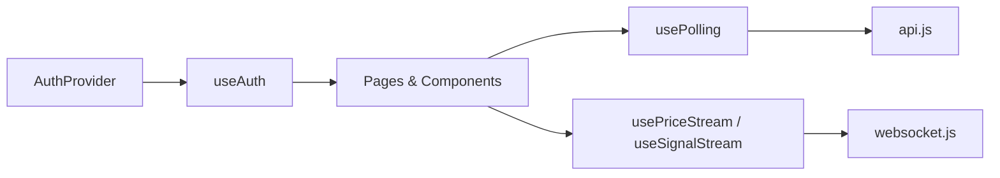
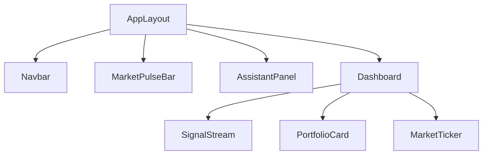
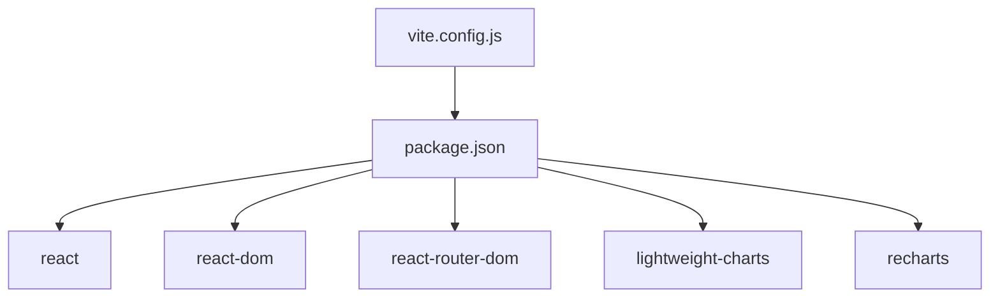

# Application Architecture

<cite>
**Referenced Files in This Document**
- [main.jsx](file://frontend/src/main.jsx)
- [App.jsx](file://frontend/src/App.jsx)
- [AuthContext.jsx](file://frontend/src/context/AuthContext.jsx)
- [ProtectedRoute.jsx](file://frontend/src/components/ProtectedRoute.jsx)
- [ErrorBoundary.jsx](file://frontend/src/components/ErrorBoundary.jsx)
- [Navbar.jsx](file://frontend/src/components/Navbar.jsx)
- [Dashboard.jsx](file://frontend/src/pages/Dashboard.jsx)
- [api.js](file://frontend/src/services/api.js)
- [websocket.js](file://frontend/src/services/websocket.js)
- [usePolling.js](file://frontend/src/hooks/usePolling.js)
- [usePriceStream.js](file://frontend/src/hooks/usePriceStream.js)
- [useSignalStream.js](file://frontend/src/hooks/useSignalStream.js)
- [designSystem.js](file://frontend/src/styles/designSystem.js)
- [safeApi.js](file://frontend/src/utils/safeApi.js)
- [package.json](file://frontend/package.json)
- [vite.config.js](file://frontend/vite.config.js)
</cite>

## Table of Contents
1. [Introduction](#introduction)
2. [Project Structure](#project-structure)
3. [Core Components](#core-components)
4. [Architecture Overview](#architecture-overview)
5. [Detailed Component Analysis](#detailed-component-analysis)
6. [Dependency Analysis](#dependency-analysis)
7. [Performance Considerations](#performance-considerations)
8. [Troubleshooting Guide](#troubleshooting-guide)
9. [Conclusion](#conclusion)

## Introduction
This document describes the React frontend architecture for the Agentic Trading Platform. It explains the application structure, routing with React Router, authentication context and protected routes, component hierarchy, layout system, conditional rendering, error boundaries, responsive design patterns, API integration, WebSocket real-time streams, and state management patterns. The goal is to help both technical and non-technical readers understand how the frontend composes UI, manages user sessions, and interacts with backend services and real-time feeds.

## Project Structure
The frontend is a Vite-powered React application with:
- A root entry that renders the App component inside React.StrictMode
- A routing layer with React Router DOM
- An authentication provider with context
- A shared layout with conditional rendering based on route paths
- Protected routes wrapping private pages
- A global error boundary
- Services for API and WebSocket communication
- Custom hooks for polling and real-time streams
- A design system for consistent styling and responsive behavior

**Diagram sources**
- [main.jsx:1-12](file://frontend/src/main.jsx#L1-L12)
- [App.jsx:1-81](file://frontend/src/App.jsx#L1-L81)
- [AuthContext.jsx:1-71](file://frontend/src/context/AuthContext.jsx#L1-L71)
- [ProtectedRoute.jsx:1-25](file://frontend/src/components/ProtectedRoute.jsx#L1-L25)
- [ErrorBoundary.jsx:1-112](file://frontend/src/components/ErrorBoundary.jsx#L1-L112)
- [Navbar.jsx:1-286](file://frontend/src/components/Navbar.jsx#L1-L286)
- [api.js:1-165](file://frontend/src/services/api.js#L1-L165)
- [websocket.js:1-106](file://frontend/src/services/websocket.js#L1-L106)
- [usePolling.js:1-34](file://frontend/src/hooks/usePolling.js#L1-L34)
- [usePriceStream.js:1-143](file://frontend/src/hooks/usePriceStream.js#L1-L143)
- [useSignalStream.js:1-67](file://frontend/src/hooks/useSignalStream.js#L1-L67)
- [designSystem.js:1-258](file://frontend/src/styles/designSystem.js#L1-L258)

**Section sources**
- [main.jsx:1-12](file://frontend/src/main.jsx#L1-L12)
- [App.jsx:1-81](file://frontend/src/App.jsx#L1-L81)
- [package.json:1-28](file://frontend/package.json#L1-L28)
- [vite.config.js:1-36](file://frontend/vite.config.js#L1-L36)

## Core Components
- App and Routing: Central routing with public and protected routes, AppLayout conditionally renders Navbar, MarketPulseBar, and AssistantPanel based on the current path.
- Authentication Provider: Provides user session state, login/register/logout, and token persistence with automatic session validation on startup.
- ProtectedRoute: Guards private pages with loading states and redirects to login when unauthenticated.
- ErrorBoundary: Catches rendering errors and presents a friendly recovery UI.
- Services: REST API client with retry and timeout logic; WebSocket client for live signals and prices.
- Hooks: Polling for periodic data, and real-time streams for price and signal updates.
- Design System: Shared color palette, typography, spacing, and component styles for consistent UI.

**Section sources**
- [App.jsx:22-68](file://frontend/src/App.jsx#L22-L68)
- [AuthContext.jsx:6-64](file://frontend/src/context/AuthContext.jsx#L6-L64)
- [ProtectedRoute.jsx:4-24](file://frontend/src/components/ProtectedRoute.jsx#L4-L24)
- [ErrorBoundary.jsx:4-108](file://frontend/src/components/ErrorBoundary.jsx#L4-L108)
- [api.js:25-64](file://frontend/src/services/api.js#L25-L64)
- [websocket.js:32-105](file://frontend/src/services/websocket.js#L32-L105)
- [usePolling.js:3-33](file://frontend/src/hooks/usePolling.js#L3-L33)
- [usePriceStream.js:8-142](file://frontend/src/hooks/usePriceStream.js#L8-L142)
- [useSignalStream.js:20-66](file://frontend/src/hooks/useSignalStream.js#L20-L66)
- [designSystem.js:10-258](file://frontend/src/styles/designSystem.js#L10-L258)

## Architecture Overview
The frontend follows a layered architecture:
- Presentation Layer: AppLayout, pages, and components
- Routing Layer: React Router with public and protected routes
- Authentication Layer: AuthProvider and useAuth hook
- Services Layer: REST API client and WebSocket client
- Hooks Layer: Polling and streaming utilities
- Styles Layer: Design system for responsive UI

**Diagram sources**
- [App.jsx:25-68](file://frontend/src/App.jsx#L25-L68)
- [ProtectedRoute.jsx:4-24](file://frontend/src/components/ProtectedRoute.jsx#L4-L24)
- [AuthContext.jsx:6-64](file://frontend/src/context/AuthContext.jsx#L6-L64)
- [api.js:78-131](file://frontend/src/services/api.js#L78-L131)
- [websocket.js:32-105](file://frontend/src/services/websocket.js#L32-L105)
- [usePolling.js:3-33](file://frontend/src/hooks/usePolling.js#L3-L33)
- [usePriceStream.js:8-142](file://frontend/src/hooks/usePriceStream.js#L8-L142)
- [useSignalStream.js:20-66](file://frontend/src/hooks/useSignalStream.js#L20-L66)
- [designSystem.js:10-258](file://frontend/src/styles/designSystem.js#L10-L258)

## Detailed Component Analysis

### Routing and Layout System
- AppLayout determines whether to show full-page routes (e.g., landing, login, signup) or the shared layout with Navbar, MarketPulseBar, and AssistantPanel.
- Routes are grouped by public and protected areas, with a catch-all 404 handler.
- Conditional rendering uses the current location path to decide layout elements.

**Diagram sources**
- [App.jsx:25-68](file://frontend/src/App.jsx#L25-L68)

**Section sources**
- [App.jsx:22-68](file://frontend/src/App.jsx#L22-L68)

### Authentication Context and Protected Routes
- AuthProvider initializes user state from localStorage token, validates on mount, and exposes login/register/logout functions.
- useAuth provides authentication state and helpers to components.
- ProtectedRoute checks loading and isAuthenticated, shows a spinner while loading, and redirects unauthenticated users to login.

**Diagram sources**
- [AuthContext.jsx:6-64](file://frontend/src/context/AuthContext.jsx#L6-L64)
- [ProtectedRoute.jsx:4-24](file://frontend/src/components/ProtectedRoute.jsx#L4-L24)

**Section sources**
- [AuthContext.jsx:6-64](file://frontend/src/context/AuthContext.jsx#L6-L64)
- [ProtectedRoute.jsx:4-24](file://frontend/src/components/ProtectedRoute.jsx#L4-L24)

### API Integration and Error Handling
- api.js encapsulates REST requests with timeouts, retry logic for specific methods, and standardized error normalization.
- It exports convenience methods for auth, market data, signals, portfolio, learning, profile, agents, and AI assistant.
- safeApi.js provides a safer wrapper that always returns structured responses with success/data/error/status fields.

**Diagram sources**
- [api.js:25-64](file://frontend/src/services/api.js#L25-L64)
- [safeApi.js:188-372](file://frontend/src/utils/safeApi.js#L188-L372)

**Section sources**
- [api.js:25-131](file://frontend/src/services/api.js#L25-L131)
- [safeApi.js:188-372](file://frontend/src/utils/safeApi.js#L188-L372)

### Real-Time Data Streams
- WebSocket base URL resolution supports environment overrides and auto-detection.
- SignalWebSocket manages connection lifecycle, exponential backoff, and message parsing.
- useSignalStream and usePriceStream wrap SignalWebSocket and WebSocket respectively, exposing status and messages.

**Diagram sources**
- [websocket.js:32-105](file://frontend/src/services/websocket.js#L32-L105)
- [useSignalStream.js:20-66](file://frontend/src/hooks/useSignalStream.js#L20-L66)

**Section sources**
- [websocket.js:1-106](file://frontend/src/services/websocket.js#L1-L106)
- [useSignalStream.js:1-67](file://frontend/src/hooks/useSignalStream.js#L1-L67)
- [usePriceStream.js:1-143](file://frontend/src/hooks/usePriceStream.js#L1-L143)

### State Management Patterns
- Context: AuthProvider holds user/session state and exposes actions.
- Local state: Pages and components manage UI state (selected symbol, toggles).
- Polling: usePolling runs periodic fetches with debounced in-flight handling.
- Streaming: WebSocket hooks maintain connection state and merge updates.

**Diagram sources**
- [AuthContext.jsx:6-64](file://frontend/src/context/AuthContext.jsx#L6-L64)
- [usePolling.js:3-33](file://frontend/src/hooks/usePolling.js#L3-L33)
- [usePriceStream.js:8-142](file://frontend/src/hooks/usePriceStream.js#L8-L142)
- [useSignalStream.js:20-66](file://frontend/src/hooks/useSignalStream.js#L20-L66)
- [api.js:78-131](file://frontend/src/services/api.js#L78-L131)
- [websocket.js:32-105](file://frontend/src/services/websocket.js#L32-L105)

**Section sources**
- [AuthContext.jsx:6-64](file://frontend/src/context/AuthContext.jsx#L6-L64)
- [usePolling.js:3-33](file://frontend/src/hooks/usePolling.js#L3-L33)
- [usePriceStream.js:8-142](file://frontend/src/hooks/usePriceStream.js#L8-L142)
- [useSignalStream.js:20-66](file://frontend/src/hooks/useSignalStream.js#L20-L66)

### Component Hierarchy and Conditional Rendering
- AppLayout wraps all pages and conditionally renders shared UI based on route path.
- Navbar integrates search, navigation links, user menu, and assistant trigger.
- Dashboard composes multiple panels: market grid, signal stream, portfolio summary, agent status, recent trades, and learning hub.

**Diagram sources**
- [App.jsx:25-68](file://frontend/src/App.jsx#L25-L68)
- [Navbar.jsx:17-286](file://frontend/src/components/Navbar.jsx#L17-L286)
- [Dashboard.jsx:392-516](file://frontend/src/pages/Dashboard.jsx#L392-L516)

**Section sources**
- [App.jsx:25-68](file://frontend/src/App.jsx#L25-L68)
- [Navbar.jsx:17-286](file://frontend/src/components/Navbar.jsx#L17-L286)
- [Dashboard.jsx:11-516](file://frontend/src/pages/Dashboard.jsx#L11-L516)

### Responsive Design Patterns
- Design system defines color tokens, spacing, typography, and component styles.
- Tailwind utilities are applied consistently across components for responsive breakpoints.
- Layout containers and grids adapt to screen sizes.

**Section sources**
- [designSystem.js:10-258](file://frontend/src/styles/designSystem.js#L10-L258)

## Dependency Analysis
- Runtime dependencies include React, React DOM, React Router DOM, lightweight-charts, and recharts.
- Vite dev/prod configuration sets up proxying for /api and /ws, and code splitting for vendor libraries.

**Diagram sources**
- [package.json:11-26](file://frontend/package.json#L11-L26)
- [vite.config.js:4-35](file://frontend/vite.config.js#L4-L35)

**Section sources**
- [package.json:11-26](file://frontend/package.json#L11-L26)
- [vite.config.js:4-35](file://frontend/vite.config.js#L4-L35)

## Performance Considerations
- Polling throttling: usePolling prevents overlapping requests and supports immediate fetch on mount.
- WebSocket reconnection: exponential backoff limits retries and avoids flooding the server.
- Code splitting: Vite groups major libraries into separate chunks to improve caching and load performance.
- Proxy configuration: Vite proxies API and WebSocket traffic during development to the backend server.

[No sources needed since this section provides general guidance]

## Troubleshooting Guide
- ErrorBoundary displays a friendly UI with reload and reset options; in development, it logs error details and stack traces.
- API errors: api.js throws ApiError with status and message; safeApi.js returns structured {success,data,error,status} responses.
- WebSocket disconnections: SignalWebSocket tracks status and schedules reconnects; useSignalStream exposes a reconnect function.

**Section sources**
- [ErrorBoundary.jsx:4-108](file://frontend/src/components/ErrorBoundary.jsx#L4-L108)
- [api.js:3-9](file://frontend/src/services/api.js#L3-L9)
- [safeApi.js:188-372](file://frontend/src/utils/safeApi.js#L188-L372)
- [websocket.js:23-105](file://frontend/src/services/websocket.js#L23-L105)

## Conclusion
The frontend architecture combines React Router for routing, a centralized authentication context, and robust services for REST and WebSocket communications. It emphasizes predictable state management via hooks, resilient error handling, and a consistent design system for responsive UI. The integration with backend APIs and real-time streams enables a dynamic trading workspace suitable for both guest and authenticated users.