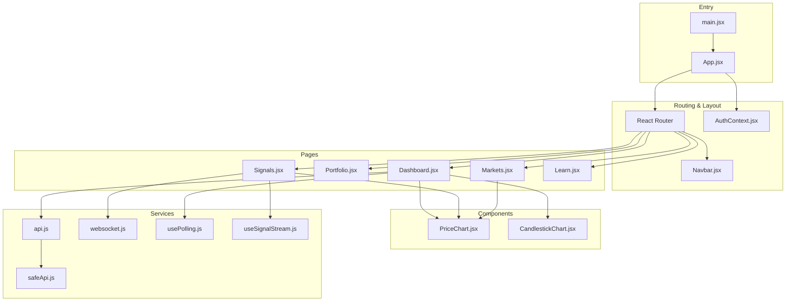
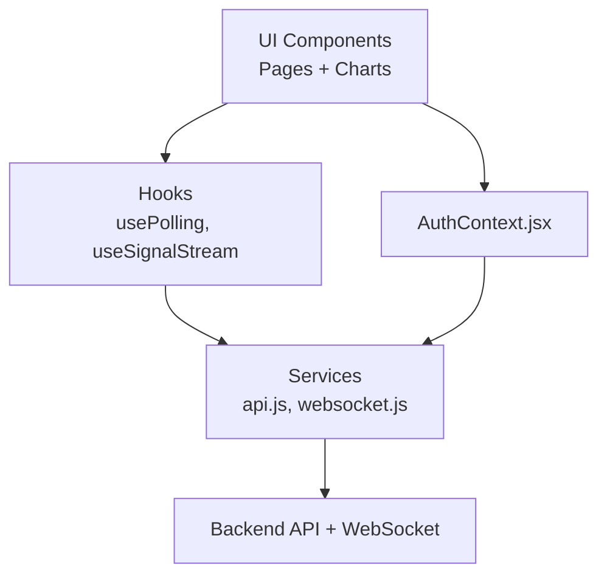
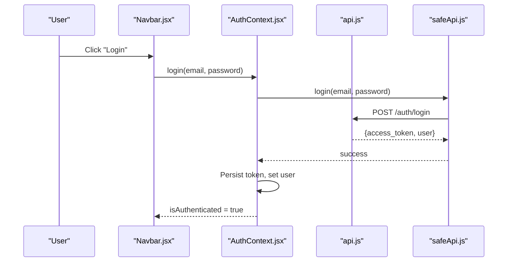
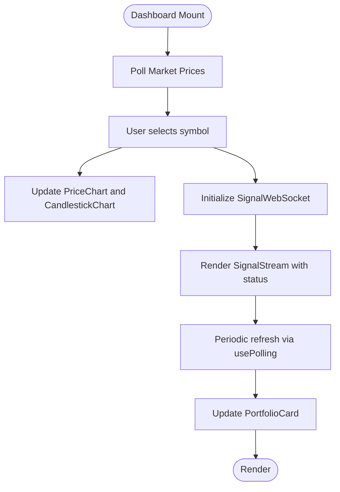
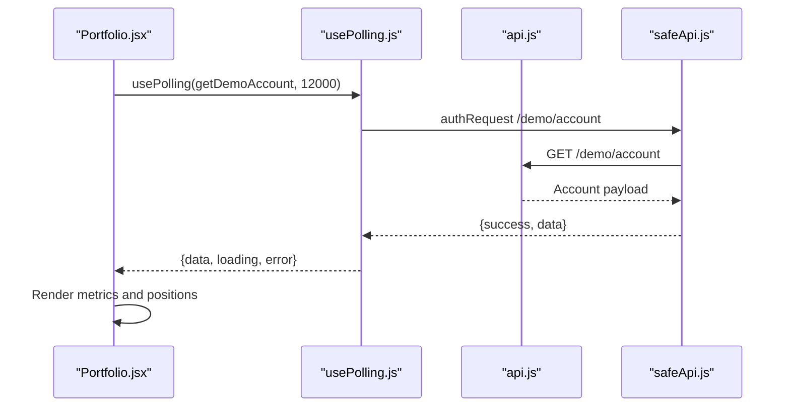
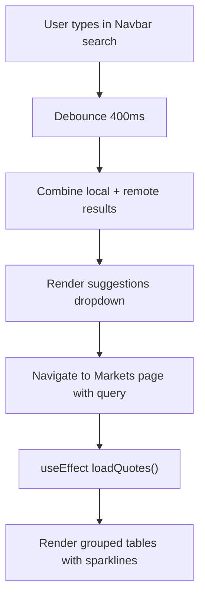
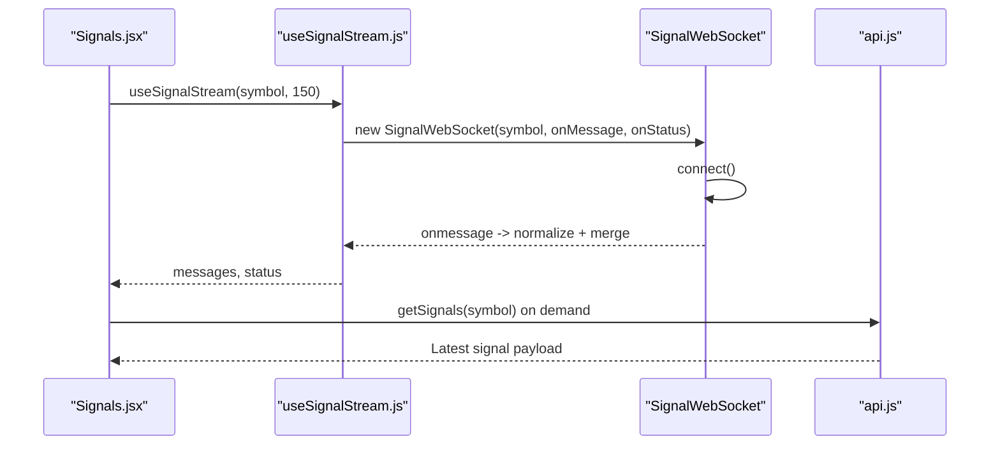
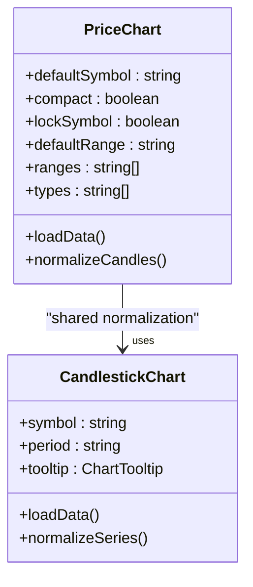
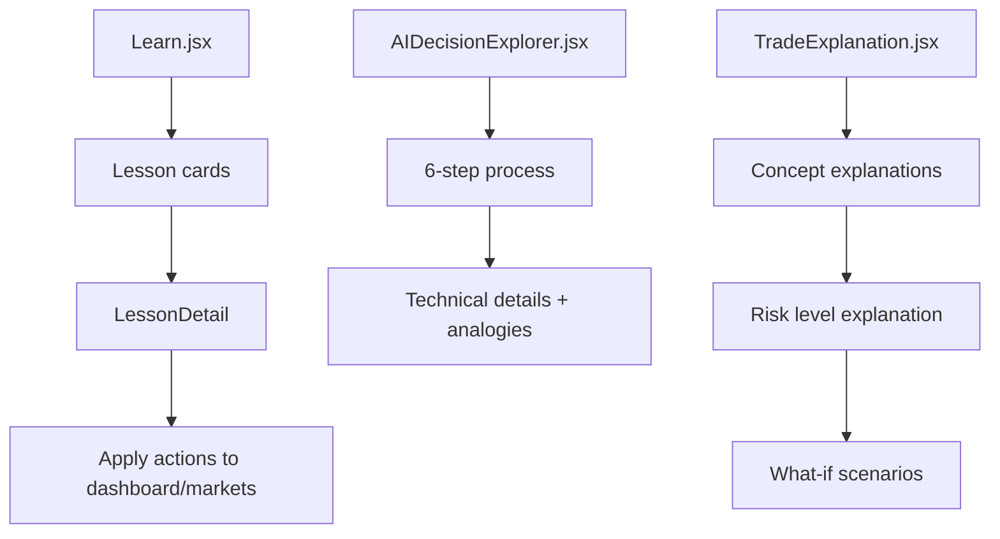
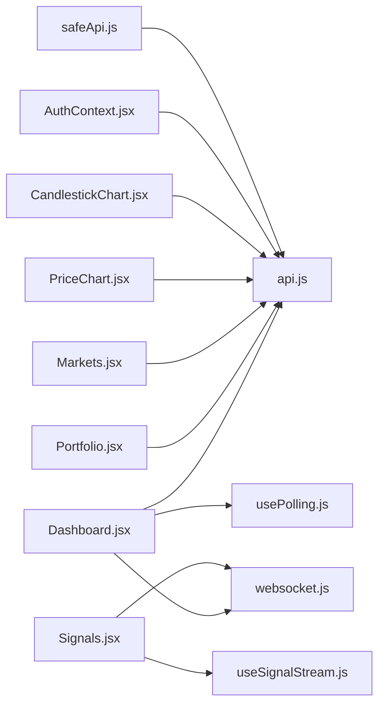

# Frontend Application

<cite>
**Referenced Files in This Document**
- [main.jsx](file://frontend/src/main.jsx)
- [App.jsx](file://frontend/src/App.jsx)
- [AuthContext.jsx](file://frontend/src/context/AuthContext.jsx)
- [Navbar.jsx](file://frontend/src/components/Navbar.jsx)
- [Dashboard.jsx](file://frontend/src/pages/Dashboard.jsx)
- [Portfolio.jsx](file://frontend/src/pages/Portfolio.jsx)
- [Signals.jsx](file://frontend/src/pages/Signals.jsx)
- [Markets.jsx](file://frontend/src/pages/Markets.jsx)
- [Learn.jsx](file://frontend/src/pages/Learn.jsx)
- [PriceChart.jsx](file://frontend/src/components/PriceChart.jsx)
- [CandlestickChart.jsx](file://frontend/src/components/CandlestickChart.jsx)
- [websocket.js](file://frontend/src/services/websocket.js)
- [useSignalStream.js](file://frontend/src/hooks/useSignalStream.js)
- [api.js](file://frontend/src/services/api.js)
- [usePolling.js](file://frontend/src/hooks/usePolling.js)
- [safeApi.js](file://frontend/src/utils/safeApi.js)
- [designSystem.js](file://frontend/src/styles/designSystem.js)
- [demoData.js](file://frontend/src/data/demoData.js)
</cite>

## Table of Contents
1. [Introduction](#introduction)
2. [Project Structure](#project-structure)
3. [Core Components](#core-components)
4. [Architecture Overview](#architecture-overview)
5. [Detailed Component Analysis](#detailed-component-analysis)
6. [Dependency Analysis](#dependency-analysis)
7. [Performance Considerations](#performance-considerations)
8. [Troubleshooting Guide](#troubleshooting-guide)
9. [Conclusion](#conclusion)
10. [Appendices](#appendices)

## Introduction
This document describes the React-based trading dashboard frontend for the Agentic Trading platform. It explains the application architecture, component structure, state management with React Context, routing, real-time data visualization via WebSockets, authentication flow, and styling guidelines using TailwindCSS. The dashboard integrates live price feeds, agent-driven signals, portfolio tracking, market scanning, and educational content to support a comprehensive trading learning environment.

## Project Structure
The frontend is organized by feature and layer:
- Entry point initializes the app and global styles.
- Routing wraps pages with authentication and layout providers.
- Pages implement major views (Dashboard, Portfolio, Markets, Signals, Learn).
- Components encapsulate reusable UI (charts, navigation, educational widgets).
- Services abstract API and WebSocket integrations.
- Hooks implement cross-cutting concerns (polling, streaming).
- Utilities and design systems enforce consistent styling and safe data handling.

**Diagram sources**
- [main.jsx:1-12](file://frontend/src/main.jsx#L1-L12)
- [App.jsx:1-81](file://frontend/src/App.jsx#L1-L81)
- [AuthContext.jsx:1-71](file://frontend/src/context/AuthContext.jsx#L1-L71)
- [Navbar.jsx:1-286](file://frontend/src/components/Navbar.jsx#L1-L286)
- [Dashboard.jsx:1-516](file://frontend/src/pages/Dashboard.jsx#L1-L516)
- [Portfolio.jsx:1-231](file://frontend/src/pages/Portfolio.jsx#L1-L231)
- [Signals.jsx:1-163](file://frontend/src/pages/Signals.jsx#L1-L163)
- [Markets.jsx:1-310](file://frontend/src/pages/Markets.jsx#L1-L310)
- [Learn.jsx:1-229](file://frontend/src/pages/Learn.jsx#L1-L229)
- [PriceChart.jsx:1-347](file://frontend/src/components/PriceChart.jsx#L1-L347)
- [CandlestickChart.jsx:1-317](file://frontend/src/components/CandlestickChart.jsx#L1-L317)
- [api.js:1-165](file://frontend/src/services/api.js#L1-L165)
- [websocket.js:1-106](file://frontend/src/services/websocket.js#L1-L106)
- [usePolling.js:1-34](file://frontend/src/hooks/usePolling.js#L1-L34)
- [useSignalStream.js:1-67](file://frontend/src/hooks/useSignalStream.js#L1-L67)
- [safeApi.js:1-372](file://frontend/src/utils/safeApi.js#L1-L372)

**Section sources**
- [main.jsx:1-12](file://frontend/src/main.jsx#L1-L12)
- [App.jsx:1-81](file://frontend/src/App.jsx#L1-L81)

## Core Components
- Authentication Context: Centralizes user state, login/logout, and protected routes.
- Navigation: Provides global search, links, and user menu with scroll-aware styling.
- Dashboard: Orchestrates market overview, portfolio stats, agent status, and live signal stream.
- Portfolio: Displays demo account metrics, open positions, and trade history.
- Markets: Global market scanner with grouped categories, trending tickers, and search.
- Signals: Live WebSocket signal monitor with REST snapshot and chart overlay.
- Charts: SVG-based candlesticks and OHLCV visualization with interactive tooltips and volume bars.
- Services: Unified API client with timeouts, retries, and safe wrappers; WebSocket manager with exponential backoff.
- Hooks: Polling for periodic data and signal streaming with deduplication and merge windows.

**Section sources**
- [AuthContext.jsx:1-71](file://frontend/src/context/AuthContext.jsx#L1-L71)
- [Navbar.jsx:1-286](file://frontend/src/components/Navbar.jsx#L1-L286)
- [Dashboard.jsx:1-516](file://frontend/src/pages/Dashboard.jsx#L1-L516)
- [Portfolio.jsx:1-231](file://frontend/src/pages/Portfolio.jsx#L1-L231)
- [Markets.jsx:1-310](file://frontend/src/pages/Markets.jsx#L1-L310)
- [Signals.jsx:1-163](file://frontend/src/pages/Signals.jsx#L1-L163)
- [PriceChart.jsx:1-347](file://frontend/src/components/PriceChart.jsx#L1-L347)
- [CandlestickChart.jsx:1-317](file://frontend/src/components/CandlestickChart.jsx#L1-L317)
- [api.js:1-165](file://frontend/src/services/api.js#L1-L165)
- [websocket.js:1-106](file://frontend/src/services/websocket.js#L1-L106)
- [usePolling.js:1-34](file://frontend/src/hooks/usePolling.js#L1-L34)
- [useSignalStream.js:1-67](file://frontend/src/hooks/useSignalStream.js#L1-L67)
- [safeApi.js:1-372](file://frontend/src/utils/safeApi.js#L1-L372)

## Architecture Overview
The frontend follows a layered architecture:
- Presentation Layer: Pages and Components render UI and orchestrate data fetching.
- State Layer: React Context manages authentication state and exposes provider consumers.
- Service Layer: API and WebSocket abstractions encapsulate network concerns.
- Utility Layer: Safe APIs, polling, and chart normalization utilities ensure robustness and consistency.

**Diagram sources**
- [Dashboard.jsx:1-516](file://frontend/src/pages/Dashboard.jsx#L1-L516)
- [Portfolio.jsx:1-231](file://frontend/src/pages/Portfolio.jsx#L1-L231)
- [Signals.jsx:1-163](file://frontend/src/pages/Signals.jsx#L1-L163)
- [PriceChart.jsx:1-347](file://frontend/src/components/PriceChart.jsx#L1-L347)
- [CandlestickChart.jsx:1-317](file://frontend/src/components/CandlestickChart.jsx#L1-L317)
- [api.js:1-165](file://frontend/src/services/api.js#L1-L165)
- [websocket.js:1-106](file://frontend/src/services/websocket.js#L1-L106)
- [usePolling.js:1-34](file://frontend/src/hooks/usePolling.js#L1-L34)
- [useSignalStream.js:1-67](file://frontend/src/hooks/useSignalStream.js#L1-L67)
- [AuthContext.jsx:1-71](file://frontend/src/context/AuthContext.jsx#L1-L71)

## Detailed Component Analysis

### Authentication and Routing
- App sets up BrowserRouter, AuthProvider, ErrorBoundary, and shared layout.
- Navbar conditionally renders depending on route path.
- ProtectedRoute wraps pages requiring authentication.
- AuthContext manages token lifecycle, user hydration, login, registration, and logout.

**Diagram sources**
- [App.jsx:1-81](file://frontend/src/App.jsx#L1-L81)
- [AuthContext.jsx:1-71](file://frontend/src/context/AuthContext.jsx#L1-L71)
- [Navbar.jsx:1-286](file://frontend/src/components/Navbar.jsx#L1-L286)
- [api.js:1-165](file://frontend/src/services/api.js#L1-L165)
- [safeApi.js:1-372](file://frontend/src/utils/safeApi.js#L1-L372)

**Section sources**
- [App.jsx:1-81](file://frontend/src/App.jsx#L1-L81)
- [AuthContext.jsx:1-71](file://frontend/src/context/AuthContext.jsx#L1-L71)
- [Navbar.jsx:1-286](file://frontend/src/components/Navbar.jsx#L1-L286)

### Dashboard
- MarketTicker: Polls multiple symbols, displays price and change, and selects symbol for charts.
- SignalStream: Real-time WebSocket stream with status indicators and retry controls.
- PortfolioCard: Displays demo account metrics, positions, and analytics.
- AgentStatus: Executes agent commands and reflects status.
- TradeHistory: Lists recent trades with formatting and timestamps.
- LearningRail: Quick links to educational content.

**Diagram sources**
- [Dashboard.jsx:1-516](file://frontend/src/pages/Dashboard.jsx#L1-L516)
- [usePolling.js:1-34](file://frontend/src/hooks/usePolling.js#L1-L34)
- [useSignalStream.js:1-67](file://frontend/src/hooks/useSignalStream.js#L1-L67)
- [websocket.js:1-106](file://frontend/src/services/websocket.js#L1-L106)

**Section sources**
- [Dashboard.jsx:1-516](file://frontend/src/pages/Dashboard.jsx#L1-L516)
- [usePolling.js:1-34](file://frontend/src/hooks/usePolling.js#L1-L34)
- [useSignalStream.js:1-67](file://frontend/src/hooks/useSignalStream.js#L1-L67)
- [websocket.js:1-106](file://frontend/src/services/websocket.js#L1-L106)

### Portfolio
- Displays demo account metrics and positions.
- Supports resetting demo balance and refreshing data.
- Shows trade history with computed PnL and timestamps.

**Diagram sources**
- [Portfolio.jsx:1-231](file://frontend/src/pages/Portfolio.jsx#L1-L231)
- [usePolling.js:1-34](file://frontend/src/hooks/usePolling.js#L1-L34)
- [api.js:1-165](file://frontend/src/services/api.js#L1-L165)
- [safeApi.js:1-372](file://frontend/src/utils/safeApi.js#L1-L372)

**Section sources**
- [Portfolio.jsx:1-231](file://frontend/src/pages/Portfolio.jsx#L1-L231)
- [usePolling.js:1-34](file://frontend/src/hooks/usePolling.js#L1-L34)
- [api.js:1-165](file://frontend/src/services/api.js#L1-L165)
- [safeApi.js:1-372](file://frontend/src/utils/safeApi.js#L1-L372)

### Markets
- Groups indices, assets, crypto, and trending symbols.
- Implements debounced search combining local catalog and remote API.
- Renders mini sparklines and normalized quotes.

**Diagram sources**
- [Navbar.jsx:1-286](file://frontend/src/components/Navbar.jsx#L1-L286)
- [Markets.jsx:1-310](file://frontend/src/pages/Markets.jsx#L1-L310)

**Section sources**
- [Markets.jsx:1-310](file://frontend/src/pages/Markets.jsx#L1-L310)
- [Navbar.jsx:1-286](file://frontend/src/components/Navbar.jsx#L1-L286)

### Signals
- Displays live WebSocket stream with status and retry controls.
- Shows REST snapshot of latest signal alongside chart overlay.
- Uses normalized badge styling and status metadata.

**Diagram sources**
- [Signals.jsx:1-163](file://frontend/src/pages/Signals.jsx#L1-L163)
- [useSignalStream.js:1-67](file://frontend/src/hooks/useSignalStream.js#L1-L67)
- [websocket.js:1-106](file://frontend/src/services/websocket.js#L1-L106)
- [api.js:1-165](file://frontend/src/services/api.js#L1-L165)

**Section sources**
- [Signals.jsx:1-163](file://frontend/src/pages/Signals.jsx#L1-L163)
- [useSignalStream.js:1-67](file://frontend/src/hooks/useSignalStream.js#L1-L67)
- [websocket.js:1-106](file://frontend/src/services/websocket.js#L1-L106)
- [api.js:1-165](file://frontend/src/services/api.js#L1-L165)

### Charts
- PriceChart: Configurable ranges, types, and fallback rendering with mock data.
- CandlestickChart: Responsive SVG candlesticks with volume bars, tooltips, and live refresh intervals.

**Diagram sources**
- [PriceChart.jsx:1-347](file://frontend/src/components/PriceChart.jsx#L1-L347)
- [CandlestickChart.jsx:1-317](file://frontend/src/components/CandlestickChart.jsx#L1-L317)

**Section sources**
- [PriceChart.jsx:1-347](file://frontend/src/components/PriceChart.jsx#L1-L347)
- [CandlestickChart.jsx:1-317](file://frontend/src/components/CandlestickChart.jsx#L1-L317)

### Educational Components
- Learn: Structured lessons with difficulty badges and guided pathways.
- AIDecisionExplorer: Interactive step-by-step visualization of AI decision-making.
- TradeExplanation: Beginner-friendly explanations of concepts, risk, and scenarios.

**Diagram sources**
- [Learn.jsx:1-229](file://frontend/src/pages/Learn.jsx#L1-L229)
- [AIDecisionExplorer.jsx:1-150](file://frontend/src/components/educational/AIDecisionExplorer.jsx#L1-L150)
- [TradeExplanation.jsx:1-228](file://frontend/src/components/educational/TradeExplanation.jsx#L1-L228)

**Section sources**
- [Learn.jsx:1-229](file://frontend/src/pages/Learn.jsx#L1-L229)
- [AIDecisionExplorer.jsx:1-150](file://frontend/src/components/educational/AIDecisionExplorer.jsx#L1-L150)
- [TradeExplanation.jsx:1-228](file://frontend/src/components/educational/TradeExplanation.jsx#L1-L228)

## Dependency Analysis
- Pages depend on services and hooks for data fetching.
- Components depend on shared utilities for safe data handling and normalization.
- AuthContext is consumed by pages and components that require user state.
- WebSocket service is consumed by the Signals page and the useSignalStream hook.

**Diagram sources**
- [Dashboard.jsx:1-516](file://frontend/src/pages/Dashboard.jsx#L1-L516)
- [Portfolio.jsx:1-231](file://frontend/src/pages/Portfolio.jsx#L1-L231)
- [Signals.jsx:1-163](file://frontend/src/pages/Signals.jsx#L1-L163)
- [Markets.jsx:1-310](file://frontend/src/pages/Markets.jsx#L1-L310)
- [PriceChart.jsx:1-347](file://frontend/src/components/PriceChart.jsx#L1-L347)
- [CandlestickChart.jsx:1-317](file://frontend/src/components/CandlestickChart.jsx#L1-L317)
- [AuthContext.jsx:1-71](file://frontend/src/context/AuthContext.jsx#L1-L71)
- [api.js:1-165](file://frontend/src/services/api.js#L1-L165)
- [websocket.js:1-106](file://frontend/src/services/websocket.js#L1-L106)
- [usePolling.js:1-34](file://frontend/src/hooks/usePolling.js#L1-L34)
- [useSignalStream.js:1-67](file://frontend/src/hooks/useSignalStream.js#L1-L67)
- [safeApi.js:1-372](file://frontend/src/utils/safeApi.js#L1-L372)

**Section sources**
- [Dashboard.jsx:1-516](file://frontend/src/pages/Dashboard.jsx#L1-L516)
- [Portfolio.jsx:1-231](file://frontend/src/pages/Portfolio.jsx#L1-L231)
- [Signals.jsx:1-163](file://frontend/src/pages/Signals.jsx#L1-L163)
- [Markets.jsx:1-310](file://frontend/src/pages/Markets.jsx#L1-L310)
- [PriceChart.jsx:1-347](file://frontend/src/components/PriceChart.jsx#L1-L347)
- [CandlestickChart.jsx:1-317](file://frontend/src/components/CandlestickChart.jsx#L1-L317)
- [AuthContext.jsx:1-71](file://frontend/src/context/AuthContext.jsx#L1-L71)
- [api.js:1-165](file://frontend/src/services/api.js#L1-L165)
- [websocket.js:1-106](file://frontend/src/services/websocket.js#L1-L106)
- [usePolling.js:1-34](file://frontend/src/hooks/usePolling.js#L1-L34)
- [useSignalStream.js:1-67](file://frontend/src/hooks/useSignalStream.js#L1-L67)
- [safeApi.js:1-372](file://frontend/src/utils/safeApi.js#L1-L372)

## Performance Considerations
- Polling intervals: Use appropriate intervals to balance freshness and resource usage (e.g., 12s for market prices, 15s for trades).
- WebSocket backoff: Exponential backoff up to a capped delay prevents thundering herd and conserves bandwidth.
- Chart rendering: Normalize and slice arrays to the requested range; defer fallback rendering to avoid blocking UI.
- Debouncing: Debounce search queries to minimize network requests.
- Memoization: Use useMemo for derived computations (e.g., chart points, trending lists).
- Graceful degradation: Fallback to mock data when live endpoints fail.

[No sources needed since this section provides general guidance]

## Troubleshooting Guide
- Authentication failures: Ensure token is persisted and cleared on 401 responses.
- API timeouts: Requests timeout after 12s; safeApi returns structured errors for UI consumption.
- WebSocket disconnections: Automatic reconnect with exponential backoff; expose manual reconnect button.
- Chart loading states: Show skeleton loaders and fallback data with error banners.
- Search suggestions: Debounce and combine local and remote results; clear on unmount.

**Section sources**
- [safeApi.js:1-372](file://frontend/src/utils/safeApi.js#L1-L372)
- [websocket.js:1-106](file://frontend/src/services/websocket.js#L1-L106)
- [PriceChart.jsx:1-347](file://frontend/src/components/PriceChart.jsx#L1-L347)
- [CandlestickChart.jsx:1-317](file://frontend/src/components/CandlestickChart.jsx#L1-L317)
- [Navbar.jsx:1-286](file://frontend/src/components/Navbar.jsx#L1-L286)

## Conclusion
The frontend delivers a cohesive trading dashboard with robust state management, real-time data visualization, and a clean educational narrative. Its modular architecture enables maintainability, while hooks and services encapsulate cross-cutting concerns. The design system and responsive patterns ensure a consistent, accessible experience across devices.

[No sources needed since this section summarizes without analyzing specific files]

## Appendices

### Styling Guidelines (TailwindCSS)
- Color palette: Use zinc tones for backgrounds and borders; accent colors for actions and statuses.
- Typography: Monospace fonts for data; sans-serif for UI; consistent hierarchy for headings.
- Spacing: Use consistent padding and margin utilities; container widths for wide screens.
- Components: Buttons, inputs, and badges defined centrally for uniformity.
- Animations: Subtle transitions and pulse states for live indicators.

**Section sources**
- [designSystem.js:1-258](file://frontend/src/styles/designSystem.js#L1-L258)

### Demo Data Reference
- Portfolio, signals, regime history, and educational content are available for offline/demo scenarios.

**Section sources**
- [demoData.js:1-325](file://frontend/src/data/demoData.js#L1-L325)