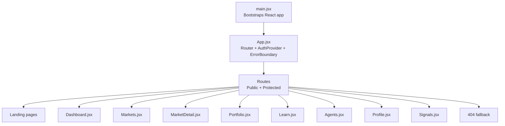
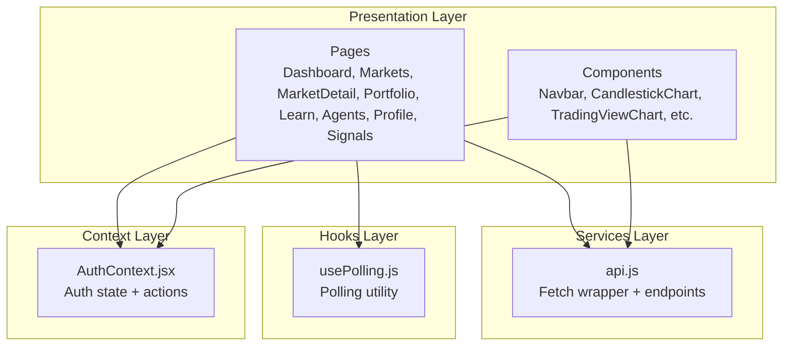
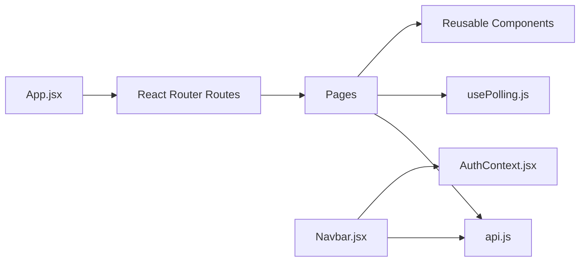

# Pages and Components

<cite>
**Referenced Files in This Document**
- [App.jsx](file://frontend/src/App.jsx)
- [main.jsx](file://frontend/src/main.jsx)
- [Navbar.jsx](file://frontend/src/components/Navbar.jsx)
- [AuthContext.jsx](file://frontend/src/context/AuthContext.jsx)
- [Dashboard.jsx](file://frontend/src/pages/Dashboard.jsx)
- [Portfolio.jsx](file://frontend/src/pages/Portfolio.jsx)
- [Signals.jsx](file://frontend/src/pages/Signals.jsx)
- [Markets.jsx](file://frontend/src/pages/Markets.jsx)
- [MarketDetail.jsx](file://frontend/src/pages/MarketDetail.jsx)
- [Learn.jsx](file://frontend/src/pages/Learn.jsx)
- [Agents.jsx](file://frontend/src/pages/Agents.jsx)
- [Profile.jsx](file://frontend/src/pages/Profile.jsx)
- [api.js](file://frontend/src/services/api.js)
- [usePolling.js](file://frontend/src/hooks/usePolling.js)
</cite>

## Table of Contents
1. [Introduction](#introduction)
2. [Project Structure](#project-structure)
3. [Core Components](#core-components)
4. [Architecture Overview](#architecture-overview)
5. [Detailed Component Analysis](#detailed-component-analysis)
6. [Dependency Analysis](#dependency-analysis)
7. [Performance Considerations](#performance-considerations)
8. [Troubleshooting Guide](#troubleshooting-guide)
9. [Conclusion](#conclusion)
10. [Appendices](#appendices)

## Introduction
This document provides comprehensive documentation for the frontend pages and major components of the Agentic Trading Application. It covers the routing configuration, navigation patterns, page-specific functionality, data fetching patterns, component composition, user interaction flows, props/state management, and integration with backend services. It also documents educational components, market data visualization, and trading interface components, with usage examples and integration patterns for each page.

## Project Structure
The frontend is a React application bootstrapped with Vite. Routing is handled by React Router, with a central App layout that conditionally renders the Navbar, Market pulse bar, and main content area. Authentication is provided by a dedicated context provider. Pages are organized under a single pages directory and composed of reusable components and hooks.

**Diagram sources**
- [main.jsx:1-12](file://frontend/src/main.jsx#L1-L12)
- [App.jsx:1-81](file://frontend/src/App.jsx#L1-L81)

**Section sources**
- [main.jsx:1-12](file://frontend/src/main.jsx#L1-L12)
- [App.jsx:1-81](file://frontend/src/App.jsx#L1-L81)

## Core Components
- App routing and layout: Central router with public and protected routes, conditional rendering of Navbar and MarketPulseBar, and a global Assistant panel.
- Authentication context: Provides login, registration, logout, and user state management with token persistence and auto-fetching user details.
- Navigation: Navbar with search, active link highlighting, user menu, mobile responsiveness, and assistant trigger.
- Data fetching: Centralized API service with normalized responses, automatic retries for GET requests, and token injection.
- Polling hook: Generic polling utility to fetch data at intervals with loading/error states.

Key integration points:
- ProtectedRoute wraps sensitive pages (Portfolio, Profile).
- AuthContext supplies user state and authentication status to all pages.
- API service encapsulates backend endpoints and error handling.

**Section sources**
- [App.jsx:1-81](file://frontend/src/App.jsx#L1-L81)
- [AuthContext.jsx:1-71](file://frontend/src/context/AuthContext.jsx#L1-L71)
- [Navbar.jsx:1-286](file://frontend/src/components/Navbar.jsx#L1-L286)
- [api.js:1-165](file://frontend/src/services/api.js#L1-L165)
- [usePolling.js:1-34](file://frontend/src/hooks/usePolling.js#L1-L34)

## Architecture Overview
The frontend follows a layered architecture:
- Presentation layer: Pages and components.
- Services layer: API client with request normalization and retry logic.
- Hooks layer: Polling and streaming utilities.
- Context layer: Authentication and state management.

**Diagram sources**
- [Dashboard.jsx:1-516](file://frontend/src/pages/Dashboard.jsx#L1-L516)
- [Markets.jsx:1-310](file://frontend/src/pages/Markets.jsx#L1-L310)
- [MarketDetail.jsx:1-435](file://frontend/src/pages/MarketDetail.jsx#L1-L435)
- [Portfolio.jsx:1-231](file://frontend/src/pages/Portfolio.jsx#L1-L231)
- [Learn.jsx:1-229](file://frontend/src/pages/Learn.jsx#L1-L229)
- [Agents.jsx:1-185](file://frontend/src/pages/Agents.jsx#L1-L185)
- [Profile.jsx:1-166](file://frontend/src/pages/Profile.jsx#L1-L166)
- [Signals.jsx:1-163](file://frontend/src/pages/Signals.jsx#L1-L163)
- [api.js:1-165](file://frontend/src/services/api.js#L1-L165)
- [usePolling.js:1-34](file://frontend/src/hooks/usePolling.js#L1-L34)
- [AuthContext.jsx:1-71](file://frontend/src/context/AuthContext.jsx#L1-L71)

## Detailed Component Analysis

### Dashboard Page
Purpose:
- Central command center for scanning live prices, watching agent signals, practicing execution, and navigating to market analysis.

Key features:
- MarketTicker grid with periodic polling of multiple symbols.
- Live signal stream via WebSocket with status indicators and retry controls.
- Portfolio overview card with metrics and open positions.
- Agent status panel with one-click execution.
- Learning rail linking to educational content.
- Trade history table with pagination-friendly polling.

Props/state:
- Manages selected symbol for chart and signal stream.
- Uses polling hook for accounts, trades, and prices.
- Integrates WebSocket signal stream.

Data fetching patterns:
- Polling for prices, portfolio, and trades.
- WebSocket for live signals.

Integration with backend:
- Uses API endpoints for market prices, demo account/portfolio, trades, and agent execution.

Navigation patterns:
- Links to Markets, Portfolio, Agents, Learn, and MarketDetail.

Responsive design:
- Grid layouts adapt across breakpoints; skeleton loaders for loading states.

Usage example:
- Select a symbol from MarketTicker to update the chart and signal stream.

**Section sources**
- [Dashboard.jsx:1-516](file://frontend/src/pages/Dashboard.jsx#L1-L516)
- [usePolling.js:1-34](file://frontend/src/hooks/usePolling.js#L1-L34)
- [api.js:78-131](file://frontend/src/services/api.js#L78-L131)

### Portfolio Page
Purpose:
- Complete view of simulated capital, holdings, and execution history.

Key features:
- Account stats (cash, total value, PnL, invested).
- Open positions table with weights and unrealized PnL.
- Portfolio snapshot statistics.
- Benchmark chart (SPY).
- Trade history table with timestamps and PnL.

Props/state:
- Uses authentication-aware polling for demo account and trades.
- Handles guest vs. authenticated views.

Data fetching patterns:
- Polling for account and recent trades.
- Navigation to market detail on position click.

Integration with backend:
- Demo account, trades, and reset endpoints.

Navigation patterns:
- Back to Markets and Learn.

Responsive design:
- Two-column layout on larger screens; stacked on smaller.

Usage example:
- Reset demo account to initial balance.

**Section sources**
- [Portfolio.jsx:1-231](file://frontend/src/pages/Portfolio.jsx#L1-L231)
- [usePolling.js:1-34](file://frontend/src/hooks/usePolling.js#L1-L34)
- [api.js:106-113](file://frontend/src/services/api.js#L106-L113)

### Signals Page
Purpose:
- Monitor live agent signals with a dual-mode view combining WebSocket stream and REST snapshot.

Key features:
- Symbol selector with predefined list.
- WebSocket status indicator with reconnect option.
- REST snapshot panel with latest signal data.
- Live stream table with timestamps and confidence.

Props/state:
- Tracks selected symbol and REST loading/error states.
- Uses WebSocket signal stream hook.

Data fetching patterns:
- REST snapshot on symbol change.
- WebSocket stream updates.

Integration with backend:
- Signals endpoint and WebSocket connection.

Navigation patterns:
- Refresh button for REST snapshot.

Responsive design:
- Single column layout with scrollable tables.

Usage example:
- Switch symbol to view live signals and price chart.

**Section sources**
- [Signals.jsx:1-163](file://frontend/src/pages/Signals.jsx#L1-L163)
- [api.js:103-104](file://frontend/src/services/api.js#L103-L104)

### Markets Page
Purpose:
- Global market dashboard to scan indices, assets, crypto, and trending tickers.

Key features:
- Search bar with debounced query and combined local/remote suggestions.
- Sidebar sections and trending tickers.
- Grouped market tables with sparklines and quotes.
- Periodic polling of quotes for tracked symbols.

Props/state:
- Debounced search query and results.
- Quote cache keyed by symbol.

Data fetching patterns:
- Debounced search with local and remote sources.
- Interval polling for quotes.

Integration with backend:
- Market price and search endpoints.

Navigation patterns:
- Click symbols to navigate to MarketDetail.

Responsive design:
- Three-column layout on XL screens; stacked on smaller.

Usage example:
- Search for a company or ticker to jump to MarketDetail.

**Section sources**
- [Markets.jsx:1-310](file://frontend/src/pages/Markets.jsx#L1-L310)
- [api.js:92-101](file://frontend/src/services/api.js#L92-L101)

### MarketDetail Page
Purpose:
- Deep-dive market page with charting, signals, and demo trading.

Key features:
- Chart type selector toggling between TradingView and legacy candlesticks.
- Latest signal snapshot with explanation.
- Company and market stats panel.
- Live signal feed.
- Demo trade panel with action, quantity, and preview.
- Real broker redirect links.
- Technical view summary and news placeholders.
- Charting features panel.

Props/state:
- Active symbol from URL params.
- Price data and info loaded via API.
- WebSocket signal stream.

Data fetching patterns:
- One-off quote and info loads on symbol change.
- Interval polling for quotes.
- WebSocket stream for signals.

Integration with backend:
- Market price, symbol info, OHLCV, and demo trade endpoints.
- Chart type persistence via localStorage.

Navigation patterns:
- Back to dashboard and agents.
- Broker redirection.

Responsive design:
- Flexible two-panel layout with sidebars.

Usage example:
- Place a demo buy/sell order and observe portfolio updates.

**Section sources**
- [MarketDetail.jsx:1-435](file://frontend/src/pages/MarketDetail.jsx#L1-L435)
- [api.js:92-101](file://frontend/src/services/api.js#L92-L101)
- [api.js:110-113](file://frontend/src/services/api.js#L110-L113)

### Learn Page
Purpose:
- Educational hub explaining trading strategies and how agents apply them.

Key features:
- Lesson cards with difficulty badges and bullet points.
- Detailed lesson sections with headings and bodies.
- Suggested learning path.
- Apply buttons linking to dashboard, markets, and agents.

Props/state:
- Active lesson selection.
- Memoized summary stats.

Data fetching patterns:
- Static lesson data embedded in component.

Navigation patterns:
- Buttons to dashboard, market detail, and agents.

Responsive design:
- Two-column layout on larger screens.

Usage example:
- Read lessons and practice on MarketDetail or Dashboard.

**Section sources**
- [Learn.jsx:1-229](file://frontend/src/pages/Learn.jsx#L1-L229)

### Agents Page
Purpose:
- Educational agent playground to understand agent logic and execute in demo mode.

Key features:
- Agent cards with status dots, parameter tags, and expandable briefs.
- Execution flow with understanding confirmation.
- Agent families overview.
- Continue learning links.

Props/state:
- Agent list fetched on mount.
- Per-agent execution state and result display.

Data fetching patterns:
- Learning agents endpoint.

Navigation patterns:
- Explanation pages and dashboard/Markets links.

Responsive design:
- Grid layout with sidebar.

Usage example:
- Read agent brief, confirm understanding, and execute in demo mode.

**Section sources**
- [Agents.jsx:1-185](file://frontend/src/pages/Agents.jsx#L1-L185)
- [api.js:117-127](file://frontend/src/services/api.js#L117-L127)

### Profile Page
Purpose:
- Manage identity, preferences, password, and demo balance refill.

Key features:
- Statistics cards for simulated profit, trades, strategies, and progress.
- Account settings form with username, display name, default symbol, timezone, and compact mode.
- Security form for password change.
- Demo balance refill with free and paid options.

Props/state:
- Form state synchronized with profile data.
- Status/error messaging.

Data fetching patterns:
- Profile, update profile, change password, and refill endpoints.

Navigation patterns:
- N/A (self-contained).

Responsive design:
- Two-column layout on medium+ screens.

Usage example:
- Update preferences and refill demo balance.

**Section sources**
- [Profile.jsx:1-166](file://frontend/src/pages/Profile.jsx#L1-L166)
- [api.js:120-124](file://frontend/src/services/api.js#L120-L124)

### Navigation and Routing
Routing configuration:
- Public routes: landing, login, signup, verify-email, markets overview, learn, agents.
- Protected routes: dashboard, portfolio, profile.
- Fallback 404 page.

Navigation patterns:
- Navbar provides primary navigation and search.
- Mobile menu with search and links.
- Assistant panel trigger.

Authentication integration:
- ProtectedRoute ensures only authenticated users can access portfolio/profile.
- AuthContext provides user state and token.

**Section sources**
- [App.jsx:22-67](file://frontend/src/App.jsx#L22-L67)
- [Navbar.jsx:8-15](file://frontend/src/components/Navbar.jsx#L8-L15)
- [AuthContext.jsx:60-63](file://frontend/src/context/AuthContext.jsx#L60-L63)

### Data Fetching Patterns and Backend Integration
Centralized API service:
- Base URL configurable via environment variable.
- Request wrapper with timeout, token injection, and normalized payload extraction.
- Automatic retries for GET requests with exponential backoff.
- ApiError class for HTTP errors and 401 handling.

Endpoints used:
- Auth: register, login, logout, getMe, verifyEmail, resendVerification.
- Health: getHealth.
- Market: getMarketPrice, getOHLCV, getSymbolInfo, searchSymbols, getPopularSymbols.
- Signals: getSignals.
- Portfolio: getPortfolioMetrics.
- Demo: getDemoAccount, executeDemoTrade, getDemoTrades, resetDemoAccount.
- Learning: getLearningAccount, getLearningAgents, executeLearningTrade.
- Profile: getProfile, updateProfile, changePassword, refillDemoBalance.
- Agents: executeAgent.
- AI assistant: askAssistant.

Polling and streaming:
- usePolling hook manages interval-based fetching with loading/error states.
- WebSocket signal streams integrated via hooks (not included here) for live updates.

**Section sources**
- [api.js:1-165](file://frontend/src/services/api.js#L1-165)
- [usePolling.js:1-34](file://frontend/src/hooks/usePolling.js#L1-L34)

### Component Composition and Props
Common patterns:
- Pages compose reusable components (charts, tables, forms).
- Props are passed to child components for data and callbacks.
- State is managed at page level with controlled components.

Examples:
- Dashboard passes symbol to charts and signal stream.
- MarketDetail composes charting components and demo trade panel.
- Portfolio renders tables with formatted currency and percentage values.

**Section sources**
- [Dashboard.jsx:392-515](file://frontend/src/pages/Dashboard.jsx#L392-L515)
- [MarketDetail.jsx:190-434](file://frontend/src/pages/MarketDetail.jsx#L190-L434)
- [Portfolio.jsx:22-230](file://frontend/src/pages/Portfolio.jsx#L22-L230)

### Responsive Design Implementation
- Tailwind classes drive responsive layouts across breakpoints.
- Grid and flex utilities adapt content stacking and spacing.
- Skeleton loaders improve perceived performance during loading states.
- Mobile-first navigation with collapsible menus and simplified layouts.

**Section sources**
- [Dashboard.jsx:406-514](file://frontend/src/pages/Dashboard.jsx#L406-L514)
- [Markets.jsx:195-308](file://frontend/src/pages/Markets.jsx#L195-L308)
- [Navbar.jsx:249-281](file://frontend/src/components/Navbar.jsx#L249-L281)

## Dependency Analysis
High-level dependencies:
- App depends on routing, AuthProvider, ErrorBoundary, and pages.
- Pages depend on API service, hooks, and components.
- Navbar depends on AuthContext and API for search.
- Dashboard integrates multiple data sources (polling, WebSocket).

**Diagram sources**
- [App.jsx:1-81](file://frontend/src/App.jsx#L1-L81)
- [Navbar.jsx:1-286](file://frontend/src/components/Navbar.jsx#L1-L286)
- [AuthContext.jsx:1-71](file://frontend/src/context/AuthContext.jsx#L1-L71)
- [api.js:1-165](file://frontend/src/services/api.js#L1-L165)
- [usePolling.js:1-34](file://frontend/src/hooks/usePolling.js#L1-L34)

**Section sources**
- [App.jsx:1-81](file://frontend/src/App.jsx#L1-L81)
- [Navbar.jsx:1-286](file://frontend/src/components/Navbar.jsx#L1-L286)
- [AuthContext.jsx:1-71](file://frontend/src/context/AuthContext.jsx#L1-L71)
- [api.js:1-165](file://frontend/src/services/api.js#L1-L165)
- [usePolling.js:1-34](file://frontend/src/hooks/usePolling.js#L1-L34)

## Performance Considerations
- Polling intervals: Tune intervals per page to balance freshness and resource usage.
- Debouncing: Search queries are debounced to limit network requests.
- Memoization: useMemo used for derived stats and lists to avoid unnecessary re-renders.
- Skeleton loaders: Improve perceived performance during data fetches.
- Local storage caching: Chart type preference persisted locally.
- Retry logic: GET requests automatically retried with backoff.

[No sources needed since this section provides general guidance]

## Troubleshooting Guide
Common issues and resolutions:
- Authentication failures: 401 responses remove token; ensure login flow completes.
- Request timeouts: Network errors trigger retries for GET; check backend availability.
- Polling errors: usePolling exposes error state; provide retry UI.
- WebSocket disconnections: Signals page shows status and reconnect button.
- Search failures: Combined local/remote fallback ensures suggestions still appear.

**Section sources**
- [api.js:25-64](file://frontend/src/services/api.js#L25-L64)
- [Signals.jsx:34-36](file://frontend/src/pages/Signals.jsx#L34-L36)
- [Navbar.jsx:36-59](file://frontend/src/components/Navbar.jsx#L36-L59)

## Conclusion
The frontend provides a cohesive, educational trading experience with robust data flows, responsive design, and clear navigation. Pages integrate polling, REST snapshots, and WebSocket streams to deliver real-time insights while maintaining usability. Authentication and centralized API services ensure secure and reliable interactions with backend endpoints.

[No sources needed since this section summarizes without analyzing specific files]

## Appendices

### API Endpoints Reference
- Auth: register, login, logout, getMe, verifyEmail, resendVerification
- Health: getHealth
- Market: getMarketPrice, getOHLCV, getSymbolInfo, searchSymbols, getPopularSymbols
- Signals: getSignals
- Portfolio: getPortfolioMetrics
- Demo: getDemoAccount, executeDemoTrade, getDemoTrades, resetDemoAccount
- Learning: getLearningAccount, getLearningAgents, executeLearningTrade
- Profile: getProfile, updateProfile, changePassword, refillDemoBalance
- Agents: executeAgent
- AI assistant: askAssistant

**Section sources**
- [api.js:78-131](file://frontend/src/services/api.js#L78-L131)