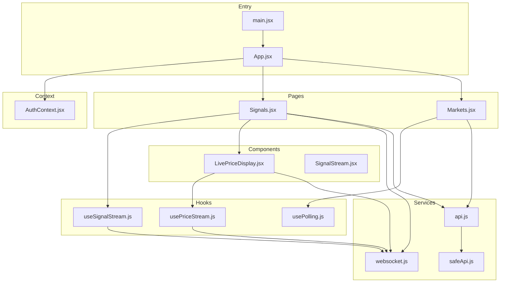
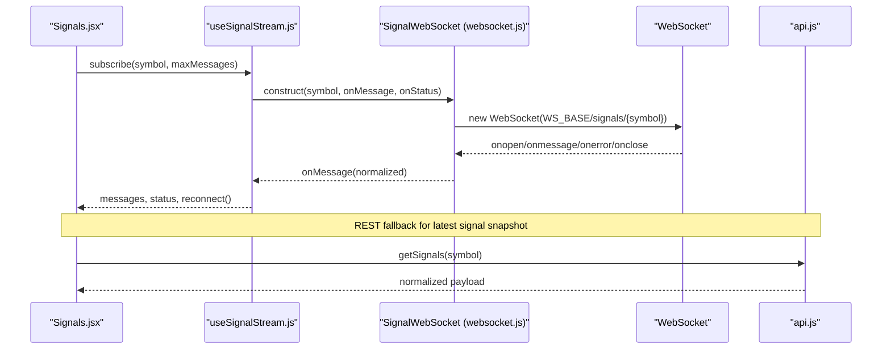
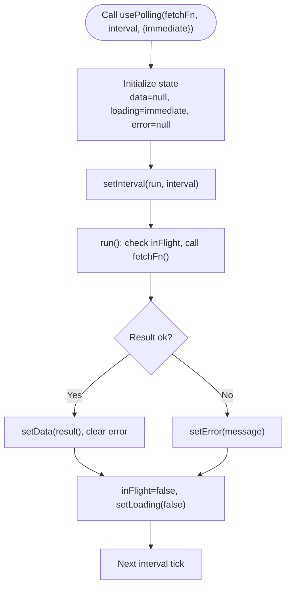
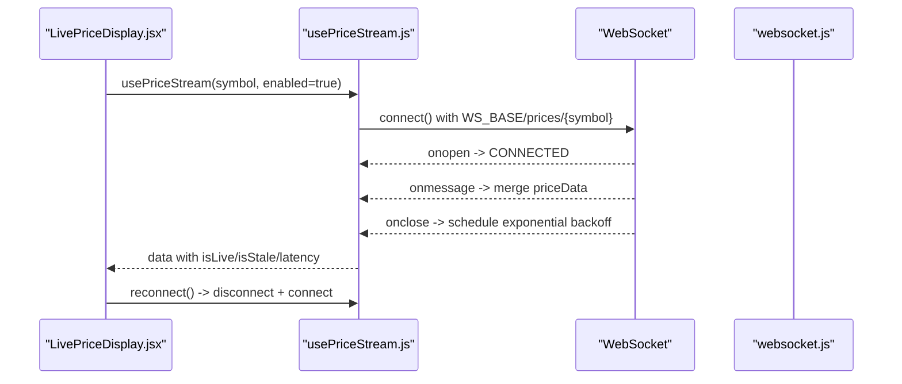
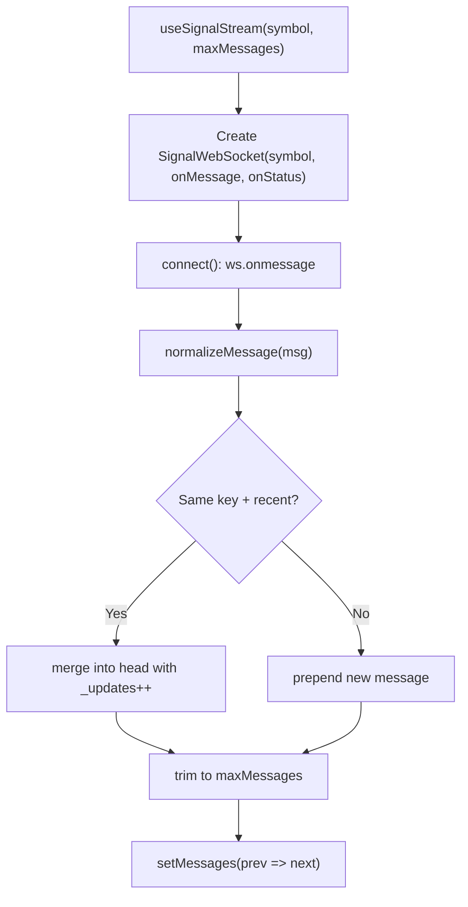
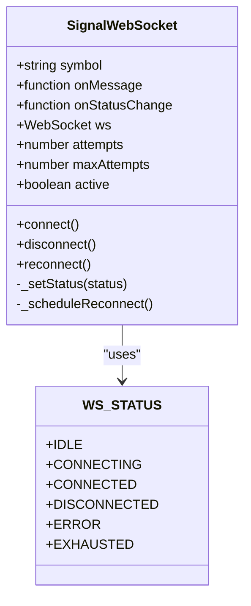
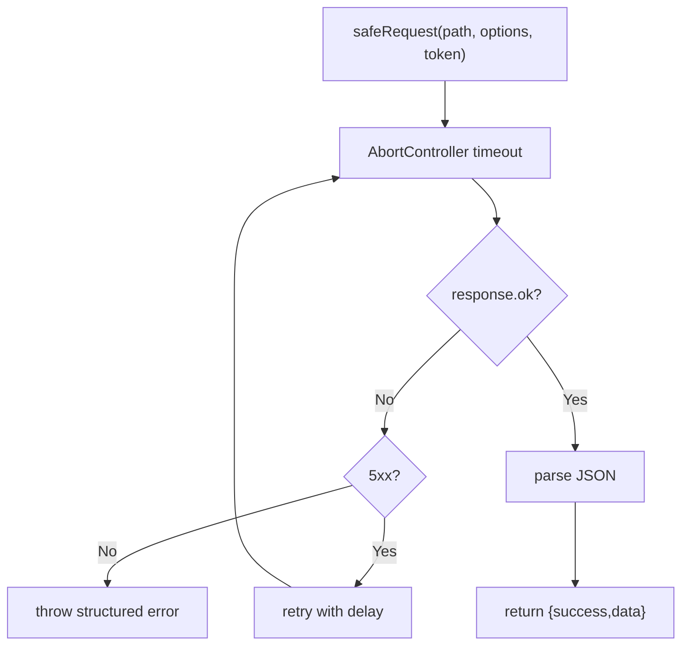
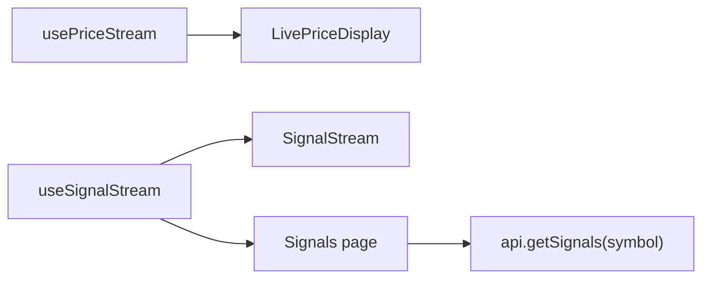
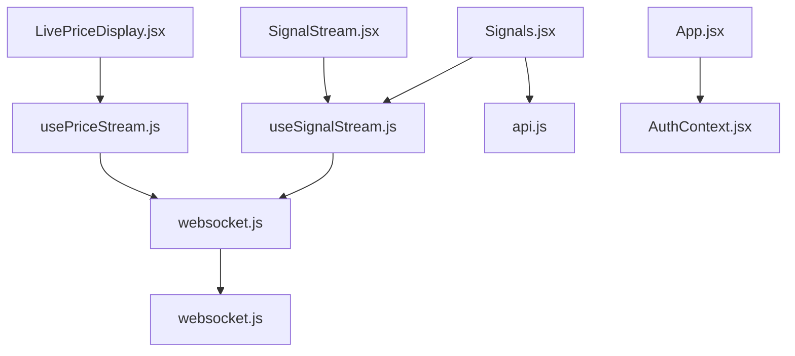

# State Management and Hooks

<cite>
**Referenced Files in This Document**
- [usePolling.js](file://frontend/src/hooks/usePolling.js)
- [usePriceStream.js](file://frontend/src/hooks/usePriceStream.js)
- [useSignalStream.js](file://frontend/src/hooks/useSignalStream.js)
- [websocket.js](file://frontend/src/services/websocket.js)
- [api.js](file://frontend/src/services/api.js)
- [safeApi.js](file://frontend/src/utils/safeApi.js)
- [LivePriceDisplay.jsx](file://frontend/src/components/LivePriceDisplay.jsx)
- [SignalStream.jsx](file://frontend/src/components/SignalStream.jsx)
- [Signals.jsx](file://frontend/src/pages/Signals.jsx)
- [Markets.jsx](file://frontend/src/pages/Markets.jsx)
- [App.jsx](file://frontend/src/App.jsx)
- [main.jsx](file://frontend/src/main.jsx)
- [AuthContext.jsx](file://frontend/src/context/AuthContext.jsx)
- [package.json](file://frontend/package.json)
</cite>

## Table of Contents
1. [Introduction](#introduction)
2. [Project Structure](#project-structure)
3. [Core Components](#core-components)
4. [Architecture Overview](#architecture-overview)
5. [Detailed Component Analysis](#detailed-component-analysis)
6. [Dependency Analysis](#dependency-analysis)
7. [Performance Considerations](#performance-considerations)
8. [Troubleshooting Guide](#troubleshooting-guide)
9. [Conclusion](#conclusion)
10. [Appendices](#appendices)

## Introduction
This document explains the frontend state management architecture with a focus on React hooks, polling mechanisms, and WebSocket integration. It documents custom hooks such as usePolling, usePriceStream, and useSignalStream, along with the API service layer, WebSocket connection management, and real-time streaming patterns. It also covers state synchronization across components, error handling strategies, performance optimizations, and guidelines for extending the system.

## Project Structure
The frontend is a Vite-based React application with modular hooks, services, components, and pages. Key areas:
- Hooks: reusable state/logic abstractions for polling and streaming
- Services: API client and WebSocket utilities
- Components: presentational and composite UI elements using hooks
- Pages: route-level views composing components
- Context: global authentication state
- Utilities: safe API wrappers and helpers

**Diagram sources**
- [main.jsx:1-12](file://frontend/src/main.jsx#L1-L12)
- [App.jsx:1-81](file://frontend/src/App.jsx#L1-L81)
- [usePolling.js:1-34](file://frontend/src/hooks/usePolling.js#L1-L34)
- [usePriceStream.js:1-143](file://frontend/src/hooks/usePriceStream.js#L1-L143)
- [useSignalStream.js:1-67](file://frontend/src/hooks/useSignalStream.js#L1-L67)
- [websocket.js:1-106](file://frontend/src/services/websocket.js#L1-L106)
- [api.js:1-165](file://frontend/src/services/api.js#L1-L165)
- [safeApi.js:1-372](file://frontend/src/utils/safeApi.js#L1-L372)
- [LivePriceDisplay.jsx:1-119](file://frontend/src/components/LivePriceDisplay.jsx#L1-L119)
- [SignalStream.jsx:1-110](file://frontend/src/components/SignalStream.jsx#L1-L110)
- [Signals.jsx:1-163](file://frontend/src/pages/Signals.jsx#L1-L163)
- [Markets.jsx:1-310](file://frontend/src/pages/Markets.jsx#L1-L310)
- [AuthContext.jsx:1-71](file://frontend/src/context/AuthContext.jsx#L1-L71)

**Section sources**
- [main.jsx:1-12](file://frontend/src/main.jsx#L1-L12)
- [App.jsx:1-81](file://frontend/src/App.jsx#L1-L81)
- [package.json:1-28](file://frontend/package.json#L1-L28)

## Core Components
- usePolling: periodic data fetching with in-flight guards, immediate start option, and manual refetch capability.
- usePriceStream: WebSocket-based real-time price streaming with exponential backoff, status tracking, and derived metrics (live/cached/stale detection).
- useSignalStream: WebSocket-based signal stream with deduplication/merge windows, capped message lists, and reconnect controls.
- WebSocket utilities: centralized URL resolution, status constants, and a reusable SignalWebSocket class with automatic reconnect.
- API services: typed endpoints, retry logic, timeouts, and normalized responses; safeApi wrapper for structured success/error handling.
- Components and pages: demonstrate hook usage, status rendering, and integration with charts and tables.

**Section sources**
- [usePolling.js:1-34](file://frontend/src/hooks/usePolling.js#L1-L34)
- [usePriceStream.js:1-143](file://frontend/src/hooks/usePriceStream.js#L1-L143)
- [useSignalStream.js:1-67](file://frontend/src/hooks/useSignalStream.js#L1-L67)
- [websocket.js:1-106](file://frontend/src/services/websocket.js#L1-L106)
- [api.js:1-165](file://frontend/src/services/api.js#L1-L165)
- [safeApi.js:1-372](file://frontend/src/utils/safeApi.js#L1-L372)

## Architecture Overview
The state management architecture combines:
- Hook-driven state: encapsulated logic for polling and streaming
- Service layer: robust HTTP and WebSocket clients
- Component layer: declarative UI bound to hook-managed state
- Context layer: authentication state for protected endpoints
- Routing: page-level composition of components

**Diagram sources**
- [Signals.jsx:29-52](file://frontend/src/pages/Signals.jsx#L29-L52)
- [useSignalStream.js:20-67](file://frontend/src/hooks/useSignalStream.js#L20-L67)
- [websocket.js:32-106](file://frontend/src/services/websocket.js#L32-L106)
- [api.js:103-105](file://frontend/src/services/api.js#L103-L105)

## Detailed Component Analysis

### usePolling Hook
- Purpose: Periodic data fetching with controlled concurrency and immediate start.
- Implementation highlights:
  - Uses a ref to guard against overlapping requests.
  - Supports immediate execution and periodic intervals.
  - Exposes refetch callback and loading/error states.
- Usage pattern:
  - Combine with page effects to refresh lists or summaries periodically.
  - Ideal for lightweight, non-realtime data like market metadata or static catalogs.

**Diagram sources**
- [usePolling.js:3-33](file://frontend/src/hooks/usePolling.js#L3-L33)

**Section sources**
- [usePolling.js:1-34](file://frontend/src/hooks/usePolling.js#L1-L34)
- [Markets.jsx:159-187](file://frontend/src/pages/Markets.jsx#L159-L187)

### usePriceStream Hook
- Purpose: Real-time price streaming with robust connection lifecycle and derived metrics.
- Implementation highlights:
  - Builds WebSocket URL from WS_BASE and symbol.
  - Exponential backoff with max attempts and reconnect timeout.
  - Merges incoming messages while preserving previous state.
  - Computes live/cached/stale indicators and latency metrics.
  - Provides explicit connect/disconnect/reconnect controls.
- Usage pattern:
  - Display live prices with status indicators and manual refresh.
  - Combine with charts and market tables for up-to-date visuals.

**Diagram sources**
- [LivePriceDisplay.jsx:8-119](file://frontend/src/components/LivePriceDisplay.jsx#L8-L119)
- [usePriceStream.js:8-143](file://frontend/src/hooks/usePriceStream.js#L8-L143)
- [websocket.js:32-106](file://frontend/src/services/websocket.js#L32-L106)

**Section sources**
- [usePriceStream.js:1-143](file://frontend/src/hooks/usePriceStream.js#L1-L143)
- [LivePriceDisplay.jsx:1-119](file://frontend/src/components/LivePriceDisplay.jsx#L1-L119)

### useSignalStream Hook
- Purpose: Real-time signal stream with deduplication and merge windows.
- Implementation highlights:
  - Uses a dedicated SignalWebSocket class for connection management.
  - Normalizes messages and builds a stable key to detect duplicates.
  - Merges frequent updates within a short window and caps message count.
  - Exposes reconnect and status for UI feedback.
- Usage pattern:
  - Display a live feed of buy/sell/hold signals with confidence and timestamps.
  - Pair with REST snapshots for historical context.

**Diagram sources**
- [useSignalStream.js:18-67](file://frontend/src/hooks/useSignalStream.js#L18-L67)
- [websocket.js:32-106](file://frontend/src/services/websocket.js#L32-L106)

**Section sources**
- [useSignalStream.js:1-67](file://frontend/src/hooks/useSignalStream.js#L1-L67)
- [SignalStream.jsx:1-110](file://frontend/src/components/SignalStream.jsx#L1-L110)
- [Signals.jsx:29-52](file://frontend/src/pages/Signals.jsx#L29-L52)

### WebSocket Connection Management
- Centralized URL resolution supports environment overrides and protocol selection.
- Status constants unify UI state across components.
- SignalWebSocket encapsulates connection lifecycle, error handling, and exponential backoff.
- Price streams use a direct WebSocket approach with per-symbol endpoints.

**Diagram sources**
- [websocket.js:32-106](file://frontend/src/services/websocket.js#L32-L106)

**Section sources**
- [websocket.js:1-106](file://frontend/src/services/websocket.js#L1-L106)

### API Service Layer
- Typed endpoints for auth, market data, signals, portfolio, learning, profile, agents, and assistant.
- Automatic retry for server errors on GET requests.
- Timeout handling and normalized payload extraction.
- Authenticated requests automatically attach Bearer tokens.
- safeApi wrapper returns structured { success, data, error } responses for safer UI handling.

**Diagram sources**
- [safeApi.js:18-134](file://frontend/src/utils/safeApi.js#L18-L134)
- [api.js:25-64](file://frontend/src/services/api.js#L25-L64)

**Section sources**
- [api.js:1-165](file://frontend/src/services/api.js#L1-L165)
- [safeApi.js:1-372](file://frontend/src/utils/safeApi.js#L1-L372)

### State Synchronization Between Components
- usePriceStream and useSignalStream expose normalized state and status to components.
- LivePriceDisplay renders status dots, source type, latency, and stale warnings.
- SignalStream displays live messages with badges and reconnect actions.
- Signals page composes WebSocket stream with a REST snapshot for completeness.

**Diagram sources**
- [LivePriceDisplay.jsx:8-119](file://frontend/src/components/LivePriceDisplay.jsx#L8-L119)
- [SignalStream.jsx:29-110](file://frontend/src/components/SignalStream.jsx#L29-L110)
- [Signals.jsx:29-52](file://frontend/src/pages/Signals.jsx#L29-L52)

**Section sources**
- [LivePriceDisplay.jsx:1-119](file://frontend/src/components/LivePriceDisplay.jsx#L1-L119)
- [SignalStream.jsx:1-110](file://frontend/src/components/SignalStream.jsx#L1-L110)
- [Signals.jsx:1-163](file://frontend/src/pages/Signals.jsx#L1-L163)

## Dependency Analysis
- Hook-to-service coupling:
  - usePriceStream depends on websocket.js for URL and status constants.
  - useSignalStream depends on SignalWebSocket from websocket.js.
  - Both rely on api.js for REST fallbacks in hybrid flows.
- Component-to-hook coupling:
  - LivePriceDisplay consumes usePriceStream outputs.
  - SignalStream and Signals consume useSignalStream outputs.
- Global context:
  - AuthContext provides token and user state for protected API calls.

**Diagram sources**
- [LivePriceDisplay.jsx:1-119](file://frontend/src/components/LivePriceDisplay.jsx#L1-L119)
- [SignalStream.jsx:1-110](file://frontend/src/components/SignalStream.jsx#L1-L110)
- [Signals.jsx:1-163](file://frontend/src/pages/Signals.jsx#L1-L163)
- [usePriceStream.js:1-143](file://frontend/src/hooks/usePriceStream.js#L1-L143)
- [useSignalStream.js:1-67](file://frontend/src/hooks/useSignalStream.js#L1-L67)
- [websocket.js:1-106](file://frontend/src/services/websocket.js#L1-L106)
- [api.js:1-165](file://frontend/src/services/api.js#L1-L165)
- [App.jsx:1-81](file://frontend/src/App.jsx#L1-L81)
- [AuthContext.jsx:1-71](file://frontend/src/context/AuthContext.jsx#L1-L71)

**Section sources**
- [App.jsx:1-81](file://frontend/src/App.jsx#L1-L81)
- [AuthContext.jsx:1-71](file://frontend/src/context/AuthContext.jsx#L1-L71)

## Performance Considerations
- Polling
  - Use appropriate intervals to balance freshness vs. bandwidth.
  - Guard concurrent runs with in-flight refs to avoid overlapping requests.
  - Prefer targeted polling for small datasets; use streaming for continuous feeds.
- Streaming
  - Deduplicate and merge frequent updates to reduce re-renders.
  - Cap message lists to limit memory growth.
  - Use exponential backoff to prevent thundering herds on reconnection.
- Rendering
  - Memoize derived metrics and computed values to minimize churn.
  - Avoid unnecessary deep merges; prefer immutable updates with spread operators.
- Network
  - Apply timeouts and retries judiciously.
  - Normalize payloads early to simplify downstream logic.
- Authentication
  - Cache token and user state; invalidate on 401 to prevent repeated failed requests.

[No sources needed since this section provides general guidance]

## Troubleshooting Guide
- WebSocket connectivity
  - Inspect status transitions and logs for onerror/onclose events.
  - Verify WS_BASE resolves to the correct scheme and host.
  - Confirm symbol casing and endpoint availability.
- Price stream staleness
  - Check receivedAt timestamps and source indicators.
  - Investigate long delays or repeated reconnects.
- Signal stream duplication
  - Review merge window logic and message keys.
  - Ensure symbol/action/price normalization is consistent.
- API failures
  - Distinguish between timeouts, network errors, and server errors.
  - Respect retry limits and surface user-friendly messages.
- Authentication
  - On 401, remove token and reset user state.
  - Use safeApi wrappers to centralize error handling.

**Section sources**
- [websocket.js:32-106](file://frontend/src/services/websocket.js#L32-L106)
- [usePriceStream.js:16-111](file://frontend/src/hooks/usePriceStream.js#L16-L111)
- [useSignalStream.js:26-62](file://frontend/src/hooks/useSignalStream.js#L26-L62)
- [safeApi.js:18-134](file://frontend/src/utils/safeApi.js#L18-L134)
- [api.js:25-64](file://frontend/src/services/api.js#L25-L64)
- [AuthContext.jsx:33-57](file://frontend/src/context/AuthContext.jsx#L33-L57)

## Conclusion
The frontend employs a clean separation of concerns: hooks encapsulate polling and streaming logic, services provide robust HTTP/WebSocket clients, and components bind to normalized state. The system balances real-time responsiveness with reliability through backoff, deduplication, and structured error handling. Extending the architecture follows predictable patterns: add endpoints to the API service, create or reuse hooks, and wire them into components.

[No sources needed since this section summarizes without analyzing specific files]

## Appendices

### Guidelines for Adding New Hooks
- Encapsulate a single responsibility (polling/streaming/state derivation).
- Manage lifecycle cleanup (clear intervals/timeouts, close connections).
- Expose normalized outputs and status/state for UI consumption.
- Keep side effects isolated; return callbacks for manual actions (refetch/reconnect).
- Derive metrics in a memoized way to avoid unnecessary recalculations.

[No sources needed since this section provides general guidance]

### Example Data Fetching Patterns
- REST snapshot + live stream hybrid:
  - Use a streaming hook for live updates.
  - Use a REST call for an initial snapshot to avoid empty UI.
- Batch polling:
  - Use Promise.allSettled for concurrent symbol loads.
  - Accumulate partial results safely and avoid overwrites.

**Section sources**
- [Signals.jsx:38-52](file://frontend/src/pages/Signals.jsx#L38-L52)
- [Markets.jsx:142-157](file://frontend/src/pages/Markets.jsx#L142-L157)

### Caching Strategies
- In-memory caches keyed by symbol or endpoint.
- Derived metrics cached per data object to avoid recomputation.
- Avoid storing raw WebSocket frames; normalize and merge incrementally.

[No sources needed since this section provides general guidance]

### Component Re-rendering Optimization
- Use useMemo for derived computations (e.g., trending lists).
- Use useCallback for handlers passed to child components.
- Prefer shallow comparisons and immutable updates.

**Section sources**
- [Markets.jsx:189-194](file://frontend/src/pages/Markets.jsx#L189-L194)