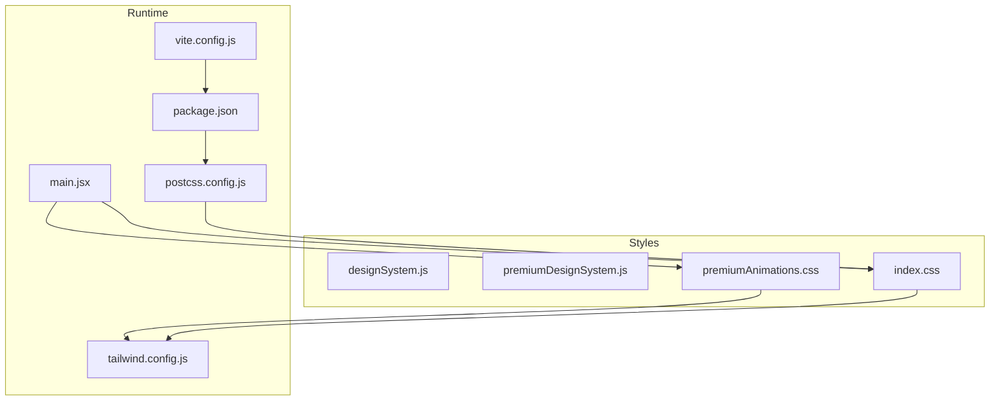
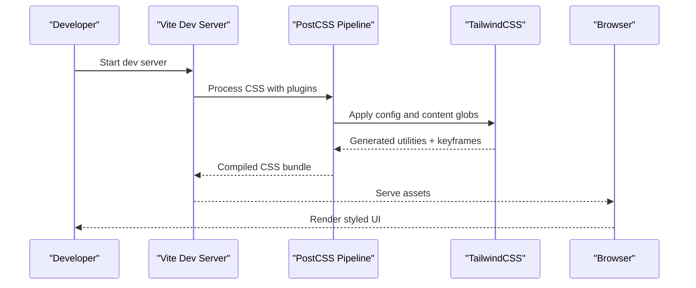
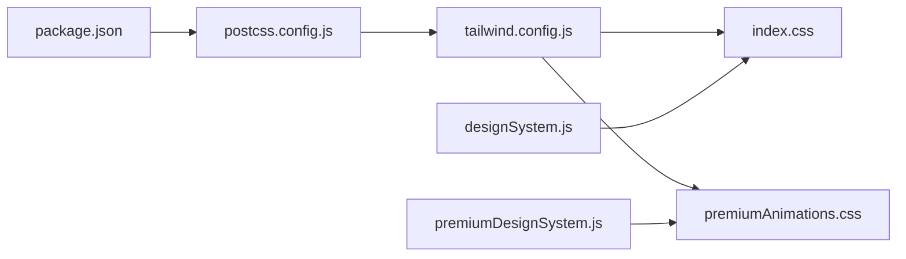

# Styling and Theming

<cite>
**Referenced Files in This Document**
- [designSystem.js](file://frontend/src/styles/designSystem.js)
- [premiumDesignSystem.js](file://frontend/src/styles/premiumDesignSystem.js)
- [premiumAnimations.css](file://frontend/src/styles/premiumAnimations.css)
- [index.css](file://frontend/src/index.css)
- [tailwind.config.js](file://frontend/tailwind.config.js)
- [postcss.config.js](file://frontend/postcss.config.js)
- [main.jsx](file://frontend/src/main.jsx)
- [Navbar.jsx](file://frontend/src/components/Navbar.jsx)
- [Dashboard.jsx](file://frontend/src/pages/Dashboard.jsx)
- [LandingPremium.jsx](file://frontend/src/pages/LandingPremium.jsx)
- [PortfolioCard.jsx](file://frontend/src/components/PortfolioCard.jsx)
- [PriceChart.jsx](file://frontend/src/components/PriceChart.jsx)
- [package.json](file://frontend/package.json)
- [vite.config.js](file://frontend/vite.config.js)
</cite>

## Table of Contents
1. [Introduction](#introduction)
2. [Project Structure](#project-structure)
3. [Core Components](#core-components)
4. [Architecture Overview](#architecture-overview)
5. [Detailed Component Analysis](#detailed-component-analysis)
6. [Dependency Analysis](#dependency-analysis)
7. [Performance Considerations](#performance-considerations)
8. [Troubleshooting Guide](#troubleshooting-guide)
9. [Conclusion](#conclusion)
10. [Appendices](#appendices)

## Introduction
This document describes the frontend styling and theming system for the Agentic Trading Application. It explains the design system architecture, color palettes, typography scales, spacing systems, and component styling patterns. It documents premium design system enhancements, animation configurations, and responsive breakpoints. It also details the TailwindCSS configuration, PostCSS processing, and custom CSS implementations. Finally, it provides guidelines for maintaining design consistency, creating new components with proper styling, and implementing theme variations, along with examples of component styling patterns, animation usage, and responsive design best practices.

## Project Structure
The styling system is organized around three pillars:
- A foundational design system module exporting tokens for colors, spacing, typography, components, layouts, and animations.
- A premium design system module extending the foundation with advanced gradients, glassmorphism, premium animations, and special effects.
- Global CSS and Tailwind configuration that apply base styles, layer utilities, and animation keyframes.

**Diagram sources**
- [main.jsx:1-12](file://frontend/src/main.jsx#L1-L12)
- [index.css:1-88](file://frontend/src/index.css#L1-L88)
- [premiumAnimations.css:1-161](file://frontend/src/styles/premiumAnimations.css#L1-L161)
- [designSystem.js:1-258](file://frontend/src/styles/designSystem.js#L1-L258)
- [premiumDesignSystem.js:1-306](file://frontend/src/styles/premiumDesignSystem.js#L1-L306)
- [tailwind.config.js:1-32](file://frontend/tailwind.config.js#L1-L32)
- [postcss.config.js:1-7](file://frontend/postcss.config.js#L1-L7)
- [package.json:1-28](file://frontend/package.json#L1-L28)
- [vite.config.js:1-36](file://frontend/vite.config.js#L1-L36)

**Section sources**
- [main.jsx:1-12](file://frontend/src/main.jsx#L1-L12)
- [index.css:1-88](file://frontend/src/index.css#L1-L88)
- [premiumAnimations.css:1-161](file://frontend/src/styles/premiumAnimations.css#L1-L161)
- [designSystem.js:1-258](file://frontend/src/styles/designSystem.js#L1-L258)
- [premiumDesignSystem.js:1-306](file://frontend/src/styles/premiumDesignSystem.js#L1-L306)
- [tailwind.config.js:1-32](file://frontend/tailwind.config.js#L1-L32)
- [postcss.config.js:1-7](file://frontend/postcss.config.js#L1-L7)
- [package.json:1-28](file://frontend/package.json#L1-L28)
- [vite.config.js:1-36](file://frontend/vite.config.js#L1-L36)

## Core Components
The design system is composed of modular tokens and utilities:

- Color palette: Base semantic colors for backgrounds, accents, text, and borders.
- Spacing system: Consistent padding tokens mapped to Tailwind utilities.
- Typography: Font families, display headings, page headings, body text, labels, captions, and numeric data styles.
- Component styles: Card, button, input, and badge variants built from color and spacing tokens.
- Layout utilities: Container, section, grid, and flex utilities.
- Animation utilities: Named animation classes for fade-in, slide-up, pulse, and spin.

These tokens are exported from the design system module and consumed across components.

**Section sources**
- [designSystem.js:10-258](file://frontend/src/styles/designSystem.js#L10-L258)

## Architecture Overview
The styling pipeline integrates TailwindCSS, PostCSS, and custom CSS:

- TailwindCSS generates utility classes from the configured content globs and extends animation/keyframes.
- PostCSS processes Tailwind output with autoprefixer for vendor prefixes.
- Custom CSS defines base styles, layer utilities, and keyframe animations.
- Premium animations are imported globally to augment the design system with advanced transitions and hover effects.

**Diagram sources**
- [postcss.config.js:1-7](file://frontend/postcss.config.js#L1-L7)
- [tailwind.config.js:1-32](file://frontend/tailwind.config.js#L1-L32)
- [index.css:1-88](file://frontend/src/index.css#L1-L88)
- [premiumAnimations.css:1-161](file://frontend/src/styles/premiumAnimations.css#L1-L161)
- [main.jsx:1-12](file://frontend/src/main.jsx#L1-L12)

## Detailed Component Analysis

### Design System Tokens
The foundational design system exports:
- COLORS: Backgrounds, accent colors, text, and borders.
- SPACING: Padding tokens for xs, sm, md, lg, xl.
- TYPOGRAPHY: Font families, display headings, page headings, body text, labels, captions, and numeric styles.
- COMPONENTS: Card, button, input, and badge variants.
- LAYOUT: Container, grid, and flex utilities.
- ANIMATIONS: Named animation classes for fade-in, slide-up, pulse, spin.

These tokens enable consistent styling across components and support theme variations.

**Section sources**
- [designSystem.js:10-258](file://frontend/src/styles/designSystem.js#L10-L258)

### Premium Design System Enhancements
The premium design system extends the foundation with:
- PREMIUM_COLORS: Gradients, glassmorphism effects, glow effects, and premium backgrounds.
- ANIMATIONS: Advanced transitions, hover effects (lift, glow, scale, shimmer), and keyframe-based animations.
- TYPOGRAPHY: Enhanced font families, headings, body styles, and special text effects (gradient text, glow).
- COMPONENTS: Premium button variants, interactive cards, inputs with icons, and gradient badges.
- LAYOUT: Enhanced containers, grid patterns, and flex utilities.
- EFFECTS: Scrollbar styling, selection color, smooth scrolling, and anti-aliasing.

It also exposes helper functions for dynamic gradient creation and glass intensity selection.

**Section sources**
- [premiumDesignSystem.js:10-306](file://frontend/src/styles/premiumDesignSystem.js#L10-L306)

### TailwindCSS Configuration
Tailwind is configured to:
- Scan HTML and JSX files under src for class usage.
- Extend animation utilities with ticker, fade-in, and slide-up.
- Define keyframes for ticker and fade-in/slide-up animations.
- Keep plugins empty, relying on PostCSS for vendor prefixing.

**Section sources**
- [tailwind.config.js:1-32](file://frontend/tailwind.config.js#L1-L32)

### PostCSS Processing
PostCSS applies:
- TailwindCSS plugin to process utilities and components.
- Autoprefixer plugin to add vendor prefixes.

**Section sources**
- [postcss.config.js:1-7](file://frontend/postcss.config.js#L1-L7)

### Global Styles and Layer Utilities
Global index.css defines:
- Base typography and font families.
- Root background with radial gradients and smooth scrolling.
- Custom component layer utilities (.panel, .btn-primary, .input, .badge-*).
- Skeleton loading animation with shimmer keyframes.

**Section sources**
- [index.css:1-88](file://frontend/src/index.css#L1-L88)

### Premium Animations
The premium animations CSS file defines:
- Smooth scrolling behavior.
- Keyframes for shimmer, float, pulse-glow, slide-up, fade-in, scale-in, glow, and gradient-shift.
- Utility classes for animations and hover effects (lift, glow, glass-hover).
- Staggered card animations and interactive scaling.

**Section sources**
- [premiumAnimations.css:1-161](file://frontend/src/styles/premiumAnimations.css#L1-L161)

### Runtime Integration
The app integrates styles at startup:
- Imports global index.css and premium animations CSS.
- Consumes design system tokens in components for consistent styling.

**Section sources**
- [main.jsx:1-12](file://frontend/src/main.jsx#L1-L12)

### Component Styling Patterns
Components demonstrate consistent styling patterns:

- Navbar
  - Uses premium colors and animations for glassmorphism, glow, and hover effects.
  - Implements responsive layout with mobile menu and search suggestions.
  - Leverages premium typography and component styles for branding and navigation.

- Dashboard
  - Uses base layer utilities for panels, stat tiles, and badges.
  - Implements skeleton loaders and responsive grids for market data.
  - Integrates live signal streams and portfolio metrics with consistent styling.

- LandingPremium
  - Demonstrates premium design system with gradients, glassmorphism, and parallax effects.
  - Uses premium animations for hero glows, hover scaling, and staggered stats.

- PortfolioCard
  - Uses base component styles for metrics and loading states.
  - Applies conditional colors for positive/negative values.

- PriceChart
  - Uses base component styles for controls and overlays.
  - Implements fallback data handling and error messaging with consistent styling.

**Section sources**
- [Navbar.jsx:1-286](file://frontend/src/components/Navbar.jsx#L1-L286)
- [Dashboard.jsx:1-516](file://frontend/src/pages/Dashboard.jsx#L1-L516)
- [LandingPremium.jsx:1-328](file://frontend/src/pages/LandingPremium.jsx#L1-L328)
- [PortfolioCard.jsx:1-85](file://frontend/src/components/PortfolioCard.jsx#L1-L85)
- [PriceChart.jsx:1-347](file://frontend/src/components/PriceChart.jsx#L1-L347)

## Dependency Analysis
The styling system depends on:
- TailwindCSS for utility-first styling and responsive breakpoints.
- PostCSS for processing and vendor prefixing.
- React components consuming design system tokens for consistent UI.

**Diagram sources**
- [package.json:1-28](file://frontend/package.json#L1-L28)
- [postcss.config.js:1-7](file://frontend/postcss.config.js#L1-L7)
- [tailwind.config.js:1-32](file://frontend/tailwind.config.js#L1-L32)
- [index.css:1-88](file://frontend/src/index.css#L1-L88)
- [premiumAnimations.css:1-161](file://frontend/src/styles/premiumAnimations.css#L1-L161)
- [designSystem.js:1-258](file://frontend/src/styles/designSystem.js#L1-L258)
- [premiumDesignSystem.js:1-306](file://frontend/src/styles/premiumDesignSystem.js#L1-L306)

**Section sources**
- [package.json:1-28](file://frontend/package.json#L1-L28)
- [postcss.config.js:1-7](file://frontend/postcss.config.js#L1-L7)
- [tailwind.config.js:1-32](file://frontend/tailwind.config.js#L1-L32)
- [index.css:1-88](file://frontend/src/index.css#L1-L88)
- [premiumAnimations.css:1-161](file://frontend/src/styles/premiumAnimations.css#L1-L161)
- [designSystem.js:1-258](file://frontend/src/styles/designSystem.js#L1-L258)
- [premiumDesignSystem.js:1-306](file://frontend/src/styles/premiumDesignSystem.js#L1-L306)

## Performance Considerations
- Prefer utility classes from the design system to minimize custom CSS and reduce bundle size.
- Use Tailwind’s JIT scanning to limit generated CSS to used classes.
- Consolidate animations and keyframes to avoid duplication.
- Keep component-specific styles scoped to maintain performance and clarity.

## Troubleshooting Guide
Common styling issues and resolutions:
- Missing animations: Ensure premium animations CSS is imported in the main entry file.
- Tailwind utilities not applied: Verify content globs in Tailwind config include the relevant source paths.
- PostCSS errors: Confirm PostCSS plugins are installed and configured correctly.
- Responsive breakpoints not working: Check Tailwind’s default breakpoint values and ensure responsive modifiers are used consistently.

**Section sources**
- [main.jsx:1-12](file://frontend/src/main.jsx#L1-L12)
- [tailwind.config.js:1-32](file://frontend/tailwind.config.js#L1-L32)
- [postcss.config.js:1-7](file://frontend/postcss.config.js#L1-L7)
- [package.json:1-28](file://frontend/package.json#L1-L28)

## Conclusion
The Agentic Trading Application employs a layered design system that combines a foundational design system with premium enhancements. TailwindCSS and PostCSS form the backbone of the styling pipeline, while global CSS and custom animations elevate the user experience. Components consistently consume design tokens to ensure visual coherence, responsiveness, and maintainability. Following the guidelines below will help preserve design consistency and accelerate theme development.

## Appendices

### Design System Reference
- Color palette: Backgrounds, accents, text, and borders.
- Spacing: Padding tokens for xs, sm, md, lg, xl.
- Typography: Font families, headings, body, labels, captions, and numeric styles.
- Components: Cards, buttons, inputs, and badges.
- Layout: Containers, grids, and flex utilities.
- Animations: Fade-in, slide-up, pulse, spin, and advanced keyframes.

**Section sources**
- [designSystem.js:10-258](file://frontend/src/styles/designSystem.js#L10-L258)
- [premiumDesignSystem.js:10-306](file://frontend/src/styles/premiumDesignSystem.js#L10-L306)

### Tailwind and PostCSS Setup
- Tailwind content globs scan HTML and JSX files.
- Extended animations and keyframes are defined in the Tailwind config.
- PostCSS applies Tailwind and autoprefixer plugins.

**Section sources**
- [tailwind.config.js:1-32](file://frontend/tailwind.config.js#L1-L32)
- [postcss.config.js:1-7](file://frontend/postcss.config.js#L1-L7)
- [package.json:1-28](file://frontend/package.json#L1-L28)

### Component Styling Patterns
- Use design system tokens for colors, spacing, and typography.
- Apply layout utilities for consistent grids and flex behavior.
- Leverage animation utilities for micro-interactions and transitions.
- Maintain responsive patterns with Tailwind’s responsive modifiers.

Examples:
- Navbar: Premium colors, glassmorphism, and hover effects.
- Dashboard: Base layer utilities and skeleton loaders.
- LandingPremium: Premium gradients, glassmorphism, and parallax.
- PortfolioCard: Base component styles and conditional colors.
- PriceChart: Base component styles and fallback handling.

**Section sources**
- [Navbar.jsx:1-286](file://frontend/src/components/Navbar.jsx#L1-L286)
- [Dashboard.jsx:1-516](file://frontend/src/pages/Dashboard.jsx#L1-L516)
- [LandingPremium.jsx:1-328](file://frontend/src/pages/LandingPremium.jsx#L1-L328)
- [PortfolioCard.jsx:1-85](file://frontend/src/components/PortfolioCard.jsx#L1-L85)
- [PriceChart.jsx:1-347](file://frontend/src/components/PriceChart.jsx#L1-L347)