# UI Components Library

<cite>
**Referenced Files in This Document**
- [PriceChart.jsx](file://frontend/src/components/PriceChart.jsx)
- [AnalyticsChart.jsx](file://frontend/src/components/AnalyticsChart.jsx)
- [CandlestickChart.jsx](file://frontend/src/components/CandlestickChart.jsx)
- [TradingViewChart.jsx](file://frontend/src/components/TradingViewChart.jsx)
- [PortfolioCard.jsx](file://frontend/src/components/PortfolioCard.jsx)
- [MiniSparkline.jsx](file://frontend/src/components/MiniSparkline.jsx)
- [SignalStream.jsx](file://frontend/src/components/SignalStream.jsx)
- [AIDecisionExplorer.jsx](file://frontend/src/components/educational/AIDecisionExplorer.jsx)
- [TradeExplanation.jsx](file://frontend/src/components/educational/TradeExplanation.jsx)
- [useSignalStream.js](file://frontend/src/hooks/useSignalStream.js)
- [usePolling.js](file://frontend/src/hooks/usePolling.js)
- [api.js](file://frontend/src/services/api.js)
- [websocket.js](file://frontend/src/services/websocket.js)
- [designSystem.js](file://frontend/src/styles/designSystem.js)
- [marketCatalog.js](file://frontend/src/data/marketCatalog.js)
</cite>

## Table of Contents
1. [Introduction](#introduction)
2. [Project Structure](#project-structure)
3. [Core Components](#core-components)
4. [Architecture Overview](#architecture-overview)
5. [Detailed Component Analysis](#detailed-component-analysis)
6. [Dependency Analysis](#dependency-analysis)
7. [Performance Considerations](#performance-considerations)
8. [Troubleshooting Guide](#troubleshooting-guide)
9. [Conclusion](#conclusion)
10. [Appendices](#appendices)

## Introduction
This document provides comprehensive UI components documentation for the reusable frontend components in the Agentic Trading Application. It focuses on chart components (PriceChart, AnalyticsChart, CandlestickChart, TradingViewChart), portfolio display components (PortfolioCard, MiniSparkline), interactive components (SignalStream), and educational components (AIDecisionExplorer, TradeExplanation). For each component, we explain props, internal behavior, styling patterns using TailwindCSS, responsive design, and integration examples. We also cover composition patterns, extension guidelines, and best practices.

## Project Structure
The UI components are organized under the frontend/src/components directory, grouped by domain:
- Charting: PriceChart, AnalyticsChart, CandlestickChart, TradingViewChart
- Portfolio: PortfolioCard, MiniSparkline
- Interactions: SignalStream
- Education: AIDecisionExplorer, TradeExplanation
Supporting utilities include hooks (usePolling, useSignalStream), service integrations (api, websocket), design system (designSystem), and market catalog (marketCatalog).

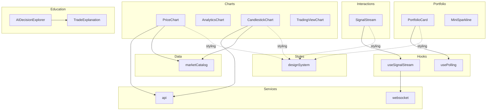

**Diagram sources**
- [PriceChart.jsx:66-347](file://frontend/src/components/PriceChart.jsx#L66-L347)
- [AnalyticsChart.jsx:7-122](file://frontend/src/components/AnalyticsChart.jsx#L7-L122)
- [CandlestickChart.jsx:41-317](file://frontend/src/components/CandlestickChart.jsx#L41-L317)
- [TradingViewChart.jsx:17-254](file://frontend/src/components/TradingViewChart.jsx#L17-L254)
- [PortfolioCard.jsx:21-85](file://frontend/src/components/PortfolioCard.jsx#L21-L85)
- [MiniSparkline.jsx:1-21](file://frontend/src/components/MiniSparkline.jsx#L1-L21)
- [SignalStream.jsx:29-110](file://frontend/src/components/SignalStream.jsx#L29-L110)
- [AIDecisionExplorer.jsx:8-150](file://frontend/src/components/educational/AIDecisionExplorer.jsx#L8-L150)
- [TradeExplanation.jsx:8-228](file://frontend/src/components/educational/TradeExplanation.jsx#L8-L228)
- [usePolling.js:3-34](file://frontend/src/hooks/usePolling.js#L3-L34)
- [useSignalStream.js:20-67](file://frontend/src/hooks/useSignalStream.js#L20-L67)
- [api.js:78-131](file://frontend/src/services/api.js#L78-L131)
- [websocket.js:32-105](file://frontend/src/services/websocket.js#L32-L105)
- [designSystem.js:11-258](file://frontend/src/styles/designSystem.js#L11-L258)
- [marketCatalog.js:1-68](file://frontend/src/data/marketCatalog.js#L1-L68)

**Section sources**
- [PriceChart.jsx:1-347](file://frontend/src/components/PriceChart.jsx#L1-L347)
- [AnalyticsChart.jsx:1-122](file://frontend/src/components/AnalyticsChart.jsx#L1-L122)
- [CandlestickChart.jsx:1-317](file://frontend/src/components/CandlestickChart.jsx#L1-L317)
- [TradingViewChart.jsx:1-254](file://frontend/src/components/TradingViewChart.jsx#L1-L254)
- [PortfolioCard.jsx:1-85](file://frontend/src/components/PortfolioCard.jsx#L1-L85)
- [MiniSparkline.jsx:1-21](file://frontend/src/components/MiniSparkline.jsx#L1-L21)
- [SignalStream.jsx:1-110](file://frontend/src/components/SignalStream.jsx#L1-L110)
- [AIDecisionExplorer.jsx:1-150](file://frontend/src/components/educational/AIDecisionExplorer.jsx#L1-L150)
- [TradeExplanation.jsx:1-228](file://frontend/src/components/educational/TradeExplanation.jsx#L1-L228)
- [usePolling.js:1-34](file://frontend/src/hooks/usePolling.js#L1-L34)
- [useSignalStream.js:1-67](file://frontend/src/hooks/useSignalStream.js#L1-L67)
- [api.js:1-165](file://frontend/src/services/api.js#L1-L165)
- [websocket.js:1-106](file://frontend/src/services/websocket.js#L1-L106)
- [designSystem.js:1-258](file://frontend/src/styles/designSystem.js#L1-L258)
- [marketCatalog.js:1-68](file://frontend/src/data/marketCatalog.js#L1-L68)

## Core Components
This section summarizes the primary components and their responsibilities.

- PriceChart: Interactive OHLCV visualization with candlesticks and line charts, selectable ranges and types, hover details, and fallback rendering.
- AnalyticsChart: Deterministic equity curve visualization with gradient fill and tooltip interactions.
- CandlestickChart: Responsive candlestick chart with volume overlay, period selection, and live refresh behavior.
- TradingViewChart: Embedded TradingView Advanced Chart widget with extensive customization, studies, and fallback handling.
- PortfolioCard: Live portfolio metrics with polling, error handling, and position breakdown.
- MiniSparkline: Lightweight SVG sparkline for small trend indicators.
- SignalStream: Real-time signal feed via WebSocket with reconnection logic and merging of near-simultaneous messages.
- AIDecisionExplorer: Interactive walkthrough of AI decision-making steps with analogies and technical details.
- TradeExplanation: Educational component explaining trade rationale, concepts, risk, and “what-if” scenarios.

**Section sources**
- [PriceChart.jsx:66-347](file://frontend/src/components/PriceChart.jsx#L66-L347)
- [AnalyticsChart.jsx:7-122](file://frontend/src/components/AnalyticsChart.jsx#L7-L122)
- [CandlestickChart.jsx:41-317](file://frontend/src/components/CandlestickChart.jsx#L41-L317)
- [TradingViewChart.jsx:17-254](file://frontend/src/components/TradingViewChart.jsx#L17-L254)
- [PortfolioCard.jsx:21-85](file://frontend/src/components/PortfolioCard.jsx#L21-L85)
- [MiniSparkline.jsx:1-21](file://frontend/src/components/MiniSparkline.jsx#L1-L21)
- [SignalStream.jsx:29-110](file://frontend/src/components/SignalStream.jsx#L29-L110)
- [AIDecisionExplorer.jsx:8-150](file://frontend/src/components/educational/AIDecisionExplorer.jsx#L8-L150)
- [TradeExplanation.jsx:8-228](file://frontend/src/components/educational/TradeExplanation.jsx#L8-L228)

## Architecture Overview
The components integrate with services and hooks to deliver data, handle real-time streams, and apply consistent styling.

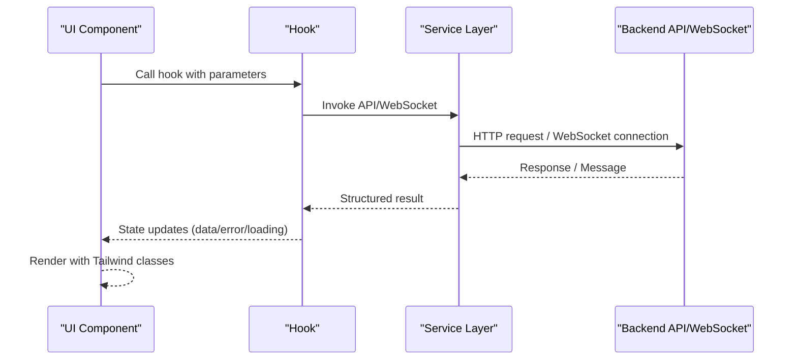

**Diagram sources**
- [usePolling.js:3-34](file://frontend/src/hooks/usePolling.js#L3-L34)
- [useSignalStream.js:20-67](file://frontend/src/hooks/useSignalStream.js#L20-L67)
- [api.js:78-131](file://frontend/src/services/api.js#L78-L131)
- [websocket.js:32-105](file://frontend/src/services/websocket.js#L32-L105)

## Detailed Component Analysis

### PriceChart
- Purpose: Interactive OHLCV chart with candlesticks and line visualization, range/timeframe selection, and hover details.
- Props:
  - defaultSymbol: Initial symbol (default: "AAPL")
  - compact: Controls chart height (boolean)
  - lockSymbol: Prevents symbol switching (boolean)
  - defaultRange: Initial range label (default: "1D")
- Behavior:
  - Maintains state for symbol, range, chart type, hover index, data, loading, last updated, error, and fallback usage.
  - Loads data via api.getOHLCV with a timeout race and falls back to mock data if empty or error occurs.
  - Normalizes OHLCV rows to a consistent structure and computes min/max price for scaling.
  - Renders either candlesticks or a line chart with gradient area fill.
  - Adds volume bars beneath the chart when present.
- Styling and responsiveness:
  - Uses Tailwind classes for borders, backgrounds, and text.
  - Responsive layout via flexbox and grid; SVG viewBox adapts to container.
- Integration examples:
  - Place inside a dashboard page and pass defaultSymbol and compact as needed.
  - Combine with MarketTicker for symbol selection.
- Best practices:
  - Prefer lockSymbol when embedding in fixed contexts.
  - Use compact for dense dashboards.
  - Handle error state gracefully with user messaging.

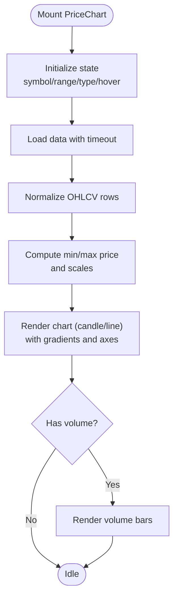

**Diagram sources**
- [PriceChart.jsx:95-126](file://frontend/src/components/PriceChart.jsx#L95-L126)
- [PriceChart.jsx:145-187](file://frontend/src/components/PriceChart.jsx#L145-L187)

**Section sources**
- [PriceChart.jsx:66-347](file://frontend/src/components/PriceChart.jsx#L66-L347)
- [api.js:94-98](file://frontend/src/services/api.js#L94-L98)
- [marketCatalog.js:133-133](file://frontend/src/data/marketCatalog.js#L133-L133)

### AnalyticsChart
- Purpose: Deterministic equity curve visualization for demonstration or analytics dashboards.
- Props: None (uses mock data).
- Behavior:
  - Builds a path from mock price history and renders a gradient-filled line with y-axis ticks and a tooltip.
  - Computes total return and color based on performance.
- Styling and responsiveness:
  - Uses monospace fonts and Tailwind utilities for layout and colors.
- Integration examples:
  - Embed in performance summaries or educational dashboards.
- Best practices:
  - Keep mock data deterministic for consistent visuals.
  - Use minimal interactivity for static analytics.

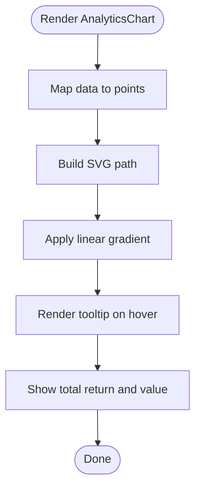

**Diagram sources**
- [AnalyticsChart.jsx:19-30](file://frontend/src/components/AnalyticsChart.jsx#L19-L30)
- [AnalyticsChart.jsx:53-104](file://frontend/src/components/AnalyticsChart.jsx#L53-L104)

**Section sources**
- [AnalyticsChart.jsx:7-122](file://frontend/src/components/AnalyticsChart.jsx#L7-L122)
- [api.js:141-164](file://frontend/src/services/api.js#L141-L164)

### CandlestickChart
- Purpose: Responsive candlestick chart with volume overlay and period selection.
- Props:
  - symbol: Default symbol (default: "AAPL")
  - height: Chart height in pixels (default: 320)
- Behavior:
  - Loads OHLCV data with timeout and fallback to mock data.
  - Normalizes series to a consistent structure and sorts by time.
  - Computes price and volume scales, candle widths, and y/x ticks.
  - Renders candles with wicks, bodies, and volume bars.
  - Supports live refresh for intraday periods.
- Styling and responsiveness:
  - Uses Tailwind for borders, backgrounds, and text.
  - Resizes dynamically with ResizeObserver and maintains aspect ratios.
- Integration examples:
  - Use in MarketDetail pages or watchlists.
- Best practices:
  - Adjust height for mobile and desktop layouts.
  - Consider disabling live refresh for longer periods.

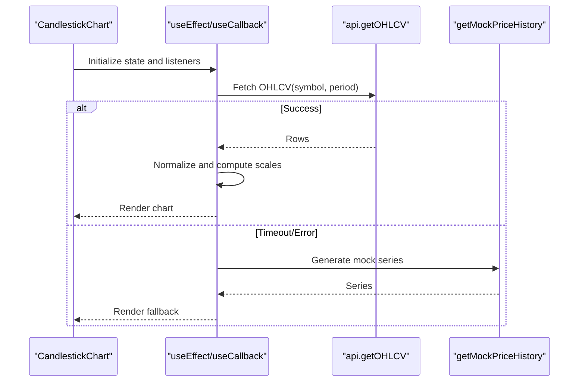

**Diagram sources**
- [CandlestickChart.jsx:52-87](file://frontend/src/components/CandlestickChart.jsx#L52-L87)
- [CandlestickChart.jsx:119-175](file://frontend/src/components/CandlestickChart.jsx#L119-L175)

**Section sources**
- [CandlestickChart.jsx:41-317](file://frontend/src/components/CandlestickChart.jsx#L41-L317)
- [api.js:94-98](file://frontend/src/services/api.js#L94-L98)
- [api.js:141-164](file://frontend/src/services/api.js#L141-L164)

### TradingViewChart
- Purpose: Embedded TradingView Advanced Chart widget with extensive customization and fallback handling.
- Props:
  - symbol: Default symbol (default: "AAPL")
  - theme: "dark" or "light" (default: "dark")
  - interval: Default timeframe (default: "D")
  - height: Container height (default: 600)
  - showToolbar, showSettings, hideSideToolbar: UI toggles
  - allowSymbolChange, enablePublishing, saveImage: Feature flags
- Behavior:
  - Dynamically injects TradingView script and config.
  - Observes DOM mutations to detect iframe load and sets loaded state.
  - Implements timeout and fallback UI; allows switching to legacy chart.
- Styling and responsiveness:
  - Rounded borders, dark/light theme matching design system.
- Integration examples:
  - Use in MarketDetail for advanced analysis.
- Best practices:
  - Monitor loading states and provide fallback messaging.
  - Disable unnecessary features to reduce bundle size.

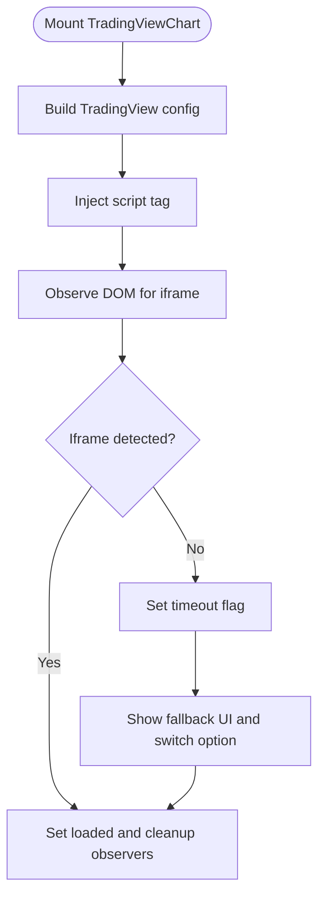

**Diagram sources**
- [TradingViewChart.jsx:54-135](file://frontend/src/components/TradingViewChart.jsx#L54-L135)
- [TradingViewChart.jsx:137-189](file://frontend/src/components/TradingViewChart.jsx#L137-L189)

**Section sources**
- [TradingViewChart.jsx:17-254](file://frontend/src/components/TradingViewChart.jsx#L17-L254)

### PortfolioCard
- Purpose: Live portfolio metrics with polling and position breakdown.
- Props: None.
- Behavior:
  - Polls api.getPortfolioMetrics every 8 seconds.
  - Formats P&L, cash, exposure, and Sharpe/volatility/max drawdown.
  - Displays positions as a grid with symbol, quantity, and value.
- Styling and responsiveness:
  - Uses Tailwind utilities for grid, borders, and typography.
- Integration examples:
  - Place in Dashboard or Portfolio pages.
- Best practices:
  - Use compact layouts for mobile.
  - Provide retry button on transient errors.

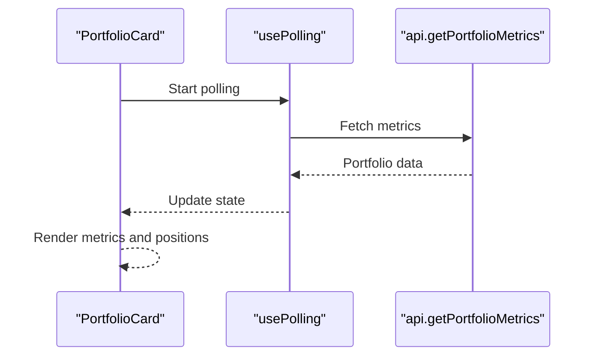

**Diagram sources**
- [PortfolioCard.jsx:21-23](file://frontend/src/components/PortfolioCard.jsx#L21-L23)
- [usePolling.js:3-34](file://frontend/src/hooks/usePolling.js#L3-L34)

**Section sources**
- [PortfolioCard.jsx:21-85](file://frontend/src/components/PortfolioCard.jsx#L21-L85)
- [usePolling.js:3-34](file://frontend/src/hooks/usePolling.js#L3-L34)
- [api.js:107-107](file://frontend/src/services/api.js#L107-L107)

### MiniSparkline
- Purpose: Lightweight trend indicator using SVG path.
- Props:
  - points: Array of numbers (default: deterministic series)
  - positive: Color choice (default: true -> green)
  - className: Additional Tailwind classes
- Behavior:
  - Computes min/max and maps values to SVG coordinates.
  - Renders a single path with rounded ends.
- Styling and responsiveness:
  - Uses preserveAspectRatio for scalable rendering.
- Integration examples:
  - Inline next to holdings or metrics.
- Best practices:
  - Keep points short and concise.
  - Use className to match surrounding color schemes.

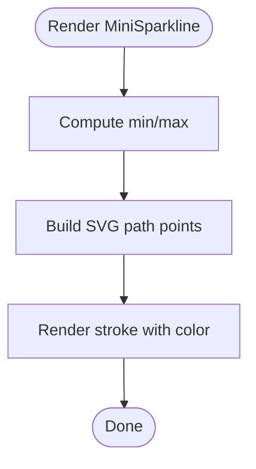

**Diagram sources**
- [MiniSparkline.jsx:1-21](file://frontend/src/components/MiniSparkline.jsx#L1-L21)

**Section sources**
- [MiniSparkline.jsx:1-21](file://frontend/src/components/MiniSparkline.jsx#L1-L21)

### SignalStream
- Purpose: Real-time signal feed with status indicators and merging logic.
- Props:
  - initialSymbol: Default symbol (default: "AAPL")
  - compact: Limits height for dense displays
  - hideSelector: Optional symbol selector
- Behavior:
  - Connects to WebSocket endpoint with exponential backoff.
  - Merges near-simultaneous messages within a 5-second window.
  - Displays status dots and labels; supports manual retry.
- Styling and responsiveness:
  - Monospace typography, status-aware colors, scrollable container.
- Integration examples:
  - Embed in MarketDetail or Alerts panels.
- Best practices:
  - Use hideSelector when symbol is controlled externally.
  - Provide retry UX for disconnected states.

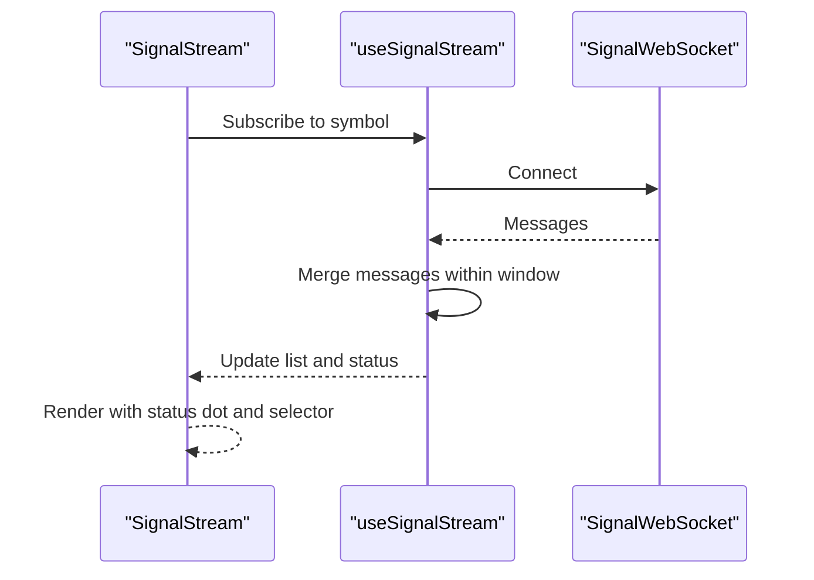

**Diagram sources**
- [SignalStream.jsx:29-37](file://frontend/src/components/SignalStream.jsx#L29-L37)
- [useSignalStream.js:20-67](file://frontend/src/hooks/useSignalStream.js#L20-L67)
- [websocket.js:32-105](file://frontend/src/services/websocket.js#L32-L105)

**Section sources**
- [SignalStream.jsx:29-110](file://frontend/src/components/SignalStream.jsx#L29-L110)
- [useSignalStream.js:20-67](file://frontend/src/hooks/useSignalStream.js#L20-L67)
- [websocket.js:32-105](file://frontend/src/services/websocket.js#L32-L105)

### AIDecisionExplorer
- Purpose: Interactive walkthrough of AI decision-making process with analogies and technical details.
- Props:
  - decisionData: Object containing steps (market_data, regime, signals, fusion, risk, decision).
- Behavior:
  - Renders step navigation with icons and titles.
  - Shows description, analogy, and technical details for the active step.
  - Provides previous/next controls.
- Styling and responsiveness:
  - Gradient header, scrollable navigation, and responsive layout.
- Integration examples:
  - Use alongside TradeExplanation for full decision transparency.
- Best practices:
  - Keep decisionData structured and optional to avoid rendering when missing.

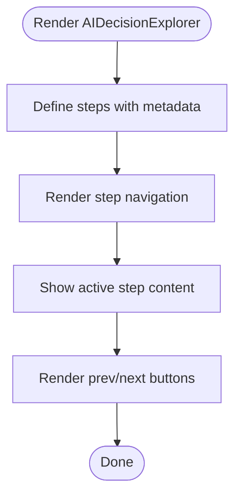

**Diagram sources**
- [AIDecisionExplorer.jsx:13-62](file://frontend/src/components/educational/AIDecisionExplorer.jsx#L13-L62)
- [AIDecisionExplorer.jsx:77-92](file://frontend/src/components/educational/AIDecisionExplorer.jsx#L77-L92)

**Section sources**
- [AIDecisionExplorer.jsx:8-150](file://frontend/src/components/educational/AIDecisionExplorer.jsx#L8-L150)

### TradeExplanation
- Purpose: Educational explanation of a trade’s rationale, concepts, risk, and “what-if” scenarios.
- Props:
  - trade: Trade object with direction, risk_level, stop_loss, expected_return, etc.
  - signalData: Contributing signals and concepts.
- Behavior:
  - Provides beginner-friendly explanations for concepts (RSI, trend, support/resistance, etc.).
  - Explains risk levels with analogies and color-coded blocks.
  - Presents “If this goes well/badly” scenarios with outcomes and lessons.
- Styling and responsiveness:
  - Uses Tailwind utilities for cards, grids, and typography.
- Integration examples:
  - Pair with AIDecisionExplorer for comprehensive education.
- Best practices:
  - Ensure trade and signalData are present before rendering.
  - Toggle advanced details with a show/hide button.

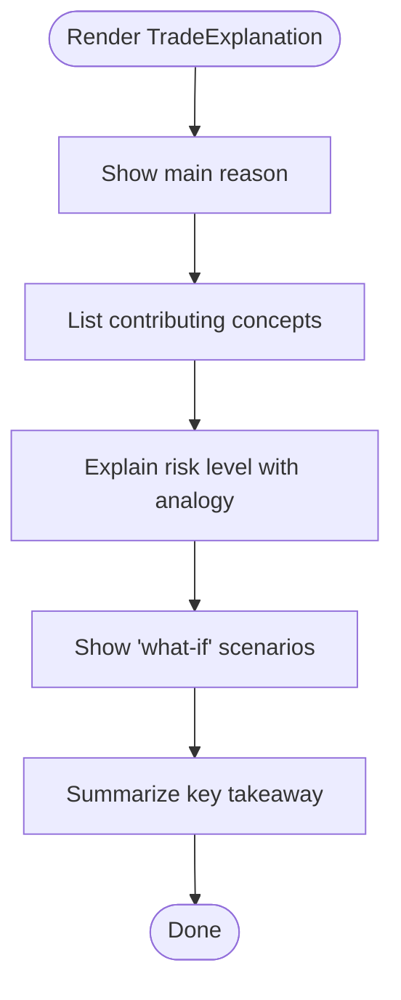

**Diagram sources**
- [TradeExplanation.jsx:14-67](file://frontend/src/components/educational/TradeExplanation.jsx#L14-L67)
- [TradeExplanation.jsx:152-182](file://frontend/src/components/educational/TradeExplanation.jsx#L152-L182)
- [TradeExplanation.jsx:184-225](file://frontend/src/components/educational/TradeExplanation.jsx#L184-L225)

**Section sources**
- [TradeExplanation.jsx:8-228](file://frontend/src/components/educational/TradeExplanation.jsx#L8-L228)

## Dependency Analysis
This section maps component dependencies and integration points.

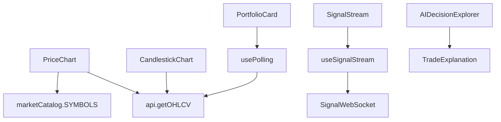

**Diagram sources**
- [PriceChart.jsx:1-4](file://frontend/src/components/PriceChart.jsx#L1-L4)
- [CandlestickChart.jsx:1-3](file://frontend/src/components/CandlestickChart.jsx#L1-L3)
- [PortfolioCard.jsx:2-3](file://frontend/src/components/PortfolioCard.jsx#L2-L3)
- [usePolling.js:1-3](file://frontend/src/hooks/usePolling.js#L1-L3)
- [useSignalStream.js:1-2](file://frontend/src/hooks/useSignalStream.js#L1-L2)
- [websocket.js:32-39](file://frontend/src/services/websocket.js#L32-L39)

**Section sources**
- [PriceChart.jsx:1-4](file://frontend/src/components/PriceChart.jsx#L1-L4)
- [CandlestickChart.jsx:1-3](file://frontend/src/components/CandlestickChart.jsx#L1-L3)
- [PortfolioCard.jsx:2-3](file://frontend/src/components/PortfolioCard.jsx#L2-L3)
- [usePolling.js:1-3](file://frontend/src/hooks/usePolling.js#L1-L3)
- [useSignalStream.js:1-2](file://frontend/src/hooks/useSignalStream.js#L1-L2)
- [websocket.js:32-39](file://frontend/src/services/websocket.js#L32-L39)

## Performance Considerations
- Chart rendering:
  - PriceChart and CandlestickChart compute scales and paths on each render; memoize heavy computations via useMemo where appropriate.
  - Limit hover interactions to visible segments to reduce DOM overhead.
- Data fetching:
  - Use timeouts and fallbacks to avoid blocking renders (already implemented).
  - Debounce symbol changes and range switches to prevent rapid reloads.
- Real-time streams:
  - SignalStream merges near-simultaneous messages to reduce re-renders.
  - Consider throttling message updates if the stream is very high-frequency.
- Rendering:
  - Prefer SVG-based charts for crispness and scalability.
  - Use lazy loading for TradingViewChart to improve initial load performance.

[No sources needed since this section provides general guidance]

## Troubleshooting Guide
- PriceChart and CandlestickChart:
  - If data appears empty, confirm fallback is triggered and error message is displayed.
  - Verify symbol availability in marketCatalog and that api.getOHLCV returns expected shape.
- TradingViewChart:
  - If loading takes too long, check timeout and fallback UI; offer manual switch to legacy chart.
  - Ensure theme and interval props are valid.
- PortfolioCard:
  - On transient errors, use the retry button; persistent errors indicate backend issues.
  - Confirm authentication token is present for protected endpoints.
- SignalStream:
  - If disconnected, use the retry button; check WS_BASE resolution and network connectivity.
  - Messages may merge if received within the 5-second window.

**Section sources**
- [PriceChart.jsx:95-126](file://frontend/src/components/PriceChart.jsx#L95-L126)
- [CandlestickChart.jsx:52-87](file://frontend/src/components/CandlestickChart.jsx#L52-L87)
- [TradingViewChart.jsx:153-172](file://frontend/src/components/TradingViewChart.jsx#L153-L172)
- [PortfolioCard.jsx:29-39](file://frontend/src/components/PortfolioCard.jsx#L29-L39)
- [SignalStream.jsx:34-50](file://frontend/src/components/SignalStream.jsx#L34-L50)
- [websocket.js:50-88](file://frontend/src/services/websocket.js#L50-L88)

## Conclusion
The UI components library provides a cohesive set of reusable, data-driven components for charting, portfolio display, real-time signals, and education. They follow consistent styling patterns with TailwindCSS, implement robust data fetching and error handling, and support responsive layouts. By adhering to the composition patterns and best practices outlined here, developers can extend and integrate components effectively while maintaining a consistent user experience.

[No sources needed since this section summarizes without analyzing specific files]

## Appendices

### Styling Patterns and TailwindCSS
- Color palette and typography are centralized in the design system for consistency.
- Components use border, background, and text utilities aligned with the design tokens.
- Responsive utilities adapt layouts across breakpoints.

**Section sources**
- [designSystem.js:11-258](file://frontend/src/styles/designSystem.js#L11-L258)

### Component Composition Patterns
- Hooks encapsulate cross-cutting concerns (polling, WebSocket handling).
- Services abstract API and WebSocket interactions.
- Educational components complement each other to provide end-to-end learning.

**Section sources**
- [usePolling.js:3-34](file://frontend/src/hooks/usePolling.js#L3-L34)
- [useSignalStream.js:20-67](file://frontend/src/hooks/useSignalStream.js#L20-L67)
- [api.js:78-131](file://frontend/src/services/api.js#L78-L131)
- [websocket.js:32-105](file://frontend/src/services/websocket.js#L32-L105)