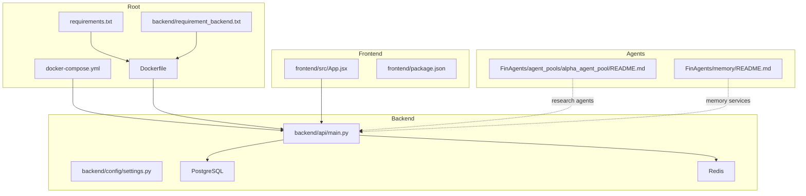
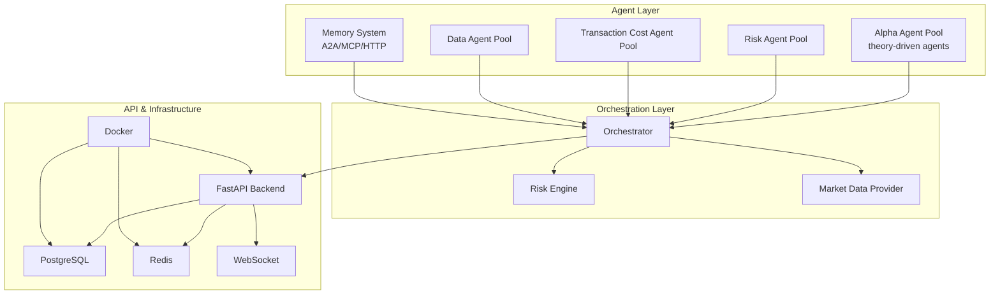

# Getting Started

<cite>
**Referenced Files in This Document**
- [README.md](file://README.md)
- [docker-compose.yml](file://docker-compose.yml)
- [Dockerfile](file://Dockerfile)
- [requirements.txt](file://requirements.txt)
- [backend/requirement_backend.txt](file://backend/requirement_backend.txt)
- [backend/config/settings.py](file://backend/config/settings.py)
- [backend/api/main.py](file://backend/api/main.py)
- [backend/routes/health.py](file://backend/routes/health.py)
- [backend/db/models/user.py](file://backend/db/models/user.py)
- [frontend/src/App.jsx](file://frontend/src/App.jsx)
- [frontend/package.json](file://frontend/package.json)
- [FinAgents/agent_pools/alpha_agent_pool/README.md](file://FinAgents/agent_pools/alpha_agent_pool/README.md)
- [FinAgents/memory/README.md](file://FinAgents/memory/README.md)
</cite>

## Table of Contents
1. [Introduction](#introduction)
2. [Project Structure](#project-structure)
3. [Prerequisites](#prerequisites)
4. [Installation](#installation)
5. [Quick Start](#quick-start)
6. [Basic Usage Examples](#basic-usage-examples)
7. [Architecture Overview](#architecture-overview)
8. [Key Components](#key-components)
9. [Troubleshooting Guide](#troubleshooting-guide)
10. [Additional Resources](#additional-resources)
11. [Conclusion](#conclusion)

## Introduction
This guide helps you set up and run the Agentic Trading Application, a production-grade multi-agent trading platform that extends the AgenticTrading research framework into a deployable system. It provides real-time APIs, streaming infrastructure, analytics, backtesting, and a React dashboard, orchestrated by intelligent agents.

The system exposes:
- REST APIs and WebSocket streams for real-time signals
- A PostgreSQL-backed backend with Redis caching
- A React frontend dashboard
- Dockerized deployment for easy local and cloud runs

**Section sources**
- [README.md:1-335](file://README.md#L1-L335)

## Project Structure
At a high level, the repository is organized into:
- backend: FastAPI application, routes, services, database models, and configuration
- frontend: React-based dashboard with routing and UI components
- FinAgents: Multi-agent pools and memory systems for research-grade agent orchestration
- Root configuration: Dockerfiles, docker-compose, requirements, and top-level scripts

**Diagram sources**
- [docker-compose.yml:1-166](file://docker-compose.yml#L1-L166)
- [Dockerfile:1-110](file://Dockerfile#L1-L110)
- [requirements.txt:1-17](file://requirements.txt#L1-L17)
- [backend/requirement_backend.txt:1-15](file://backend/requirement_backend.txt#L1-L15)
- [backend/api/main.py:1-148](file://backend/api/main.py#L1-L148)
- [backend/config/settings.py:1-85](file://backend/config/settings.py#L1-L85)
- [frontend/src/App.jsx:1-81](file://frontend/src/App.jsx#L1-L81)
- [frontend/package.json:1-28](file://frontend/package.json#L1-L28)
- [FinAgents/agent_pools/alpha_agent_pool/README.md:1-204](file://FinAgents/agent_pools/alpha_agent_pool/README.md#L1-L204)
- [FinAgents/memory/README.md:1-378](file://FinAgents/memory/README.md#L1-L378)

**Section sources**
- [README.md:252-278](file://README.md#L252-L278)
- [docker-compose.yml:1-166](file://docker-compose.yml#L1-L166)
- [Dockerfile:1-110](file://Dockerfile#L1-L110)

## Prerequisites
Install these prerequisites before proceeding:
- Python 3.8+ (for local development and agent components)
- Node.js (for building and running the frontend)
- Docker and Docker Compose (for containerized deployment)
- Git (to clone the repository)

Notes:
- The backend uses Python 3.11 in the production Docker image.
- The frontend uses Node.js as defined in the frontend package configuration.

**Section sources**
- [FinAgents/agent_pools/alpha_agent_pool/README.md:73-77](file://FinAgents/agent_pools/alpha_agent_pool/README.md#L73-L77)
- [frontend/package.json:1-28](file://frontend/package.json#L1-L28)
- [Dockerfile:26](file://Dockerfile#L26)

## Installation
Follow these steps to install and run the system using Docker Compose:

1. Clone the repository
   - git clone https://github.com/Anshgulati090/Agentic-Trading-Application.git
   - cd Agentic-Trading-Application

2. Start services with Docker Compose
   - docker-compose up --build

What this does:
- Builds the backend image (including Python dependencies) and frontend assets
- Starts PostgreSQL, Redis, the API app, optional Prometheus/Grafana, and optionally the frontend
- Exposes ports:
  - Backend API: 8000
  - Prometheus: 9090
  - Frontend: 3000 (when served by the dedicated frontend service)

Volumes created:
- ./logs, ./data, ./models mounted inside the app container for persistent storage

Health checks:
- The app exposes a health endpoint checked by Docker Compose
- PostgreSQL and Redis health checks are configured in the compose file

**Section sources**
- [README.md:281-300](file://README.md#L281-L300)
- [docker-compose.yml:7-43](file://docker-compose.yml#L7-L43)
- [docker-compose.yml:47-87](file://docker-compose.yml#L47-L87)
- [docker-compose.yml:108-145](file://docker-compose.yml#L108-L145)
- [Dockerfile:53-84](file://Dockerfile#L53-L84)

## Quick Start
After running docker-compose up --build, access the system components:

- Backend API documentation
  - http://localhost:8000/docs

- Frontend dashboard
  - http://localhost:3000

- Health check
  - GET http://localhost:8000/health

- Root endpoint
  - GET http://localhost:8000/

Optional monitoring:
- Prometheus metrics: http://localhost:9090
- Grafana dashboard: http://localhost:3001 (admin/admin123)

Initial database setup:
- On first run, the backend creates database tables and seeds a demo user account for testing.

**Section sources**
- [README.md:293-300](file://README.md#L293-L300)
- [backend/api/main.py:141-148](file://backend/api/main.py#L141-L148)
- [backend/routes/health.py:6-9](file://backend/routes/health.py#L6-L9)
- [backend/api/main.py:102-109](file://backend/api/main.py#L102-L109)

## Basic Usage Examples
Below are practical examples to get you started quickly. Replace placeholders with your values and ensure the system is running.

- Get API documentation
  - Visit http://localhost:8000/docs to explore endpoints and test requests in the browser.

- Check system health
  - GET http://localhost:8000/health

- Fetch market price for a symbol
  - GET http://localhost:8000/market/price/{symbol}

- Get portfolio metrics
  - GET http://localhost:8000/portfolio/metrics

- Execute an agent action
  - POST http://localhost:8000/agents/execute

- Subscribe to real-time signals via WebSocket
  - Connect to ws://localhost:8000/ws/signals/{symbol}
  - Example: ws://localhost:8000/ws/signals/AAPL

- Backtesting
  - POST http://localhost:8000/backtest
  - GET http://localhost:8000/backtest/{id}

Notes:
- These endpoints are defined in the backend API and exposed through FastAPI routers.
- The frontend routes integrate with these endpoints to power the dashboard.

**Section sources**
- [README.md:216-250](file://README.md#L216-L250)
- [backend/api/main.py:126-138](file://backend/api/main.py#L126-L138)

## Architecture Overview
The system is composed of three layers:

- Agent Layer
  - Autonomous agents for signal generation, risk management, execution, and portfolio tasks.
  - Includes research-grade agent pools and memory coordination.

- Orchestration Layer
  - Manages agent registration, strategy orchestration, signal validation, risk enforcement, and trade execution.
  - Integrates with market data providers and risk engines.

- API & Infrastructure Layer
  - REST APIs and WebSocket streams powered by FastAPI.
  - PostgreSQL for persistence, Redis for caching and streaming, and Docker for deployment.

**Diagram sources**
- [README.md:52-124](file://README.md#L52-L124)
- [backend/api/main.py:111-138](file://backend/api/main.py#L111-L138)
- [FinAgents/agent_pools/alpha_agent_pool/README.md:32-70](file://FinAgents/agent_pools/alpha_agent_pool/README.md#L32-L70)
- [FinAgents/memory/README.md:25-76](file://FinAgents/memory/README.md#L25-L76)

**Section sources**
- [README.md:52-124](file://README.md#L52-L124)

## Key Components
Explore these core components to understand how the system works:

- Backend API (FastAPI)
  - Entry point initializes routes for auth, signals, portfolio, market, agents, learning, research, and health.
  - Includes CORS middleware and database table creation on startup.
  - Health endpoint confirms service readiness.

- Configuration (Settings)
  - Centralized settings loaded from environment variables and .env.
  - Includes database, Redis, API host/port, CORS origins, market provider settings, and demo defaults.

- Database Models
  - User, DemoAccount, DemoPosition, DemoTrade models define the schema for user accounts and demo trading records.

- Frontend (React)
  - Routing and layout integrate with backend endpoints to power the dashboard, markets, portfolio, agents, and learning pages.

- Agent Systems (FinAgents)
  - Alpha Agent Pool: Academic alpha research, strategy configuration, backtesting, and memory coordination.
  - Memory System: HTTP REST, MCP, and A2A servers with unified interface and Neo4j-backed storage.

**Section sources**
- [backend/api/main.py:1-148](file://backend/api/main.py#L1-L148)
- [backend/config/settings.py:1-85](file://backend/config/settings.py#L1-L85)
- [backend/db/models/user.py:1-76](file://backend/db/models/user.py#L1-L76)
- [frontend/src/App.jsx:1-81](file://frontend/src/App.jsx#L1-L81)
- [FinAgents/agent_pools/alpha_agent_pool/README.md:1-204](file://FinAgents/agent_pools/alpha_agent_pool/README.md#L1-L204)
- [FinAgents/memory/README.md:1-378](file://FinAgents/memory/README.md#L1-L378)

## Troubleshooting Guide
Common setup issues and resolutions:

- Ports already in use
  - The app binds to 8000, Prometheus to 9090, and the frontend to 3000.
  - Stop conflicting services or adjust port mappings in docker-compose.yml.

- Database not ready
  - PostgreSQL health check requires the service to be healthy before the app starts.
  - Check the db container logs and confirm credentials match settings.

- Redis connectivity
  - Redis is required for caching and streaming.
  - Verify the redis service is healthy and reachable from the app container.

- CORS errors in the browser
  - Ensure frontend origin (localhost:3000) is included in CORS_ORIGINS.
  - The backend loads CORS origins from settings and applies them at startup.

- Missing environment variables
  - The backend reads from .env via pydantic-settings.
  - Confirm required keys like DATABASE_URL and REDIS_URL are present.

- Frontend not loading
  - The frontend is served on port 3000 when the dedicated frontend service is enabled.
  - If building locally, ensure Node.js dependencies are installed and the build succeeds.

- Agent memory services
  - The Alpha Agent Pool and Memory System require ports 8000–8002 for HTTP/MCP/A2A.
  - Start the memory system independently if integrating agent components.

- Initial user seeding
  - On first run, the backend seeds a demo user and account.
  - If login fails, verify the demo user exists and is verified.

**Section sources**
- [docker-compose.yml:13-34](file://docker-compose.yml#L13-L34)
- [docker-compose.yml:60-65](file://docker-compose.yml#L60-L65)
- [docker-compose.yml:80-85](file://docker-compose.yml#L80-L85)
- [backend/config/settings.py:36-39](file://backend/config/settings.py#L36-L39)
- [backend/api/main.py:102-109](file://backend/api/main.py#L102-L109)
- [FinAgents/memory/README.md:305-324](file://FinAgents/memory/README.md#L305-L324)

## Additional Resources
- Explore the Alpha Agent Pool for research-grade alpha strategy development and memory coordination.
- Review the Memory System documentation for HTTP/MCP/A2A protocols and Neo4j-backed storage.
- Consult the backend API documentation at /docs after starting the system.

**Section sources**
- [FinAgents/agent_pools/alpha_agent_pool/README.md:1-204](file://FinAgents/agent_pools/alpha_agent_pool/README.md#L1-L204)
- [FinAgents/memory/README.md:1-378](file://FinAgents/memory/README.md#L1-L378)
- [README.md:293-295](file://README.md#L293-L295)

## Conclusion
You now have the essentials to install, run, and interact with the Agentic Trading Application. Use the backend API endpoints and WebSocket streams to integrate trading logic, and leverage the React dashboard for visualization. For advanced agent workflows, explore the Alpha Agent Pool and Memory System documentation.

[No sources needed since this section summarizes without analyzing specific files]