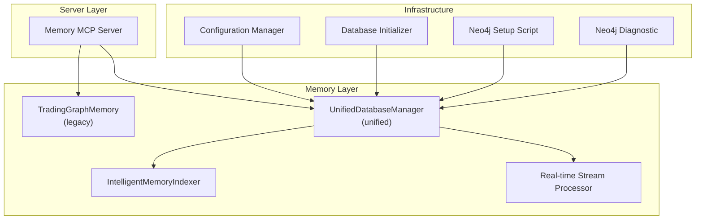
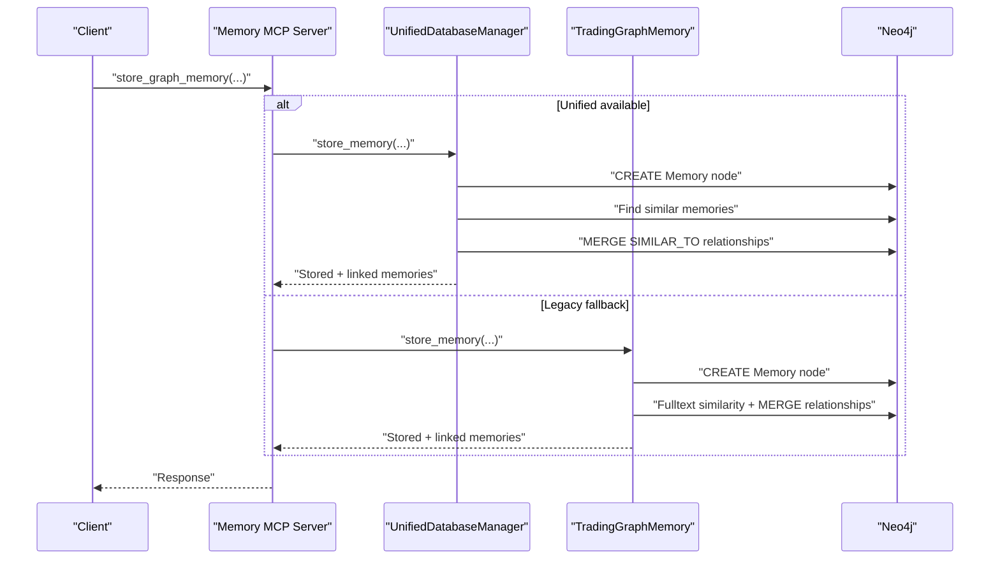
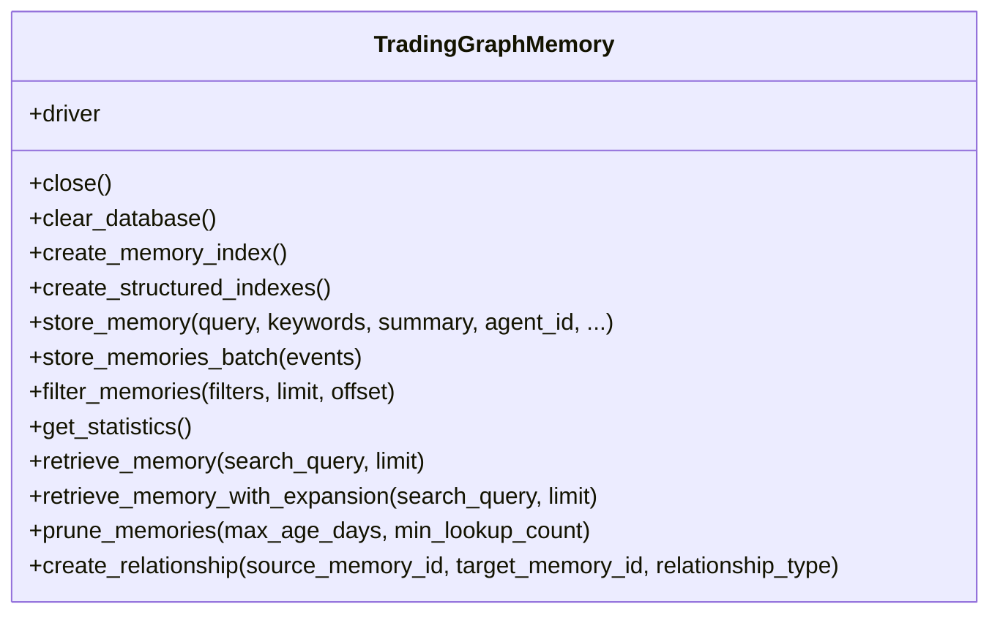
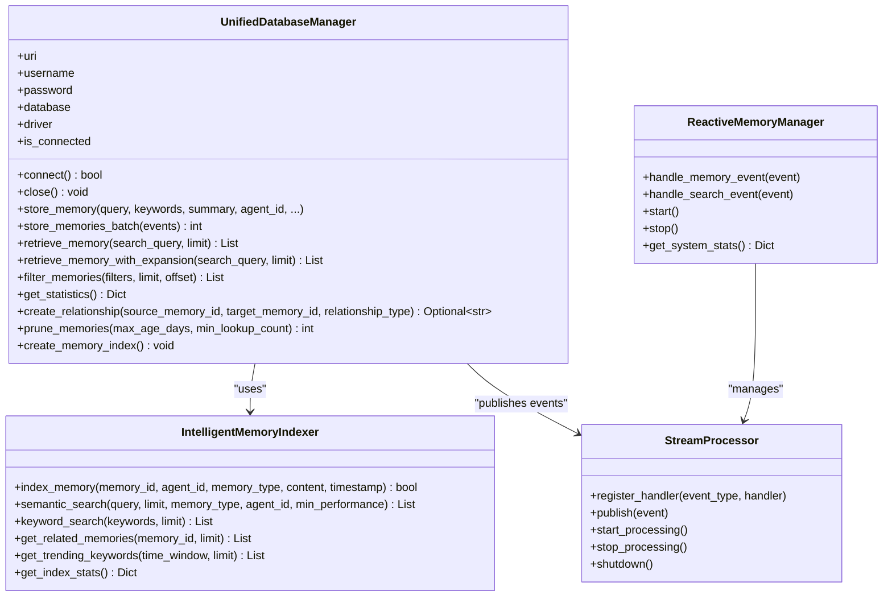
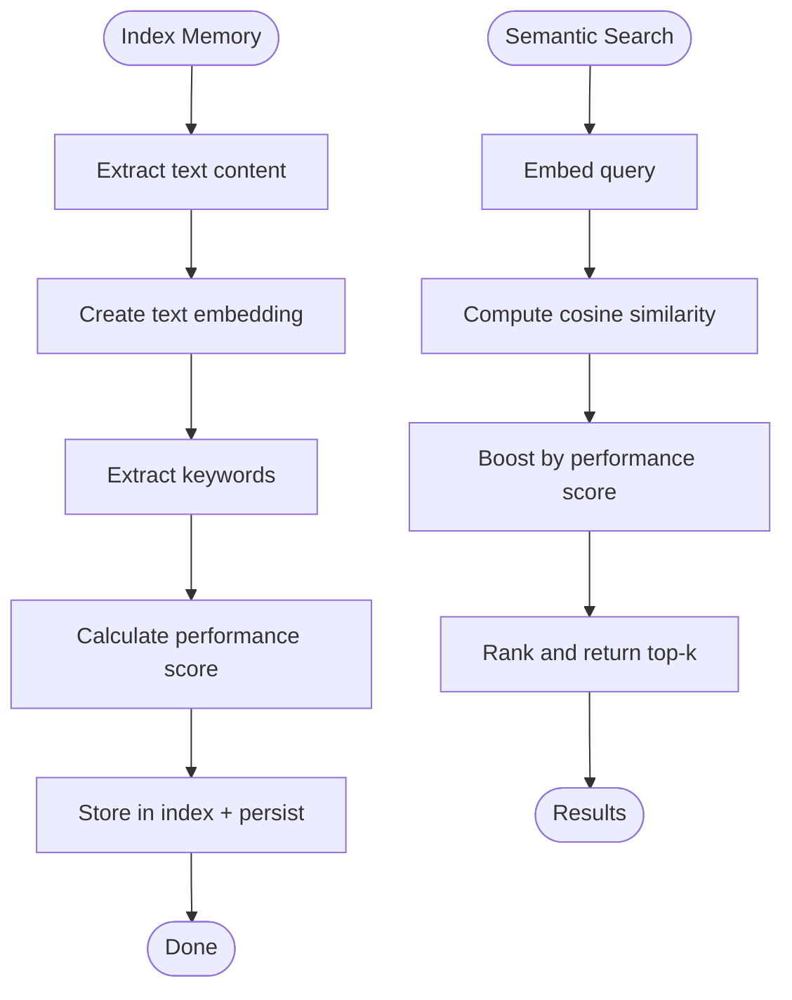
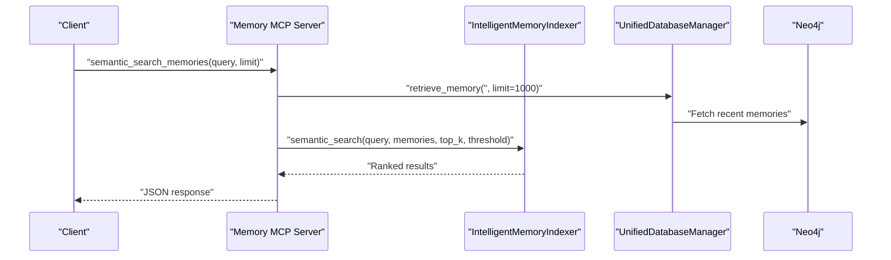
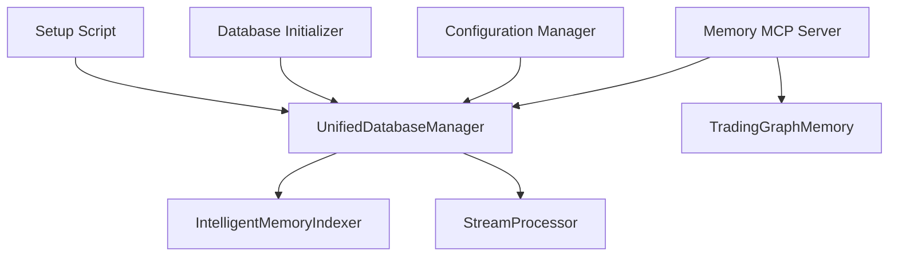

# Graph Database Operations

<cite>
**Referenced Files in This Document**
- [database.py](file://FinAgents/memory/database.py)
- [unified_database_manager.py](file://FinAgents/memory/unified_database_manager.py)
- [memory_server.py](file://FinAgents/memory/memory_server.py)
- [database_initializer.py](file://FinAgents/memory/database_initializer.py)
- [intelligent_memory_indexer.py](file://FinAgents/memory/intelligent_memory_indexer.py)
- [configuration_manager.py](file://FinAgents/memory/configuration_manager.py)
- [setup_neo4j.py](file://scripts/setup_neo4j.py)
- [neo4j_diagnostic.py](file://FinAgents/memory/tests/neo4j_diagnostic.py)
- [realtime_stream_processor.py](file://FinAgents/memory/realtime_stream_processor.py)
</cite>

## Table of Contents
1. [Introduction](#introduction)
2. [Project Structure](#project-structure)
3. [Core Components](#core-components)
4. [Architecture Overview](#architecture-overview)
5. [Detailed Component Analysis](#detailed-component-analysis)
6. [Dependency Analysis](#dependency-analysis)
7. [Performance Considerations](#performance-considerations)
8. [Troubleshooting Guide](#troubleshooting-guide)
9. [Conclusion](#conclusion)

## Introduction
This document explains graph database operations powered by Neo4j as the core memory storage for FinAgent’s memory system. It focuses on the TradingGraphMemory class, the unified database manager, connection management, schema design, and the full spectrum of memory operations including storage, retrieval, filtering, analytics, and maintenance. It also covers advanced features such as full-text search, semantic search, relationship expansion, and real-time streaming.

## Project Structure
The memory subsystem is organized around:
- A legacy TradingGraphMemory class for backward compatibility
- A unified database manager that centralizes operations and adds intelligent features
- An MCP server exposing standardized tools for memory operations
- Supporting modules for intelligent indexing, configuration, initialization, and diagnostics

**Diagram sources**
- [memory_server.py:82-204](file://FinAgents/memory/memory_server.py#L82-L204)
- [unified_database_manager.py:104-228](file://FinAgents/memory/unified_database_manager.py#L104-L228)
- [database.py:12-38](file://FinAgents/memory/database.py#L12-L38)
- [intelligent_memory_indexer.py:40-81](file://FinAgents/memory/intelligent_memory_indexer.py#L40-L81)
- [realtime_stream_processor.py:344-470](file://FinAgents/memory/realtime_stream_processor.py#L344-L470)
- [configuration_manager.py:235-424](file://FinAgents/memory/configuration_manager.py#L235-L424)
- [database_initializer.py:64-134](file://FinAgents/memory/database_initializer.py#L64-L134)
- [setup_neo4j.py:52-118](file://scripts/setup_neo4j.py#L52-L118)
- [neo4j_diagnostic.py:9-82](file://FinAgents/memory/tests/neo4j_diagnostic.py#L9-L82)

**Section sources**
- [memory_server.py:82-204](file://FinAgents/memory/memory_server.py#L82-L204)
- [unified_database_manager.py:104-228](file://FinAgents/memory/unified_database_manager.py#L104-L228)
- [database.py:12-38](file://FinAgents/memory/database.py#L12-L38)
- [intelligent_memory_indexer.py:40-81](file://FinAgents/memory/intelligent_memory_indexer.py#L40-L81)
- [realtime_stream_processor.py:344-470](file://FinAgents/memory/realtime_stream_processor.py#L344-L470)
- [configuration_manager.py:235-424](file://FinAgents/memory/configuration_manager.py#L235-L424)
- [database_initializer.py:64-134](file://FinAgents/memory/database_initializer.py#L64-L134)
- [setup_neo4j.py:52-118](file://scripts/setup_neo4j.py#L52-L118)
- [neo4j_diagnostic.py:9-82](file://FinAgents/memory/tests/neo4j_diagnostic.py#L9-L82)

## Core Components
- TradingGraphMemory: Legacy class providing async Neo4j operations, full-text indexing, structured property indexes, memory storage and retrieval, filtering, statistics, pruning, and relationship creation.
- UnifiedDatabaseManager: New centralized manager offering enhanced features including intelligent indexing, semantic search, real-time streaming, batch operations, and robust statistics.
- IntelligentMemoryIndexer: Adds semantic search via embeddings and keyword extraction, with performance-aware ranking.
- Real-time Stream Processor: Enables reactive analytics and event broadcasting for memory operations.
- Memory MCP Server: Exposes standardized tools for storage, retrieval, filtering, statistics, expansion, semantic search, and maintenance.
- Configuration Manager: Manages environment-specific settings for databases, servers, memory, and initialization.
- Database Initializer and Setup Scripts: Automate schema creation, constraints, indexes, and health checks.

**Section sources**
- [database.py:12-353](file://FinAgents/memory/database.py#L12-L353)
- [unified_database_manager.py:104-1085](file://FinAgents/memory/unified_database_manager.py#L104-L1085)
- [intelligent_memory_indexer.py:40-507](file://FinAgents/memory/intelligent_memory_indexer.py#L40-L507)
- [memory_server.py:220-885](file://FinAgents/memory/memory_server.py#L220-L885)
- [configuration_manager.py:235-672](file://FinAgents/memory/configuration_manager.py#L235-L672)
- [database_initializer.py:64-448](file://FinAgents/memory/database_initializer.py#L64-L448)
- [setup_neo4j.py:52-445](file://scripts/setup_neo4j.py#L52-L445)

## Architecture Overview
The system supports both legacy and unified architectures. The MCP server attempts unified operations first, falling back to legacy when needed. Unified operations integrate intelligent indexing and optional real-time streaming.

**Diagram sources**
- [memory_server.py:220-308](file://FinAgents/memory/memory_server.py#L220-L308)
- [unified_database_manager.py:233-353](file://FinAgents/memory/unified_database_manager.py#L233-L353)
- [database.py:49-113](file://FinAgents/memory/database.py#L49-L113)

**Section sources**
- [memory_server.py:220-308](file://FinAgents/memory/memory_server.py#L220-L308)
- [unified_database_manager.py:233-353](file://FinAgents/memory/unified_database_manager.py#L233-L353)
- [database.py:49-113](file://FinAgents/memory/database.py#L49-L113)

## Detailed Component Analysis

### TradingGraphMemory (Legacy)
Key responsibilities:
- Connection management with async driver
- Full-text index creation for memory summaries and keywords
- Structured property indexes for event types, log levels, session IDs, and agent IDs
- Single and batch memory storage with similarity detection and relationship creation
- Filtering by time range, event types, log levels, session ID, and agent ID
- Statistics aggregation by memory type and log level
- Retrieval with full-text search and lookup count updates
- Expansion retrieval leveraging SIMILAR_TO relationships
- Pruning of old or low-lookup memories with protection of important clusters
- Relationship creation with validation

**Diagram sources**
- [database.py:12-353](file://FinAgents/memory/database.py#L12-L353)

**Section sources**
- [database.py:12-353](file://FinAgents/memory/database.py#L12-L353)

### UnifiedDatabaseManager (New)
Key responsibilities:
- Centralized connection management with health checks and optimized settings
- Enhanced memory storage with intelligent linking and optional semantic indexing
- Batch storage with validation and automatic agent relationship creation
- Retrieval with intelligent search fallback and semantic ranking
- Relationship management with validated relationship types
- Filtering with dynamic WHERE clauses and pagination
- Comprehensive statistics including memory types, agent activity, and indexer/stream availability
- Maintenance operations including pruning with cluster protection
- Factory compatibility with TradingGraphMemory for seamless migration

**Diagram sources**
- [unified_database_manager.py:104-1085](file://FinAgents/memory/unified_database_manager.py#L104-L1085)
- [intelligent_memory_indexer.py:40-507](file://FinAgents/memory/intelligent_memory_indexer.py#L40-L507)
- [realtime_stream_processor.py:344-470](file://FinAgents/memory/realtime_stream_processor.py#L344-L470)

**Section sources**
- [unified_database_manager.py:104-1085](file://FinAgents/memory/unified_database_manager.py#L104-L1085)
- [intelligent_memory_indexer.py:40-507](file://FinAgents/memory/intelligent_memory_indexer.py#L40-L507)
- [realtime_stream_processor.py:344-470](file://FinAgents/memory/realtime_stream_processor.py#L344-L470)

### IntelligentMemoryIndexer
Capabilities:
- Embedding generation using transformer models or TF-IDF fallback
- Keyword extraction and performance-aware scoring
- Semantic search with similarity boosting by performance
- Keyword-based search and related memory discovery
- Trending keyword extraction over time windows
- Persistent index storage and statistics

**Diagram sources**
- [intelligent_memory_indexer.py:186-307](file://FinAgents/memory/intelligent_memory_indexer.py#L186-L307)

**Section sources**
- [intelligent_memory_indexer.py:40-507](file://FinAgents/memory/intelligent_memory_indexer.py#L40-L507)

### Memory MCP Server Tools
The server exposes standardized tools for:
- Storing single or batch memories with unified or legacy fallback
- Retrieving memories with full-text search or expansion
- Filtering memories with dynamic criteria
- Getting comprehensive statistics
- Performing semantic search and extracting trending keywords
- Pruning old memories and publishing events to the stream processor

**Diagram sources**
- [memory_server.py:594-675](file://FinAgents/memory/memory_server.py#L594-L675)
- [unified_database_manager.py:403-474](file://FinAgents/memory/unified_database_manager.py#L403-L474)
- [intelligent_memory_indexer.py:256-307](file://FinAgents/memory/intelligent_memory_indexer.py#L256-L307)

**Section sources**
- [memory_server.py:220-885](file://FinAgents/memory/memory_server.py#L220-L885)
- [unified_database_manager.py:403-474](file://FinAgents/memory/unified_database_manager.py#L403-L474)
- [intelligent_memory_indexer.py:256-307](file://FinAgents/memory/intelligent_memory_indexer.py#L256-L307)

## Dependency Analysis
- UnifiedDatabaseManager depends on Neo4j driver, optional IntelligentMemoryIndexer, and optional StreamProcessor.
- Memory MCP Server conditionally uses UnifiedDatabaseManager or falls back to TradingGraphMemory.
- Configuration Manager supplies environment-specific settings for database URIs, credentials, and initialization parameters.
- Database Initializer and Setup Script coordinate schema creation, constraints, indexes, and health verification.

**Diagram sources**
- [memory_server.py:36-57](file://FinAgents/memory/memory_server.py#L36-L57)
- [unified_database_manager.py:32-52](file://FinAgents/memory/unified_database_manager.py#L32-L52)
- [configuration_manager.py:235-424](file://FinAgents/memory/configuration_manager.py#L235-L424)
- [database_initializer.py:28-47](file://FinAgents/memory/database_initializer.py#L28-L47)
- [setup_neo4j.py:36-43](file://scripts/setup_neo4j.py#L36-L43)

**Section sources**
- [memory_server.py:36-57](file://FinAgents/memory/memory_server.py#L36-L57)
- [unified_database_manager.py:32-52](file://FinAgents/memory/unified_database_manager.py#L32-L52)
- [configuration_manager.py:235-424](file://FinAgents/memory/configuration_manager.py#L235-L424)
- [database_initializer.py:28-47](file://FinAgents/memory/database_initializer.py#L28-L47)
- [setup_neo4j.py:36-43](file://scripts/setup_neo4j.py#L36-L43)

## Performance Considerations
- Connection pooling and timeouts: UnifiedDatabaseManager configures max connection pool size and acquisition timeout for scalability.
- Indexing strategy: Full-text indexes on content and summary; btree indexes on frequently filtered properties; uniqueness constraints for identity fields.
- Batch operations: store_memories_batch reduces round-trips for high-throughput ingestion.
- Semantic search: IntelligentMemoryIndexer caches embeddings and supports performance-aware ranking to reduce database load.
- Pruning: prune_memories protects important clusters while cleaning old or low-value memories.
- Streaming: Real-time stream processor decouples event processing from request handling.

[No sources needed since this section provides general guidance]

## Troubleshooting Guide
Common issues and resolutions:
- Connection failures: Use the diagnostic script to test multiple configurations and verify Neo4j service availability.
- Authentication errors: Confirm username/password and database name; reset password via Neo4j tools if needed.
- Schema initialization: Run the setup script to create indexes, constraints, and sample data; verify health afterward.
- Missing intelligent features: Install sentence-transformers for semantic search or TF-IDF fallback; ensure optional components are available.

**Section sources**
- [neo4j_diagnostic.py:9-82](file://FinAgents/memory/tests/neo4j_diagnostic.py#L9-L82)
- [setup_neo4j.py:340-445](file://scripts/setup_neo4j.py#L340-L445)
- [database_initializer.py:88-134](file://FinAgents/memory/database_initializer.py#L88-L134)

## Conclusion
The FinAgent memory system combines a robust legacy TradingGraphMemory with a modern UnifiedDatabaseManager to deliver scalable, intelligent graph operations. With full-text and semantic search, relationship expansion, filtering, analytics, and real-time streaming, it supports complex trading memory workflows. The MCP server provides a standardized interface, while configuration, initialization, and diagnostics streamline deployment and maintenance.