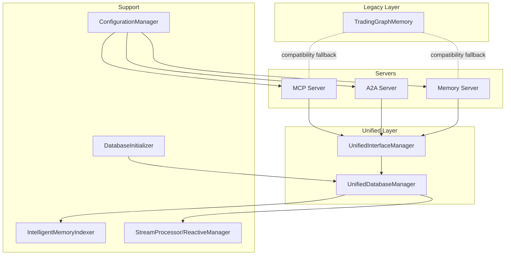
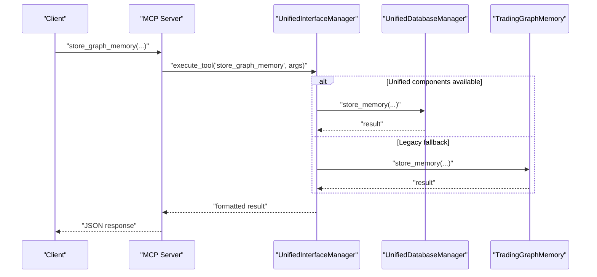
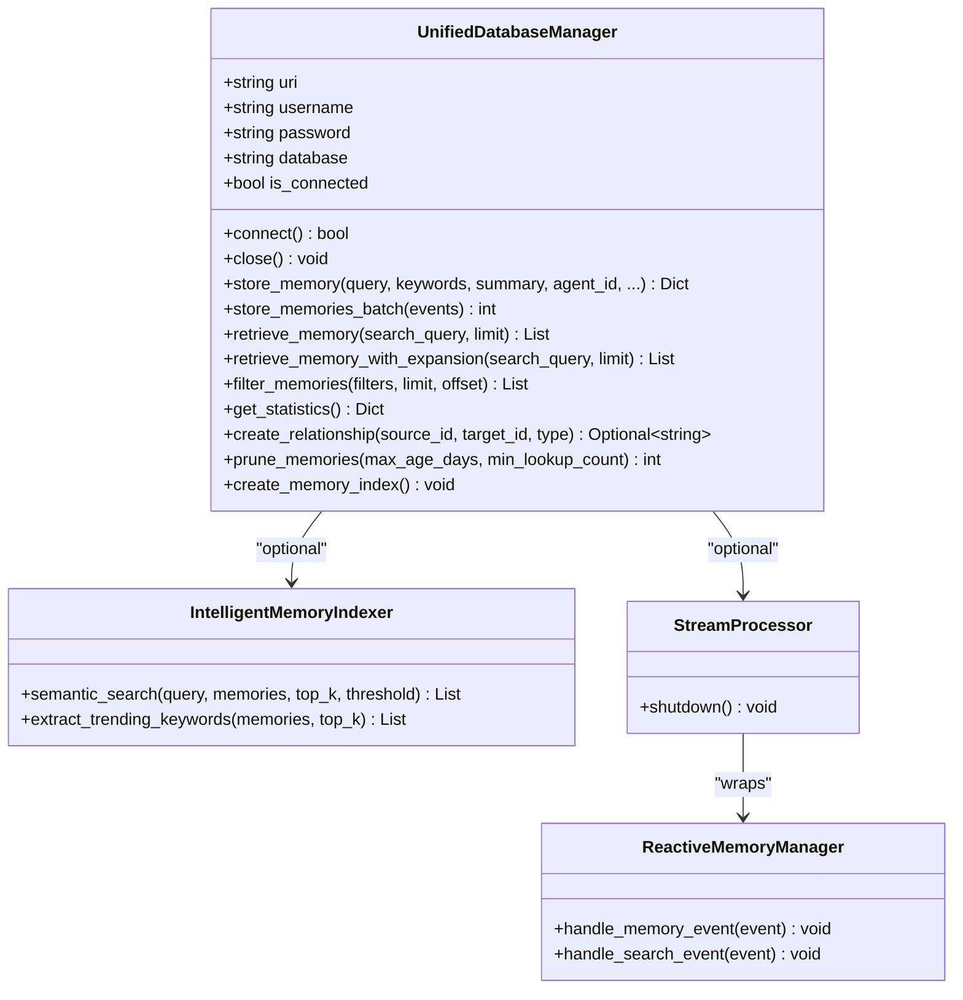
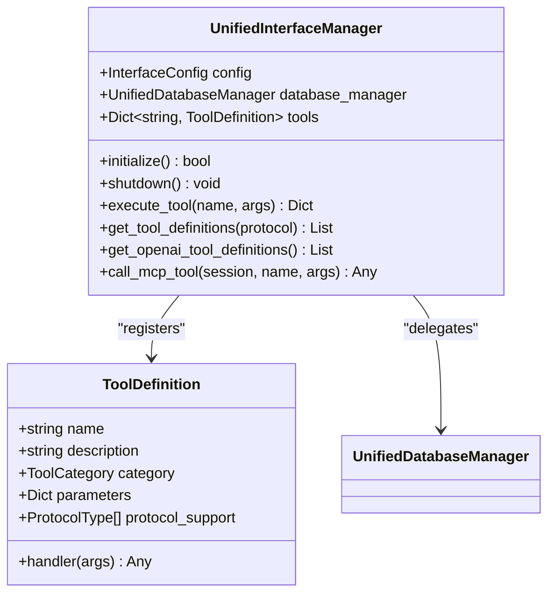
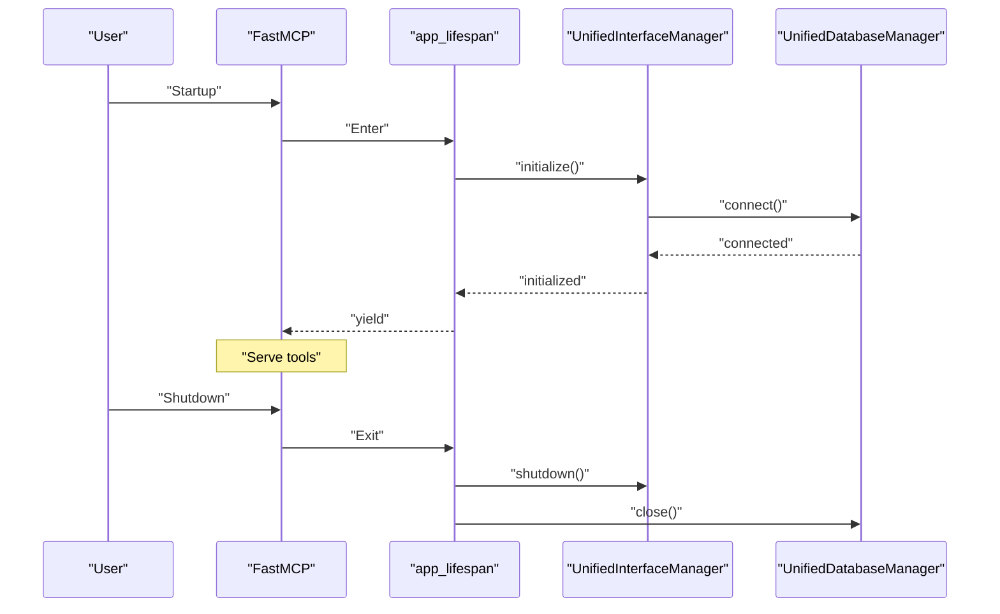
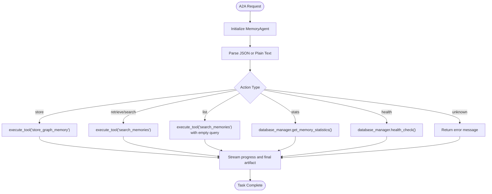
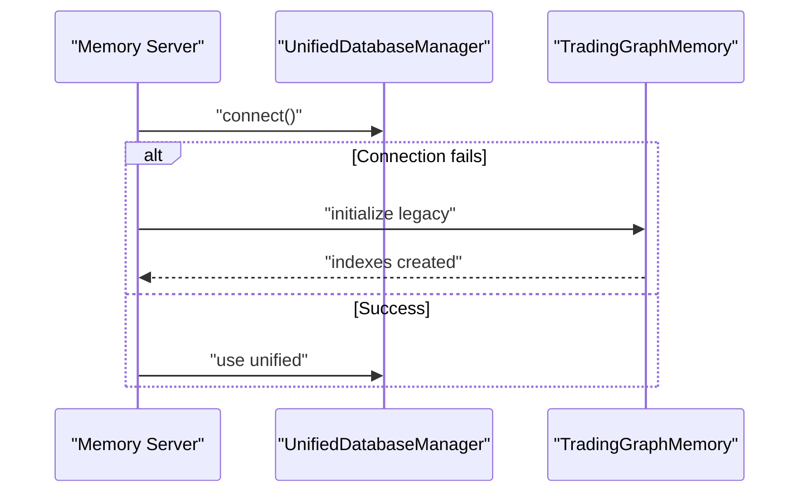
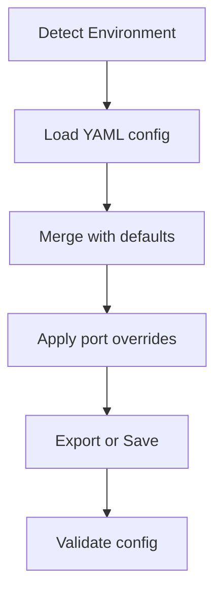
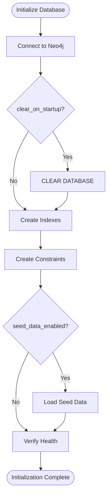
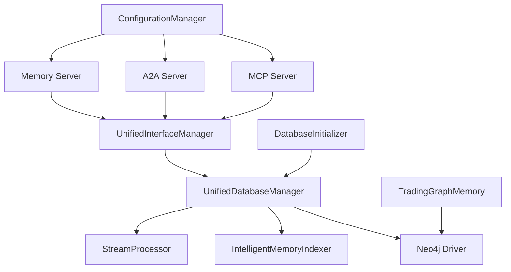

# Memory Architecture

<cite>
**Referenced Files in This Document**
- [mcp_server.py](file://FinAgents/memory/mcp_server.py)
- [unified_database_manager.py](file://FinAgents/memory/unified_database_manager.py)
- [database.py](file://FinAgents/memory/database.py)
- [configuration_manager.py](file://FinAgents/memory/configuration_manager.py)
- [interface.py](file://FinAgents/memory/interface.py)
- [unified_interface_manager.py](file://FinAgents/memory/unified_interface_manager.py)
- [database_initializer.py](file://FinAgents/memory/database_initializer.py)
- [a2a_server.py](file://FinAgents/memory/a2a_server.py)
- [memory_server.py](file://FinAgents/memory/memory_server.py)
- [development.yaml](file://FinAgents/memory/config/development.yaml)
</cite>

## Table of Contents
1. [Introduction](#introduction)
2. [Project Structure](#project-structure)
3. [Core Components](#core-components)
4. [Architecture Overview](#architecture-overview)
5. [Detailed Component Analysis](#detailed-component-analysis)
6. [Dependency Analysis](#dependency-analysis)
7. [Performance Considerations](#performance-considerations)
8. [Troubleshooting Guide](#troubleshooting-guide)
9. [Conclusion](#conclusion)
10. [Appendices](#appendices)

## Introduction
This document explains the Memory System Architecture with its dual architecture approach: unified and legacy components. It covers the MCP server implementation, database connectivity patterns, component initialization lifecycle, unified vs legacy compatibility modes, global instance management, graceful fallback mechanisms, application lifecycle management, startup/shutdown procedures, component status monitoring, configuration management, environment variables, and deployment considerations. The architecture supports seamless migration from legacy Neo4j operations to a modern unified interface while maintaining backward compatibility.

## Project Structure
The memory system resides under FinAgents/memory and includes:
- Unified components: UnifiedDatabaseManager, UnifiedInterfaceManager
- Legacy compatibility: TradingGraphMemory (original Neo4j interface)
- Servers: MCP server, A2A server, Memory server
- Configuration: ConfigurationManager with environment-specific YAML
- Utilities: DatabaseInitializer, intelligent indexing, stream processing

**Diagram sources**
- [mcp_server.py:110-136](file://FinAgents/memory/mcp_server.py#L110-L136)
- [unified_interface_manager.py:105-155](file://FinAgents/memory/unified_interface_manager.py#L105-L155)
- [unified_database_manager.py:104-166](file://FinAgents/memory/unified_database_manager.py#L104-L166)
- [database.py:12-353](file://FinAgents/memory/database.py#L12-L353)
- [configuration_manager.py:235-486](file://FinAgents/memory/configuration_manager.py#L235-L486)
- [database_initializer.py:64-134](file://FinAgents/memory/database_initializer.py#L64-L134)

**Section sources**
- [mcp_server.py:110-136](file://FinAgents/memory/mcp_server.py#L110-L136)
- [unified_interface_manager.py:105-155](file://FinAgents/memory/unified_interface_manager.py#L105-L155)
- [unified_database_manager.py:104-166](file://FinAgents/memory/unified_database_manager.py#L104-L166)
- [database.py:12-353](file://FinAgents/memory/database.py#L12-L353)
- [configuration_manager.py:235-486](file://FinAgents/memory/configuration_manager.py#L235-L486)
- [database_initializer.py:64-134](file://FinAgents/memory/database_initializer.py#L64-L134)

## Core Components
- UnifiedDatabaseManager: Centralized Neo4j manager with connection pooling, memory operations, intelligent indexing, and real-time stream processing integration.
- UnifiedInterfaceManager: Unified tool registry and handler that exposes standardized tools across MCP, HTTP, and A2A protocols, with graceful fallback to legacy operations.
- TradingGraphMemory: Legacy Neo4j client implementing the original memory operations for backward compatibility.
- MCP Server: Dedicated MCP server exposing unified tools with health checks and HTTP endpoints.
- A2A Server: Agent-to-Agent protocol server integrating memory operations with graceful fallback.
- Memory Server: Enhanced MCP server with dual architecture support (unified + legacy) and advanced features.
- ConfigurationManager: Centralized configuration loader for environments, ports, and feature toggles.
- DatabaseInitializer: Schema, index, constraint, and seed data setup with health verification.

**Section sources**
- [unified_database_manager.py:104-166](file://FinAgents/memory/unified_database_manager.py#L104-L166)
- [unified_interface_manager.py:105-155](file://FinAgents/memory/unified_interface_manager.py#L105-L155)
- [database.py:12-353](file://FinAgents/memory/database.py#L12-L353)
- [mcp_server.py:110-136](file://FinAgents/memory/mcp_server.py#L110-L136)
- [a2a_server.py:78-111](file://FinAgents/memory/a2a_server.py#L78-L111)
- [memory_server.py:82-204](file://FinAgents/memory/memory_server.py#L82-L204)
- [configuration_manager.py:235-486](file://FinAgents/memory/configuration_manager.py#L235-L486)
- [database_initializer.py:64-134](file://FinAgents/memory/database_initializer.py#L64-L134)

## Architecture Overview
The system implements a dual architecture:
- Unified Mode: Uses UnifiedDatabaseManager and UnifiedInterfaceManager for all operations, with optional intelligent indexing and reactive stream processing.
- Legacy Mode: Falls back to TradingGraphMemory for compatibility with existing clients and workflows.

**Diagram sources**
- [mcp_server.py:142-177](file://FinAgents/memory/mcp_server.py#L142-L177)
- [unified_interface_manager.py:422-459](file://FinAgents/memory/unified_interface_manager.py#L422-L459)
- [unified_database_manager.py:233-353](file://FinAgents/memory/unified_database_manager.py#L233-L353)
- [database.py:49-114](file://FinAgents/memory/database.py#L49-L114)

**Section sources**
- [mcp_server.py:142-177](file://FinAgents/memory/mcp_server.py#L142-L177)
- [unified_interface_manager.py:422-459](file://FinAgents/memory/unified_interface_manager.py#L422-L459)
- [unified_database_manager.py:233-353](file://FinAgents/memory/unified_database_manager.py#L233-L353)
- [database.py:49-114](file://FinAgents/memory/database.py#L49-L114)

## Detailed Component Analysis

### Unified Database Manager
- Responsibilities: Neo4j connection management, memory storage/retrieval, filtering, statistics, relationship creation, pruning, and optional intelligent indexing and stream processing.
- Features: Connection pooling, health monitoring, batch operations, semantic search integration, and reactive memory events.
- Data models: MemoryType, RelationshipType, DatabaseStats.

**Diagram sources**
- [unified_database_manager.py:104-800](file://FinAgents/memory/unified_database_manager.py#L104-L800)
- [unified_database_manager.py:88-86](file://FinAgents/memory/unified_database_manager.py#L88-L86)

**Section sources**
- [unified_database_manager.py:104-800](file://FinAgents/memory/unified_database_manager.py#L104-L800)

### Unified Interface Manager
- Responsibilities: Tool registration, standardized tool definitions, protocol-agnostic execution, conversation management, and health monitoring.
- Tools: Store/retrieve/filter/semantic search/pruning/relationship management/health checks.
- Integration: MCP client compatibility, OpenAI tool definitions, and conversation orchestration.

**Diagram sources**
- [unified_interface_manager.py:105-783](file://FinAgents/memory/unified_interface_manager.py#L105-L783)
- [unified_interface_manager.py:78-87](file://FinAgents/memory/unified_interface_manager.py#L78-L87)

**Section sources**
- [unified_interface_manager.py:105-783](file://FinAgents/memory/unified_interface_manager.py#L105-L783)

### MCP Server Implementation
- Lifecycle: Uses FastMCP lifespan for initialization and shutdown, with unified and legacy fallback.
- Tools: store_graph_memory, retrieve_graph_memory, semantic_search_memories, get_statistics, health_check, create_relationship.
- Endpoints: HTTP root and health endpoints for monitoring.

**Diagram sources**
- [mcp_server.py:72-128](file://FinAgents/memory/mcp_server.py#L72-L128)
- [mcp_server.py:110-136](file://FinAgents/memory/mcp_server.py#L110-L136)
- [unified_interface_manager.py:132-170](file://FinAgents/memory/unified_interface_manager.py#L132-L170)
- [unified_database_manager.py:172-228](file://FinAgents/memory/unified_database_manager.py#L172-L228)

**Section sources**
- [mcp_server.py:72-128](file://FinAgents/memory/mcp_server.py#L72-L128)
- [mcp_server.py:110-136](file://FinAgents/memory/mcp_server.py#L110-L136)
- [unified_interface_manager.py:132-170](file://FinAgents/memory/unified_interface_manager.py#L132-L170)
- [unified_database_manager.py:172-228](file://FinAgents/memory/unified_database_manager.py#L172-L228)

### A2A Server Integration
- Agent: MemoryAgent with initialize, stream, and shutdown methods.
- Executor: MemoryAgentExecutor orchestrating tasks, artifacts, and status updates.
- Fallback: Graceful fallback to simple in-memory storage when unified components unavailable.

**Diagram sources**
- [a2a_server.py:228-488](file://FinAgents/memory/a2a_server.py#L228-L488)
- [a2a_server.py:78-111](file://FinAgents/memory/a2a_server.py#L78-L111)

**Section sources**
- [a2a_server.py:228-488](file://FinAgents/memory/a2a_server.py#L228-L488)
- [a2a_server.py:78-111](file://FinAgents/memory/a2a_server.py#L78-L111)

### Legacy Compatibility Mode
- TradingGraphMemory provides the original Neo4j interface for backward compatibility.
- Memory Server demonstrates dual-mode initialization and fallback behavior.

**Diagram sources**
- [memory_server.py:82-204](file://FinAgents/memory/memory_server.py#L82-L204)
- [database.py:12-353](file://FinAgents/memory/database.py#L12-L353)

**Section sources**
- [memory_server.py:82-204](file://FinAgents/memory/memory_server.py#L82-L204)
- [database.py:12-353](file://FinAgents/memory/database.py#L12-L353)

### Configuration Management
- ConfigurationManager loads environment-specific YAML files and merges defaults.
- Supports development, testing, staging, and production environments.
- Provides factory functions for easy access to configurations.

**Diagram sources**
- [configuration_manager.py:255-424](file://FinAgents/memory/configuration_manager.py#L255-L424)

**Section sources**
- [configuration_manager.py:255-424](file://FinAgents/memory/configuration_manager.py#L255-L424)
- [development.yaml:1-125](file://FinAgents/memory/config/development.yaml#L1-L125)

### Database Initialization
- DatabaseInitializer sets up indexes, constraints, and seed data based on configuration.
- Health verification ensures readiness before marking initialization complete.

**Diagram sources**
- [database_initializer.py:88-134](file://FinAgents/memory/database_initializer.py#L88-L134)
- [database_initializer.py:201-311](file://FinAgents/memory/database_initializer.py#L201-L311)

**Section sources**
- [database_initializer.py:88-134](file://FinAgents/memory/database_initializer.py#L88-L134)
- [database_initializer.py:201-311](file://FinAgents/memory/database_initializer.py#L201-L311)

## Dependency Analysis
- Unified components depend on Neo4j driver and optional intelligent indexing/stream processing.
- Legacy components depend on the original TradingGraphMemory interface.
- Servers depend on UnifiedInterfaceManager for tool execution and UnifiedDatabaseManager for database operations.
- ConfigurationManager centralizes environment detection and configuration loading.

**Diagram sources**
- [mcp_server.py:38-45](file://FinAgents/memory/mcp_server.py#L38-L45)
- [unified_interface_manager.py:49-51](file://FinAgents/memory/unified_interface_manager.py#L49-L51)
- [unified_database_manager.py:32-52](file://FinAgents/memory/unified_database_manager.py#L32-L52)
- [database.py:1-5](file://FinAgents/memory/database.py#L1-L5)
- [configuration_manager.py:241-254](file://FinAgents/memory/configuration_manager.py#L241-L254)
- [database_initializer.py:28-47](file://FinAgents/memory/database_initializer.py#L28-L47)

**Section sources**
- [mcp_server.py:38-45](file://FinAgents/memory/mcp_server.py#L38-L45)
- [unified_interface_manager.py:49-51](file://FinAgents/memory/unified_interface_manager.py#L49-L51)
- [unified_database_manager.py:32-52](file://FinAgents/memory/unified_database_manager.py#L32-L52)
- [database.py:1-5](file://FinAgents/memory/database.py#L1-L5)
- [configuration_manager.py:241-254](file://FinAgents/memory/configuration_manager.py#L241-L254)
- [database_initializer.py:28-47](file://FinAgents/memory/database_initializer.py#L28-L47)

## Performance Considerations
- Connection pooling: UnifiedDatabaseManager uses configurable max pool size and connection lifetime.
- Batch operations: UnifiedDatabaseManager supports batch memory storage for throughput.
- Intelligent indexing: Optional semantic search reduces query latency for complex searches.
- Reactive processing: StreamProcessor and ReactiveMemoryManager enable real-time event handling.
- Legacy fallback: Minimal overhead when unified components are unavailable.

[No sources needed since this section provides general guidance]

## Troubleshooting Guide
- Database connectivity failures: Check Neo4j credentials and URI; verify network access.
- Unified component unavailability: Confirm installation of unified dependencies; fallback to legacy mode.
- Tool execution errors: Review UnifiedInterfaceManager error handling and logs.
- Health checks: Use MCP health_check and A2A health endpoints for diagnostics.
- Configuration issues: Validate YAML files and environment variable detection.

**Section sources**
- [unified_interface_manager.py:451-459](file://FinAgents/memory/unified_interface_manager.py#L451-L459)
- [mcp_server.py:249-261](file://FinAgents/memory/mcp_server.py#L249-L261)
- [a2a_server.py:560-571](file://FinAgents/memory/a2a_server.py#L560-L571)

## Conclusion
The Memory System Architecture provides a robust, dual-mode solution that seamlessly integrates modern unified components with legacy compatibility. The MCP, A2A, and Memory servers expose a consistent tool interface backed by UnifiedInterfaceManager and UnifiedDatabaseManager, with graceful fallbacks and comprehensive configuration management. This design enables smooth migration, enhanced capabilities, and reliable operations across diverse deployment environments.

## Appendices

### Configuration Options
- Environment variables: FINAGENT_ENV controls environment detection.
- YAML configuration: development.yaml defines database, server, memory, MCP, A2A, logging, ports, and database initialization settings.

**Section sources**
- [configuration_manager.py:597-622](file://FinAgents/memory/configuration_manager.py#L597-L622)
- [development.yaml:1-125](file://FinAgents/memory/config/development.yaml#L1-L125)