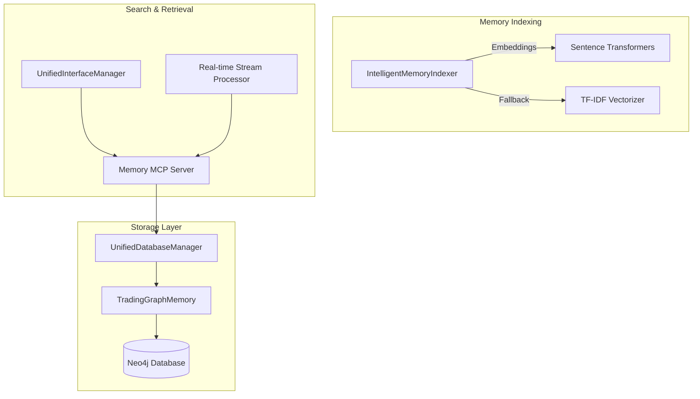
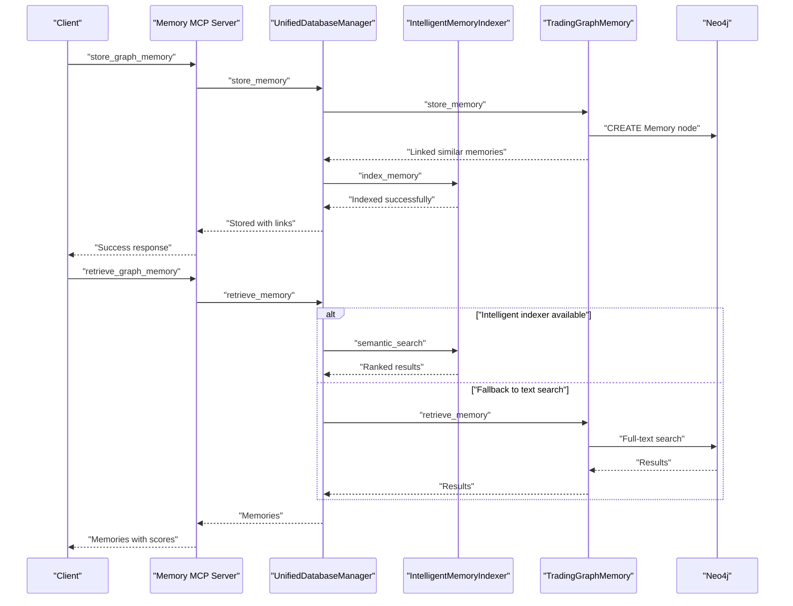
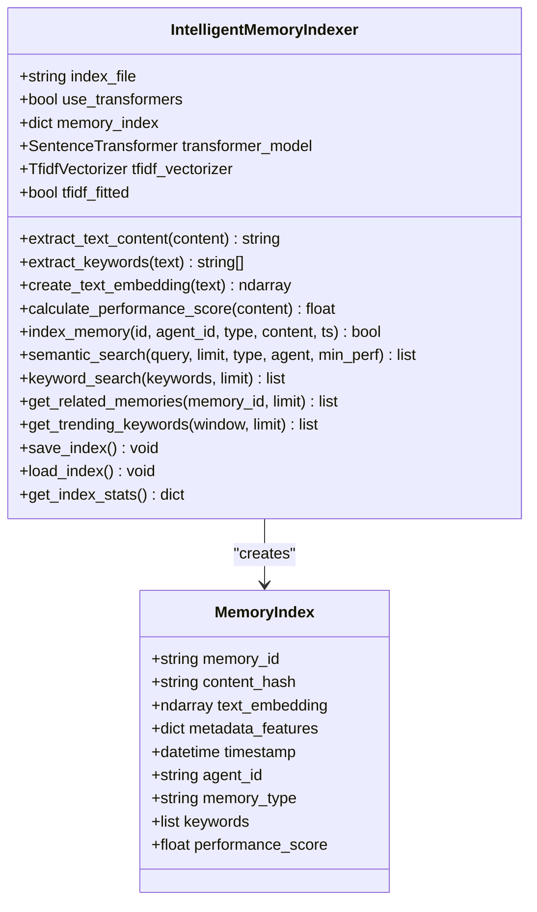
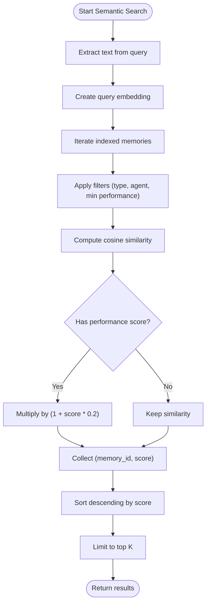
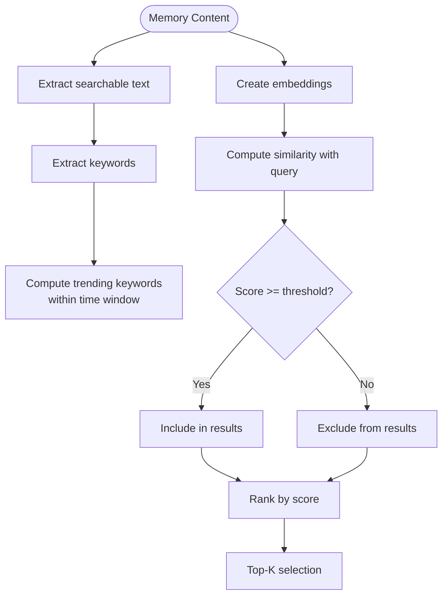
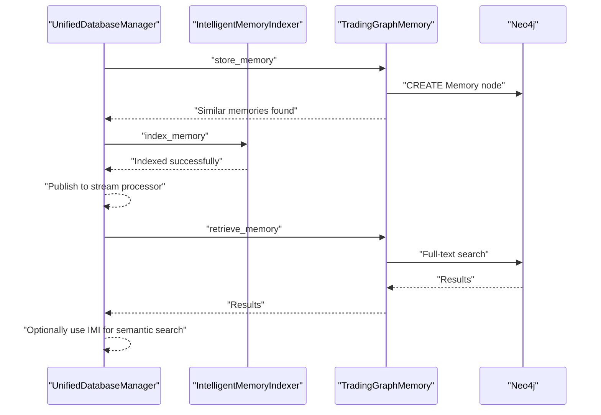
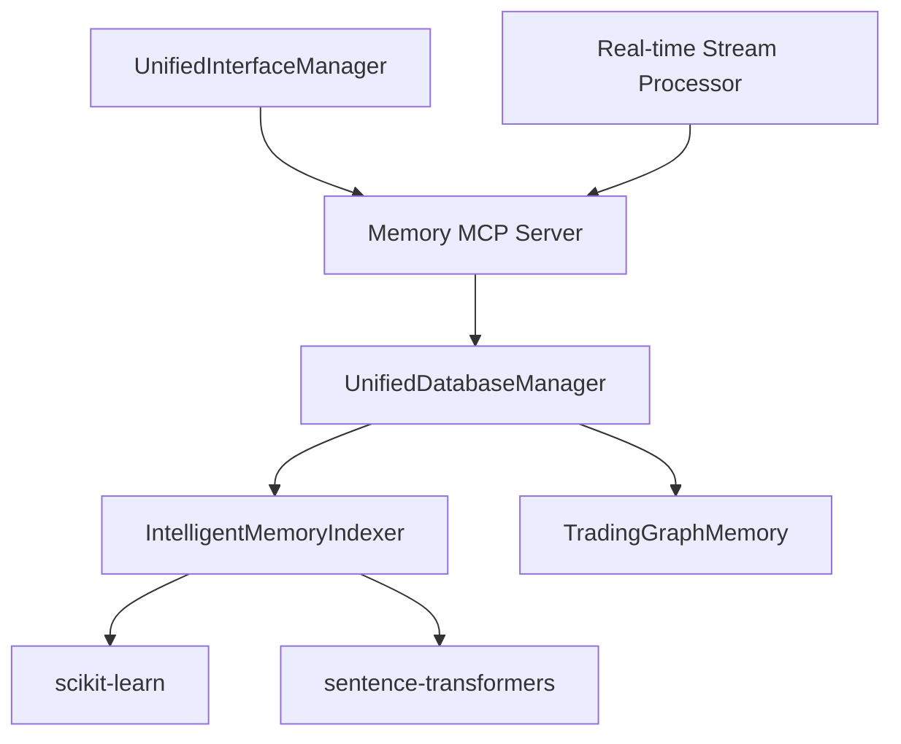

# Memory Indexing and Search

<cite>
**Referenced Files in This Document**
- [intelligent_memory_indexer.py](file://FinAgents/memory/intelligent_memory_indexer.py)
- [database.py](file://FinAgents/memory/database.py)
- [unified_database_manager.py](file://FinAgents/memory/unified_database_manager.py)
- [memory_server.py](file://FinAgents/memory/memory_server.py)
- [realtime_stream_processor.py](file://FinAgents/memory/realtime_stream_processor.py)
- [unified_interface_manager.py](file://FinAgents/memory/unified_interface_manager.py)
- [development.yaml](file://FinAgents/memory/config/development.yaml)
</cite>

## Table of Contents
1. [Introduction](#introduction)
2. [Project Structure](#project-structure)
3. [Core Components](#core-components)
4. [Architecture Overview](#architecture-overview)
5. [Detailed Component Analysis](#detailed-component-analysis)
6. [Dependency Analysis](#dependency-analysis)
7. [Performance Considerations](#performance-considerations)
8. [Troubleshooting Guide](#troubleshooting-guide)
9. [Conclusion](#conclusion)

## Introduction
This document provides comprehensive technical documentation for the intelligent memory indexing and search system within the FinAgent ecosystem. The system combines semantic search using AI embeddings with keyword-based retrieval, trending analysis, and real-time stream processing. It integrates with Neo4j for graph-based memory storage and retrieval, while offering optional advanced semantic search powered by sentence-transformers.

Key capabilities include:
- Automatic indexing during memory creation with intelligent text extraction and keyword generation
- Semantic search using AI embeddings with similarity scoring and performance-aware ranking
- Keyword extraction and trending analysis for content discovery
- Integration with Neo4j for full-text search, structured property indexes, and relationship expansion
- Real-time event streaming and reactive memory management for scalable, event-driven processing

## Project Structure
The memory indexing and search system spans several modules:
- Intelligent memory indexing and semantic search logic
- Neo4j-backed memory storage and retrieval
- Unified database manager coordinating both legacy and enhanced features
- MCP server exposing tools for memory operations and semantic search
- Real-time stream processing for event-driven analytics and alerts
- Unified interface manager for protocol-agnostic tool definitions

**Diagram sources**
- [intelligent_memory_indexer.py:40-444](file://FinAgents/memory/intelligent_memory_indexer.py#L40-L444)
- [database.py:12-353](file://FinAgents/memory/database.py#L12-L353)
- [unified_database_manager.py:104-800](file://FinAgents/memory/unified_database_manager.py#L104-L800)
- [memory_server.py:19-800](file://FinAgents/memory/memory_server.py#L19-L800)
- [realtime_stream_processor.py:54-542](file://FinAgents/memory/realtime_stream_processor.py#L54-L542)

**Section sources**
- [intelligent_memory_indexer.py:1-507](file://FinAgents/memory/intelligent_memory_indexer.py#L1-L507)
- [database.py:1-353](file://FinAgents/memory/database.py#L1-L353)
- [unified_database_manager.py:1-1085](file://FinAgents/memory/unified_database_manager.py#L1-L1085)
- [memory_server.py:1-1167](file://FinAgents/memory/memory_server.py#L1-L1167)
- [realtime_stream_processor.py:1-542](file://FinAgents/memory/realtime_stream_processor.py#L1-L542)

## Core Components
This section outlines the primary components and their responsibilities:

- IntelligentMemoryIndexer: Implements semantic search using AI embeddings (sentence-transformers) with a TF-IDF fallback. Provides text extraction, keyword generation, performance scoring, and similarity calculations.
- TradingGraphMemory: Neo4j-based memory storage with full-text and structured property indexes, similarity-based linking, and retrieval with expansion.
- UnifiedDatabaseManager: Centralized manager integrating legacy and enhanced features, including intelligent indexing, batch operations, and statistics.
- Memory MCP Server: Exposes tools for memory storage, retrieval, filtering, semantic search, and maintenance operations.
- Real-time Stream Processor: Event streaming and reactive memory management with WebSocket broadcasting and pattern detection.
- UnifiedInterfaceManager: Protocol-agnostic tool definitions and execution handlers for MCP, HTTP, A2A, and WebSocket.

**Section sources**
- [intelligent_memory_indexer.py:40-444](file://FinAgents/memory/intelligent_memory_indexer.py#L40-L444)
- [database.py:12-353](file://FinAgents/memory/database.py#L12-L353)
- [unified_database_manager.py:104-800](file://FinAgents/memory/unified_database_manager.py#L104-L800)
- [memory_server.py:209-800](file://FinAgents/memory/memory_server.py#L209-L800)
- [realtime_stream_processor.py:54-542](file://FinAgents/memory/realtime_stream_processor.py#L54-L542)
- [unified_interface_manager.py:105-800](file://FinAgents/memory/unified_interface_manager.py#L105-L800)

## Architecture Overview
The system architecture integrates semantic indexing with Neo4j-based storage and retrieval. Intelligent indexing occurs during memory creation, enabling both keyword-based and semantic search. The MCP server exposes tools for unified operations, while the stream processor manages real-time events and analytics.

**Diagram sources**
- [memory_server.py:220-420](file://FinAgents/memory/memory_server.py#L220-L420)
- [unified_database_manager.py:233-474](file://FinAgents/memory/unified_database_manager.py#L233-L474)
- [intelligent_memory_indexer.py:186-308](file://FinAgents/memory/intelligent_memory_indexer.py#L186-L308)
- [database.py:49-235](file://FinAgents/memory/database.py#L49-L235)

## Detailed Component Analysis

### IntelligentMemoryIndexer Implementation
The IntelligentMemoryIndexer provides semantic search capabilities with automatic text extraction, keyword generation, and performance-aware ranking. It supports both sentence-transformers embeddings and TF-IDF as a fallback.

Key features:
- Text extraction from structured memory content (signals, strategies, performance metrics)
- Embedding generation using sentence-transformers or TF-IDF vectorizer
- Keyword extraction for keyword-based search
- Performance score calculation for ranking
- Similarity scoring with boosting based on performance
- Trending keyword analysis within time windows
- Persistence of index to disk

**Diagram sources**
- [intelligent_memory_indexer.py:26-81](file://FinAgents/memory/intelligent_memory_indexer.py#L26-L81)
- [intelligent_memory_indexer.py:40-444](file://FinAgents/memory/intelligent_memory_indexer.py#L40-L444)

**Section sources**
- [intelligent_memory_indexer.py:40-444](file://FinAgents/memory/intelligent_memory_indexer.py#L40-L444)

### Semantic Search Capabilities and Similarity Scoring
Semantic search leverages AI embeddings to compute similarity between queries and indexed memories. The system applies performance-aware boosting to prioritize higher-performing memories.

Processing logic:
- Query embedding generation using sentence-transformers or TF-IDF
- Cosine similarity computation against all indexed memories
- Performance-based similarity boost (0–20% based on performance score)
- Filtering by memory type, agent, and minimum performance thresholds
- Ranking and limiting results

**Diagram sources**
- [intelligent_memory_indexer.py:256-308](file://FinAgents/memory/intelligent_memory_indexer.py#L256-L308)

**Section sources**
- [intelligent_memory_indexer.py:256-308](file://FinAgents/memory/intelligent_memory_indexer.py#L256-L308)

### Keyword Extraction, Trending Analysis, and Semantic Matching
The system performs keyword extraction from memory content and computes trending keywords within configurable time windows. Semantic matching uses embeddings to find conceptually similar memories.

Key operations:
- Keyword extraction from signals, strategies, performance metrics, and metadata
- Trending keyword computation counting occurrences within a time window
- Semantic matching with similarity threshold and top-k selection
- Relationship expansion to discover related memories

**Diagram sources**
- [intelligent_memory_indexer.py:82-184](file://FinAgents/memory/intelligent_memory_indexer.py#L82-L184)
- [intelligent_memory_indexer.py:368-391](file://FinAgents/memory/intelligent_memory_indexer.py#L368-L391)
- [intelligent_memory_indexer.py:256-308](file://FinAgents/memory/intelligent_memory_indexer.py#L256-L308)

**Section sources**
- [intelligent_memory_indexer.py:82-184](file://FinAgents/memory/intelligent_memory_indexer.py#L82-L184)
- [intelligent_memory_indexer.py:368-391](file://FinAgents/memory/intelligent_memory_indexer.py#L368-L391)

### Integration with Memory Storage and Retrieval Operations
The UnifiedDatabaseManager coordinates memory storage and retrieval, integrating intelligent indexing during creation and providing fallback mechanisms when advanced features are unavailable.

Integration highlights:
- Automatic indexing during memory creation via IntelligentMemoryIndexer
- Full-text search with Neo4j indexes and similarity-based linking
- Relationship expansion for contextual retrieval
- Batch operations for high-throughput scenarios
- Statistics and pruning for maintenance

**Diagram sources**
- [unified_database_manager.py:233-353](file://FinAgents/memory/unified_database_manager.py#L233-L353)
- [database.py:49-235](file://FinAgents/memory/database.py#L49-L235)
- [intelligent_memory_indexer.py:186-255](file://FinAgents/memory/intelligent_memory_indexer.py#L186-L255)

**Section sources**
- [unified_database_manager.py:233-353](file://FinAgents/memory/unified_database_manager.py#L233-L353)
- [database.py:49-235](file://FinAgents/memory/database.py#L49-L235)

### Search Optimization Techniques and Scalability
The system employs several optimization strategies:
- Embedding model selection with automatic fallback to TF-IDF
- Performance-aware similarity boosting to prioritize high-quality memories
- Structured property indexes and full-text indexes for efficient retrieval
- Batch operations and connection pooling for throughput
- Real-time stream processing with event buffering and pattern detection
- Pruning policies to maintain database health

Scalability considerations:
- Connection pool sizing and acquisition timeouts
- Index creation and maintenance policies
- Vector dimension and similarity thresholds
- Event processing concurrency and batching

**Section sources**
- [unified_database_manager.py:113-167](file://FinAgents/memory/unified_database_manager.py#L113-L167)
- [database.py:33-47](file://FinAgents/memory/database.py#L33-L47)
- [development.yaml:3-46](file://FinAgents/memory/config/development.yaml#L3-L46)

### Examples and Usage Patterns
Example scenarios:
- Semantic queries: "AAPL earnings strong performance" returns semantically similar memories with boosted scores for high-performance matches
- Keyword analysis: Trending keywords extraction identifies frequently occurring terms within a specified time window
- Search result ranking: Results are ranked by similarity score with performance-based boosting applied

Note: Specific code examples are omitted per policy; see referenced sections for implementation details.

## Dependency Analysis
The system exhibits modular dependencies with clear separation of concerns:
- IntelligentMemoryIndexer depends on sentence-transformers (optional) and scikit-learn for embeddings and vectorization
- UnifiedDatabaseManager integrates both legacy TradingGraphMemory and IntelligentMemoryIndexer
- Memory MCP Server orchestrates tool execution and delegates to UnifiedDatabaseManager
- Real-time Stream Processor provides event-driven processing with optional Redis integration
- UnifiedInterfaceManager defines protocol-agnostic tool schemas and handlers

**Diagram sources**
- [intelligent_memory_indexer.py:19-24](file://FinAgents/memory/intelligent_memory_indexer.py#L19-L24)
- [unified_database_manager.py:32-51](file://FinAgents/memory/unified_database_manager.py#L32-L51)
- [memory_server.py:35-56](file://FinAgents/memory/memory_server.py#L35-L56)
- [realtime_stream_processor.py:21-27](file://FinAgents/memory/realtime_stream_processor.py#L21-L27)

**Section sources**
- [intelligent_memory_indexer.py:19-24](file://FinAgents/memory/intelligent_memory_indexer.py#L19-L24)
- [unified_database_manager.py:32-51](file://FinAgents/memory/unified_database_manager.py#L32-L51)
- [memory_server.py:35-56](file://FinAgents/memory/memory_server.py#L35-L56)
- [realtime_stream_processor.py:21-27](file://FinAgents/memory/realtime_stream_processor.py#L21-L27)

## Performance Considerations
- Embedding model selection: Prefer sentence-transformers for superior semantic quality; fallback to TF-IDF when unavailable
- Indexing strategy: Configure vector dimension and similarity thresholds based on workload characteristics
- Connection management: Tune connection pool size and timeouts for optimal throughput
- Event processing: Use batching and buffering to balance latency and throughput in stream processing
- Maintenance: Regular pruning and index updates to maintain query performance

## Troubleshooting Guide
Common issues and resolutions:
- Missing sentence-transformers: The system automatically falls back to TF-IDF vectorizer; install the library for semantic search capability
- Neo4j connectivity: Verify credentials and network configuration; ensure indexes are created during initialization
- Index persistence: Confirm file permissions for index storage; monitor save/load failures
- Stream processing: Validate Redis availability for distributed processing; check event handler registration
- Tool execution: Review MCP server logs for tool call errors and response parsing issues

**Section sources**
- [intelligent_memory_indexer.py:20-24](file://FinAgents/memory/intelligent_memory_indexer.py#L20-L24)
- [database.py:13-24](file://FinAgents/memory/database.py#L13-L24)
- [memory_server.py:150-166](file://FinAgents/memory/memory_server.py#L150-L166)

## Conclusion
The intelligent memory indexing and search system provides a robust foundation for semantic memory management in the FinAgent ecosystem. By combining AI-powered embeddings with Neo4j-based storage and real-time event processing, it enables scalable, context-aware memory operations. The modular architecture ensures extensibility and resilience, while configuration-driven settings support diverse deployment scenarios.