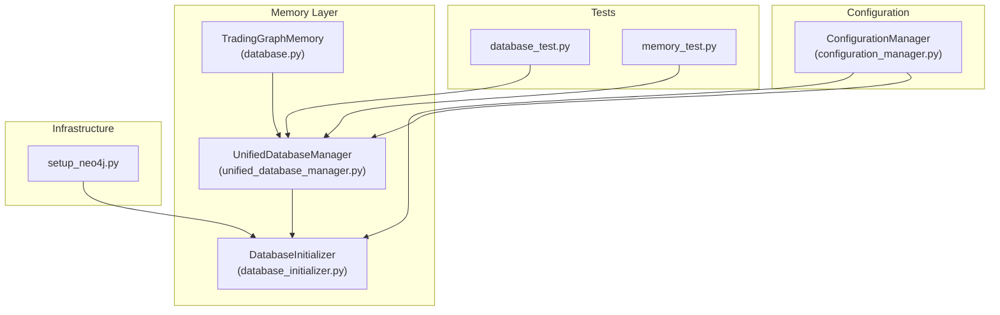
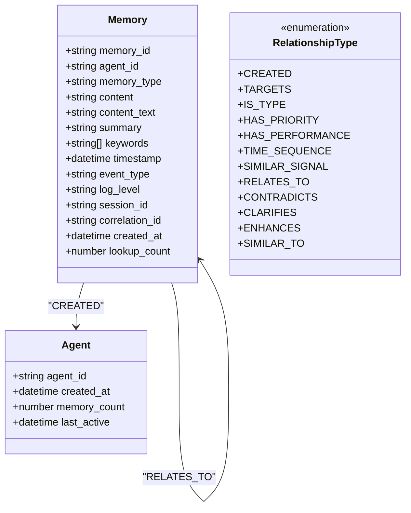
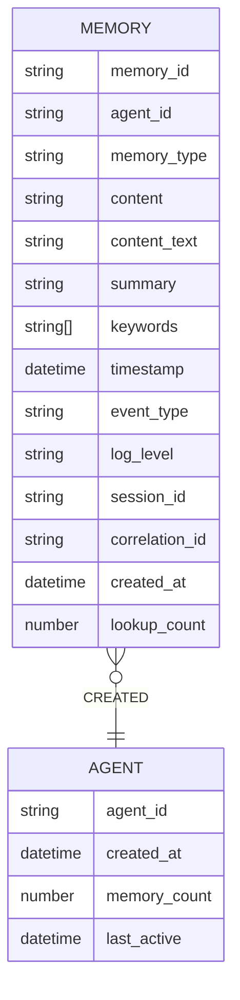
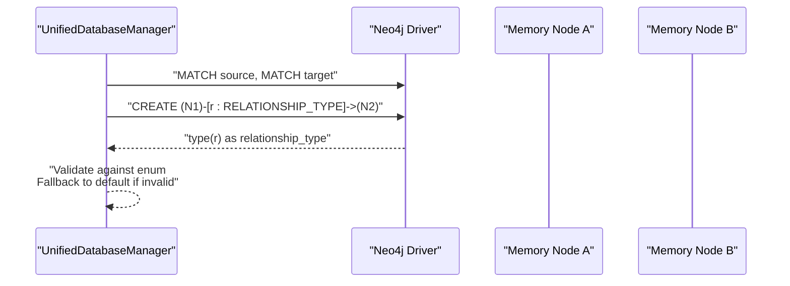
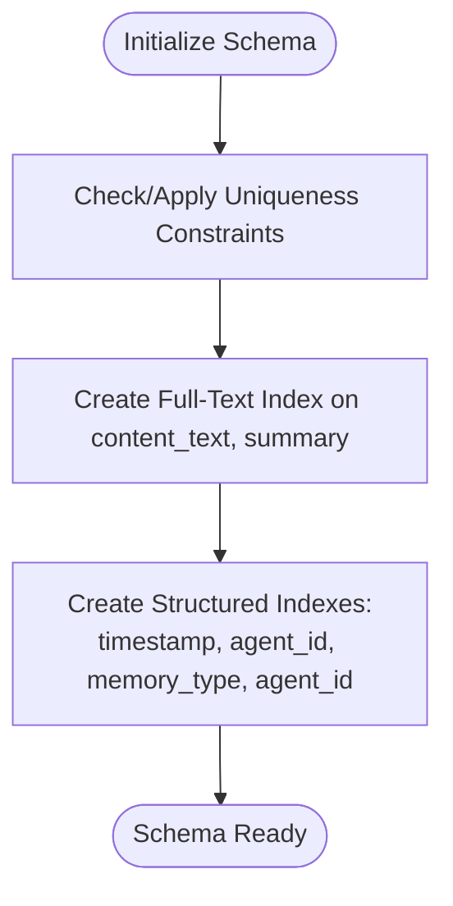
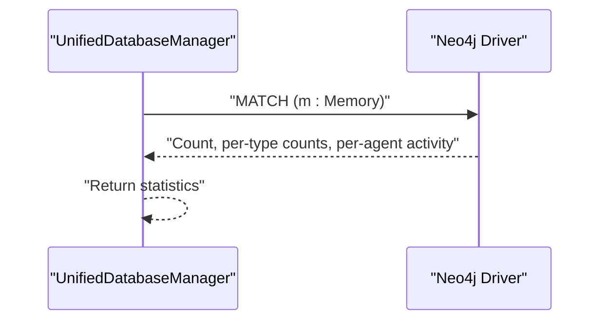
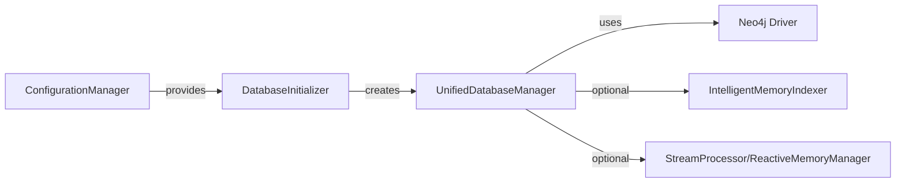

# Memory Schema Design

<cite>
**Referenced Files in This Document**
- [database.py](file://FinAgents/memory/database.py)
- [unified_database_manager.py](file://FinAgents/memory/unified_database_manager.py)
- [database_initializer.py](file://FinAgents/memory/database_initializer.py)
- [configuration_manager.py](file://FinAgents/memory/configuration_manager.py)
- [database_test.py](file://FinAgents/memory/tests/database_test.py)
- [memory_test.py](file://FinAgents/memory/tests/memory_test.py)
- [setup_neo4j.py](file://scripts/setup_neo4j.py)
</cite>

## Table of Contents
1. [Introduction](#introduction)
2. [Project Structure](#project-structure)
3. [Core Components](#core-components)
4. [Architecture Overview](#architecture-overview)
5. [Detailed Component Analysis](#detailed-component-analysis)
6. [Dependency Analysis](#dependency-analysis)
7. [Performance Considerations](#performance-considerations)
8. [Troubleshooting Guide](#troubleshooting-guide)
9. [Conclusion](#conclusion)

## Introduction
This document describes the memory schema design and data modeling for the agentic trading application’s graph memory system. It explains the graph database schema (node types, relationship types, and properties), memory entity structure, metadata fields, and temporal data handling. It also documents indexing strategies, constraint definitions, and validation rules, along with schema evolution patterns, backward compatibility considerations, and migration strategies. Practical examples illustrate memory node creation, relationship establishment, and property management, and the document concludes with data integrity constraints, performance implications, and best practices.

## Project Structure
The memory schema is implemented across several modules:
- Core graph operations and memory storage/retrieval
- Unified database manager with compatibility layer
- Database initialization and schema setup
- Configuration management for environment-specific settings
- Tests validating schema operations and indexes
- Setup script for Neo4j connectivity and initialization

**Diagram sources**
- [database.py:12-353](file://FinAgents/memory/database.py#L12-L353)
- [unified_database_manager.py:104-1085](file://FinAgents/memory/unified_database_manager.py#L104-L1085)
- [database_initializer.py:64-448](file://FinAgents/memory/database_initializer.py#L64-L448)
- [configuration_manager.py:235-672](file://FinAgents/memory/configuration_manager.py#L235-L672)
- [database_test.py:197-343](file://FinAgents/memory/tests/database_test.py#L197-L343)
- [memory_test.py:239-259](file://FinAgents/memory/tests/memory_test.py#L239-L259)
- [setup_neo4j.py:90-127](file://scripts/setup_neo4j.py#L90-L127)

**Section sources**
- [database.py:12-353](file://FinAgents/memory/database.py#L12-L353)
- [unified_database_manager.py:104-1085](file://FinAgents/memory/unified_database_manager.py#L104-L1085)
- [database_initializer.py:64-448](file://FinAgents/memory/database_initializer.py#L64-L448)
- [configuration_manager.py:235-672](file://FinAgents/memory/configuration_manager.py#L235-L672)
- [database_test.py:197-343](file://FinAgents/memory/tests/database_test.py#L197-L343)
- [memory_test.py:239-259](file://FinAgents/memory/tests/memory_test.py#L239-L259)
- [setup_neo4j.py:90-127](file://scripts/setup_neo4j.py#L90-L127)

## Core Components
- Node types
  - Memory: The primary node representing a memory record with content, metadata, and timestamps.
  - Agent: A companion node representing agents that create memories; maintained via MERGE semantics to ensure uniqueness.
- Relationship types
  - SIMILAR_TO: Links memories that share keywords or are semantically similar.
  - RELATES_TO: General relationship between memories.
  - Additional enumerated relationship types include CREATED, TARGETS, IS_TYPE, HAS_PRIORITY, HAS_PERFORMANCE, TIME_SEQUENCE, SIMILAR_SIGNAL, CONTRADICTS, CLARIFIES, ENHANCES, among others.
- Properties
  - Memory node properties include identifiers, content, metadata, and temporal fields.
  - Agent node properties include identity, counts, and timestamps.
- Temporal handling
  - Timestamps are stored as ISO-formatted strings or native datetime types depending on the operation.
  - Lookup counts are incremented on retrieval to support recency-aware ranking.
- Indexing and constraints
  - Full-text index on memory content for semantic search.
  - Structured indexes on frequently filtered properties (e.g., timestamp, agent_id, memory_type).
  - Uniqueness constraints on identity fields (memory_id, agent_id).
- Validation and sanitization
  - Relationship types are validated against an enumeration; invalid types fall back to a default.
  - Property names are sanitized for dynamic queries to avoid injection.

**Section sources**
- [database.py:49-113](file://FinAgents/memory/database.py#L49-L113)
- [unified_database_manager.py:60-86](file://FinAgents/memory/unified_database_manager.py#L60-L86)
- [unified_database_manager.py:280-348](file://FinAgents/memory/unified_database_manager.py#L280-L348)
- [unified_database_manager.py:716-743](file://FinAgents/memory/unified_database_manager.py#L716-L743)
- [unified_database_manager.py:832-856](file://FinAgents/memory/unified_database_manager.py#L832-L856)
- [database_initializer.py:216-292](file://FinAgents/memory/database_initializer.py#L216-L292)

## Architecture Overview
The memory schema is centered around a graph model where Memory nodes encapsulate content and metadata, and relationships encode semantic and temporal connections. The unified database manager provides a compatibility layer over the original implementation, while the initializer sets up indexes and constraints based on configuration.

**Diagram sources**
- [unified_database_manager.py:60-86](file://FinAgents/memory/unified_database_manager.py#L60-L86)
- [unified_database_manager.py:280-348](file://FinAgents/memory/unified_database_manager.py#L280-L348)
- [unified_database_manager.py:858-871](file://FinAgents/memory/unified_database_manager.py#L858-L871)

**Section sources**
- [unified_database_manager.py:60-86](file://FinAgents/memory/unified_database_manager.py#L60-L86)
- [unified_database_manager.py:280-348](file://FinAgents/memory/unified_database_manager.py#L280-L348)
- [unified_database_manager.py:858-871](file://FinAgents/memory/unified_database_manager.py#L858-L871)

## Detailed Component Analysis

### Memory Node Model and Properties
- Purpose: Encapsulates agent-generated knowledge with content, metadata, and provenance.
- Key properties:
  - Identifiers: memory_id, agent_id, session_id, correlation_id
  - Content: content (JSON), content_text (searchable), summary, keywords
  - Metadata: event_type, log_level, memory_type
  - Temporal: timestamp, created_at, lookup_count
- Storage behavior:
  - Nodes are created with default values and optional session/correlation identifiers.
  - content_text is derived from query, summary, and keywords for efficient text search.
  - lookup_count is initialized to zero and incremented on retrieval.

**Diagram sources**
- [unified_database_manager.py:280-348](file://FinAgents/memory/unified_database_manager.py#L280-L348)
- [unified_database_manager.py:858-871](file://FinAgents/memory/unified_database_manager.py#L858-L871)

**Section sources**
- [unified_database_manager.py:280-348](file://FinAgents/memory/unified_database_manager.py#L280-L348)
- [unified_database_manager.py:858-871](file://FinAgents/memory/unified_database_manager.py#L858-L871)

### Relationship Types and Management
- Enumerated relationships define semantic and structural links between memories.
- Management:
  - Validation ensures only supported relationship types are used; invalid types default to a safe value.
  - Creation sets a timestamp on the relationship for auditability.
  - MERGE semantics prevent duplicate relationships.

**Diagram sources**
- [unified_database_manager.py:716-743](file://FinAgents/memory/unified_database_manager.py#L716-L743)

**Section sources**
- [unified_database_manager.py:716-743](file://FinAgents/memory/unified_database_manager.py#L716-L743)
- [unified_database_manager.py:60-86](file://FinAgents/memory/unified_database_manager.py#L60-L86)

### Indexing and Constraints
- Indexes:
  - Full-text index on content_text and summary for semantic search.
  - Structured indexes on timestamp, agent_id, memory_type, and agent_id for fast filtering.
- Constraints:
  - Uniqueness constraints on memory_id and agent_id to enforce identity integrity.
- Initialization:
  - Indexes and constraints are created programmatically during initialization or on-demand.

**Diagram sources**
- [database_initializer.py:216-292](file://FinAgents/memory/database_initializer.py#L216-L292)
- [unified_database_manager.py:832-856](file://FinAgents/memory/unified_database_manager.py#L832-L856)

**Section sources**
- [database_initializer.py:216-292](file://FinAgents/memory/database_initializer.py#L216-L292)
- [unified_database_manager.py:832-856](file://FinAgents/memory/unified_database_manager.py#L832-L856)

### Temporal Data Handling and Statistics
- Timestamps:
  - ISO-formatted strings for portability; native datetime for temporal comparisons.
- Statistics:
  - Aggregated counts by memory_type and agent activity.
  - Operation counters and availability indicators for optional components.

**Diagram sources**
- [unified_database_manager.py:617-691](file://FinAgents/memory/unified_database_manager.py#L617-L691)

**Section sources**
- [unified_database_manager.py:617-691](file://FinAgents/memory/unified_database_manager.py#L617-L691)

### Filtering and Analytics
- Dynamic filtering supports:
  - Time windows (start_time, end_time)
  - Event types and log levels
  - Agent and session identifiers
- Pagination via limit and offset.

**Section sources**
- [unified_database_manager.py:540-615](file://FinAgents/memory/unified_database_manager.py#L540-L615)

### Memory Similarity and Expansion
- Similarity detection:
  - Keyword overlap triggers SIMILAR_TO relationships.
- Expansion:
  - Retrieval with expansion fetches related memories to enrich results.

**Section sources**
- [unified_database_manager.py:873-923](file://FinAgents/memory/unified_database_manager.py#L873-L923)
- [unified_database_manager.py:475-534](file://FinAgents/memory/unified_database_manager.py#L475-L534)

### Pruning and Maintenance
- Old or low-activity memories are pruned to maintain performance and relevance.
- Protection logic preserves important clusters connected to high-lookup memories.

**Section sources**
- [unified_database_manager.py:749-786](file://FinAgents/memory/unified_database_manager.py#L749-L786)

### Backward Compatibility and Migration
- Compatibility layer:
  - TradingGraphMemory inherits from UnifiedDatabaseManager to preserve the original interface.
- Migration patterns:
  - New properties (e.g., content_text, memory_type) are populated during storage.
  - Relationship types are normalized against an enum; unknown types are coerced to defaults.
  - Indexes and constraints are created programmatically to evolve schema without downtime.

**Section sources**
- [unified_database_manager.py:997-1022](file://FinAgents/memory/unified_database_manager.py#L997-L1022)
- [unified_database_manager.py:716-743](file://FinAgents/memory/unified_database_manager.py#L716-L743)
- [database_initializer.py:216-292](file://FinAgents/memory/database_initializer.py#L216-L292)

## Dependency Analysis
- Internal dependencies:
  - UnifiedDatabaseManager depends on Neo4j driver and optional components (intelligent indexer, stream processor).
  - DatabaseInitializer coordinates schema creation and seed data loading.
  - ConfigurationManager supplies environment-specific settings for initialization.
- External dependencies:
  - Neo4j driver for graph operations.
  - Optional modules for intelligent indexing and real-time processing.

**Diagram sources**
- [unified_database_manager.py:104-166](file://FinAgents/memory/unified_database_manager.py#L104-L166)
- [database_initializer.py:64-134](file://FinAgents/memory/database_initializer.py#L64-L134)
- [configuration_manager.py:235-486](file://FinAgents/memory/configuration_manager.py#L235-L486)

**Section sources**
- [unified_database_manager.py:104-166](file://FinAgents/memory/unified_database_manager.py#L104-L166)
- [database_initializer.py:64-134](file://FinAgents/memory/database_initializer.py#L64-L134)
- [configuration_manager.py:235-486](file://FinAgents/memory/configuration_manager.py#L235-L486)

## Performance Considerations
- Index selection:
  - Full-text index accelerates semantic search; ensure content_text and summary are populated.
  - Structured indexes reduce scan costs for frequent filters (agent_id, memory_type, timestamp).
- Write patterns:
  - Batch operations minimize round-trips; ensure transactions wrap related writes.
- Read patterns:
  - Prefer filtered queries with appropriate indexes; avoid wildcard searches where possible.
- Maintenance:
  - Periodic pruning removes stale nodes and protects important clusters.
- Cost drivers:
  - Relationship explosion increases traversal costs; use targeted expansions and protective pruning.

[No sources needed since this section provides general guidance]

## Troubleshooting Guide
- Connectivity and initialization
  - Verify Neo4j credentials and URI; ensure service availability.
  - Use the setup script to test connectivity and initialize schema.
- Index and constraint issues
  - Confirm index existence and constraint presence; re-run initialization if needed.
  - Some constraints (existence) require enterprise features; fallback behavior is logged.
- Test coverage
  - Database tests validate schema operations and memory CRUD.
  - Memory tests check index presence and basic connectivity.

**Section sources**
- [setup_neo4j.py:90-127](file://scripts/setup_neo4j.py#L90-L127)
- [database_test.py:159-195](file://FinAgents/memory/tests/database_test.py#L159-L195)
- [database_test.py:197-343](file://FinAgents/memory/tests/database_test.py#L197-L343)
- [memory_test.py:239-259](file://FinAgents/memory/tests/memory_test.py#L239-L259)

## Conclusion
The memory schema employs a clean graph model with Memory and Agent nodes, explicit relationship types, and robust indexing/constraints. The unified database manager centralizes operations, enforces data integrity, and provides compatibility with legacy interfaces. By leveraging full-text search, structured indexes, and maintenance routines, the system balances recall, precision, and performance. Schema evolution is supported through programmatic initialization and validation, enabling safe migrations and backward-compatible enhancements.