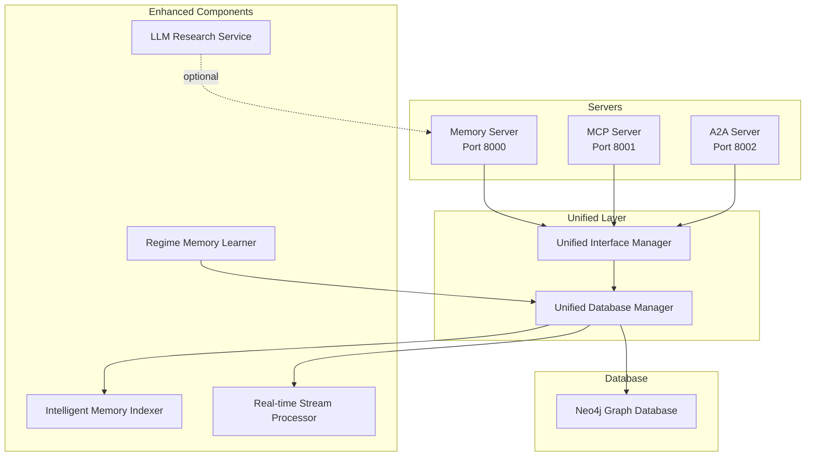
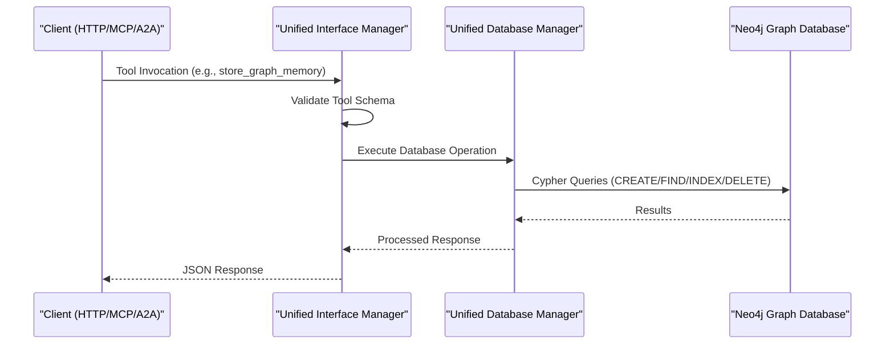
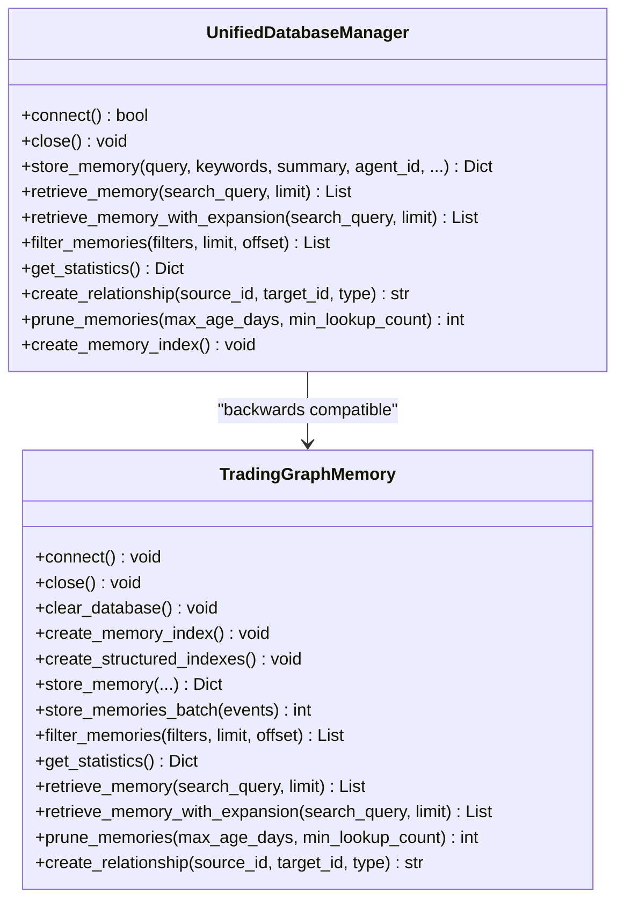
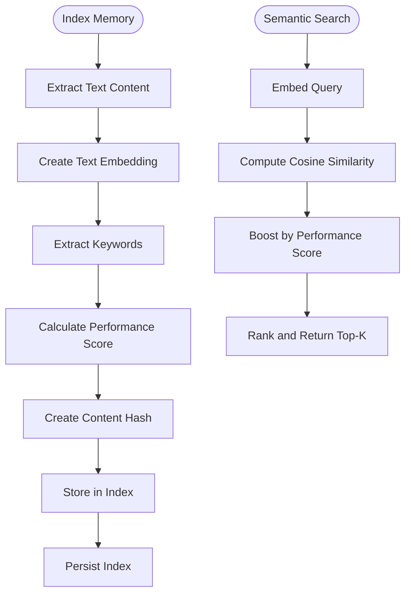
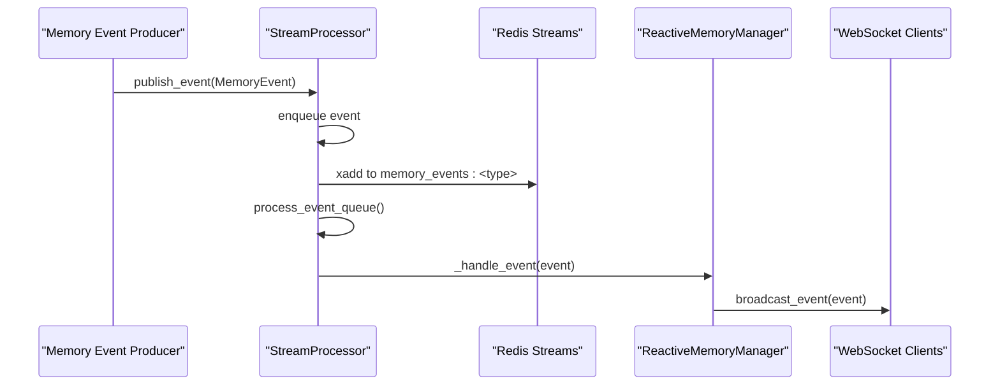
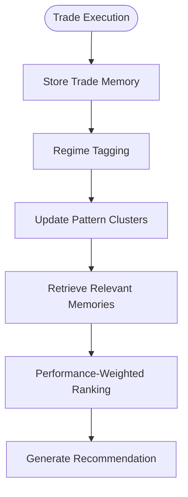
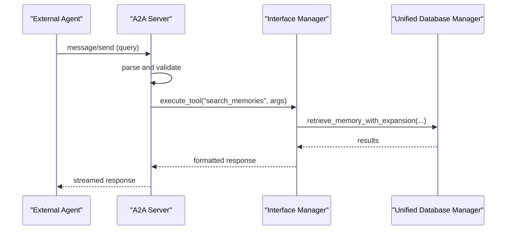
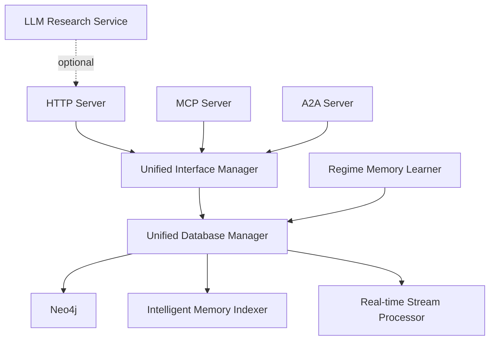

# Memory System

<cite>
**Referenced Files in This Document**
- [README.md](file://FinAgents/memory/README.md)
- [MEMORY_SYSTEM_ARCHITECTURE.md](file://FinAgents/memory/furtherdocumentation/MEMORY_SYSTEM_ARCHITECTURE.md)
- [MEMORY_SYSTEM_COMPLETE_SUMMARY.md](file://FinAgents/memory/furtherdocumentation/MEMORY_SYSTEM_COMPLETE_SUMMARY.md)
- [database.py](file://FinAgents/memory/database.py)
- [unified_database_manager.py](file://FinAgents/memory/unified_database_manager.py)
- [unified_interface_manager.py](file://FinAgents/memory/unified_interface_manager.py)
- [intelligent_memory_indexer.py](file://FinAgents/memory/intelligent_memory_indexer.py)
- [regime_memory_learner.py](file://FinAgents/memory/regime_memory_learner.py)
- [realtime_stream_processor.py](file://FinAgents/memory/realtime_stream_processor.py)
- [memory_server.py](file://FinAgents/memory/memory_server.py)
- [mcp_server.py](file://FinAgents/memory/mcp_server.py)
- [a2a_server.py](file://FinAgents/memory/a2a_server.py)
- [llm_research_service.py](file://FinAgents/memory/llm_research_service.py)
</cite>

## Table of Contents
1. [Introduction](#introduction)
2. [Project Structure](#project-structure)
3. [Core Components](#core-components)
4. [Architecture Overview](#architecture-overview)
5. [Detailed Component Analysis](#detailed-component-analysis)
6. [Dependency Analysis](#dependency-analysis)
7. [Performance Considerations](#performance-considerations)
8. [Troubleshooting Guide](#troubleshooting-guide)
9. [Conclusion](#conclusion)

## Introduction
The FinAgent Memory System is a graph-based knowledge database built on Neo4j that powers persistent state and learning across the trading platform. Unlike traditional vector RAG systems, it emphasizes relationship-aware semantic search, enabling multi-agent coordination and implicit knowledge sharing. The system supports three communication protocols—HTTP REST, Model Context Protocol (MCP), and Agent-to-Agent (A2A)—through a unified interface and database management layer. It provides intelligent indexing, real-time streaming, and regime-specific learning to enhance agent decision-making and system-wide learning.

## Project Structure
The Memory System is organized into modular components:
- Servers: HTTP REST (port 8000), MCP (port 8001), A2A (port 8002)
- Unified Managers: Interface Manager (tool definitions and routing), Database Manager (Neo4j operations)
- Enhanced Components: Intelligent Memory Indexer (semantic embeddings), Real-time Stream Processor (event streaming), Regime Memory Learner (pattern learning), LLM Research Service (optional OpenAI integration)
- Supporting Utilities: Configuration, health checks, and testing infrastructure

**Diagram sources**
- [README.md:31-83](file://FinAgents/memory/README.md#L31-L83)
- [unified_interface_manager.py:105-131](file://FinAgents/memory/unified_interface_manager.py#L105-L131)
- [unified_database_manager.py:104-167](file://FinAgents/memory/unified_database_manager.py#L104-L167)
- [intelligent_memory_indexer.py:40-81](file://FinAgents/memory/intelligent_memory_indexer.py#L40-L81)
- [realtime_stream_processor.py:54-81](file://FinAgents/memory/realtime_stream_processor.py#L54-L81)
- [regime_memory_learner.py:159-176](file://FinAgents/memory/regime_memory_learner.py#L159-L176)
- [llm_research_service.py:57-70](file://FinAgents/memory/llm_research_service.py#L57-L70)

**Section sources**
- [README.md:7-48](file://FinAgents/memory/README.md#L7-L48)
- [MEMORY_SYSTEM_ARCHITECTURE.md:9-83](file://FinAgents/memory/furtherdocumentation/MEMORY_SYSTEM_ARCHITECTURE.md#L9-L83)

## Core Components
- Unified Interface Manager: Protocol-agnostic tool definitions and execution engine supporting MCP, HTTP, and A2A. It standardizes tool schemas, manages dynamic tool registration, and provides conversation and analytics integration.
- Unified Database Manager: Centralized Neo4j operations including memory storage, retrieval, filtering, statistics, relationship management, and pruning. It integrates intelligent indexing and stream processing capabilities.
- Intelligent Memory Indexer: Adds semantic search using embeddings (sentence-transformers or TF-IDF), keyword extraction, performance scoring, and trending keyword analysis.
- Real-time Stream Processor: Event streaming and reactive memory management with Redis-backed queues, WebSocket broadcasting, and alerting.
- Regime Memory Learner: File-based storage and pattern learning for regime-specific trading memories, enabling cross-agent knowledge transfer and performance-weighted retrieval.
- LLM Research Service: Optional OpenAI integration for advanced research insights, pattern analysis, and semantic search enhancement.

**Section sources**
- [unified_interface_manager.py:105-156](file://FinAgents/memory/unified_interface_manager.py#L105-L156)
- [unified_database_manager.py:104-167](file://FinAgents/memory/unified_database_manager.py#L104-L167)
- [intelligent_memory_indexer.py:40-81](file://FinAgents/memory/intelligent_memory_indexer.py#L40-L81)
- [realtime_stream_processor.py:54-81](file://FinAgents/memory/realtime_stream_processor.py#L54-L81)
- [regime_memory_learner.py:159-176](file://FinAgents/memory/regime_memory_learner.py#L159-L176)
- [llm_research_service.py:57-70](file://FinAgents/memory/llm_research_service.py#L57-L70)

## Architecture Overview
The system implements a layered architecture:
- Protocol Layer: HTTP REST, MCP, and A2A servers expose unified tools via standardized interfaces.
- Interface Layer: Unified Interface Manager translates protocol-specific requests into tool invocations.
- Database Layer: Unified Database Manager executes Neo4j operations, indexes, and maintains relationships.
- Enhanced Layer: Intelligent Indexer, Stream Processor, Regime Learner, and optional LLM Research Service augment capabilities.

**Diagram sources**
- [unified_interface_manager.py:422-459](file://FinAgents/memory/unified_interface_manager.py#L422-L459)
- [unified_database_manager.py:233-353](file://FinAgents/memory/unified_database_manager.py#L233-L353)
- [database.py:49-113](file://FinAgents/memory/database.py#L49-L113)

**Section sources**
- [README.md:25-48](file://FinAgents/memory/README.md#L25-L48)
- [MEMORY_SYSTEM_ARCHITECTURE.md:87-155](file://FinAgents/memory/furtherdocumentation/MEMORY_SYSTEM_ARCHITECTURE.md#L87-L155)

## Detailed Component Analysis

### Unified Database Manager
The Unified Database Manager centralizes Neo4j operations with:
- Connection management and health monitoring
- Memory storage with intelligent linking and semantic indexing
- Retrieval with full-text search, expansion, and semantic search
- Filtering and analytics with structured criteria
- Relationship management and pruning
- Batch operations for throughput

**Diagram sources**
- [unified_database_manager.py:104-800](file://FinAgents/memory/unified_database_manager.py#L104-L800)
- [database.py:12-353](file://FinAgents/memory/database.py#L12-L353)

**Section sources**
- [unified_database_manager.py:104-800](file://FinAgents/memory/unified_database_manager.py#L104-L800)
- [database.py:12-353](file://FinAgents/memory/database.py#L12-L353)

### Intelligent Memory Indexer
The Intelligent Memory Indexer provides:
- Semantic embeddings using sentence-transformers or TF-IDF fallback
- Text preprocessing, keyword extraction, and performance scoring
- Semantic search, keyword search, related memory discovery, and trending keyword analysis
- Persistent index storage for fast retrieval

**Diagram sources**
- [intelligent_memory_indexer.py:186-308](file://FinAgents/memory/intelligent_memory_indexer.py#L186-L308)
- [intelligent_memory_indexer.py:446-507](file://FinAgents/memory/intelligent_memory_indexer.py#L446-L507)

**Section sources**
- [intelligent_memory_indexer.py:40-507](file://FinAgents/memory/intelligent_memory_indexer.py#L40-L507)

### Real-time Stream Processor
The Real-time Stream Processor enables:
- Event publishing and queueing with Redis or in-memory fallback
- Handler registration and event processing loops
- Batch analytics and alert triggering
- WebSocket broadcasting for live client updates

**Diagram sources**
- [realtime_stream_processor.py:111-143](file://FinAgents/memory/realtime_stream_processor.py#L111-L143)
- [realtime_stream_processor.py:168-200](file://FinAgents/memory/realtime_stream_processor.py#L168-L200)
- [realtime_stream_processor.py:318-342](file://FinAgents/memory/realtime_stream_processor.py#L318-L342)

**Section sources**
- [realtime_stream_processor.py:54-542](file://FinAgents/memory/realtime_stream_processor.py#L54-L542)

### Regime Memory Learner
The Regime Memory Learner supports:
- Regime-tagged memory storage and retrieval
- Similarity-based pattern matching and performance-weighted recall
- Cross-regime knowledge transfer and periodic pattern clustering
- Export and statistics for regime analysis

**Diagram sources**
- [regime_memory_learner.py:465-538](file://FinAgents/memory/regime_memory_learner.py#L465-L538)
- [regime_memory_learner.py:615-673](file://FinAgents/memory/regime_memory_learner.py#L615-L673)

**Section sources**
- [regime_memory_learner.py:159-715](file://FinAgents/memory/regime_memory_learner.py#L159-L715)

### Servers and Protocols
- Memory Server (HTTP REST): Exposes tools via FastAPI, supports unified and legacy modes, and integrates intelligent indexing and streaming.
- MCP Server: Dedicated MCP implementation with tool definitions, health checks, and combined HTTP endpoints.
- A2A Server: Agent-to-Agent protocol server with streaming, task execution, and memory agent integration.

**Diagram sources**
- [a2a_server.py:286-411](file://FinAgents/memory/a2a_server.py#L286-L411)
- [unified_interface_manager.py:422-459](file://FinAgents/memory/unified_interface_manager.py#L422-L459)
- [unified_database_manager.py:475-535](file://FinAgents/memory/unified_database_manager.py#L475-L535)

**Section sources**
- [memory_server.py:220-796](file://FinAgents/memory/memory_server.py#L220-L796)
- [mcp_server.py:110-287](file://FinAgents/memory/mcp_server.py#L110-L287)
- [a2a_server.py:228-488](file://FinAgents/memory/a2a_server.py#L228-L488)

### LLM Research Service
The LLM Research Service provides optional OpenAI-powered analysis:
- Memory pattern analysis and semantic search enhancement
- Research insights generation and relationship analysis
- Graceful fallback when LLM is unavailable

**Section sources**
- [llm_research_service.py:57-476](file://FinAgents/memory/llm_research_service.py#L57-L476)

## Dependency Analysis
The system exhibits low coupling and high cohesion:
- Unified Interface Manager decouples protocol implementations from database operations.
- Unified Database Manager encapsulates Neo4j concerns and delegates optional features to specialized components.
- Intelligent Indexer and Stream Processor are optional dependencies integrated at runtime.
- Servers depend on Unified Interface Manager for tool execution and Unified Database Manager for persistence.

**Diagram sources**
- [unified_interface_manager.py:105-156](file://FinAgents/memory/unified_interface_manager.py#L105-L156)
- [unified_database_manager.py:104-167](file://FinAgents/memory/unified_database_manager.py#L104-L167)
- [intelligent_memory_indexer.py:40-81](file://FinAgents/memory/intelligent_memory_indexer.py#L40-L81)
- [realtime_stream_processor.py:54-81](file://FinAgents/memory/realtime_stream_processor.py#L54-L81)
- [regime_memory_learner.py:159-176](file://FinAgents/memory/regime_memory_learner.py#L159-L176)
- [llm_research_service.py:57-70](file://FinAgents/memory/llm_research_service.py#L57-L70)

**Section sources**
- [unified_interface_manager.py:105-156](file://FinAgents/memory/unified_interface_manager.py#L105-L156)
- [unified_database_manager.py:104-167](file://FinAgents/memory/unified_database_manager.py#L104-L167)

## Performance Considerations
- Indexing Strategy: Full-text index on content_text and summary; property indexes on event_type, log_level, session_id, agent_id; optional vector index for semantic search.
- Query Patterns: Full-text search O(log n); keyword search O(n); graph traversal O(n + m); semantic search O(n) with embedding computation.
- Scalability: Recommended thresholds for enabling semantic search and clustering; shard by agent_id for very large deployments.
- Throughput: Batch operations for high-throughput scenarios; Redis-backed stream processing for real-time event handling.

**Section sources**
- [database.py:33-47](file://FinAgents/memory/database.py#L33-L47)
- [unified_database_manager.py:788-800](file://FinAgents/memory/unified_database_manager.py#L788-L800)
- [MEMORY_SYSTEM_ARCHITECTURE.md:702-724](file://FinAgents/memory/furtherdocumentation/MEMORY_SYSTEM_ARCHITECTURE.md#L702-L724)

## Troubleshooting Guide
Common issues and resolutions:
- Port Conflicts: Ensure ports 8000–8002 are free; check with system diagnostics.
- Database Connection: Verify Neo4j service status, credentials, and bolt://localhost:7687 accessibility.
- Environment Setup: Activate the agent conda environment and install dependencies.
- Service Status: Use the startup script’s status command to monitor all services.
- Logs: Inspect centralized logs under the logs directory for detailed error traces.

**Section sources**
- [README.md:305-378](file://FinAgents/memory/README.md#L305-L378)

## Conclusion
The FinAgent Memory System delivers a production-ready, relationship-aware knowledge graph that transcends traditional RAG by enabling multi-agent coordination, temporal chain tracking, and semantic similarity with automatic linking. Its modular architecture, unified interface, and optional enhancements (semantic search, real-time streaming, regime learning, LLM research) provide a scalable foundation for agent decision-making and system-wide learning. The documented APIs, tools, and patterns facilitate seamless integration across HTTP, MCP, and A2A protocols while maintaining performance and reliability at scale.