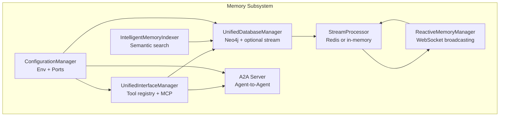
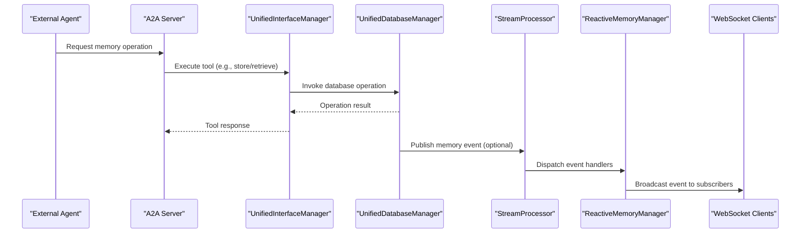
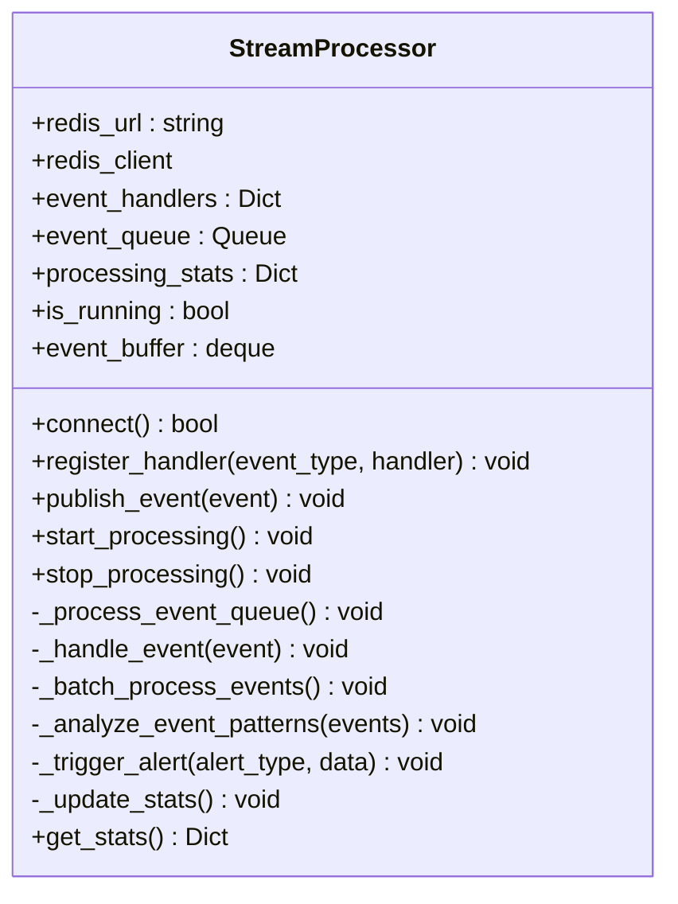
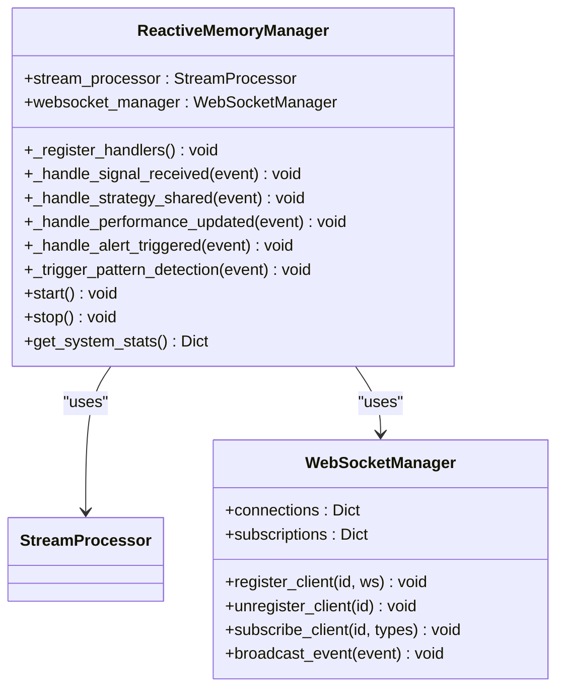
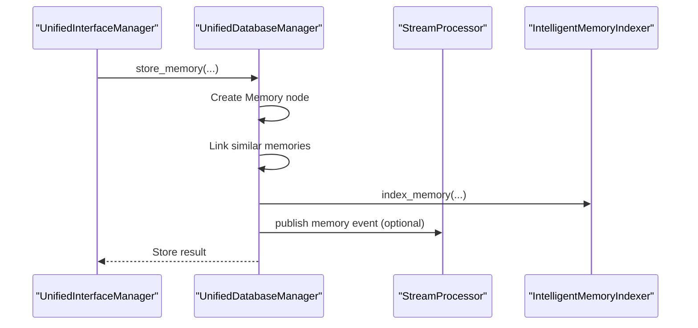
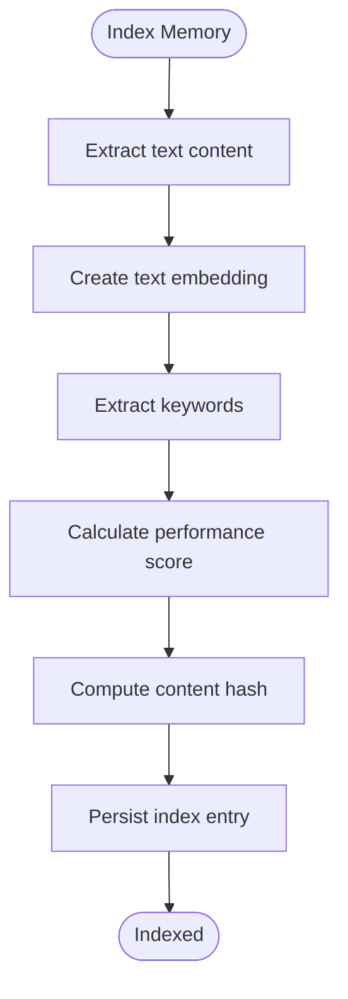
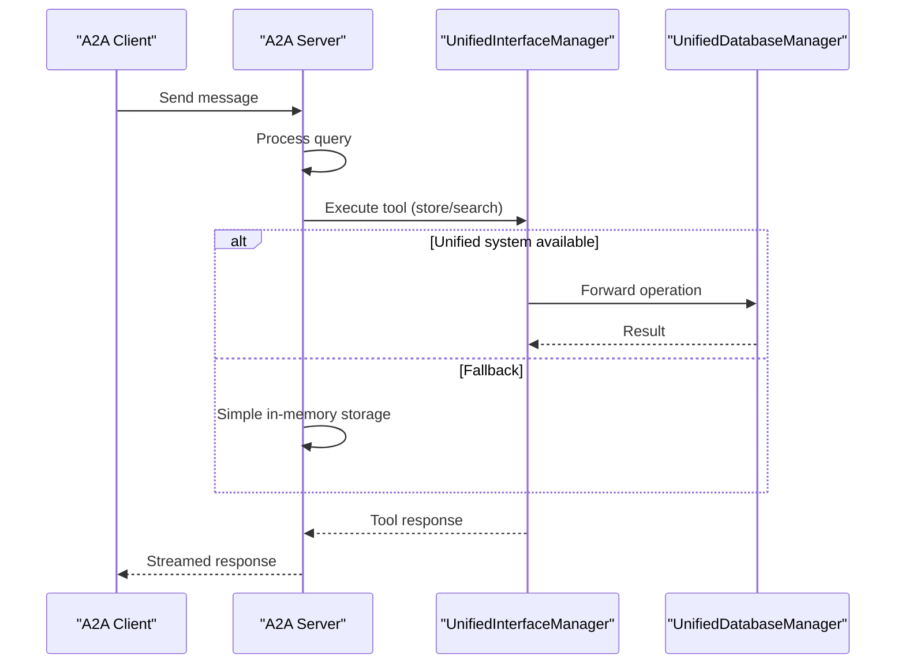
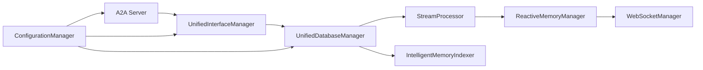

# Real-time Stream Processing

<cite>
**Referenced Files in This Document**
- [realtime_stream_processor.py](file://FinAgents/memory/realtime_stream_processor.py)
- [memory_server.py](file://FinAgents/memory/memory_server.py)
- [unified_database_manager.py](file://FinAgents/memory/unified_database_manager.py)
- [unified_interface_manager.py](file://FinAgents/memory/unified_interface_manager.py)
- [intelligent_memory_indexer.py](file://FinAgents/memory/intelligent_memory_indexer.py)
- [a2a_server.py](file://FinAgents/memory/a2a_server.py)
- [configuration_manager.py](file://FinAgents/memory/configuration_manager.py)
- [interface.py](file://FinAgents/memory/interface.py)
</cite>

## Table of Contents
1. [Introduction](#introduction)
2. [Project Structure](#project-structure)
3. [Core Components](#core-components)
4. [Architecture Overview](#architecture-overview)
5. [Detailed Component Analysis](#detailed-component-analysis)
6. [Dependency Analysis](#dependency-analysis)
7. [Performance Considerations](#performance-considerations)
8. [Troubleshooting Guide](#troubleshooting-guide)
9. [Conclusion](#conclusion)
10. [Appendices](#appendices)

## Introduction
This document explains the real-time memory stream processing capabilities implemented in the FinAgent memory subsystem. It focuses on the StreamProcessor implementation, reactive memory management, and event-driven architecture. It documents memory event handling, real-time processing pipelines, streaming data integration, and system-wide memory updates. It also covers stream processing configuration, performance monitoring, error handling strategies, and scalability considerations for high-throughput memory operations within the broader agent system.

## Project Structure
The memory subsystem is organized around:
- A real-time stream processor that ingests, buffers, and publishes memory events
- A reactive memory manager that subscribes to events and broadcasts them to WebSocket clients
- A unified database manager that coordinates database operations and optional stream processing
- A unified interface manager that exposes tools and orchestrates protocol integrations
- An intelligent memory indexer that powers semantic search and trend analysis
- An A2A server that integrates external agents and memory operations
- A configuration manager that centralizes environment-specific settings

**Diagram sources**
- [realtime_stream_processor.py:54-285](file://FinAgents/memory/realtime_stream_processor.py#L54-L285)
- [realtime_stream_processor.py:344-470](file://FinAgents/memory/realtime_stream_processor.py#L344-L470)
- [unified_database_manager.py:104-167](file://FinAgents/memory/unified_database_manager.py#L104-L167)
- [unified_interface_manager.py:105-170](file://FinAgents/memory/unified_interface_manager.py#L105-L170)
- [intelligent_memory_indexer.py:40-81](file://FinAgents/memory/intelligent_memory_indexer.py#L40-L81)
- [a2a_server.py:78-224](file://FinAgents/memory/a2a_server.py#L78-L224)
- [configuration_manager.py:235-486](file://FinAgents/memory/configuration_manager.py#L235-L486)

**Section sources**
- [realtime_stream_processor.py:1-542](file://FinAgents/memory/realtime_stream_processor.py#L1-L542)
- [memory_server.py:1-800](file://FinAgents/memory/memory_server.py#L1-L800)
- [unified_database_manager.py:1-800](file://FinAgents/memory/unified_database_manager.py#L1-L800)
- [unified_interface_manager.py:1-800](file://FinAgents/memory/unified_interface_manager.py#L1-L800)
- [intelligent_memory_indexer.py:1-507](file://FinAgents/memory/intelligent_memory_indexer.py#L1-L507)
- [a2a_server.py:1-659](file://FinAgents/memory/a2a_server.py#L1-L659)
- [configuration_manager.py:1-672](file://FinAgents/memory/configuration_manager.py#L1-L672)

## Core Components
- StreamProcessor: Asynchronous event ingestion, buffering, handler dispatch, and periodic analytics. Supports Redis-backed streams and graceful in-memory fallback.
- ReactiveMemoryManager: Registers event handlers, transforms events into real-time notifications, and broadcasts via WebSocket subscriptions.
- UnifiedDatabaseManager: Orchestrates Neo4j operations, integrates optional intelligent indexing and stream processing, and emits memory-related events.
- UnifiedInterfaceManager: Provides a unified tool interface across MCP, HTTP, A2A, and WebSocket protocols; registers tools and executes them consistently.
- IntelligentMemoryIndexer: Embedding-based semantic search, keyword extraction, performance scoring, and trending analysis.
- A2A Server: Agent-to-Agent protocol server integrating memory operations and streaming.
- ConfigurationManager: Centralizes environment-specific configuration for servers, ports, and feature toggles.

**Section sources**
- [realtime_stream_processor.py:54-285](file://FinAgents/memory/realtime_stream_processor.py#L54-L285)
- [realtime_stream_processor.py:344-470](file://FinAgents/memory/realtime_stream_processor.py#L344-L470)
- [unified_database_manager.py:104-167](file://FinAgents/memory/unified_database_manager.py#L104-L167)
- [unified_interface_manager.py:105-170](file://FinAgents/memory/unified_interface_manager.py#L105-L170)
- [intelligent_memory_indexer.py:40-81](file://FinAgents/memory/intelligent_memory_indexer.py#L40-L81)
- [a2a_server.py:78-224](file://FinAgents/memory/a2a_server.py#L78-L224)
- [configuration_manager.py:235-486](file://FinAgents/memory/configuration_manager.py#L235-L486)

## Architecture Overview
The system implements an event-driven architecture:
- Memory operations (storage, retrieval, filtering) are exposed as tools via UnifiedInterfaceManager.
- UnifiedDatabaseManager performs database operations and optionally triggers stream events.
- StreamProcessor receives and queues events, dispatches handlers, and periodically analyzes event patterns.
- ReactiveMemoryManager subscribes to specific event types and broadcasts them to WebSocket clients.
- IntelligentMemoryIndexer enhances retrieval with semantic search and analytics.
- A2A Server integrates external agents and forwards memory operations to the unified interface.

**Diagram sources**
- [memory_server.py:220-309](file://FinAgents/memory/memory_server.py#L220-L309)
- [unified_interface_manager.py:422-488](file://FinAgents/memory/unified_interface_manager.py#L422-L488)
- [unified_database_manager.py:233-353](file://FinAgents/memory/unified_database_manager.py#L233-L353)
- [realtime_stream_processor.py:111-143](file://FinAgents/memory/realtime_stream_processor.py#L111-L143)
- [realtime_stream_processor.py:192-200](file://FinAgents/memory/realtime_stream_processor.py#L192-L200)
- [realtime_stream_processor.py:318-342](file://FinAgents/memory/realtime_stream_processor.py#L318-L342)

## Detailed Component Analysis

### StreamProcessor Implementation
StreamProcessor manages asynchronous event ingestion and processing:
- Event queue with bounded capacity and timeouts
- Handler registration per event type
- Redis-backed stream publishing with JSON serialization
- Periodic analytics and alerts for high-activity patterns
- Stats collection and reporting

**Diagram sources**
- [realtime_stream_processor.py:54-285](file://FinAgents/memory/realtime_stream_processor.py#L54-L285)

Key behaviors:
- Redis availability is detected at startup; if unavailable, falls back to in-memory processing.
- Events are published to both an internal queue and Redis streams keyed by event type.
- Handlers are invoked asynchronously per event type; exceptions are logged and processing continues.
- A periodic analyzer inspects buffered events to detect high-activity patterns and emit alerts.
- Statistics include events per second, queue size, buffer size, and handler counts.

**Section sources**
- [realtime_stream_processor.py:82-96](file://FinAgents/memory/realtime_stream_processor.py#L82-L96)
- [realtime_stream_processor.py:97-110](file://FinAgents/memory/realtime_stream_processor.py#L97-L110)
- [realtime_stream_processor.py:111-143](file://FinAgents/memory/realtime_stream_processor.py#L111-L143)
- [realtime_stream_processor.py:144-167](file://FinAgents/memory/realtime_stream_processor.py#L144-L167)
- [realtime_stream_processor.py:168-191](file://FinAgents/memory/realtime_stream_processor.py#L168-L191)
- [realtime_stream_processor.py:201-216](file://FinAgents/memory/realtime_stream_processor.py#L201-L216)
- [realtime_stream_processor.py:217-243](file://FinAgents/memory/realtime_stream_processor.py#L217-L243)
- [realtime_stream_processor.py:244-257](file://FinAgents/memory/realtime_stream_processor.py#L244-L257)
- [realtime_stream_processor.py:258-275](file://FinAgents/memory/realtime_stream_processor.py#L258-L275)
- [realtime_stream_processor.py:276-285](file://FinAgents/memory/realtime_stream_processor.py#L276-L285)

### ReactiveMemoryManager and WebSocket Broadcasting
ReactiveMemoryManager binds StreamProcessor to WebSocket clients:
- Registers handlers for specific event types (signal received, strategy shared, performance updated, alerts)
- Broadcasts events to subscribed clients based on event type filters
- Triggers secondary events (e.g., pattern detection) for high-confidence signals

**Diagram sources**
- [realtime_stream_processor.py:344-470](file://FinAgents/memory/realtime_stream_processor.py#L344-L470)
- [realtime_stream_processor.py:288-342](file://FinAgents/memory/realtime_stream_processor.py#L288-L342)

Operational flow:
- On startup, handlers are registered for key memory events.
- For high-confidence signals, a pattern detection event is synthesized and published.
- WebSocket subscriptions are maintained per client; broadcasts occur only for subscribed event types.

**Section sources**
- [realtime_stream_processor.py:364-385](file://FinAgents/memory/realtime_stream_processor.py#L364-L385)
- [realtime_stream_processor.py:386-403](file://FinAgents/memory/realtime_stream_processor.py#L386-L403)
- [realtime_stream_processor.py:404-413](file://FinAgents/memory/realtime_stream_processor.py#L404-L413)
- [realtime_stream_processor.py:414-423](file://FinAgents/memory/realtime_stream_processor.py#L414-L423)
- [realtime_stream_processor.py:424-433](file://FinAgents/memory/realtime_stream_processor.py#L424-L433)
- [realtime_stream_processor.py:434-451](file://FinAgents/memory/realtime_stream_processor.py#L434-L451)
- [realtime_stream_processor.py:452-461](file://FinAgents/memory/realtime_stream_processor.py#L452-L461)
- [realtime_stream_processor.py:462-470](file://FinAgents/memory/realtime_stream_processor.py#L462-L470)
- [realtime_stream_processor.py:288-342](file://FinAgents/memory/realtime_stream_processor.py#L288-L342)

### Unified Database Manager and Stream Integration
UnifiedDatabaseManager coordinates database operations and optional stream processing:
- Connects to Neo4j with health monitoring and schema initialization
- Stores memories, retrieves with expansion, filters, and prunes
- Integrates IntelligentMemoryIndexer for semantic search
- Optionally initializes StreamProcessor and ReactiveMemoryManager
- Emits memory-related events to the stream processor

**Diagram sources**
- [unified_database_manager.py:233-353](file://FinAgents/memory/unified_database_manager.py#L233-L353)
- [unified_database_manager.py:142-161](file://FinAgents/memory/unified_database_manager.py#L142-L161)
- [intelligent_memory_indexer.py:186-255](file://FinAgents/memory/intelligent_memory_indexer.py#L186-L255)
- [unified_interface_manager.py:461-488](file://FinAgents/memory/unified_interface_manager.py#L461-L488)

**Section sources**
- [unified_database_manager.py:104-167](file://FinAgents/memory/unified_database_manager.py#L104-L167)
- [unified_database_manager.py:233-353](file://FinAgents/memory/unified_database_manager.py#L233-L353)
- [unified_database_manager.py:403-474](file://FinAgents/memory/unified_database_manager.py#L403-L474)
- [unified_database_manager.py:540-616](file://FinAgents/memory/unified_database_manager.py#L540-L616)
- [unified_database_manager.py:617-692](file://FinAgents/memory/unified_database_manager.py#L617-L692)
- [unified_database_manager.py:749-787](file://FinAgents/memory/unified_database_manager.py#L749-L787)

### Intelligent Memory Indexer
IntelligentMemoryIndexer provides semantic search and analytics:
- Embedding generation using transformer models or TF-IDF fallback
- Keyword extraction and performance scoring
- Semantic similarity search, keyword search, and related memory discovery
- Trending keyword extraction within time windows
- Persistent index storage and statistics

**Diagram sources**
- [intelligent_memory_indexer.py:186-255](file://FinAgents/memory/intelligent_memory_indexer.py#L186-L255)

**Section sources**
- [intelligent_memory_indexer.py:40-81](file://FinAgents/memory/intelligent_memory_indexer.py#L40-L81)
- [intelligent_memory_indexer.py:135-158](file://FinAgents/memory/intelligent_memory_indexer.py#L135-L158)
- [intelligent_memory_indexer.py:256-308](file://FinAgents/memory/intelligent_memory_indexer.py#L256-L308)
- [intelligent_memory_indexer.py:309-333](file://FinAgents/memory/intelligent_memory_indexer.py#L309-L333)
- [intelligent_memory_indexer.py:334-367](file://FinAgents/memory/intelligent_memory_indexer.py#L334-L367)
- [intelligent_memory_indexer.py:368-391](file://FinAgents/memory/intelligent_memory_indexer.py#L368-L391)
- [intelligent_memory_indexer.py:392-410](file://FinAgents/memory/intelligent_memory_indexer.py#L392-L410)
- [intelligent_memory_indexer.py:411-444](file://FinAgents/memory/intelligent_memory_indexer.py#L411-L444)

### A2A Server Integration
A2A Server integrates external agents and memory operations:
- Provides agent capabilities and skills for memory operations
- Streams responses and maintains message history
- Executes memory operations via UnifiedInterfaceManager when available
- Falls back to simple in-memory storage if the unified system is unavailable

**Diagram sources**
- [a2a_server.py:112-209](file://FinAgents/memory/a2a_server.py#L112-L209)
- [a2a_server.py:228-285](file://FinAgents/memory/a2a_server.py#L228-L285)
- [a2a_server.py:286-411](file://FinAgents/memory/a2a_server.py#L286-L411)
- [a2a_server.py:412-488](file://FinAgents/memory/a2a_server.py#L412-L488)

**Section sources**
- [a2a_server.py:78-111](file://FinAgents/memory/a2a_server.py#L78-L111)
- [a2a_server.py:112-209](file://FinAgents/memory/a2a_server.py#L112-L209)
- [a2a_server.py:228-285](file://FinAgents/memory/a2a_server.py#L228-L285)
- [a2a_server.py:286-411](file://FinAgents/memory/a2a_server.py#L286-L411)
- [a2a_server.py:412-488](file://FinAgents/memory/a2a_server.py#L412-L488)

### Configuration Management
ConfigurationManager centralizes environment-specific settings:
- Database, server, memory, MCP, A2A, logging, and port configurations
- Environment detection and auto-configuration
- Validation and export utilities

**Section sources**
- [configuration_manager.py:235-486](file://FinAgents/memory/configuration_manager.py#L235-L486)
- [configuration_manager.py:597-622](file://FinAgents/memory/configuration_manager.py#L597-L622)
- [configuration_manager.py:627-672](file://FinAgents/memory/configuration_manager.py#L627-L672)

## Dependency Analysis
The memory subsystem exhibits clear separation of concerns:
- StreamProcessor depends on Redis availability and is decoupled from database operations.
- ReactiveMemoryManager depends on StreamProcessor and WebSocketManager.
- UnifiedDatabaseManager optionally depends on StreamProcessor and IntelligentMemoryIndexer.
- UnifiedInterfaceManager depends on UnifiedDatabaseManager and exposes tools across protocols.
- A2A Server depends on UnifiedInterfaceManager for memory operations.
- ConfigurationManager influences all components via environment-specific settings.

**Diagram sources**
- [realtime_stream_processor.py:54-285](file://FinAgents/memory/realtime_stream_processor.py#L54-L285)
- [realtime_stream_processor.py:344-470](file://FinAgents/memory/realtime_stream_processor.py#L344-L470)
- [unified_database_manager.py:104-167](file://FinAgents/memory/unified_database_manager.py#L104-L167)
- [unified_interface_manager.py:105-170](file://FinAgents/memory/unified_interface_manager.py#L105-L170)
- [a2a_server.py:78-224](file://FinAgents/memory/a2a_server.py#L78-L224)
- [configuration_manager.py:235-486](file://FinAgents/memory/configuration_manager.py#L235-L486)

**Section sources**
- [realtime_stream_processor.py:54-285](file://FinAgents/memory/realtime_stream_processor.py#L54-L285)
- [unified_database_manager.py:104-167](file://FinAgents/memory/unified_database_manager.py#L104-L167)
- [unified_interface_manager.py:105-170](file://FinAgents/memory/unified_interface_manager.py#L105-L170)
- [a2a_server.py:78-224](file://FinAgents/memory/a2a_server.py#L78-L224)
- [configuration_manager.py:235-486](file://FinAgents/memory/configuration_manager.py#L235-L486)

## Performance Considerations
- Event throughput: StreamProcessor tracks events per second and exposes queue/buffer sizes for monitoring.
- Backpressure: The event queue has a bounded size; handlers should process quickly to avoid blocking.
- Redis scaling: When Redis is available, stream publishing scales horizontally; ensure Redis cluster sizing aligns with expected throughput.
- Indexing overhead: IntelligentMemoryIndexer adds computational cost for embeddings; consider model selection and caching strategies.
- WebSocket fan-out: Broadcasting to many clients increases network bandwidth; use subscription filtering to minimize unnecessary traffic.
- Batch operations: UnifiedDatabaseManager supports batch memory storage to reduce per-operation overhead.

[No sources needed since this section provides general guidance]

## Troubleshooting Guide
Common issues and resolutions:
- Redis connectivity failures: StreamProcessor logs warnings and falls back to in-memory processing; verify Redis availability and credentials.
- Handler exceptions: StreamProcessor logs errors per handler invocation; ensure handlers are resilient and do not block indefinitely.
- WebSocket client disconnects: WebSocketManager automatically unregisters clients on send failures; re-subscribe as needed.
- Database connection problems: UnifiedDatabaseManager reports connection failures; validate Neo4j credentials and network access.
- Tool execution errors: UnifiedInterfaceManager wraps tool calls and returns structured error responses; inspect error messages and exception types.
- A2A fallback behavior: If unified memory is unavailable, A2A Server falls back to simple in-memory storage; confirm system readiness.

**Section sources**
- [realtime_stream_processor.py:82-96](file://FinAgents/memory/realtime_stream_processor.py#L82-L96)
- [realtime_stream_processor.py:196-199](file://FinAgents/memory/realtime_stream_processor.py#L196-L199)
- [realtime_stream_processor.py:337-341](file://FinAgents/memory/realtime_stream_processor.py#L337-L341)
- [unified_database_manager.py:179-213](file://FinAgents/memory/unified_database_manager.py#L179-L213)
- [unified_interface_manager.py:451-458](file://FinAgents/memory/unified_interface_manager.py#L451-L458)
- [a2a_server.py:400-408](file://FinAgents/memory/a2a_server.py#L400-L408)

## Conclusion
The FinAgent memory subsystem provides a robust, event-driven real-time stream processing pipeline. StreamProcessor and ReactiveMemoryManager enable scalable, reactive memory updates with WebSocket broadcasting. UnifiedDatabaseManager integrates database operations with optional stream processing and semantic indexing. The system’s modular design, protocol-agnostic interface, and configuration management support seamless integration with the broader agent ecosystem and high-throughput memory operations.

[No sources needed since this section summarizes without analyzing specific files]

## Appendices

### Stream Processing Configuration
- Redis URL: Configure via StreamProcessor constructor; defaults to localhost.
- Event queue size: Controlled by Queue constructor; adjust for workload.
- Analytics interval: Batch processing runs every fixed interval; tune for desired analytics cadence.
- Alert thresholds: High-activity detection uses configurable thresholds; adjust based on expected baseline.

**Section sources**
- [realtime_stream_processor.py:59-79](file://FinAgents/memory/realtime_stream_processor.py#L59-L79)
- [realtime_stream_processor.py:205-216](file://FinAgents/memory/realtime_stream_processor.py#L205-L216)
- [realtime_stream_processor.py:234-242](file://FinAgents/memory/realtime_stream_processor.py#L234-L242)

### Real-time Analytics Examples
- High-activity pattern detection: Periodic analysis of buffered events triggers alerts for sustained high-frequency events.
- Performance monitoring: Events-per-second metrics and queue/buffer sizes provide immediate visibility into processing health.

**Section sources**
- [realtime_stream_processor.py:217-243](file://FinAgents/memory/realtime_stream_processor.py#L217-L243)
- [realtime_stream_processor.py:258-275](file://FinAgents/memory/realtime_stream_processor.py#L258-L275)

### Streaming Pipeline Setup
- Initialize StreamProcessor and connect to Redis (optional).
- Create ReactiveMemoryManager and start processing.
- Subscribe WebSocket clients to desired event types.
- Use UnifiedInterfaceManager tools to trigger memory operations; UnifiedDatabaseManager will publish events when configured.

**Section sources**
- [realtime_stream_processor.py:144-167](file://FinAgents/memory/realtime_stream_processor.py#L144-L167)
- [realtime_stream_processor.py:288-342](file://FinAgents/memory/realtime_stream_processor.py#L288-L342)
- [unified_interface_manager.py:422-488](file://FinAgents/memory/unified_interface_manager.py#L422-L488)
- [unified_database_manager.py:233-353](file://FinAgents/memory/unified_database_manager.py#L233-L353)

### Integration with the Broader Agent System
- UnifiedInterfaceManager exposes tools compatible with MCP, HTTP, A2A, and WebSocket protocols.
- A2A Server integrates external agents and forwards memory operations to the unified interface.
- ConfigurationManager centralizes environment-specific settings for all components.

**Section sources**
- [unified_interface_manager.py:175-372](file://FinAgents/memory/unified_interface_manager.py#L175-L372)
- [a2a_server.py:502-554](file://FinAgents/memory/a2a_server.py#L502-L554)
- [configuration_manager.py:429-486](file://FinAgents/memory/configuration_manager.py#L429-L486)