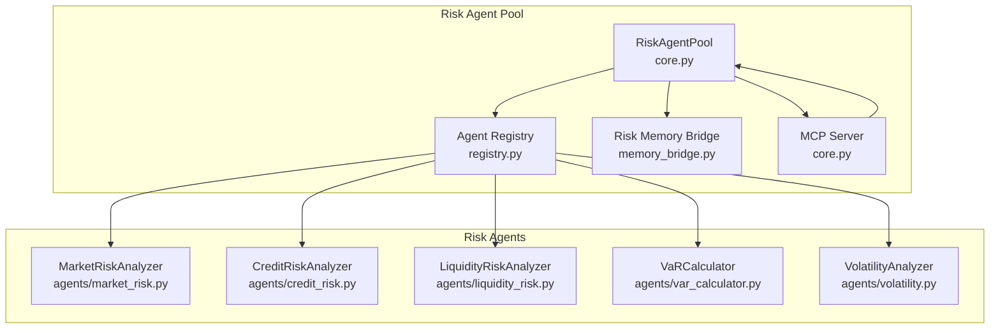
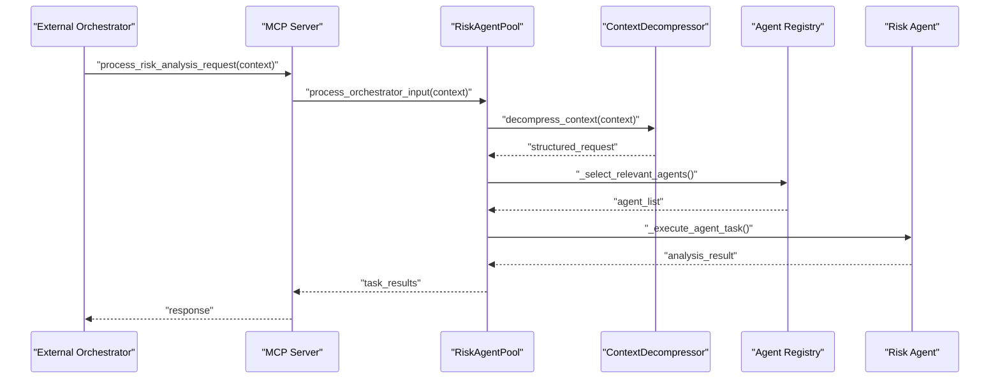
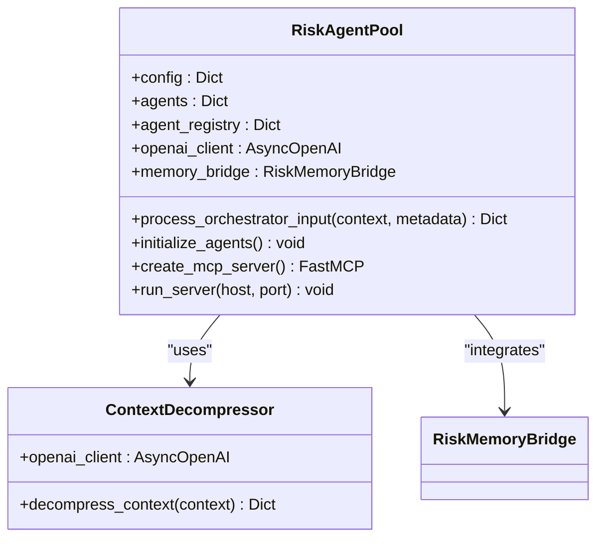
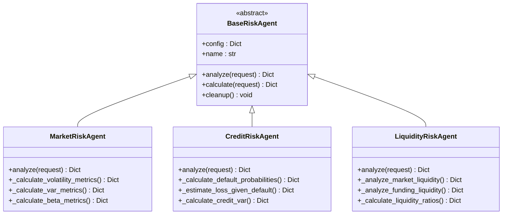
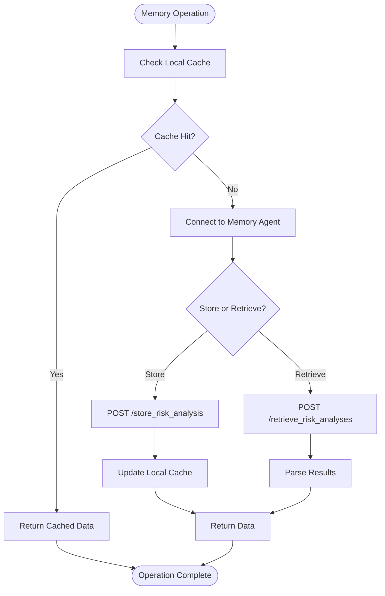
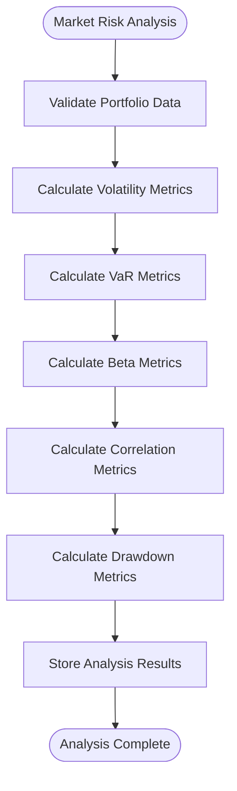
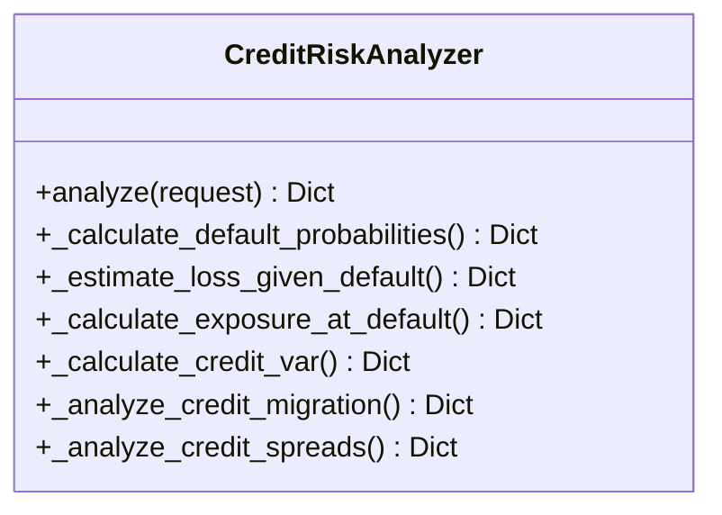
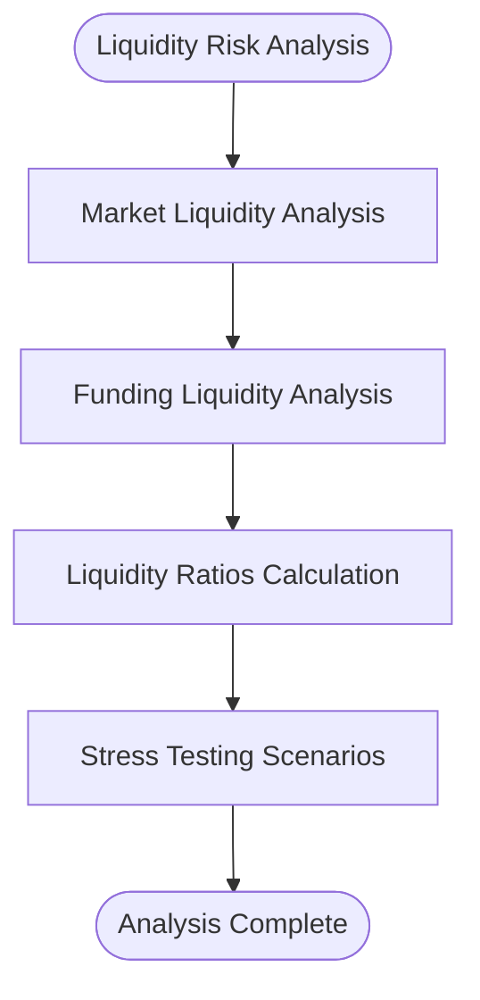
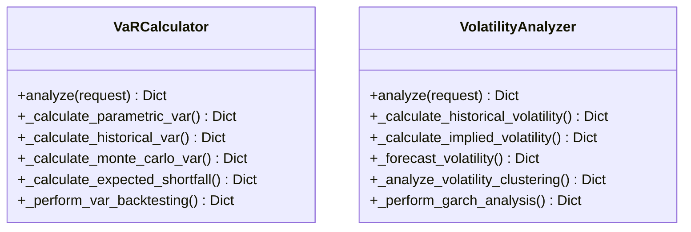
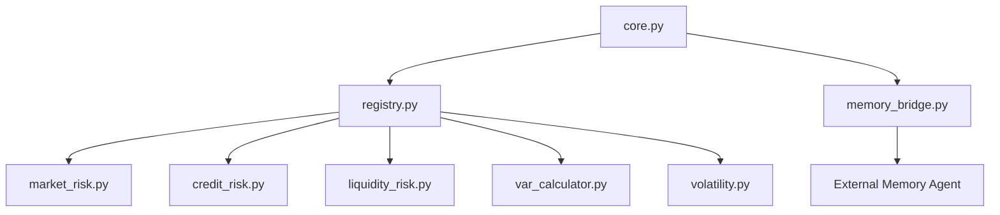

# Risk Agent Pool

<cite>
**Referenced Files in This Document**
- [core.py](file://FinAgents/agent_pools/risk_agent_pool/core.py)
- [__init__.py](file://FinAgents/agent_pools/risk_agent_pool/__init__.py)
- [README.md](file://FinAgents/agent_pools/risk_agent_pool/README.md)
- [memory_bridge.py](file://FinAgents/agent_pools/risk_agent_pool/memory_bridge.py)
- [registry.py](file://FinAgents/agent_pools/risk_agent_pool/registry.py)
- [example_demo.py](file://FinAgents/agent_pools/risk_agent_pool/example_demo.py)
- [market_risk.py](file://FinAgents/agent_pools/risk_agent_pool/agents/market_risk.py)
- [credit_risk.py](file://FinAgents/agent_pools/risk_agent_pool/agents/credit_risk.py)
- [liquidity_risk.py](file://FinAgents/agent_pools/risk_agent_pool/agents/liquidity_risk.py)
- [var_calculator.py](file://FinAgents/agent_pools/risk_agent_pool/agents/var_calculator.py)
- [volatility.py](file://FinAgents/agent_pools/risk_agent_pool/agents/volatility.py)
</cite>

## Table of Contents
1. [Introduction](#introduction)
2. [Project Structure](#project-structure)
3. [Core Components](#core-components)
4. [Architecture Overview](#architecture-overview)
5. [Detailed Component Analysis](#detailed-component-analysis)
6. [Dependency Analysis](#dependency-analysis)
7. [Performance Considerations](#performance-considerations)
8. [Troubleshooting Guide](#troubleshooting-guide)
9. [Conclusion](#conclusion)
10. [Appendices](#appendices)

## Introduction
The Risk Agent Pool is a comprehensive financial risk management system that orchestrates modular, extensible risk analysis agents. It integrates with external memory agents for data persistence, leverages OpenAI's language models for natural language context processing, and uses the Model Context Protocol (MCP) for task distribution and orchestration. The system supports market risk, credit risk, liquidity risk, operational risk, stress testing, and model risk analysis, enabling real-time risk monitoring and regulatory compliance checks.

## Project Structure
The Risk Agent Pool is organized around a central orchestrator that manages specialized risk agents, a registry for dynamic agent discovery, and a memory bridge for persistent storage and retrieval of risk data. The agents implement specific risk domains such as market risk, credit risk, and liquidity risk, while shared utilities provide VaR calculations, volatility analysis, and stress testing capabilities.

**Diagram sources**
- [core.py:137-583](file://FinAgents/agent_pools/risk_agent_pool/core.py#L137-L583)
- [registry.py:21-710](file://FinAgents/agent_pools/risk_agent_pool/registry.py#L21-L710)
- [memory_bridge.py:59-498](file://FinAgents/agent_pools/risk_agent_pool/memory_bridge.py#L59-L498)

**Section sources**
- [README.md:1-490](file://FinAgents/agent_pools/risk_agent_pool/README.md#L1-L490)
- [__init__.py:1-15](file://FinAgents/agent_pools/risk_agent_pool/__init__.py#L1-L15)

## Core Components
- RiskAgentPool: Central orchestrator with OpenAI integration and MCP server. Manages agent lifecycle, natural language processing, and task distribution.
- Agent Registry: Dynamic discovery and management of risk agents with preloaded default agents for market, credit, liquidity, operational, stress testing, and model risk.
- Risk Memory Bridge: Integration with external memory systems for storing and retrieving risk analysis results, model parameters, and historical data.
- Specialized Agents: Modular implementations for market risk, credit risk, liquidity risk, VaR calculation, volatility analysis, and stress testing.

**Section sources**
- [core.py:137-583](file://FinAgents/agent_pools/risk_agent_pool/core.py#L137-L583)
- [registry.py:21-710](file://FinAgents/agent_pools/risk_agent_pool/registry.py#L21-L710)
- [memory_bridge.py:59-498](file://FinAgents/agent_pools/risk_agent_pool/memory_bridge.py#L59-L498)

## Architecture Overview
The Risk Agent Pool employs a layered architecture:
- Presentation Layer: MCP server exposing risk analysis tools and health checks.
- Orchestration Layer: RiskAgentPool coordinating natural language processing, agent selection, and task execution.
- Domain Layer: Specialized risk agents implementing specific risk methodologies.
- Persistence Layer: Risk Memory Bridge managing data storage and retrieval.

**Diagram sources**
- [core.py:268-457](file://FinAgents/agent_pools/risk_agent_pool/core.py#L268-L457)
- [registry.py:389-424](file://FinAgents/agent_pools/risk_agent_pool/registry.py#L389-L424)

## Detailed Component Analysis

### RiskAgentPool Orchestration
The RiskAgentPool serves as the central coordinator, handling:
- Natural language processing using OpenAI to convert contextual requests into structured risk tasks
- Agent lifecycle management and dynamic loading
- MCP server creation with tools for risk analysis and status monitoring
- Memory bridge integration for persistent storage and retrieval
- Parallel task execution across multiple risk agents

**Diagram sources**
- [core.py:137-248](file://FinAgents/agent_pools/risk_agent_pool/core.py#L137-L248)

**Section sources**
- [core.py:137-583](file://FinAgents/agent_pools/risk_agent_pool/core.py#L137-L583)

### Agent Registry and Lifecycle Management
The registry provides dynamic agent discovery and management:
- BaseRiskAgent interface defining the common contract for all risk agents
- Preloaded default agents for market, credit, liquidity, operational, stress testing, and model risk
- Agent selection logic based on risk type and requested measures
- Parallel execution of multiple agents for comprehensive analysis

**Diagram sources**
- [registry.py:21-710](file://FinAgents/agent_pools/risk_agent_pool/registry.py#L21-L710)

**Section sources**
- [registry.py:21-710](file://FinAgents/agent_pools/risk_agent_pool/registry.py#L21-L710)

### Risk Memory Bridge
The memory bridge enables persistent storage and retrieval of risk data:
- RiskAnalysisRecord and RiskModelParameters data models
- HTTP integration with external memory agent for storage and retrieval
- Local caching with configurable TTL for improved performance
- Cross-analysis correlation tracking and performance metrics storage

**Diagram sources**
- [memory_bridge.py:119-221](file://FinAgents/agent_pools/risk_agent_pool/memory_bridge.py#L119-L221)

**Section sources**
- [memory_bridge.py:59-498](file://FinAgents/agent_pools/risk_agent_pool/memory_bridge.py#L59-L498)

### Market Risk Analysis
Market risk agents provide comprehensive market risk analysis:
- Volatility calculations using historical, EWMA, and GARCH methodologies
- Value at Risk (VaR) computation with parametric, historical, and Monte Carlo approaches
- Beta analysis and systematic risk decomposition
- Correlation analysis and principal component analysis
- Maximum drawdown and tail risk metrics

**Diagram sources**
- [market_risk.py:51-156](file://FinAgents/agent_pools/risk_agent_pool/agents/market_risk.py#L51-L156)

**Section sources**
- [market_risk.py:29-800](file://FinAgents/agent_pools/risk_agent_pool/agents/market_risk.py#L29-L800)

### Credit Risk Analysis
Credit risk agents implement comprehensive credit risk assessment:
- Probability of Default (PD) calculation using rating-based default rates
- Loss Given Default (LGD) estimation with sector and seniority adjustments
- Exposure at Default (EAD) calculation with credit conversion factors
- Credit VaR using Asymptotic Single Risk Factor (ASRF) model
- Credit migration analysis and spread analysis

**Diagram sources**
- [credit_risk.py:27-123](file://FinAgents/agent_pools/risk_agent_pool/agents/credit_risk.py#L27-L123)

**Section sources**
- [credit_risk.py:27-988](file://FinAgents/agent_pools/risk_agent_pool/agents/credit_risk.py#L27-L988)

### Liquidity Risk Analysis
Liquidity risk agents focus on market and funding liquidity assessment:
- Asset-level liquidity classification and market impact calculation
- Portfolio-level liquidity metrics and concentration analysis
- Funding liquidity analysis including maturity profile and rollover risk
- Contingency funding capacity assessment and stress testing scenarios

**Diagram sources**
- [liquidity_risk.py:39-101](file://FinAgents/agent_pools/risk_agent_pool/agents/liquidity_risk.py#L39-L101)

**Section sources**
- [liquidity_risk.py:25-1277](file://FinAgents/agent_pools/risk_agent_pool/agents/liquidity_risk.py#L25-L1277)

### VaR and Volatility Calculators
Specialized calculators provide advanced risk metric computations:
- VaRCalculator: Parametric, historical, and Monte Carlo VaR with backtesting and model validation
- VolatilityAnalyzer: Historical, implied, and GARCH volatility modeling with clustering detection

**Diagram sources**
- [var_calculator.py:26-137](file://FinAgents/agent_pools/risk_agent_pool/agents/var_calculator.py#L26-L137)
- [volatility.py:25-98](file://FinAgents/agent_pools/risk_agent_pool/agents/volatility.py#L25-L98)

**Section sources**
- [var_calculator.py:26-797](file://FinAgents/agent_pools/risk_agent_pool/agents/var_calculator.py#L26-L797)
- [volatility.py:25-714](file://FinAgents/agent_pools/risk_agent_pool/agents/volatility.py#L25-L714)

## Dependency Analysis
The Risk Agent Pool exhibits strong modularity with clear separation of concerns:
- Core depends on registry for agent management and memory_bridge for persistence
- Agents depend on BaseRiskAgent interface for common functionality
- Memory bridge depends on aiohttp for external communication
- All components use structured logging for observability

**Diagram sources**
- [core.py:192-201](file://FinAgents/agent_pools/risk_agent_pool/core.py#L192-L201)
- [registry.py:688-710](file://FinAgents/agent_pools/risk_agent_pool/registry.py#L688-L710)

**Section sources**
- [core.py:192-201](file://FinAgents/agent_pools/risk_agent_pool/core.py#L192-L201)
- [registry.py:688-710](file://FinAgents/agent_pools/risk_agent_pool/registry.py#L688-L710)

## Performance Considerations
- Asynchronous processing: All risk calculations leverage asyncio for non-blocking operations
- Parallel execution: Multiple agents can execute concurrently using asyncio.gather
- Caching strategy: Local caching with configurable TTL reduces external memory calls
- Memory management: Proper cleanup of agent resources during shutdown
- Configurable parameters: Tunable confidence levels, time horizons, and simulation counts

## Troubleshooting Guide
Common issues and resolutions:
- OpenAI API errors: Verify API key configuration and rate limits
- Memory agent connectivity: Check external memory service health and network connectivity
- Agent initialization failures: Review agent-specific dependencies and configuration
- Performance bottlenecks: Monitor execution times and adjust parallelism settings

**Section sources**
- [core.py:41-48](file://FinAgents/agent_pools/risk_agent_pool/core.py#L41-L48)
- [README.md:436-457](file://FinAgents/agent_pools/risk_agent_pool/README.md#L436-L457)

## Conclusion
The Risk Agent Pool provides a robust, extensible framework for comprehensive risk assessment and management. Its modular architecture enables easy integration of new risk agents, while the MCP protocol facilitates seamless interoperability with external systems. The combination of advanced risk methodologies, persistent storage capabilities, and real-time processing makes it suitable for production deployment in financial institutions requiring sophisticated risk management solutions.

## Appendices

### Configuration Examples
Environment variables for OpenAI integration and external memory connectivity.

**Section sources**
- [README.md:237-282](file://FinAgents/agent_pools/risk_agent_pool/README.md#L237-L282)

### Integration Patterns
- MCP client integration for automated risk analysis workflows
- External memory agent integration for persistent risk data storage
- Portfolio management system integration through standardized risk metrics

**Section sources**
- [example_demo.py:24-621](file://FinAgents/agent_pools/risk_agent_pool/example_demo.py#L24-L621)