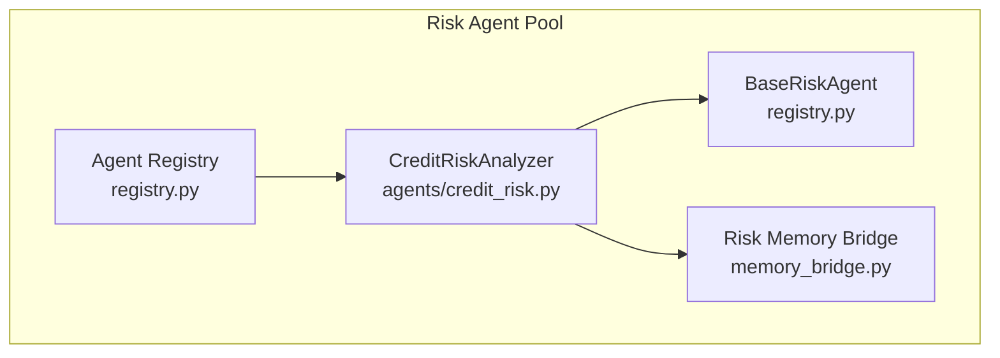
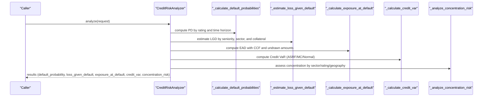
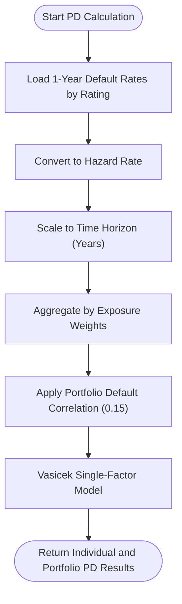
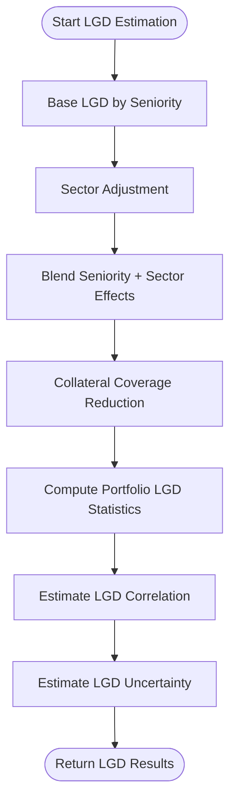
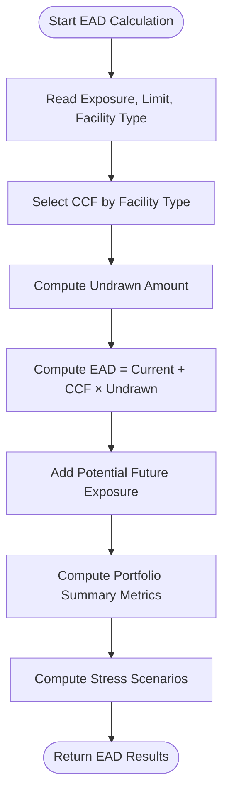
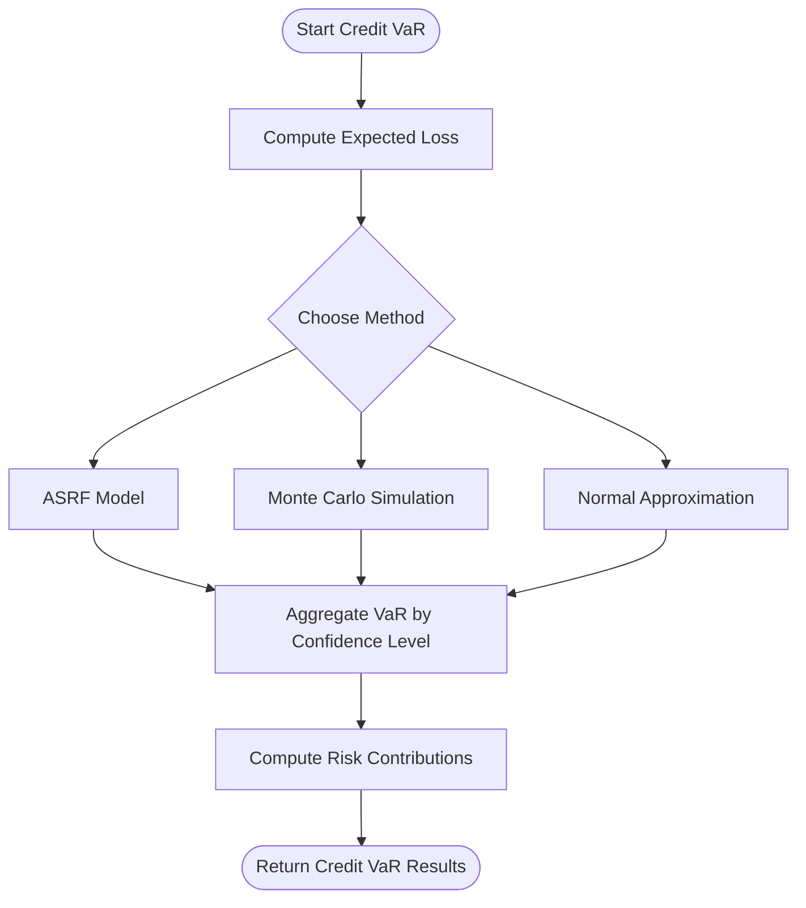
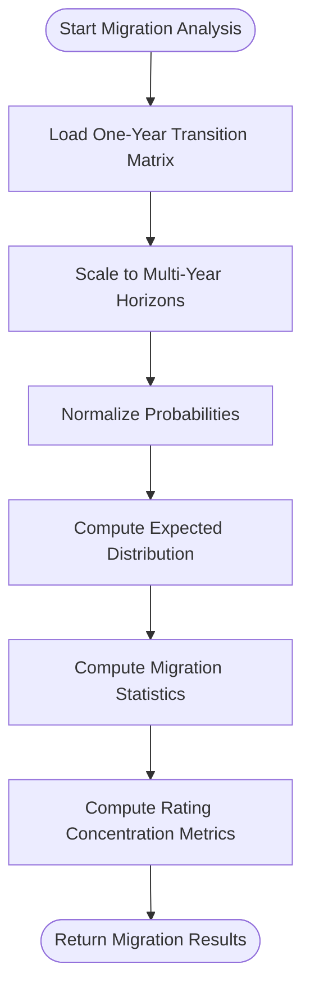
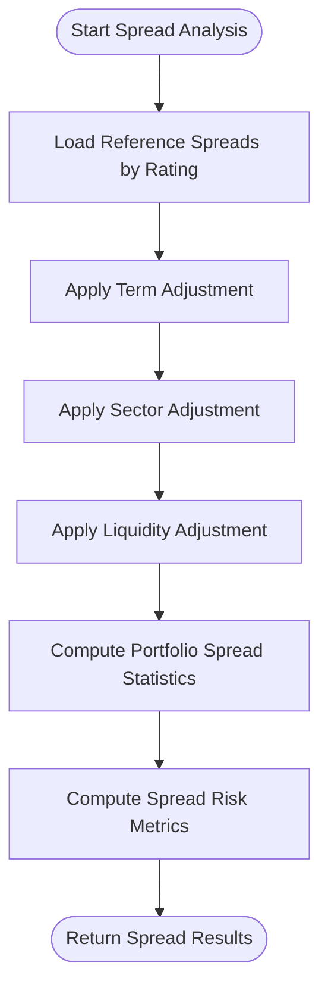
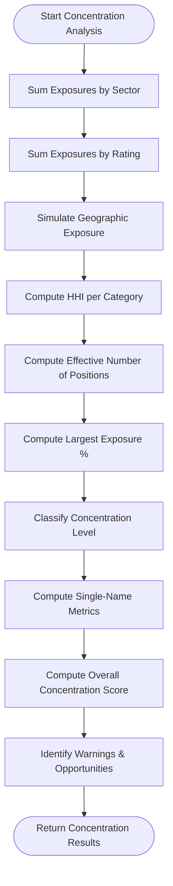
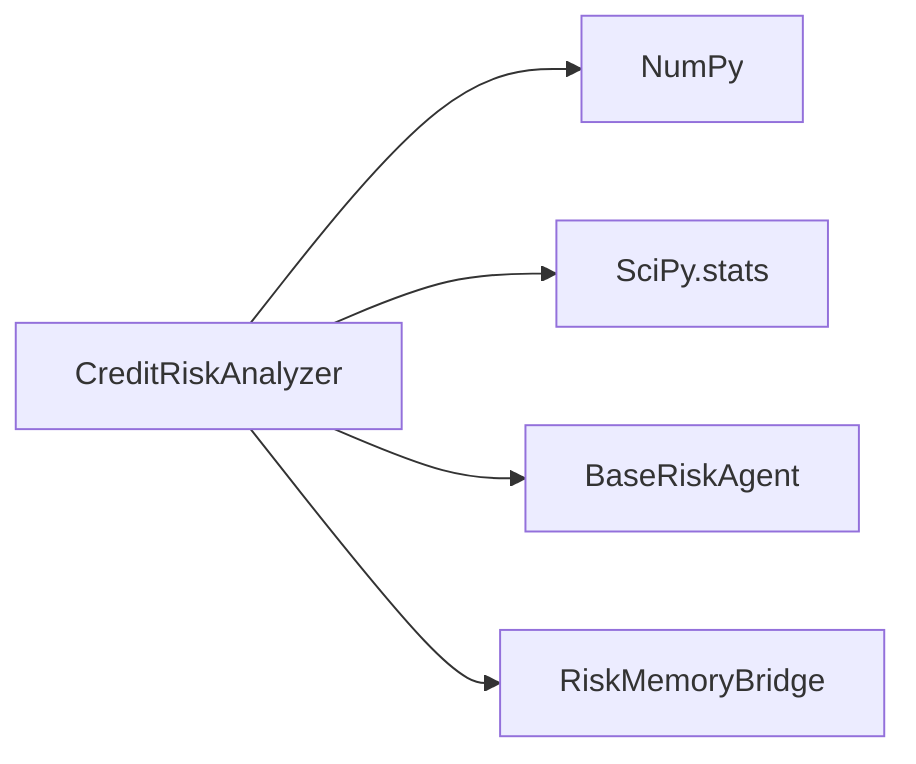

# Credit Risk Assessment

<cite>
**Referenced Files in This Document**
- [credit_risk.py](file://FinAgents/agent_pools/risk_agent_pool/agents/credit_risk.py)
- [registry.py](file://FinAgents/agent_pools/risk_agent_pool/registry.py)
- [README.md](file://FinAgents/agent_pools/risk_agent_pool/README.md)
- [memory_bridge.py](file://FinAgents/agent_pools/risk_agent_pool/memory_bridge.py)
</cite>

## Table of Contents
1. [Introduction](#introduction)
2. [Project Structure](#project-structure)
3. [Core Components](#core-components)
4. [Architecture Overview](#architecture-overview)
5. [Detailed Component Analysis](#detailed-component-analysis)
6. [Dependency Analysis](#dependency-analysis)
7. [Performance Considerations](#performance-considerations)
8. [Troubleshooting Guide](#troubleshooting-guide)
9. [Conclusion](#conclusion)

## Introduction
This document provides comprehensive technical documentation for the Credit Risk Assessment agent within the Agentic Trading Application. It explains the implementation of default probability modeling, credit rating analysis, counterparty risk evaluation, and related credit risk metrics such as Exposure at Default (EAD), Loss Given Default (LGD), Probability of Default (PD), Credit Value at Risk (Credit VaR), credit migration analysis, and credit spread analysis. It also covers credit concentration risk assessment, sectoral risk analysis, and counterparty default correlation modeling. Where applicable, the document outlines credit limit determination, collateral valuation integration, and regulatory capital requirements calculation. Finally, it documents data sources for credit analysis, model validation procedures, and integration with external credit databases.

## Project Structure
The Credit Risk Assessment agent resides in the Risk Agent Pool and is implemented as a specialized agent that extends the BaseRiskAgent interface. The agent orchestrates multiple credit risk calculations and returns structured results. The Risk Agent Pool also includes a registry for agent discovery and lifecycle management, and a memory bridge for persisting and retrieving risk analysis results and model parameters.

**Diagram sources**
- [credit_risk.py:27-41](file://FinAgents/agent_pools/risk_agent_pool/agents/credit_risk.py#L27-L41)
- [registry.py:21-54](file://FinAgents/agent_pools/risk_agent_pool/registry.py#L21-L54)
- [registry.py:688-710](file://FinAgents/agent_pools/risk_agent_pool/registry.py#L688-L710)
- [memory_bridge.py:59-83](file://FinAgents/agent_pools/risk_agent_pool/memory_bridge.py#L59-L83)

**Section sources**
- [README.md:1-490](file://FinAgents/agent_pools/risk_agent_pool/README.md#L1-L490)
- [registry.py:688-710](file://FinAgents/agent_pools/risk_agent_pool/registry.py#L688-L710)

## Core Components
- CreditRiskAnalyzer: Implements comprehensive credit risk analysis including PD, LGD, EAD, Credit VaR, migration, spreads, and concentration risk.
- BaseRiskAgent: Defines the common interface for all risk agents.
- Agent Registry: Manages agent registration and discovery.
- Risk Memory Bridge: Integrates with external memory systems for storing and retrieving risk analysis results and model parameters.

Key capabilities:
- Probability of Default (PD): Rating-based 1-year PDs converted to multi-year using hazard rates and modeled via a single-factor Vasicek model for portfolio distributions.
- Loss Given Default (LGD): Seniority and sector adjustments with collateral coverage reduction; LGD correlation and uncertainty estimation.
- Exposure at Default (EAD): Credit Conversion Factors (CCF) by facility type; undrawn commitment inclusion; stress scenarios.
- Credit VaR: Multiple methods (ASRF, Monte Carlo, Normal approximation); risk contribution analysis.
- Credit Migration: One-year transition matrices scaled to multi-year horizons; rating volatility and diversification metrics.
- Credit Spreads: Rating-based spreads with term, sector, and liquidity adjustments; spread risk metrics.
- Concentration Risk: Herfindahl-Hirschman Index (HHI), effective number of positions, largest exposure percentages; warnings and diversification opportunities.

**Section sources**
- [credit_risk.py:42-122](file://FinAgents/agent_pools/risk_agent_pool/agents/credit_risk.py#L42-L122)
- [credit_risk.py:124-186](file://FinAgents/agent_pools/risk_agent_pool/agents/credit_risk.py#L124-L186)
- [credit_risk.py:221-305](file://FinAgents/agent_pools/risk_agent_pool/agents/credit_risk.py#L221-L305)
- [credit_risk.py:338-441](file://FinAgents/agent_pools/risk_agent_pool/agents/credit_risk.py#L338-L441)
- [credit_risk.py:443-511](file://FinAgents/agent_pools/risk_agent_pool/agents/credit_risk.py#L443-L511)
- [credit_risk.py:625-690](file://FinAgents/agent_pools/risk_agent_pool/agents/credit_risk.py#L625-L690)
- [credit_risk.py:734-823](file://FinAgents/agent_pools/risk_agent_pool/agents/credit_risk.py#L734-L823)
- [credit_risk.py:825-988](file://FinAgents/agent_pools/risk_agent_pool/agents/credit_risk.py#L825-L988)
- [registry.py:21-54](file://FinAgents/agent_pools/risk_agent_pool/registry.py#L21-L54)

## Architecture Overview
The Credit Risk Assessment agent follows a modular, asynchronous design. The agent receives a structured request containing portfolio data and analysis parameters, performs targeted computations, and returns standardized results. Results can be persisted via the Risk Memory Bridge for auditing and historical analysis.

**Diagram sources**
- [credit_risk.py:42-122](file://FinAgents/agent_pools/risk_agent_pool/agents/credit_risk.py#L42-L122)
- [credit_risk.py:124-186](file://FinAgents/agent_pools/risk_agent_pool/agents/credit_risk.py#L124-L186)
- [credit_risk.py:221-305](file://FinAgents/agent_pools/risk_agent_pool/agents/credit_risk.py#L221-L305)
- [credit_risk.py:338-441](file://FinAgents/agent_pools/risk_agent_pool/agents/credit_risk.py#L338-L441)
- [credit_risk.py:443-511](file://FinAgents/agent_pools/risk_agent_pool/agents/credit_risk.py#L443-L511)
- [credit_risk.py:825-988](file://FinAgents/agent_pools/risk_agent_pool/agents/credit_risk.py#L825-L988)

## Detailed Component Analysis

### Probability of Default (PD) Modeling
- Individual PDs: Rating-based 1-year default rates mapped to hazard rates and scaled to multi-year using exponential decay.
- Portfolio PD: Expected defaults and standard deviation across obligors; portfolio default distribution via Vasicek single-factor model for confidence-based conditional default rates.
- Assumptions: Default correlation of 0.15; model type “vasicek_single_factor”; rating migration ignored in this calculation.

**Diagram sources**
- [credit_risk.py:124-186](file://FinAgents/agent_pools/risk_agent_pool/agents/credit_risk.py#L124-L186)
- [credit_risk.py:188-219](file://FinAgents/agent_pools/risk_agent_pool/agents/credit_risk.py#L188-L219)

**Section sources**
- [credit_risk.py:124-186](file://FinAgents/agent_pools/risk_agent_pool/agents/credit_risk.py#L124-L186)
- [credit_risk.py:188-219](file://FinAgents/agent_pools/risk_agent_pool/agents/credit_risk.py#L188-L219)

### Loss Given Default (LGD) Estimation
- Base LGD by seniority; sector adjustment blended with seniority; collateral coverage reduces LGD by proportional amount; portfolio LGD statistics (mean, std, percentiles).
- LGD correlation: Within-sector ~0.30, cross-sector ~0.15; LGD uncertainty estimated at 15% relative uncertainty.

**Diagram sources**
- [credit_risk.py:221-305](file://FinAgents/agent_pools/risk_agent_pool/agents/credit_risk.py#L221-L305)
- [credit_risk.py:307-336](file://FinAgents/agent_pools/risk_agent_pool/agents/credit_risk.py#L307-L336)

**Section sources**
- [credit_risk.py:221-305](file://FinAgents/agent_pools/risk_agent_pool/agents/credit_risk.py#L221-L305)
- [credit_risk.py:307-336](file://FinAgents/agent_pools/risk_agent_pool/agents/credit_risk.py#L307-L336)

### Exposure at Default (EAD) Calculation
- EAD = Current Exposure + CCF × Undrawn Amount; potential future exposure included; facility-type-specific CCFs; portfolio summary metrics; stress scenarios with increased utilization and CCF stress multiplier.

**Diagram sources**
- [credit_risk.py:338-441](file://FinAgents/agent_pools/risk_agent_pool/agents/credit_risk.py#L338-L441)

**Section sources**
- [credit_risk.py:338-441](file://FinAgents/agent_pools/risk_agent_pool/agents/credit_risk.py#L338-L441)

### Credit Value at Risk (Credit VaR)
- Expected Loss computed per exposure; Credit VaR via three methods:
  - Asymptotic Single Risk Factor (ASRF)
  - Monte Carlo simulation with systematic/idiosyncratic factors and asset correlation
  - Normal approximation with variance scaling
- Risk contributions by exposure; model parameters include asset correlation (0.15), time horizon, and confidence levels.

**Diagram sources**
- [credit_risk.py:443-511](file://FinAgents/agent_pools/risk_agent_pool/agents/credit_risk.py#L443-L511)
- [credit_risk.py:513-599](file://FinAgents/agent_pools/risk_agent_pool/agents/credit_risk.py#L513-L599)

**Section sources**
- [credit_risk.py:443-511](file://FinAgents/agent_pools/risk_agent_pool/agents/credit_risk.py#L443-L511)
- [credit_risk.py:513-599](file://FinAgents/agent_pools/risk_agent_pool/agents/credit_risk.py#L513-L599)

### Credit Migration Analysis
- One-year transition matrix scaled to multi-year using geometric scaling; normalized to form multi-year transitions; portfolio expected distribution after time horizon; migration statistics (upgrade/downgrade/default probability, rating volatility); concentration metrics (investment-grade/speculative-grade percentages, diversification score).

**Diagram sources**
- [credit_risk.py:625-690](file://FinAgents/agent_pools/risk_agent_pool/agents/credit_risk.py#L625-L690)

**Section sources**
- [credit_risk.py:625-690](file://FinAgents/agent_pools/risk_agent_pool/agents/credit_risk.py#L625-L690)

### Credit Spread Analysis
- Reference spreads by rating; term structure, sector, and liquidity adjustments; portfolio spread statistics (weighted average, percentiles); spread risk metrics (duration, DV01, spread VaR); market conditions classification.

**Diagram sources**
- [credit_risk.py:734-823](file://FinAgents/agent_pools/risk_agent_pool/agents/credit_risk.py#L734-L823)

**Section sources**
- [credit_risk.py:734-823](file://FinAgents/agent_pools/risk_agent_pool/agents/credit_risk.py#L734-L823)

### Credit Concentration Risk Assessment
- Concentration by sector, rating, and geography using HHI; effective number of positions; largest exposure percentage; classification of concentration level; single-name concentration metrics; overall concentration score (weighted average by dimension); warnings and diversification opportunities.

**Diagram sources**
- [credit_risk.py:825-988](file://FinAgents/agent_pools/risk_agent_pool/agents/credit_risk.py#L825-L988)

**Section sources**
- [credit_risk.py:825-988](file://FinAgents/agent_pools/risk_agent_pool/agents/credit_risk.py#L825-L988)

### Counterparty Risk Evaluation and Default Correlation Modeling
- Counterparty default correlation is integrated into portfolio-level PD modeling via the Vasicek single-factor model and Credit VaR calculations. The correlation assumption is 0.15 for both portfolio default correlation and asset correlation in VaR methods.
- LGD correlation is estimated with within-sector and cross-sector components to capture systematic economic cycle effects.

**Section sources**
- [credit_risk.py:162-168](file://FinAgents/agent_pools/risk_agent_pool/agents/credit_risk.py#L162-L168)
- [credit_risk.py:507-509](file://FinAgents/agent_pools/risk_agent_pool/agents/credit_risk.py#L507-L509)
- [credit_risk.py:307-321](file://FinAgents/agent_pools/risk_agent_pool/agents/credit_risk.py#L307-L321)

### Credit Scoring Models and Probability of Default Calculations
- The agent uses rating-class PDs derived from standard mappings and converts them to multi-year PDs using hazard rates. While explicit logistic or discriminant scoring models are not implemented, the PD computation aligns with typical credit scoring frameworks by translating observable credit attributes (ratings) into calibrated default probabilities.

**Section sources**
- [credit_risk.py:124-186](file://FinAgents/agent_pools/risk_agent_pool/agents/credit_risk.py#L124-L186)

### Exposure at Default Estimation
- EAD incorporates facility-type-specific CCFs and undrawn credit lines. Potential future exposure is considered for derivatives-like exposures. Stress scenarios simulate increased utilization and higher CCFs during downturns.

**Section sources**
- [credit_risk.py:338-441](file://FinAgents/agent_pools/risk_agent_pool/agents/credit_risk.py#L338-L441)

### Credit Concentration Risk Assessment
- HHI-based concentration metrics, diversification scores, and thresholds guide risk management decisions. Warnings and opportunities are surfaced for remediation actions.

**Section sources**
- [credit_risk.py:825-988](file://FinAgents/agent_pools/risk_agent_pool/agents/credit_risk.py#L825-L988)

### Sectoral Risk Analysis
- Sector-adjusted LGD and migration analysis incorporate sector-specific risk profiles. Sector concentration is measured alongside rating and geographic exposures.

**Section sources**
- [credit_risk.py:232-241](file://FinAgents/agent_pools/risk_agent_pool/agents/credit_risk.py#L232-L241)
- [credit_risk.py:625-690](file://FinAgents/agent_pools/risk_agent_pool/agents/credit_risk.py#L625-L690)
- [credit_risk.py:825-898](file://FinAgents/agent_pools/risk_agent_pool/agents/credit_risk.py#L825-L898)

### Counterparty Default Correlation Modeling
- Portfolio default correlation (0.15) and asset correlation assumptions (0.15) are used in Vasicek and VaR computations to reflect systemic dependence among counterparties.

**Section sources**
- [credit_risk.py:162-168](file://FinAgents/agent_pools/risk_agent_pool/agents/credit_risk.py#L162-L168)
- [credit_risk.py:507-509](file://FinAgents/agent_pools/risk_agent_pool/agents/credit_risk.py#L507-L509)

### Credit Limit Determination and Collateral Valuation Integration
- Credit limit and current exposure are used to compute undrawn amounts and apply CCFs. Collateral value reduces LGD and is integrated into LGD calculations. These inputs are part of the EAD and LGD modules.

**Section sources**
- [credit_risk.py:344-380](file://FinAgents/agent_pools/risk_agent_pool/agents/credit_risk.py#L344-L380)
- [credit_risk.py:247-277](file://FinAgents/agent_pools/risk_agent_pool/agents/credit_risk.py#L247-L277)

### Regulatory Capital Requirements Calculation
- Credit VaR results provide capital estimates at multiple confidence levels using ASRF, Monte Carlo, and Normal approximations. Risk contributions help allocate capital across exposures. The agent does not implement specific regulatory formulas (e.g., Basel IRB), but the outputs support regulatory capital estimation workflows.

**Section sources**
- [credit_risk.py:443-511](file://FinAgents/agent_pools/risk_agent_pool/agents/credit_risk.py#L443-L511)
- [credit_risk.py:513-599](file://FinAgents/agent_pools/risk_agent_pool/agents/credit_risk.py#L513-L599)

### Data Sources for Credit Analysis
- Internal portfolio data: exposures, ratings, sectors, facility types, credit limits, collateral values, and potential future exposure.
- External credit databases: Not integrated in the current implementation; the agent relies on internal mappings and assumptions.

**Section sources**
- [credit_risk.py:55-62](file://FinAgents/agent_pools/risk_agent_pool/agents/credit_risk.py#L55-L62)
- [credit_risk.py:128-131](file://FinAgents/agent_pools/risk_agent_pool/agents/credit_risk.py#L128-L131)
- [credit_risk.py:225-241](file://FinAgents/agent_pools/risk_agent_pool/agents/credit_risk.py#L225-L241)
- [credit_risk.py:349-356](file://FinAgents/agent_pools/risk_agent_pool/agents/credit_risk.py#L349-L356)
- [credit_risk.py:738-741](file://FinAgents/agent_pools/risk_agent_pool/agents/credit_risk.py#L738-L741)

### Model Validation Procedures
- The Risk Agent Pool includes a dedicated Model Risk Agent for model validation, performance monitoring, and governance. While the Credit Risk Analyzer does not implement explicit validation routines internally, results can be stored and tracked via the Risk Memory Bridge for auditability.

**Section sources**
- [registry.py:582-636](file://FinAgents/agent_pools/risk_agent_pool/registry.py#L582-L636)
- [memory_bridge.py:153-183](file://FinAgents/agent_pools/risk_agent_pool/memory_bridge.py#L153-L183)
- [memory_bridge.py:222-253](file://FinAgents/agent_pools/risk_agent_pool/memory_bridge.py#L222-L253)

### Integration with External Credit Databases
- No direct integration with external credit databases is present in the current implementation. The agent uses internal mappings for PDs, LGDs, spreads, and migration.

**Section sources**
- [credit_risk.py:128-131](file://FinAgents/agent_pools/risk_agent_pool/agents/credit_risk.py#L128-L131)
- [credit_risk.py:225-241](file://FinAgents/agent_pools/risk_agent_pool/agents/credit_risk.py#L225-L241)
- [credit_risk.py:738-741](file://FinAgents/agent_pools/risk_agent_pool/agents/credit_risk.py#L738-L741)

## Dependency Analysis
The Credit Risk Analyzer depends on:
- BaseRiskAgent for the common interface.
- NumPy and SciPy for numerical computations and statistical functions.
- Risk Memory Bridge for optional persistence of results and model parameters.

**Diagram sources**
- [credit_risk.py:16-24](file://FinAgents/agent_pools/risk_agent_pool/agents/credit_risk.py#L16-L24)
- [registry.py:21-54](file://FinAgents/agent_pools/risk_agent_pool/registry.py#L21-L54)
- [memory_bridge.py:59-83](file://FinAgents/agent_pools/risk_agent_pool/memory_bridge.py#L59-L83)

**Section sources**
- [credit_risk.py:16-24](file://FinAgents/agent_pools/risk_agent_pool/agents/credit_risk.py#L16-L24)
- [registry.py:21-54](file://FinAgents/agent_pools/risk_agent_pool/registry.py#L21-L54)
- [memory_bridge.py:59-83](file://FinAgents/agent_pools/risk_agent_pool/memory_bridge.py#L59-L83)

## Performance Considerations
- Asynchronous design enables non-blocking operations for better throughput.
- Monte Carlo simulations can be computationally intensive; consider configurable simulation counts and caching of repeated inputs.
- Numerical stability: Ensure proper normalization of transition matrices and handling of zero exposures.
- Memory usage: Large portfolios increase computation and memory footprint; batch processing and caching strategies recommended.

## Troubleshooting Guide
Common issues and resolutions:
- Missing or invalid portfolio data: Ensure portfolio_data contains required fields (credit_exposures, ratings, sectors).
- Unexpected errors: Check agent logs for stack traces; verify configuration parameters (time_horizons, confidence_levels).
- Memory bridge connectivity: Confirm external memory agent URL and network connectivity; fallback to local caching is supported.

**Section sources**
- [credit_risk.py:54-122](file://FinAgents/agent_pools/risk_agent_pool/agents/credit_risk.py#L54-L122)
- [memory_bridge.py:84-118](file://FinAgents/agent_pools/risk_agent_pool/memory_bridge.py#L84-L118)

## Conclusion
The Credit Risk Assessment agent provides a comprehensive suite of credit risk analytics, including PD, LGD, EAD, Credit VaR, migration, spreads, and concentration risk. It leverages standardized mappings and statistical models to produce actionable insights for risk management. While direct integration with external credit databases is not implemented, the agent’s results can be persisted and audited via the Risk Memory Bridge, and model governance is supported by the Model Risk Agent. The modular architecture allows for future enhancements, such as integrating external data sources and implementing advanced validation procedures.