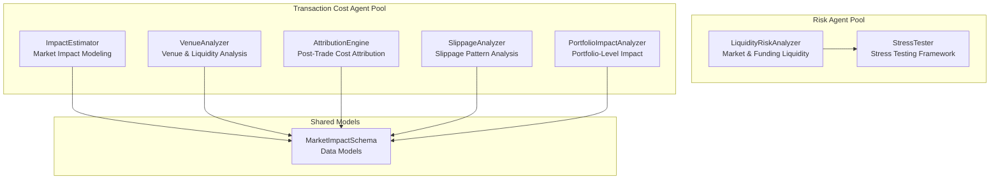
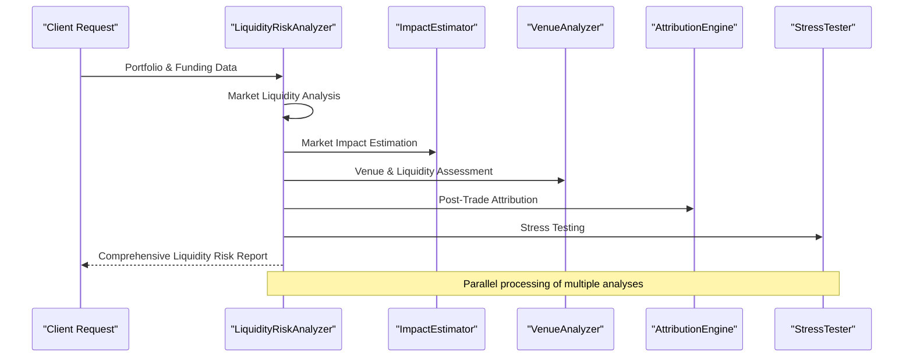
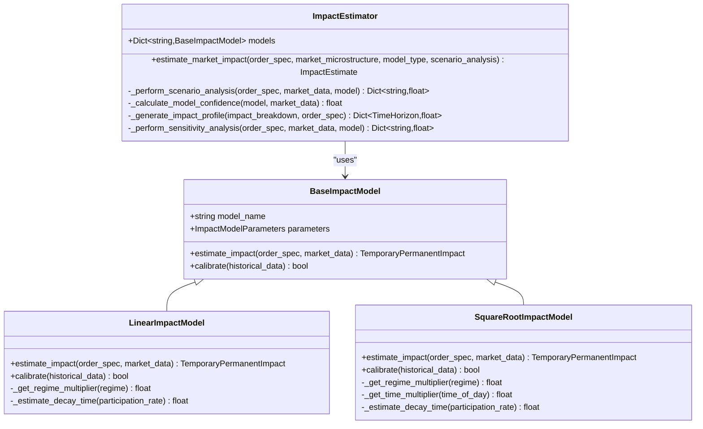
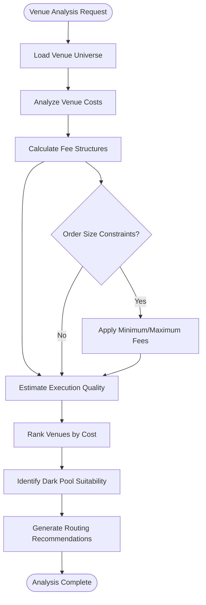
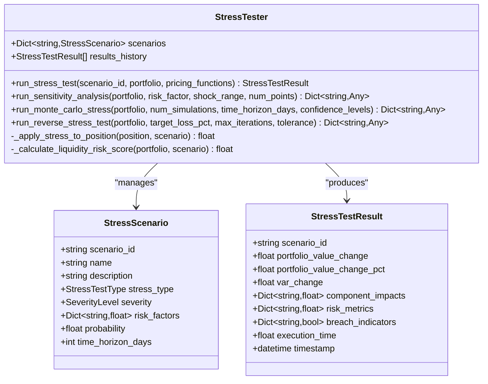
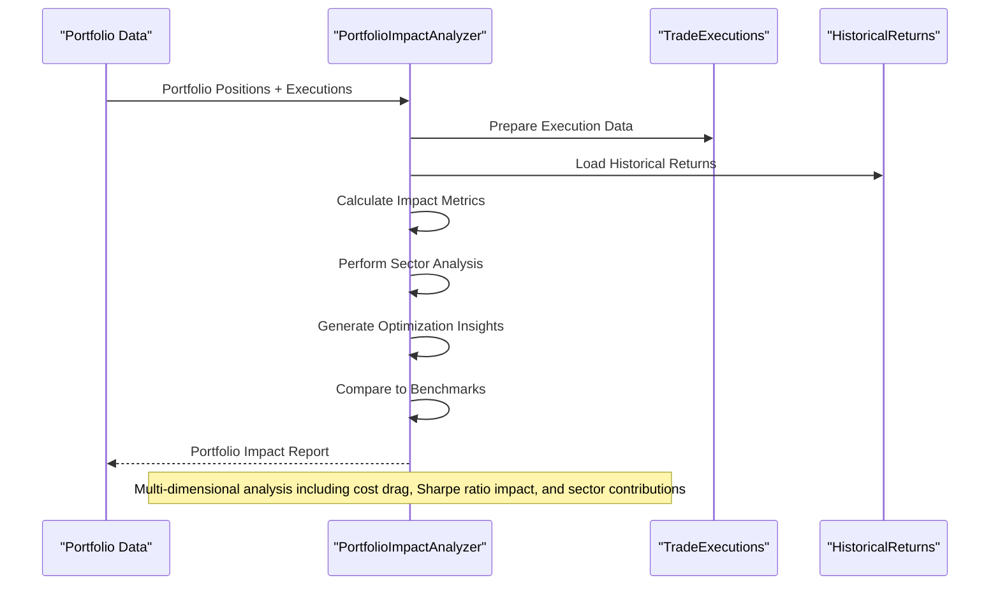
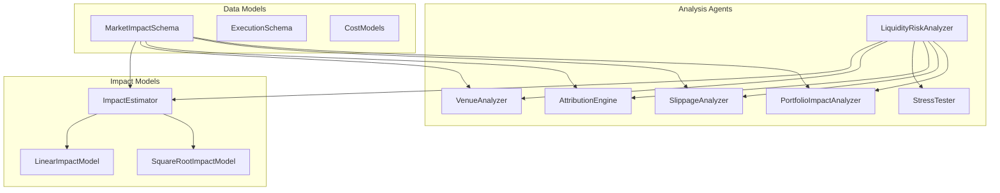

# Liquidity Risk Evaluator

<cite>
**Referenced Files in This Document**
- [liquidity_risk.py](file://FinAgents/agent_pools/risk_agent_pool/agents/liquidity_risk.py)
- [impact_estimator.py](file://FinAgents/agent_pools/transaction_cost_agent_pool/agents/pre_trade/impact_estimator.py)
- [market_impact_schema.py](file://FinAgents/agent_pools/transaction_cost_agent_pool/schema/market_impact_schema.py)
- [venue_analyzer.py](file://FinAgents/agent_pools/transaction_cost_agent_pool/agents/pre_trade/venue_analyzer.py)
- [attribution_engine.py](file://FinAgents/agent_pools/transaction_cost_agent_pool/agents/post_trade/attribution_engine.py)
- [slippage_analyzer.py](file://FinAgents/agent_pools/transaction_cost_agent_pool/agents/post_trade/slippage_analyzer.py)
- [portfolio_impact_analyzer.py](file://FinAgents/agent_pools/transaction_cost_agent_pool/agents/risk_adjusted/portfolio_impact_analyzer.py)
- [stress_testing.py](file://FinAgents/agent_pools/risk_agent_pool/agents/stress_testing.py)
- [risk_dashboard.py](file://FinAgents/research/risk_compliance/risk_dashboard.py)
</cite>

## Table of Contents
1. [Introduction](#introduction)
2. [Project Structure](#project-structure)
3. [Core Components](#core-components)
4. [Architecture Overview](#architecture-overview)
5. [Detailed Component Analysis](#detailed-component-analysis)
6. [Dependency Analysis](#dependency-analysis)
7. [Performance Considerations](#performance-considerations)
8. [Troubleshooting Guide](#troubleshooting-guide)
9. [Conclusion](#conclusion)

## Introduction
This document provides comprehensive technical documentation for the Liquidity Risk Evaluator agent ecosystem within the Agentic Trading Application. It focuses on bid-ask spread analysis, market impact assessment methodologies, funding liquidity monitoring, and portfolio-level liquidity risk evaluation. The documentation covers automated market maker analysis, dark pool integration, alternative venue liquidity assessment, real-time monitoring dashboards, early warning systems, and mitigation strategies for liquidity risk across portfolios.

## Project Structure
The Liquidity Risk Evaluator spans two primary agent pools:
- Risk Agent Pool: Core liquidity risk analysis, stress testing, and funding liquidity assessment
- Transaction Cost Agent Pool: Pre- and post-trade liquidity-related analyses, venue analysis, and portfolio impact evaluation

**Diagram sources**
- [liquidity_risk.py:25-100](file://FinAgents/agent_pools/risk_agent_pool/agents/liquidity_risk.py#L25-L100)
- [impact_estimator.py:325-376](file://FinAgents/agent_pools/transaction_cost_agent_pool/agents/pre_trade/impact_estimator.py#L325-L376)
- [market_impact_schema.py:165-233](file://FinAgents/agent_pools/transaction_cost_agent_pool/schema/market_impact_schema.py#L165-L233)
- [venue_analyzer.py:123-152](file://FinAgents/agent_pools/transaction_cost_agent_pool/agents/pre_trade/venue_analyzer.py#L123-L152)
- [attribution_engine.py:61-95](file://FinAgents/agent_pools/transaction_cost_agent_pool/agents/post_trade/attribution_engine.py#L61-L95)
- [slippage_analyzer.py:39-50](file://FinAgents/agent_pools/transaction_cost_agent_pool/agents/post_trade/slippage_analyzer.py#L39-L50)
- [portfolio_impact_analyzer.py:83-94](file://FinAgents/agent_pools/transaction_cost_agent_pool/agents/risk_adjusted/portfolio_impact_analyzer.py#L83-L94)

**Section sources**
- [liquidity_risk.py:1-1277](file://FinAgents/agent_pools/risk_agent_pool/agents/liquidity_risk.py#L1-L1277)
- [impact_estimator.py:1-724](file://FinAgents/agent_pools/transaction_cost_agent_pool/agents/pre_trade/impact_estimator.py#L1-L724)
- [market_impact_schema.py:1-283](file://FinAgents/agent_pools/transaction_cost_agent_pool/schema/market_impact_schema.py#L1-L283)
- [venue_analyzer.py:1-776](file://FinAgents/agent_pools/transaction_cost_agent_pool/agents/pre_trade/venue_analyzer.py#L1-L776)
- [attribution_engine.py:1-673](file://FinAgents/agent_pools/transaction_cost_agent_pool/agents/post_trade/attribution_engine.py#L1-L673)
- [slippage_analyzer.py:1-616](file://FinAgents/agent_pools/transaction_cost_agent_pool/agents/post_trade/slippage_analyzer.py#L1-L616)
- [portfolio_impact_analyzer.py:1-737](file://FinAgents/agent_pools/transaction_cost_agent_pool/agents/risk_adjusted/portfolio_impact_analyzer.py#L1-L737)
- [stress_testing.py:86-108](file://FinAgents/agent_pools/risk_agent_pool/agents/stress_testing.py#L86-L108)
- [risk_dashboard.py:456-488](file://FinAgents/research/risk_compliance/risk_dashboard.py#L456-L488)

## Core Components
The Liquidity Risk Evaluator comprises several specialized agents working in concert:

### LiquidityRiskAnalyzer
Primary agent for comprehensive liquidity risk analysis, including:
- Market liquidity assessment with asset classification and impact modeling
- Funding liquidity analysis with rollover risk and contingency funding
- Stress testing scenarios across mild, moderate, and severe conditions
- Bid-ask spread analysis and cash flow evaluation

### ImpactEstimator
Sophisticated market impact estimation with multiple modeling approaches:
- Linear and square-root impact models
- Temporary vs permanent impact decomposition
- Scenario analysis and confidence intervals
- Regime-aware modeling for different liquidity conditions

### VenueAnalyzer
Multi-venue liquidity and cost analysis:
- Automated market maker (dark pool) assessment
- Exchange and alternative venue evaluation
- Execution quality metrics and risk scoring
- Smart order routing recommendations

### AttributionEngine
Post-trade transaction cost attribution:
- Multi-factor cost decomposition
- Performance driver identification
- Risk factor attribution and benchmark comparison
- Strategy effectiveness measurement

**Section sources**
- [liquidity_risk.py:25-100](file://FinAgents/agent_pools/risk_agent_pool/agents/liquidity_risk.py#L25-L100)
- [impact_estimator.py:325-376](file://FinAgents/agent_pools/transaction_cost_agent_pool/agents/pre_trade/impact_estimator.py#L325-L376)
- [venue_analyzer.py:123-152](file://FinAgents/agent_pools/transaction_cost_agent_pool/agents/pre_trade/venue_analyzer.py#L123-L152)
- [attribution_engine.py:61-95](file://FinAgents/agent_pools/transaction_cost_agent_pool/agents/post_trade/attribution_engine.py#L61-L95)

## Architecture Overview
The Liquidity Risk Evaluator employs a modular, agent-based architecture with clear separation of concerns:

**Diagram sources**
- [liquidity_risk.py:39-100](file://FinAgents/agent_pools/risk_agent_pool/agents/liquidity_risk.py#L39-L100)
- [impact_estimator.py:370-461](file://FinAgents/agent_pools/transaction_cost_agent_pool/agents/pre_trade/impact_estimator.py#L370-L461)
- [venue_analyzer.py:234-301](file://FinAgents/agent_pools/transaction_cost_agent_pool/agents/pre_trade/venue_analyzer.py#L234-L301)
- [attribution_engine.py:103-185](file://FinAgents/agent_pools/transaction_cost_agent_pool/agents/post_trade/attribution_engine.py#L103-L185)
- [stress_testing.py:186-261](file://FinAgents/agent_pools/risk_agent_pool/agents/stress_testing.py#L186-L261)

## Detailed Component Analysis

### Market Impact Assessment Methodology
The ImpactEstimator implements sophisticated market impact modeling with multiple approaches:

**Diagram sources**
- [impact_estimator.py:60-104](file://FinAgents/agent_pools/transaction_cost_agent_pool/agents/pre_trade/impact_estimator.py#L60-L104)
- [impact_estimator.py:105-210](file://FinAgents/agent_pools/transaction_cost_agent_pool/agents/pre_trade/impact_estimator.py#L105-L210)
- [impact_estimator.py:210-324](file://FinAgents/agent_pools/transaction_cost_agent_pool/agents/pre_trade/impact_estimator.py#L210-L324)
- [impact_estimator.py:325-461](file://FinAgents/agent_pools/transaction_cost_agent_pool/agents/pre_trade/impact_estimator.py#L325-L461)

The impact estimation process incorporates:
- **Temporary vs Permanent Impact**: Decomposition of market impact into reversible and persistent components
- **Regime Adjustment**: Multipliers for high, normal, low, and stressed liquidity conditions
- **Scenario Analysis**: Best-case and worst-case impact projections
- **Confidence Intervals**: Statistical confidence bounds for impact estimates

**Section sources**
- [impact_estimator.py:105-324](file://FinAgents/agent_pools/transaction_cost_agent_pool/agents/pre_trade/impact_estimator.py#L105-L324)
- [market_impact_schema.py:123-164](file://FinAgents/agent_pools/transaction_cost_agent_pool/schema/market_impact_schema.py#L123-L164)

### Automated Market Maker Analysis
The VenueAnalyzer provides comprehensive dark pool and market maker assessment:

**Diagram sources**
- [venue_analyzer.py:234-301](file://FinAgents/agent_pools/transaction_cost_agent_pool/agents/pre_trade/venue_analyzer.py#L234-L301)
- [venue_analyzer.py:302-412](file://FinAgents/agent_pools/transaction_cost_agent_pool/agents/pre_trade/venue_analyzer.py#L302-L412)
- [venue_analyzer.py:483-551](file://FinAgents/agent_pools/transaction_cost_agent_pool/agents/pre_trade/venue_analyzer.py#L483-L551)

Key features include:
- **Multi-Venue Cost Comparison**: Fee structures, execution quality, and speed metrics
- **Dark Pool Integration**: Specialized assessment for off-exchange venues
- **Risk Factor Identification**: Credit risk, operational risk, and size constraint analysis
- **Optimization Framework**: Composite scoring for venue selection decisions

**Section sources**
- [venue_analyzer.py:153-233](file://FinAgents/agent_pools/transaction_cost_agent_pool/agents/pre_trade/venue_analyzer.py#L153-L233)
- [venue_analyzer.py:302-412](file://FinAgents/agent_pools/transaction_cost_agent_pool/agents/pre_trade/venue_analyzer.py#L302-L412)
- [venue_analyzer.py:552-712](file://FinAgents/agent_pools/transaction_cost_agent_pool/agents/pre_trade/venue_analyzer.py#L552-L712)

### Stress Liquidity Testing
The StressTester implements comprehensive stress testing for liquidity scenarios:

**Diagram sources**
- [stress_testing.py:41-71](file://FinAgents/agent_pools/risk_agent_pool/agents/stress_testing.py#L41-L71)
- [stress_testing.py:59-70](file://FinAgents/agent_pools/risk_agent_pool/agents/stress_testing.py#L59-L70)
- [stress_testing.py:86-108](file://FinAgents/agent_pools/risk_agent_pool/agents/stress_testing.py#L86-L108)

Stress testing capabilities include:
- **Historical Scenario Replay**: 2008 Financial Crisis and COVID-19 pandemic scenarios
- **Hypothetical Stress Tests**: Interest rate shocks and market stress conditions
- **Monte Carlo Simulations**: Probabilistic stress testing with correlation matrices
- **Reverse Stress Testing**: Identification of scenarios causing target losses

**Section sources**
- [stress_testing.py:109-170](file://FinAgents/agent_pools/risk_agent_pool/agents/stress_testing.py#L109-L170)
- [stress_testing.py:335-444](file://FinAgents/agent_pools/risk_agent_pool/agents/stress_testing.py#L335-L444)
- [stress_testing.py:445-530](file://FinAgents/agent_pools/risk_agent_pool/agents/stress_testing.py#L445-L530)

### Portfolio-Level Liquidity Impact Analysis
The PortfolioImpactAnalyzer evaluates transaction costs across entire portfolios:

**Diagram sources**
- [portfolio_impact_analyzer.py:138-215](file://FinAgents/agent_pools/transaction_cost_agent_pool/agents/risk_adjusted/portfolio_impact_analyzer.py#L138-L215)
- [portfolio_impact_analyzer.py:256-332](file://FinAgents/agent_pools/transaction_cost_agent_pool/agents/risk_adjusted/portfolio_impact_analyzer.py#L256-L332)
- [portfolio_impact_analyzer.py:361-420](file://FinAgents/agent_pools/transaction_cost_agent_pool/agents/risk_adjusted/portfolio_impact_analyzer.py#L361-L420)

**Section sources**
- [portfolio_impact_analyzer.py:83-215](file://FinAgents/agent_pools/transaction_cost_agent_pool/agents/risk_adjusted/portfolio_impact_analyzer.py#L83-L215)
- [portfolio_impact_analyzer.py:256-420](file://FinAgents/agent_pools/transaction_cost_agent_pool/agents/risk_adjusted/portfolio_impact_analyzer.py#L256-L420)

## Dependency Analysis
The Liquidity Risk Evaluator agents depend on shared data models and schemas:

**Diagram sources**
- [market_impact_schema.py:165-233](file://FinAgents/agent_pools/transaction_cost_agent_pool/schema/market_impact_schema.py#L165-L233)
- [impact_estimator.py:325-376](file://FinAgents/agent_pools/transaction_cost_agent_pool/agents/pre_trade/impact_estimator.py#L325-L376)
- [liquidity_risk.py:25-100](file://FinAgents/agent_pools/risk_agent_pool/agents/liquidity_risk.py#L25-L100)

**Section sources**
- [market_impact_schema.py:1-283](file://FinAgents/agent_pools/transaction_cost_agent_pool/schema/market_impact_schema.py#L1-L283)
- [impact_estimator.py:1-724](file://FinAgents/agent_pools/transaction_cost_agent_pool/agents/pre_trade/impact_estimator.py#L1-L724)
- [liquidity_risk.py:1-1277](file://FinAgents/agent_pools/risk_agent_pool/agents/liquidity_risk.py#L1-L1277)

## Performance Considerations
The Liquidity Risk Evaluator is designed for high-performance operation:

### Computational Efficiency
- **Parallel Processing**: Multiple analysis components execute concurrently
- **Vectorized Operations**: NumPy and Pandas operations for efficient data processing
- **Caching Mechanisms**: Venue performance history and market data caching
- **Asynchronous Execution**: Non-blocking operations for real-time analysis

### Memory Management
- **Streaming Data Processing**: Batch processing for large datasets
- **Efficient Data Structures**: Optimized dictionaries and arrays for metric calculations
- **Resource Cleanup**: Proper disposal of temporary objects and connections

### Scalability Features
- **Modular Design**: Independent agent components can scale separately
- **Configurable Parameters**: Adjustable analysis windows and thresholds
- **External Integration**: Pluggable interfaces for additional data sources

## Troubleshooting Guide

### Common Issues and Solutions

#### Market Impact Estimation Failures
**Problem**: Impact estimation errors or invalid results
**Causes**: 
- Missing market microstructure data
- Invalid order specifications
- Insufficient historical calibration data

**Solutions**:
- Validate input parameters before estimation
- Implement fallback models for missing data
- Log detailed error information for debugging

#### Venue Analysis Errors
**Problem**: Venue cost calculations produce unexpected results
**Causes**:
- Unsupported order types for specific venues
- Size constraint violations
- Venue unavailability or outages

**Solutions**:
- Verify venue capabilities against order specifications
- Implement size validation checks
- Monitor venue availability and performance

#### Stress Testing Anomalies
**Problem**: Stress test results show unrealistic scenarios
**Causes**:
- Correlation matrix issues
- Parameter validation failures
- Insufficient Monte Carlo samples

**Solutions**:
- Validate correlation matrices for positive definiteness
- Implement parameter bounds checking
- Increase Monte Carlo sample sizes for stability

**Section sources**
- [impact_estimator.py:173-176](file://FinAgents/agent_pools/transaction_cost_agent_pool/agents/pre_trade/impact_estimator.py#L173-L176)
- [venue_analyzer.py:299-301](file://FinAgents/agent_pools/transaction_cost_agent_pool/agents/pre_trade/venue_analyzer.py#L299-L301)
- [stress_testing.py:258-261](file://FinAgents/agent_pools/risk_agent_pool/agents/stress_testing.py#L258-L261)

## Conclusion
The Liquidity Risk Evaluator provides a comprehensive, modular framework for liquidity risk management in trading applications. Through integrated market impact modeling, venue analysis, stress testing, and portfolio-level impact assessment, it enables informed decision-making and risk mitigation across diverse market conditions. The system's real-time capabilities, automated analysis workflows, and extensible architecture support both current trading needs and future scalability requirements.

The documented components work together to provide:
- **Real-time Liquidity Monitoring**: Continuous assessment of market and funding liquidity conditions
- **Automated Risk Assessment**: Systematic evaluation of liquidity risk across multiple dimensions
- **Intelligent Venue Selection**: Data-driven recommendations for optimal execution venues
- **Stress Resilience Planning**: Comprehensive testing of liquidity risk under extreme market conditions
- **Performance Optimization**: Portfolio-level insights for minimizing transaction cost drag

This framework serves as a foundation for building robust liquidity risk management systems in modern trading environments.