# Market Risk Analyzer

<cite>
**Referenced Files in This Document**
- [market_risk.py](file://FinAgents/agent_pools/risk_agent_pool/agents/market_risk.py)
- [volatility.py](file://FinAgents/agent_pools/risk_agent_pool/agents/volatility.py)
- [var_calculator.py](file://FinAgents/agent_pools/risk_agent_pool/agents/var_calculator.py)
- [core.py](file://FinAgents/agent_pools/risk_agent_pool/core.py)
- [registry.py](file://FinAgents/agent_pools/risk_agent_pool/registry.py)
- [memory_bridge.py](file://FinAgents/agent_pools/risk_agent_pool/memory_bridge.py)
- [stress_testing.py](file://FinAgents/agent_pools/risk_agent_pool/agents/stress_testing.py)
- [volatility.py](file://backend/analytics/volatility.py)
</cite>

## Table of Contents
1. [Introduction](#introduction)
2. [Project Structure](#project-structure)
3. [Core Components](#core-components)
4. [Architecture Overview](#architecture-overview)
5. [Detailed Component Analysis](#detailed-component-analysis)
6. [Dependency Analysis](#dependency-analysis)
7. [Performance Considerations](#performance-considerations)
8. [Troubleshooting Guide](#troubleshooting-guide)
9. [Conclusion](#conclusion)

## Introduction
This document provides comprehensive documentation for the Market Risk Analyzer agent within the Agentic Trading Application. It explains volatility calculations (historical, EWMA, GARCH), Value at Risk (VaR) estimation using parametric, historical, and Monte Carlo methods with Expected Shortfall (CVaR), beta analysis, systematic risk measurement, correlation matrix analysis, maximum drawdown analysis, stress testing scenarios, and portfolio risk decomposition. It also covers configuration parameters, calculation methodologies, data requirements, integration patterns with the risk orchestrator, and practical examples for risk metric interpretation and portfolio optimization applications.

## Project Structure
The Market Risk Analyzer resides in the Risk Agent Pool alongside specialized agents for volatility, VaR calculation, stress testing, and others. The orchestrator coordinates agent execution via MCP tools and integrates with an external memory system for persistence and retrieval of risk analysis results.

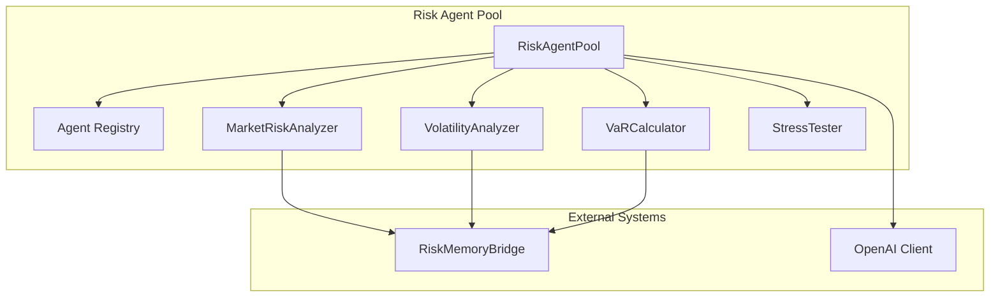

**Diagram sources**
- [core.py:137-520](file://FinAgents/agent_pools/risk_agent_pool/core.py#L137-L520)
- [registry.py:638-710](file://FinAgents/agent_pools/risk_agent_pool/registry.py#L638-L710)
- [memory_bridge.py:59-180](file://FinAgents/agent_pools/risk_agent_pool/memory_bridge.py#L59-L180)

**Section sources**
- [core.py:137-520](file://FinAgents/agent_pools/risk_agent_pool/core.py#L137-L520)
- [registry.py:638-710](file://FinAgents/agent_pools/risk_agent_pool/registry.py#L638-L710)
- [memory_bridge.py:59-180](file://FinAgents/agent_pools/risk_agent_pool/memory_bridge.py#L59-L180)

## Core Components
- MarketRiskAnalyzer: Comprehensive market risk analysis including volatility, VaR, beta, correlation, and drawdown metrics.
- VolatilityAnalyzer: Specialized volatility analysis with historical, implied, forecasting, clustering, and GARCH modeling.
- VaRCalculator: Multi-method VaR and CVaR calculation with backtesting and component/marginal VaR.
- RiskAgentPool: Orchestrator coordinating agent execution, natural language processing, and MCP tool exposure.
- RiskMemoryBridge: Persistent storage and retrieval of risk analysis results and model parameters.
- StressTester: Scenario-based stress testing, sensitivity analysis, Monte Carlo stress testing, and reverse stress testing.

**Section sources**
- [market_risk.py:29-156](file://FinAgents/agent_pools/risk_agent_pool/agents/market_risk.py#L29-L156)
- [volatility.py:25-98](file://FinAgents/agent_pools/risk_agent_pool/agents/volatility.py#L25-L98)
- [var_calculator.py:26-42](file://FinAgents/agent_pools/risk_agent_pool/agents/var_calculator.py#L26-L42)
- [core.py:137-520](file://FinAgents/agent_pools/risk_agent_pool/core.py#L137-L520)
- [memory_bridge.py:59-180](file://FinAgents/agent_pools/risk_agent_pool/memory_bridge.py#L59-L180)
- [stress_testing.py:86-108](file://FinAgents/agent_pools/risk_agent_pool/agents/stress_testing.py#L86-L108)

## Architecture Overview
The orchestrator initializes agents, processes natural language requests via OpenAI, selects relevant agents based on risk type and measures, executes tasks in parallel, and persists results through the memory bridge.

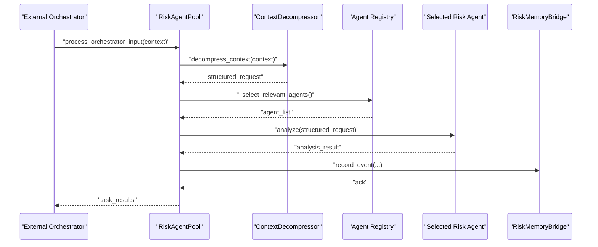

**Diagram sources**
- [core.py:268-387](file://FinAgents/agent_pools/risk_agent_pool/core.py#L268-L387)
- [core.py:425-457](file://FinAgents/agent_pools/risk_agent_pool/core.py#L425-L457)
- [memory_bridge.py:119-152](file://FinAgents/agent_pools/risk_agent_pool/memory_bridge.py#L119-L152)

**Section sources**
- [core.py:268-387](file://FinAgents/agent_pools/risk_agent_pool/core.py#L268-L387)
- [core.py:425-457](file://FinAgents/agent_pools/risk_agent_pool/core.py#L425-L457)
- [memory_bridge.py:119-152](file://FinAgents/agent_pools/risk_agent_pool/memory_bridge.py#L119-L152)

## Detailed Component Analysis

### Market Risk Analyzer
The MarketRiskAnalyzer performs comprehensive market risk analysis including:
- Volatility metrics: historical, EWMA, GARCH, and volatility forecasting with regime classification.
- VaR and CVaR: parametric, historical, and Monte Carlo methods with backtesting and attribution.
- Beta and systematic risk: portfolio beta, Jensen's alpha, R-squared, and risk decomposition.
- Correlation analysis: correlation matrices, principal components, diversification metrics.
- Maximum drawdown: peak valuation, drawdown duration, recovery time, and Calmar ratio.
- Stress testing: scenario-based impact assessment.

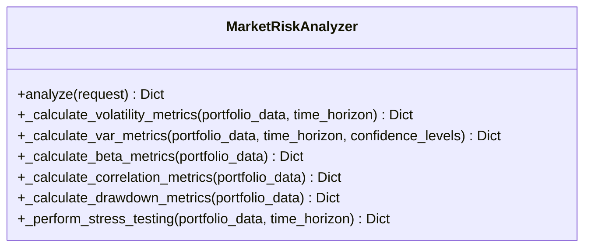

**Diagram sources**
- [market_risk.py:29-156](file://FinAgents/agent_pools/risk_agent_pool/agents/market_risk.py#L29-L156)

**Section sources**
- [market_risk.py:51-156](file://FinAgents/agent_pools/risk_agent_pool/agents/market_risk.py#L51-L156)
- [market_risk.py:215-266](file://FinAgents/agent_pools/risk_agent_pool/agents/market_risk.py#L215-L266)
- [market_risk.py:413-457](file://FinAgents/agent_pools/risk_agent_pool/agents/market_risk.py#L413-L457)
- [market_risk.py:594-639](file://FinAgents/agent_pools/risk_agent_pool/agents/market_risk.py#L594-L639)
- [market_risk.py:640-684](file://FinAgents/agent_pools/risk_agent_pool/agents/market_risk.py#L640-L684)
- [market_risk.py:725-782](file://FinAgents/agent_pools/risk_agent_pool/agents/market_risk.py#L725-L782)
- [market_risk.py:784-800](file://FinAgents/agent_pools/risk_agent_pool/agents/market_risk.py#L784-L800)

#### Volatility Calculations
- Historical volatility: standard deviation of returns annualized.
- EWMA volatility: exponentially weighted variance with decay parameter.
- GARCH volatility: simplified GARCH(1,1) with omega, alpha, beta parameters.
- Volatility forecasting: trend, mean reversion, and ensemble forecasts.
- Volatility clustering: ARCH LM test, persistence, Hurst exponent.

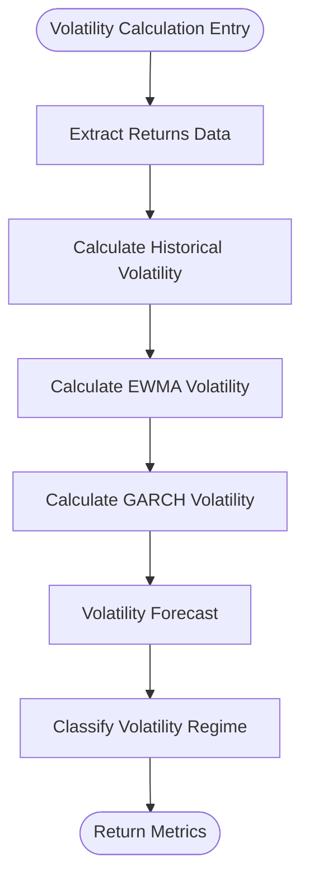

**Diagram sources**
- [market_risk.py:215-266](file://FinAgents/agent_pools/risk_agent_pool/agents/market_risk.py#L215-L266)
- [market_risk.py:315-343](file://FinAgents/agent_pools/risk_agent_pool/agents/market_risk.py#L315-L343)
- [market_risk.py:355-412](file://FinAgents/agent_pools/risk_agent_pool/agents/market_risk.py#L355-L412)

**Section sources**
- [market_risk.py:215-266](file://FinAgents/agent_pools/risk_agent_pool/agents/market_risk.py#L215-L266)
- [market_risk.py:315-343](file://FinAgents/agent_pools/risk_agent_pool/agents/market_risk.py#L315-L343)
- [market_risk.py:355-412](file://FinAgents/agent_pools/risk_agent_pool/agents/market_risk.py#L355-L412)

#### Value at Risk (VaR) and Expected Shortfall (CVaR)
- Parametric VaR: normal and t-distribution assumptions with Cornish-Fisher adjustment.
- Historical VaR: empirical quantiles with age-weighted variants and bootstrap confidence intervals.
- Monte Carlo VaR: normal/t-distributed scenarios and filtered historical simulation (FHS) with GARCH volatility.
- Backtesting: Kupiec, independence, and conditional coverage tests.
- Attribution: marginal and component VaR decomposition.

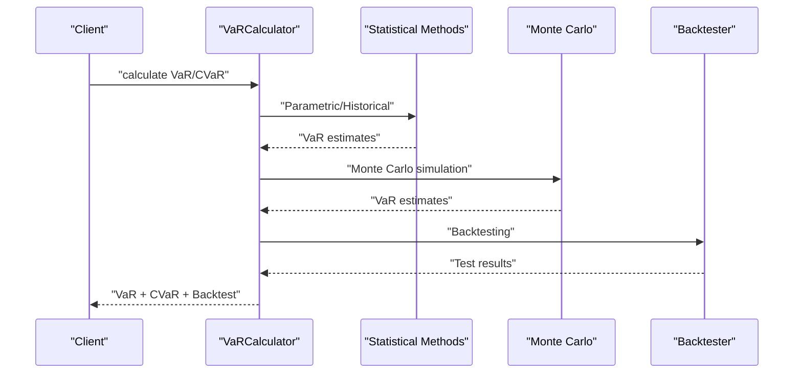

**Diagram sources**
- [var_calculator.py:42-137](file://FinAgents/agent_pools/risk_agent_pool/agents/var_calculator.py#L42-L137)
- [var_calculator.py:180-357](file://FinAgents/agent_pools/risk_agent_pool/agents/var_calculator.py#L180-L357)
- [var_calculator.py:444-554](file://FinAgents/agent_pools/risk_agent_pool/agents/var_calculator.py#L444-L554)

**Section sources**
- [var_calculator.py:180-357](file://FinAgents/agent_pools/risk_agent_pool/agents/var_calculator.py#L180-L357)
- [var_calculator.py:398-443](file://FinAgents/agent_pools/risk_agent_pool/agents/var_calculator.py#L398-L443)
- [var_calculator.py:444-554](file://FinAgents/agent_pools/risk_agent_pool/agents/var_calculator.py#L444-L554)

#### Beta Analysis and Systematic Risk
- Beta: covariance of portfolio and market returns divided by market variance.
- Alpha (Jensen's): adjusted for risk-free rate and market risk premium.
- R-squared and correlation with market.
- Systematic and idiosyncratic risk decomposition.

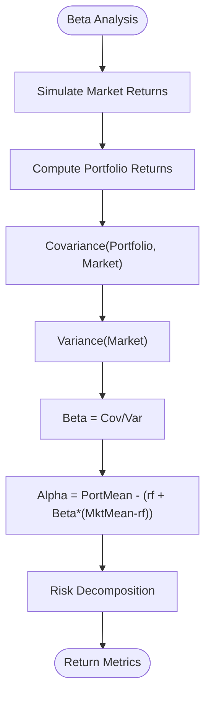

**Diagram sources**
- [market_risk.py:594-639](file://FinAgents/agent_pools/risk_agent_pool/agents/market_risk.py#L594-L639)

**Section sources**
- [market_risk.py:594-639](file://FinAgents/agent_pools/risk_agent_pool/agents/market_risk.py#L594-L639)

#### Correlation Matrix Analysis and Diversification
- Correlation matrix computation and statistics (mean, median, std).
- Principal component analysis (PCA) for explained variance.
- Diversification metrics: ratio and effective number of assets.

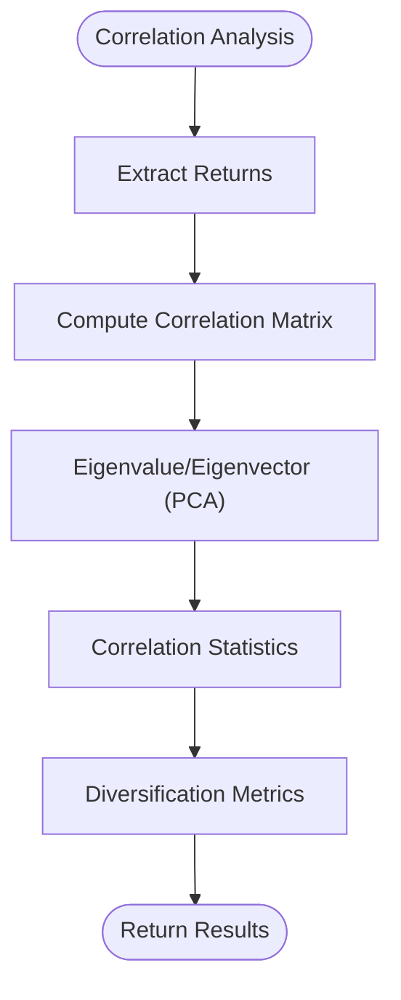

**Diagram sources**
- [market_risk.py:640-684](file://FinAgents/agent_pools/risk_agent_pool/agents/market_risk.py#L640-L684)
- [market_risk.py:686-724](file://FinAgents/agent_pools/risk_agent_pool/agents/market_risk.py#L686-L724)

**Section sources**
- [market_risk.py:640-684](file://FinAgents/agent_pools/risk_agent_pool/agents/market_risk.py#L640-L684)
- [market_risk.py:686-724](file://FinAgents/agent_pools/risk_agent_pool/agents/market_risk.py#L686-L724)

#### Maximum Drawdown Analysis
- Cumulative returns, running maximum, and drawdown computation.
- Peak-to-trough metrics: maximum drawdown, duration, recovery time.
- Percentiles and frequency of drawdowns; Calmar ratio.

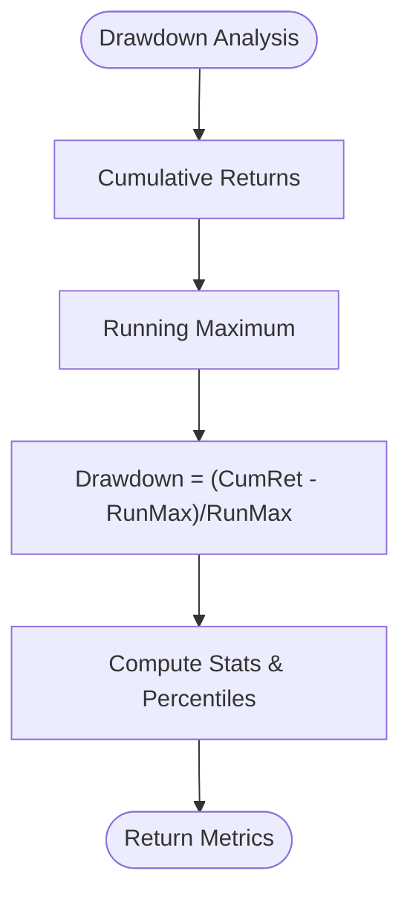

**Diagram sources**
- [market_risk.py:725-782](file://FinAgents/agent_pools/risk_agent_pool/agents/market_risk.py#L725-L782)

**Section sources**
- [market_risk.py:725-782](file://FinAgents/agent_pools/risk_agent_pool/agents/market_risk.py#L725-L782)

#### Stress Testing Scenarios
- Historical and hypothetical scenarios (e.g., 2008 crisis, COVID, rate shocks).
- Sensitivity analysis, Monte Carlo stress testing, reverse stress testing.
- Breach indicators and liquidity risk scoring.

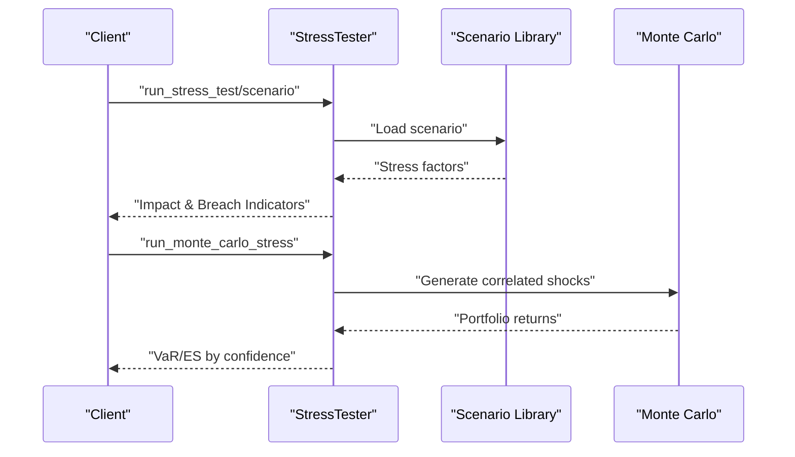

**Diagram sources**
- [stress_testing.py:186-261](file://FinAgents/agent_pools/risk_agent_pool/agents/stress_testing.py#L186-L261)
- [stress_testing.py:335-444](file://FinAgents/agent_pools/risk_agent_pool/agents/stress_testing.py#L335-L444)

**Section sources**
- [stress_testing.py:186-261](file://FinAgents/agent_pools/risk_agent_pool/agents/stress_testing.py#L186-L261)
- [stress_testing.py:335-444](file://FinAgents/agent_pools/risk_agent_pool/agents/stress_testing.py#L335-L444)

### Volatility Analyzer
- Historical volatility estimators: simple, Parkinson, Rogers-Satchell.
- Implied volatility metrics: ATM IV, term structure, skew metrics.
- Volatility forecasting: MA, EWMA, mean reversion, GARCH, ensemble.
- Volatility clustering: ARCH LM test, persistence, Hurst exponent.
- GARCH analysis: parameter estimation, diagnostics, multi-step forecasts.

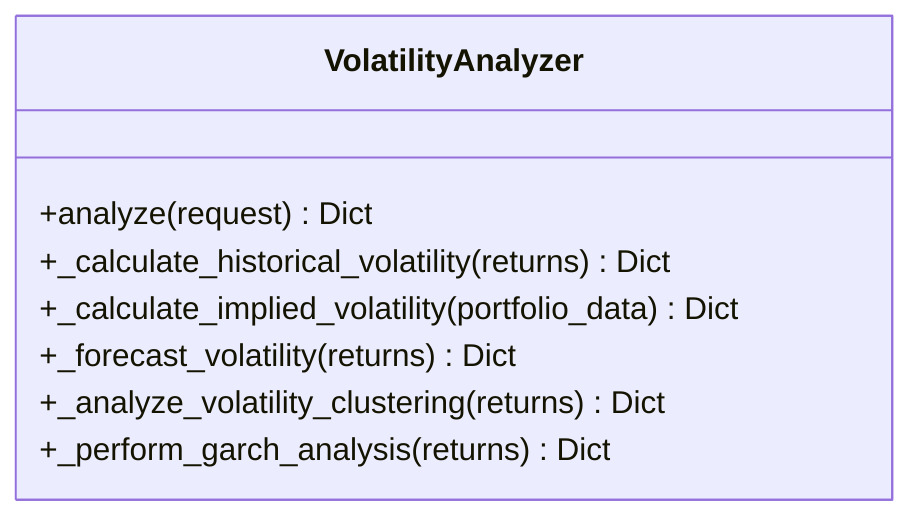

**Diagram sources**
- [volatility.py:25-98](file://FinAgents/agent_pools/risk_agent_pool/agents/volatility.py#L25-L98)
- [volatility.py:121-168](file://FinAgents/agent_pools/risk_agent_pool/agents/volatility.py#L121-L168)
- [volatility.py:214-266](file://FinAgents/agent_pools/risk_agent_pool/agents/volatility.py#L214-L266)
- [volatility.py:327-381](file://FinAgents/agent_pools/risk_agent_pool/agents/volatility.py#L327-L381)
- [volatility.py:529-560](file://FinAgents/agent_pools/risk_agent_pool/agents/volatility.py#L529-L560)

**Section sources**
- [volatility.py:121-168](file://FinAgents/agent_pools/risk_agent_pool/agents/volatility.py#L121-L168)
- [volatility.py:214-266](file://FinAgents/agent_pools/risk_agent_pool/agents/volatility.py#L214-L266)
- [volatility.py:327-381](file://FinAgents/agent_pools/risk_agent_pool/agents/volatility.py#L327-L381)
- [volatility.py:529-560](file://FinAgents/agent_pools/risk_agent_pool/agents/volatility.py#L529-L560)

### Risk Agent Pool Orchestration
- Natural language processing via OpenAI to decompose context into structured tasks.
- Agent selection based on risk type and requested measures.
- MCP tool exposure for external orchestration integration.
- Memory integration for event logging and result persistence.

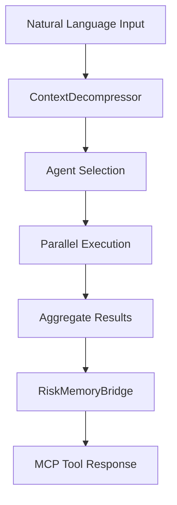

**Diagram sources**
- [core.py:268-387](file://FinAgents/agent_pools/risk_agent_pool/core.py#L268-L387)
- [core.py:458-520](file://FinAgents/agent_pools/risk_agent_pool/core.py#L458-L520)
- [memory_bridge.py:119-152](file://FinAgents/agent_pools/risk_agent_pool/memory_bridge.py#L119-L152)

**Section sources**
- [core.py:268-387](file://FinAgents/agent_pools/risk_agent_pool/core.py#L268-L387)
- [core.py:458-520](file://FinAgents/agent_pools/risk_agent_pool/core.py#L458-L520)
- [memory_bridge.py:119-152](file://FinAgents/agent_pools/risk_agent_pool/memory_bridge.py#L119-L152)

## Dependency Analysis
The Market Risk Analyzer depends on:
- NumPy/Pandas for numerical computations and data structures.
- SciPy for statistical distributions and hypothesis tests.
- scikit-learn for robust covariance estimation.
- RiskMemoryBridge for persistence and retrieval.
- RiskAgentPool orchestrator for task distribution and MCP integration.

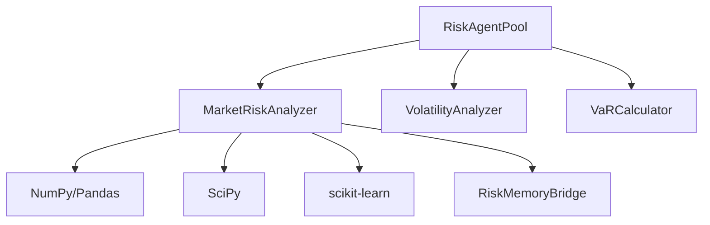

**Diagram sources**
- [market_risk.py:16-26](file://FinAgents/agent_pools/risk_agent_pool/agents/market_risk.py#L16-L26)
- [core.py:137-187](file://FinAgents/agent_pools/risk_agent_pool/core.py#L137-L187)
- [memory_bridge.py:59-83](file://FinAgents/agent_pools/risk_agent_pool/memory_bridge.py#L59-L83)

**Section sources**
- [market_risk.py:16-26](file://FinAgents/agent_pools/risk_agent_pool/agents/market_risk.py#L16-L26)
- [core.py:137-187](file://FinAgents/agent_pools/risk_agent_pool/core.py#L137-L187)
- [memory_bridge.py:59-83](file://FinAgents/agent_pools/risk_agent_pool/memory_bridge.py#L59-L83)

## Performance Considerations
- Vectorized computations using NumPy reduce overhead for returns and matrix operations.
- Rolling window calculations for volatility and drawdown metrics are efficient for moderate data sizes.
- Monte Carlo simulations scale with the number of scenarios; tune simulations for latency vs. accuracy.
- Parallel execution of multiple agents improves throughput in orchestrator deployments.
- Caching and local storage in RiskMemoryBridge reduce repeated computations and I/O.

## Troubleshooting Guide
Common issues and resolutions:
- Insufficient data for volatility/GARCH/backtesting: ensure minimum lookback periods and sufficient observations.
- Missing portfolio weights or mismatched lengths: validate input structure and weight normalization.
- External memory connectivity failures: verify URLs and network reachability; fallback behavior is handled gracefully.
- OpenAI API errors: confirm API keys and quotas; fallback parsing is available when OpenAI is disabled.

**Section sources**
- [market_risk.py:157-189](file://FinAgents/agent_pools/risk_agent_pool/agents/market_risk.py#L157-L189)
- [core.py:207-218](file://FinAgents/agent_pools/risk_agent_pool/core.py#L207-L218)
- [memory_bridge.py:101-118](file://FinAgents/agent_pools/risk_agent_pool/memory_bridge.py#L101-L118)

## Conclusion
The Market Risk Analyzer provides a robust, modular framework for comprehensive market risk analysis. Its integration with specialized agents, the orchestrator, and the memory bridge enables scalable, persistent, and interpretable risk insights. The documented methodologies support practical applications in risk monitoring, regulatory reporting, and portfolio optimization.