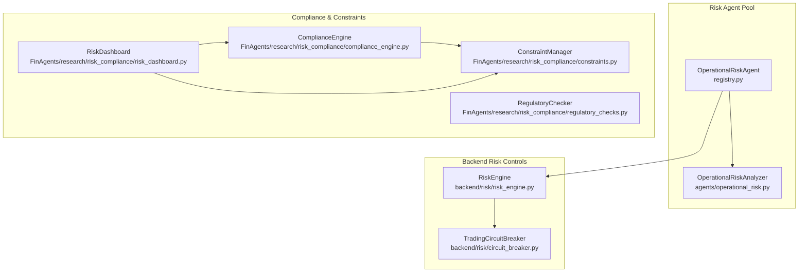
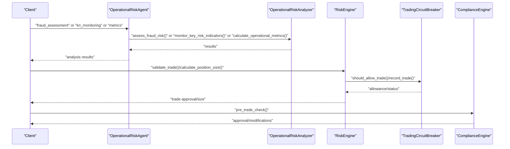
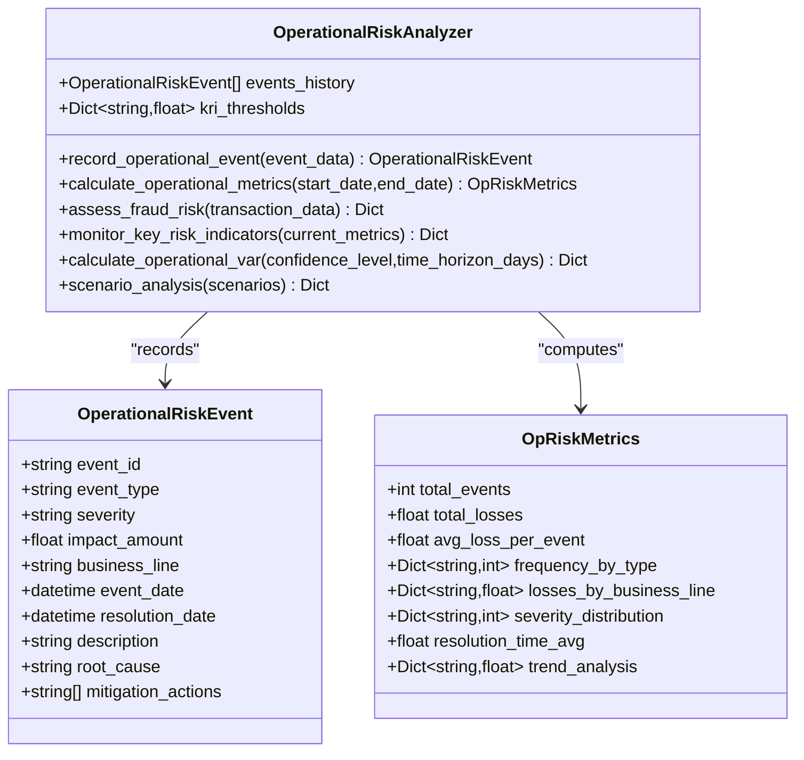
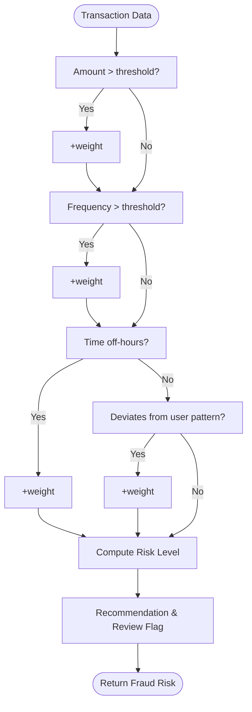
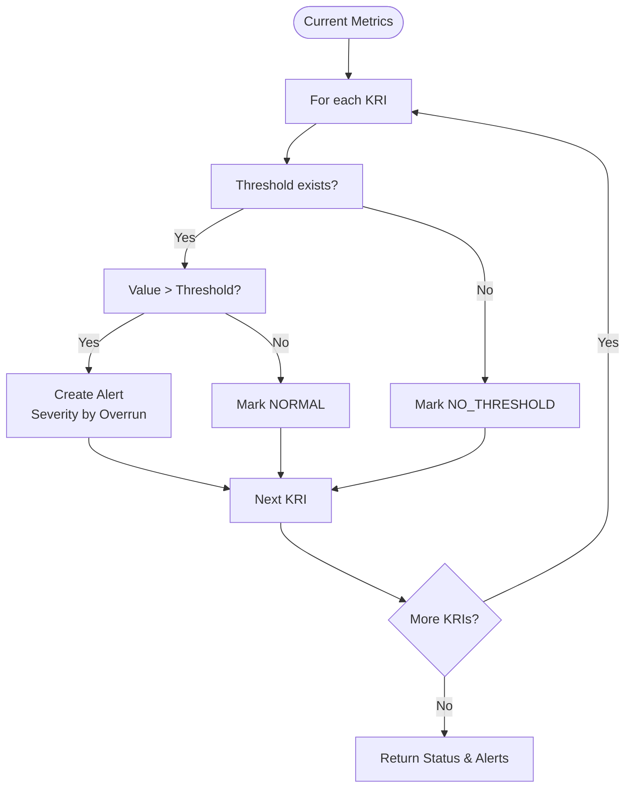
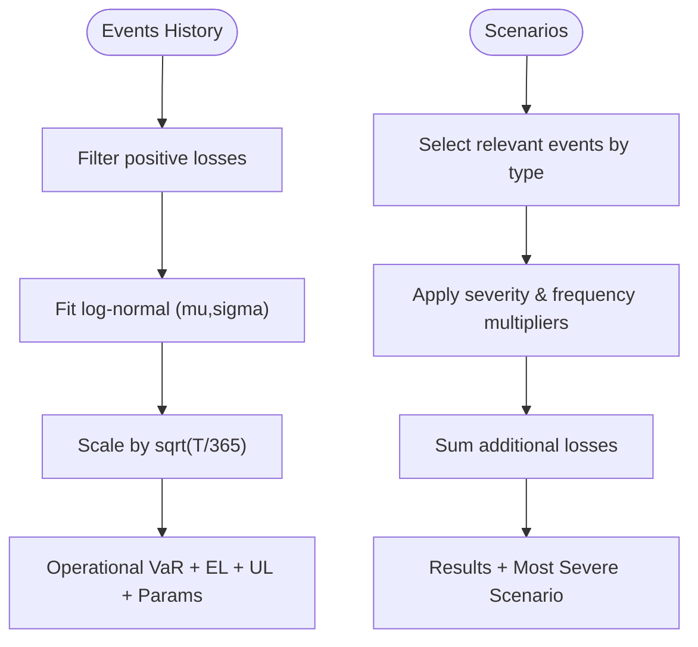
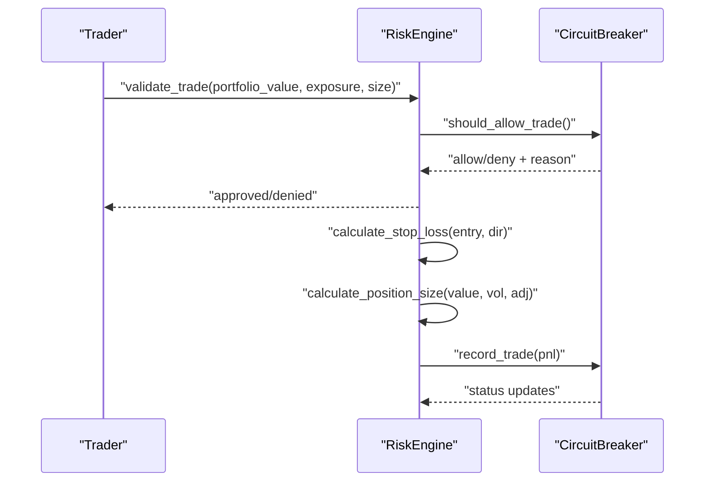
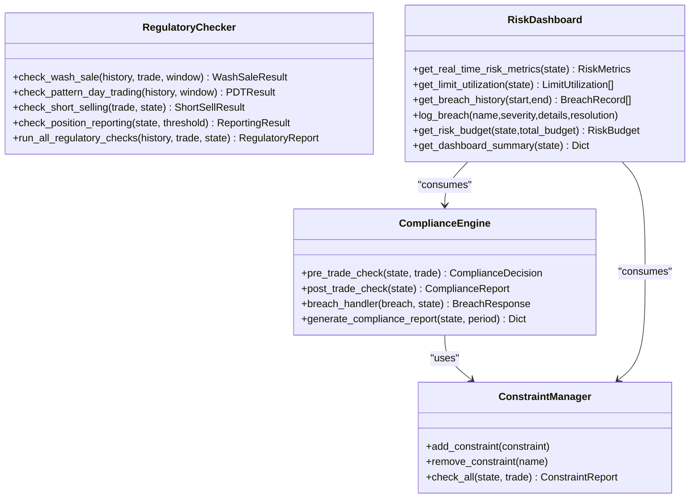
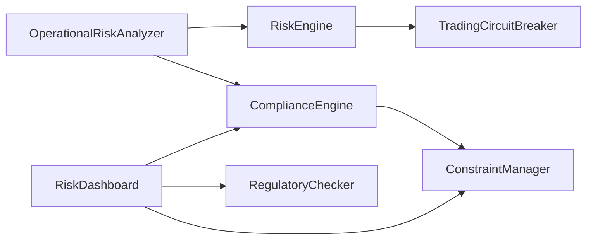

# Operational Risk Controls

<cite>
**Referenced Files in This Document**
- [operational_risk.py](file://FinAgents/agent_pools/risk_agent_pool/agents/operational_risk.py)
- [registry.py](file://FinAgents/agent_pools/risk_agent_pool/registry.py)
- [README.md](file://FinAgents/agent_pools/risk_agent_pool/README.md)
- [example_demo.py](file://FinAgents/agent_pools/risk_agent_pool/example_demo.py)
- [test_integration.py](file://FinAgents/agent_pools/risk_agent_pool/test_integration.py)
- [risk_engine.py](file://backend/risk/risk_engine.py)
- [circuit_breaker.py](file://backend/risk/circuit_breaker.py)
- [constraints.py](file://FinAgents/research/risk_compliance/constraints.py)
- [compliance_engine.py](file://FinAgents/research/risk_compliance/compliance_engine.py)
- [regulatory_checks.py](file://FinAgents/research/risk_compliance/regulatory_checks.py)
- [risk_dashboard.py](file://FinAgents/research/risk_compliance/risk_dashboard.py)
</cite>

## Table of Contents
1. [Introduction](#introduction)
2. [Project Structure](#project-structure)
3. [Core Components](#core-components)
4. [Architecture Overview](#architecture-overview)
5. [Detailed Component Analysis](#detailed-component-analysis)
6. [Dependency Analysis](#dependency-analysis)
7. [Performance Considerations](#performance-considerations)
8. [Troubleshooting Guide](#troubleshooting-guide)
9. [Conclusion](#conclusion)
10. [Appendices](#appendices)

## Introduction
This document describes the Operational Risk Controls agent and related systems within the Agentic Trading Application. It explains how operational risk assessments are performed, how fraud detection and key risk indicators (KRIs) are monitored, and how operational VaR and scenario testing are supported. It also covers integration points with the broader risk control framework, including pre/post-trade compliance, constraint enforcement, circuit breakers, and dashboards for risk reporting.

## Project Structure
The Operational Risk Controls capability is implemented as part of the Risk Agent Pool, with specialized agents for operational risk, alongside market, credit, and other risk types. Supporting backend risk controls and compliance engines provide pre-trade validation, constraint management, and circuit breaker safeguards.

**Diagram sources**
- [operational_risk.py:53-529](file://FinAgents/agent_pools/risk_agent_pool/agents/operational_risk.py#L53-L529)
- [registry.py:473-500](file://FinAgents/agent_pools/risk_agent_pool/registry.py#L473-L500)
- [risk_engine.py:22-226](file://backend/risk/risk_engine.py#L22-L226)
- [circuit_breaker.py:59-360](file://backend/risk/circuit_breaker.py#L59-L360)
- [constraints.py:648-742](file://FinAgents/research/risk_compliance/constraints.py#L648-L742)
- [compliance_engine.py:82-530](file://FinAgents/research/risk_compliance/compliance_engine.py#L82-L530)
- [regulatory_checks.py:155-547](file://FinAgents/research/risk_compliance/regulatory_checks.py#L155-L547)
- [risk_dashboard.py:108-616](file://FinAgents/research/risk_compliance/risk_dashboard.py#L108-L616)

**Section sources**
- [README.md:1-490](file://FinAgents/agent_pools/risk_agent_pool/README.md#L1-L490)

## Core Components
- OperationalRiskAnalyzer: Implements operational risk event recording, metrics computation, fraud risk scoring, KRI monitoring, operational VaR calculation, and scenario analysis.
- OperationalRiskAgent: Orchestrates operational risk analysis tasks and delegates to OperationalRiskAnalyzer.
- RiskEngine: Enforces pre-trade risk controls, stop-loss calculation, and position sizing with optional circuit breaker integration.
- TradingCircuitBreaker: Enforces emergency trading halts and position reductions based on drawdown, daily/weekly losses, and volatility.
- ComplianceEngine and ConstraintManager: Provide pre- and post-trade constraint checks, breach handling, and risk summaries.
- RegulatoryChecker: Applies regulatory-style validations (e.g., wash sale, PDT, short sale, reporting thresholds).
- RiskDashboard: Aggregates risk metrics, limit utilization, breach history, and risk budgets for reporting.

**Section sources**
- [operational_risk.py:53-529](file://FinAgents/agent_pools/risk_agent_pool/agents/operational_risk.py#L53-L529)
- [registry.py:473-500](file://FinAgents/agent_pools/risk_agent_pool/registry.py#L473-L500)
- [risk_engine.py:22-226](file://backend/risk/risk_engine.py#L22-L226)
- [circuit_breaker.py:59-360](file://backend/risk/circuit_breaker.py#L59-L360)
- [constraints.py:648-742](file://FinAgents/research/risk_compliance/constraints.py#L648-L742)
- [compliance_engine.py:82-530](file://FinAgents/research/risk_compliance/compliance_engine.py#L82-L530)
- [regulatory_checks.py:155-547](file://FinAgents/research/risk_compliance/regulatory_checks.py#L155-L547)
- [risk_dashboard.py:108-616](file://FinAgents/research/risk_compliance/risk_dashboard.py#L108-L616)

## Architecture Overview
The Operational Risk Controls architecture integrates:
- Operational risk analysis via OperationalRiskAnalyzer and OperationalRiskAgent
- Pre-trade risk gating via RiskEngine and ComplianceEngine
- Real-time safety via TradingCircuitBreaker
- Regulatory checks via RegulatoryChecker
- Reporting via RiskDashboard

**Diagram sources**
- [registry.py:473-500](file://FinAgents/agent_pools/risk_agent_pool/registry.py#L473-L500)
- [operational_risk.py:191-315](file://FinAgents/agent_pools/risk_agent_pool/agents/operational_risk.py#L191-L315)
- [risk_engine.py:72-221](file://backend/risk/risk_engine.py#L72-L221)
- [circuit_breaker.py:235-302](file://backend/risk/circuit_breaker.py#L235-L302)
- [compliance_engine.py:118-184](file://FinAgents/research/risk_compliance/compliance_engine.py#L118-L184)

## Detailed Component Analysis

### Operational Risk Analyzer
The OperationalRiskAnalyzer provides:
- Event recording with attributes such as event type, severity, impact amount, business line, and timestamps.
- Operational metrics computation including counts, totals, averages, frequency by type, losses by business line, severity distribution, average resolution time, and trend analysis.
- Fraud risk scoring based on transaction amount, frequency, geography, time-of-day, and deviations from historical patterns, returning a risk level and recommendation.
- KRI monitoring against configurable thresholds for system downtime, failed transaction percentage, staff turnover, compliance violations, and monthly fraud incidents.
- Operational VaR calculation using a loss distribution approach with log-normal fitting and time horizon scaling.
- Scenario analysis by applying severity and frequency multipliers to historical event subsets and aggregating additional losses.

**Diagram sources**
- [operational_risk.py:21-529](file://FinAgents/agent_pools/risk_agent_pool/agents/operational_risk.py#L21-L529)

**Section sources**
- [operational_risk.py:53-529](file://FinAgents/agent_pools/risk_agent_pool/agents/operational_risk.py#L53-L529)

### Fraud Detection Integration
The fraud detection module evaluates transaction risk by combining multiple signals:
- Amount thresholding
- Frequency analysis
- Geographic risk scoring
- Time-of-day anomaly detection
- Deviation from user-specific behavioral patterns

It returns a normalized risk score, a risk level, identified risk factors, a recommendation, and a flag indicating whether manual review is required.

**Diagram sources**
- [operational_risk.py:191-257](file://FinAgents/agent_pools/risk_agent_pool/agents/operational_risk.py#L191-L257)

**Section sources**
- [operational_risk.py:191-257](file://FinAgents/agent_pools/risk_agent_pool/agents/operational_risk.py#L191-L257)

### Key Risk Indicator (KRI) Monitoring
The KRI monitoring compares current metric values against predefined thresholds and emits alerts when breaches occur. It computes breach percentages and overall status, enabling rapid escalation.

**Diagram sources**
- [operational_risk.py:259-315](file://FinAgents/agent_pools/risk_agent_pool/agents/operational_risk.py#L259-L315)

**Section sources**
- [operational_risk.py:259-315](file://FinAgents/agent_pools/risk_agent_pool/agents/operational_risk.py#L259-L315)

### Operational VaR and Scenario Testing
Operational VaR is computed from historical loss distributions:
- Extracts positive losses, fits a log-normal distribution, and scales for the time horizon.
- Returns expected loss, unexpected loss, and distribution parameters.

Scenario testing multiplies baseline losses and frequencies by scenario-specific severity and frequency multipliers, aggregating additional losses and identifying the most severe scenario.

**Diagram sources**
- [operational_risk.py:317-457](file://FinAgents/agent_pools/risk_agent_pool/agents/operational_risk.py#L317-L457)

**Section sources**
- [operational_risk.py:317-457](file://FinAgents/agent_pools/risk_agent_pool/agents/operational_risk.py#L317-L457)

### Pre-Trade Risk Controls and Circuit Breakers
Pre-trade validation ensures:
- Position size within per-position and portfolio exposure limits
- Stop-loss price calculation
- Optional circuit breaker gating

Circuit breakers enforce emergency halts and position reductions based on:
- Daily and weekly loss limits
- Maximum drawdown
- Consecutive losses
- Extreme volatility

**Diagram sources**
- [risk_engine.py:72-221](file://backend/risk/risk_engine.py#L72-L221)
- [circuit_breaker.py:116-302](file://backend/risk/circuit_breaker.py#L116-L302)

**Section sources**
- [risk_engine.py:22-226](file://backend/risk/risk_engine.py#L22-L226)
- [circuit_breaker.py:59-360](file://backend/risk/circuit_breaker.py#L59-L360)

### Compliance and Regulatory Checks
ComplianceEngine performs pre- and post-trade constraint checks, generates corrective actions, and maintains breach history. ConstraintManager enforces:
- MaxDrawdown
- PositionSize
- Concentration
- Turnover
- Correlation

RegulatoryChecker evaluates:
- Wash sale rules
- Pattern Day Trading
- Short selling restrictions
- Position reporting thresholds

RiskDashboard aggregates risk metrics, limit utilization, breach history, and risk budgets for reporting.

**Diagram sources**
- [constraints.py:648-742](file://FinAgents/research/risk_compliance/constraints.py#L648-L742)
- [compliance_engine.py:82-530](file://FinAgents/research/risk_compliance/compliance_engine.py#L82-L530)
- [regulatory_checks.py:155-547](file://FinAgents/research/risk_compliance/regulatory_checks.py#L155-L547)
- [risk_dashboard.py:108-616](file://FinAgents/research/risk_compliance/risk_dashboard.py#L108-L616)

**Section sources**
- [constraints.py:147-742](file://FinAgents/research/risk_compliance/constraints.py#L147-L742)
- [compliance_engine.py:82-530](file://FinAgents/research/risk_compliance/compliance_engine.py#L82-L530)
- [regulatory_checks.py:155-547](file://FinAgents/research/risk_compliance/regulatory_checks.py#L155-L547)
- [risk_dashboard.py:108-616](file://FinAgents/research/risk_compliance/risk_dashboard.py#L108-L616)

## Dependency Analysis
Operational risk controls depend on:
- OperationalRiskAnalyzer for event processing, metrics, fraud scoring, KRI monitoring, VaR, and scenario analysis
- RiskEngine and TradingCircuitBreaker for pre-trade gating and emergency controls
- ComplianceEngine and ConstraintManager for constraint enforcement and breach handling
- RegulatoryChecker for regulatory-style validations
- RiskDashboard for consolidated reporting

**Diagram sources**
- [operational_risk.py:53-529](file://FinAgents/agent_pools/risk_agent_pool/agents/operational_risk.py#L53-L529)
- [risk_engine.py:22-226](file://backend/risk/risk_engine.py#L22-L226)
- [circuit_breaker.py:59-360](file://backend/risk/circuit_breaker.py#L59-L360)
- [compliance_engine.py:82-530](file://FinAgents/research/risk_compliance/compliance_engine.py#L82-L530)
- [constraints.py:648-742](file://FinAgents/research/risk_compliance/constraints.py#L648-L742)
- [regulatory_checks.py:155-547](file://FinAgents/research/risk_compliance/regulatory_checks.py#L155-L547)
- [risk_dashboard.py:108-616](file://FinAgents/research/risk_compliance/risk_dashboard.py#L108-L616)

**Section sources**
- [registry.py:473-500](file://FinAgents/agent_pools/risk_agent_pool/registry.py#L473-L500)
- [README.md:175-194](file://FinAgents/agent_pools/risk_agent_pool/README.md#L175-L194)

## Performance Considerations
- Asynchronous processing enables non-blocking operations for risk computations.
- KPI aggregation and VaR calculations rely on vectorized operations for efficiency.
- Circuit breaker and constraint checks are lightweight and designed for real-time gating.
- Recommendation: cache frequently accessed thresholds and leverage batch processing for large-scale event histories.

## Troubleshooting Guide
Common issues and resolutions:
- Operational risk analysis errors: Inspect logs for exceptions during metrics computation, fraud assessment, or KRI monitoring.
- Trade validation failures: Review max position, exposure, and circuit breaker status.
- Constraint breaches: Use ComplianceEngine’s breach handler to generate corrective actions and update risk parameters.
- Regulatory check warnings: Address wash sale, PDT, short sale, or reporting threshold concerns promptly.

**Section sources**
- [operational_risk.py:187-189](file://FinAgents/agent_pools/risk_agent_pool/agents/operational_risk.py#L187-L189)
- [operational_risk.py:255-257](file://FinAgents/agent_pools/risk_agent_pool/agents/operational_risk.py#L255-L257)
- [operational_risk.py:313-315](file://FinAgents/agent_pools/risk_agent_pool/agents/operational_risk.py#L313-L315)
- [risk_engine.py:124-126](file://backend/risk/risk_engine.py#L124-L126)
- [compliance_engine.py:358-436](file://FinAgents/research/risk_compliance/compliance_engine.py#L358-L436)

## Conclusion
The Operational Risk Controls agent provides a comprehensive foundation for operational risk management, integrating fraud detection, KRI monitoring, operational VaR, and scenario testing. It is tightly coupled with pre-trade risk controls, constraint enforcement, regulatory checks, and risk reporting, ensuring robust oversight and timely intervention.

## Appendices

### Operational Risk Controls API Usage
- Fraud assessment: Provide transaction data to receive risk score, level, factors, recommendation, and review flag.
- KRI monitoring: Supply current KRI values to receive status, alerts, and overall status.
- Metrics computation: Provide optional date range to compute operational risk metrics.
- Operational VaR: Configure confidence level and time horizon for VaR estimates.
- Scenario analysis: Define scenarios with event types and multipliers to estimate additional losses.

**Section sources**
- [README.md:175-194](file://FinAgents/agent_pools/risk_agent_pool/README.md#L175-L194)
- [example_demo.py:299-329](file://FinAgents/agent_pools/risk_agent_pool/example_demo.py#L299-L329)
- [test_integration.py:267-307](file://FinAgents/agent_pools/risk_agent_pool/test_integration.py#L267-L307)