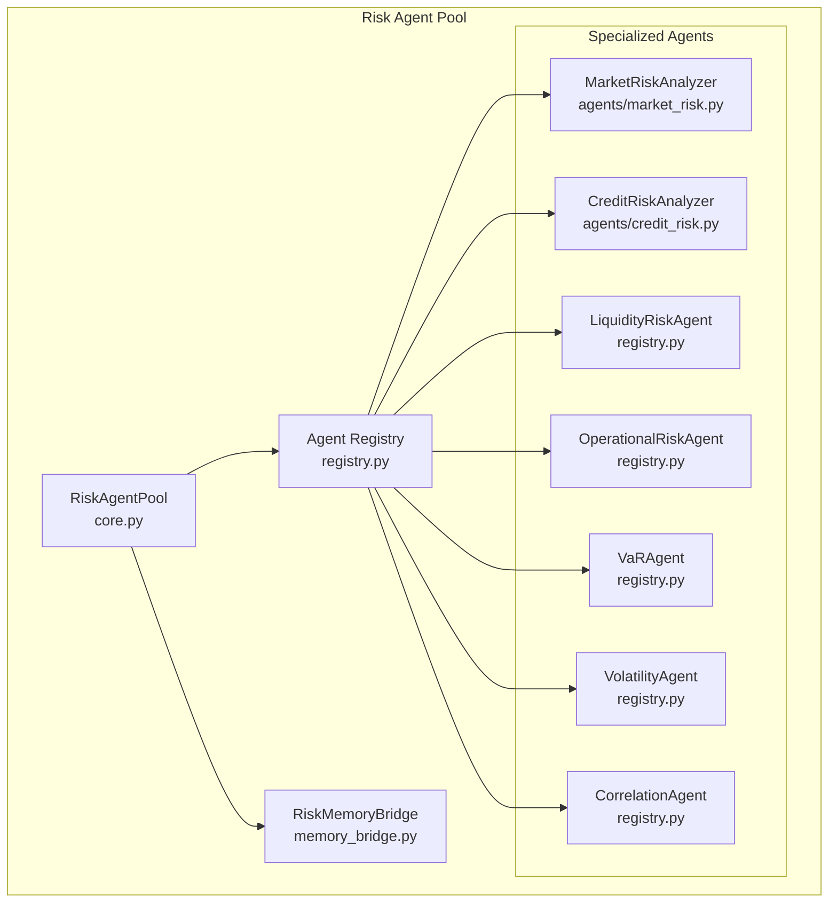
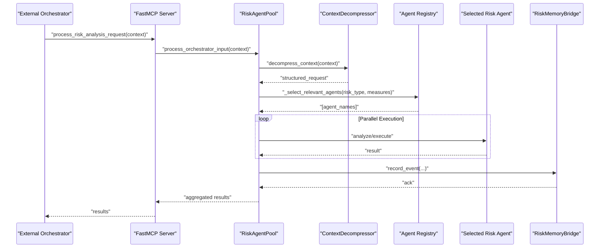
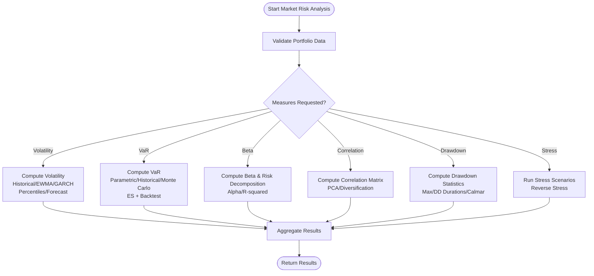
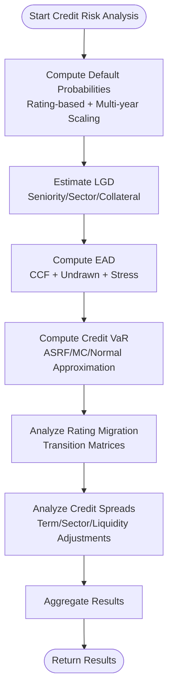
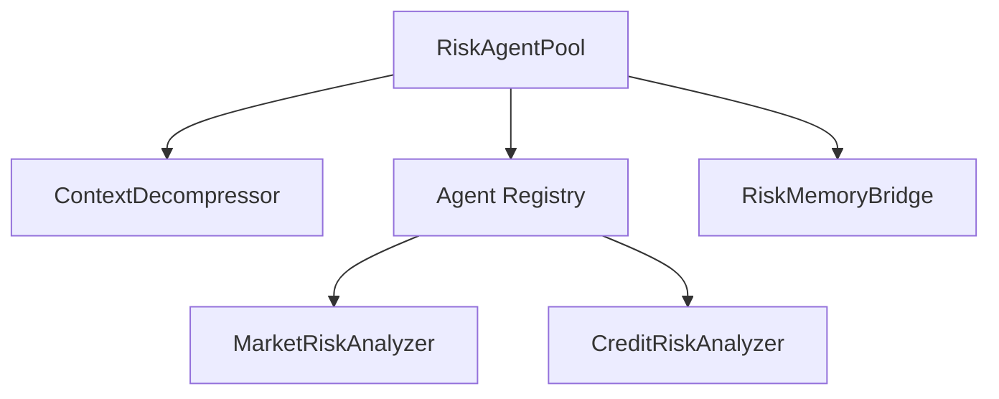

# Risk Assessment Agents

<cite>
**Referenced Files in This Document**
- [core.py](file://FinAgents/agent_pools/risk_agent_pool/core.py)
- [registry.py](file://FinAgents/agent_pools/risk_agent_pool/registry.py)
- [memory_bridge.py](file://FinAgents/agent_pools/risk_agent_pool/memory_bridge.py)
- [market_risk.py](file://FinAgents/agent_pools/risk_agent_pool/agents/market_risk.py)
- [credit_risk.py](file://FinAgents/agent_pools/risk_agent_pool/agents/credit_risk.py)
- [README.md](file://FinAgents/agent_pools/risk_agent_pool/README.md)
</cite>

## Table of Contents
1. [Introduction](#introduction)
2. [Project Structure](#project-structure)
3. [Core Components](#core-components)
4. [Architecture Overview](#architecture-overview)
5. [Detailed Component Analysis](#detailed-component-analysis)
6. [Dependency Analysis](#dependency-analysis)
7. [Performance Considerations](#performance-considerations)
8. [Troubleshooting Guide](#troubleshooting-guide)
9. [Conclusion](#conclusion)

## Introduction
This document describes the risk assessment agents subsystem that provides modular, extensible risk analysis capabilities across market, credit, liquidity, and operational domains. The system orchestrates multiple specialized agents, integrates with external memory for persistence, and exposes a Model Context Protocol (MCP) server for task distribution. It supports natural language risk requests, parallel agent execution, and structured result aggregation for downstream consumption by the central risk orchestrator.

## Project Structure
The risk agent pool is organized around a central orchestrator, a registry of specialized agents, and a memory bridge for persistence and retrieval. The agents implement domain-specific risk methodologies and return standardized results.

**Diagram sources**
- [core.py:137-187](file://FinAgents/agent_pools/risk_agent_pool/core.py#L137-L187)
- [registry.py:21-710](file://FinAgents/agent_pools/risk_agent_pool/registry.py#L21-L710)
- [memory_bridge.py:59-498](file://FinAgents/agent_pools/risk_agent_pool/memory_bridge.py#L59-L498)

**Section sources**
- [README.md:10-490](file://FinAgents/agent_pools/risk_agent_pool/README.md#L10-L490)
- [core.py:137-187](file://FinAgents/agent_pools/risk_agent_pool/core.py#L137-L187)
- [registry.py:688-710](file://FinAgents/agent_pools/risk_agent_pool/registry.py#L688-L710)

## Core Components
- RiskAgentPool: Central orchestrator that initializes agents, parses natural language requests, selects relevant agents, executes tasks in parallel, and exposes MCP endpoints.
- Agent Registry: Dynamic registry of risk agents implementing a common interface, enabling easy extension and selection by risk type/measures.
- RiskMemoryBridge: Integration with external memory for storing risk analysis results, model parameters, and retrieving historical data.
- Specialized Agents: Domain-focused agents for market risk (volatility, VaR, beta, correlation, drawdown), credit risk (PD/LGD/EAD, credit VaR, migration), liquidity risk (liquidity ratios, spreads, market impact, funding liquidity), operational risk (KRI monitoring, fraud, OpVaR), and systemic risk (correlation, copula analysis).

**Section sources**
- [core.py:137-187](file://FinAgents/agent_pools/risk_agent_pool/core.py#L137-L187)
- [registry.py:21-710](file://FinAgents/agent_pools/risk_agent_pool/registry.py#L21-L710)
- [memory_bridge.py:59-498](file://FinAgents/agent_pools/risk_agent_pool/memory_bridge.py#L59-L498)

## Architecture Overview
The system accepts natural language risk requests, decomposes them into structured tasks, selects relevant agents, executes them concurrently, aggregates results, and persists outcomes.

**Diagram sources**
- [core.py:268-387](file://FinAgents/agent_pools/risk_agent_pool/core.py#L268-L387)
- [core.py:425-456](file://FinAgents/agent_pools/risk_agent_pool/core.py#L425-L456)
- [core.py:458-519](file://FinAgents/agent_pools/risk_agent_pool/core.py#L458-L519)
- [registry.py:390-423](file://FinAgents/agent_pools/risk_agent_pool/registry.py#L390-L423)

## Detailed Component Analysis

### RiskAgentPool
Responsibilities:
- Initialize OpenAI client and context decompressor.
- Manage agent lifecycle and registry.
- Parse natural language input into structured tasks.
- Select relevant agents based on risk type and requested measures.
- Execute tasks in parallel and aggregate results.
- Expose MCP endpoints for external orchestration.

Key behaviors:
- Natural language parsing via OpenAI chat completion with a structured JSON schema.
- Agent selection mapping risk types and measures to agent names.
- Parallel execution using asyncio gather with exception handling.
- Optional fallback parsing when OpenAI is unavailable.

Integration patterns:
- MCP tools for risk analysis requests and agent status.
- Memory bridge for event logging and analysis result persistence.

**Section sources**
- [core.py:67-135](file://FinAgents/agent_pools/risk_agent_pool/core.py#L67-L135)
- [core.py:189-206](file://FinAgents/agent_pools/risk_agent_pool/core.py#L189-L206)
- [core.py:268-346](file://FinAgents/agent_pools/risk_agent_pool/core.py#L268-L346)
- [core.py:347-424](file://FinAgents/agent_pools/risk_agent_pool/core.py#L347-L424)
- [core.py:425-456](file://FinAgents/agent_pools/risk_agent_pool/core.py#L425-L456)
- [core.py:458-519](file://FinAgents/agent_pools/risk_agent_pool/core.py#L458-L519)

### Agent Registry and Specialized Agents
The registry defines a common BaseRiskAgent interface and registers default agents. Agents implement analyze(request) and optionally calculate(request). Selected agents include:
- MarketRiskAgent, VolatilityAgent, VaRAgent
- CreditRiskAgent
- LiquidityRiskAgent
- CorrelationAgent
- OperationalRiskAgent, StressTestingAgent, ModelRiskAgent

Agent selection logic maps risk_type and risk_measures to agent names and deduplicates entries.

**Section sources**
- [registry.py:21-710](file://FinAgents/agent_pools/risk_agent_pool/registry.py#L21-L710)
- [registry.py:390-423](file://FinAgents/agent_pools/risk_agent_pool/registry.py#L390-L423)

### RiskMemoryBridge
Capabilities:
- Store and retrieve risk analysis results, model parameters, and historical risk data.
- Local caching with TTL and cache statistics.
- Event logging with metadata for auditability.
- Optional integration with external memory agent via HTTP.

Usage:
- Store analysis results as RiskAnalysisRecord.
- Retrieve historical data and model parameters.
- Get agent performance metrics over time windows.

**Section sources**
- [memory_bridge.py:33-498](file://FinAgents/agent_pools/risk_agent_pool/memory_bridge.py#L33-L498)

### Market Risk Analysis
The MarketRiskAnalyzer implements comprehensive market risk calculations:
- Volatility: historical, EWMA, GARCH; percentiles; regime classification; forecasting.
- VaR: parametric, historical, Monte Carlo; Expected Shortfall; backtesting (Kupiec); attribution.
- Beta: systematic/idiosyncratic risk decomposition; alpha and R-squared.
- Correlation: correlation matrix; PCA; diversification metrics.
- Drawdown: maximum drawdown, durations, recovery, Calmar ratio.
- Stress testing: scenario-based; reverse stress testing.

Methodology highlights:
- Volatility: EWMA and GARCH approximations; mean-reversion forecasting.
- VaR: multiple methods with backtesting against historical violations.
- Beta: CAPM decomposition with risk-free rate assumption.
- Correlation: PCA explained variance; effective number of assets.
- Drawdown: cumulative returns path analysis; percentile statistics.

**Diagram sources**
- [market_risk.py:51-156](file://FinAgents/agent_pools/risk_agent_pool/agents/market_risk.py#L51-L156)
- [market_risk.py:215-266](file://FinAgents/agent_pools/risk_agent_pool/agents/market_risk.py#L215-L266)
- [market_risk.py:413-457](file://FinAgents/agent_pools/risk_agent_pool/agents/market_risk.py#L413-L457)
- [market_risk.py:594-639](file://FinAgents/agent_pools/risk_agent_pool/agents/market_risk.py#L594-L639)
- [market_risk.py:640-684](file://FinAgents/agent_pools/risk_agent_pool/agents/market_risk.py#L640-L684)
- [market_risk.py:725-782](file://FinAgents/agent_pools/risk_agent_pool/agents/market_risk.py#L725-L782)
- [market_risk.py:784-827](file://FinAgents/agent_pools/risk_agent_pool/agents/market_risk.py#L784-L827)

**Section sources**
- [market_risk.py:51-156](file://FinAgents/agent_pools/risk_agent_pool/agents/market_risk.py#L51-L156)
- [market_risk.py:215-266](file://FinAgents/agent_pools/risk_agent_pool/agents/market_risk.py#L215-L266)
- [market_risk.py:413-457](file://FinAgents/agent_pools/risk_agent_pool/agents/market_risk.py#L413-L457)
- [market_risk.py:594-639](file://FinAgents/agent_pools/risk_agent_pool/agents/market_risk.py#L594-L639)
- [market_risk.py:640-684](file://FinAgents/agent_pools/risk_agent_pool/agents/market_risk.py#L640-L684)
- [market_risk.py:725-782](file://FinAgents/agent_pools/risk_agent_pool/agents/market_risk.py#L725-L782)
- [market_risk.py:784-827](file://FinAgents/agent_pools/risk_agent_pool/agents/market_risk.py#L784-L827)

### Credit Risk Assessment
The CreditRiskAnalyzer implements:
- Default Probability: rating-based 1-year PD scaling to multi-year using hazard rates; portfolio default modeling via single-factor Gaussian copula (Vasicek).
- LGD Estimation: by seniority, sector, and collateral coverage; portfolio LGD statistics and uncertainty.
- EAD Calculation: credit conversion factors by facility type; undrawn commitment impact; stress scenarios.
- Credit VaR: ASRF, Monte Carlo, and normal approximation; risk contributions; expected loss.
- Migration Analysis: rating transition matrices scaled to multi-year; upgrade/downgrade/default probabilities; diversification metrics.
- Spread Analysis: base spreads by rating, term/sector/liquidity adjustments, DV01, spread volatility.

**Diagram sources**
- [credit_risk.py:42-122](file://FinAgents/agent_pools/risk_agent_pool/agents/credit_risk.py#L42-L122)
- [credit_risk.py:124-186](file://FinAgents/agent_pools/risk_agent_pool/agents/credit_risk.py#L124-L186)
- [credit_risk.py:221-305](file://FinAgents/agent_pools/risk_agent_pool/agents/credit_risk.py#L221-L305)
- [credit_risk.py:338-441](file://FinAgents/agent_pools/risk_agent_pool/agents/credit_risk.py#L338-L441)
- [credit_risk.py:443-511](file://FinAgents/agent_pools/risk_agent_pool/agents/credit_risk.py#L443-L511)
- [credit_risk.py:625-690](file://FinAgents/agent_pools/risk_agent_pool/agents/credit_risk.py#L625-L690)
- [credit_risk.py:734-800](file://FinAgents/agent_pools/risk_agent_pool/agents/credit_risk.py#L734-L800)

**Section sources**
- [credit_risk.py:42-122](file://FinAgents/agent_pools/risk_agent_pool/agents/credit_risk.py#L42-L122)
- [credit_risk.py:124-186](file://FinAgents/agent_pools/risk_agent_pool/agents/credit_risk.py#L124-L186)
- [credit_risk.py:221-305](file://FinAgents/agent_pools/risk_agent_pool/agents/credit_risk.py#L221-L305)
- [credit_risk.py:338-441](file://FinAgents/agent_pools/risk_agent_pool/agents/credit_risk.py#L338-L441)
- [credit_risk.py:443-511](file://FinAgents/agent_pools/risk_agent_pool/agents/credit_risk.py#L443-L511)
- [credit_risk.py:625-690](file://FinAgents/agent_pools/risk_agent_pool/agents/credit_risk.py#L625-L690)
- [credit_risk.py:734-800](file://FinAgents/agent_pools/risk_agent_pool/agents/credit_risk.py#L734-L800)

### Liquidity Risk Evaluation
The LiquidityRiskAgent computes:
- Liquidity Ratios: current, quick, cash, operating cash flow ratio.
- Bid-Ask Spreads: average, volatility, percentiles.
- Market Impact: temporary and permanent components; square-root impact model; liquidity score.
- Funding Liquidity: funding gap, concentration, maturity mismatch, stability assessment.

These metrics support both market liquidity (tighter spreads, lower impact) and funding liquidity (stable maturity profile, lower concentration).

**Section sources**
- [registry.py:337-401](file://FinAgents/agent_pools/risk_agent_pool/registry.py#L337-L401)

### Operational Risk Controls
The OperationalRiskAgent provides:
- Fraud Risk Assessment: evaluates transactions against behavioral patterns.
- Key Risk Indicator (KRI) Monitoring: tracks operational risk trends.
- Operational VaR: quantifies operational risk capital.
- Scenario Analysis: evaluates impacts of operational stress scenarios.

These capabilities enable process risk assessment, system risk evaluation, and human factor analysis through KRI monitoring and fraud detection.

**Section sources**
- [registry.py:473-523](file://FinAgents/agent_pools/risk_agent_pool/registry.py#L473-L523)

### Systemic Risk Measurement
The CorrelationAgent performs:
- Correlation Matrix Estimation and Tail Dependence Analysis.
- Dynamic Correlations and Copula-Based Dependency Analysis.
- Tail risk contribution and regime classification.

These outputs support systematic risk measurement and stress testing across correlated asset groups.

**Section sources**
- [registry.py:403-471](file://FinAgents/agent_pools/risk_agent_pool/registry.py#L403-L471)

## Dependency Analysis
The RiskAgentPool depends on:
- OpenAI client for natural language parsing.
- Agent Registry for dynamic agent selection.
- RiskMemoryBridge for persistence and retrieval.
- Specialized agents for domain-specific computations.

**Diagram sources**
- [core.py:137-187](file://FinAgents/agent_pools/risk_agent_pool/core.py#L137-L187)
- [core.py:67-135](file://FinAgents/agent_pools/risk_agent_pool/core.py#L67-L135)
- [registry.py:688-710](file://FinAgents/agent_pools/risk_agent_pool/registry.py#L688-L710)

**Section sources**
- [core.py:137-187](file://FinAgents/agent_pools/risk_agent_pool/core.py#L137-L187)
- [registry.py:688-710](file://FinAgents/agent_pools/risk_agent_pool/registry.py#L688-L710)

## Performance Considerations
- Parallel execution: asyncio gather enables concurrent agent execution.
- Caching: RiskMemoryBridge includes local cache with TTL for frequent retrievals.
- Asynchronous I/O: MCP server and memory bridge use async HTTP clients.
- Data locality: MarketRiskAnalyzer expects returns/prices; missing data raises explicit errors to avoid partial results.
- Model parameters: RiskMemoryBridge stores model parameters for reproducibility and change tracking.

[No sources needed since this section provides general guidance]

## Troubleshooting Guide
Common issues and resolutions:
- OpenAI API Errors: Verify API key and rate limits; fallback parsing is available when OpenAI is unreachable.
- Memory Agent Connection: Confirm external memory service health and network connectivity.
- MCP Server Issues: Check port availability and configuration; use health endpoints to validate.
- Performance Issues: Monitor cache hit ratios, memory usage, and agent execution times; adjust TTL and parallelism.

Debugging tips:
- Enable debug logging in RiskAgentPool.
- Inspect structured_request generation and agent selection logic.
- Review RiskMemoryBridge logs for storage/retrieval failures.

**Section sources**
- [README.md:436-457](file://FinAgents/agent_pools/risk_agent_pool/README.md#L436-L457)
- [core.py:321-345](file://FinAgents/agent_pools/risk_agent_pool/core.py#L321-L345)
- [memory_bridge.py:101-118](file://FinAgents/agent_pools/risk_agent_pool/memory_bridge.py#L101-L118)

## Conclusion
The risk assessment agents subsystem provides a modular, extensible framework for market, credit, liquidity, operational, and systemic risk analysis. Through structured natural language processing, parallel agent execution, and persistent memory integration, it delivers comprehensive risk insights suitable for integration with the central risk orchestrator. The design supports future extensions via the agent registry and aligns with best practices for observability, caching, and asynchronous processing.