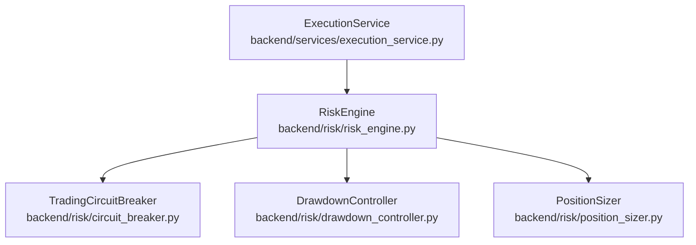
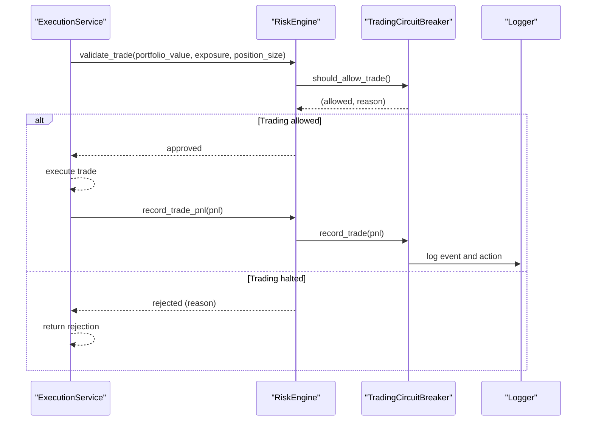
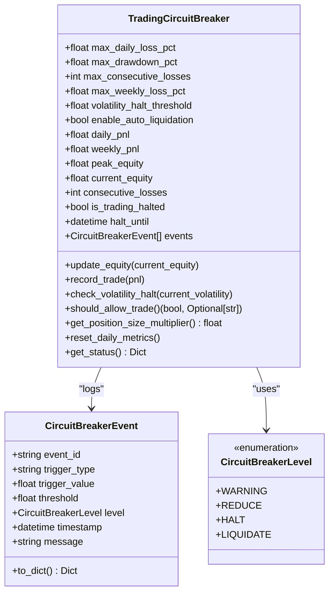
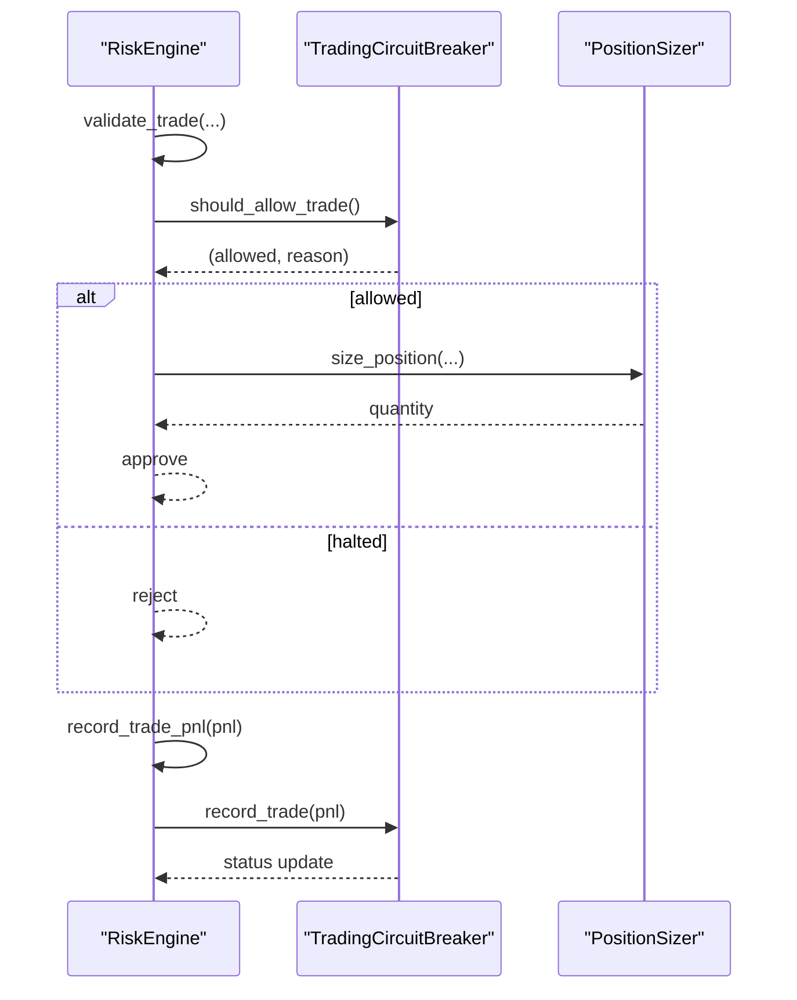
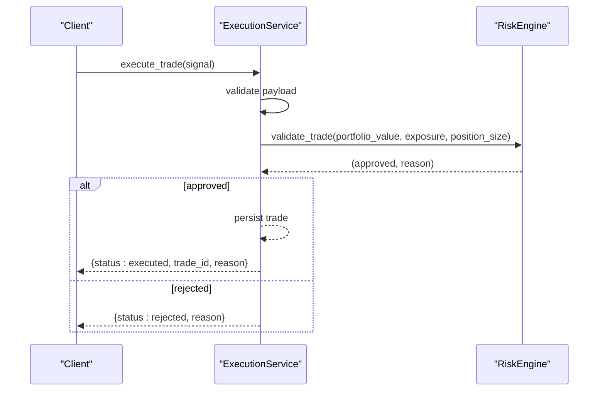
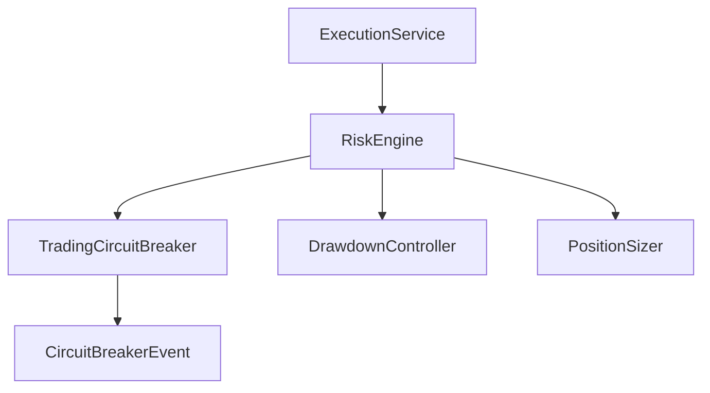

# Circuit Breakers

<cite>
**Referenced Files in This Document**
- [circuit_breaker.py](file://backend/risk/circuit_breaker.py)
- [risk_engine.py](file://backend/risk/risk_engine.py)
- [execution_service.py](file://backend/services/execution_service.py)
- [phase4_backend_validation.py](file://tests/phase4_backend_validation.py)
- [drawdown_controller.py](file://backend/risk/drawdown_controller.py)
- [position_sizer.py](file://backend/risk/position_sizer.py)
</cite>

## Table of Contents
1. [Introduction](#introduction)
2. [Project Structure](#project-structure)
3. [Core Components](#core-components)
4. [Architecture Overview](#architecture-overview)
5. [Detailed Component Analysis](#detailed-component-analysis)
6. [Dependency Analysis](#dependency-analysis)
7. [Performance Considerations](#performance-considerations)
8. [Troubleshooting Guide](#troubleshooting-guide)
9. [Conclusion](#conclusion)
10. [Appendices](#appendices)

## Introduction
This document describes the Trading Circuit Breaker system that enforces multi-level emergency risk controls to protect capital during adverse market conditions. It covers the severity levels, initialization parameters, real-time monitoring of daily and weekly P&L, peak equity, and consecutive losing streaks, the event logging system, trigger mechanisms, and automated enforcement actions. It also provides configuration examples, threshold tuning guidelines, and integration patterns with trading execution systems.

## Project Structure
The Trading Circuit Breaker resides in the backend risk module and integrates with the broader risk engine and execution pipeline. The primary implementation is in the circuit breaker module, with supporting components for drawdown control, position sizing, and integration tests.

**Diagram sources**
- [circuit_breaker.py](file://backend/risk/circuit_breaker.py)
- [risk_engine.py](file://backend/risk/risk_engine.py)
- [execution_service.py](file://backend/services/execution_service.py)
- [drawdown_controller.py](file://backend/risk/drawdown_controller.py)
- [position_sizer.py](file://backend/risk/position_sizer.py)

**Section sources**
- [circuit_breaker.py](file://backend/risk/circuit_breaker.py)
- [risk_engine.py](file://backend/risk/risk_engine.py)
- [execution_service.py](file://backend/services/execution_service.py)
- [drawdown_controller.py](file://backend/risk/drawdown_controller.py)
- [position_sizer.py](file://backend/risk/position_sizer.py)

## Core Components
- CircuitBreakerLevel: Severity levels for triggers (WARNING, REDUCE, HALT, LIQUIDATE).
- TradingCircuitBreaker: Central monitoring and enforcement unit with daily/weekly P&L, peak equity, consecutive loss tracking, and volatility halting.
- RiskEngine: Integrates circuit breaker into pre-trade validation and position sizing.
- ExecutionService: Enforces risk checks before executing trades.
- DrawdownController: Portfolio-level drawdown gating.
- PositionSizer: Basic position sizing; complemented by volatility-aware sizing in the circuit breaker module.

**Section sources**
- [circuit_breaker.py](file://backend/risk/circuit_breaker.py)
- [risk_engine.py](file://backend/risk/risk_engine.py)
- [execution_service.py](file://backend/services/execution_service.py)
- [drawdown_controller.py](file://backend/risk/drawdown_controller.py)
- [position_sizer.py](file://backend/risk/position_sizer.py)

## Architecture Overview
The system operates by continuously monitoring realized P&L and market conditions. When thresholds are exceeded, the circuit breaker triggers a severity level, logs an event, and enforces automated actions such as halting new trading or initiating liquidation. The risk engine coordinates pre-trade validation and position sizing, while the execution service applies these checks during order placement.

**Diagram sources**
- [execution_service.py](file://backend/services/execution_service.py)
- [risk_engine.py](file://backend/risk/risk_engine.py)
- [circuit_breaker.py](file://backend/risk/circuit_breaker.py)

## Detailed Component Analysis

### CircuitBreakerLevel Enumeration
Severity levels define the automated response when a trigger condition is met:
- WARNING: Alert issued; trading continues.
- REDUCE: Reduce position sizes by 50% for a bounded period.
- HALT: Stop all new trading until the halt expires.
- LIQUIDATE: Close all positions immediately (optional, configurable).

These levels are used consistently across trigger logic and enforcement.

**Section sources**
- [circuit_breaker.py](file://backend/risk/circuit_breaker.py)

### TradingCircuitBreaker Class
Responsibilities:
- Track daily and weekly P&L against peak equity.
- Monitor consecutive losing trades.
- Detect extreme volatility and optionally halt trading.
- Maintain event log and enforce automated actions.
- Provide status reporting and position-size multipliers.

Initialization parameters:
- max_daily_loss_pct: Daily loss threshold relative to peak equity.
- max_drawdown_pct: Maximum allowable drawdown from peak.
- max_consecutive_losses: Threshold for consecutive losing trades.
- max_weekly_loss_pct: Weekly loss threshold relative to peak equity.
- volatility_halt_threshold: Volatility level that triggers a halt.
- enable_auto_liquidation: Whether to escalate to liquidation on severe breaches.

Real-time monitoring:
- update_equity(current_equity): Updates current and peak equity for drawdown calculations.
- record_trade(pnl): Increments daily and weekly P&L, updates consecutive losses, and checks all breakers.
- check_volatility_halt(current_volatility): Halts trading if volatility exceeds threshold.

Triggering and enforcement:
- _trigger_circuit_breaker(trigger_type, trigger_value, threshold, level, message): Creates an event, logs it, and enforces action based on level.
- should_allow_trade(): Returns (allowed, reason) considering active halts and expiration.
- get_position_size_multiplier(): Returns 0.0 for HALT, 0.5 if REDUCE was recently triggered, else 1.0.

Status and persistence:
- get_status(): Returns current state including halted flag, reasons, equity metrics, recent events, and position multiplier.
- reset_daily_metrics(): Resets daily counters at start of trading day.

Integration hooks:
- update_equity(current_equity) and record_trade(pnl) are designed to be called by the risk engine after portfolio valuation and trade completion.

**Diagram sources**
- [circuit_breaker.py](file://backend/risk/circuit_breaker.py)

**Section sources**
- [circuit_breaker.py](file://backend/risk/circuit_breaker.py)

### RiskEngine Integration
The risk engine optionally embeds a TradingCircuitBreaker and integrates it into pre-trade validation and position sizing:
- Pre-trade validation: Checks circuit breaker status before approving trades.
- Position sizing: Uses volatility-aware sizing and respects circuit breaker multipliers.
- P&L recording: Records realized P&L from executed trades to update circuit breaker state.
- Equity updates: Receives periodic portfolio equity updates for drawdown tracking.

Key integration points:
- validate_trade(): Calls should_allow_trade() and blocks trades when halted.
- calculate_position_size(): Incorporates volatility and risk adjustment factors.
- record_trade_pnl(pnl): Delegates to circuit breaker to update state and log events.
- update_equity(current_equity): Updates circuit breaker’s equity baseline.

**Diagram sources**
- [risk_engine.py](file://backend/risk/risk_engine.py)
- [circuit_breaker.py](file://backend/risk/circuit_breaker.py)
- [position_sizer.py](file://backend/risk/position_sizer.py)

**Section sources**
- [risk_engine.py](file://backend/risk/risk_engine.py)
- [circuit_breaker.py](file://backend/risk/circuit_breaker.py)
- [position_sizer.py](file://backend/risk/position_sizer.py)

### ExecutionService Integration
The execution service applies risk checks before placing orders:
- Validates required fields in the trade signal.
- Delegates to RiskEngine for pre-trade validation.
- Executes the trade upon approval and persists it to the database.
- On rejection, returns a structured response with the reason.

**Diagram sources**
- [execution_service.py](file://backend/services/execution_service.py)
- [risk_engine.py](file://backend/risk/risk_engine.py)

**Section sources**
- [execution_service.py](file://backend/services/execution_service.py)
- [risk_engine.py](file://backend/risk/risk_engine.py)

### DrawdownController
Provides a simpler portfolio drawdown gating mechanism:
- Tracks peak portfolio value and computes current drawdown.
- Allows or disallows trading based on a maximum drawdown threshold.

While distinct from the TradingCircuitBreaker, it complements portfolio-level drawdown protection.

**Section sources**
- [drawdown_controller.py](file://backend/risk/drawdown_controller.py)

### Volatility-Based Position Sizing
The TradingCircuitBreaker module includes a dedicated volatility-based position sizer:
- Calculates a base position size and adjusts it according to current volatility.
- Applies minimum and maximum bounds and multiplies by a circuit breaker multiplier (0.0–1.0).
- Designed to work alongside the TradingCircuitBreaker’s enforcement logic.

**Section sources**
- [circuit_breaker.py](file://backend/risk/circuit_breaker.py)

## Dependency Analysis
- TradingCircuitBreaker depends on:
  - Python standard library (datetime, timedelta, logging).
  - Internal event model (CircuitBreakerEvent).
- RiskEngine depends on:
  - TradingCircuitBreaker for enforcement.
  - PositionSizer for basic sizing and optionally uses volatility-based sizing.
- ExecutionService depends on:
  - RiskEngine for pre-trade validation.
- DrawdownController is independent and complementary.

**Diagram sources**
- [circuit_breaker.py](file://backend/risk/circuit_breaker.py)
- [risk_engine.py](file://backend/risk/risk_engine.py)
- [execution_service.py](file://backend/services/execution_service.py)
- [drawdown_controller.py](file://backend/risk/drawdown_controller.py)
- [position_sizer.py](file://backend/risk/position_sizer.py)

**Section sources**
- [circuit_breaker.py](file://backend/risk/circuit_breaker.py)
- [risk_engine.py](file://backend/risk/risk_engine.py)
- [execution_service.py](file://backend/services/execution_service.py)
- [drawdown_controller.py](file://backend/risk/drawdown_controller.py)
- [position_sizer.py](file://backend/risk/position_sizer.py)

## Performance Considerations
- Monitoring overhead: Minimal; checks are O(1) per trade and periodic equity updates.
- Event logging: Uses standard logging; ensure appropriate log levels and rotation in production.
- Volatility calculations: External volatility estimates should be cached or computed efficiently to avoid impacting latency.
- Position-size calculations: Vectorized or batched when computing for multiple symbols.

## Troubleshooting Guide
Common issues and resolutions:
- Trading remains halted unexpectedly:
  - Verify halt expiration via should_allow_trade() and get_status().
  - Confirm that reset_daily_metrics() is invoked at the start of each trading day.
- Frequent REDUCE triggers:
  - Review max_daily_loss_pct and max_weekly_loss_pct relative to strategy volatility.
  - Consider adjusting volatility_halt_threshold or enabling auto-liquidation for extreme scenarios.
- Liquidation not triggered:
  - Ensure enable_auto_liquidation is set appropriately for severe drawdown scenarios.
  - Confirm that drawdown breaches are being recorded via update_equity() and record_trade().
- Integration with execution:
  - Validate that RiskEngine.validate_trade() is called before order submission.
  - Confirm that record_trade_pnl() is invoked after trade completion.

Verification via tests:
- Integration tests demonstrate halt triggering on daily loss breaches and status reporting.

**Section sources**
- [phase4_backend_validation.py](file://tests/phase4_backend_validation.py)
- [circuit_breaker.py](file://backend/risk/circuit_breaker.py)
- [risk_engine.py](file://backend/risk/risk_engine.py)

## Conclusion
The Trading Circuit Breaker system provides robust, multi-level emergency controls that automatically enforce capital protection under adverse conditions. By integrating with the risk engine and execution pipeline, it ensures that trading halts or liquidations occur promptly when thresholds are breached, while maintaining transparent event logging and status reporting for observability.

## Appendices

### Configuration Examples and Tuning Guidelines
- Daily loss limit:
  - Set max_daily_loss_pct conservatively (e.g., 2%–5%) depending on strategy volatility and acceptable cadence of losses.
- Maximum drawdown:
  - Set max_drawdown_pct to align with risk capacity (e.g., 10%–20%); consider enable_auto_liquidation for severe breaches.
- Consecutive losses:
  - Choose max_consecutive_losses to reflect strategy stability (e.g., 3–7); lower values increase responsiveness.
- Weekly loss limit:
  - Set max_weekly_loss_pct to complement daily limits (e.g., 1.5×–2× daily).
- Volatility halting:
  - Set volatility_halt_threshold based on historical volatility regimes (e.g., 30%–50% annualized).
- Position sizing:
  - Use get_position_size_multiplier() to reduce exposure during HALT or REDUCE states.
- Integration:
  - Call update_equity() periodically and record_trade_pnl() after each trade.
  - Invoke reset_daily_metrics() at market open to reset daily counters.

### Integration Patterns with Trading Execution Systems
- Pre-trade validation:
  - Call RiskEngine.validate_trade() before sending orders; block execution if rejected.
- Post-trade monitoring:
  - After execution, call RiskEngine.record_trade_pnl() to update breaker state.
- Equity updates:
  - Periodically call RiskEngine.update_equity() to refresh peak equity for drawdown calculations.
- Status reporting:
  - Expose RiskEngine.get_risk_status() to dashboards or alerting systems.

**Section sources**
- [risk_engine.py](file://backend/risk/risk_engine.py)
- [circuit_breaker.py](file://backend/risk/circuit_breaker.py)
- [execution_service.py](file://backend/services/execution_service.py)