# Drawdown Controller

<cite>
**Referenced Files in This Document**
- [drawdown_controller.py](file://backend/risk/drawdown_controller.py)
- [circuit_breaker.py](file://backend/risk/circuit_breaker.py)
- [risk_engine.py](file://backend/risk/risk_engine.py)
- [position_sizer.py](file://backend/risk/position_sizer.py)
- [max_drawdown.py](file://backend/analytics/max_drawdown.py)
- [portfolio_service.py](file://backend/services/portfolio_service.py)
- [portfolio.py](file://backend/routes/portfolio.py)
- [main.py](file://backend/api/main.py)
- [constraints.py](file://FinAgents/research/risk_compliance/constraints.py)
- [compliance_engine.py](file://FinAgents/research/risk_compliance/compliance_engine.py)
- [market_risk.py](file://FinAgents/agent_pools/risk_agent_pool/agents/market_risk.py)
</cite>

## Table of Contents
1. [Introduction](#introduction)
2. [Project Structure](#project-structure)
3. [Core Components](#core-components)
4. [Architecture Overview](#architecture-overview)
5. [Detailed Component Analysis](#detailed-component-analysis)
6. [Dependency Analysis](#dependency-analysis)
7. [Performance Considerations](#performance-considerations)
8. [Troubleshooting Guide](#troubleshooting-guide)
9. [Conclusion](#conclusion)
10. [Appendices](#appendices)

## Introduction
This document describes the drawdown monitoring and control system used to protect capital by tracking peak equity and current portfolio value to compute drawdown percentages. It explains how peak equity is maintained, how drawdown is computed, and how automatic position reduction and trading halts are enforced. It also covers configuration of drawdown thresholds, integration with position sizing, and relationships to broader risk controls such as circuit breakers and portfolio analytics.

## Project Structure
The drawdown control system spans several modules:
- Backend risk modules: drawdown controller, circuit breaker, risk engine, and position sizer
- Analytics: drawdown computation from returns
- Services and routes: portfolio metrics and API exposure
- Research risk compliance: constraints and compliance engine for drawdown enforcement and actions
- Risk agent pool: advanced drawdown metrics and analytics

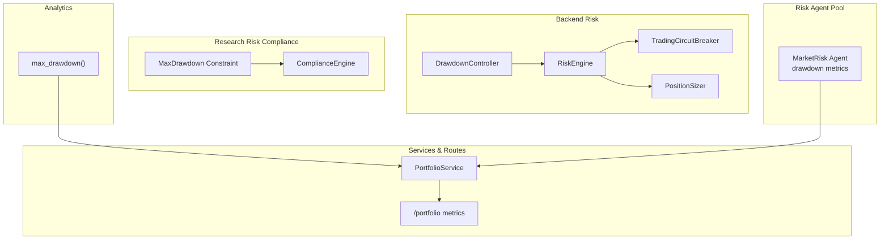

**Diagram sources**
- [drawdown_controller.py:1-30](file://backend/risk/drawdown_controller.py#L1-L30)
- [circuit_breaker.py:1-360](file://backend/risk/circuit_breaker.py#L1-L360)
- [risk_engine.py:1-226](file://backend/risk/risk_engine.py#L1-L226)
- [position_sizer.py:1-21](file://backend/risk/position_sizer.py#L1-L21)
- [max_drawdown.py:1-32](file://backend/analytics/max_drawdown.py#L1-L32)
- [portfolio_service.py:1-169](file://backend/services/portfolio_service.py#L1-L169)
- [portfolio.py:1-34](file://backend/routes/portfolio.py#L1-L34)
- [constraints.py:198-270](file://FinAgents/research/risk_compliance/constraints.py#L198-L270)
- [compliance_engine.py:367-397](file://FinAgents/research/risk_compliance/compliance_engine.py#L367-L397)
- [market_risk.py:725-784](file://FinAgents/agent_pools/risk_agent_pool/agents/market_risk.py#L725-L784)

**Section sources**
- [drawdown_controller.py:1-30](file://backend/risk/drawdown_controller.py#L1-L30)
- [circuit_breaker.py:1-360](file://backend/risk/circuit_breaker.py#L1-L360)
- [risk_engine.py:1-226](file://backend/risk/risk_engine.py#L1-L226)
- [position_sizer.py:1-21](file://backend/risk/position_sizer.py#L1-L21)
- [max_drawdown.py:1-32](file://backend/analytics/max_drawdown.py#L1-L32)
- [portfolio_service.py:1-169](file://backend/services/portfolio_service.py#L1-L169)
- [portfolio.py:1-34](file://backend/routes/portfolio.py#L1-L34)
- [constraints.py:198-270](file://FinAgents/research/risk_compliance/constraints.py#L198-L270)
- [compliance_engine.py:367-397](file://FinAgents/research/risk_compliance/compliance_engine.py#L367-L397)
- [market_risk.py:725-784](file://FinAgents/agent_pools/risk_agent_pool/agents/market_risk.py#L725-L784)

## Core Components
- DrawdownController: Tracks peak portfolio value and determines if trading is allowed based on a configured maximum drawdown percentage.
- TradingCircuitBreaker: Enforces emergency halts and position reductions when drawdown or other risk criteria are met; integrates with RiskEngine.
- RiskEngine: Central risk orchestrator integrating position sizing, stop-loss, and optional circuit breaker monitoring.
- PositionSizer: Computes position sizes based on portfolio value and risk limits; integrates with circuit breaker multipliers.
- Analytics max_drawdown: Computes maximum drawdown from return series for historical analysis.
- PortfolioService and routes: Provide portfolio metrics and returns used for analytics and drawdown computations.
- Research constraints and compliance engine: Define MaxDrawdown constraint checks and prescribe automatic actions on breach.

**Section sources**
- [drawdown_controller.py:1-30](file://backend/risk/drawdown_controller.py#L1-L30)
- [circuit_breaker.py:1-360](file://backend/risk/circuit_breaker.py#L1-L360)
- [risk_engine.py:1-226](file://backend/risk/risk_engine.py#L1-L226)
- [position_sizer.py:1-21](file://backend/risk/position_sizer.py#L1-L21)
- [max_drawdown.py:1-32](file://backend/analytics/max_drawdown.py#L1-L32)
- [portfolio_service.py:1-169](file://backend/services/portfolio_service.py#L1-L169)
- [constraints.py:198-270](file://FinAgents/research/risk_compliance/constraints.py#L198-L270)
- [compliance_engine.py:367-397](file://FinAgents/research/risk_compliance/compliance_engine.py#L367-L397)

## Architecture Overview
The drawdown control system operates across three layers:
- Monitoring and enforcement: DrawdownController and TradingCircuitBreaker maintain peak equity and enforce thresholds.
- Position sizing and risk orchestration: RiskEngine coordinates position sizing and stop-loss logic; PositionSizer applies risk limits and circuit breaker multipliers.
- Analytics and compliance: PortfolioService computes returns and metrics; constraints and compliance engine define policy and actions.

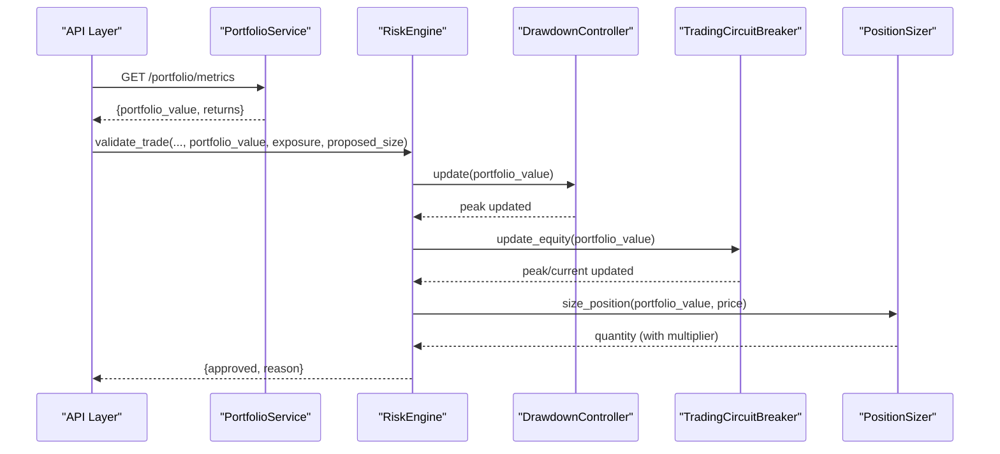

**Diagram sources**
- [portfolio.py:12-31](file://backend/routes/portfolio.py#L12-L31)
- [portfolio_service.py:49-116](file://backend/services/portfolio_service.py#L49-L116)
- [risk_engine.py:72-127](file://backend/risk/risk_engine.py#L72-L127)
- [drawdown_controller.py:11-30](file://backend/risk/drawdown_controller.py#L11-L30)
- [circuit_breaker.py:111-129](file://backend/risk/circuit_breaker.py#L111-L129)
- [position_sizer.py:9-21](file://backend/risk/position_sizer.py#L9-L21)

## Detailed Component Analysis

### DrawdownController
Purpose:
- Maintain peak portfolio value across observations.
- Compute current drawdown against the peak and decide if trading is allowed.

Key behaviors:
- Initialization with a maximum drawdown percentage.
- Update method sets or updates the peak value.
- is_trading_allowed compares current portfolio value to peak to enforce the threshold.

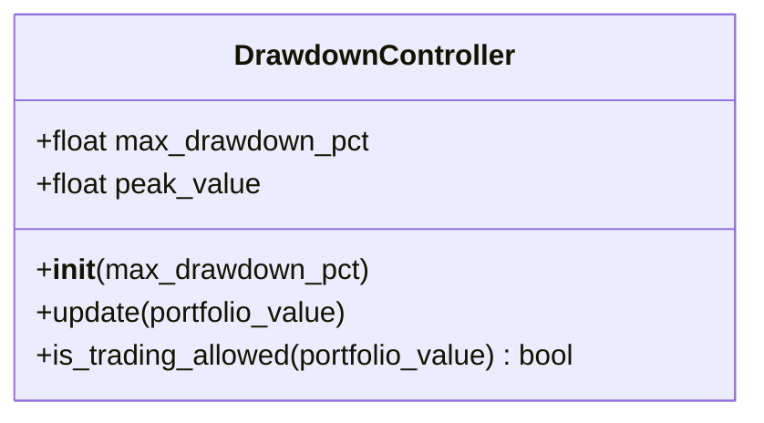

**Diagram sources**
- [drawdown_controller.py:1-30](file://backend/risk/drawdown_controller.py#L1-L30)

**Section sources**
- [drawdown_controller.py:7-30](file://backend/risk/drawdown_controller.py#L7-L30)

### TradingCircuitBreaker
Purpose:
- Enforce emergency trading halts and position reductions based on drawdown and other risk criteria.
- Track peak and current equity to compute drawdown and trigger actions.

Key behaviors:
- Maintains peak and current equity; records daily/weekly PnL and consecutive losses.
- Triggers multiple levels (WARNING, REDUCE, HALT, LIQUIDATE) depending on breaches.
- Provides position size multiplier reflecting current state (e.g., 0.0 during HALT).
- Integrates with RiskEngine via update_equity and record_trade.

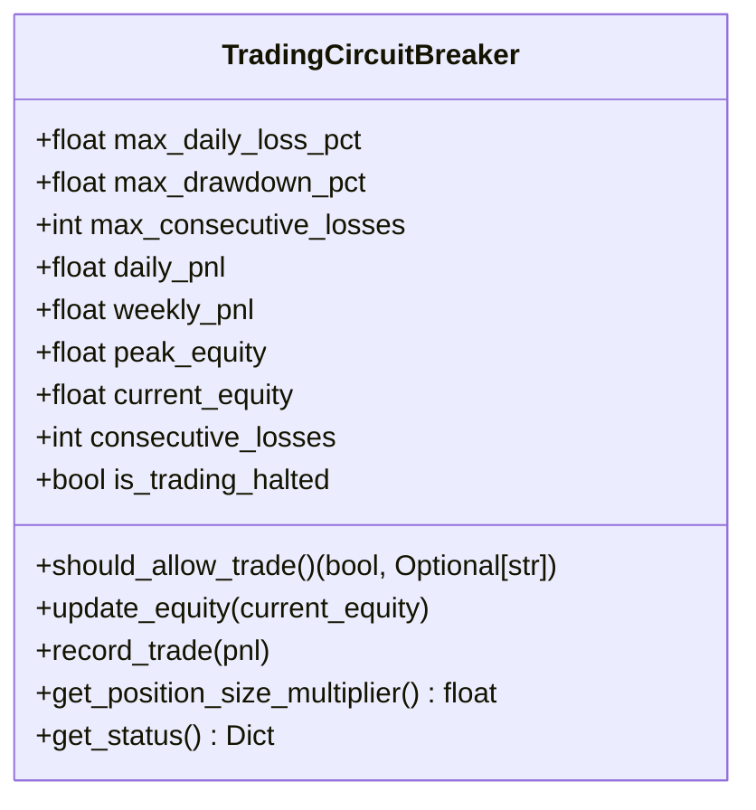

**Diagram sources**
- [circuit_breaker.py:59-302](file://backend/risk/circuit_breaker.py#L59-L302)

**Section sources**
- [circuit_breaker.py:66-175](file://backend/risk/circuit_breaker.py#L66-L175)
- [circuit_breaker.py:235-277](file://backend/risk/circuit_breaker.py#L235-L277)
- [circuit_breaker.py:288-302](file://backend/risk/circuit_breaker.py#L288-L302)

### RiskEngine
Purpose:
- Central risk orchestrator integrating position sizing, stop-loss, and optional circuit breaker monitoring.
- Exposes validate_trade and calculate_position_size; updates equity for drawdown tracking.

Key behaviors:
- Validates trades against position and exposure limits.
- Calculates stop-loss levels and risk-adjusted position sizes.
- Records trade PnL and updates equity for circuit breaker monitoring.

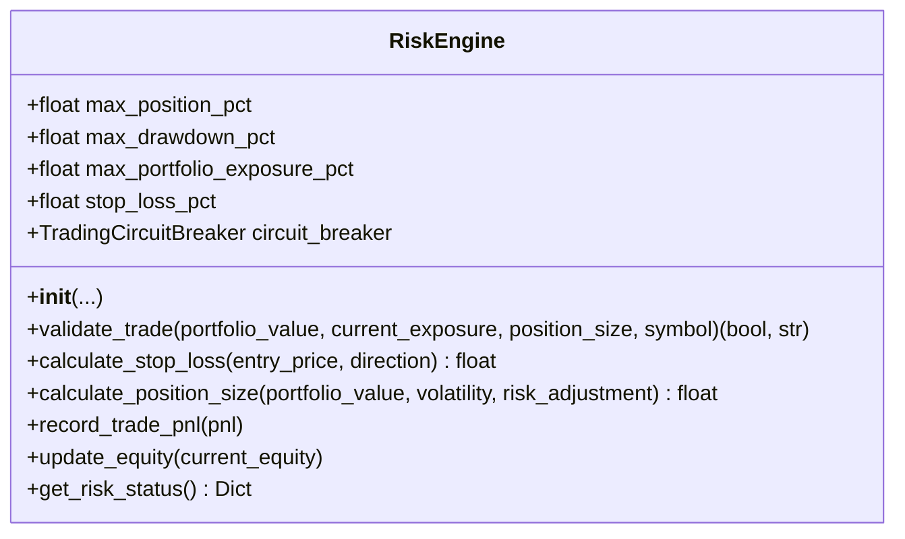

**Diagram sources**
- [risk_engine.py:22-222](file://backend/risk/risk_engine.py#L22-L222)

**Section sources**
- [risk_engine.py:34-71](file://backend/risk/risk_engine.py#L34-L71)
- [risk_engine.py:72-127](file://backend/risk/risk_engine.py#L72-L127)
- [risk_engine.py:150-186](file://backend/risk/risk_engine.py#L150-L186)
- [risk_engine.py:188-208](file://backend/risk/risk_engine.py#L188-L208)
- [risk_engine.py:209-222](file://backend/risk/risk_engine.py#L209-L222)

### PositionSizer
Purpose:
- Determine position size based on portfolio value and maximum position percentage.
- Used alongside circuit breaker multipliers to reduce exposure during breaches.

Key behaviors:
- Validates inputs and computes maximum position value.
- Derives quantity from price and rounds to a fixed precision.

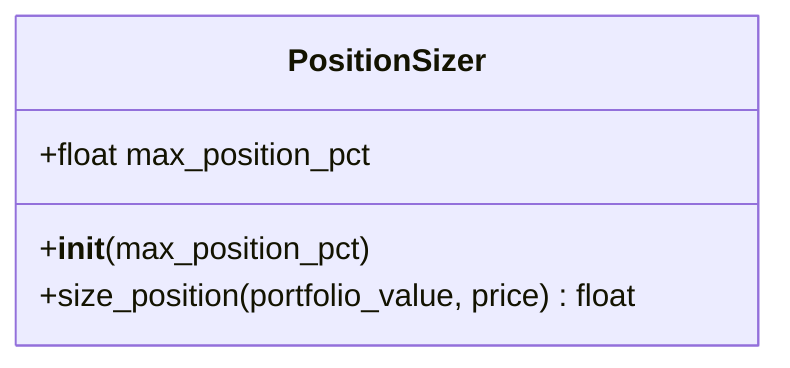

**Diagram sources**
- [position_sizer.py:1-21](file://backend/risk/position_sizer.py#L1-L21)

**Section sources**
- [position_sizer.py:6-21](file://backend/risk/position_sizer.py#L6-L21)

### Analytics: max_drawdown
Purpose:
- Compute maximum drawdown from a sequence of returns for historical analysis.

Key behaviors:
- Iterates through returns to build cumulative wealth and track peak.
- Returns a negative decimal representing the maximum drawdown.

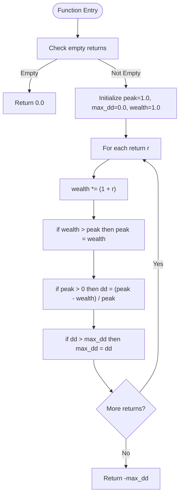

**Diagram sources**
- [max_drawdown.py:8-31](file://backend/analytics/max_drawdown.py#L8-L31)

**Section sources**
- [max_drawdown.py:8-31](file://backend/analytics/max_drawdown.py#L8-L31)

### PortfolioService and API Exposure
Purpose:
- Provide portfolio metrics and returns used for analytics and drawdown computations.
- Expose portfolio endpoints for consumption by clients and dashboards.

Key behaviors:
- Aggregates positions and computes exposure and portfolio value.
- Generates daily returns series from trades for analytics.
- Returns Sharpe, Sortino, volatility, and max drawdown when sufficient data exists.

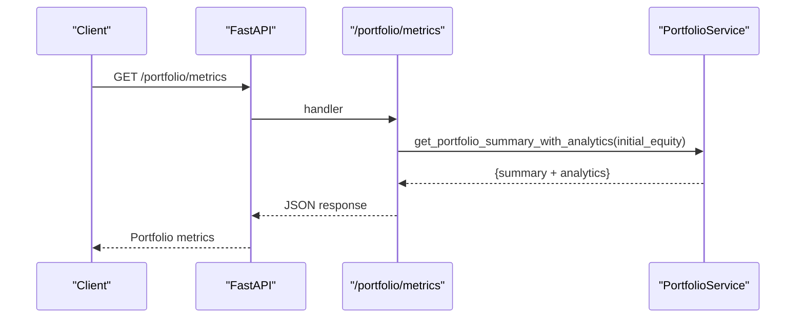

**Diagram sources**
- [main.py:126-138](file://backend/api/main.py#L126-L138)
- [portfolio.py:12-31](file://backend/routes/portfolio.py#L12-L31)
- [portfolio_service.py:86-116](file://backend/services/portfolio_service.py#L86-L116)

**Section sources**
- [portfolio_service.py:20-47](file://backend/services/portfolio_service.py#L20-L47)
- [portfolio_service.py:49-84](file://backend/services/portfolio_service.py#L49-L84)
- [portfolio_service.py:86-116](file://backend/services/portfolio_service.py#L86-L116)
- [portfolio.py:12-31](file://backend/routes/portfolio.py#L12-L31)
- [main.py:126-138](file://backend/api/main.py#L126-L138)

### Research Constraints and Compliance Actions
Purpose:
- Define MaxDrawdown constraint checks and prescribe automatic actions upon breach.
- Integrate with the compliance engine to generate breach responses.

Key behaviors:
- MaxDrawdown constraint calculates current drawdown and utilization percentage.
- Compliance engine prescribes actions such as halting new trading, reducing positions, and notifying stakeholders when drawdown breaches occur.

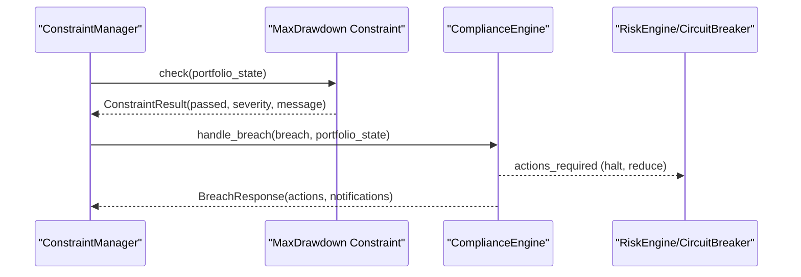

**Diagram sources**
- [constraints.py:213-264](file://FinAgents/research/risk_compliance/constraints.py#L213-L264)
- [compliance_engine.py:379-387](file://FinAgents/research/risk_compliance/compliance_engine.py#L379-L387)

**Section sources**
- [constraints.py:198-270](file://FinAgents/research/risk_compliance/constraints.py#L198-L270)
- [compliance_engine.py:367-397](file://FinAgents/research/risk_compliance/compliance_engine.py#L367-L397)

### Advanced Drawdown Metrics in Risk Agent Pool
Purpose:
- Compute comprehensive drawdown statistics including maximum drawdown, duration, recovery time, percentiles, average drawdown, frequency, and Calmar ratio.

Key behaviors:
- Constructs returns series from portfolio data.
- Computes cumulative returns and drawdowns.
- Aggregates percentiles, averages, and ratios for risk reporting.

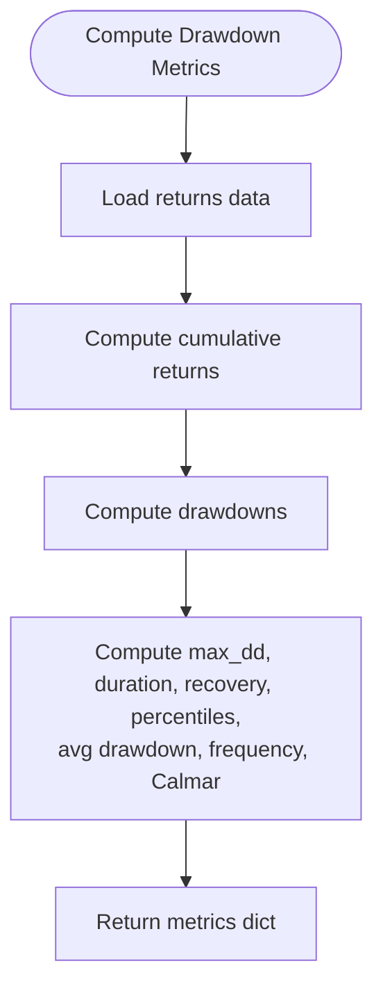

**Diagram sources**
- [market_risk.py:725-784](file://FinAgents/agent_pools/risk_agent_pool/agents/market_risk.py#L725-L784)

**Section sources**
- [market_risk.py:725-784](file://FinAgents/agent_pools/risk_agent_pool/agents/market_risk.py#L725-L784)

## Dependency Analysis
Relationships among core components:
- DrawdownController depends on portfolio value updates to maintain peak and enforce thresholds.
- RiskEngine composes DrawdownController and integrates with TradingCircuitBreaker for dynamic position sizing and trading halts.
- PositionSizer relies on RiskEngine’s risk parameters and circuit breaker multipliers.
- PortfolioService supplies returns and portfolio metrics consumed by analytics and constraints.
- Research constraints and compliance engine depend on portfolio state to evaluate drawdown constraints and issue actions.

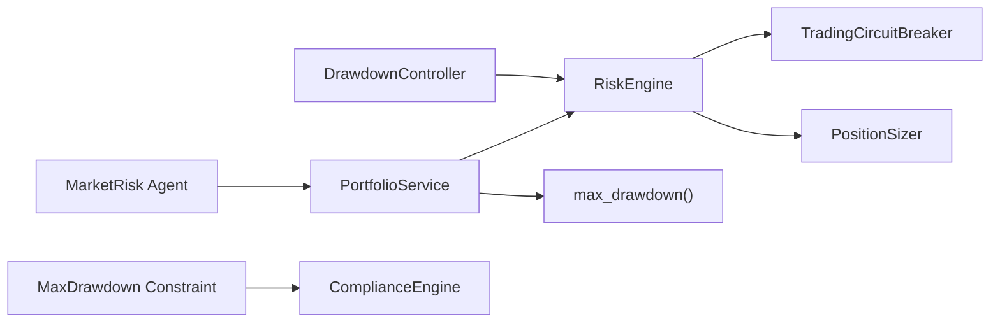

**Diagram sources**
- [drawdown_controller.py:1-30](file://backend/risk/drawdown_controller.py#L1-L30)
- [risk_engine.py:1-226](file://backend/risk/risk_engine.py#L1-L226)
- [circuit_breaker.py:1-360](file://backend/risk/circuit_breaker.py#L1-L360)
- [position_sizer.py:1-21](file://backend/risk/position_sizer.py#L1-L21)
- [portfolio_service.py:1-169](file://backend/services/portfolio_service.py#L1-L169)
- [max_drawdown.py:1-32](file://backend/analytics/max_drawdown.py#L1-L32)
- [constraints.py:198-270](file://FinAgents/research/risk_compliance/constraints.py#L198-L270)
- [compliance_engine.py:367-397](file://FinAgents/research/risk_compliance/compliance_engine.py#L367-L397)
- [market_risk.py:725-784](file://FinAgents/agent_pools/risk_agent_pool/agents/market_risk.py#L725-L784)

**Section sources**
- [risk_engine.py:57-65](file://backend/risk/risk_engine.py#L57-L65)
- [circuit_breaker.py:111-129](file://backend/risk/circuit_breaker.py#L111-L129)
- [position_sizer.py:9-21](file://backend/risk/position_sizer.py#L9-L21)
- [portfolio_service.py:49-116](file://backend/services/portfolio_service.py#L49-L116)
- [constraints.py:213-264](file://FinAgents/research/risk_compliance/constraints.py#L213-L264)
- [compliance_engine.py:379-387](file://FinAgents/research/risk_compliance/compliance_engine.py#L379-L387)

## Performance Considerations
- Real-time drawdown checks: DrawdownController and TradingCircuitBreaker operate in O(1) per observation, minimizing overhead.
- Position sizing: RiskEngine’s position sizing is lightweight; circuit breaker multipliers are applied in constant time.
- Analytics: Computing max drawdown from returns is O(n); ensure periodic or batched recomputation to avoid frequent heavy operations.
- PortfolioService: Daily returns aggregation is O(m) where m is number of trades; cache results when appropriate.

[No sources needed since this section provides general guidance]

## Troubleshooting Guide
Common issues and resolutions:
- Invalid portfolio value: DrawdownController and PositionSizer raise errors for non-positive values; ensure portfolio metrics are valid before invoking.
- Peak not set: DrawdownController initializes peak on first call; ensure at least one update occurs before enforcing thresholds.
- Circuit breaker halt: When trading is halted, new positions are blocked until the halt expires; monitor status and allow resumption automatically.
- Breach actions: On MaxDrawdown breach, compliance engine prescribes immediate halts and position reductions; verify auto-actions are enabled and executed.

**Section sources**
- [drawdown_controller.py:13-14](file://backend/risk/drawdown_controller.py#L13-L14)
- [position_sizer.py:11-15](file://backend/risk/position_sizer.py#L11-L15)
- [circuit_breaker.py:242-255](file://backend/risk/circuit_breaker.py#L242-L255)
- [compliance_engine.py:379-387](file://FinAgents/research/risk_compliance/compliance_engine.py#L379-L387)

## Conclusion
The drawdown control system combines a lightweight DrawdownController for peak tracking and threshold enforcement with a robust TradingCircuitBreaker for emergency halts and position reductions. RiskEngine orchestrates these controls with position sizing and stop-loss logic, while PortfolioService and analytics modules supply the necessary data. Research constraints and compliance engines formalize policy and actions for drawdown breaches, ensuring disciplined risk management across the platform.

[No sources needed since this section summarizes without analyzing specific files]

## Appendices

### Configuration and Thresholds
- DrawdownController: max_drawdown_pct defines the maximum allowable drawdown threshold.
- RiskEngine: max_drawdown_pct is passed to the circuit breaker initialization and influences daily limits.
- TradingCircuitBreaker: max_drawdown_pct sets the peak-to-trough threshold; lower severity levels may trigger position reductions; higher levels may halt trading or liquidate.

**Section sources**
- [drawdown_controller.py:7-8](file://backend/risk/drawdown_controller.py#L7-L8)
- [risk_engine.py:59-64](file://backend/risk/risk_engine.py#L59-L64)
- [circuit_breaker.py:66-91](file://backend/risk/circuit_breaker.py#L66-L91)

### Monitoring Intervals and Real-Time Capabilities
- Real-time updates: DrawdownController.update and TradingCircuitBreaker.update_equity should be called on portfolio value changes.
- RiskEngine.update_equity integrates drawdown monitoring into trade lifecycle.
- Position sizing: PositionSizer respects circuit breaker multipliers for dynamic risk control.

**Section sources**
- [drawdown_controller.py:11-20](file://backend/risk/drawdown_controller.py#L11-L20)
- [circuit_breaker.py:111-114](file://backend/risk/circuit_breaker.py#L111-L114)
- [risk_engine.py:204-207](file://backend/risk/risk_engine.py#L204-L207)
- [position_sizer.py:9-21](file://backend/risk/position_sizer.py#L9-L21)

### Historical Data Requirements
- Returns series: PortfolioService.get_returns_from_trades builds daily returns for analytics.
- Analytics: max_drawdown requires at least two periods of returns; otherwise fallback metrics are returned.

**Section sources**
- [portfolio_service.py:49-84](file://backend/services/portfolio_service.py#L49-L84)
- [portfolio_service.py:86-116](file://backend/services/portfolio_service.py#L86-L116)
- [max_drawdown.py:18-19](file://backend/analytics/max_drawdown.py#L18-L19)

### Integration with Portfolio Management Systems
- API exposure: /portfolio/metrics endpoint aggregates portfolio summary and analytics.
- RiskEngine.validate_trade integrates with position and exposure limits; supports stop-loss calculations.
- Research agent pool: MarketRisk agent computes advanced drawdown metrics for reporting and stress testing.

**Section sources**
- [portfolio.py:12-31](file://backend/routes/portfolio.py#L12-L31)
- [risk_engine.py:72-127](file://backend/risk/risk_engine.py#L72-L127)
- [market_risk.py:725-784](file://FinAgents/agent_pools/risk_agent_pool/agents/market_risk.py#L725-L784)