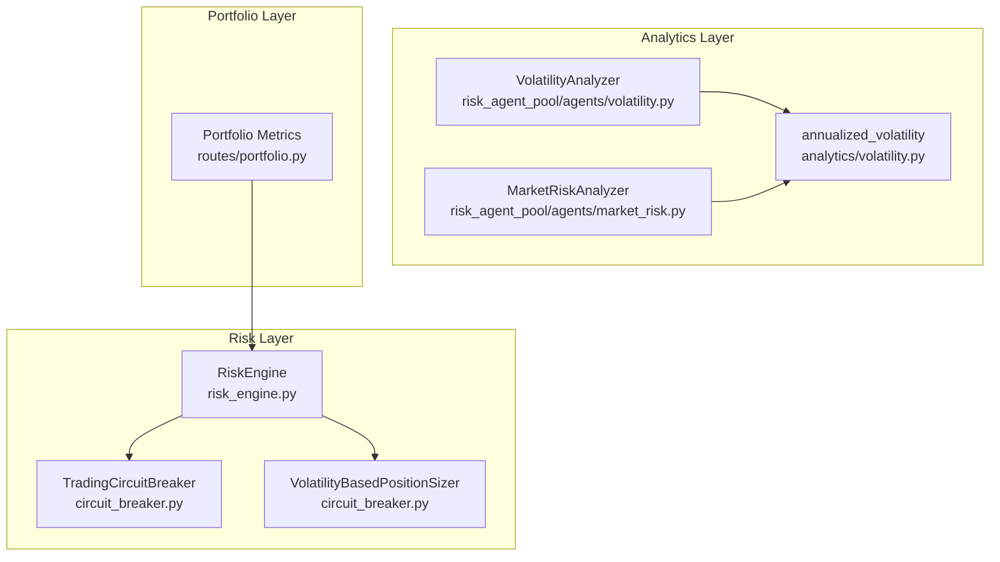
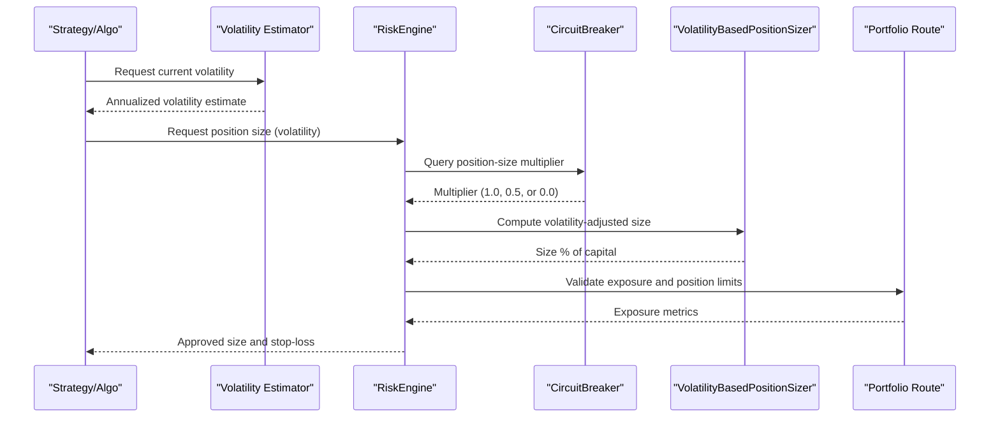
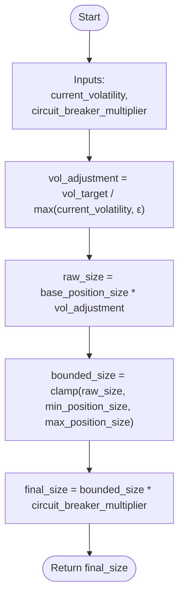
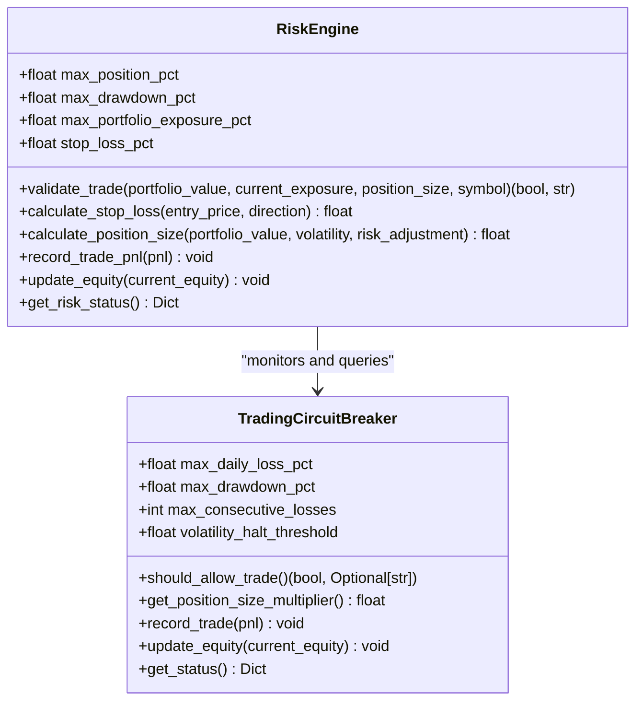
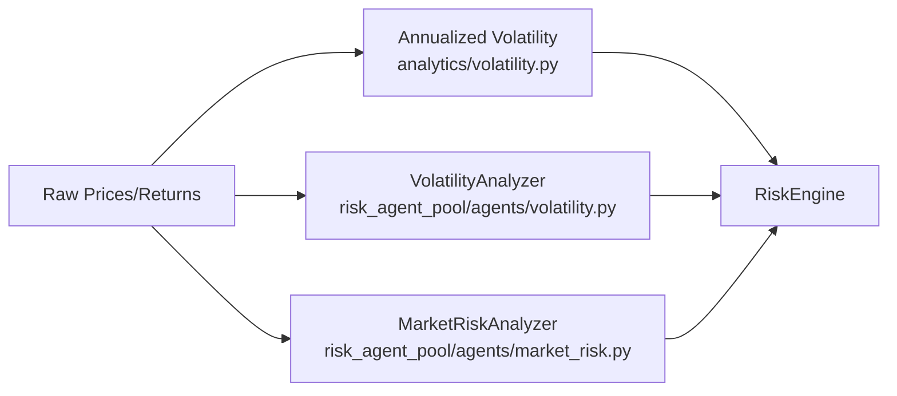
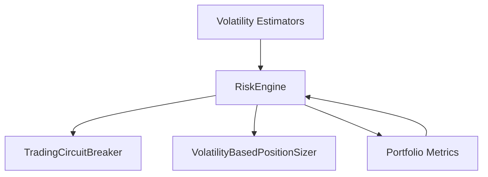

# Position Sizing

<cite>
**Referenced Files in This Document**
- [position_sizer.py](file://backend/risk/position_sizer.py)
- [circuit_breaker.py](file://backend/risk/circuit_breaker.py)
- [risk_engine.py](file://backend/risk/risk_engine.py)
- [volatility.py](file://backend/analytics/volatility.py)
- [volatility.py](file://FinAgents/agent_pools/risk_agent_pool/agents/volatility.py)
- [market_risk.py](file://FinAgents/agent_pools/risk_agent_pool/agents/market_risk.py)
- [portfolio.py](file://backend/routes/portfolio.py)
- [test_risk_engine.py](file://backend_tests/test_risk_engine.py)
</cite>

## Table of Contents
1. [Introduction](#introduction)
2. [Project Structure](#project-structure)
3. [Core Components](#core-components)
4. [Architecture Overview](#architecture-overview)
5. [Detailed Component Analysis](#detailed-component-analysis)
6. [Dependency Analysis](#dependency-analysis)
7. [Performance Considerations](#performance-considerations)
8. [Troubleshooting Guide](#troubleshooting-guide)
9. [Conclusion](#conclusion)

## Introduction
This document explains position sizing algorithms and risk management calculations with a focus on the VolatilityBasedPositionSizer implementation. It details how position sizes are dynamically adjusted based on market volatility using target volatility scaling, and how these calculations integrate with circuit breaker systems and real-time risk controls. Practical examples illustrate position sizing under varying volatility scenarios, risk tolerance configurations, and portfolio allocation strategies.

## Project Structure
The position sizing and risk management functionality spans several modules:
- Risk engine and circuit breaker: central risk orchestration and emergency controls
- Volatility-based position sizing: dynamic scaling by market volatility
- Analytics and risk agents: volatility estimation and market risk metrics
- Portfolio route: exposure and position aggregation for validation

**Diagram sources**
- [risk_engine.py:22-226](file://backend/risk/risk_engine.py#L22-L226)
- [circuit_breaker.py:59-359](file://backend/risk/circuit_breaker.py#L59-L359)
- [volatility.py:25-714](file://FinAgents/agent_pools/risk_agent_pool/agents/volatility.py#L25-L714)
- [volatility.py:9-28](file://backend/analytics/volatility.py#L9-L28)
- [market_risk.py:29-882](file://FinAgents/agent_pools/risk_agent_pool/agents/market_risk.py#L29-L882)
- [portfolio.py:12-34](file://backend/routes/portfolio.py#L12-L34)

**Section sources**
- [risk_engine.py:22-226](file://backend/risk/risk_engine.py#L22-L226)
- [circuit_breaker.py:59-359](file://backend/risk/circuit_breaker.py#L59-L359)
- [volatility.py:25-714](file://FinAgents/agent_pools/risk_agent_pool/agents/volatility.py#L25-L714)
- [volatility.py:9-28](file://backend/analytics/volatility.py#L9-L28)
- [market_risk.py:29-882](file://FinAgents/agent_pools/risk_agent_pool/agents/market_risk.py#L29-L882)
- [portfolio.py:12-34](file://backend/routes/portfolio.py#L12-L34)

## Core Components
- VolatilityBasedPositionSizer: Computes a volatility-adjusted position size as a percentage of capital, bounded by min/max, and further adjusted by circuit breaker multipliers.
- RiskEngine: Validates trades against portfolio exposure and position limits, calculates stop-loss levels, and integrates circuit breaker monitoring.
- TradingCircuitBreaker: Enforces trading halts and position-size reductions based on realized drawdowns, consecutive losses, and volatility thresholds; provides a position-size multiplier.
- PositionSizer: A simpler, capital-per-position approach for comparison and baseline sizing.
- Analytics: Provides volatility estimators and market risk metrics used to inform position sizing.

**Section sources**
- [circuit_breaker.py:305-354](file://backend/risk/circuit_breaker.py#L305-L354)
- [risk_engine.py:22-226](file://backend/risk/risk_engine.py#L22-L226)
- [position_sizer.py:1-21](file://backend/risk/position_sizer.py#L1-L21)
- [volatility.py:9-28](file://backend/analytics/volatility.py#L9-L28)

## Architecture Overview
The position sizing pipeline integrates volatility estimates with risk controls and portfolio exposure checks:

**Diagram sources**
- [volatility.py:9-28](file://backend/analytics/volatility.py#L9-L28)
- [risk_engine.py:150-186](file://backend/risk/risk_engine.py#L150-L186)
- [circuit_breaker.py:257-277](file://backend/risk/circuit_breaker.py#L257-L277)
- [circuit_breaker.py:324-354](file://backend/risk/circuit_breaker.py#L324-L354)
- [portfolio.py:12-34](file://backend/routes/portfolio.py#L12-L34)

## Detailed Component Analysis

### VolatilityBasedPositionSizer
The VolatilityBasedPositionSizer computes a risk-adjusted position size as a percentage of capital to risk. It applies:
- Target volatility scaling: inverse scaling by current volatility relative to a target
- Bounds: clamps the raw size between minimum and maximum position-size percentages
- Circuit breaker multiplier: reduces size further when trading is restricted

**Diagram sources**
- [circuit_breaker.py:324-354](file://backend/risk/circuit_breaker.py#L324-L354)

Parameters and defaults:
- base_position_size: default 0.02 (2% of capital per trade)
- vol_target: default 0.15 (15% annualized target volatility)
- max_position_size: default 0.05 (5% per trade)
- min_position_size: default 0.005 (0.5% per trade)

Integration points:
- Circuit breaker multiplier: 1.0 (normal), 0.5 (reduce), 0.0 (halt)
- RiskEngine’s validate_trade enforces portfolio exposure and position limits

Practical examples (conceptual):
- Scenario A: Low volatility (current_volatility = 0.10) with normal conditions:
  - vol_adjustment ≈ 0.15 / 0.10 = 1.5
  - raw_size = 0.02 * 1.5 = 0.03
  - bounded_size = clamp(0.03; 0.005, 0.05) = 0.03
  - final_size = 0.03 * 1.0 = 0.03 (3% of capital)
- Scenario B: High volatility (current_volatility = 0.25) with normal conditions:
  - vol_adjustment ≈ 0.15 / 0.25 = 0.6
  - raw_size = 0.02 * 0.6 = 0.012
  - bounded_size = clamp(0.012; 0.005, 0.05) = 0.012
  - final_size = 0.012 * 1.0 = 0.012 (1.2% of capital)
- Scenario C: Elevated volatility with circuit breaker reduce:
  - final_size = 0.012 * 0.5 = 0.006 (0.6% of capital)

**Section sources**
- [circuit_breaker.py:305-354](file://backend/risk/circuit_breaker.py#L305-L354)

### RiskEngine and Position Validation
RiskEngine performs:
- Pre-trade validation: checks portfolio value, position size, and total exposure
- Stop-loss calculation: directional stop-loss levels
- Volatility-based sizing: alternative method using RiskEngine’s internal volatility scaling
- Circuit breaker integration: records P&L and updates equity for drawdown monitoring

**Diagram sources**
- [risk_engine.py:22-226](file://backend/risk/risk_engine.py#L22-L226)
- [circuit_breaker.py:59-302](file://backend/risk/circuit_breaker.py#L59-L302)

Validation logic highlights:
- Portfolio exposure: total exposure must not exceed max_portfolio_exposure_pct of portfolio_value
- Per-position limit: position_size must not exceed max_position_pct of portfolio_value
- Circuit breaker: if trading is halted, reject new trades; if reduced, adjust size accordingly

**Section sources**
- [risk_engine.py:72-127](file://backend/risk/risk_engine.py#L72-L127)
- [risk_engine.py:188-208](file://backend/risk/risk_engine.py#L188-L208)
- [test_risk_engine.py:5-35](file://backend_tests/test_risk_engine.py#L5-L35)

### Volatility Estimation and Market Risk
Volatility estimation supports position sizing:
- Analytics volatility: annualized standard deviation from returns
- Risk agent volatility analyzer: historical, implied, forecast, clustering, GARCH
- Market risk analyzer: portfolio-level volatility, VaR, stress testing

**Diagram sources**
- [volatility.py:9-28](file://backend/analytics/volatility.py#L9-L28)
- [volatility.py:25-714](file://FinAgents/agent_pools/risk_agent_pool/agents/volatility.py#L25-L714)
- [market_risk.py:215-261](file://FinAgents/agent_pools/risk_agent_pool/agents/market_risk.py#L215-L261)

**Section sources**
- [volatility.py:9-28](file://backend/analytics/volatility.py#L9-L28)
- [volatility.py:121-167](file://FinAgents/agent_pools/risk_agent_pool/agents/volatility.py#L121-L167)
- [market_risk.py:215-261](file://FinAgents/agent_pools/risk_agent_pool/agents/market_risk.py#L215-L261)

### Portfolio Exposure and Position Limits
The portfolio route aggregates exposure and provides portfolio metrics used by RiskEngine for validation:
- Exposure: absolute sum of position quantities
- Cash: portfolio_value minus exposure

These metrics ensure that total exposure does not exceed configured limits.

**Section sources**
- [portfolio.py:12-34](file://backend/routes/portfolio.py#L12-L34)

## Dependency Analysis
Key dependencies and coupling:
- RiskEngine depends on TradingCircuitBreaker for position-size multipliers and status
- VolatilityBasedPositionSizer is embedded in TradingCircuitBreaker and used by RiskEngine
- Analytics modules supply volatility estimates consumed by both sizing methods
- Portfolio route exposes exposure metrics used by RiskEngine’s validate_trade

**Diagram sources**
- [risk_engine.py:22-226](file://backend/risk/risk_engine.py#L22-L226)
- [circuit_breaker.py:59-359](file://backend/risk/circuit_breaker.py#L59-L359)
- [portfolio.py:12-34](file://backend/routes/portfolio.py#L12-L34)

**Section sources**
- [risk_engine.py:22-226](file://backend/risk/risk_engine.py#L22-L226)
- [circuit_breaker.py:59-359](file://backend/risk/circuit_breaker.py#L59-L359)
- [portfolio.py:12-34](file://backend/routes/portfolio.py#L12-L34)

## Performance Considerations
- Volatility estimation: annualized volatility computation is O(n) in the number of returns; keep lookback windows aligned with trading horizon
- RiskEngine validation: constant-time checks for exposure and position limits; circuit breaker queries are lightweight
- Circuit breaker multipliers: applied as scalar adjustments; minimal computational overhead
- Portfolio exposure aggregation: linear in number of positions; consider caching exposure for frequent validations

## Troubleshooting Guide
Common issues and resolutions:
- Invalid portfolio value or price: PositionSizer raises errors for non-positive inputs; ensure portfolio_value and price are valid before calling size_position
- Trade rejected due to exposure: Increase portfolio_value or reduce planned position size; verify total exposure via portfolio metrics
- Circuit breaker halt: Wait until halt expires or trading resumes; reduce planned position size to account for multiplier
- Overly conservative sizing: Lower min_position_size or increase base_position_size; review vol_target and max_position_size
- Volatility spikes: Circuit breaker may trigger volatility halt; monitor get_status and reduce position size manually if needed

**Section sources**
- [position_sizer.py:11-15](file://backend/risk/position_sizer.py#L11-L15)
- [risk_engine.py:91-127](file://backend/risk/risk_engine.py#L91-L127)
- [circuit_breaker.py:235-255](file://backend/risk/circuit_breaker.py#L235-L255)
- [circuit_breaker.py:288-302](file://backend/risk/circuit_breaker.py#L288-L302)

## Conclusion
The VolatilityBasedPositionSizer provides a robust, target-volatility–driven approach to dynamic position sizing, bounded by configurable limits and further adjusted by circuit breaker multipliers. Integrated with RiskEngine and portfolio exposure checks, it offers a comprehensive risk control framework suitable for volatile markets. By combining accurate volatility estimates from analytics modules and disciplined position limits, traders can maintain consistent risk-adjusted exposures across diverse market regimes.