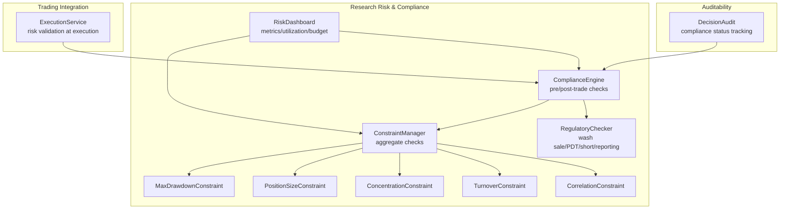
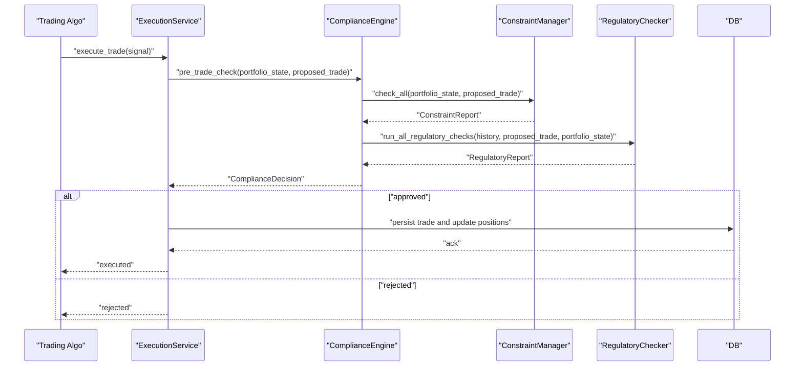
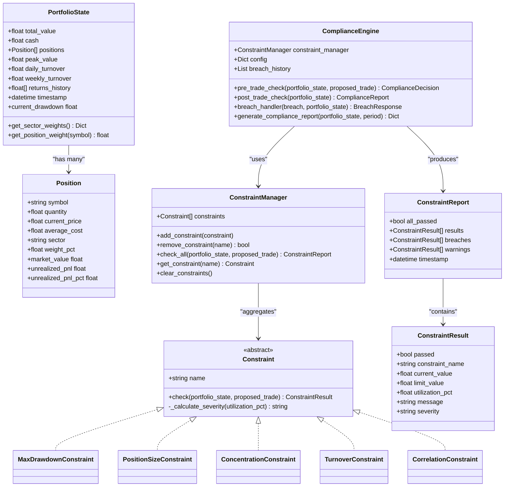
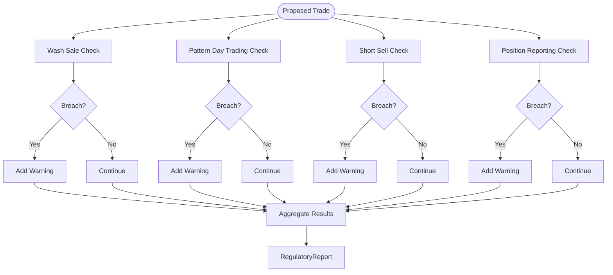
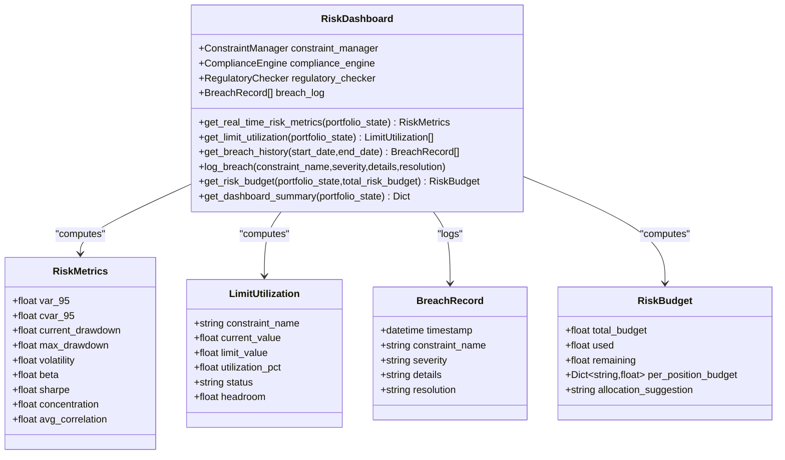
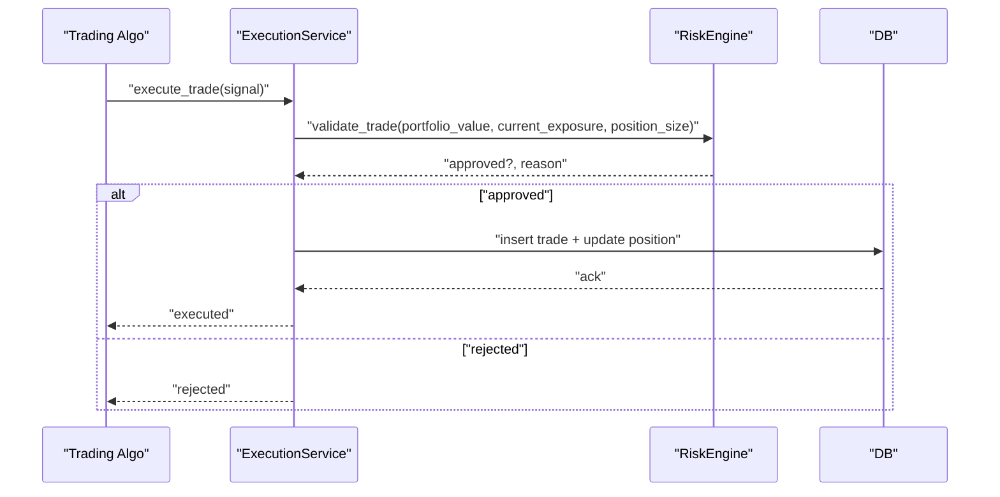
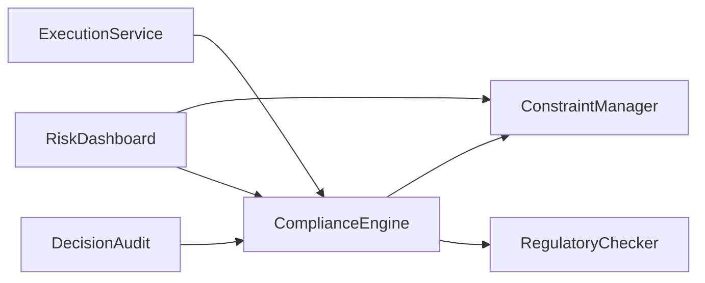

# Regulatory Compliance

<cite>
**Referenced Files in This Document**
- [compliance_engine.py](file://FinAgents/research/risk_compliance/compliance_engine.py)
- [constraints.py](file://FinAgents/research/risk_compliance/constraints.py)
- [regulatory_checks.py](file://FinAgents/research/risk_compliance/regulatory_checks.py)
- [risk_dashboard.py](file://FinAgents/research/risk_compliance/risk_dashboard.py)
- [execution_service.py](file://backend/services/execution_service.py)
- [decision_audit.py](file://FinAgents/research/explainability/decision_audit.py)
</cite>

## Table of Contents
1. [Introduction](#introduction)
2. [Project Structure](#project-structure)
3. [Core Components](#core-components)
4. [Architecture Overview](#architecture-overview)
5. [Detailed Component Analysis](#detailed-component-analysis)
6. [Dependency Analysis](#dependency-analysis)
7. [Performance Considerations](#performance-considerations)
8. [Troubleshooting Guide](#troubleshooting-guide)
9. [Conclusion](#conclusion)
10. [Appendices](#appendices)

## Introduction
This document describes the regulatory compliance subsystems and reporting mechanisms implemented in the repository. It focuses on MiFID II-aligned constraint checking, position concentration limits, regulatory-style validation (including wash sale, pattern day trading, short selling, and reporting thresholds), and the integration with trading systems for real-time pre- and post-trade validation. It also documents compliance checking algorithms, threshold monitoring, automated alerting, jurisdiction-specific reporting considerations, and audit trail maintenance.

## Project Structure
The compliance system is centered around three modules in the research risk compliance package:
- Constraint framework and engines for pre- and post-trade validation
- Regulatory-style checks aligned with US retail investor protections
- Risk dashboard for real-time monitoring and reporting

Integration with the trading execution service is present to enforce risk limits at execution time. Auditability is supported via a decision audit trail.

**Diagram sources**
- [compliance_engine.py:82-530](file://FinAgents/research/risk_compliance/compliance_engine.py#L82-L530)
- [constraints.py:147-742](file://FinAgents/research/risk_compliance/constraints.py#L147-L742)
- [regulatory_checks.py:155-547](file://FinAgents/research/risk_compliance/regulatory_checks.py#L155-L547)
- [risk_dashboard.py:108-616](file://FinAgents/research/risk_compliance/risk_dashboard.py#L108-L616)
- [execution_service.py:10-107](file://backend/services/execution_service.py#L10-L107)
- [decision_audit.py:296-374](file://FinAgents/research/explainability/decision_audit.py#L296-L374)

**Section sources**
- [compliance_engine.py:1-530](file://FinAgents/research/risk_compliance/compliance_engine.py#L1-L530)
- [constraints.py:1-742](file://FinAgents/research/risk_compliance/constraints.py#L1-L742)
- [regulatory_checks.py:1-547](file://FinAgents/research/risk_compliance/regulatory_checks.py#L1-L547)
- [risk_dashboard.py:1-616](file://FinAgents/research/risk_compliance/risk_dashboard.py#L1-L616)
- [execution_service.py:1-107](file://backend/services/execution_service.py#L1-L107)
- [decision_audit.py:280-374](file://FinAgents/research/explainability/decision_audit.py#L280-L374)

## Core Components
- Constraint framework: Defines portfolio state, positions, and constraints (drawdown, position size, concentration, turnover, correlation). ConstraintManager aggregates checks and produces reports.
- ComplianceEngine: Orchestrates pre-trade approval with optional trade modification and post-trade compliance reporting with breach handling and corrective actions.
- RegulatoryChecker: Performs wash sale, pattern day trading, short selling, and position reporting checks aligned with US retail investor rules.
- RiskDashboard: Computes risk metrics, limit utilization, breach history, and risk budgets for real-time monitoring.
- ExecutionService: Integrates risk validation into the execution pipeline.
- DecisionAudit: Maintains an audit trail with compliance status for downstream reporting and governance.

**Section sources**
- [constraints.py:15-742](file://FinAgents/research/risk_compliance/constraints.py#L15-L742)
- [compliance_engine.py:82-530](file://FinAgents/research/risk_compliance/compliance_engine.py#L82-L530)
- [regulatory_checks.py:155-547](file://FinAgents/research/risk_compliance/regulatory_checks.py#L155-L547)
- [risk_dashboard.py:108-616](file://FinAgents/research/risk_compliance/risk_dashboard.py#L108-L616)
- [execution_service.py:10-107](file://backend/services/execution_service.py#L10-L107)
- [decision_audit.py:296-374](file://FinAgents/research/explainability/decision_audit.py#L296-L374)

## Architecture Overview
The system separates pre-trade validation (ComplianceEngine + ConstraintManager + RegulatoryChecker) from post-trade monitoring (RiskDashboard) and integrates with the execution service for real-time enforcement. Auditability is achieved via the decision audit trail.

**Diagram sources**
- [execution_service.py:16-101](file://backend/services/execution_service.py#L16-L101)
- [compliance_engine.py:118-184](file://FinAgents/research/risk_compliance/compliance_engine.py#L118-L184)
- [constraints.py:687-722](file://FinAgents/research/risk_compliance/constraints.py#L687-L722)
- [regulatory_checks.py:489-546](file://FinAgents/research/risk_compliance/regulatory_checks.py#L489-L546)

## Detailed Component Analysis

### Constraint Framework and Engines
- PortfolioState encapsulates total value, cash, positions, peak value, turnover, returns history, and timestamps. It computes sector weights and current drawdown.
- Constraints:
  - MaxDrawdownConstraint: Enforces peak-to-current drawdown limits and severity-based messaging.
  - PositionSizeConstraint: Validates single-position and sector-weight caps and calculates worst-case utilization.
  - ConcentrationConstraint: Measures top-N concentration using a Herfindahl-like metric and warns/flags breaches.
  - TurnoverConstraint: Tracks daily and weekly turnover and enforces limits.
  - CorrelationConstraint: Estimates portfolio correlation using concentration and return autocorrelation proxies.
- ConstraintManager: Registers constraints, runs aggregate checks, and returns a ConstraintReport with breaches and warnings.
- ComplianceEngine:
  - Pre-trade: Runs constraint checks; optionally reduces trade size iteratively; returns approval/modification/warnings or rejection reasons.
  - Post-trade: Generates compliance reports, risk summaries, and breach histories; provides corrective actions.
  - Breach handling: Produces severity-based responses with auto-actions and notifications.
  - Reporting: Builds compliance reports with constraint utilizations, recent breaches, and portfolio summaries.

**Diagram sources**
- [constraints.py:15-742](file://FinAgents/research/risk_compliance/constraints.py#L15-L742)
- [compliance_engine.py:82-530](file://FinAgents/research/risk_compliance/compliance_engine.py#L82-L530)

**Section sources**
- [constraints.py:15-742](file://FinAgents/research/risk_compliance/constraints.py#L15-L742)
- [compliance_engine.py:82-530](file://FinAgents/research/risk_compliance/compliance_engine.py#L82-L530)

### Regulatory Checks (US Retail Investor Rules)
- RegulatoryChecker performs:
  - Wash sale detection within a configurable lookback window.
  - Pattern Day Trader status based on day trades in a rolling window.
  - Short selling validation including locate and uptick rule considerations.
  - Position reporting threshold checks (proxy using portfolio weight).
- Outputs structured results and a consolidated RegulatoryReport with warnings and “all clear” status.

**Diagram sources**
- [regulatory_checks.py:155-547](file://FinAgents/research/risk_compliance/regulatory_checks.py#L155-L547)

**Section sources**
- [regulatory_checks.py:155-547](file://FinAgents/research/risk_compliance/regulatory_checks.py#L155-L547)

### Risk Dashboard and Reporting
- RiskDashboard computes:
  - VaR and Expected Shortfall, drawdowns, volatility, beta, Sharpe ratio, concentration, and average correlation.
  - Limit utilization per constraint with status and headroom.
  - Breach history with filtering by date range.
  - Risk budget allocation and suggestions.
  - Complete dashboard summary with overall risk level derived from metrics, utilizations, and recent breaches.
- ComplianceEngine integrates with RiskDashboard to produce compliance reports and risk summaries.

**Diagram sources**
- [risk_dashboard.py:108-616](file://FinAgents/research/risk_compliance/risk_dashboard.py#L108-L616)

**Section sources**
- [risk_dashboard.py:108-616](file://FinAgents/research/risk_compliance/risk_dashboard.py#L108-L616)
- [compliance_engine.py:438-530](file://FinAgents/research/risk_compliance/compliance_engine.py#L438-L530)

### Execution Integration and Automated Alerts
- ExecutionService validates trades using a risk engine and persists approved trades, updating portfolio positions accordingly.
- ComplianceEngine’s post-trade checks and RiskDashboard’s breach logging provide automated alerts and corrective action recommendations.
- DecisionAudit tracks compliance status for governance and reporting.

**Diagram sources**
- [execution_service.py:16-101](file://backend/services/execution_service.py#L16-L101)

**Section sources**
- [execution_service.py:10-107](file://backend/services/execution_service.py#L10-L107)
- [compliance_engine.py:236-276](file://FinAgents/research/risk_compliance/compliance_engine.py#L236-L276)
- [risk_dashboard.py:390-414](file://FinAgents/research/risk_compliance/risk_dashboard.py#L390-L414)
- [decision_audit.py:296-374](file://FinAgents/research/explainability/decision_audit.py#L296-L374)

## Dependency Analysis
- ComplianceEngine depends on ConstraintManager and RegulatoryChecker to produce pre- and post-trade outcomes.
- RiskDashboard depends on ConstraintManager and ComplianceEngine for metrics and breach history.
- ExecutionService depends on a risk engine to gate executions; ComplianceEngine can be integrated here for richer pre-trade checks.
- DecisionAudit consumes compliance outcomes for governance reporting.

**Diagram sources**
- [compliance_engine.py:82-117](file://FinAgents/research/risk_compliance/compliance_engine.py#L82-L117)
- [constraints.py:648-742](file://FinAgents/research/risk_compliance/constraints.py#L648-L742)
- [regulatory_checks.py:155-183](file://FinAgents/research/risk_compliance/regulatory_checks.py#L155-L183)
- [risk_dashboard.py:108-140](file://FinAgents/research/risk_compliance/risk_dashboard.py#L108-L140)
- [execution_service.py:10-14](file://backend/services/execution_service.py#L10-L14)
- [decision_audit.py:296-374](file://FinAgents/research/explainability/decision_audit.py#L296-L374)

**Section sources**
- [compliance_engine.py:82-117](file://FinAgents/research/risk_compliance/compliance_engine.py#L82-L117)
- [constraints.py:648-742](file://FinAgents/research/risk_compliance/constraints.py#L648-L742)
- [regulatory_checks.py:155-183](file://FinAgents/research/risk_compliance/regulatory_checks.py#L155-L183)
- [risk_dashboard.py:108-140](file://FinAgents/research/risk_compliance/risk_dashboard.py#L108-L140)
- [execution_service.py:10-14](file://backend/services/execution_service.py#L10-L14)
- [decision_audit.py:296-374](file://FinAgents/research/explainability/decision_audit.py#L296-L374)

## Performance Considerations
- Constraint checks scale linearly with the number of constraints and positions.
- Correlation and turnover checks involve portfolio-wide computations; caching returns history and recalculating only on updates improves efficiency.
- Iterative trade modification in ComplianceEngine reduces trade size incrementally; tune max attempts and step size to balance responsiveness and performance.
- RiskDashboard aggregation functions use vectorized operations; ensure returns history is efficiently maintained.

[No sources needed since this section provides general guidance]

## Troubleshooting Guide
Common issues and resolutions:
- Pre-trade rejections due to breaches:
  - Review ConstraintReport and BreachResponse details to identify offending constraints and suggested actions.
  - Adjust trade size or composition; monitor corrective actions generated by the engine.
- Post-trade breaches:
  - Use RiskDashboard breach logs and ComplianceEngine’s breach handler to determine severity and remediation steps.
- Regulatory check warnings:
  - Wash sale: Wait beyond the lookback window before repurchasing the same security.
  - PDT: Reduce day trade frequency within the rolling window.
  - Short selling: Ensure locate/borrow availability and adhere to uptick rule considerations.
  - Reporting thresholds: Monitor positions exceeding the configured percentage and prepare disclosures.
- Execution gating:
  - ExecutionService may reject trades if risk validation fails; verify portfolio value, exposure, and position size inputs.

**Section sources**
- [compliance_engine.py:118-184](file://FinAgents/research/risk_compliance/compliance_engine.py#L118-L184)
- [compliance_engine.py:236-436](file://FinAgents/research/risk_compliance/compliance_engine.py#L236-L436)
- [regulatory_checks.py:184-547](file://FinAgents/research/risk_compliance/regulatory_checks.py#L184-L547)
- [risk_dashboard.py:390-414](file://FinAgents/research/risk_compliance/risk_dashboard.py#L390-L414)
- [execution_service.py:40-51](file://backend/services/execution_service.py#L40-L51)

## Conclusion
The compliance system provides a modular, extensible framework for pre- and post-trade validation, regulatory-style checks, and real-time risk monitoring. It integrates with the execution pipeline and maintains an audit trail suitable for governance and reporting. The design supports MiFID II–aligned controls such as position concentration limits, turnover caps, and drawdown monitoring, while the RegulatoryChecker aligns with US retail investor protections. Extending constraint sets, tuning thresholds, and integrating with broader risk dashboards enables comprehensive compliance coverage.

[No sources needed since this section summarizes without analyzing specific files]

## Appendices

### Regulatory Framework Implementation Notes
- Position concentration limits:
  - Implemented via PositionSizeConstraint and ConcentrationConstraint; supports sector and top-N position caps.
- Turnover monitoring:
  - TurnoverConstraint tracks daily and weekly turnover and enforces limits.
- Drawdown control:
  - MaxDrawdownConstraint enforces peak-to-current drawdown limits with severity-based actions.
- Regulatory reporting:
  - RegulatoryChecker flags reporting thresholds (proxy-based) and provides detailed filing guidance.

**Section sources**
- [constraints.py:197-531](file://FinAgents/research/risk_compliance/constraints.py#L197-L531)
- [regulatory_checks.py:416-487](file://FinAgents/research/risk_compliance/regulatory_checks.py#L416-L487)

### Jurisdiction-Specific Considerations
- The RegulatoryChecker includes US retail investor rules (wash sale, PDT, short sale, reporting thresholds). For MiFID II jurisdictions, replace or augment constraints with:
  - Pre-notification and transparency requirements
  - Short selling restrictions and circuit breakers
  - Aggregate position reporting and publication obligations
  - Market abuse detection enhancements (e.g., insider trading, market manipulation indicators)
- Reporting formats:
  - Align with national competent authority templates and standardized reporting formats (e.g., regulatory T3/T4 filings, trade reporting systems).
- Audit trail:
  - Maintain immutable logs with timestamps, constraint names, utilization percentages, and remedial actions for regulatory review.

[No sources needed since this section provides general guidance]