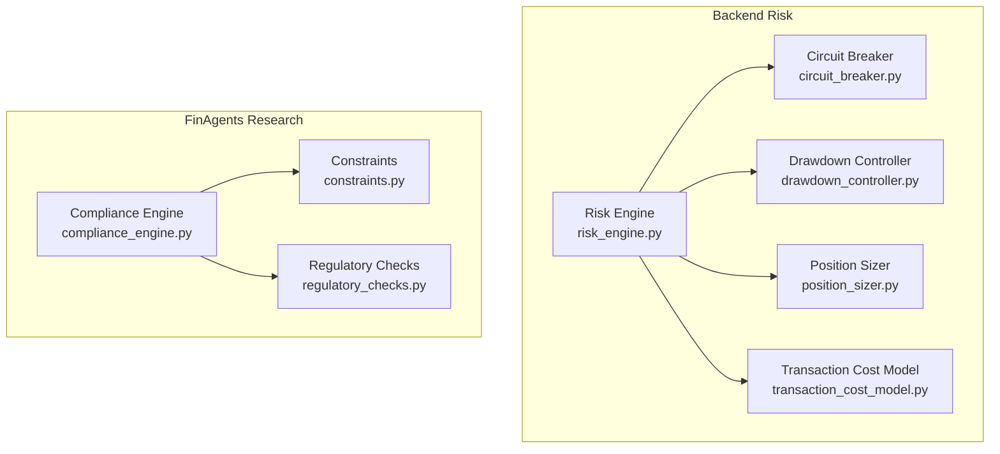
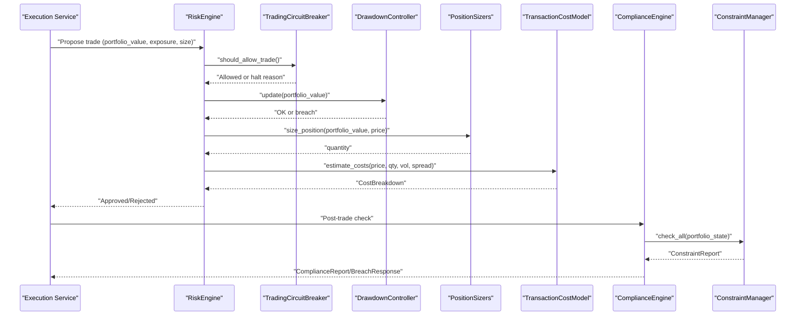
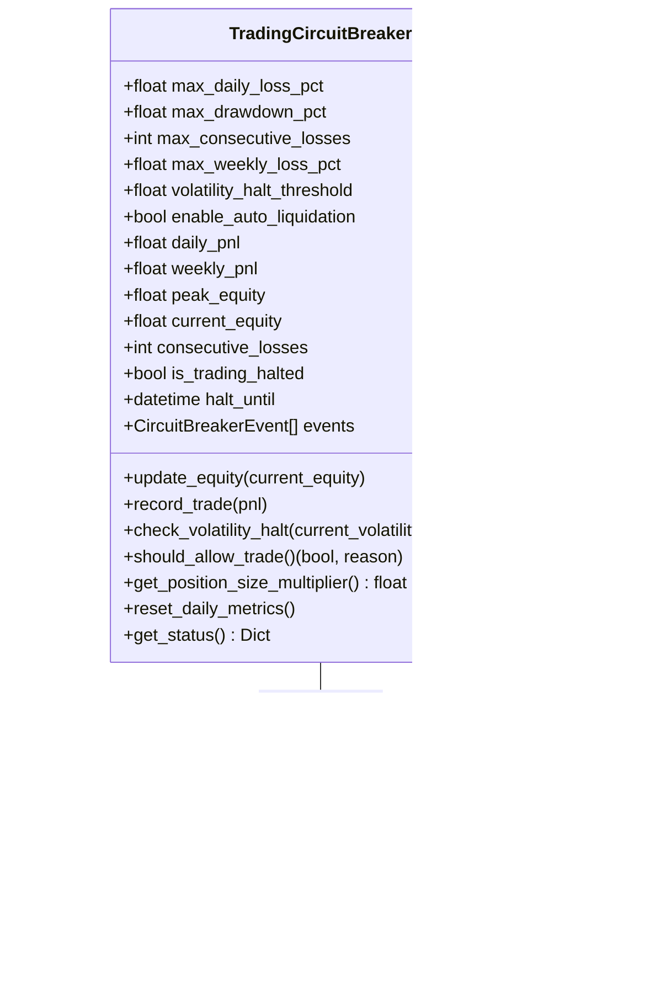
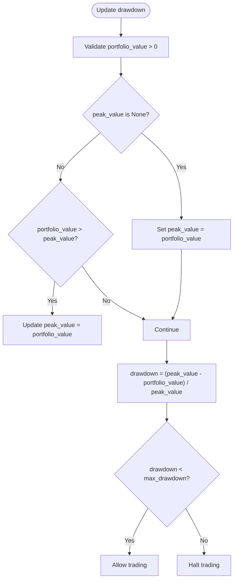
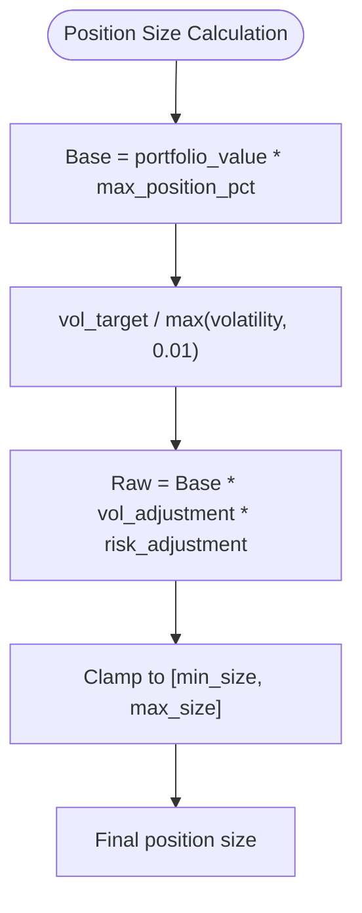
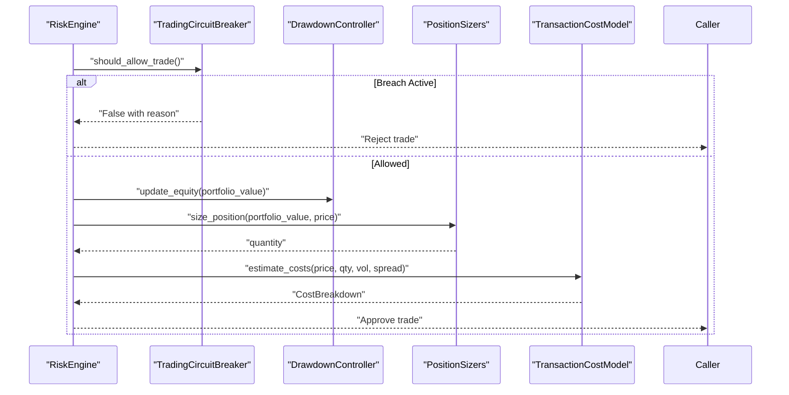
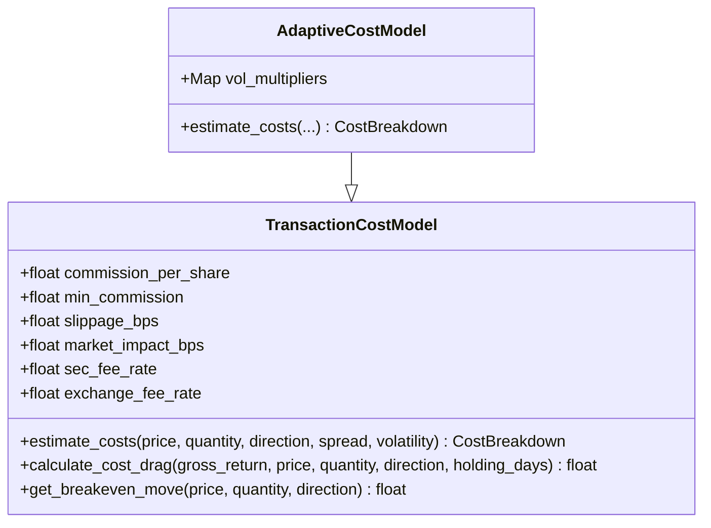
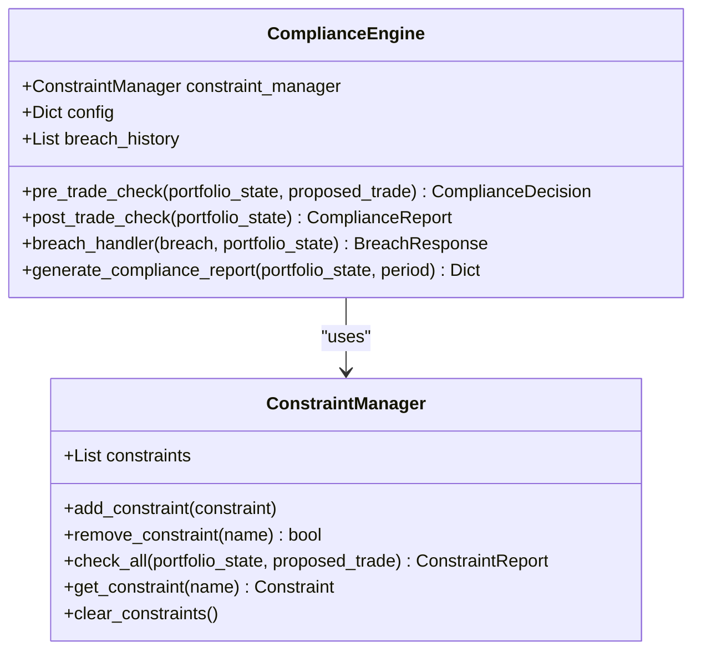
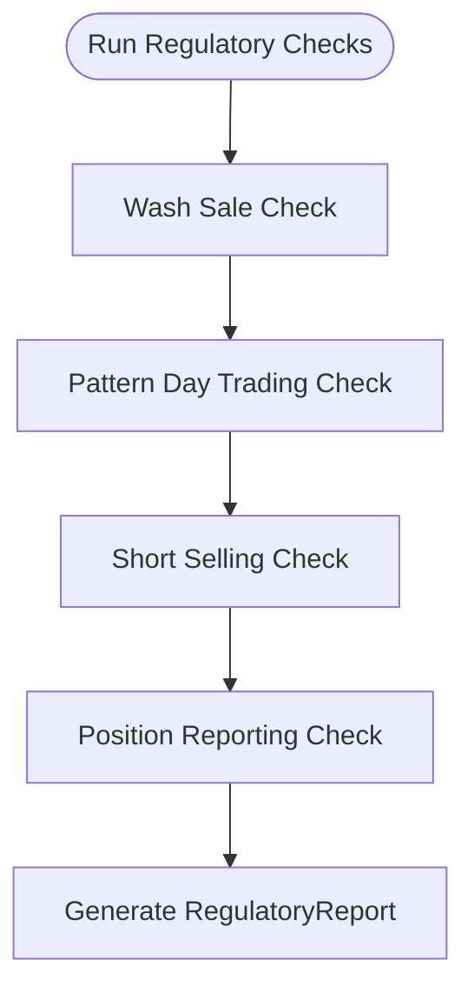
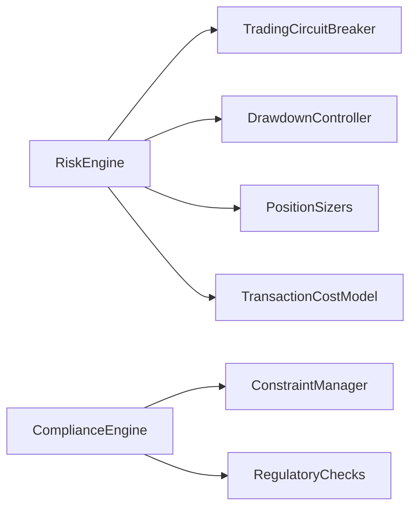

# Risk Controls and Compliance

<cite>
**Referenced Files in This Document**
- [circuit_breaker.py](file://backend/risk/circuit_breaker.py)
- [drawdown_controller.py](file://backend/risk/drawdown_controller.py)
- [position_sizer.py](file://backend/risk/position_sizer.py)
- [risk_engine.py](file://backend/risk/risk_engine.py)
- [transaction_cost_model.py](file://backend/risk/transaction_cost_model.py)
- [compliance_engine.py](file://FinAgents/research/risk_compliance/compliance_engine.py)
- [regulatory_checks.py](file://FinAgents/research/risk_compliance/regulatory_checks.py)
- [constraints.py](file://FinAgents/research/risk_compliance/constraints.py)
- [orchestrator_config.yaml](file://FinAgents/orchestrator/config/orchestrator_config.yaml)
- [production.yaml](file://FinAgents/memory/config/production.yaml)
</cite>

## Table of Contents
1. [Introduction](#introduction)
2. [Project Structure](#project-structure)
3. [Core Components](#core-components)
4. [Architecture Overview](#architecture-overview)
5. [Detailed Component Analysis](#detailed-component-analysis)
6. [Dependency Analysis](#dependency-analysis)
7. [Performance Considerations](#performance-considerations)
8. [Troubleshooting Guide](#troubleshooting-guide)
9. [Conclusion](#conclusion)
10. [Appendices](#appendices)

## Introduction
This document explains the risk control mechanisms and compliance systems implemented in the Agentic Trading Application. It covers:
- Circuit breaker implementations for volatility-based halts, position limit enforcement, and automated trading suspension protocols
- Drawdown controller functionality for maximum loss limits, portfolio value monitoring, and automatic position reduction
- Position sizing algorithms including fixed fractional sizing, volatility targeting, and portfolio optimization-based allocation strategies
- Regulatory compliance checks including position concentration limits, turnover constraints, correlation diversification, and regulatory-style validations (e.g., wash sale, pattern day trading, short sale, and reporting thresholds)
- Configuration parameters, threshold settings, enforcement mechanisms, and integration points with trading execution systems

## Project Structure
The risk and compliance subsystems are organized across backend risk modules and FinAgents research modules:
- Backend risk: circuit breakers, drawdown controller, position sizing, risk engine, transaction cost modeling
- FinAgents research: compliance engine, constraints, and regulatory checks

**Diagram sources**
- [circuit_breaker.py:59-360](file://backend/risk/circuit_breaker.py#L59-L360)
- [drawdown_controller.py:1-30](file://backend/risk/drawdown_controller.py#L1-L30)
- [position_sizer.py:1-21](file://backend/risk/position_sizer.py#L1-L21)
- [risk_engine.py:22-226](file://backend/risk/risk_engine.py#L22-L226)
- [transaction_cost_model.py:43-275](file://backend/risk/transaction_cost_model.py#L43-L275)
- [compliance_engine.py:82-530](file://FinAgents/research/risk_compliance/compliance_engine.py#L82-L530)
- [constraints.py:147-742](file://FinAgents/research/risk_compliance/constraints.py#L147-L742)
- [regulatory_checks.py:155-547](file://FinAgents/research/risk_compliance/regulatory_checks.py#L155-L547)

**Section sources**
- [circuit_breaker.py:1-360](file://backend/risk/circuit_breaker.py#L1-L360)
- [risk_engine.py:1-226](file://backend/risk/risk_engine.py#L1-L226)
- [compliance_engine.py:1-530](file://FinAgents/research/risk_compliance/compliance_engine.py#L1-L530)
- [constraints.py:1-742](file://FinAgents/research/risk_compliance/constraints.py#L1-L742)
- [regulatory_checks.py:1-547](file://FinAgents/research/risk_compliance/regulatory_checks.py#L1-L547)

## Core Components
- Trading Circuit Breaker: Enforces daily/weekly drawdown, consecutive loss, and volatility-based halts; adjusts position multipliers; logs events and halts trading with configurable auto-liquidation.
- Drawdown Controller: Monitors portfolio peak and current value to enforce maximum drawdown limits.
- Position Sizer: Computes position size constrained by portfolio value and maximum position percentage.
- Risk Engine: Integrates circuit breakers, validates trades, calculates stop-loss levels, and computes risk-adjusted position sizes with volatility targeting.
- Transaction Cost Model: Estimates commission, slippage, market impact, and regulatory fees; supports adaptive modeling under volatility regimes.
- Compliance Engine: Validates pre-trade and post-trade compliance using a constraint manager; generates breach responses and compliance reports.
- Constraints: Defines MaxDrawdown, PositionSize, Concentration, Turnover, and Correlation constraints with severity and utilization metrics.
- Regulatory Checks: Implements wash sale, pattern day trading, short selling, and position reporting checks aligned with regulatory frameworks.

**Section sources**
- [circuit_breaker.py:59-360](file://backend/risk/circuit_breaker.py#L59-L360)
- [drawdown_controller.py:1-30](file://backend/risk/drawdown_controller.py#L1-L30)
- [position_sizer.py:1-21](file://backend/risk/position_sizer.py#L1-L21)
- [risk_engine.py:22-226](file://backend/risk/risk_engine.py#L22-L226)
- [transaction_cost_model.py:43-275](file://backend/risk/transaction_cost_model.py#L43-L275)
- [compliance_engine.py:82-530](file://FinAgents/research/risk_compliance/compliance_engine.py#L82-L530)
- [constraints.py:147-742](file://FinAgents/research/risk_compliance/constraints.py#L147-L742)
- [regulatory_checks.py:155-547](file://FinAgents/research/risk_compliance/regulatory_checks.py#L155-L547)

## Architecture Overview
The risk and compliance architecture integrates pre-trade validation, real-time monitoring, and enforcement across trading execution.

**Diagram sources**
- [risk_engine.py:72-208](file://backend/risk/risk_engine.py#L72-L208)
- [circuit_breaker.py:235-255](file://backend/risk/circuit_breaker.py#L235-L255)
- [drawdown_controller.py:11-30](file://backend/risk/drawdown_controller.py#L11-L30)
- [position_sizer.py:9-21](file://backend/risk/position_sizer.py#L9-L21)
- [transaction_cost_model.py:86-150](file://backend/risk/transaction_cost_model.py#L86-L150)
- [compliance_engine.py:236-276](file://FinAgents/research/risk_compliance/compliance_engine.py#L236-L276)
- [constraints.py:648-722](file://FinAgents/research/risk_compliance/constraints.py#L648-L722)

## Detailed Component Analysis

### Trading Circuit Breaker
Implements emergency halts and position adjustments:
- Daily loss, weekly loss, maximum drawdown, and consecutive loss triggers
- Volatility-based halt threshold
- Position size multiplier reduction and trading halt enforcement
- Event logging and status reporting

**Diagram sources**
- [circuit_breaker.py:59-360](file://backend/risk/circuit_breaker.py#L59-L360)

**Section sources**
- [circuit_breaker.py:59-360](file://backend/risk/circuit_breaker.py#L59-L360)

### Drawdown Controller
Monitors portfolio drawdown against a maximum threshold and updates peak value.

**Diagram sources**
- [drawdown_controller.py:11-30](file://backend/risk/drawdown_controller.py#L11-L30)

**Section sources**
- [drawdown_controller.py:1-30](file://backend/risk/drawdown_controller.py#L1-L30)

### Position Sizing Algorithms
- Fixed fractional sizing: caps position value as a percentage of portfolio value.
- Volatility targeting: scales position size inversely with realized volatility and bounds by min/max.
- Risk engine sizing: combines max position percentage with volatility adjustment and risk adjustment factor.

**Diagram sources**
- [position_sizer.py:9-21](file://backend/risk/position_sizer.py#L9-L21)
- [risk_engine.py:150-186](file://backend/risk/risk_engine.py#L150-L186)
- [circuit_breaker.py:324-354](file://backend/risk/circuit_breaker.py#L324-L354)

**Section sources**
- [position_sizer.py:1-21](file://backend/risk/position_sizer.py#L1-L21)
- [risk_engine.py:150-186](file://backend/risk/risk_engine.py#L150-L186)
- [circuit_breaker.py:305-354](file://backend/risk/circuit_breaker.py#L305-L354)

### Risk Engine Integration
The RiskEngine orchestrates:
- Pre-trade validation: portfolio exposure, position size limits, circuit breaker checks
- Stop-loss calculation: directional stop levels
- Risk-adjusted sizing: volatility and risk adjustment
- Circuit breaker monitoring and status reporting

**Diagram sources**
- [risk_engine.py:72-208](file://backend/risk/risk_engine.py#L72-L208)
- [circuit_breaker.py:235-255](file://backend/risk/circuit_breaker.py#L235-L255)
- [drawdown_controller.py:11-30](file://backend/risk/drawdown_controller.py#L11-L30)
- [position_sizer.py:9-21](file://backend/risk/position_sizer.py#L9-L21)
- [transaction_cost_model.py:86-150](file://backend/risk/transaction_cost_model.py#L86-L150)

**Section sources**
- [risk_engine.py:22-226](file://backend/risk/risk_engine.py#L22-L226)

### Transaction Cost Modeling
Models realistic trading costs:
- Commission (per share with minimum)
- Slippage (bps; dynamic via volatility or spread)
- Market impact (bps; scaled by order size)
- Regulatory fees (SEC/exchange on sells)
- Adaptive model adjusts costs under elevated volatility regimes

**Diagram sources**
- [transaction_cost_model.py:43-275](file://backend/risk/transaction_cost_model.py#L43-L275)

**Section sources**
- [transaction_cost_model.py:1-275](file://backend/risk/transaction_cost_model.py#L1-L275)

### Compliance Engine and Constraints
The ComplianceEngine enforces:
- Pre-trade checks: modifies trades by reducing size up to configured attempts
- Post-trade checks: generates corrective actions and risk summaries
- Breach handling: severity-based responses and auto-actions
- Constraint management: MaxDrawdown, PositionSize, Concentration, Turnover, Correlation

**Diagram sources**
- [compliance_engine.py:82-530](file://FinAgents/research/risk_compliance/compliance_engine.py#L82-L530)
- [constraints.py:648-742](file://FinAgents/research/risk_compliance/constraints.py#L648-L742)

**Section sources**
- [compliance_engine.py:82-530](file://FinAgents/research/risk_compliance/compliance_engine.py#L82-L530)
- [constraints.py:147-742](file://FinAgents/research/risk_compliance/constraints.py#L147-L742)

### Regulatory Checks
Implements regulatory-style validations:
- Wash sale detection within a lookback window
- Pattern day trading counting within rolling window
- Short selling restrictions and locate/uptick rule considerations
- Position reporting thresholds for disclosure filings

**Diagram sources**
- [regulatory_checks.py:155-547](file://FinAgents/research/risk_compliance/regulatory_checks.py#L155-L547)

**Section sources**
- [regulatory_checks.py:1-547](file://FinAgents/research/risk_compliance/regulatory_checks.py#L1-L547)

## Dependency Analysis
- RiskEngine depends on TradingCircuitBreaker for trading permission and drawdown monitoring.
- Position sizing integrates with volatility estimates and circuit breaker multipliers.
- TransactionCostModel informs risk-adjusted sizing and profitability assessments.
- ComplianceEngine depends on ConstraintManager for constraint evaluation and regulatory checks for regulatory-style validations.

**Diagram sources**
- [risk_engine.py:15-71](file://backend/risk/risk_engine.py#L15-L71)
- [compliance_engine.py:14-20](file://FinAgents/research/risk_compliance/compliance_engine.py#L14-L20)

**Section sources**
- [risk_engine.py:15-71](file://backend/risk/risk_engine.py#L15-L71)
- [compliance_engine.py:14-20](file://FinAgents/research/risk_compliance/compliance_engine.py#L14-L20)

## Performance Considerations
- Circuit breaker checks are lightweight and invoked per trade; keep thresholds reasonable to avoid frequent halts.
- Volatility-based position sizing adds minimal overhead; caching volatility estimates reduces repeated computation.
- Transaction cost modeling supports adaptive modes; use regime-aware slippage and impact only when necessary to avoid extra computation.
- Constraint checks scale with number of constraints; group related constraints and reuse computed metrics (e.g., sector weights) to minimize recomputation.

## Troubleshooting Guide
Common issues and resolutions:
- Trading halted unexpectedly: Review circuit breaker status and recent events; confirm halt expiration and reset daily metrics at market open.
- Excessive position reductions: Validate volatility estimates and circuit breaker multipliers; adjust base position size and volatility target.
- Pre-trade rejections: Inspect constraint report for breaches; reduce proposed trade size or adjust portfolio exposure.
- Post-trade compliance warnings: Monitor constraint utilization trends; rebalance positions and reduce concentration.
- Regulatory check failures: Align wash sale and PDT windows with historical trade data; ensure short sale requirements and reporting thresholds are met.

**Section sources**
- [circuit_breaker.py:235-302](file://backend/risk/circuit_breaker.py#L235-L302)
- [compliance_engine.py:118-184](file://FinAgents/research/risk_compliance/compliance_engine.py#L118-L184)
- [constraints.py:687-722](file://FinAgents/research/risk_compliance/constraints.py#L687-L722)
- [regulatory_checks.py:489-547](file://FinAgents/research/risk_compliance/regulatory_checks.py#L489-L547)

## Conclusion
The system provides robust, layered risk controls and compliance checks:
- Circuit breakers and drawdown controllers protect capital during adverse conditions
- Position sizing algorithms balance risk and opportunity with volatility targeting
- The compliance engine and constraints enforce portfolio limits and diversification
- Regulatory checks align operations with reporting and trading rule frameworks
Integration with execution services ensures real-time enforcement and actionable insights.

## Appendices

### Configuration Parameters and Thresholds
- RiskEngine
  - max_position_pct: maximum fraction of portfolio per position
  - max_drawdown_pct: maximum allowed drawdown
  - max_portfolio_exposure_pct: total portfolio exposure cap
  - stop_loss_pct: default stop-loss percentage
  - enable_circuit_breakers: toggle circuit breaker integration
- TradingCircuitBreaker
  - max_daily_loss_pct, max_drawdown_pct, max_consecutive_losses, max_weekly_loss_pct, volatility_halt_threshold, enable_auto_liquidation
- VolatilityBasedPositionSizer
  - base_position_size, vol_target, max_position_size, min_position_size
- TransactionCostModel
  - commission_per_share, min_commission, slippage_bps, market_impact_bps, sec_fee_rate, exchange_fee_rate
- ConstraintManager and Constraints
  - MaxDrawdownConstraint: max_drawdown_pct
  - PositionSizeConstraint: max_single_position_pct, max_sector_pct
  - ConcentrationConstraint: max_top_n_concentration, n
  - TurnoverConstraint: max_daily_turnover_pct, max_weekly_turnover_pct
  - CorrelationConstraint: max_avg_correlation, lookback_days
- RegulatoryChecks
  - wash_sale_window_days, pdt_window_days, pdt_limit, reporting_threshold_pct

**Section sources**
- [risk_engine.py:34-71](file://backend/risk/risk_engine.py#L34-L71)
- [circuit_breaker.py:66-91](file://backend/risk/circuit_breaker.py#L66-L91)
- [circuit_breaker.py:312-322](file://backend/risk/circuit_breaker.py#L312-L322)
- [transaction_cost_model.py:54-79](file://backend/risk/transaction_cost_model.py#L54-L79)
- [constraints.py:197-264](file://FinAgents/research/risk_compliance/constraints.py#L197-L264)
- [constraints.py:267-357](file://FinAgents/research/risk_compliance/constraints.py#L267-L357)
- [constraints.py:360-452](file://FinAgents/research/risk_compliance/constraints.py#L360-L452)
- [constraints.py:455-531](file://FinAgents/research/risk_compliance/constraints.py#L455-L531)
- [constraints.py:534-645](file://FinAgents/research/risk_compliance/constraints.py#L534-L645)
- [regulatory_checks.py:167-182](file://FinAgents/research/risk_compliance/regulatory_checks.py#L167-L182)

### Integration Notes
- Orchestration configuration enables sandbox environments with risk parameters such as max position size, sector exposure, and drawdown limits.
- Memory configuration defines production logging and API key requirements impacting auditability and compliance.

**Section sources**
- [orchestrator_config.yaml:198-201](file://FinAgents/orchestrator/config/orchestrator_config.yaml#L198-L201)
- [production.yaml:29-30](file://FinAgents/memory/config/production.yaml#L29-L30)
- [production.yaml:70-80](file://FinAgents/memory/config/production.yaml#L70-L80)