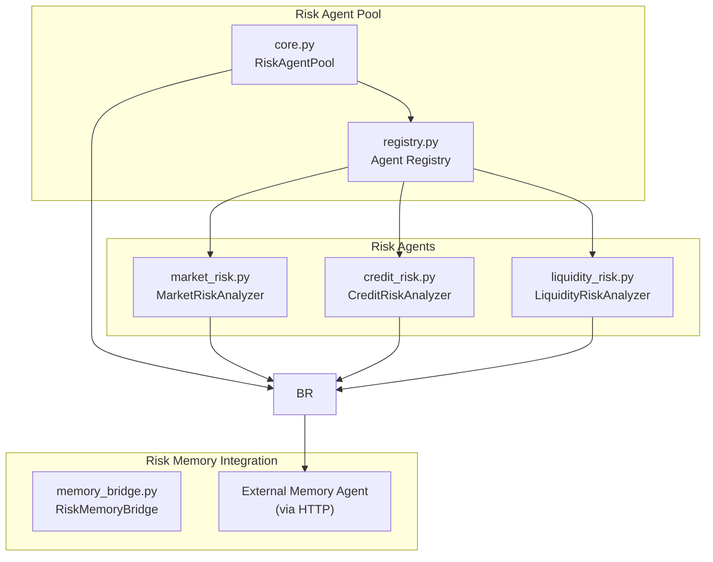
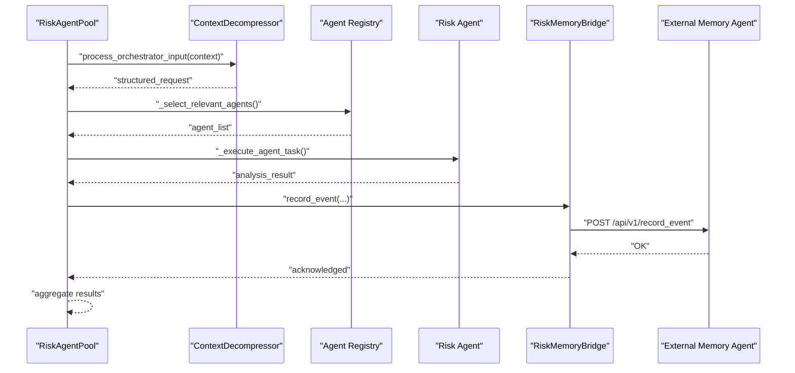
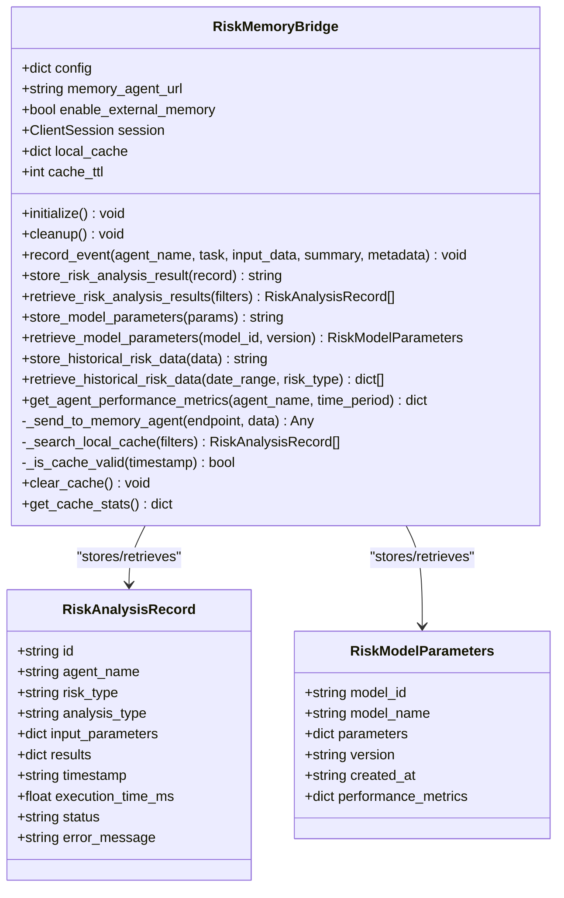
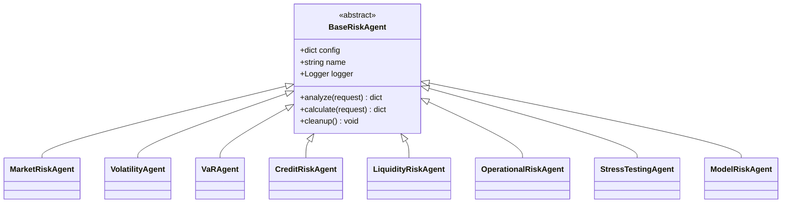
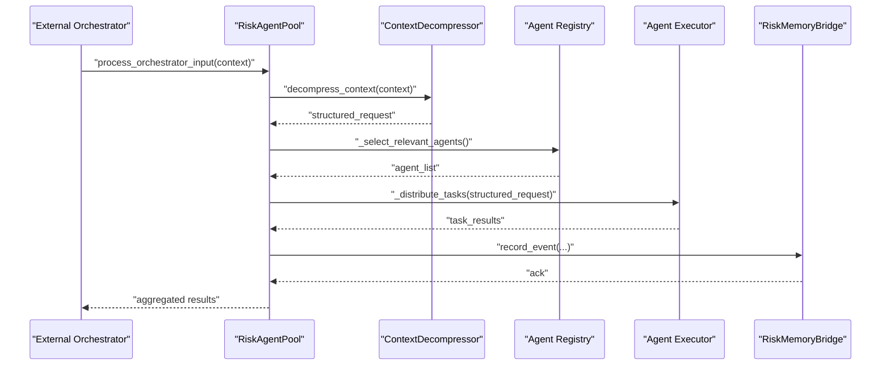
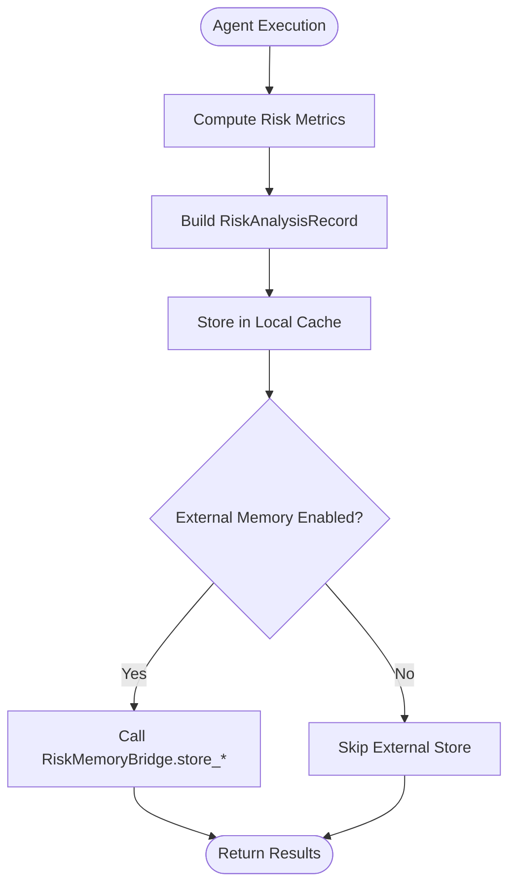
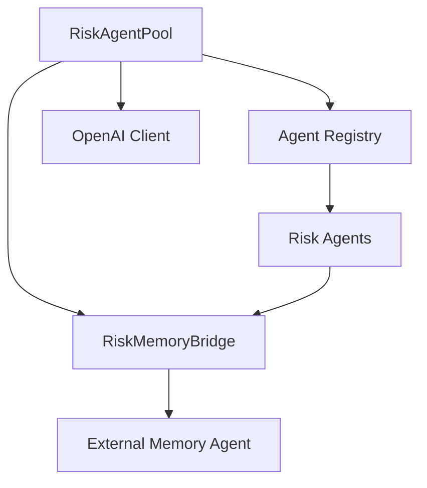

# Risk Memory Integration

<cite>
**Referenced Files in This Document**
- [memory_bridge.py](file://FinAgents/agent_pools/risk_agent_pool/memory_bridge.py)
- [registry.py](file://FinAgents/agent_pools/risk_agent_pool/registry.py)
- [core.py](file://FinAgents/agent_pools/risk_agent_pool/core.py)
- [market_risk.py](file://FinAgents/agent_pools/risk_agent_pool/agents/market_risk.py)
- [credit_risk.py](file://FinAgents/agent_pools/risk_agent_pool/agents/credit_risk.py)
- [liquidity_risk.py](file://FinAgents/agent_pools/risk_agent_pool/agents/liquidity_risk.py)
</cite>

## Table of Contents
1. [Introduction](#introduction)
2. [Project Structure](#project-structure)
3. [Core Components](#core-components)
4. [Architecture Overview](#architecture-overview)
5. [Detailed Component Analysis](#detailed-component-analysis)
6. [Dependency Analysis](#dependency-analysis)
7. [Performance Considerations](#performance-considerations)
8. [Troubleshooting Guide](#troubleshooting-guide)
9. [Conclusion](#conclusion)

## Introduction
This document explains the risk memory integration and persistence systems implemented in the risk agent pool. It covers:
- RiskMemoryBridge: data serialization, storage patterns, and retrieval mechanisms for risk-related information
- Agent registry management: dynamic agent loading, lifecycle management, and configuration persistence
- Memory integration patterns with external memory agents for risk network analysis, temporal risk data storage, and cross-reference maintenance
- Risk event logging, audit trails, compliance data retention, and regulatory reporting data preparation
- Memory indexing strategies, query optimization for risk analytics, and integration patterns with the broader memory system architecture

## Project Structure
The risk memory integration spans three primary areas:
- Risk agent pool orchestration and agent registry
- RiskMemoryBridge for external memory agent integration
- Specialized risk agents that produce structured risk analysis records

**Diagram sources**
- [core.py:137-583](file://FinAgents/agent_pools/risk_agent_pool/core.py#L137-L583)
- [registry.py:21-709](file://FinAgents/agent_pools/risk_agent_pool/registry.py#L21-L709)
- [memory_bridge.py:59-477](file://FinAgents/agent_pools/risk_agent_pool/memory_bridge.py#L59-L477)
- [market_risk.py:29-155](file://FinAgents/agent_pools/risk_agent_pool/agents/market_risk.py#L29-L155)
- [credit_risk.py:27-122](file://FinAgents/agent_pools/risk_agent_pool/agents/credit_risk.py#L27-L122)
- [liquidity_risk.py:25-100](file://FinAgents/agent_pools/risk_agent_pool/agents/liquidity_risk.py#L25-L100)

**Section sources**
- [core.py:137-583](file://FinAgents/agent_pools/risk_agent_pool/core.py#L137-L583)
- [registry.py:21-709](file://FinAgents/agent_pools/risk_agent_pool/registry.py#L21-L709)
- [memory_bridge.py:59-477](file://FinAgents/agent_pools/risk_agent_pool/memory_bridge.py#L59-L477)

## Core Components
- RiskMemoryBridge: asynchronous HTTP client to an external memory agent, with local caching, typed records, and unified logging
- Agent Registry: dynamic registration and lifecycle management of risk agents
- RiskAgentPool: orchestrator that coordinates natural language decomposition, agent selection, execution, and memory logging

Key responsibilities:
- Serialize risk analysis results into typed records
- Persist and retrieve risk data, model parameters, and historical series
- Maintain performance metrics per agent
- Provide local cache to reduce external memory calls
- Integrate with external memory agent for audit trails and compliance

**Section sources**
- [memory_bridge.py:59-477](file://FinAgents/agent_pools/risk_agent_pool/memory_bridge.py#L59-L477)
- [registry.py:21-709](file://FinAgents/agent_pools/risk_agent_pool/registry.py#L21-L709)
- [core.py:137-583](file://FinAgents/agent_pools/risk_agent_pool/core.py#L137-L583)

## Architecture Overview
The system integrates risk agents with an external memory agent via RiskMemoryBridge. Risk agents produce structured results that are optionally stored in the external memory agent and cached locally. The orchestrator coordinates natural language parsing, agent selection, execution, and memory logging.

**Diagram sources**
- [core.py:268-319](file://FinAgents/agent_pools/risk_agent_pool/core.py#L268-L319)
- [core.py:347-456](file://FinAgents/agent_pools/risk_agent_pool/core.py#L347-L456)
- [memory_bridge.py:119-152](file://FinAgents/agent_pools/risk_agent_pool/memory_bridge.py#L119-L152)

## Detailed Component Analysis

### RiskMemoryBridge
Responsibilities:
- Typed data models for risk analysis records and model parameters
- Asynchronous HTTP integration with external memory agent
- Local caching with TTL and cache statistics
- Unified logging and event recording
- Retrieval helpers for analyses, model parameters, historical data, and agent metrics

Implementation highlights:
- Data classes define strict schemas for serialization and deserialization
- Methods for storing/retrieving risk analysis results and model parameters
- Historical risk data storage and retrieval with date-range filtering
- Agent performance metrics retrieval over time windows
- Local cache reduces repeated external calls and improves latency

**Diagram sources**
- [memory_bridge.py:33-57](file://FinAgents/agent_pools/risk_agent_pool/memory_bridge.py#L33-L57)
- [memory_bridge.py:59-477](file://FinAgents/agent_pools/risk_agent_pool/memory_bridge.py#L59-L477)

**Section sources**
- [memory_bridge.py:33-57](file://FinAgents/agent_pools/risk_agent_pool/memory_bridge.py#L33-L57)
- [memory_bridge.py:59-477](file://FinAgents/agent_pools/risk_agent_pool/memory_bridge.py#L59-L477)

### Agent Registry and Lifecycle Management
Responsibilities:
- Central registry of risk agents with dynamic registration/unregistration
- Base class defining the common interface for risk agents
- Preloading default agents for immediate availability
- Lifecycle management including initialization and optional cleanup

Agent categories:
- Market risk agents (volatility, VaR, beta)
- Credit risk agents (default probability, LGD, EAD, Credit VaR)
- Liquidity risk agents (market liquidity, funding liquidity)
- Operational risk, stress testing, and model risk agents

**Diagram sources**
- [registry.py:21-709](file://FinAgents/agent_pools/risk_agent_pool/registry.py#L21-L709)

**Section sources**
- [registry.py:21-709](file://FinAgents/agent_pools/risk_agent_pool/registry.py#L21-L709)

### RiskAgentPool Orchestration
Responsibilities:
- Natural language decomposition using OpenAI into structured risk requests
- Agent selection based on risk type and requested measures
- Parallel execution of selected agents
- Memory logging of orchestrator actions and results
- MCP server creation for external orchestration integration

Key flows:
- ContextDecompressor transforms natural language into structured JSON
- Agent selection maps risk types/measures to relevant agents
- Execution gathers results from agents with exception handling
- Memory logging via RiskMemoryBridge for audit and compliance

**Diagram sources**
- [core.py:268-319](file://FinAgents/agent_pools/risk_agent_pool/core.py#L268-L319)
- [core.py:347-456](file://FinAgents/agent_pools/risk_agent_pool/core.py#L347-L456)
- [memory_bridge.py:119-152](file://FinAgents/agent_pools/risk_agent_pool/memory_bridge.py#L119-L152)

**Section sources**
- [core.py:268-319](file://FinAgents/agent_pools/risk_agent_pool/core.py#L268-L319)
- [core.py:347-456](file://FinAgents/agent_pools/risk_agent_pool/core.py#L347-L456)

### Risk Agents and Memory Integration
Specialized agents produce structured results that can be persisted:
- MarketRiskAnalyzer creates RiskAnalysisRecord instances for comprehensive market risk metrics
- CreditRiskAnalyzer and LiquidityRiskAnalyzer encapsulate domain-specific risk calculations

Integration pattern:
- Agents compute results and optionally populate analysis_record fields
- RiskMemoryBridge stores these records and model parameters for later retrieval and audit

**Diagram sources**
- [market_risk.py:120-142](file://FinAgents/agent_pools/risk_agent_pool/agents/market_risk.py#L120-L142)
- [memory_bridge.py:153-183](file://FinAgents/agent_pools/risk_agent_pool/memory_bridge.py#L153-L183)

**Section sources**
- [market_risk.py:120-142](file://FinAgents/agent_pools/risk_agent_pool/agents/market_risk.py#L120-L142)
- [memory_bridge.py:153-183](file://FinAgents/agent_pools/risk_agent_pool/memory_bridge.py#L153-L183)

## Dependency Analysis
- RiskAgentPool depends on:
  - Agent Registry for discovering and instantiating agents
  - RiskMemoryBridge for logging and persistence
  - OpenAI client for natural language decomposition (optional)
- RiskMemoryBridge depends on:
  - External Memory Agent via HTTP endpoints
  - Local cache for performance
- Risk agents depend on:
  - BaseRiskAgent interface
  - RiskMemoryBridge for persistence (when applicable)

**Diagram sources**
- [core.py:137-583](file://FinAgents/agent_pools/risk_agent_pool/core.py#L137-L583)
- [registry.py:21-709](file://FinAgents/agent_pools/risk_agent_pool/registry.py#L21-L709)
- [memory_bridge.py:59-477](file://FinAgents/agent_pools/risk_agent_pool/memory_bridge.py#L59-L477)

**Section sources**
- [core.py:137-583](file://FinAgents/agent_pools/risk_agent_pool/core.py#L137-L583)
- [registry.py:21-709](file://FinAgents/agent_pools/risk_agent_pool/registry.py#L21-L709)
- [memory_bridge.py:59-477](file://FinAgents/agent_pools/risk_agent_pool/memory_bridge.py#L59-L477)

## Performance Considerations
- Local caching: RiskMemoryBridge maintains a local cache keyed by record identifiers and model parameters, with TTL-based invalidation to reduce external calls
- Asynchronous I/O: HTTP operations use aiohttp for non-blocking communication with the external memory agent
- Parallel execution: RiskAgentPool executes multiple agents concurrently to improve throughput
- Query filtering: Retrieval methods support filtering to minimize payload sizes
- Serialization: Data classes ensure consistent serialization/deserialization for records and parameters

[No sources needed since this section provides general guidance]

## Troubleshooting Guide
Common issues and resolutions:
- External memory agent connectivity failures:
  - Health checks and timeouts are handled during initialization and HTTP calls
  - When unavailable, the system logs warnings and continues without external persistence
- Cache inconsistencies:
  - Clear cache and refresh to synchronize with external memory
  - Inspect cache statistics to monitor validity and expiration
- Agent execution errors:
  - Exceptions are caught and returned as structured error results
  - Review agent logs for detailed error traces
- OpenAI integration:
  - If API key is missing, the system falls back to basic parsing and logs warnings

**Section sources**
- [memory_bridge.py:84-117](file://FinAgents/agent_pools/risk_agent_pool/memory_bridge.py#L84-L117)
- [memory_bridge.py:416-421](file://FinAgents/agent_pools/risk_agent_pool/memory_bridge.py#L416-L421)
- [core.py:219-247](file://FinAgents/agent_pools/risk_agent_pool/core.py#L219-L247)

## Conclusion
The risk memory integration provides a robust foundation for persisting, retrieving, and auditing risk analysis results. RiskMemoryBridge offers typed records, local caching, and seamless integration with an external memory agent. The agent registry enables dynamic loading and lifecycle management, while RiskAgentPool orchestrates natural language decomposition, agent execution, and memory logging. Together, these components support risk network analysis, temporal data storage, cross-references, audit trails, and compliance reporting needs.