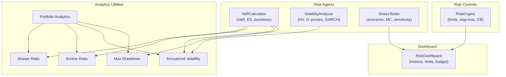
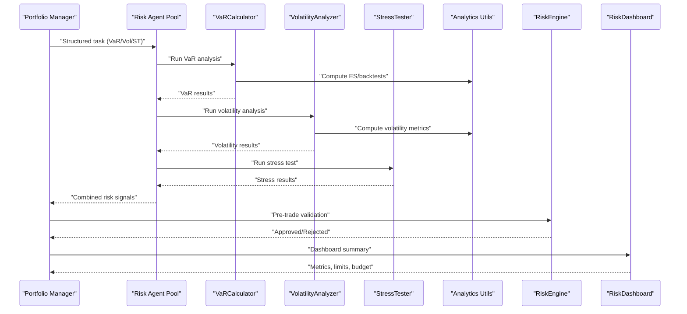
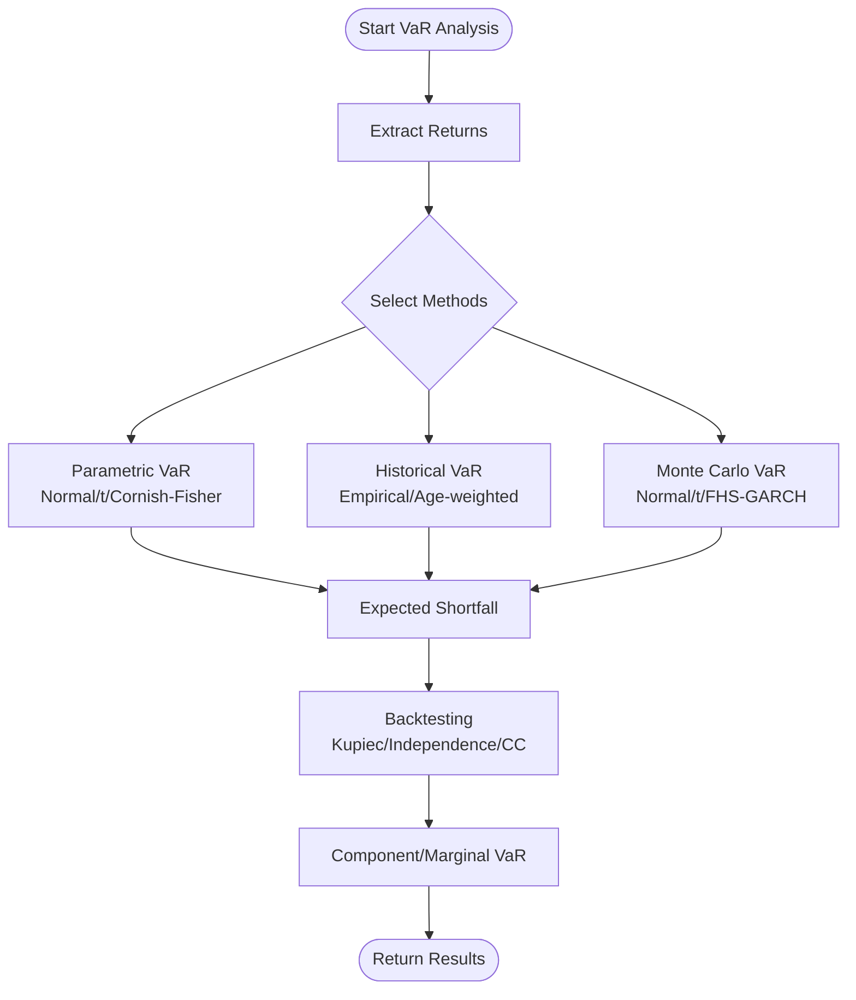
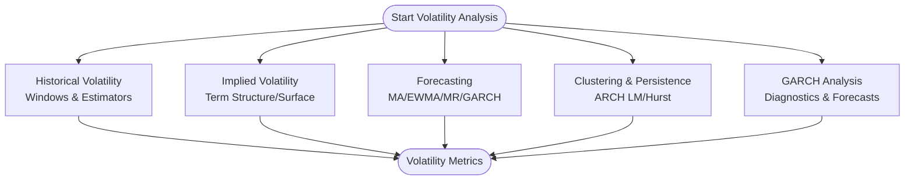
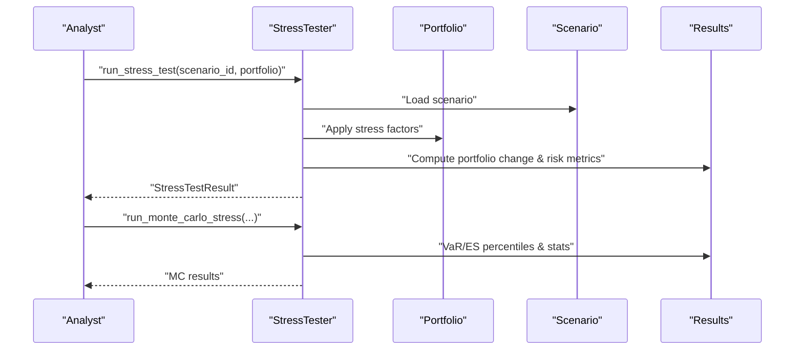
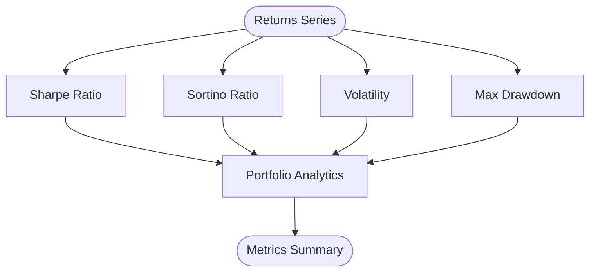
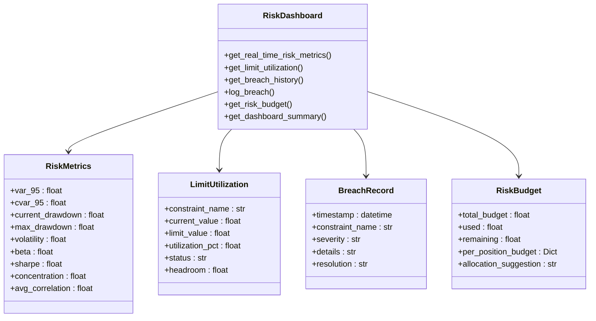
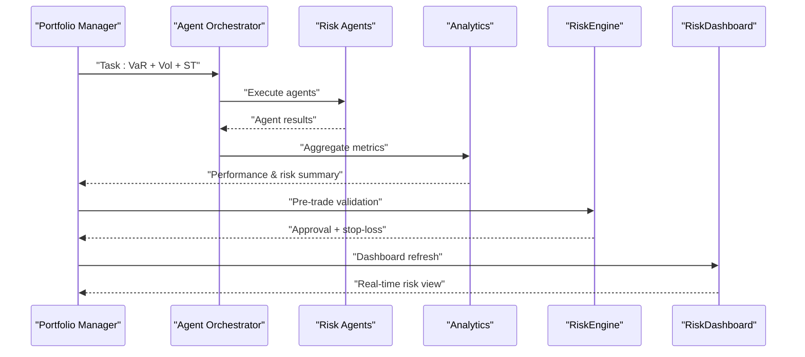
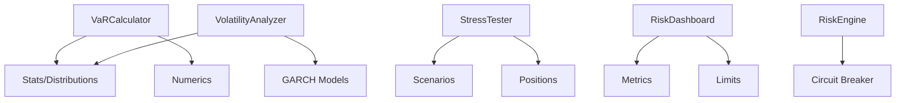

# Risk Metrics and Analytics

<cite>
**Referenced Files in This Document**
- [var_calculator.py](file://FinAgents/agent_pools/risk_agent_pool/agents/var_calculator.py)
- [volatility.py](file://FinAgents/agent_pools/risk_agent_pool/agents/volatility.py)
- [stress_testing.py](file://FinAgents/agent_pools/risk_agent_pool/agents/stress_testing.py)
- [volatility.py](file://backend/analytics/volatility.py)
- [sharpe.py](file://backend/analytics/sharpe.py)
- [sortino.py](file://backend/analytics/sortino.py)
- [max_drawdown.py](file://backend/analytics/max_drawdown.py)
- [portfolio_analytics.py](file://backend/analytics/portfolio_analytics.py)
- [risk_engine.py](file://backend/risk/risk_engine.py)
- [risk_dashboard.py](file://FinAgents/research/risk_compliance/risk_dashboard.py)
- [registry.py](file://FinAgents/agent_pools/risk_agent_pool/registry.py)
- [risk_agent_demo/example_usage.py](file://FinAgents/agent_pools/risk_agent_demo/example_usage.py)
</cite>

## Table of Contents
1. [Introduction](#introduction)
2. [Project Structure](#project-structure)
3. [Core Components](#core-components)
4. [Architecture Overview](#architecture-overview)
5. [Detailed Component Analysis](#detailed-component-analysis)
6. [Dependency Analysis](#dependency-analysis)
7. [Performance Considerations](#performance-considerations)
8. [Troubleshooting Guide](#troubleshooting-guide)
9. [Conclusion](#conclusion)
10. [Appendices](#appendices)

## Introduction
This document describes the risk metrics and analytics framework implemented in the repository. It covers Value at Risk (VaR) methodologies (parametric, historical, Monte Carlo, and Expected Shortfall), volatility estimation (realized, implied proxies, GARCH), stress testing (historical replay, scenario analysis, Monte Carlo, reverse stress), risk-adjusted performance measures (Sharpe, Sortino), and risk dashboard components for real-time monitoring and budgeting. It also provides integration patterns with portfolio management systems and practical guidance for parameter tuning and operational deployment.

## Project Structure
The risk analytics stack spans multiple layers:
- Risk agents (VaR, volatility, stress testing) in the agentic risk pool
- Backend analytics utilities for Sharpe, Sortino, volatility, and drawdown
- Risk engine for pre-trade controls and circuit breaker integration
- Risk dashboard for real-time monitoring and budgeting
- Registry and orchestration for agent-based workflows

**Diagram sources**
- [var_calculator.py:26-136](file://FinAgents/agent_pools/risk_agent_pool/agents/var_calculator.py#L26-L136)
- [volatility.py:25-97](file://FinAgents/agent_pools/risk_agent_pool/agents/volatility.py#L25-L97)
- [stress_testing.py:86-261](file://FinAgents/agent_pools/risk_agent_pool/agents/stress_testing.py#L86-L261)
- [volatility.py:9-27](file://backend/analytics/volatility.py#L9-L27)
- [sharpe.py:8-32](file://backend/analytics/sharpe.py#L8-L32)
- [sortino.py:9-40](file://backend/analytics/sortino.py#L9-L40)
- [max_drawdown.py:8-31](file://backend/analytics/max_drawdown.py#L8-L31)
- [portfolio_analytics.py:14-41](file://backend/analytics/portfolio_analytics.py#L14-L41)
- [risk_engine.py:22-221](file://backend/risk/risk_engine.py#L22-L221)
- [risk_dashboard.py:108-556](file://FinAgents/research/risk_compliance/risk_dashboard.py#L108-L556)

**Section sources**
- [var_calculator.py:26-136](file://FinAgents/agent_pools/risk_agent_pool/agents/var_calculator.py#L26-L136)
- [volatility.py:25-97](file://FinAgents/agent_pools/risk_agent_pool/agents/volatility.py#L25-L97)
- [stress_testing.py:86-261](file://FinAgents/agent_pools/risk_agent_pool/agents/stress_testing.py#L86-L261)
- [volatility.py:9-27](file://backend/analytics/volatility.py#L9-L27)
- [sharpe.py:8-32](file://backend/analytics/sharpe.py#L8-L32)
- [sortino.py:9-40](file://backend/analytics/sortino.py#L9-L40)
- [max_drawdown.py:8-31](file://backend/analytics/max_drawdown.py#L8-L31)
- [portfolio_analytics.py:14-41](file://backend/analytics/portfolio_analytics.py#L14-L41)
- [risk_engine.py:22-221](file://backend/risk/risk_engine.py#L22-L221)
- [risk_dashboard.py:108-556](file://FinAgents/research/risk_compliance/risk_dashboard.py#L108-L556)

## Core Components
- VaR Calculator: Implements parametric (normal/t-distribution/Cornish-Fisher), historical (standard and age-weighted), Monte Carlo (normal/t-distribution/FHS-GARCH), Expected Shortfall, backtesting (Kupiec, Independence, Conditional Coverage), and component/marginal VaR decomposition.
- Volatility Analyzer: Computes historical volatility (multiple windows), implied volatility proxies, volatility forecasting (MA, EWMA, mean-reversion, GARCH), clustering (ARCH LM, persistence), and GARCH diagnostics.
- Stress Tester: Historical and hypothetical scenario libraries, sensitivity analysis, Monte Carlo stress testing, reverse stress testing, and risk metrics (VaR change, concentration, liquidity).
- Analytics Utilities: Sharpe, Sortino, annualized volatility, max drawdown, and portfolio analytics aggregator.
- Risk Engine: Position sizing, stop-loss, exposure limits, drawdown protection, and optional circuit breaker integration.
- Risk Dashboard: Real-time VaR/CVaR, drawdown, volatility, Sharpe, concentration, correlation; limit utilization; breach history; risk budget allocation.

**Section sources**
- [var_calculator.py:26-136](file://FinAgents/agent_pools/risk_agent_pool/agents/var_calculator.py#L26-L136)
- [volatility.py:25-97](file://FinAgents/agent_pools/risk_agent_pool/agents/volatility.py#L25-L97)
- [stress_testing.py:86-261](file://FinAgents/agent_pools/risk_agent_pool/agents/stress_testing.py#L86-L261)
- [volatility.py:9-27](file://backend/analytics/volatility.py#L9-L27)
- [sharpe.py:8-32](file://backend/analytics/sharpe.py#L8-L32)
- [sortino.py:9-40](file://backend/analytics/sortino.py#L9-L40)
- [max_drawdown.py:8-31](file://backend/analytics/max_drawdown.py#L8-L31)
- [portfolio_analytics.py:14-41](file://backend/analytics/portfolio_analytics.py#L14-L41)
- [risk_engine.py:22-221](file://backend/risk/risk_engine.py#L22-L221)
- [risk_dashboard.py:108-556](file://FinAgents/research/risk_compliance/risk_dashboard.py#L108-L556)

## Architecture Overview
The framework integrates agent-based risk computation with backend analytics and risk controls. VaR and volatility agents feed analytics utilities and dashboards. The RiskEngine enforces constraints and can halt trading via circuit breakers. The RiskDashboard consumes metrics and limit utilization to provide real-time risk insights.

**Diagram sources**
- [var_calculator.py:42-124](file://FinAgents/agent_pools/risk_agent_pool/agents/var_calculator.py#L42-L124)
- [volatility.py:39-97](file://FinAgents/agent_pools/risk_agent_pool/agents/volatility.py#L39-L97)
- [stress_testing.py:186-261](file://FinAgents/agent_pools/risk_agent_pool/agents/stress_testing.py#L186-L261)
- [volatility.py:9-27](file://backend/analytics/volatility.py#L9-L27)
- [sharpe.py:8-32](file://backend/analytics/sharpe.py#L8-L32)
- [sortino.py:9-40](file://backend/analytics/sortino.py#L9-L40)
- [max_drawdown.py:8-31](file://backend/analytics/max_drawdown.py#L8-L31)
- [risk_engine.py:72-126](file://backend/risk/risk_engine.py#L72-L126)
- [risk_dashboard.py:472-556](file://FinAgents/research/risk_compliance/risk_dashboard.py#L472-L556)

## Detailed Component Analysis

### Value at Risk (VaR) Calculation
- Parametric VaR: Normal, t-distribution, and Cornish-Fisher adjustments using fitted parameters and higher moments.
- Historical VaR: Empirical percentiles and age-weighted variants; bootstrap confidence intervals.
- Monte Carlo VaR: Normal and t-distributed scenarios; filtered historical simulation (FHS) using GARCH residuals.
- Expected Shortfall: Historical, parametric (normal), and t-distribution estimates; tail loss statistics.
- Backtesting: Violation counts, Kupiec POF, Independence, Conditional Coverage tests; loss function tests; traffic-light adequacy.
- Decomposition: Component VaR and Marginal VaR for attribution.

**Diagram sources**
- [var_calculator.py:42-136](file://FinAgents/agent_pools/risk_agent_pool/agents/var_calculator.py#L42-L136)
- [var_calculator.py:180-442](file://FinAgents/agent_pools/risk_agent_pool/agents/var_calculator.py#L180-L442)
- [var_calculator.py:444-779](file://FinAgents/agent_pools/risk_agent_pool/agents/var_calculator.py#L444-L779)

**Section sources**
- [var_calculator.py:42-136](file://FinAgents/agent_pools/risk_agent_pool/agents/var_calculator.py#L42-L136)
- [var_calculator.py:180-442](file://FinAgents/agent_pools/risk_agent_pool/agents/var_calculator.py#L180-L442)
- [var_calculator.py:444-779](file://FinAgents/agent_pools/risk_agent_pool/agents/var_calculator.py#L444-L779)

### Volatility Estimation Techniques
- Historical Volatility: Multiple windows, close-to-close, Parkinson, and Rogers-Satchell estimators; rolling statistics.
- Implied Volatility: ATM term structure, volatility surface, skew metrics, and risk premium proxy.
- Volatility Forecasting: MA, EWMA, mean reversion, GARCH; ensemble forecast; regime classification.
- Clustering and Persistence: ARCH LM test, autocorrelation of squared returns, clustering coefficient, Hurst exponent.
- GARCH Modeling: Parameter estimation, diagnostics (Ljung–Box, Jarque–Bera), multi-step forecasts.

**Diagram sources**
- [volatility.py:39-97](file://FinAgents/agent_pools/risk_agent_pool/agents/volatility.py#L39-L97)
- [volatility.py:121-167](file://FinAgents/agent_pools/risk_agent_pool/agents/volatility.py#L121-L167)
- [volatility.py:169-212](file://FinAgents/agent_pools/risk_agent_pool/agents/volatility.py#L169-L212)
- [volatility.py:214-265](file://FinAgents/agent_pools/risk_agent_pool/agents/volatility.py#L214-L265)
- [volatility.py:327-380](file://FinAgents/agent_pools/risk_agent_pool/agents/volatility.py#L327-L380)
- [volatility.py:529-713](file://FinAgents/agent_pools/risk_agent_pool/agents/volatility.py#L529-L713)

**Section sources**
- [volatility.py:39-97](file://FinAgents/agent_pools/risk_agent_pool/agents/volatility.py#L39-L97)
- [volatility.py:121-167](file://FinAgents/agent_pools/risk_agent_pool/agents/volatility.py#L121-L167)
- [volatility.py:169-212](file://FinAgents/agent_pools/risk_agent_pool/agents/volatility.py#L169-L212)
- [volatility.py:214-265](file://FinAgents/agent_pools/risk_agent_pool/agents/volatility.py#L214-L265)
- [volatility.py:327-380](file://FinAgents/agent_pools/risk_agent_pool/agents/volatility.py#L327-L380)
- [volatility.py:529-713](file://FinAgents/agent_pools/risk_agent_pool/agents/volatility.py#L529-L713)

### Stress Testing Framework
- Scenario Library: Historical (financial crisis, pandemic), hypothetical (interest rate shock), and sector/country-specific.
- Sensitivity Analysis: Factor shocks across a range; linear sensitivity around zero.
- Monte Carlo Stress: Correlated risk factors; VaR/ES across confidence levels; return distribution percentiles.
- Reverse Stress Test: Iterative search for scenarios causing target losses.
- Risk Metrics: VaR multiplier, concentration risk (HHI), liquidity risk score.

**Diagram sources**
- [stress_testing.py:186-261](file://FinAgents/agent_pools/risk_agent_pool/agents/stress_testing.py#L186-L261)
- [stress_testing.py:335-443](file://FinAgents/agent_pools/risk_agent_pool/agents/stress_testing.py#L335-L443)
- [stress_testing.py:572-654](file://FinAgents/agent_pools/risk_agent_pool/agents/stress_testing.py#L572-L654)

**Section sources**
- [stress_testing.py:186-261](file://FinAgents/agent_pools/risk_agent_pool/agents/stress_testing.py#L186-L261)
- [stress_testing.py:335-443](file://FinAgents/agent_pools/risk_agent_pool/agents/stress_testing.py#L335-L443)
- [stress_testing.py:572-654](file://FinAgents/agent_pools/risk_agent_pool/agents/stress_testing.py#L572-L654)

### Risk-Adjusted Performance Measures
- Sharpe Ratio: Annualized excess return per unit of annualized volatility.
- Sortino Ratio: Annualized excess return per unit of downside deviation.
- Analytics Aggregator: Portfolio analytics combining Sharpe, Sortino, volatility, and max drawdown; optionally alpha/beta against a benchmark.

**Diagram sources**
- [sharpe.py:8-32](file://backend/analytics/sharpe.py#L8-L32)
- [sortino.py:9-40](file://backend/analytics/sortino.py#L9-L40)
- [volatility.py:9-27](file://backend/analytics/volatility.py#L9-L27)
- [max_drawdown.py:8-31](file://backend/analytics/max_drawdown.py#L8-L31)
- [portfolio_analytics.py:14-41](file://backend/analytics/portfolio_analytics.py#L14-L41)

**Section sources**
- [sharpe.py:8-32](file://backend/analytics/sharpe.py#L8-L32)
- [sortino.py:9-40](file://backend/analytics/sortino.py#L9-L40)
- [volatility.py:9-27](file://backend/analytics/volatility.py#L9-L27)
- [max_drawdown.py:8-31](file://backend/analytics/max_drawdown.py#L8-L31)
- [portfolio_analytics.py:14-41](file://backend/analytics/portfolio_analytics.py#L14-L41)

### Risk Dashboard Components
- Real-time Metrics: VaR (95%), CVaR (95%), current/max drawdown, volatility, Sharpe, concentration, average correlation.
- Limit Utilization: Constraint checks, status (green/yellow/red), headroom.
- Breach History: Logged breaches with timestamps, severity, and resolution.
- Risk Budget: Total budget, used/remaining, per-position allocation suggestions.

**Diagram sources**
- [risk_dashboard.py:22-106](file://FinAgents/research/risk_compliance/risk_dashboard.py#L22-L106)
- [risk_dashboard.py:108-556](file://FinAgents/research/risk_compliance/risk_dashboard.py#L108-L556)

**Section sources**
- [risk_dashboard.py:108-556](file://FinAgents/research/risk_compliance/risk_dashboard.py#L108-L556)

### Integration Patterns with Portfolio Management Systems
- Agent Orchestration: Structured tasks routed to VaR/Vol/ST agents; results aggregated for decision-making.
- Real-time Monitoring: RiskDashboard consumes portfolio state and returns a consolidated summary for dashboards and alerts.
- Pre-Trade Controls: RiskEngine validates trades against position/exposure limits, stop-loss, and optional circuit breaker thresholds.
- Analytics Aggregation: Portfolio analytics utility consolidates Sharpe, Sortino, volatility, and drawdown for performance reporting.

**Diagram sources**
- [var_calculator.py:42-124](file://FinAgents/agent_pools/risk_agent_pool/agents/var_calculator.py#L42-L124)
- [volatility.py:39-97](file://FinAgents/agent_pools/risk_agent_pool/agents/volatility.py#L39-L97)
- [stress_testing.py:186-261](file://FinAgents/agent_pools/risk_agent_pool/agents/stress_testing.py#L186-L261)
- [portfolio_analytics.py:14-41](file://backend/analytics/portfolio_analytics.py#L14-L41)
- [risk_engine.py:72-126](file://backend/risk/risk_engine.py#L72-L126)
- [risk_dashboard.py:472-556](file://FinAgents/research/risk_compliance/risk_dashboard.py#L472-L556)

**Section sources**
- [var_calculator.py:42-124](file://FinAgents/agent_pools/risk_agent_pool/agents/var_calculator.py#L42-L124)
- [volatility.py:39-97](file://FinAgents/agent_pools/risk_agent_pool/agents/volatility.py#L39-L97)
- [stress_testing.py:186-261](file://FinAgents/agent_pools/risk_agent_pool/agents/stress_testing.py#L186-L261)
- [portfolio_analytics.py:14-41](file://backend/analytics/portfolio_analytics.py#L14-L41)
- [risk_engine.py:72-126](file://backend/risk/risk_engine.py#L72-L126)
- [risk_dashboard.py:472-556](file://FinAgents/research/risk_compliance/risk_dashboard.py#L472-L556)

## Dependency Analysis
- VaR Calculator depends on statistical distributions and numerical routines for parametric, historical, and Monte Carlo methods; includes backtesting and decomposition.
- Volatility Analyzer leverages statistical tests and GARCH modeling; feeds into analytics and dashboard.
- Stress Tester encapsulates scenario definitions and risk metrics computation; integrates with portfolio positions.
- RiskEngine coordinates with circuit breakers and enforces limits; complements dashboard monitoring.
- RiskDashboard aggregates metrics from analytics and constraints; maintains breach logs and budgets.

**Diagram sources**
- [var_calculator.py:15-23](file://FinAgents/agent_pools/risk_agent_pool/agents/var_calculator.py#L15-L23)
- [volatility.py:15-22](file://FinAgents/agent_pools/risk_agent_pool/agents/volatility.py#L15-L22)
- [stress_testing.py:10-19](file://FinAgents/agent_pools/risk_agent_pool/agents/stress_testing.py#L10-L19)
- [risk_dashboard.py:13-20](file://FinAgents/research/risk_compliance/risk_dashboard.py#L13-L20)
- [risk_engine.py:17-19](file://backend/risk/risk_engine.py#L17-L19)

**Section sources**
- [var_calculator.py:15-23](file://FinAgents/agent_pools/risk_agent_pool/agents/var_calculator.py#L15-L23)
- [volatility.py:15-22](file://FinAgents/agent_pools/risk_agent_pool/agents/volatility.py#L15-L22)
- [stress_testing.py:10-19](file://FinAgents/agent_pools/risk_agent_pool/agents/stress_testing.py#L10-L19)
- [risk_dashboard.py:13-20](file://FinAgents/research/risk_compliance/risk_dashboard.py#L13-L20)
- [risk_engine.py:17-19](file://backend/risk/risk_engine.py#L17-L19)

## Performance Considerations
- VaR backtesting and Monte Carlo simulations can be computationally intensive; consider parallelizing across confidence levels and scenarios.
- GARCH estimation and diagnostics benefit from vectorized operations; batch processing of returns improves throughput.
- Dashboard computations rely on NumPy; ensure efficient array operations and avoid repeated allocations.
- Circuit breaker updates and risk budget calculations should be lightweight to support real-time decision-making.

## Troubleshooting Guide
- VaR Backtesting failures: Insufficient data windows; ensure minimum observations for rolling estimation and violation analysis.
- GARCH diagnostics: Non-convergence or invalid residuals; validate return series and parameter bounds.
- Stress Tester errors: Missing scenario definitions or unsupported asset types; verify scenario libraries and position metadata.
- RiskEngine validation: Invalid portfolio values or exposure limits; check inputs and constraint thresholds.
- Dashboard anomalies: Empty returns or missing positions; confirm data ingestion and state consistency.

**Section sources**
- [var_calculator.py:444-553](file://FinAgents/agent_pools/risk_agent_pool/agents/var_calculator.py#L444-L553)
- [volatility.py:561-651](file://FinAgents/agent_pools/risk_agent_pool/agents/volatility.py#L561-L651)
- [stress_testing.py:186-261](file://FinAgents/agent_pools/risk_agent_pool/agents/stress_testing.py#L186-L261)
- [risk_engine.py:72-126](file://backend/risk/risk_engine.py#L72-L126)
- [risk_dashboard.py:141-208](file://FinAgents/research/risk_compliance/risk_dashboard.py#L141-L208)

## Conclusion
The framework provides a comprehensive, modular risk analytics system integrating VaR, volatility, stress testing, and performance measures with real-time monitoring and pre-trade controls. It supports both historical and forward-looking risk assessments, enabling informed portfolio decisions and regulatory-aligned reporting.

## Appendices

### Implementation Examples and Usage Paths
- Comprehensive risk analysis example: [example_usage.py:188-221](file://FinAgents/agent_pools/risk_agent_demo/example_usage.py#L188-L221)
- VaR calculation with multiple methods: [var_calculator.py:42-124](file://FinAgents/agent_pools/risk_agent_pool/agents/var_calculator.py#L42-L124)
- Volatility analysis and GARCH diagnostics: [volatility.py:39-97](file://FinAgents/agent_pools/risk_agent_pool/agents/volatility.py#L39-L97)
- Stress testing scenarios and Monte Carlo: [stress_testing.py:186-261](file://FinAgents/agent_pools/risk_agent_pool/agents/stress_testing.py#L186-L261)
- Risk-adjusted performance measures: [sharpe.py:8-32](file://backend/analytics/sharpe.py#L8-L32), [sortino.py:9-40](file://backend/analytics/sortino.py#L9-L40)
- Risk dashboard summary: [risk_dashboard.py:472-556](file://FinAgents/research/risk_compliance/risk_dashboard.py#L472-L556)

### Parameter Tuning Guidelines
- VaR:
  - Confidence levels: 90%, 95%, 99%; adjust based on regulatory and internal requirements.
  - Historical window: 252–500 observations for stability; consider age weighting for relevance.
  - Monte Carlo simulations: 10,000–50,000 for precision; balance speed vs. accuracy.
  - GARCH: Use robust estimation; validate diagnostics (Ljung–Box, Jarque–Bera).
- Volatility:
  - Windows: 10, 30, 60, 252; choose based on mean-reversion horizon.
  - GARCH parameters: Omega, alpha, beta; calibrate to in-sample persistence.
  - Forecasting: Ensemble of MA, EWMA, GARCH; assess historical accuracy (MAE/RMSE).
- Stress Testing:
  - Scenario correlation matrix: ensure realistic dependencies; validate factor names.
  - Sensitivity range: symmetric around zero; refine grid density near inflection points.
  - Monte Carlo: time horizon scaling; multivariate normal with Cholesky decomposition.
- Risk Dashboard:
  - Risk budget: align with target drawdown and volatility targets.
  - Utilization thresholds: green/yellow/red bands tailored to organizational policy.

### Integration Patterns with Portfolio Management Systems
- Agent orchestration: route structured tasks to VaR/Vol/ST agents; aggregate outputs for decisioning.
- Real-time dashboards: poll RiskDashboard for metrics and limit utilization; push alerts on breaches.
- Pre-trade controls: invoke RiskEngine.validate_trade and calculate_stop_loss; enforce position sizing and exposure caps.
- Analytics aggregation: compute portfolio_analytics for performance reporting; include alpha/beta vs. benchmark.