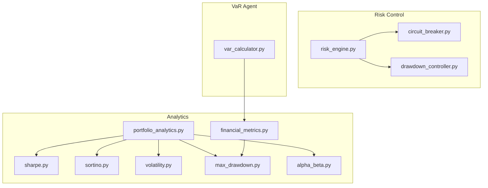
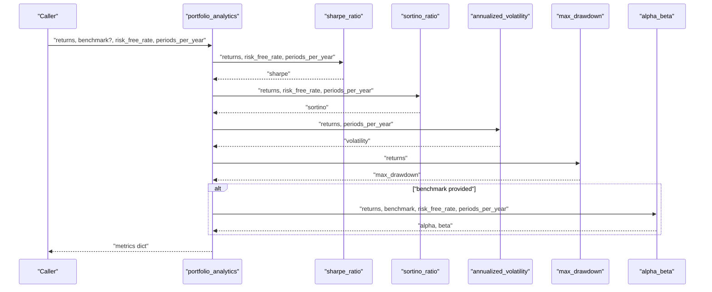
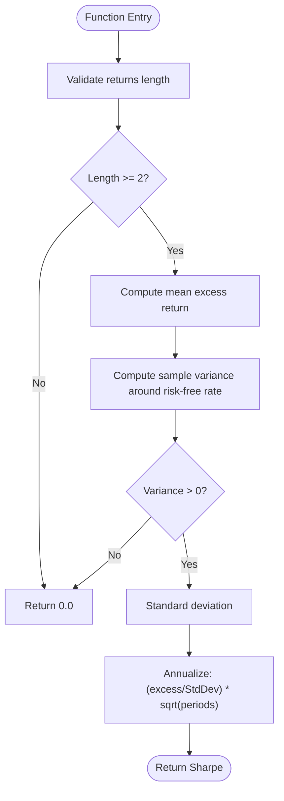
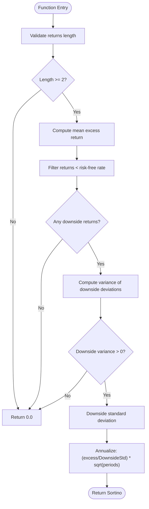
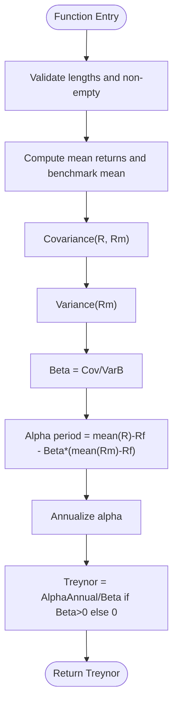
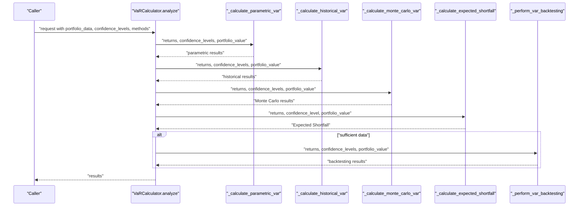
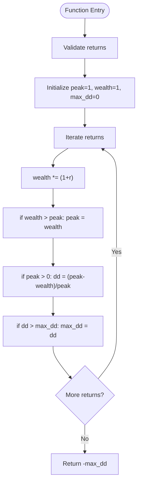
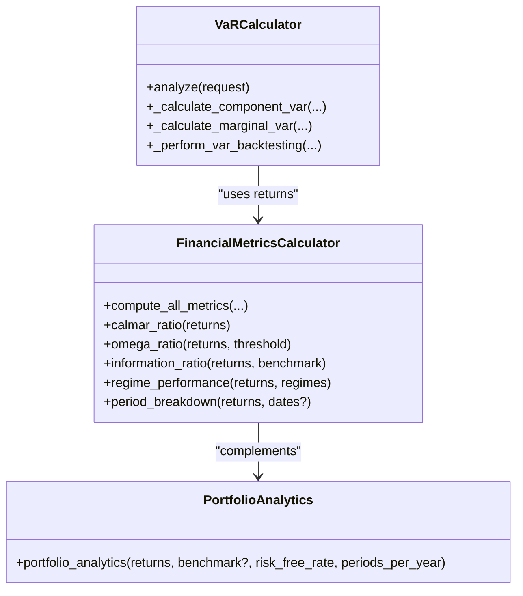
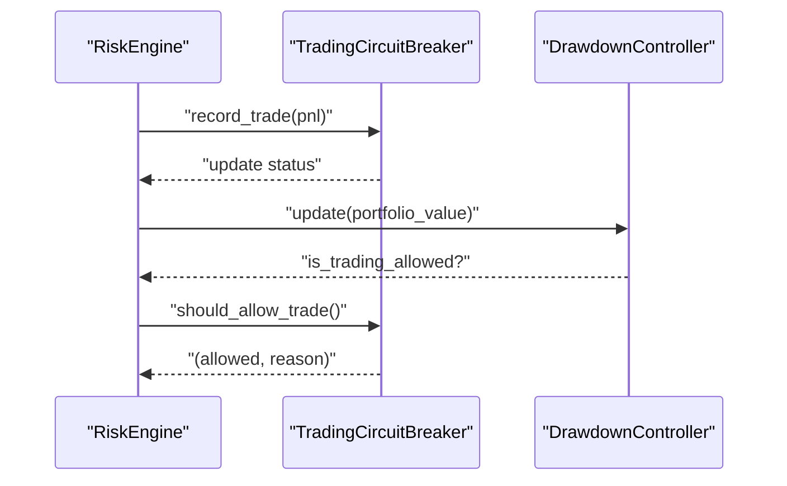
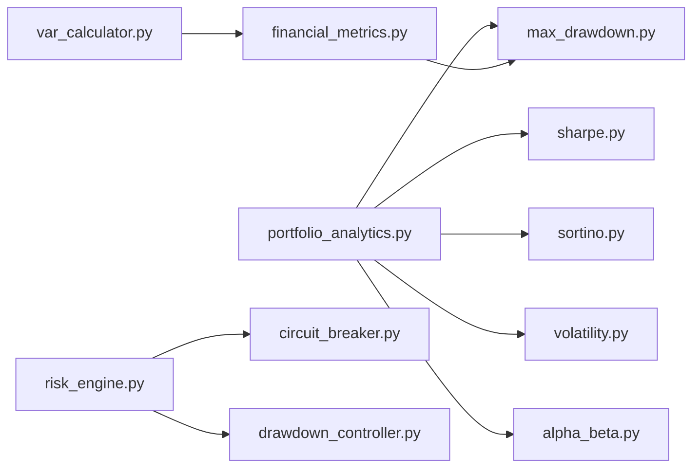

# Risk-Adjusted Performance Metrics

<cite>
**Referenced Files in This Document**
- [sharpe.py](file://backend/analytics/sharpe.py)
- [sortino.py](file://backend/analytics/sortino.py)
- [volatility.py](file://backend/analytics/volatility.py)
- [max_drawdown.py](file://backend/analytics/max_drawdown.py)
- [alpha_beta.py](file://backend/analytics/alpha_beta.py)
- [portfolio_analytics.py](file://backend/analytics/portfolio_analytics.py)
- [financial_metrics.py](file://FinAgents/research/evaluation/financial_metrics.py)
- [var_calculator.py](file://FinAgents/agent_pools/risk_agent_pool/agents/var_calculator.py)
- [risk_engine.py](file://backend/risk/risk_engine.py)
- [drawdown_controller.py](file://backend/risk/drawdown_controller.py)
- [circuit_breaker.py](file://backend/risk/circuit_breaker.py)
</cite>

## Table of Contents
1. [Introduction](#introduction)
2. [Project Structure](#project-structure)
3. [Core Components](#core-components)
4. [Architecture Overview](#architecture-overview)
5. [Detailed Component Analysis](#detailed-component-analysis)
6. [Dependency Analysis](#dependency-analysis)
7. [Performance Considerations](#performance-considerations)
8. [Troubleshooting Guide](#troubleshooting-guide)
9. [Conclusion](#conclusion)

## Introduction
This document provides a comprehensive guide to risk-adjusted performance metrics and analytics implemented in the repository. It covers Sharpe ratio, Sortino ratio, Treynor ratio, Value at Risk (VaR), Expected Shortfall (ES), maximum drawdown, Calmar ratio, and related risk controls. It also documents performance attribution capabilities, factor model integration, and benchmark comparisons. The content includes implementation insights, statistical validation approaches, and practical applications for portfolio evaluation and manager selection.

## Project Structure
The risk analytics functionality spans several modules:
- Backend analytics: core metric computations (Sharpe, Sortino, volatility, drawdown, alpha-beta)
- Research evaluation: extended financial metrics including Calmar and Omega ratios
- Risk engine and circuit breakers: operational risk controls and drawdown monitoring
- VaR calculator agent: comprehensive VaR and ES calculations with backtesting

**Diagram sources**
- [portfolio_analytics.py:14-42](file://backend/analytics/portfolio_analytics.py#L14-L42)
- [financial_metrics.py:77-591](file://FinAgents/research/evaluation/financial_metrics.py#L77-L591)
- [risk_engine.py:22-226](file://backend/risk/risk_engine.py#L22-L226)
- [circuit_breaker.py:59-360](file://backend/risk/circuit_breaker.py#L59-L360)
- [drawdown_controller.py:1-30](file://backend/risk/drawdown_controller.py#L1-L30)
- [var_calculator.py:26-797](file://FinAgents/agent_pools/risk_agent_pool/agents/var_calculator.py#L26-L797)

**Section sources**
- [portfolio_analytics.py:14-42](file://backend/analytics/portfolio_analytics.py#L14-L42)
- [financial_metrics.py:77-591](file://FinAgents/research/evaluation/financial_metrics.py#L77-L591)
- [risk_engine.py:22-226](file://backend/risk/risk_engine.py#L22-L226)
- [circuit_breaker.py:59-360](file://backend/risk/circuit_breaker.py#L59-L360)
- [drawdown_controller.py:1-30](file://backend/risk/drawdown_controller.py#L1-L30)
- [var_calculator.py:26-797](file://FinAgents/agent_pools/risk_agent_pool/agents/var_calculator.py#L26-L797)

## Core Components
- Sharpe ratio: annualized excess return per unit of total volatility
- Sortino ratio: annualized excess return per unit of downside deviation
- Volatility: annualized standard deviation of returns
- Maximum drawdown: peak-to-trough decline in cumulative returns
- Alpha and Beta: CAPM-style factor sensitivity and abnormal return
- Extended metrics: Calmar ratio, Omega ratio, Information ratio, period/regime breakdowns
- VaR and Expected Shortfall: parametric, historical, Monte Carlo, and backtesting
- Risk controls: drawdown monitoring, circuit breakers, position sizing

**Section sources**
- [sharpe.py:8-33](file://backend/analytics/sharpe.py#L8-L33)
- [sortino.py:9-41](file://backend/analytics/sortino.py#L9-L41)
- [volatility.py:9-28](file://backend/analytics/volatility.py#L9-L28)
- [max_drawdown.py:8-32](file://backend/analytics/max_drawdown.py#L8-L32)
- [alpha_beta.py:9-42](file://backend/analytics/alpha_beta.py#L9-L42)
- [financial_metrics.py:226-320](file://FinAgents/research/evaluation/financial_metrics.py#L226-L320)
- [var_calculator.py:180-443](file://FinAgents/agent_pools/risk_agent_pool/agents/var_calculator.py#L180-L443)

## Architecture Overview
The analytics pipeline integrates core metric computations with risk controls and VaR modeling. Portfolio analytics aggregates Sharpe, Sortino, volatility, and drawdown, optionally adding alpha and beta against a benchmark. Extended financial metrics provide Calmar, Omega, and regime/performance breakdowns. VaR agent computes multiple VaR methods and ES, and performs backtesting. Risk engine and circuit breakers monitor drawdown and enforce trading halts when thresholds are exceeded.

**Diagram sources**
- [portfolio_analytics.py:14-42](file://backend/analytics/portfolio_analytics.py#L14-L42)
- [sharpe.py:8-33](file://backend/analytics/sharpe.py#L8-L33)
- [sortino.py:9-41](file://backend/analytics/sortino.py#L9-L41)
- [volatility.py:9-28](file://backend/analytics/volatility.py#L9-L28)
- [max_drawdown.py:8-32](file://backend/analytics/max_drawdown.py#L8-L32)
- [alpha_beta.py:9-42](file://backend/analytics/alpha_beta.py#L9-L42)

## Detailed Component Analysis

### Sharpe Ratio
- Purpose: measure risk-adjusted return using total risk (volatility)
- Inputs: period returns, risk-free rate (same frequency), periods per year
- Implementation highlights:
  - Excess return mean minus risk-free rate
  - Sample standard deviation computed from deviations around the risk-free rate
  - Annualization via square root of periods per year
  - Edge-case handling for insufficient data or zero variance
- Statistical considerations:
  - Risk-free rate selection: choose same frequency as returns (e.g., daily RF rate for daily returns)
  - Time horizon: periods_per_year aligns with return frequency (e.g., 252 for daily)
  - Significance testing: compare to zero using t-statistic or bootstrap confidence intervals

**Diagram sources**
- [sharpe.py:23-32](file://backend/analytics/sharpe.py#L23-L32)

**Section sources**
- [sharpe.py:8-33](file://backend/analytics/sharpe.py#L8-L33)

### Sortino Ratio
- Purpose: measure downside risk-adjusted return using downside deviation
- Inputs: period returns, risk-free rate, periods per year
- Implementation highlights:
  - Downside deviation computed from returns below the risk-free rate
  - Annualized using square root of periods per year
  - Edge-case handling for empty downside set or zero downside deviation
- Optimization focus:
  - Target return optimization: selecting risk-free rate aligned with investment horizon
  - Robustness: winsorizing or filtering extreme negative outliers if needed

**Diagram sources**
- [sortino.py:25-40](file://backend/analytics/sortino.py#L25-L40)

**Section sources**
- [sortino.py:9-41](file://backend/analytics/sortino.py#L9-L41)

### Treynor Ratio
- Concept: excess return per unit of systematic risk (beta)
- Implementation approach:
  - Compute beta as covariance of returns with benchmark divided by benchmark variance
  - Annualized alpha from mean excess return minus beta times benchmark excess
  - Treynor ratio equals annualized alpha divided by beta (when beta > 0)
- Practical usage:
  - Use appropriate benchmark (e.g., broad market index)
  - Align risk-free rate and return frequency consistently

**Diagram sources**
- [alpha_beta.py:27-41](file://backend/analytics/alpha_beta.py#L27-L41)

**Section sources**
- [alpha_beta.py:9-42](file://backend/analytics/alpha_beta.py#L9-L42)

### Value at Risk (VaR) and Expected Shortfall (ES)
- Methods:
  - Parametric: normal and t-distribution VaR; Cornish–Fisher expansion
  - Historical: standard and age-weighted VaR; bootstrap confidence intervals
  - Monte Carlo: normal and t-distribution simulations; filtered historical simulation (GARCH residuals)
- Expected Shortfall:
  - Historical ES as mean of returns below VaR threshold
  - Parametric ES using normal Mills ratio
  - t-distribution ES derived from t distribution parameters
- Backtesting:
  - Rolling window out-of-sample testing
  - Kupiec (proportion of failures), independence, and conditional coverage tests
  - Loss function tests (quantile and quadratic)

**Diagram sources**
- [var_calculator.py:42-137](file://FinAgents/agent_pools/risk_agent_pool/agents/var_calculator.py#L42-L137)
- [var_calculator.py:180-443](file://FinAgents/agent_pools/risk_agent_pool/agents/var_calculator.py#L180-L443)
- [var_calculator.py:444-553](file://FinAgents/agent_pools/risk_agent_pool/agents/var_calculator.py#L444-L553)

**Section sources**
- [var_calculator.py:26-797](file://FinAgents/agent_pools/risk_agent_pool/agents/var_calculator.py#L26-L797)

### Maximum Drawdown and Calmar Ratio
- Maximum drawdown:
  - Computes cumulative wealth and tracks peak and trough
  - Returns negative drawdown percentage
- Calmar ratio:
  - Annualized return divided by maximum drawdown
  - Extended metrics module includes Calmar calculation and period/regime breakdowns

**Diagram sources**
- [max_drawdown.py:18-31](file://backend/analytics/max_drawdown.py#L18-L31)
- [financial_metrics.py:226-247](file://FinAgents/research/evaluation/financial_metrics.py#L226-L247)

**Section sources**
- [max_drawdown.py:8-32](file://backend/analytics/max_drawdown.py#L8-L32)
- [financial_metrics.py:226-247](file://FinAgents/research/evaluation/financial_metrics.py#L226-L247)

### Alternative Ratios and Attribution
- Omega ratio: probability-weighted ratio of gains above threshold to losses below threshold
- Information ratio: annualized active return divided by active risk (tracking error)
- Performance attribution:
  - Component VaR: contribution of each position to portfolio VaR
  - Marginal VaR: change in VaR from small weight perturbation
- Factor model integration:
  - Alpha and beta against benchmark for CAPM-style attribution
  - Portfolio analytics optionally returns alpha and beta alongside Sharpe and Sortino

**Diagram sources**
- [financial_metrics.py:77-591](file://FinAgents/research/evaluation/financial_metrics.py#L77-L591)
- [var_calculator.py:26-797](file://FinAgents/agent_pools/risk_agent_pool/agents/var_calculator.py#L26-L797)
- [portfolio_analytics.py:14-42](file://backend/analytics/portfolio_analytics.py#L14-L42)

**Section sources**
- [financial_metrics.py:249-320](file://FinAgents/research/evaluation/financial_metrics.py#L249-L320)
- [var_calculator.py:667-779](file://FinAgents/agent_pools/risk_agent_pool/agents/var_calculator.py#L667-L779)
- [portfolio_analytics.py:14-42](file://backend/analytics/portfolio_analytics.py#L14-L42)

### Risk Controls and Drawdown Monitoring
- Drawdown controller:
  - Tracks peak value and enforces trading allowance based on maximum drawdown threshold
- Risk engine:
  - Integrates circuit breakers, position sizing, stop-loss calculation, and drawdown monitoring
  - Records trade PnL and updates equity for circuit breaker state
- Circuit breakers:
  - Daily loss, maximum drawdown, consecutive losses, weekly loss, and volatility-based halts
  - Automatic trading halts and optional liquidation

**Diagram sources**
- [risk_engine.py:188-208](file://backend/risk/risk_engine.py#L188-L208)
- [drawdown_controller.py:11-30](file://backend/risk/drawdown_controller.py#L11-L30)
- [circuit_breaker.py:116-175](file://backend/risk/circuit_breaker.py#L116-L175)

**Section sources**
- [drawdown_controller.py:1-30](file://backend/risk/drawdown_controller.py#L1-L30)
- [risk_engine.py:22-226](file://backend/risk/risk_engine.py#L22-L226)
- [circuit_breaker.py:59-360](file://backend/risk/circuit_breaker.py#L59-L360)

## Dependency Analysis
- Portfolio analytics depends on:
  - Sharpe, Sortino, volatility, and drawdown modules
  - Optional alpha-beta computation when benchmark is provided
- Extended financial metrics depend on:
  - Drawdown computation and period/date handling
  - Omega and Information ratios built-in
- VaR agent:
  - Uses numpy/scipy for distributions and backtesting
  - Provides component and marginal VaR for attribution
- Risk engine and circuit breakers:
  - Monitor drawdown and enforce trading halts
  - Integrate with position sizing and stop-loss logic

**Diagram sources**
- [portfolio_analytics.py:7-11](file://backend/analytics/portfolio_analytics.py#L7-L11)
- [financial_metrics.py:560-576](file://FinAgents/research/evaluation/financial_metrics.py#L560-L576)
- [var_calculator.py:166-178](file://FinAgents/agent_pools/risk_agent_pool/agents/var_calculator.py#L166-L178)
- [risk_engine.py:17-64](file://backend/risk/risk_engine.py#L17-L64)

**Section sources**
- [portfolio_analytics.py:7-11](file://backend/analytics/portfolio_analytics.py#L7-L11)
- [financial_metrics.py:560-576](file://FinAgents/research/evaluation/financial_metrics.py#L560-L576)
- [var_calculator.py:166-178](file://FinAgents/agent_pools/risk_agent_pool/agents/var_calculator.py#L166-L178)
- [risk_engine.py:17-64](file://backend/risk/risk_engine.py#L17-L64)

## Performance Considerations
- Computational efficiency:
  - Vectorized operations using NumPy for returns arrays
  - Avoid repeated loops; leverage built-in functions for variance, percentiles, and distributions
- Numerical stability:
  - Guard against zero variance/division by zero
  - Use robust estimators (winsorization) for returns with heavy tails
- Scalability:
  - VaR backtesting uses rolling windows; tune window sizes for speed/accuracy balance
  - Parallelize Monte Carlo simulations where feasible
- Frequency alignment:
  - Ensure risk-free rate and periods_per_year match return frequency
  - Use appropriate annualization factors (252 for daily, 12 for monthly)

## Troubleshooting Guide
- Sharpe/Sortino return zeros:
  - Insufficient data (length < 2) or zero variance/deviation
  - Verify input returns and risk-free rate frequency
- VaR backtesting errors:
  - Insufficient observations for meaningful tests
  - Validate confidence levels and portfolio value inputs
- Circuit breaker halts:
  - Review halt reasons and expiration; ensure proper reset of daily metrics
  - Confirm drawdown thresholds and volatility triggers are set appropriately
- Drawdown controller exceptions:
  - Invalid portfolio value (non-positive)
  - Ensure peak tracking initialization and updates occur before checks

**Section sources**
- [sharpe.py:23-32](file://backend/analytics/sharpe.py#L23-L32)
- [sortino.py:25-40](file://backend/analytics/sortino.py#L25-L40)
- [var_calculator.py:454-456](file://FinAgents/agent_pools/risk_agent_pool/agents/var_calculator.py#L454-L456)
- [circuit_breaker.py:242-255](file://backend/risk/circuit_breaker.py#L242-L255)
- [drawdown_controller.py:13-14](file://backend/risk/drawdown_controller.py#L13-L14)

## Conclusion
The repository provides a robust foundation for risk-adjusted performance analytics, combining core metrics (Sharpe, Sortino, alpha-beta), extended measures (Calmar, Omega, Information ratio), VaR and ES with backtesting, and operational risk controls. These components enable comprehensive portfolio evaluation, manager selection, and risk-informed decision-making. Proper configuration of risk-free rates, time horizons, and statistical tests ensures reliable and actionable insights.