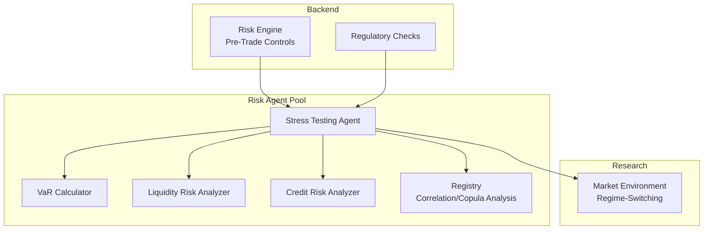
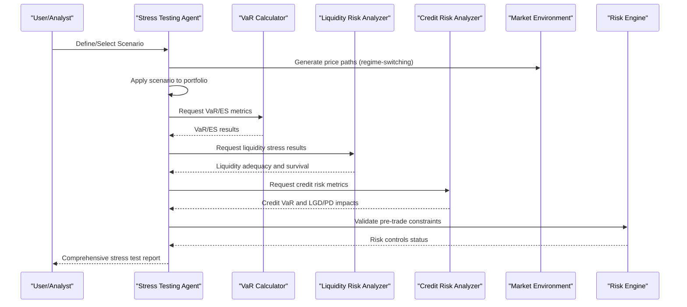
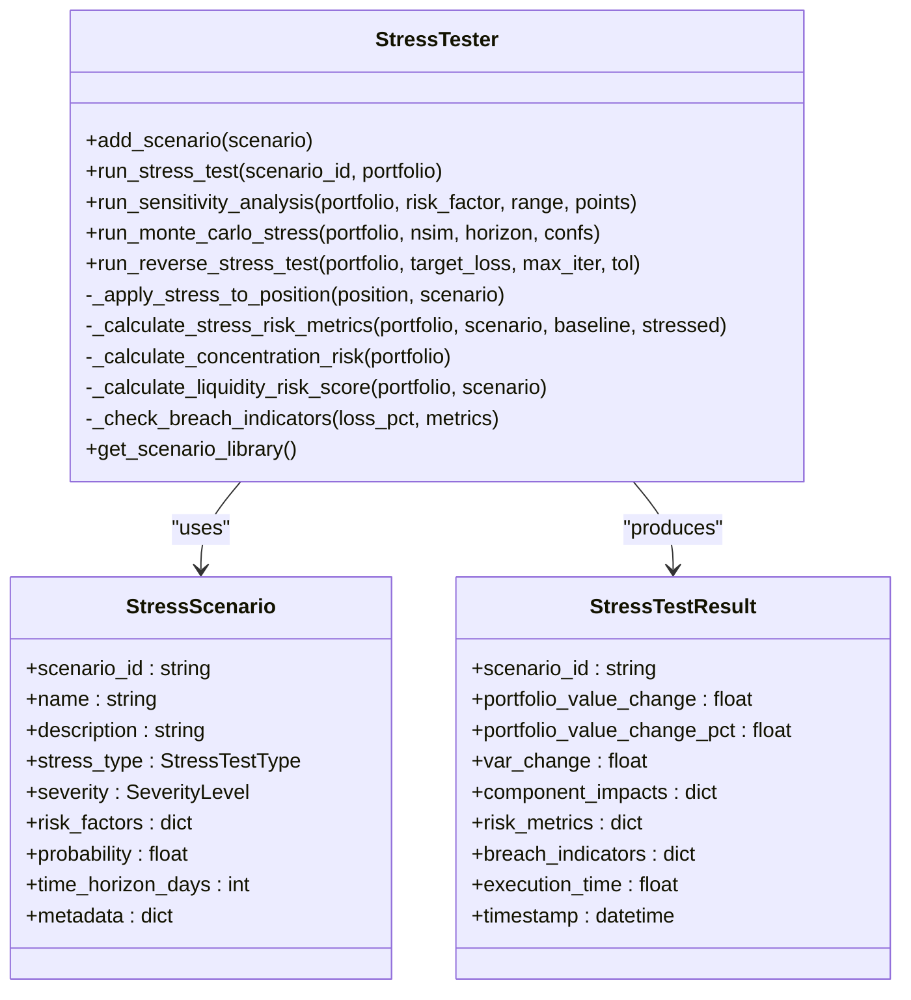
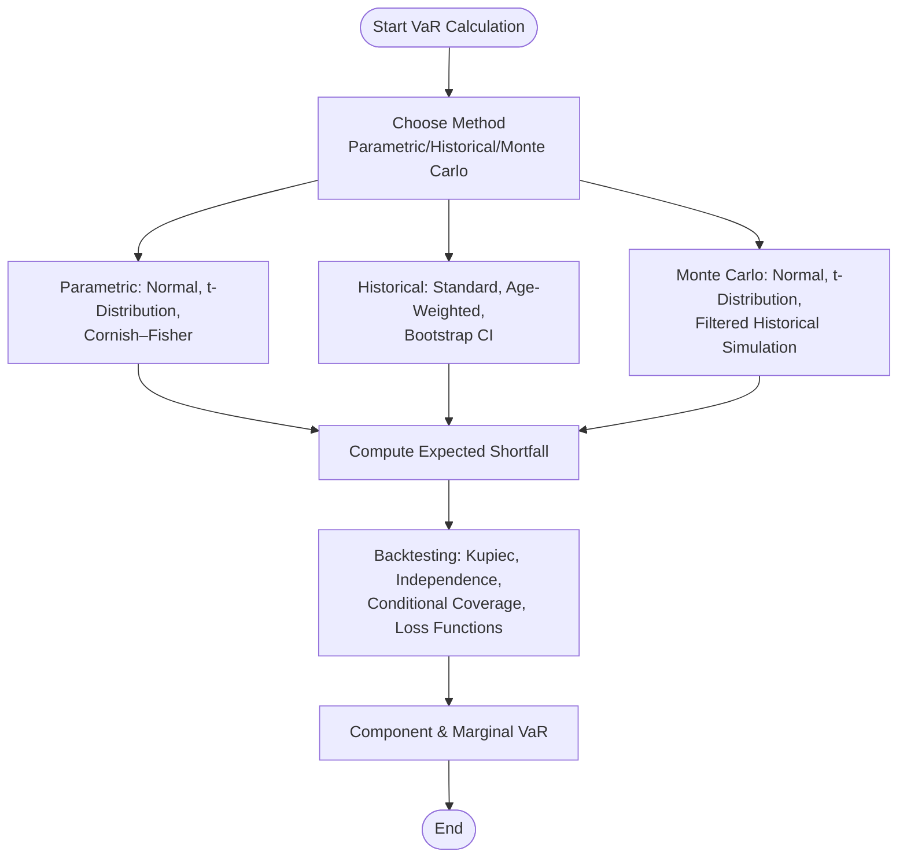
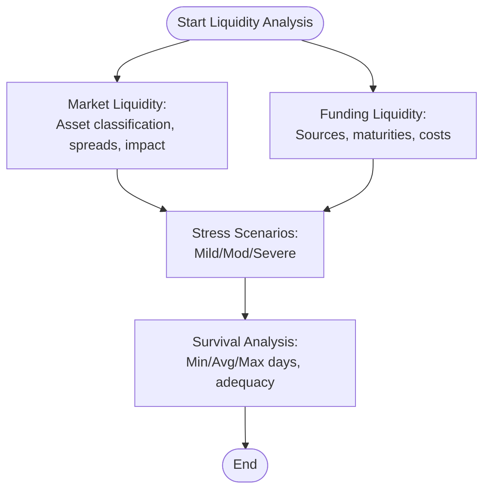
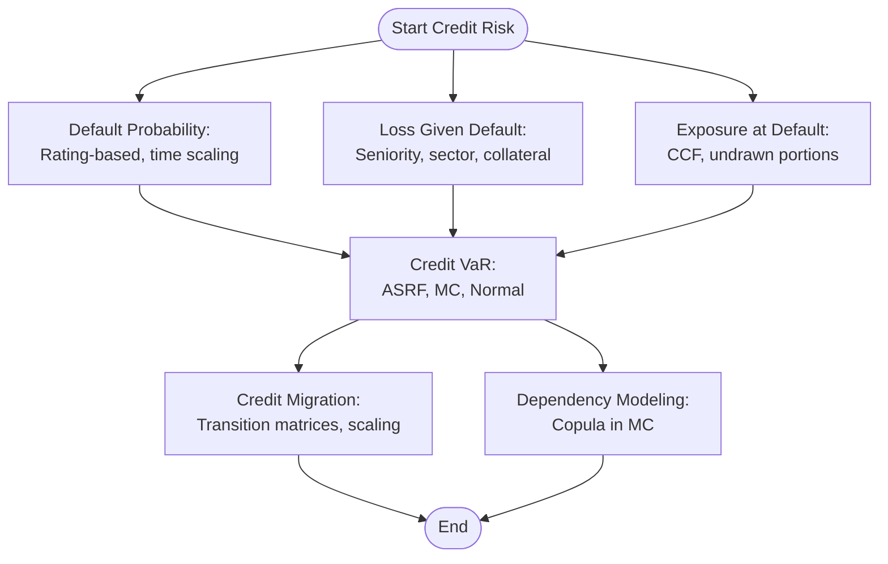
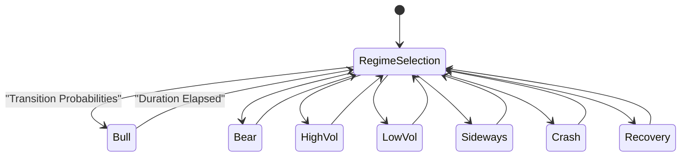
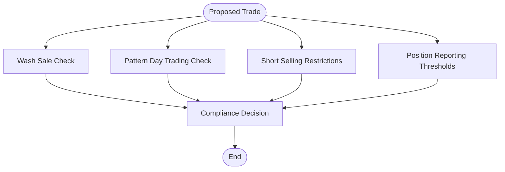
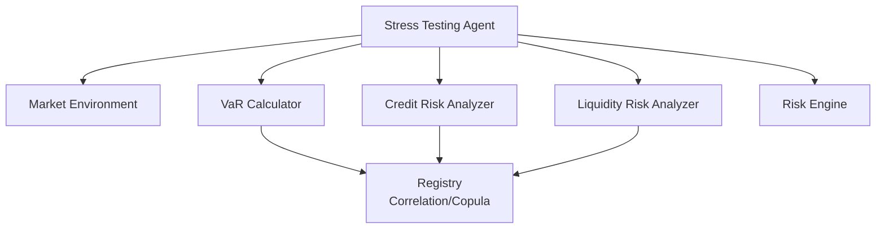

# Stress Testing and Scenario Analysis

<cite>
**Referenced Files in This Document**
- [stress_testing.py](file://FinAgents/agent_pools/risk_agent_pool/agents/stress_testing.py)
- [var_calculator.py](file://FinAgents/agent_pools/risk_agent_pool/agents/var_calculator.py)
- [liquidity_risk.py](file://FinAgents/agent_pools/risk_agent_pool/agents/liquidity_risk.py)
- [credit_risk.py](file://FinAgents/agent_pools/risk_agent_pool/agents/credit_risk.py)
- [market_environment.py](file://FinAgents/research/simulation/market_environment.py)
- [regulatory_checks.py](file://FinAgents/research/risk_compliance/regulatory_checks.py)
- [risk_engine.py](file://backend/risk/risk_engine.py)
- [registry.py](file://FinAgents/agent_pools/risk_agent_pool/registry.py)
</cite>

## Table of Contents
1. [Introduction](#introduction)
2. [Project Structure](#project-structure)
3. [Core Components](#core-components)
4. [Architecture Overview](#architecture-overview)
5. [Detailed Component Analysis](#detailed-component-analysis)
6. [Dependency Analysis](#dependency-analysis)
7. [Performance Considerations](#performance-considerations)
8. [Troubleshooting Guide](#troubleshooting-guide)
9. [Conclusion](#conclusion)
10. [Appendices](#appendices)

## Introduction
This document presents a comprehensive stress testing framework and scenario analysis methodology built within the Agentic Trading Application. It covers historical stress testing using extreme market events (2008 financial crisis, dot-com bubble burst, pandemic market crashes), hypothetical scenario construction (severity-based, macroeconomic shocks, liquidity stress), Monte Carlo stress testing with regime-switching and copula-based dependency modeling, portfolio stress testing (concentration risk, correlation breakdown, margin call simulations), and regulatory stress testing aligned with frameworks such as CCAR/EBA. It also documents reporting mechanisms for loss distribution analysis, recovery time estimation, and capital adequacy assessment, along with implementation guidance, validation methodologies, and integration points with portfolio risk management systems.

## Project Structure
The stress testing capabilities are primarily implemented in the Risk Agent Pool, with supporting components in research simulations, risk engines, and regulatory compliance utilities. Key modules include:
- Stress Testing Agent: scenario definition, historical replay, sensitivity analysis, Monte Carlo stress testing, reverse stress testing
- VaR Calculator: parametric, historical, Monte Carlo, Expected Shortfall, backtesting, component and marginal VaR
- Liquidity Risk Analyzer: market and funding liquidity, stress testing scenarios, contingency funding
- Credit Risk Analyzer: PD/LGD/EAD, Credit VaR, migration analysis, copula-style dependency modeling
- Market Environment: regime-switching simulation with GBM + jump diffusion
- Risk Engine: pre-trade validation, stop-loss calculation, position sizing, circuit breaker integration
- Regulatory Checks: pattern day trading, short sale restrictions, reporting thresholds
- Registry: correlation analysis, tail dependencies, dynamic correlations, copula analysis

**Diagram sources**
- [stress_testing.py:86-692](file://FinAgents/agent_pools/risk_agent_pool/agents/stress_testing.py#L86-L692)
- [var_calculator.py:26-797](file://FinAgents/agent_pools/risk_agent_pool/agents/var_calculator.py#L26-L797)
- [liquidity_risk.py:25-800](file://FinAgents/agent_pools/risk_agent_pool/agents/liquidity_risk.py#L25-L800)
- [credit_risk.py:27-988](file://FinAgents/agent_pools/risk_agent_pool/agents/credit_risk.py#L27-L988)
- [market_environment.py:321-765](file://FinAgents/research/simulation/market_environment.py#L321-L765)
- [risk_engine.py:22-226](file://backend/risk/risk_engine.py#L22-L226)
- [regulatory_checks.py:155-547](file://FinAgents/research/risk_compliance/regulatory_checks.py#L155-L547)
- [registry.py:408-441](file://FinAgents/agent_pools/risk_agent_pool/registry.py#L408-L441)

**Section sources**
- [stress_testing.py:1-692](file://FinAgents/agent_pools/risk_agent_pool/agents/stress_testing.py#L1-L692)
- [var_calculator.py:1-797](file://FinAgents/agent_pools/risk_agent_pool/agents/var_calculator.py#L1-L797)
- [liquidity_risk.py:1-800](file://FinAgents/agent_pools/risk_agent_pool/agents/liquidity_risk.py#L1-L800)
- [credit_risk.py:1-988](file://FinAgents/agent_pools/risk_agent_pool/agents/credit_risk.py#L1-L988)
- [market_environment.py:1-765](file://FinAgents/research/simulation/market_environment.py#L1-L765)
- [risk_engine.py:1-226](file://backend/risk/risk_engine.py#L1-L226)
- [regulatory_checks.py:1-547](file://FinAgents/research/risk_compliance/regulatory_checks.py#L1-L547)
- [registry.py:408-441](file://FinAgents/agent_pools/risk_agent_pool/registry.py#L408-L441)

## Core Components
- Stress Testing Agent: Defines stress scenarios, applies them to portfolios, computes portfolio impacts, calculates risk metrics, and supports sensitivity and Monte Carlo stress testing.
- VaR Calculator: Computes parametric, historical, and Monte Carlo VaR, Expected Shortfall, backtests models, and decomposes risk into component and marginal contributions.
- Liquidity Risk Analyzer: Assesses market and funding liquidity, performs stress testing across scenarios, evaluates contingency funding adequacy, and estimates survival periods.
- Credit Risk Analyzer: Calculates PD/LGD/EAD, Credit VaR via ASRF, Monte Carlo, and normal approximations, analyzes rating migrations, and incorporates dependency structures.
- Market Environment: Provides regime-switching dynamics with GBM + jump diffusion, enabling realistic stress scenario generation.
- Risk Engine: Enforces pre-trade controls, stop-loss computation, position sizing, and integrates circuit breaker monitoring.
- Regulatory Checks: Validates wash sale rules, pattern day trading, short selling restrictions, and reporting thresholds.
- Registry: Offers correlation matrices, tail dependencies, dynamic correlations, and copula analysis for systemic risk.

**Section sources**
- [stress_testing.py:86-692](file://FinAgents/agent_pools/risk_agent_pool/agents/stress_testing.py#L86-L692)
- [var_calculator.py:26-797](file://FinAgents/agent_pools/risk_agent_pool/agents/var_calculator.py#L26-L797)
- [liquidity_risk.py:25-800](file://FinAgents/agent_pools/risk_agent_pool/agents/liquidity_risk.py#L25-L800)
- [credit_risk.py:27-988](file://FinAgents/agent_pools/risk_agent_pool/agents/credit_risk.py#L27-L988)
- [market_environment.py:321-765](file://FinAgents/research/simulation/market_environment.py#L321-L765)
- [risk_engine.py:22-226](file://backend/risk/risk_engine.py#L22-L226)
- [regulatory_checks.py:155-547](file://FinAgents/research/risk_compliance/regulatory_checks.py#L155-L547)
- [registry.py:408-441](file://FinAgents/agent_pools/risk_agent_pool/registry.py#L408-L441)

## Architecture Overview
The stress testing architecture integrates scenario definition, simulation, valuation, and risk measurement across multiple agents and systems. The Stress Testing Agent orchestrates scenario application and result aggregation, while the VaR Calculator and Liquidity Risk Analyzer provide complementary risk metrics. The Market Environment supplies regime-driven price dynamics for Monte Carlo and scenario simulations. The Risk Engine enforces pre-trade constraints and monitors drawdowns. Regulatory Checks ensure compliance boundaries are respected during stress testing.

**Diagram sources**
- [stress_testing.py:186-260](file://FinAgents/agent_pools/risk_agent_pool/agents/stress_testing.py#L186-L260)
- [var_calculator.py:42-136](file://FinAgents/agent_pools/risk_agent_pool/agents/var_calculator.py#L42-L136)
- [liquidity_risk.py:39-100](file://FinAgents/agent_pools/risk_agent_pool/agents/liquidity_risk.py#L39-L100)
- [credit_risk.py:42-122](file://FinAgents/agent_pools/risk_agent_pool/agents/credit_risk.py#L42-L122)
- [market_environment.py:462-557](file://FinAgents/research/simulation/market_environment.py#L462-L557)
- [risk_engine.py:72-127](file://backend/risk/risk_engine.py#L72-L127)

## Detailed Component Analysis

### Stress Testing Agent
The Stress Testing Agent provides:
- Historical scenario replay: 2008 Financial Crisis, COVID-19 pandemic, and interest rate shock scenarios with calibrated risk factor shocks.
- Sensitivity analysis: One-factor perturbation studies across a range of shocks.
- Monte Carlo stress testing: Correlated multivariate normal scenarios with time scaling.
- Reverse stress testing: Iterative search for scenarios causing target losses.
- Risk metrics: Portfolio return, VaR change multiplier, concentration risk, and liquidity risk score.
- Breach indicators: Severe/extreme loss thresholds, concentration limits, and liquidity risk thresholds.

**Diagram sources**
- [stress_testing.py:86-692](file://FinAgents/agent_pools/risk_agent_pool/agents/stress_testing.py#L86-L692)

**Section sources**
- [stress_testing.py:109-175](file://FinAgents/agent_pools/risk_agent_pool/agents/stress_testing.py#L109-L175)
- [stress_testing.py:186-260](file://FinAgents/agent_pools/risk_agent_pool/agents/stress_testing.py#L186-L260)
- [stress_testing.py:262-334](file://FinAgents/agent_pools/risk_agent_pool/agents/stress_testing.py#L262-L334)
- [stress_testing.py:335-444](file://FinAgents/agent_pools/risk_agent_pool/agents/stress_testing.py#L335-L444)
- [stress_testing.py:445-530](file://FinAgents/agent_pools/risk_agent_pool/agents/stress_testing.py#L445-L530)
- [stress_testing.py:572-677](file://FinAgents/agent_pools/risk_agent_pool/agents/stress_testing.py#L572-L677)

### VaR Calculator
The VaR Calculator offers:
- Parametric VaR using normal and t-distribution, plus Cornish–Fisher expansion.
- Historical VaR with standard and age-weighted approaches, bootstrap confidence intervals.
- Monte Carlo VaR using normal/t-distribution and filtered historical simulation (FHS) with GARCH volatility.
- Expected Shortfall (ES) across distributions and tail statistics.
- Backtesting: Kupiec POF, independence, conditional coverage tests, loss function tests, Basel traffic light assessment.
- Component and Marginal VaR decomposition.

**Diagram sources**
- [var_calculator.py:180-356](file://FinAgents/agent_pools/risk_agent_pool/agents/var_calculator.py#L180-L356)
- [var_calculator.py:398-442](file://FinAgents/agent_pools/risk_agent_pool/agents/var_calculator.py#L398-L442)
- [var_calculator.py:444-553](file://FinAgents/agent_pools/risk_agent_pool/agents/var_calculator.py#L444-L553)
- [var_calculator.py:667-779](file://FinAgents/agent_pools/risk_agent_pool/agents/var_calculator.py#L667-L779)

**Section sources**
- [var_calculator.py:180-356](file://FinAgents/agent_pools/risk_agent_pool/agents/var_calculator.py#L180-L356)
- [var_calculator.py:398-442](file://FinAgents/agent_pools/risk_agent_pool/agents/var_calculator.py#L398-L442)
- [var_calculator.py:444-553](file://FinAgents/agent_pools/risk_agent_pool/agents/var_calculator.py#L444-L553)
- [var_calculator.py:667-779](file://FinAgents/agent_pools/risk_agent_pool/agents/var_calculator.py#L667-L779)

### Liquidity Risk Analyzer
The Liquidity Risk Analyzer provides:
- Market liquidity assessment: asset classification, bid–ask spreads, market impact, liquidation timeframes.
- Funding liquidity analysis: funding sources, maturities, rollover risk, contingency funding capacity.
- Stress testing scenarios: mild/moderate/severe scenarios across market and funding dimensions.
- Survival analysis: minimum/average/maximum survival days under stress, adequacy assessment, recommendations.

**Diagram sources**
- [liquidity_risk.py:102-160](file://FinAgents/agent_pools/risk_agent_pool/agents/liquidity_risk.py#L102-L160)
- [liquidity_risk.py:387-425](file://FinAgents/agent_pools/risk_agent_pool/agents/liquidity_risk.py#L387-L425)
- [liquidity_risk.py:1026-1117](file://FinAgents/agent_pools/risk_agent_pool/agents/liquidity_risk.py#L1026-L1117)

**Section sources**
- [liquidity_risk.py:102-160](file://FinAgents/agent_pools/risk_agent_pool/agents/liquidity_risk.py#L102-L160)
- [liquidity_risk.py:387-425](file://FinAgents/agent_pools/risk_agent_pool/agents/liquidity_risk.py#L387-L425)
- [liquidity_risk.py:1026-1117](file://FinAgents/agent_pools/risk_agent_pool/agents/liquidity_risk.py#L1026-L1117)

### Credit Risk Analyzer
The Credit Risk Analyzer delivers:
- Default probability (PD) estimation across time horizons using hazard rates.
- Loss Given Default (LGD) estimation with seniority, sector, and collateral adjustments.
- Exposure at Default (EAD) calculation with credit conversion factors (CCF).
- Credit VaR using ASRF, Monte Carlo, and normal approximations.
- Credit migration analysis with transition matrices and multi-year scaling.
- Copula-style dependency modeling in Monte Carlo simulations.

**Diagram sources**
- [credit_risk.py:124-186](file://FinAgents/agent_pools/risk_agent_pool/agents/credit_risk.py#L124-L186)
- [credit_risk.py:221-305](file://FinAgents/agent_pools/risk_agent_pool/agents/credit_risk.py#L221-L305)
- [credit_risk.py:338-441](file://FinAgents/agent_pools/risk_agent_pool/agents/credit_risk.py#L338-L441)
- [credit_risk.py:443-511](file://FinAgents/agent_pools/risk_agent_pool/agents/credit_risk.py#L443-L511)
- [credit_risk.py:513-577](file://FinAgents/agent_pools/risk_agent_pool/agents/credit_risk.py#L513-L577)

**Section sources**
- [credit_risk.py:124-186](file://FinAgents/agent_pools/risk_agent_pool/agents/credit_risk.py#L124-L186)
- [credit_risk.py:221-305](file://FinAgents/agent_pools/risk_agent_pool/agents/credit_risk.py#L221-L305)
- [credit_risk.py:338-441](file://FinAgents/agent_pools/risk_agent_pool/agents/credit_risk.py#L338-L441)
- [credit_risk.py:443-511](file://FinAgents/agent_pools/risk_agent_pool/agents/credit_risk.py#L443-L511)
- [credit_risk.py:513-577](file://FinAgents/agent_pools/risk_agent_pool/agents/credit_risk.py#L513-L577)

### Market Environment (Regime-Switching)
The Market Environment simulates realistic price dynamics with:
- Regime-dependent volatility multipliers and transition probabilities.
- GBM with jump diffusion for price evolution.
- Order book mechanics for market impact and slippage.
- Forced regime changes and OHLCV recording.

**Diagram sources**
- [market_environment.py:21-31](file://FinAgents/research/simulation/market_environment.py#L21-L31)
- [market_environment.py:337-391](file://FinAgents/research/simulation/market_environment.py#L337-L391)
- [market_environment.py:598-619](file://FinAgents/research/simulation/market_environment.py#L598-L619)

**Section sources**
- [market_environment.py:337-391](file://FinAgents/research/simulation/market_environment.py#L337-L391)
- [market_environment.py:559-596](file://FinAgents/research/simulation/market_environment.py#L559-L596)
- [market_environment.py:598-619](file://FinAgents/research/simulation/market_environment.py#L598-L619)

### Regulatory Compliance Integration
Regulatory checks ensure stress testing remains compliant:
- Wash sale detection with lookback windows.
- Pattern day trading (PDT) limits and day trade counting.
- Short selling restrictions, locate requirements, and uptick rule considerations.
- Position reporting thresholds and disclosure obligations.

**Diagram sources**
- [regulatory_checks.py:184-257](file://FinAgents/research/risk_compliance/regulatory_checks.py#L184-L257)
- [regulatory_checks.py:259-343](file://FinAgents/research/risk_compliance/regulatory_checks.py#L259-L343)
- [regulatory_checks.py:345-414](file://FinAgents/research/risk_compliance/regulatory_checks.py#L345-L414)
- [regulatory_checks.py:416-487](file://FinAgents/research/risk_compliance/regulatory_checks.py#L416-L487)

**Section sources**
- [regulatory_checks.py:184-257](file://FinAgents/research/risk_compliance/regulatory_checks.py#L184-L257)
- [regulatory_checks.py:259-343](file://FinAgents/research/risk_compliance/regulatory_checks.py#L259-L343)
- [regulatory_checks.py:345-414](file://FinAgents/research/risk_compliance/regulatory_checks.py#L345-L414)
- [regulatory_checks.py:416-487](file://FinAgents/research/risk_compliance/regulatory_checks.py#L416-L487)

## Dependency Analysis
Key dependencies and interactions:
- Stress Testing Agent depends on Market Environment for scenario price paths and on VaR/Liquidity/Credit agents for risk metrics.
- VaR Calculator relies on historical returns and optionally GARCH-filtered residuals for Monte Carlo simulations.
- Liquidity Risk Analyzer integrates with stress scenarios and contingency funding assessments.
- Credit Risk Analyzer uses PD/LGD/EAD inputs and employs copula-based dependency in Monte Carlo simulations.
- Risk Engine provides pre-trade validation and stop-loss calculations integrated into stress testing workflows.
- Registry supplies correlation and copula analyses for systemic risk modeling.

**Diagram sources**
- [stress_testing.py:186-260](file://FinAgents/agent_pools/risk_agent_pool/agents/stress_testing.py#L186-L260)
- [var_calculator.py:26-797](file://FinAgents/agent_pools/risk_agent_pool/agents/var_calculator.py#L26-L797)
- [liquidity_risk.py:25-800](file://FinAgents/agent_pools/risk_agent_pool/agents/liquidity_risk.py#L25-L800)
- [credit_risk.py:27-988](file://FinAgents/agent_pools/risk_agent_pool/agents/credit_risk.py#L27-L988)
- [market_environment.py:321-765](file://FinAgents/research/simulation/market_environment.py#L321-L765)
- [risk_engine.py:22-226](file://backend/risk/risk_engine.py#L22-L226)
- [registry.py:408-441](file://FinAgents/agent_pools/risk_agent_pool/registry.py#L408-L441)

**Section sources**
- [registry.py:408-441](file://FinAgents/agent_pools/risk_agent_pool/registry.py#L408-L441)
- [var_calculator.py:358-396](file://FinAgents/agent_pools/risk_agent_pool/agents/var_calculator.py#L358-L396)

## Performance Considerations
- Monte Carlo scalability: Use correlation matrices and vectorized operations to reduce simulation overhead.
- Regime-switching efficiency: Cache regime durations and transition probabilities to minimize recomputation.
- Backtesting: Employ rolling windows and efficient quantile computations for VaR backtests.
- Circuit breaker integration: Monitor drawdowns and halt trading proactively to prevent cascading losses during stress.
- Parallelization: Run multiple scenario simulations concurrently where feasible.

## Troubleshooting Guide
Common issues and resolutions:
- Scenario not found: Ensure scenario IDs match predefined libraries and metadata.
- Negative or zero portfolio values: Validate inputs and handle edge cases in stress application.
- VaR backtest failures: Adjust confidence levels, increase sample size, or refine model assumptions.
- Liquidity stress inadequacy: Increase contingency buffers and diversify funding sources.
- Credit VaR inconsistencies: Verify PD/LGD/EAD inputs and dependency assumptions in copula simulations.
- Regulatory constraint violations: Review wash sale, PDT, and reporting thresholds before executing trades.

**Section sources**
- [stress_testing.py:258-260](file://FinAgents/agent_pools/risk_agent_pool/agents/stress_testing.py#L258-L260)
- [var_calculator.py:444-553](file://FinAgents/agent_pools/risk_agent_pool/agents/var_calculator.py#L444-L553)
- [liquidity_risk.py:1026-1117](file://FinAgents/agent_pools/risk_agent_pool/agents/liquidity_risk.py#L1026-L1117)
- [credit_risk.py:513-577](file://FinAgents/agent_pools/risk_agent_pool/agents/credit_risk.py#L513-L577)
- [regulatory_checks.py:184-257](file://FinAgents/research/risk_compliance/regulatory_checks.py#L184-L257)

## Conclusion
The Agentic Trading Application provides a robust, modular stress testing framework integrating scenario-based testing, Monte Carlo simulations, regime-switching dynamics, and comprehensive risk metrics. By combining the Stress Testing Agent with VaR, liquidity, and credit risk analyzers, and aligning with regulatory constraints and pre-trade controls, the system enables rigorous scenario analysis, loss distribution insights, recovery time estimation, and capital adequacy assessment essential for resilient portfolio risk management.

## Appendices

### Implementation Examples
- Historical scenario replay: Use predefined scenario IDs for 2008 Financial Crisis and COVID-19 pandemic.
- Sensitivity analysis: Define a single risk factor range and evaluate portfolio value changes.
- Monte Carlo stress testing: Set correlation matrix and run simulations with multiple confidence levels.
- Reverse stress testing: Specify target loss percentage and iterate to identify adverse scenarios.
- VaR backtesting: Provide historical returns and validate model performance using statistical tests.
- Liquidity stress testing: Evaluate survival periods under mild/moderate/severe scenarios.
- Credit VaR: Compute ASRF, Monte Carlo, and normal approximations with copula dependency.

**Section sources**
- [stress_testing.py:111-150](file://FinAgents/agent_pools/risk_agent_pool/agents/stress_testing.py#L111-L150)
- [stress_testing.py:262-334](file://FinAgents/agent_pools/risk_agent_pool/agents/stress_testing.py#L262-L334)
- [stress_testing.py:335-444](file://FinAgents/agent_pools/risk_agent_pool/agents/stress_testing.py#L335-L444)
- [stress_testing.py:445-530](file://FinAgents/agent_pools/risk_agent_pool/agents/stress_testing.py#L445-L530)
- [var_calculator.py:444-553](file://FinAgents/agent_pools/risk_agent_pool/agents/var_calculator.py#L444-L553)
- [liquidity_risk.py:274-314](file://FinAgents/agent_pools/risk_agent_pool/agents/liquidity_risk.py#L274-L314)
- [credit_risk.py:443-511](file://FinAgents/agent_pools/risk_agent_pool/agents/credit_risk.py#L443-L511)

### Stress Test Design Principles
- Scenario realism: Calibrate risk factors to historical events and macroeconomic relationships.
- Tail dependence: Incorporate copula-based dependency structures for extreme co-movements.
- Time horizon alignment: Scale volatility and shocks appropriately for the chosen time horizon.
- Concentration focus: Assess sector/country/asset-type concentration impacts.
- Liquidity resilience: Evaluate funding and market liquidity under stress.

### Validation Methodologies
- Statistical backtesting for VaR models.
- Sensitivity and stress tests across multiple confidence levels.
- Scenario coverage and worst-case ordering.
- Regulatory boundary checks before execution.

### Integration with Portfolio Risk Management Systems
- Pre-trade validation via Risk Engine for position sizing and stop-loss enforcement.
- Continuous monitoring of drawdowns and automatic trading halts.
- Regulatory compliance gates for wash sales, PDT, short selling, and reporting thresholds.
- Centralized correlation and copula analysis for systemic risk oversight.

**Section sources**
- [risk_engine.py:72-127](file://backend/risk/risk_engine.py#L72-L127)
- [regulatory_checks.py:489-547](file://FinAgents/research/risk_compliance/regulatory_checks.py#L489-L547)
- [registry.py:408-441](file://FinAgents/agent_pools/risk_agent_pool/registry.py#L408-L441)