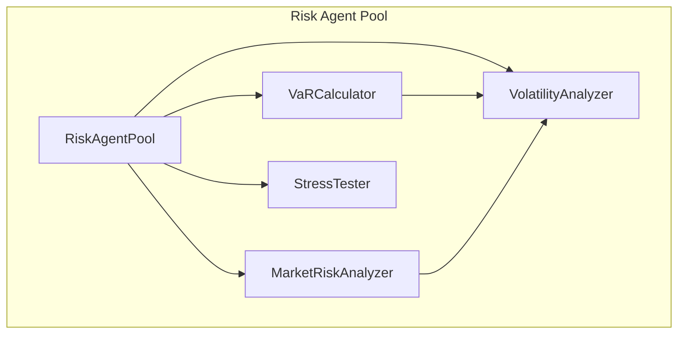
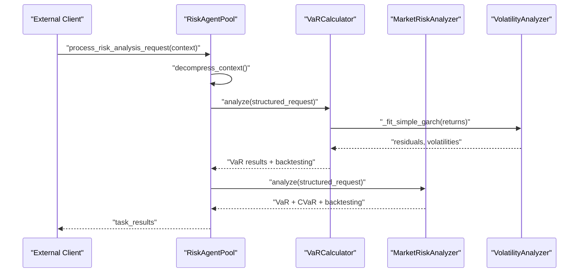
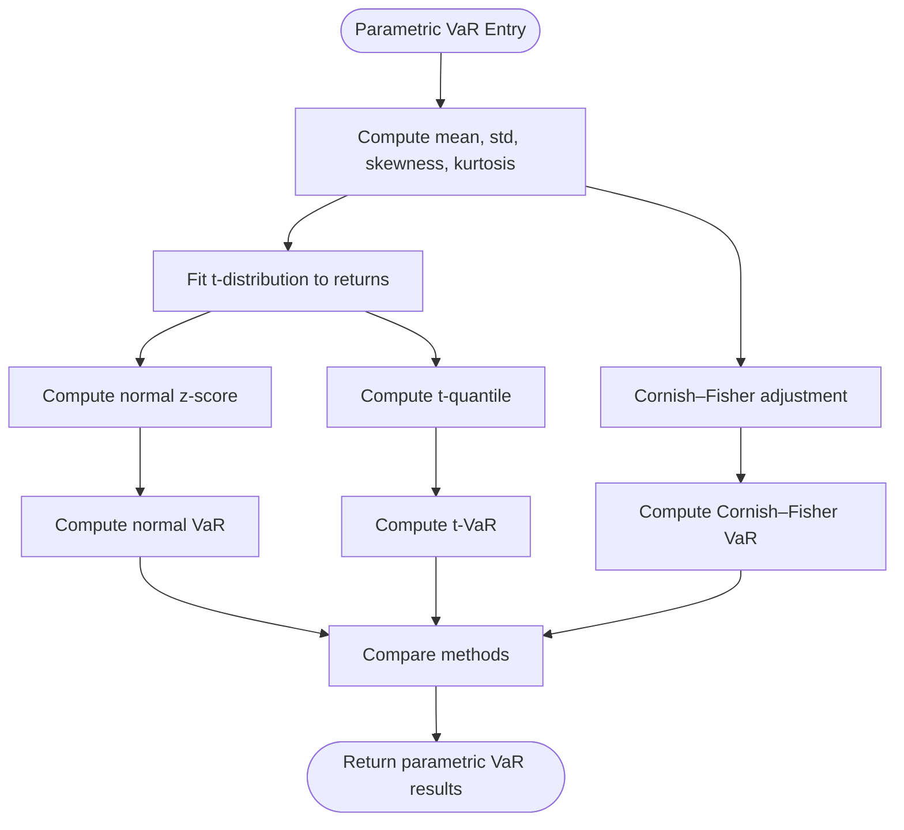
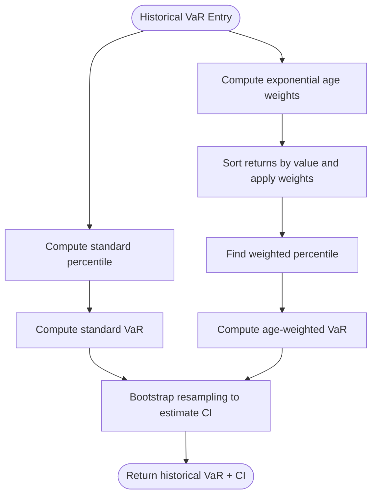
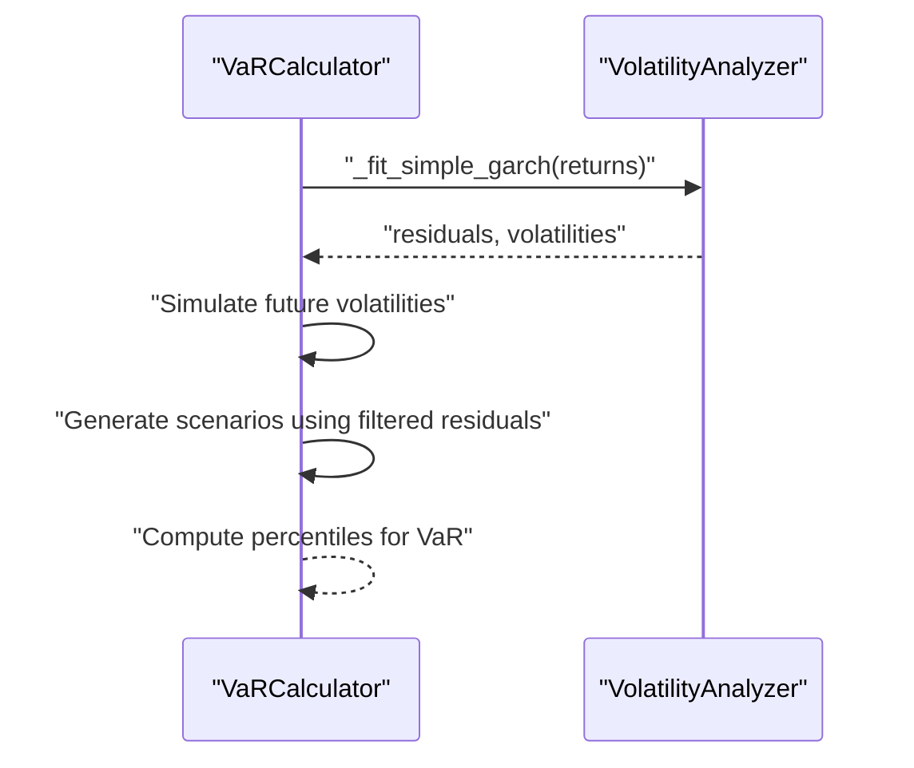
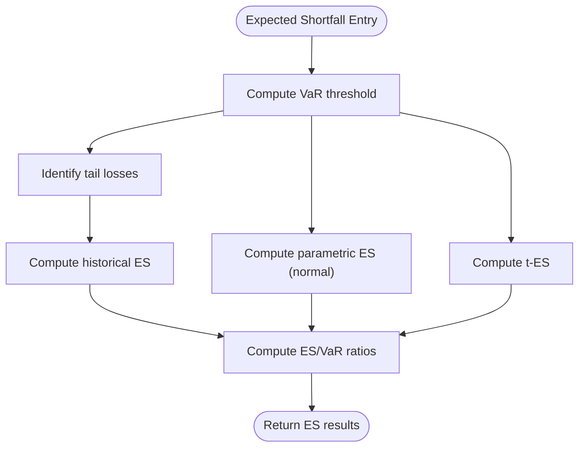
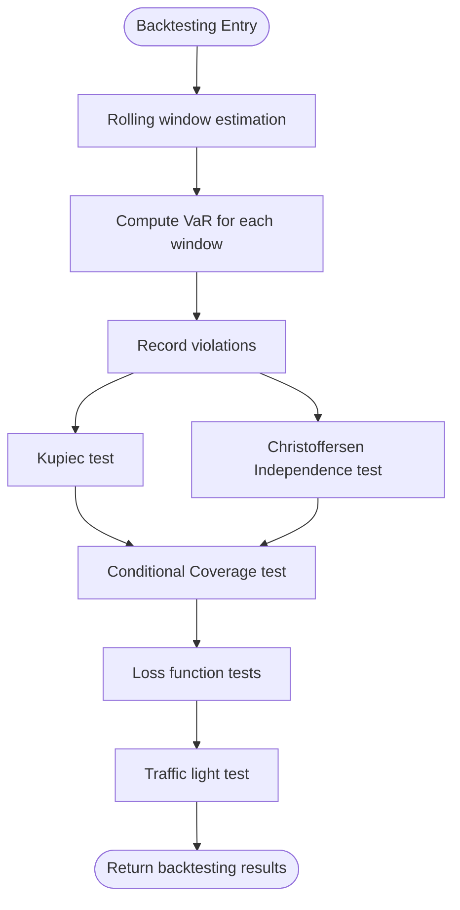
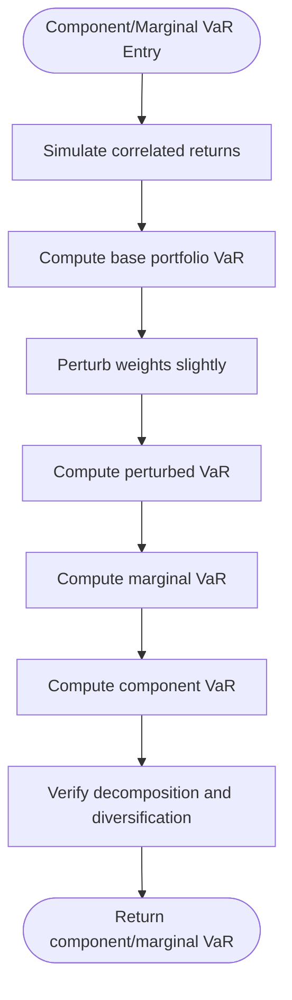
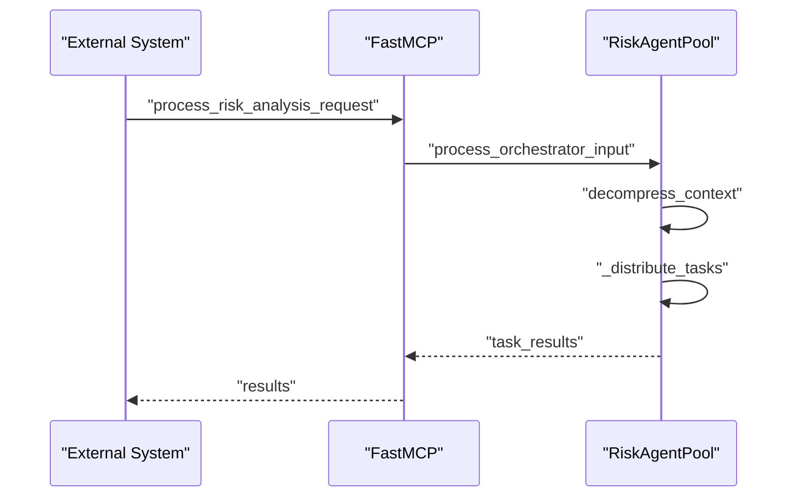
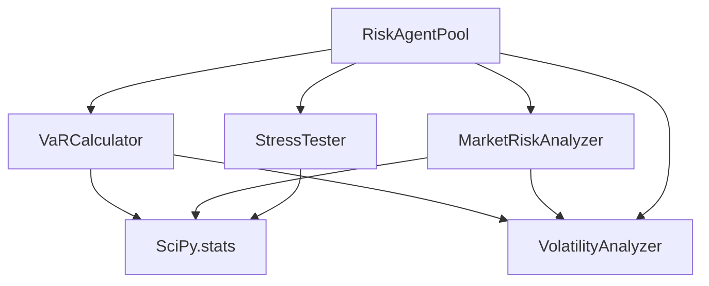

# Value at Risk (VaR) Calculations

<cite>
**Referenced Files in This Document**
- [var_calculator.py](file://FinAgents/agent_pools/risk_agent_pool/agents/var_calculator.py)
- [market_risk.py](file://FinAgents/agent_pools/risk_agent_pool/agents/market_risk.py)
- [volatility.py](file://FinAgents/agent_pools/risk_agent_pool/agents/volatility.py)
- [stress_testing.py](file://FinAgents/agent_pools/risk_agent_pool/agents/stress_testing.py)
- [core.py](file://FinAgents/agent_pools/risk_agent_pool/core.py)
- [__init__.py](file://FinAgents/agent_pools/risk_agent_pool/agents/__init__.py)
</cite>

## Table of Contents
1. [Introduction](#introduction)
2. [Project Structure](#project-structure)
3. [Core Components](#core-components)
4. [Architecture Overview](#architecture-overview)
5. [Detailed Component Analysis](#detailed-component-analysis)
6. [Dependency Analysis](#dependency-analysis)
7. [Performance Considerations](#performance-considerations)
8. [Troubleshooting Guide](#troubleshooting-guide)
9. [Conclusion](#conclusion)

## Introduction
This document provides comprehensive coverage of Value at Risk (VaR) calculations implemented in the risk agent pool. It explains parametric VaR using normal and t-distribution approaches, including Cornish–Fisher expansion for higher moments; historical VaR using empirical distribution with age-weighted methodology and bootstrap confidence intervals; Monte Carlo VaR with normal/t-distribution simulation and Filtered Historical Simulation (FHS) using GARCH volatility modeling; Expected Shortfall (Conditional VaR) across distributions; and a complete backtesting framework with Kupiec Proportion of Failures test, Christoffersen Independence test, and Conditional Coverage test. It also documents component VaR and marginal VaR analysis for portfolio decomposition, along with integration patterns and configuration guidance.

## Project Structure
The VaR functionality is implemented primarily within the risk agent pool, with specialized agents handling distinct aspects of risk analysis:
- VaRCalculator: Full VaR toolkit including parametric, historical, Monte Carlo, Expected Shortfall, backtesting, and decomposition
- MarketRiskAnalyzer: Market risk analysis with VaR estimates and backtesting
- VolatilityAnalyzer: Volatility modeling and GARCH diagnostics (used by FHS)
- StressTester: Scenario-based stress testing and VaR/ES computation under stress
- RiskAgentPool: Orchestrator coordinating agents and exposing MCP endpoints

**Diagram sources**
- [core.py:137-456](file://FinAgents/agent_pools/risk_agent_pool/core.py#L137-L456)
- [var_calculator.py:26-136](file://FinAgents/agent_pools/risk_agent_pool/agents/var_calculator.py#L26-L136)
- [market_risk.py:29-155](file://FinAgents/agent_pools/risk_agent_pool/agents/market_risk.py#L29-L155)
- [volatility.py:25-97](file://FinAgents/agent_pools/risk_agent_pool/agents/volatility.py#L25-L97)
- [stress_testing.py:86-107](file://FinAgents/agent_pools/risk_agent_pool/agents/stress_testing.py#L86-L107)

**Section sources**
- [core.py:137-456](file://FinAgents/agent_pools/risk_agent_pool/core.py#L137-L456)
- [__init__.py:11-29](file://FinAgents/agent_pools/risk_agent_pool/agents/__init__.py#L11-L29)

## Core Components
- VaRCalculator: Implements parametric, historical, and Monte Carlo VaR; Expected Shortfall; backtesting; and component/marginal VaR decomposition
- MarketRiskAnalyzer: Provides VaR estimates, Expected Shortfall, and backtesting alongside broader market risk metrics
- VolatilityAnalyzer: Supplies volatility modeling and GARCH diagnostics used by FHS
- StressTester: Computes VaR/ES under stress scenarios and supports Monte Carlo stress testing
- RiskAgentPool: Orchestrates agent execution and exposes MCP endpoints for external integration

**Section sources**
- [var_calculator.py:26-136](file://FinAgents/agent_pools/risk_agent_pool/agents/var_calculator.py#L26-L136)
- [market_risk.py:29-155](file://FinAgents/agent_pools/risk_agent_pool/agents/market_risk.py#L29-L155)
- [volatility.py:25-97](file://FinAgents/agent_pools/risk_agent_pool/agents/volatility.py#L25-L97)
- [stress_testing.py:86-107](file://FinAgents/agent_pools/risk_agent_pool/agents/stress_testing.py#L86-L107)
- [core.py:137-456](file://FinAgents/agent_pools/risk_agent_pool/core.py#L137-L456)

## Architecture Overview
The risk agent pool orchestrates VaR computations through a modular agent architecture. The VaRCalculator performs VaR calculations and backtesting, while MarketRiskAnalyzer integrates VaR with other risk metrics. VolatilityAnalyzer supplies GARCH-based volatility diagnostics used by FHS. StressTester computes VaR/ES under stress scenarios and supports Monte Carlo stress testing. RiskAgentPool coordinates agent execution and exposes MCP endpoints for external clients.

**Diagram sources**
- [core.py:268-387](file://FinAgents/agent_pools/risk_agent_pool/core.py#L268-L387)
- [var_calculator.py:43-136](file://FinAgents/agent_pools/risk_agent_pool/agents/var_calculator.py#L43-L136)
- [market_risk.py:51-155](file://FinAgents/agent_pools/risk_agent_pool/agents/market_risk.py#L51-L155)
- [volatility.py:529-559](file://FinAgents/agent_pools/risk_agent_pool/agents/volatility.py#L529-L559)

## Detailed Component Analysis

### Parametric VaR (Normal, t-Distribution, Cornish–Fisher)
- Normal distribution VaR: Uses mean and standard deviation of returns with a normal quantile
- t-distribution VaR: Fits a Student’s t-distribution to returns and uses the t-quantile
- Cornish–Fisher expansion: Adjusts the normal quantile using skewness and excess kurtosis for higher moments

Implementation highlights:
- Distribution fitting and quantile extraction
- Comparison metrics between normal, t-distribution, and Cornish–Fisher adjustments
- Summary statistics including skewness and kurtosis

**Diagram sources**
- [var_calculator.py:180-230](file://FinAgents/agent_pools/risk_agent_pool/agents/var_calculator.py#L180-L230)

**Section sources**
- [var_calculator.py:180-230](file://FinAgents/agent_pools/risk_agent_pool/agents/var_calculator.py#L180-L230)

### Historical VaR (Empirical Distribution, Age-Weighted, Bootstrap CI)
- Standard historical VaR: Percentile of historical returns
- Age-weighted historical VaR: Exponential weighting to recent observations
- Bootstrap confidence intervals: Non-parametric resampling to estimate uncertainty

Implementation highlights:
- Weighted percentile computation for age-weighted VaR
- Bootstrap sampling to compute 95% confidence intervals
- Method comparison metrics

**Diagram sources**
- [var_calculator.py:232-285](file://FinAgents/agent_pools/risk_agent_pool/agents/var_calculator.py#L232-L285)

**Section sources**
- [var_calculator.py:232-285](file://FinAgents/agent_pools/risk_agent_pool/agents/var_calculator.py#L232-L285)

### Monte Carlo VaR (Normal, t-Distribution, FHS with GARCH)
- Normal MC VaR: Draw from fitted normal distribution
- t-distribution MC VaR: Draw from fitted t-distribution
- Filtered Historical Simulation (FHS): Use GARCH residuals and simulated volatilities to generate scenarios

Implementation highlights:
- Parameter estimation for normal and t-distributions
- GARCH(1,1) residual extraction and volatility simulation
- Simulation statistics and method comparisons

**Diagram sources**
- [var_calculator.py:287-356](file://FinAgents/agent_pools/risk_agent_pool/agents/var_calculator.py#L287-L356)
- [volatility.py:358-396](file://FinAgents/agent_pools/risk_agent_pool/agents/volatility.py#L358-L396)

**Section sources**
- [var_calculator.py:287-356](file://FinAgents/agent_pools/risk_agent_pool/agents/var_calculator.py#L287-L356)
- [volatility.py:358-396](file://FinAgents/agent_pools/risk_agent_pool/agents/volatility.py#L358-L396)

### Expected Shortfall (Conditional VaR)
- Historical ES: Mean of returns below VaR threshold
- Parametric ES (normal): Closed-form expression using normal Mills ratio
- t-distribution ES: Closed-form expression derived from t-distribution

Implementation highlights:
- Tail loss averaging and ratio calculations
- ES/VaR ratios for comparative analysis

**Diagram sources**
- [var_calculator.py:398-442](file://FinAgents/agent_pools/risk_agent_pool/agents/var_calculator.py#L398-L442)

**Section sources**
- [var_calculator.py:398-442](file://FinAgents/agent_pools/risk_agent_pool/agents/var_calculator.py#L398-L442)

### Backtesting Framework (Kupiec, Christoffersen, Conditional Coverage)
- Kupiec Proportion of Failures test: Likelihood ratio test for violation rate
- Christoffersen Independence test: Tests clustering of violations using transition probabilities
- Conditional Coverage test: Joint test combining POF and Independence tests
- Loss function tests: Quantile and quadratic loss functions for model evaluation
- Traffic light test: Basel-style assessment of model adequacy

Implementation highlights:
- Rolling window out-of-sample testing
- Violation sequence analysis and transition matrices
- Model quality classification

**Diagram sources**
- [var_calculator.py:444-553](file://FinAgents/agent_pools/risk_agent_pool/agents/var_calculator.py#L444-L553)
- [var_calculator.py:555-614](file://FinAgents/agent_pools/risk_agent_pool/agents/var_calculator.py#L555-L614)

**Section sources**
- [var_calculator.py:444-553](file://FinAgents/agent_pools/risk_agent_pool/agents/var_calculator.py#L444-L553)
- [var_calculator.py:555-614](file://FinAgents/agent_pools/risk_agent_pool/agents/var_calculator.py#L555-L614)

### Component VaR and Marginal VaR Analysis
- Component VaR: Decomposes portfolio VaR into contributions from individual positions using finite difference approximations
- Marginal VaR: Measures incremental VaR from small changes in position weights
- Verification: Decomposed components compared to total VaR and diversification benefit computed

Implementation highlights:
- Correlated return simulation across positions
- Finite difference estimation of marginal and component VaR
- Contribution percentages and largest contributors

**Diagram sources**
- [var_calculator.py:667-779](file://FinAgents/agent_pools/risk_agent_pool/agents/var_calculator.py#L667-L779)

**Section sources**
- [var_calculator.py:667-779](file://FinAgents/agent_pools/risk_agent_pool/agents/var_calculator.py#L667-L779)

### Integration Patterns and Configuration
- MCP endpoints: RiskAgentPool exposes tools for risk analysis requests, agent status, and portfolio risk calculation
- Structured request processing: Natural language context decompression and structured task distribution
- Agent orchestration: Parallel execution of relevant agents based on risk type and measures

Implementation highlights:
- Context decompression using OpenAI (fallback available)
- Task distribution to VaRCalculator, MarketRiskAnalyzer, VolatilityAnalyzer, and StressTester
- Health checks and agent lifecycle management

**Diagram sources**
- [core.py:458-519](file://FinAgents/agent_pools/risk_agent_pool/core.py#L458-L519)
- [core.py:268-387](file://FinAgents/agent_pools/risk_agent_pool/core.py#L268-L387)

**Section sources**
- [core.py:458-519](file://FinAgents/agent_pools/risk_agent_pool/core.py#L458-L519)
- [core.py:268-387](file://FinAgents/agent_pools/risk_agent_pool/core.py#L268-L387)

## Dependency Analysis
- VaRCalculator depends on SciPy for statistical distributions and optimization
- FHS relies on VolatilityAnalyzer for GARCH residual extraction and volatility simulation
- Backtesting uses rolling window logic and statistical tests from SciPy
- RiskAgentPool orchestrates agent execution and exposes MCP endpoints

**Diagram sources**
- [var_calculator.py:15-23](file://FinAgents/agent_pools/risk_agent_pool/agents/var_calculator.py#L15-L23)
- [market_risk.py:20-26](file://FinAgents/agent_pools/risk_agent_pool/agents/market_risk.py#L20-L26)
- [volatility.py:15-23](file://FinAgents/agent_pools/risk_agent_pool/agents/volatility.py#L15-L23)
- [stress_testing.py:10-19](file://FinAgents/agent_pools/risk_agent_pool/agents/stress_testing.py#L10-L19)
- [core.py:192-201](file://FinAgents/agent_pools/risk_agent_pool/core.py#L192-L201)

**Section sources**
- [var_calculator.py:15-23](file://FinAgents/agent_pools/risk_agent_pool/agents/var_calculator.py#L15-L23)
- [market_risk.py:20-26](file://FinAgents/agent_pools/risk_agent_pool/agents/market_risk.py#L20-L26)
- [volatility.py:15-23](file://FinAgents/agent_pools/risk_agent_pool/agents/volatility.py#L15-L23)
- [stress_testing.py:10-19](file://FinAgents/agent_pools/risk_agent_pool/agents/stress_testing.py#L10-L19)
- [core.py:192-201](file://FinAgents/agent_pools/risk_agent_pool/core.py#L192-L201)

## Performance Considerations
- Monte Carlo simulations: Control simulation count via configuration to balance accuracy and speed
- GARCH volatility simulation: Efficient vectorized operations for residual extraction and future volatility paths
- Backtesting: Rolling window size affects computational load; ensure sufficient data for meaningful tests
- Parallel execution: RiskAgentPool executes relevant agents concurrently to reduce latency

## Troubleshooting Guide
Common issues and resolutions:
- Insufficient data for backtesting: Ensure at least 250 observations for robust tests
- Non-positive VaR results: Validate portfolio value and return scaling
- Convergence warnings in distribution fitting: Consider increasing sample size or using robust estimators
- Memory constraints during Monte Carlo: Reduce simulation count or batch processing

**Section sources**
- [var_calculator.py:98-101](file://FinAgents/agent_pools/risk_agent_pool/agents/var_calculator.py#L98-L101)
- [var_calculator.py:513-514](file://FinAgents/agent_pools/risk_agent_pool/agents/var_calculator.py#L513-L514)

## Conclusion
The risk agent pool provides a comprehensive, modular framework for VaR calculations and validation. It supports multiple methodologies—parametric, historical, Monte Carlo, and FHS—alongside Expected Shortfall and rigorous backtesting. The architecture enables seamless integration via MCP endpoints and offers practical tools for component and marginal VaR decomposition, making it suitable for production risk management systems.