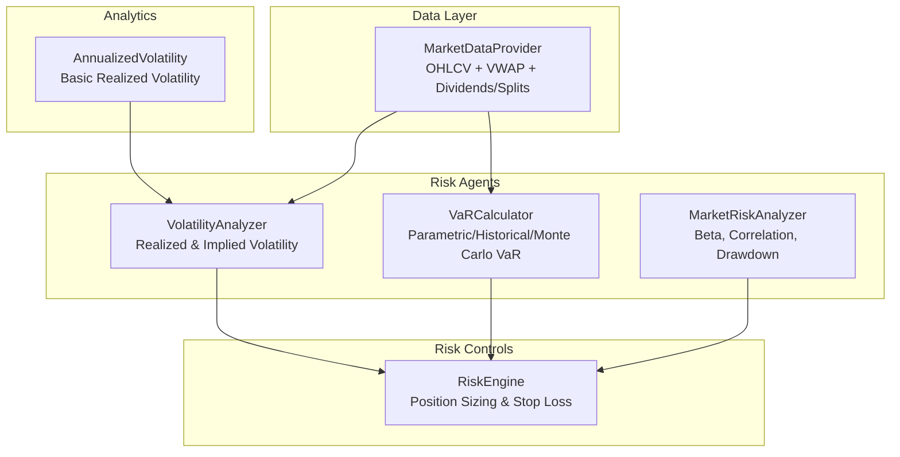
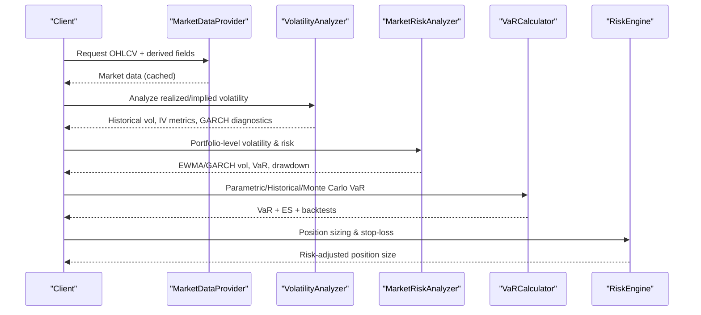
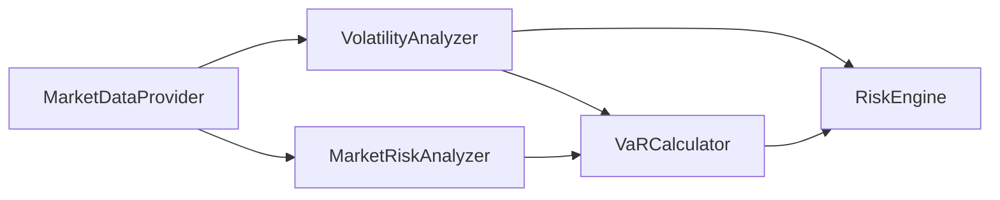

# Volatility Analysis and Estimation

<cite>
**Referenced Files in This Document**
- [volatility.py](file://FinAgents/agent_pools/risk_agent_pool/agents/volatility.py)
- [var_calculator.py](file://FinAgents/agent_pools/risk_agent_pool/agents/var_calculator.py)
- [market_risk.py](file://FinAgents/agent_pools/risk_agent_pool/agents/market_risk.py)
- [risk_engine.py](file://backend/risk/risk_engine.py)
- [market_data.py](file://FinAgents/agent_pools/data_agent_pool/agents/equity/market_data.py)
- [volatility.py](file://backend/analytics/volatility.py)
</cite>

## Table of Contents
1. [Introduction](#introduction)
2. [Project Structure](#project-structure)
3. [Core Components](#core-components)
4. [Architecture Overview](#architecture-overview)
5. [Detailed Component Analysis](#detailed-component-analysis)
6. [Dependency Analysis](#dependency-analysis)
7. [Performance Considerations](#performance-considerations)
8. [Troubleshooting Guide](#troubleshooting-guide)
9. [Conclusion](#conclusion)

## Introduction
This document presents a comprehensive guide to volatility estimation and analysis techniques implemented in the agentic trading application. It covers realized volatility computation from high-frequency returns and tick data, implied volatility extraction from option pricing models, GARCH-family models (GARCH, EGARCH, GJR-GARCH), stochastic volatility modeling, volatility forecasting methods, volatility surface construction, term structure analysis, and volatility targeting strategies. Practical applications for risk management and portfolio optimization are included alongside implementation examples, parameter estimation techniques, model validation methods, and guidance for integrating real market data.

## Project Structure
The volatility analysis capability is distributed across specialized agents and supporting modules:
- Risk agents: dedicated volatility analysis, VaR calculation, and market risk analysis
- Risk engine: position sizing and risk controls using volatility estimates
- Data provider: market data retrieval for high-frequency returns and tick data
- Analytics: basic realized volatility computation

**Diagram sources**
- [volatility.py:1-714](file://FinAgents/agent_pools/risk_agent_pool/agents/volatility.py#L1-L714)
- [var_calculator.py:1-797](file://FinAgents/agent_pools/risk_agent_pool/agents/var_calculator.py#L1-L797)
- [market_risk.py:1-882](file://FinAgents/agent_pools/risk_agent_pool/agents/market_risk.py#L1-L882)
- [risk_engine.py:1-226](file://backend/risk/risk_engine.py#L1-L226)
- [market_data.py:1-183](file://FinAgents/agent_pools/data_agent_pool/agents/equity/market_data.py#L1-L183)
- [volatility.py:1-28](file://backend/analytics/volatility.py#L1-L28)

**Section sources**
- [volatility.py:1-714](file://FinAgents/agent_pools/risk_agent_pool/agents/volatility.py#L1-L714)
- [var_calculator.py:1-797](file://FinAgents/agent_pools/risk_agent_pool/agents/var_calculator.py#L1-L797)
- [market_risk.py:1-882](file://FinAgents/agent_pools/risk_agent_pool/agents/market_risk.py#L1-L882)
- [risk_engine.py:1-226](file://backend/risk/risk_engine.py#L1-L226)
- [market_data.py:1-183](file://FinAgents/agent_pools/data_agent_pool/agents/equity/market_data.py#L1-L183)
- [volatility.py:1-28](file://backend/analytics/volatility.py#L1-L28)

## Core Components
- VolatilityAnalyzer: computes historical realized volatility (including Parkinson and Rogers-Satchell approximations), implied volatility metrics and surfaces, volatility clustering diagnostics, and GARCH-based analysis and forecasts.
- VaRCalculator: calculates parametric (normal, Student’s t, Cornish–Fisher), historical, and Monte Carlo VaR, including Expected Shortfall and backtesting.
- MarketRiskAnalyzer: portfolio-level volatility metrics, EWMA and GARCH volatility, volatility forecasting, beta and correlation analysis, and drawdown metrics.
- RiskEngine: position sizing and stop-loss calculation using volatility targets and risk-adjusted sizing.
- MarketDataProvider: retrieves OHLCV, VWAP, trade counts, pre/post-market prices, dividends, and splits for high-frequency analysis.
- AnnualizedVolatility: basic realized volatility from returns.

**Section sources**
- [volatility.py:1-714](file://FinAgents/agent_pools/risk_agent_pool/agents/volatility.py#L1-L714)
- [var_calculator.py:1-797](file://FinAgents/agent_pools/risk_agent_pool/agents/var_calculator.py#L1-L797)
- [market_risk.py:1-882](file://FinAgents/agent_pools/risk_agent_pool/agents/market_risk.py#L1-L882)
- [risk_engine.py:1-226](file://backend/risk/risk_engine.py#L1-L226)
- [market_data.py:1-183](file://FinAgents/agent_pools/data_agent_pool/agents/equity/market_data.py#L1-L183)
- [volatility.py:1-28](file://backend/analytics/volatility.py#L1-L28)

## Architecture Overview
The volatility pipeline integrates data ingestion, volatility estimation, risk control, and reporting:
- MarketDataProvider supplies OHLCV and derived fields for realized volatility and tick-level features.
- VolatilityAnalyzer and MarketRiskAnalyzer compute realized and implied volatility, diagnostics, and forecasts.
- VaRCalculator leverages volatility estimates for parametric and simulation-based risk measures.
- RiskEngine applies volatility-based position sizing and stop-loss logic.
- Outputs are structured for downstream risk dashboards and portfolio optimization.

**Diagram sources**
- [market_data.py:1-183](file://FinAgents/agent_pools/data_agent_pool/agents/equity/market_data.py#L1-L183)
- [volatility.py:1-714](file://FinAgents/agent_pools/risk_agent_pool/agents/volatility.py#L1-L714)
- [market_risk.py:1-882](file://FinAgents/agent_pools/risk_agent_pool/agents/market_risk.py#L1-L882)
- [var_calculator.py:1-797](file://FinAgents/agent_pools/risk_agent_pool/agents/var_calculator.py#L1-L797)
- [risk_engine.py:1-226](file://backend/risk/risk_engine.py#L1-L226)

## Detailed Component Analysis

### Realized Volatility from High-Frequency Returns and Tick Data
- Historical realized volatility: standard deviation of returns scaled to annualized terms for multiple windows.
- Alternative estimators: Parkinson and Rogers–Satchell approximations using high-low ratios.
- Rolling volatility statistics: mean, volatility of volatility, min/max, and percentile ranking.
- Implementation references:
  - [Historical volatility and estimators:121-167](file://FinAgents/agent_pools/risk_agent_pool/agents/volatility.py#L121-L167)
  - [Rolling statistics:152-167](file://FinAgents/agent_pools/risk_agent_pool/agents/volatility.py#L152-L167)
  - [Basic annualized volatility:9-28](file://backend/analytics/volatility.py#L9-L28)

**Section sources**
- [volatility.py:121-167](file://FinAgents/agent_pools/risk_agent_pool/agents/volatility.py#L121-L167)
- [volatility.py:9-28](file://backend/analytics/volatility.py#L9-L28)

### Implied Volatility Extraction and Surface Construction
- Simulated implied volatility term structure and volatility surface across time-to-expiry and moneyness.
- Skew metrics: put–call skew, skew slope, smile curvature, and term structure slope.
- Risk premium: difference between implied and historical volatility.
- Implementation references:
  - [Implied volatility metrics and surface:169-212](file://FinAgents/agent_pools/risk_agent_pool/agents/volatility.py#L169-L212)

**Section sources**
- [volatility.py:169-212](file://FinAgents/agent_pools/risk_agent_pool/agents/volatility.py#L169-L212)

### GARCH Family Models (GARCH, EGARCH, GJR-GARCH)
- GARCH(1,1) estimation: unconditional variance, persistence, half-life, log-likelihood, AIC/BIC.
- Diagnostics: Ljung–Box on residuals and squared residuals, Jarque–Bera normality test.
- Multi-step volatility forecasts with convergence bands.
- Notes on extensions: EGARCH and GJR-GARCH can be implemented by modifying variance dynamics and adding asymmetry parameters.
- Implementation references:
  - [GARCH estimation and diagnostics:529-651](file://FinAgents/agent_pools/risk_agent_pool/agents/volatility.py#L529-L651)
  - [GARCH volatility forecast:686-713](file://FinAgents/agent_pools/risk_agent_pool/agents/volatility.py#L686-L713)

**Section sources**
- [volatility.py:529-651](file://FinAgents/agent_pools/risk_agent_pool/agents/volatility.py#L529-L651)
- [volatility.py:686-713](file://FinAgents/agent_pools/risk_agent_pool/agents/volatility.py#L686-L713)

### Stochastic Volatility Models and Numerical Implementations
- Filtered Historical Simulation (FHS): fit GARCH to extract standardized residuals and simulate future volatilities; combine residuals with projected volatilities to generate scenarios.
- Monte Carlo VaR: normal and Student’s t simulations; FHS with GARCH-filtered residuals.
- Implementation references:
  - [FHS residual and volatility simulation:358-396](file://FinAgents/agent_pools/risk_agent_pool/agents/var_calculator.py#L358-L396)
  - [Monte Carlo VaR with FHS:287-356](file://FinAgents/agent_pools/risk_agent_pool/agents/var_calculator.py#L287-L356)

**Section sources**
- [var_calculator.py:358-396](file://FinAgents/agent_pools/risk_agent_pool/agents/var_calculator.py#L358-L396)
- [var_calculator.py:287-356](file://FinAgents/agent_pools/risk_agent_pool/agents/var_calculator.py#L287-L356)

### Volatility Forecasting Methods
- Multiple-model ensemble: moving average, exponential smoothing, mean reversion, and GARCH forecasts.
- Confidence intervals and regime classification (low, normal, high, extreme).
- Implementation references:
  - [Forecasting and regime classification:214-265](file://FinAgents/agent_pools/risk_agent_pool/agents/volatility.py#L214-L265)
  - [Regime forecast:289-325](file://FinAgents/agent_pools/risk_agent_pool/agents/volatility.py#L289-L325)

**Section sources**
- [volatility.py:214-265](file://FinAgents/agent_pools/risk_agent_pool/agents/volatility.py#L214-L265)
- [volatility.py:289-325](file://FinAgents/agent_pools/risk_agent_pool/agents/volatility.py#L289-L325)

### Volatility Clustering Detection and Persistence
- ARCH LM test for autoregressive conditional heteroskedasticity.
- Volatility persistence via autocorrelation of squared returns and exponential decay fit.
- Hurst exponent for long-range dependence.
- Implementation references:
  - [Clustering analysis and diagnostics:327-380](file://FinAgents/agent_pools/risk_agent_pool/agents/volatility.py#L327-L380)
  - [ARCH LM test:382-416](file://FinAgents/agent_pools/risk_agent_pool/agents/volatility.py#L382-L416)
  - [Persistence decay and Hurst:461-527](file://FinAgents/agent_pools/risk_agent_pool/agents/volatility.py#L461-L527)

**Section sources**
- [volatility.py:327-380](file://FinAgents/agent_pools/risk_agent_pool/agents/volatility.py#L327-L380)
- [volatility.py:382-416](file://FinAgents/agent_pools/risk_agent_pool/agents/volatility.py#L382-L416)
- [volatility.py:461-527](file://FinAgents/agent_pools/risk_agent_pool/agents/volatility.py#L461-L527)

### Volatility Surfaces, Term Structure, and Skew Metrics
- ATM implied volatility term structure across maturities.
- Volatility surface indexed by time-to-expiry and moneyness.
- Skew and smile metrics for model calibration and risk management.
- Implementation references:
  - [IV term structure and surface:169-212](file://FinAgents/agent_pools/risk_agent_pool/agents/volatility.py#L169-L212)

**Section sources**
- [volatility.py:169-212](file://FinAgents/agent_pools/risk_agent_pool/agents/volatility.py#L169-L212)

### Volatility Targeting Strategies and Risk Controls
- RiskEngine position sizing adjusts by volatility relative to a target (e.g., 15% annualized).
- Stop-loss calculation based on volatility and predefined thresholds.
- Implementation references:
  - [Position sizing with volatility adjustment:150-186](file://backend/risk/risk_engine.py#L150-L186)
  - [Stop-loss calculation:128-148](file://backend/risk/risk_engine.py#L128-L148)

**Section sources**
- [risk_engine.py:150-186](file://backend/risk/risk_engine.py#L150-L186)
- [risk_engine.py:128-148](file://backend/risk/risk_engine.py#L128-L148)

### Practical Applications in Risk Management and Portfolio Optimization
- VaR backtesting: Kupiec proportion of failures, independence, and conditional coverage tests.
- Expected Shortfall (CVaR) under parametric, historical, and Student’s t assumptions.
- Component and marginal VaR attribution for risk decomposition.
- Implementation references:
  - [Backtesting and loss functions:444-645](file://FinAgents/agent_pools/risk_agent_pool/agents/var_calculator.py#L444-L645)
  - [Expected Shortfall:398-442](file://FinAgents/agent_pools/risk_agent_pool/agents/var_calculator.py#L398-L442)
  - [Component and marginal VaR:667-779](file://FinAgents/agent_pools/risk_agent_pool/agents/var_calculator.py#L667-L779)

**Section sources**
- [var_calculator.py:444-645](file://FinAgents/agent_pools/risk_agent_pool/agents/var_calculator.py#L444-L645)
- [var_calculator.py:398-442](file://FinAgents/agent_pools/risk_agent_pool/agents/var_calculator.py#L398-L442)
- [var_calculator.py:667-779](file://FinAgents/agent_pools/risk_agent_pool/agents/var_calculator.py#L667-L779)

## Dependency Analysis
Key dependencies and interactions:
- VolatilityAnalyzer depends on returns/tick data from MarketDataProvider and uses NumPy/SciPy for statistical computations.
- VaRCalculator builds on volatility estimates and uses Monte Carlo sampling and GARCH filtering.
- MarketRiskAnalyzer provides portfolio-level volatility and supports VaR calculation.
- RiskEngine consumes volatility outputs for position sizing and stop-loss enforcement.

**Diagram sources**
- [market_data.py:1-183](file://FinAgents/agent_pools/data_agent_pool/agents/equity/market_data.py#L1-L183)
- [volatility.py:1-714](file://FinAgents/agent_pools/risk_agent_pool/agents/volatility.py#L1-L714)
- [market_risk.py:1-882](file://FinAgents/agent_pools/risk_agent_pool/agents/market_risk.py#L1-L882)
- [var_calculator.py:1-797](file://FinAgents/agent_pools/risk_agent_pool/agents/var_calculator.py#L1-L797)
- [risk_engine.py:1-226](file://backend/risk/risk_engine.py#L1-L226)

**Section sources**
- [volatility.py:1-714](file://FinAgents/agent_pools/risk_agent_pool/agents/volatility.py#L1-L714)
- [var_calculator.py:1-797](file://FinAgents/agent_pools/risk_agent_pool/agents/var_calculator.py#L1-L797)
- [market_risk.py:1-882](file://FinAgents/agent_pools/risk_agent_pool/agents/market_risk.py#L1-L882)
- [risk_engine.py:1-226](file://backend/risk/risk_engine.py#L1-L226)
- [market_data.py:1-183](file://FinAgents/agent_pools/data_agent_pool/agents/equity/market_data.py#L1-L183)

## Performance Considerations
- Data caching: MarketDataProvider caches OHLCV and derived fields to reduce API calls.
- Vectorized computations: NumPy-based volatility and diagnostics improve throughput.
- Monte Carlo scaling: Adjust simulation counts based on acceptable precision and latency budgets.
- Real-time constraints: Use rolling windows and incremental updates for online volatility and VaR.

[No sources needed since this section provides general guidance]

## Troubleshooting Guide
Common issues and resolutions:
- Insufficient data for volatility or VaR: ensure minimum lookback periods are met; the agents return explicit errors when data is inadequate.
- Non-positive variance or invalid returns: realized volatility functions guard against zero/negative variance.
- GARCH diagnostics failures: check parameter constraints and stationarity conditions; consider alternative specifications.
- Backtesting anomalies: verify confidence levels and test windows; ensure sufficient violations for reliable inference.

**Section sources**
- [volatility.py:216-217](file://FinAgents/agent_pools/risk_agent_pool/agents/volatility.py#L216-L217)
- [volatility.py:531-532](file://FinAgents/agent_pools/risk_agent_pool/agents/volatility.py#L531-L532)
- [var_calculator.py:454-455](file://FinAgents/agent_pools/risk_agent_pool/agents/var_calculator.py#L454-L455)
- [volatility.py:20-27](file://backend/analytics/volatility.py#L20-L27)

## Conclusion
The system provides a robust, modular framework for volatility analysis and risk control. It combines realized and implied volatility measures, GARCH diagnostics and forecasts, stochastic volatility via FHS, and volatility-targeted risk controls. These capabilities support comprehensive risk management and portfolio optimization workflows, with clear pathways for extending to EGARCH/GJR-GARCH and integrating real-time market data.