# System Overview

<cite>
**Referenced Files in This Document**
- [README.md](file://README.md)
- [main_orchestrator.py](file://FinAgents/orchestrator/main_orchestrator.py)
- [finagent_orchestrator.py](file://FinAgents/orchestrator/core/finagent_orchestrator.py)
- [dag_planner.py](file://FinAgents/orchestrator/core/dag_planner.py)
- [memory_server.py](file://FinAgents/memory/memory_server.py)
- [momentum_agent.py](file://FinAgents/agent_pools/alpha_agent_pool/agents/theory_driven/momentum_agent.py)
- [market_risk.py](file://FinAgents/agent_pools/risk_agent_pool/agents/market_risk.py)
- [alpaca_agent.py](file://FinAgents/agent_pools/data_agent_pool/agents/equity/alpaca_agent.py)
- [signals.py](file://backend/routes/signals.py)
- [ws_signals.py](file://backend/routes/ws_signals.py)
- [main.py](file://backend/api/main.py)
- [trade.py](file://backend/db/models/trade.py)
</cite>

## Table of Contents
1. [Introduction](#introduction)
2. [Project Structure](#project-structure)
3. [Core Components](#core-components)
4. [Architecture Overview](#architecture-overview)
5. [Detailed Component Analysis](#detailed-component-analysis)
6. [Dependency Analysis](#dependency-analysis)
7. [Performance Considerations](#performance-considerations)
8. [Troubleshooting Guide](#troubleshooting-guide)
9. [Conclusion](#conclusion)

## Introduction
This document presents a comprehensive system overview of the Agentic Trading Application, a production-grade multi-agent trading platform that replaces traditional algorithmic trading pipelines with intelligent collaborating agents. The platform emphasizes adaptability, cross-module learning, and continuous improvement through memory and analytics.

Key characteristics:
- Multi-agent paradigm: Each stage of the trading pipeline is implemented as an intelligent agent.
- Central orchestrator: Coordinates agents, manages workflows, and integrates memory and analytics.
- Three-layer architecture: Agent Layer (intelligent trading agents), Orchestration Layer (workflow coordination and management), and API & Infrastructure Layer (REST APIs, WebSocket streaming, databases).
- Extensibility: Modular agent pools, unified memory, and standardized MCP interfaces enable easy extension and experimentation.

Benefits over traditional trading systems:
- Adaptability: Agents can learn and adapt across modules, unlike fixed pipelines.
- Cross-module collaboration: Agents communicate and coordinate via the orchestrator and memory.
- Continuous learning: Memory and analytics feed back into strategy refinement and risk management.
- Scalability: Distributed agent pools and asynchronous execution support horizontal scaling.

**Section sources**
- [README.md:33-104](file://README.md#L33-L104)

## Project Structure
The repository organizes functionality into three primary areas:
- FinAgents: Multi-agent orchestration, agent pools, and memory subsystem.
- backend: REST API, WebSocket endpoints, database models, and services.
- frontend: React-based trading dashboard (referenced in the repository).

High-level structure highlights:
- Orchestrator entry point and orchestration core manage agent pools, DAG planning, and backtesting.
- Agent pools implement specialized roles: alpha generation, risk management, execution, and data.
- Memory subsystem provides persistent, searchable memory with unified and legacy modes.
- Backend exposes REST and WebSocket endpoints for signals, pricing, portfolio, and health checks.
- Database models define trade and portfolio entities for persistence.

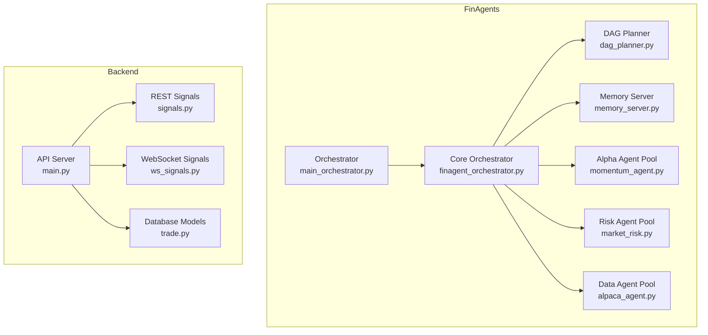

**Diagram sources**
- [main_orchestrator.py:1-475](file://FinAgents/orchestrator/main_orchestrator.py#L1-L475)
- [finagent_orchestrator.py:106-224](file://FinAgents/orchestrator/core/finagent_orchestrator.py#L106-L224)
- [dag_planner.py:189-200](file://FinAgents/orchestrator/core/dag_planner.py#L189-L200)
- [memory_server.py:209-214](file://FinAgents/memory/memory_server.py#L209-L214)
- [momentum_agent.py:353-406](file://FinAgents/agent_pools/alpha_agent_pool/agents/theory_driven/momentum_agent.py#L353-L406)
- [market_risk.py:29-51](file://FinAgents/agent_pools/risk_agent_pool/agents/market_risk.py#L29-L51)
- [alpaca_agent.py:4-19](file://FinAgents/agent_pools/data_agent_pool/agents/equity/alpaca_agent.py#L4-L19)
- [main.py:111-148](file://backend/api/main.py#L111-L148)
- [signals.py:62-68](file://backend/routes/signals.py#L62-L68)
- [ws_signals.py:22-141](file://backend/routes/ws_signals.py#L22-L141)
- [trade.py:6-20](file://backend/db/models/trade.py#L6-L20)

**Section sources**
- [README.md:252-278](file://README.md#L252-L278)

## Core Components
This section outlines the core building blocks of the system and their responsibilities.

- Orchestrator Application
  - Initializes and runs the orchestration system in development, production, or sandbox modes.
  - Registers agent pools, initializes optional RL engine, and demonstrates workflows.
  - Provides lifecycle management and graceful shutdown.

- Core Orchestrator
  - Central coordination hub for agent pools, DAG planning, memory integration, and backtesting.
  - Exposes MCP tools for strategy execution, backtesting, and status reporting.
  - Manages execution contexts, metrics, and memory event logging.

- DAG Planner
  - Creates and executes Directed Acyclic Graphs (DAGs) representing trading workflows.
  - Supports dynamic strategy decomposition and multi-agent coordination.

- Memory Server
  - Unified memory storage and retrieval with MCP tools.
  - Supports batch storage, filtering, semantic search, and statistics.
  - Provides reactive stream processing and intelligent indexing when available.

- Agent Pools
  - Alpha Agent Pool: Generates signals (e.g., momentum) with LLM integration and RL-style learning.
  - Risk Agent Pool: Performs market risk analysis (volatility, VaR, drawdown, correlation).
  - Data Agent Pool: Provides market data retrieval (e.g., Alpaca integration).

- Backend API and Endpoints
  - REST API server with CORS middleware and route registration.
  - WebSocket endpoints for live price and signal streaming.
  - Database models for trades and portfolio tracking.

**Section sources**
- [main_orchestrator.py:50-437](file://FinAgents/orchestrator/main_orchestrator.py#L50-L437)
- [finagent_orchestrator.py:106-224](file://FinAgents/orchestrator/core/finagent_orchestrator.py#L106-L224)
- [dag_planner.py:189-200](file://FinAgents/orchestrator/core/dag_planner.py#L189-L200)
- [memory_server.py:209-214](file://FinAgents/memory/memory_server.py#L209-L214)
- [momentum_agent.py:353-406](file://FinAgents/agent_pools/alpha_agent_pool/agents/theory_driven/momentum_agent.py#L353-L406)
- [market_risk.py:29-51](file://FinAgents/agent_pools/risk_agent_pool/agents/market_risk.py#L29-L51)
- [alpaca_agent.py:4-19](file://FinAgents/agent_pools/data_agent_pool/agents/equity/alpaca_agent.py#L4-L19)
- [main.py:111-148](file://backend/api/main.py#L111-L148)
- [signals.py:62-68](file://backend/routes/signals.py#L62-L68)
- [ws_signals.py:22-141](file://backend/routes/ws_signals.py#L22-L141)
- [trade.py:6-20](file://backend/db/models/trade.py#L6-L20)

## Architecture Overview
The system follows a three-layer architecture:

- Agent Layer
  - Responsible for specialized intelligence: signal generation, risk management, execution, and data retrieval.
  - Agents communicate via MCP and are orchestrated centrally.

- Orchestration Layer
  - Manages workflow execution, strategy planning, and resource coordination.
  - Integrates memory and analytics for continuous learning.

- API & Infrastructure Layer
  - REST APIs and WebSocket endpoints expose signals, pricing, and portfolio data.
  - PostgreSQL and Redis support persistence and caching; Docker enables containerized deployment.

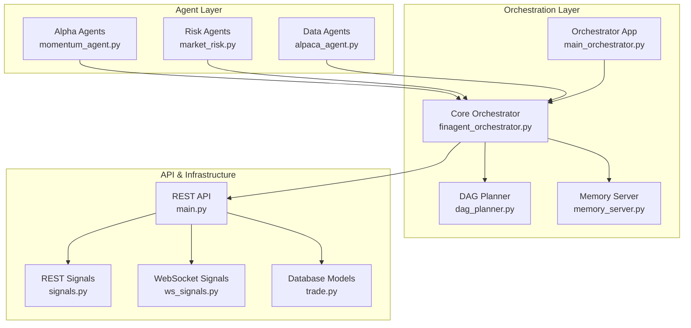

**Diagram sources**
- [main_orchestrator.py:1-475](file://FinAgents/orchestrator/main_orchestrator.py#L1-L475)
- [finagent_orchestrator.py:106-224](file://FinAgents/orchestrator/core/finagent_orchestrator.py#L106-L224)
- [dag_planner.py:189-200](file://FinAgents/orchestrator/core/dag_planner.py#L189-L200)
- [memory_server.py:209-214](file://FinAgents/memory/memory_server.py#L209-L214)
- [momentum_agent.py:353-406](file://FinAgents/agent_pools/alpha_agent_pool/agents/theory_driven/momentum_agent.py#L353-L406)
- [market_risk.py:29-51](file://FinAgents/agent_pools/risk_agent_pool/agents/market_risk.py#L29-L51)
- [alpaca_agent.py:4-19](file://FinAgents/agent_pools/data_agent_pool/agents/equity/alpaca_agent.py#L4-L19)
- [main.py:111-148](file://backend/api/main.py#L111-L148)
- [signals.py:62-68](file://backend/routes/signals.py#L62-L68)
- [ws_signals.py:22-141](file://backend/routes/ws_signals.py#L22-L141)
- [trade.py:6-20](file://backend/db/models/trade.py#L6-L20)

## Detailed Component Analysis

### Orchestrator Application
The Orchestrator Application serves as the entry point for the FinAgent system. It initializes the orchestrator, registers agent pools, optionally starts a sandbox environment, and supports multiple operating modes (development, production, sandbox). It also demonstrates workflows and provides monitoring loops for production.

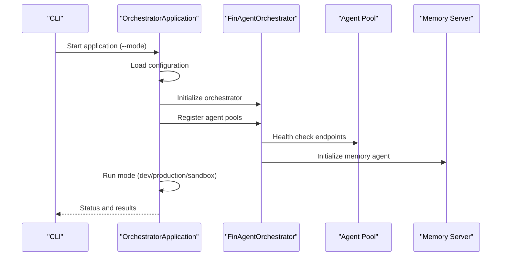

**Diagram sources**
- [main_orchestrator.py:417-437](file://FinAgents/orchestrator/main_orchestrator.py#L417-L437)
- [finagent_orchestrator.py:201-224](file://FinAgents/orchestrator/core/finagent_orchestrator.py#L201-L224)

**Section sources**
- [main_orchestrator.py:50-437](file://FinAgents/orchestrator/main_orchestrator.py#L50-L437)

### Core Orchestrator
The Core Orchestrator coordinates agent pools, manages execution contexts, and integrates memory and analytics. It exposes MCP tools for strategy execution, backtesting, and status reporting. It maintains metrics, tracks active and completed executions, and logs memory events for attribution and learning.

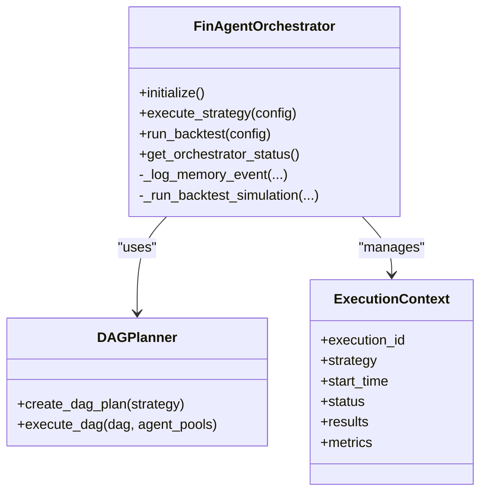

**Diagram sources**
- [finagent_orchestrator.py:106-224](file://FinAgents/orchestrator/core/finagent_orchestrator.py#L106-L224)
- [dag_planner.py:189-200](file://FinAgents/orchestrator/core/dag_planner.py#L189-L200)

**Section sources**
- [finagent_orchestrator.py:106-224](file://FinAgents/orchestrator/core/finagent_orchestrator.py#L106-L224)

### DAG Planner
The DAG Planner constructs and executes task graphs for trading strategies. It defines task nodes, statuses, and dependencies, enabling coordinated execution across agent pools. It leverages LLM-enhanced natural language processing for dynamic strategy decomposition.

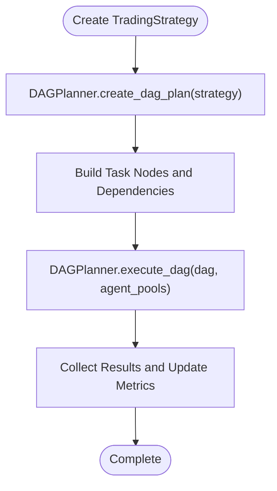

**Diagram sources**
- [dag_planner.py:189-200](file://FinAgents/orchestrator/core/dag_planner.py#L189-L200)

**Section sources**
- [dag_planner.py:189-200](file://FinAgents/orchestrator/core/dag_planner.py#L189-L200)

### Memory Server
The Memory Server provides unified memory operations via MCP tools. It supports storing and retrieving memories, filtering, statistics, semantic search, and trending keyword extraction. It can operate in unified or legacy modes and integrates reactive stream processing when available.

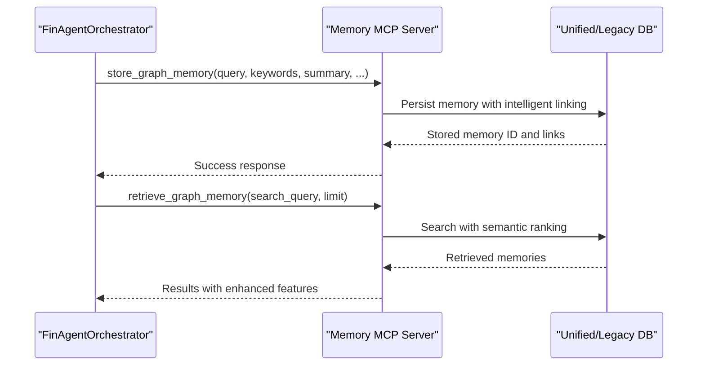

**Diagram sources**
- [memory_server.py:220-270](file://FinAgents/memory/memory_server.py#L220-L270)
- [memory_server.py:364-419](file://FinAgents/memory/memory_server.py#L364-L419)

**Section sources**
- [memory_server.py:209-214](file://FinAgents/memory/memory_server.py#L209-L214)

### Alpha Agent (Momentum)
The Momentum Agent generates signals using multi-timeframe analysis, optionally integrates LLM insights, and learns from backtests. It stores performance feedback and adapts strategy parameters (e.g., momentum window) using RL-style updates.

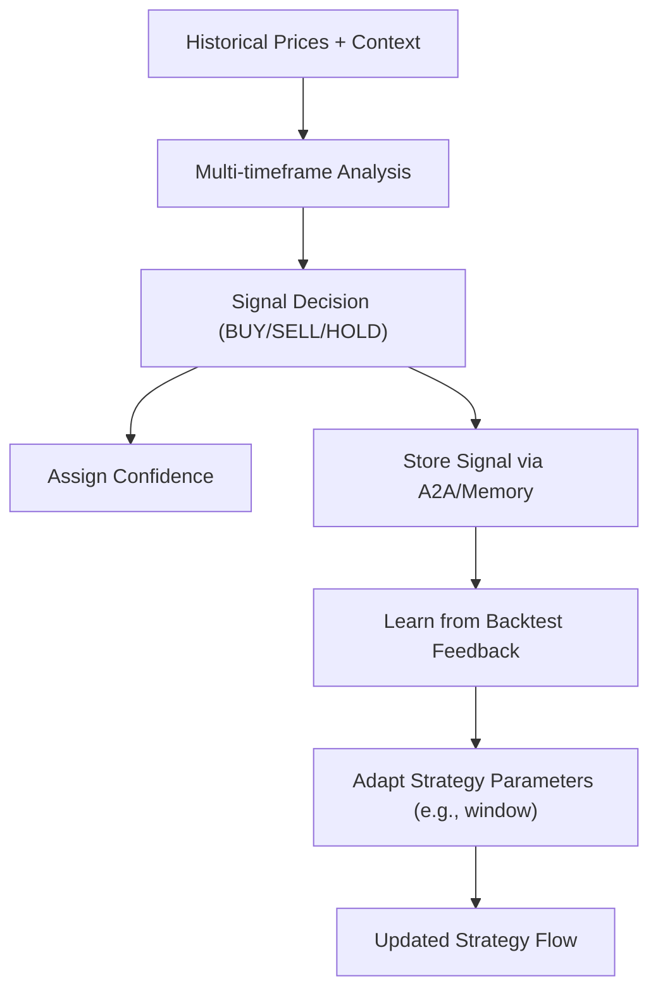

**Diagram sources**
- [momentum_agent.py:656-717](file://FinAgents/agent_pools/alpha_agent_pool/agents/theory_driven/momentum_agent.py#L656-L717)
- [momentum_agent.py:472-599](file://FinAgents/agent_pools/alpha_agent_pool/agents/theory_driven/momentum_agent.py#L472-L599)

**Section sources**
- [momentum_agent.py:353-406](file://FinAgents/agent_pools/alpha_agent_pool/agents/theory_driven/momentum_agent.py#L353-L406)

### Risk Agent (Market Risk)
The Market Risk Analyzer computes volatility, VaR, beta, correlation, and drawdown metrics. It supports stress testing and VaR backtesting, and can attribute risk contributions per asset.

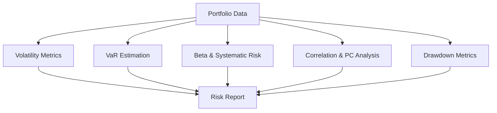

**Diagram sources**
- [market_risk.py:51-142](file://FinAgents/agent_pools/risk_agent_pool/agents/market_risk.py#L51-L142)

**Section sources**
- [market_risk.py:29-51](file://FinAgents/agent_pools/risk_agent_pool/agents/market_risk.py#L29-L51)

### Data Agent (Alpaca)
The Alpaca Agent provides mock implementations for fetching equity quotes and data. In a production setup, this would integrate with real market data providers.

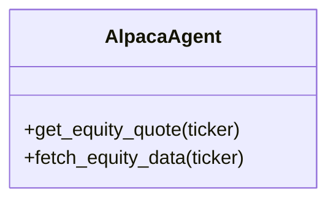

**Diagram sources**
- [alpaca_agent.py:4-19](file://FinAgents/agent_pools/data_agent_pool/agents/equity/alpaca_agent.py#L4-L19)

**Section sources**
- [alpaca_agent.py:4-19](file://FinAgents/agent_pools/data_agent_pool/agents/equity/alpaca_agent.py#L4-L19)

### Backend API and Endpoints
The backend API server exposes REST endpoints for signals and WebSocket endpoints for live price and signal streaming. It initializes database tables and seeds demo users.

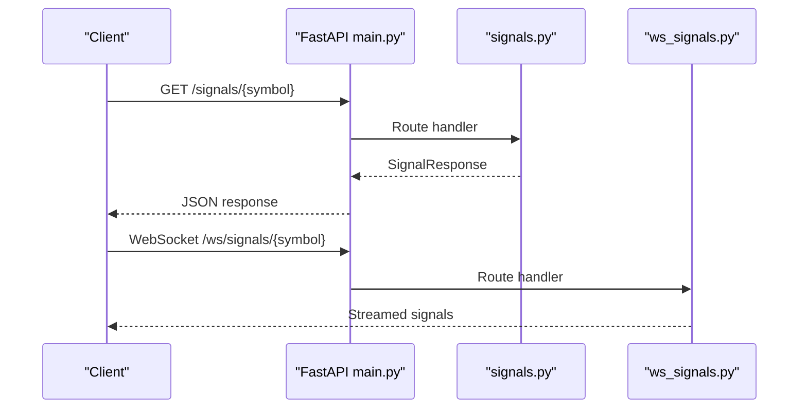

**Diagram sources**
- [main.py:111-148](file://backend/api/main.py#L111-L148)
- [signals.py:62-68](file://backend/routes/signals.py#L62-L68)
- [ws_signals.py:106-141](file://backend/routes/ws_signals.py#L106-L141)

**Section sources**
- [main.py:111-148](file://backend/api/main.py#L111-L148)
- [signals.py:62-68](file://backend/routes/signals.py#L62-L68)
- [ws_signals.py:22-141](file://backend/routes/ws_signals.py#L22-L141)

## Dependency Analysis
The system exhibits clear separation of concerns across layers and modules, with explicit dependencies:

- Orchestrator depends on DAG planner and memory server.
- Agent pools depend on MCP clients and schemas.
- Backend API depends on route handlers and database models.
- Memory server depends on unified or legacy database managers.

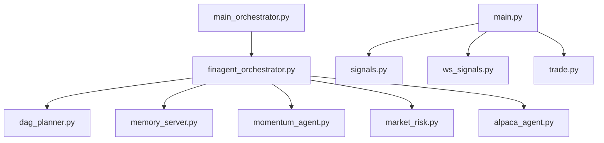

**Diagram sources**
- [main_orchestrator.py:1-475](file://FinAgents/orchestrator/main_orchestrator.py#L1-L475)
- [finagent_orchestrator.py:106-224](file://FinAgents/orchestrator/core/finagent_orchestrator.py#L106-L224)
- [dag_planner.py:189-200](file://FinAgents/orchestrator/core/dag_planner.py#L189-L200)
- [memory_server.py:209-214](file://FinAgents/memory/memory_server.py#L209-L214)
- [momentum_agent.py:353-406](file://FinAgents/agent_pools/alpha_agent_pool/agents/theory_driven/momentum_agent.py#L353-L406)
- [market_risk.py:29-51](file://FinAgents/agent_pools/risk_agent_pool/agents/market_risk.py#L29-L51)
- [alpaca_agent.py:4-19](file://FinAgents/agent_pools/data_agent_pool/agents/equity/alpaca_agent.py#L4-L19)
- [main.py:111-148](file://backend/api/main.py#L111-L148)
- [signals.py:62-68](file://backend/routes/signals.py#L62-L68)
- [ws_signals.py:22-141](file://backend/routes/ws_signals.py#L22-L141)
- [trade.py:6-20](file://backend/db/models/trade.py#L6-L20)

**Section sources**
- [main_orchestrator.py:1-475](file://FinAgents/orchestrator/main_orchestrator.py#L1-L475)
- [finagent_orchestrator.py:106-224](file://FinAgents/orchestrator/core/finagent_orchestrator.py#L106-L224)
- [dag_planner.py:189-200](file://FinAgents/orchestrator/core/dag_planner.py#L189-L200)
- [memory_server.py:209-214](file://FinAgents/memory/memory_server.py#L209-L214)
- [momentum_agent.py:353-406](file://FinAgents/agent_pools/alpha_agent_pool/agents/theory_driven/momentum_agent.py#L353-L406)
- [market_risk.py:29-51](file://FinAgents/agent_pools/risk_agent_pool/agents/market_risk.py#L29-L51)
- [alpaca_agent.py:4-19](file://FinAgents/agent_pools/data_agent_pool/agents/equity/alpaca_agent.py#L4-L19)
- [main.py:111-148](file://backend/api/main.py#L111-L148)
- [signals.py:62-68](file://backend/routes/signals.py#L62-L68)
- [ws_signals.py:22-141](file://backend/routes/ws_signals.py#L22-L141)
- [trade.py:6-20](file://backend/db/models/trade.py#L6-L20)

## Performance Considerations
- Asynchronous orchestration: The orchestrator uses asyncio and thread pools to manage concurrent tasks efficiently.
- DAG execution: Parallelizable tasks are scheduled via DAGs to minimize idle time.
- Memory integration: Unified memory operations reduce latency and improve context retrieval.
- Backtesting: The orchestrator simulates market data and performance metrics to evaluate strategies without live market exposure.
- Streaming endpoints: WebSocket endpoints provide low-latency updates for real-time dashboards.

[No sources needed since this section provides general guidance]

## Troubleshooting Guide
Common operational issues and resolutions:
- Agent pool connectivity: The orchestrator performs health checks on agent pool endpoints. Verify SSE endpoints and agent availability.
- Memory server initialization: The memory server supports unified and legacy modes. Ensure Neo4j connectivity and indexes are created.
- Database initialization: The API server creates tables and seeds demo users on startup. Confirm database credentials and permissions.
- WebSocket streaming: Ensure proper symbol mapping and fallback mechanisms when external data providers fail.

**Section sources**
- [finagent_orchestrator.py:273-287](file://FinAgents/orchestrator/core/finagent_orchestrator.py#L273-L287)
- [memory_server.py:82-204](file://FinAgents/memory/memory_server.py#L82-L204)
- [main.py:102-109](file://backend/api/main.py#L102-L109)
- [ws_signals.py:37-103](file://backend/routes/ws_signals.py#L37-L103)

## Conclusion
The Agentic Trading Application transforms traditional algorithmic trading into a dynamic, collaborative system powered by intelligent agents. The three-layer architecture—Agent Layer, Orchestration Layer, and API & Infrastructure Layer—enables adaptability, continuous learning, and scalable execution. Through MCP-based communication, DAG planning, and memory-backed analytics, the platform supports sophisticated trading strategies while maintaining operational simplicity and extensibility.

[No sources needed since this section summarizes without analyzing specific files]