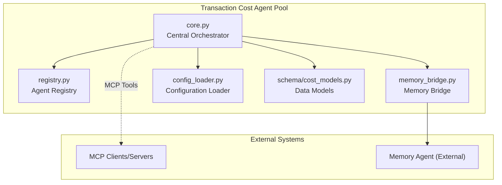
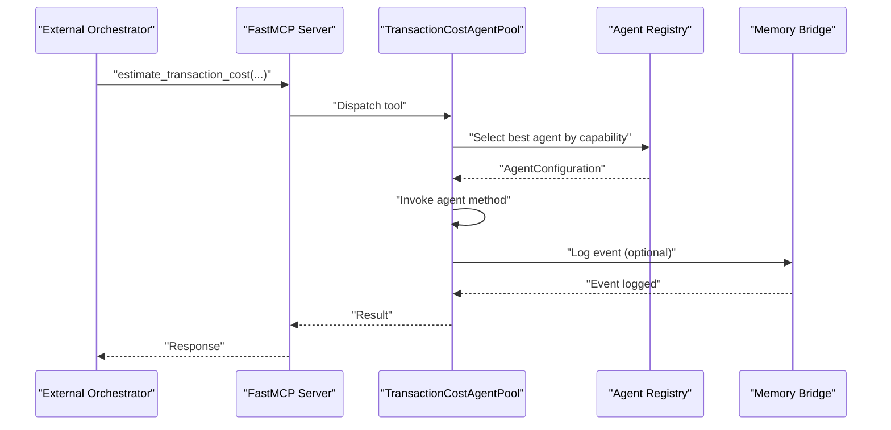
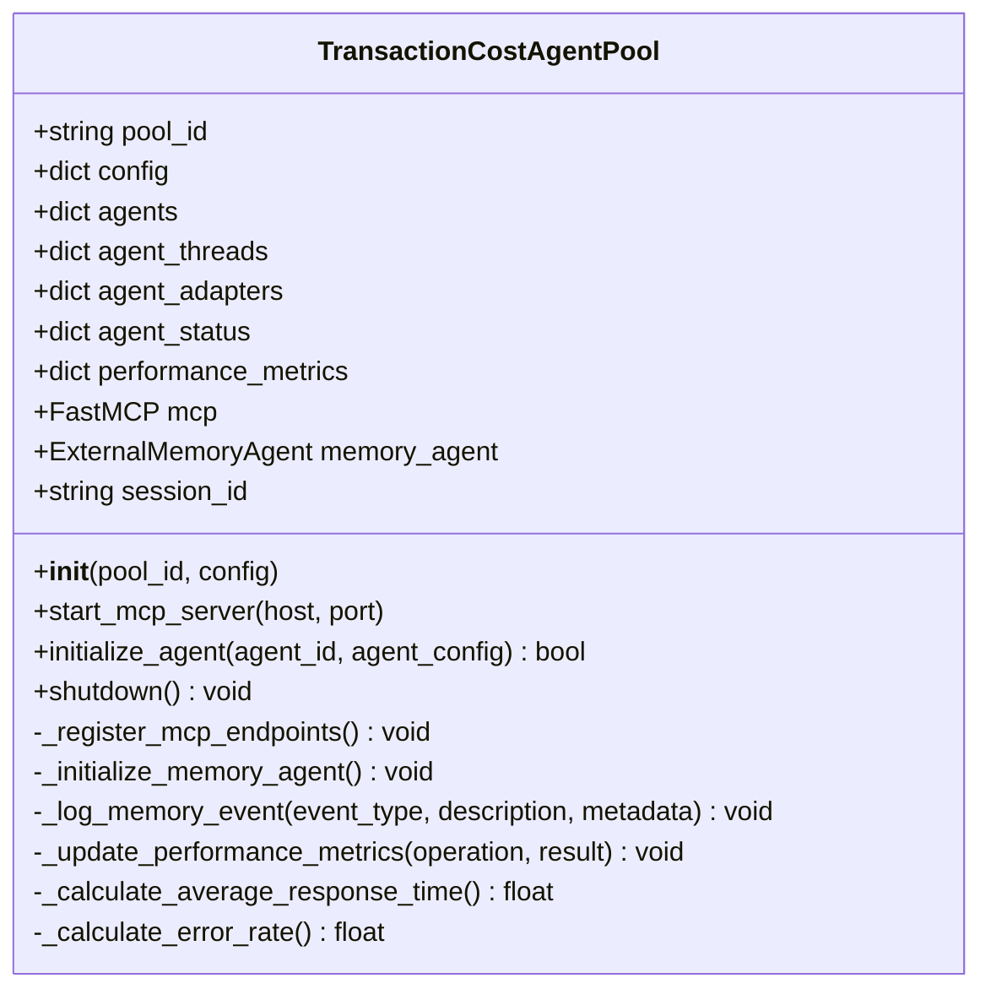
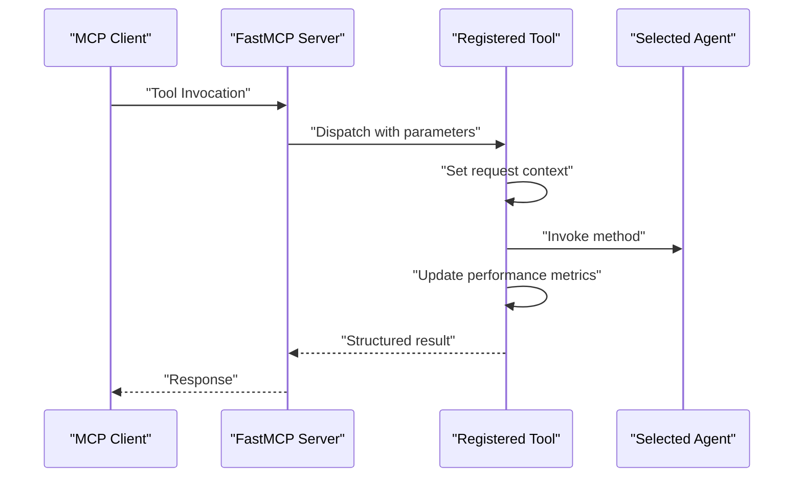
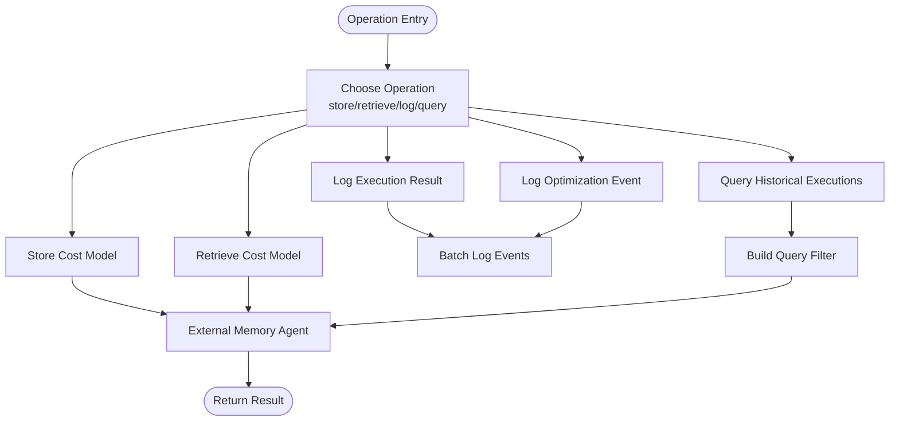
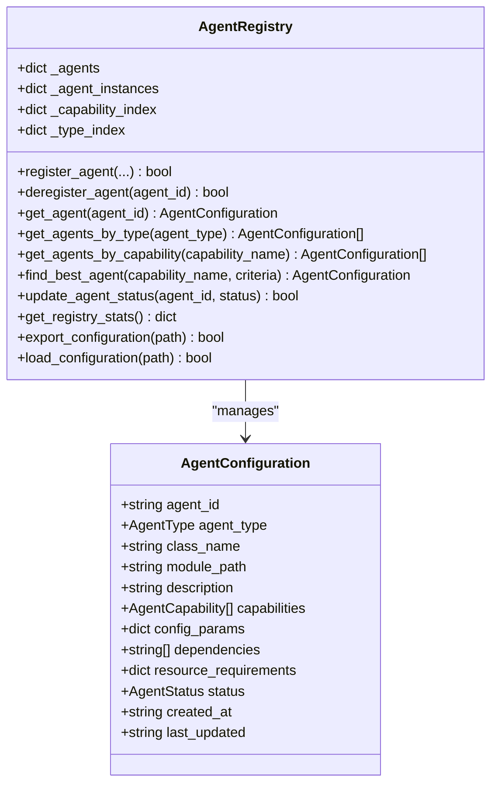
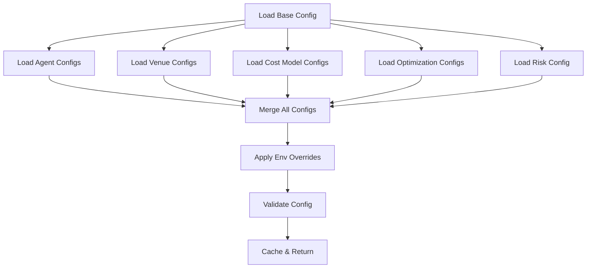
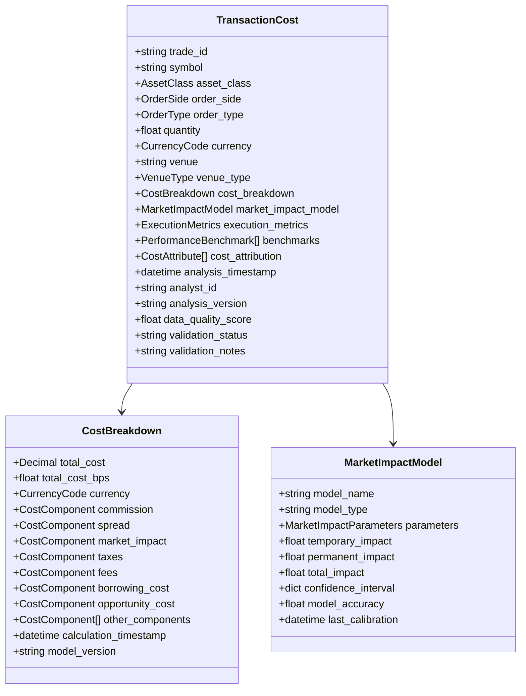
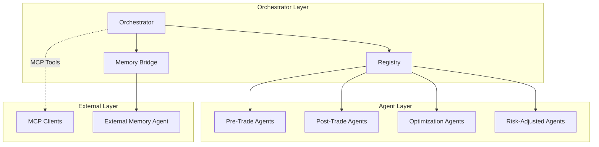
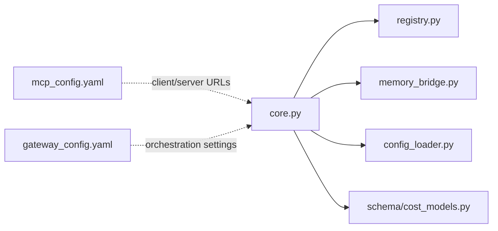

# Agent Coordination

<cite>
**Referenced Files in This Document**
- [core.py](file://FinAgents/agent_pools/transaction_cost_agent_pool/core.py)
- [memory_bridge.py](file://FinAgents/agent_pools/transaction_cost_agent_pool/memory_bridge.py)
- [registry.py](file://FinAgents/agent_pools/transaction_cost_agent_pool/registry.py)
- [config_loader.py](file://FinAgents/agent_pools/transaction_cost_agent_pool/config_loader.py)
- [cost_models.py](file://FinAgents/agent_pools/transaction_cost_agent_pool/schema/cost_models.py)
- [mcp_config.yaml](file://FinAgents/agent_pools/alpha_agent_pool/mcp_config.yaml)
- [gateway_config.yaml](file://FinAgents/agent_pools/alpha_agent_pool/gateway_config.yaml)
- [orchestrator.py](file://FinAgents/agent_pools/alpha_agent_pool/core/services/orchestrator.py)
</cite>

## Table of Contents
1. [Introduction](#introduction)
2. [Project Structure](#project-structure)
3. [Core Components](#core-components)
4. [Architecture Overview](#architecture-overview)
5. [Detailed Component Analysis](#detailed-component-analysis)
6. [Dependency Analysis](#dependency-analysis)
7. [Performance Considerations](#performance-considerations)
8. [Troubleshooting Guide](#troubleshooting-guide)
9. [Conclusion](#conclusion)
10. [Appendices](#appendices)

## Introduction
This document describes the agent coordination and orchestration system for transaction cost agents. It explains how the central orchestrator manages lifecycle, communication, and resource allocation across transaction cost agents, integrates the MCP protocol for inter-agent and external system communication, and coordinates persistent state via the memory bridge. It also documents registry patterns for dynamic agent discovery and load balancing, and provides configuration examples and fault tolerance strategies for multi-agent deployments.

## Project Structure
The transaction cost agent pool centers around a cohesive orchestration engine that exposes MCP tools, maintains agent registries, and integrates with a memory bridge for persistent state and cross-agent data sharing. Supporting modules define configuration schemas and data models for cost analysis.

**Diagram sources**
- [core.py:64-120](file://FinAgents/agent_pools/transaction_cost_agent_pool/core.py#L64-L120)
- [registry.py:96-120](file://FinAgents/agent_pools/transaction_cost_agent_pool/registry.py#L96-L120)
- [memory_bridge.py:94-145](file://FinAgents/agent_pools/transaction_cost_agent_pool/memory_bridge.py#L94-L145)
- [config_loader.py:112-187](file://FinAgents/agent_pools/transaction_cost_agent_pool/config_loader.py#L112-L187)
- [cost_models.py:227-267](file://FinAgents/agent_pools/transaction_cost_agent_pool/schema/cost_models.py#L227-L267)

**Section sources**
- [core.py:18-50](file://FinAgents/agent_pools/transaction_cost_agent_pool/core.py#L18-L50)
- [registry.py:18-29](file://FinAgents/agent_pools/transaction_cost_agent_pool/registry.py#L18-L29)
- [memory_bridge.py:21-30](file://FinAgents/agent_pools/transaction_cost_agent_pool/memory_bridge.py#L21-L30)
- [config_loader.py:19-28](file://FinAgents/agent_pools/transaction_cost_agent_pool/config_loader.py#L19-L28)

## Core Components
- Central Orchestrator: Manages agent lifecycle, exposes MCP tools for external orchestration, tracks performance, and integrates memory logging.
- Agent Registry: Provides dynamic registration, capability-based discovery, and status tracking for agents.
- Memory Bridge: Integrates with an external memory agent for persistent state, event logging, and cross-agent data sharing.
- Configuration Loader: Loads and validates pool-wide configuration from files and environment variables.
- Data Models: Defines transaction cost, cost breakdown, market impact, execution metrics, and performance benchmarks.

**Section sources**
- [core.py:64-120](file://FinAgents/agent_pools/transaction_cost_agent_pool/core.py#L64-L120)
- [registry.py:96-120](file://FinAgents/agent_pools/transaction_cost_agent_pool/registry.py#L96-L120)
- [memory_bridge.py:94-145](file://FinAgents/agent_pools/transaction_cost_agent_pool/memory_bridge.py#L94-L145)
- [config_loader.py:112-187](file://FinAgents/agent_pools/transaction_cost_agent_pool/config_loader.py#L112-L187)
- [cost_models.py:66-267](file://FinAgents/agent_pools/transaction_cost_agent_pool/schema/cost_models.py#L66-L267)

## Architecture Overview
The orchestrator runs an MCP server and registers tools for cost estimation, execution analysis, portfolio optimization, and risk-adjusted cost calculations. It maintains agent status and performance metrics, and logs events to an external memory agent when available. The registry enables dynamic discovery and selection of agents by capability. The memory bridge persists and retrieves cost models, execution results, and optimization events, and supports querying historical data.

**Diagram sources**
- [core.py:151-414](file://FinAgents/agent_pools/transaction_cost_agent_pool/core.py#L151-L414)
- [registry.py:276-316](file://FinAgents/agent_pools/transaction_cost_agent_pool/registry.py#L276-L316)
- [memory_bridge.py:146-184](file://FinAgents/agent_pools/transaction_cost_agent_pool/memory_bridge.py#L146-L184)

## Detailed Component Analysis

### Central Orchestrator
The orchestrator initializes MCP endpoints, manages agent threads and adapters, tracks status and performance, and integrates memory logging. It exposes tools for cost estimation, execution analysis, portfolio optimization, and risk-adjusted cost calculations. It calculates average response time and error rates for monitoring.

**Diagram sources**
- [core.py:64-120](file://FinAgents/agent_pools/transaction_cost_agent_pool/core.py#L64-L120)
- [core.py:151-414](file://FinAgents/agent_pools/transaction_cost_agent_pool/core.py#L151-L414)
- [core.py:470-536](file://FinAgents/agent_pools/transaction_cost_agent_pool/core.py#L470-L536)

**Section sources**
- [core.py:82-120](file://FinAgents/agent_pools/transaction_cost_agent_pool/core.py#L82-L120)
- [core.py:537-554](file://FinAgents/agent_pools/transaction_cost_agent_pool/core.py#L537-L554)
- [core.py:584-605](file://FinAgents/agent_pools/transaction_cost_agent_pool/core.py#L584-L605)

### MCP Protocol Integration
The orchestrator registers MCP tools that external clients can invoke. Tools include cost estimation, execution quality analysis, portfolio optimization, and risk-adjusted cost calculations. The orchestrator sets request context, selects agents by capability, invokes methods, updates performance metrics, and returns structured results. It also starts an MCP server for SSE transport.

**Diagram sources**
- [core.py:159-414](file://FinAgents/agent_pools/transaction_cost_agent_pool/core.py#L159-L414)
- [core.py:537-554](file://FinAgents/agent_pools/transaction_cost_agent_pool/core.py#L537-L554)

**Section sources**
- [core.py:151-414](file://FinAgents/agent_pools/transaction_cost_agent_pool/core.py#L151-L414)
- [mcp_config.yaml:1-6](file://FinAgents/agent_pools/alpha_agent_pool/mcp_config.yaml#L1-L6)

### Memory Bridge Functionality
The memory bridge integrates with an external memory agent to store and retrieve cost models, log execution results and optimization events, and query historical data. It supports unified logging with event types and log levels, and provides convenience functions for common operations. It maintains a session ID and namespace for scoping.

**Diagram sources**
- [memory_bridge.py:185-594](file://FinAgents/agent_pools/transaction_cost_agent_pool/memory_bridge.py#L185-L594)

**Section sources**
- [memory_bridge.py:94-145](file://FinAgents/agent_pools/transaction_cost_agent_pool/memory_bridge.py#L94-L145)
- [memory_bridge.py:146-184](file://FinAgents/agent_pools/transaction_cost_agent_pool/memory_bridge.py#L146-L184)
- [memory_bridge.py:320-438](file://FinAgents/agent_pools/transaction_cost_agent_pool/memory_bridge.py#L320-L438)
- [memory_bridge.py:439-543](file://FinAgents/agent_pools/transaction_cost_agent_pool/memory_bridge.py#L439-L543)

### Registry Patterns for Dynamic Discovery and Load Balancing
The registry maintains agent configurations, capability indices, and type indices. It supports registering/deregistering agents, discovering agents by type or capability, selecting the best agent based on performance criteria, updating statuses, exporting/importing configurations, and validating consistency.

**Diagram sources**
- [registry.py:96-120](file://FinAgents/agent_pools/transaction_cost_agent_pool/registry.py#L96-L120)
- [registry.py:130-196](file://FinAgents/agent_pools/transaction_cost_agent_pool/registry.py#L130-L196)
- [registry.py:238-275](file://FinAgents/agent_pools/transaction_cost_agent_pool/registry.py#L238-L275)
- [registry.py:276-316](file://FinAgents/agent_pools/transaction_cost_agent_pool/registry.py#L276-L316)
- [registry.py:358-382](file://FinAgents/agent_pools/transaction_cost_agent_pool/registry.py#L358-L382)
- [registry.py:383-414](file://FinAgents/agent_pools/transaction_cost_agent_pool/registry.py#L383-L414)
- [registry.py:416-523](file://FinAgents/agent_pools/transaction_cost_agent_pool/registry.py#L416-L523)

**Section sources**
- [registry.py:30-95](file://FinAgents/agent_pools/transaction_cost_agent_pool/registry.py#L30-L95)
- [registry.py:525-544](file://FinAgents/agent_pools/transaction_cost_agent_pool/registry.py#L525-L544)

### Configuration Management
The configuration loader aggregates pool-level settings, agent configurations, venue configurations, cost model configurations, optimization configurations, and risk management settings. It loads from YAML/JSON files, applies environment variable overrides, validates configuration, and supports dynamic reloads.

**Diagram sources**
- [config_loader.py:131-187](file://FinAgents/agent_pools/transaction_cost_agent_pool/config_loader.py#L131-L187)
- [config_loader.py:188-509](file://FinAgents/agent_pools/transaction_cost_agent_pool/config_loader.py#L188-L509)
- [config_loader.py:510-554](file://FinAgents/agent_pools/transaction_cost_agent_pool/config_loader.py#L510-L554)
- [config_loader.py:570-597](file://FinAgents/agent_pools/transaction_cost_agent_pool/config_loader.py#L570-L597)
- [config_loader.py:598-638](file://FinAgents/agent_pools/transaction_cost_agent_pool/config_loader.py#L598-L638)

**Section sources**
- [config_loader.py:112-187](file://FinAgents/agent_pools/transaction_cost_agent_pool/config_loader.py#L112-L187)
- [config_loader.py:598-638](file://FinAgents/agent_pools/transaction_cost_agent_pool/config_loader.py#L598-L638)

### Data Models for Transaction Cost Analysis
The schema defines foundational models for transaction cost analysis, including cost components, cost breakdowns, market impact models, execution metrics, performance benchmarks, and cost attribution. These models support validation and consistent serialization.

**Diagram sources**
- [cost_models.py:66-115](file://FinAgents/agent_pools/transaction_cost_agent_pool/schema/cost_models.py#L66-L115)
- [cost_models.py:132-152](file://FinAgents/agent_pools/transaction_cost_agent_pool/schema/cost_models.py#L132-L152)
- [cost_models.py:227-267](file://FinAgents/agent_pools/transaction_cost_agent_pool/schema/cost_models.py#L227-L267)

**Section sources**
- [cost_models.py:24-66](file://FinAgents/agent_pools/transaction_cost_agent_pool/schema/cost_models.py#L24-L66)
- [cost_models.py:66-115](file://FinAgents/agent_pools/transaction_cost_agent_pool/schema/cost_models.py#L66-L115)
- [cost_models.py:132-152](file://FinAgents/agent_pools/transaction_cost_agent_pool/schema/cost_models.py#L132-L152)
- [cost_models.py:227-267](file://FinAgents/agent_pools/transaction_cost_agent_pool/schema/cost_models.py#L227-L267)

### Conceptual Overview
The orchestrator coordinates transaction cost agents through MCP tools, maintains a registry for dynamic discovery, and persists state via the memory bridge. External systems integrate via MCP endpoints configured in YAML files. The system supports multi-agent deployments with configuration-driven scaling and fault tolerance.

[No sources needed since this diagram shows conceptual workflow, not actual code structure]

## Dependency Analysis
The orchestrator depends on the registry for agent discovery and the memory bridge for persistent state. The configuration loader supplies runtime settings. The MCP configuration files define client/server endpoints for inter-agent communication.

**Diagram sources**
- [core.py:64-120](file://FinAgents/agent_pools/transaction_cost_agent_pool/core.py#L64-L120)
- [registry.py:96-120](file://FinAgents/agent_pools/transaction_cost_agent_pool/registry.py#L96-L120)
- [memory_bridge.py:94-145](file://FinAgents/agent_pools/transaction_cost_agent_pool/memory_bridge.py#L94-L145)
- [config_loader.py:112-187](file://FinAgents/agent_pools/transaction_cost_agent_pool/config_loader.py#L112-L187)
- [mcp_config.yaml:1-6](file://FinAgents/agent_pools/alpha_agent_pool/mcp_config.yaml#L1-L6)
- [gateway_config.yaml:1-146](file://FinAgents/agent_pools/alpha_agent_pool/gateway_config.yaml#L1-L146)

**Section sources**
- [core.py:64-120](file://FinAgents/agent_pools/transaction_cost_agent_pool/core.py#L64-L120)
- [registry.py:96-120](file://FinAgents/agent_pools/transaction_cost_agent_pool/registry.py#L96-L120)
- [memory_bridge.py:94-145](file://FinAgents/agent_pools/transaction_cost_agent_pool/memory_bridge.py#L94-L145)
- [config_loader.py:112-187](file://FinAgents/agent_pools/transaction_cost_agent_pool/config_loader.py#L112-L187)
- [mcp_config.yaml:1-6](file://FinAgents/agent_pools/alpha_agent_pool/mcp_config.yaml#L1-L6)
- [gateway_config.yaml:1-146](file://FinAgents/agent_pools/alpha_agent_pool/gateway_config.yaml#L1-L146)

## Performance Considerations
- Use the registry’s capability-based selection to route requests to the most suitable agent, reducing latency and improving accuracy.
- Monitor performance metrics exposed by the orchestrator to identify bottlenecks and adjust concurrency limits.
- Enable memory logging to external memory agent for observability and historical trend analysis.
- Tune MCP server settings (host/port/transport) for optimal throughput and low latency.
- Validate configuration to ensure resource requirements align with deployment capacity.

[No sources needed since this section provides general guidance]

## Troubleshooting Guide
Common issues and resolutions:
- MCP server startup failures: Verify host/port availability and transport settings; check orchestrator logs for exceptions.
- Memory agent unavailability: Confirm external memory agent connectivity and session initialization; fallback behavior is handled gracefully.
- Agent registration errors: Validate agent configurations and capabilities; ensure unique agent IDs and correct types.
- Configuration loading/validation failures: Check YAML/JSON syntax and environment overrides; use validation results to identify missing or invalid fields.
- Performance degradation: Review error rates and response times; scale agents horizontally and adjust timeouts.

**Section sources**
- [core.py:537-554](file://FinAgents/agent_pools/transaction_cost_agent_pool/core.py#L537-L554)
- [core.py:121-134](file://FinAgents/agent_pools/transaction_cost_agent_pool/core.py#L121-L134)
- [registry.py:197-237](file://FinAgents/agent_pools/transaction_cost_agent_pool/registry.py#L197-L237)
- [config_loader.py:598-638](file://FinAgents/agent_pools/transaction_cost_agent_pool/config_loader.py#L598-L638)

## Conclusion
The transaction cost agent pool orchestrator provides a robust foundation for coordinating specialized agents across pre-trade, post-trade, optimization, and risk-adjusted domains. Through MCP integration, dynamic registry patterns, and a memory bridge for persistent state, it enables scalable, observable, and fault-tolerant multi-agent deployments. Configuration-driven settings and validation ensure reliable operation across environments.

[No sources needed since this section summarizes without analyzing specific files]

## Appendices

### Configuration Examples
- MCP client/server configuration: See MCP configuration for server endpoints and transport settings.
- Gateway orchestration: See gateway configuration for internal agent endpoints, memory coordination, orchestration defaults, and monitoring settings.

**Section sources**
- [mcp_config.yaml:1-6](file://FinAgents/agent_pools/alpha_agent_pool/mcp_config.yaml#L1-L6)
- [gateway_config.yaml:1-146](file://FinAgents/agent_pools/alpha_agent_pool/gateway_config.yaml#L1-L146)

### Fault Tolerance Strategies
- Graceful shutdown: The orchestrator updates agent status and stops threads on shutdown.
- Health checks and retries: Use gateway configuration to set ping timeouts, retry attempts, and monitoring intervals.
- External memory resilience: The memory bridge logs events and falls back when external memory is unavailable.

**Section sources**
- [core.py:584-605](file://FinAgents/agent_pools/transaction_cost_agent_pool/core.py#L584-L605)
- [gateway_config.yaml:88-106](file://FinAgents/agent_pools/alpha_agent_pool/gateway_config.yaml#L88-L106)
- [memory_bridge.py:146-184](file://FinAgents/agent_pools/transaction_cost_agent_pool/memory_bridge.py#L146-L184)