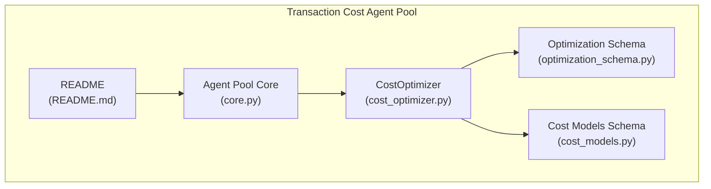
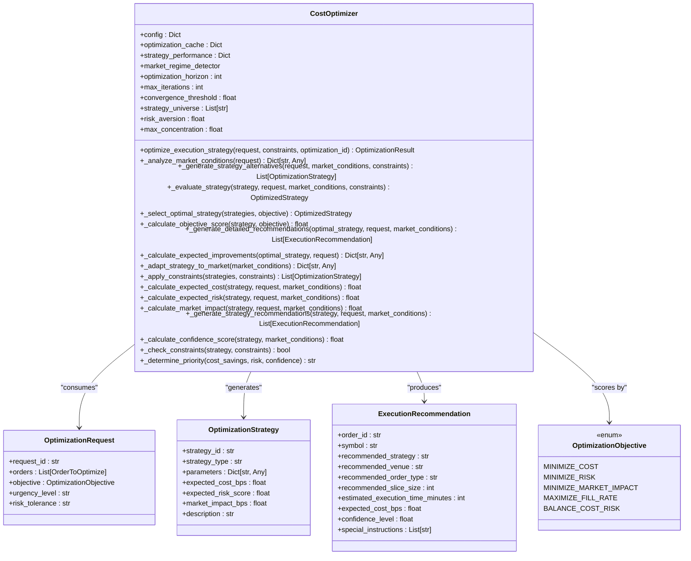
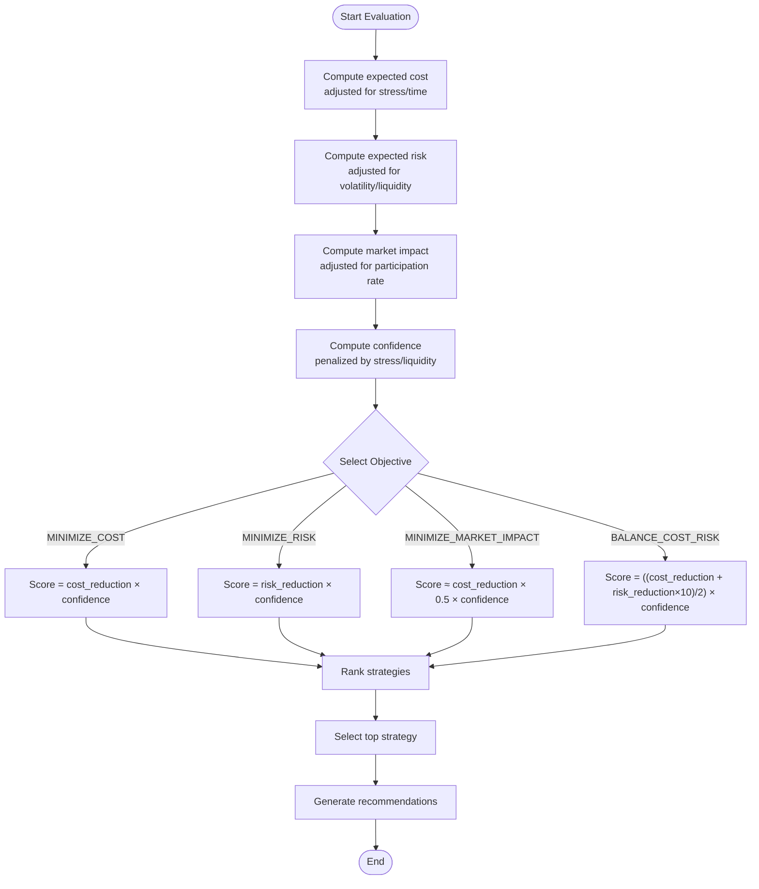
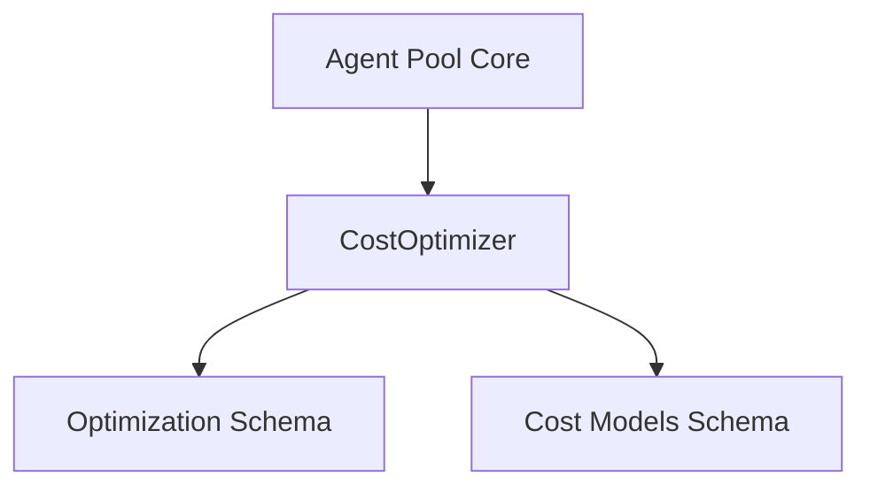

# Cost Optimization

<cite>
**Referenced Files in This Document**
- [cost_optimizer.py](file://FinAgents/agent_pools/transaction_cost_agent_pool/agents/optimization/cost_optimizer.py)
- [optimization_schema.py](file://FinAgents/agent_pools/transaction_cost_agent_pool/schema/optimization_schema.py)
- [cost_models.py](file://FinAgents/agent_pools/transaction_cost_agent_pool/schema/cost_models.py)
- [README.md](file://FinAgents/agent_pools/transaction_cost_agent_pool/README.md)
- [core.py](file://FinAgents/agent_pools/transaction_cost_agent_pool/core.py)
</cite>

## Table of Contents
1. [Introduction](#introduction)
2. [Project Structure](#project-structure)
3. [Core Components](#core-components)
4. [Architecture Overview](#architecture-overview)
5. [Detailed Component Analysis](#detailed-component-analysis)
6. [Dependency Analysis](#dependency-analysis)
7. [Performance Considerations](#performance-considerations)
8. [Troubleshooting Guide](#troubleshooting-guide)
9. [Conclusion](#conclusion)
10. [Appendices](#appendices)

## Introduction
This document provides comprehensive documentation for the cost optimization subsystem, focusing on the CostOptimizer class and its multi-objective optimization algorithms for minimizing transaction costs. It explains the mathematical formulations for cost calculation, constraint handling, and strategy evaluation. It documents the optimization objectives (MINIMIZE_COST, MINIMIZE_RISK, MINIMIZE_MARKET_IMPACT, BALANCE_COST_RISK) and their scoring mechanisms, along with configuration parameters, market condition analysis, and real-time adaptation capabilities. Practical examples illustrate optimization requests, constraint configurations, and result interpretation with expected cost savings and confidence scores.

## Project Structure
The cost optimization subsystem resides within the Transaction Cost Agent Pool. The core implementation is centered around the CostOptimizer class, supported by shared schemas for optimization requests, strategies, and cost models.



**Diagram sources**
- [cost_optimizer.py:65-706](file://FinAgents/agent_pools/transaction_cost_agent_pool/agents/optimization/cost_optimizer.py#L65-L706)
- [optimization_schema.py:1-597](file://FinAgents/agent_pools/transaction_cost_agent_pool/schema/optimization_schema.py#L1-L597)
- [cost_models.py:1-406](file://FinAgents/agent_pools/transaction_cost_agent_pool/schema/cost_models.py#L1-L406)
- [core.py:1-748](file://FinAgents/agent_pools/transaction_cost_agent_pool/core.py#L1-L748)
- [README.md:1-359](file://FinAgents/agent_pools/transaction_cost_agent_pool/README.md#L1-L359)

**Section sources**
- [README.md:1-359](file://FinAgents/agent_pools/transaction_cost_agent_pool/README.md#L1-L359)
- [core.py:1-748](file://FinAgents/agent_pools/transaction_cost_agent_pool/core.py#L1-L748)

## Core Components
- CostOptimizer: Implements multi-objective optimization for transaction cost minimization, including market condition analysis, strategy generation, evaluation, selection, and recommendation.
- OptimizationRequest/OptimizationStrategy/ExecutionRecommendation: Data models defining optimization inputs, candidate strategies, and actionable recommendations.
- TransactionCostBreakdown/CostEstimate: Cost modeling primitives for pre-trade and post-trade analysis.

Key responsibilities:
- Analyze market conditions (volatility regime, liquidity, time-of-day effects).
- Generate candidate strategies (TWAP, VWAP, POV, Implementation Shortfall, Adaptive).
- Evaluate strategies using expected cost, risk, and market impact.
- Score strategies per objective and select the optimal one.
- Produce recommendations and confidence scores.

**Section sources**
- [cost_optimizer.py:65-706](file://FinAgents/agent_pools/transaction_cost_agent_pool/agents/optimization/cost_optimizer.py#L65-L706)
- [optimization_schema.py:430-597](file://FinAgents/agent_pools/transaction_cost_agent_pool/schema/optimization_schema.py#L430-L597)
- [cost_models.py:87-406](file://FinAgents/agent_pools/transaction_cost_agent_pool/schema/cost_models.py#L87-L406)

## Architecture Overview
The CostOptimizer participates in the Transaction Cost Agent Pool’s MCP-based orchestration. The pool exposes tools for cost estimation, execution analysis, portfolio optimization, and risk-adjusted cost analysis. The CostOptimizer is invoked via the pool’s MCP endpoints and returns structured results aligned with the optimization schemas.

```mermaid
sequenceDiagram
participant Client as "Client"
participant Pool as "TransactionCostAgentPool<br/>(core.py)"
participant Opt as "CostOptimizer<br/>(cost_optimizer.py)"
participant Schemas as "Optimization Schema<br/>(optimization_schema.py)"
Client->>Pool : "optimize_portfolio_execution(...)" MCP tool
Pool->>Opt : "optimize_execution_strategy(request, constraints)"
Opt->>Opt : "_analyze_market_conditions(request)"
Opt->>Opt : "_generate_strategy_alternatives(...)"
Opt->>Opt : "_evaluate_strategy(strategy, ...)"
Opt->>Opt : "_select_optimal_strategy(strategies, objective)"
Opt->>Opt : "_generate_detailed_recommendations(...)"
Opt-->>Pool : "OptimizationResult"
Pool-->>Client : "Optimization result payload"
```

**Diagram sources**
- [core.py:292-351](file://FinAgents/agent_pools/transaction_cost_agent_pool/core.py#L292-L351)
- [cost_optimizer.py:103-175](file://FinAgents/agent_pools/transaction_cost_agent_pool/agents/optimization/cost_optimizer.py#L103-L175)
- [optimization_schema.py:260-342](file://FinAgents/agent_pools/transaction_cost_agent_pool/schema/optimization_schema.py#L260-L342)

## Detailed Component Analysis

### CostOptimizer Class
The CostOptimizer class encapsulates the end-to-end optimization pipeline:
- Initialization: Loads configuration parameters (optimization horizon, iteration limits, convergence threshold, strategy universe, risk aversion, max concentration).
- Market condition analysis: Computes volatility regime, liquidity conditions, market stress, and time-of-day multiplier.
- Strategy generation: Creates candidate strategies (TWAP, VWAP, POV, IS, ADAPTIVE) with expected metrics and descriptions.
- Strategy evaluation: Calculates expected cost, risk, market impact, confidence, savings, and determines implementation priority.
- Objective scoring: Scores strategies according to selected objective (MINIMIZE_COST, MINIMIZE_RISK, MINIMIZE_MARKET_IMPACT, BALANCE_COST_RISK).
- Strategy selection: Chooses the best strategy respecting constraints and objective.
- Recommendations: Produces execution recommendations per order with suggested venues, order types, slice sizes, and confidence.



**Diagram sources**
- [cost_optimizer.py:65-706](file://FinAgents/agent_pools/transaction_cost_agent_pool/agents/optimization/cost_optimizer.py#L65-L706)
- [optimization_schema.py:430-597](file://FinAgents/agent_pools/transaction_cost_agent_pool/schema/optimization_schema.py#L430-L597)

**Section sources**
- [cost_optimizer.py:77-102](file://FinAgents/agent_pools/transaction_cost_agent_pool/agents/optimization/cost_optimizer.py#L77-L102)
- [cost_optimizer.py:176-205](file://FinAgents/agent_pools/transaction_cost_agent_pool/agents/optimization/cost_optimizer.py#L176-L205)
- [cost_optimizer.py:207-302](file://FinAgents/agent_pools/transaction_cost_agent_pool/agents/optimization/cost_optimizer.py#L207-L302)
- [cost_optimizer.py:304-351](file://FinAgents/agent_pools/transaction_cost_agent_pool/agents/optimization/cost_optimizer.py#L304-L351)
- [cost_optimizer.py:353-404](file://FinAgents/agent_pools/transaction_cost_agent_pool/agents/optimization/cost_optimizer.py#L353-L404)
- [cost_optimizer.py:405-435](file://FinAgents/agent_pools/transaction_cost_agent_pool/agents/optimization/cost_optimizer.py#L405-L435)
- [cost_optimizer.py:437-453](file://FinAgents/agent_pools/transaction_cost_agent_pool/agents/optimization/cost_optimizer.py#L437-L453)
- [cost_optimizer.py:455-481](file://FinAgents/agent_pools/transaction_cost_agent_pool/agents/optimization/cost_optimizer.py#L455-L481)
- [cost_optimizer.py:483-514](file://FinAgents/agent_pools/transaction_cost_agent_pool/agents/optimization/cost_optimizer.py#L483-L514)
- [cost_optimizer.py:516-576](file://FinAgents/agent_pools/transaction_cost_agent_pool/agents/optimization/cost_optimizer.py#L516-L576)
- [cost_optimizer.py:578-589](file://FinAgents/agent_pools/transaction_cost_agent_pool/agents/optimization/cost_optimizer.py#L578-L589)
- [cost_optimizer.py:591-608](file://FinAgents/agent_pools/transaction_cost_agent_pool/agents/optimization/cost_optimizer.py#L591-L608)
- [cost_optimizer.py:610-633](file://FinAgents/agent_pools/transaction_cost_agent_pool/agents/optimization/cost_optimizer.py#L610-L633)

### Mathematical Formulations and Scoring Mechanisms
- Expected cost calculation: Base cost adjusted by market stress and time-of-day factors, bounded to a minimum value.
- Expected risk calculation: Base risk adjusted by volatility regime and liquidity conditions, bounded to [0, 1].
- Market impact calculation: Base impact adjusted by participation rate relative to average daily volume (ADV).
- Confidence score: Base confidence reduced by penalties for market stress and poor liquidity.
- Objective scoring:
  - MINIMIZE_COST: Weighted by expected cost reduction and confidence.
  - MINIMIZE_RISK: Weighted by expected risk reduction and confidence.
  - MINIMIZE_MARKET_IMPACT: Derived from cost reduction approximation and confidence.
  - BALANCE_COST_RISK: Balanced score combining cost and risk reductions, scaled and weighted by confidence.
- Implementation priority: Determined by a composite score of cost savings, confidence, and risk.



**Diagram sources**
- [cost_optimizer.py:516-576](file://FinAgents/agent_pools/transaction_cost_agent_pool/agents/optimization/cost_optimizer.py#L516-L576)
- [cost_optimizer.py:591-608](file://FinAgents/agent_pools/transaction_cost_agent_pool/agents/optimization/cost_optimizer.py#L591-L608)
- [cost_optimizer.py:382-404](file://FinAgents/agent_pools/transaction_cost_agent_pool/agents/optimization/cost_optimizer.py#L382-L404)
- [cost_optimizer.py:405-435](file://FinAgents/agent_pools/transaction_cost_agent_pool/agents/optimization/cost_optimizer.py#L405-L435)

**Section sources**
- [cost_optimizer.py:516-576](file://FinAgents/agent_pools/transaction_cost_agent_pool/agents/optimization/cost_optimizer.py#L516-L576)
- [cost_optimizer.py:591-608](file://FinAgents/agent_pools/transaction_cost_agent_pool/agents/optimization/cost_optimizer.py#L591-L608)
- [cost_optimizer.py:382-404](file://FinAgents/agent_pools/transaction_cost_agent_pool/agents/optimization/cost_optimizer.py#L382-L404)

### Optimization Objectives and Scoring
- MINIMIZE_COST: Prioritizes strategies with the highest expected cost reduction, weighted by confidence.
- MINIMIZE_RISK: Prioritizes strategies with the highest expected risk reduction, weighted by confidence.
- MINIMIZE_MARKET_IMPACT: Approximates impact reduction from cost reduction and confidence.
- BALANCE_COST_RISK: Averages cost and risk contributions, scaled and weighted by confidence.
- Strategy selection filters out infeasible strategies (violating constraints) and ranks by objective score.

**Section sources**
- [cost_optimizer.py:29-36](file://FinAgents/agent_pools/transaction_cost_agent_pool/agents/optimization/cost_optimizer.py#L29-L36)
- [cost_optimizer.py:382-404](file://FinAgents/agent_pools/transaction_cost_agent_pool/agents/optimization/cost_optimizer.py#L382-L404)
- [cost_optimizer.py:353-380](file://FinAgents/agent_pools/transaction_cost_agent_pool/agents/optimization/cost_optimizer.py#L353-L380)

### Configuration Parameters
- Optimization parameters:
  - optimization_horizon_minutes: Default 30 minutes.
  - max_iterations: Default 1000.
  - convergence_threshold: Default 0.001.
- Strategy universe: Default includes TWAP, VWAP, POV, IS, ADAPTIVE.
- Risk parameters:
  - risk_aversion: Default 0.5 (neutral risk).
  - max_concentration: Default 0.1 (10% of ADV).
- Constraints:
  - max_market_impact_bps, max_cost_bps, min_fill_rate, max_execution_time_minutes, allowed_venues, allowed_order_types, max_order_size.

**Section sources**
- [cost_optimizer.py:89-102](file://FinAgents/agent_pools/transaction_cost_agent_pool/agents/optimization/cost_optimizer.py#L89-L102)
- [cost_optimizer.py:38-48](file://FinAgents/agent_pools/transaction_cost_agent_pool/agents/optimization/cost_optimizer.py#L38-L48)

### Market Condition Analysis and Real-time Adaptation
- Market conditions include volatility regime, liquidity conditions, market stress, and time-of-day factor.
- Strategy parameters adapt dynamically to market stress, liquidity, and time-of-day.
- Confidence scores reflect current market conditions with built-in penalties.

**Section sources**
- [cost_optimizer.py:176-205](file://FinAgents/agent_pools/transaction_cost_agent_pool/agents/optimization/cost_optimizer.py#L176-L205)
- [cost_optimizer.py:455-481](file://FinAgents/agent_pools/transaction_cost_agent_pool/agents/optimization/cost_optimizer.py#L455-L481)
- [cost_optimizer.py:591-608](file://FinAgents/agent_pools/transaction_cost_agent_pool/agents/optimization/cost_optimizer.py#L591-L608)

### Practical Examples
Below are example scenarios demonstrating optimization requests, constraints, and result interpretation. Replace the placeholders with actual values when invoking the optimizer.

- Optimization request example:
  - request_id: Unique identifier for the optimization.
  - orders: List of OrderToOptimize entries (symbol, side, quantity, limit_price, time_in_force).
  - objective: One of MINIMIZE_COST, MINIMIZE_RISK, MINIMIZE_MARKET_IMPACT, BALANCE_COST_RISK.
  - urgency_level and risk_tolerance: String indicators for urgency and risk tolerance.
- Constraints example:
  - max_cost_bps: Upper bound on expected cost (bps).
  - max_market_impact_bps: Upper bound on market impact (bps).
  - min_fill_rate: Minimum acceptable fill rate.
  - allowed_order_types: Allowed order types (e.g., LIMIT, ADAPTIVE).
- Result interpretation:
  - optimal_strategy: Selected strategy identifier and parameters.
  - expected_cost_savings_bps: Expected cost reduction in basis points.
  - expected_risk_reduction: Expected risk reduction.
  - confidence_level: Confidence score for the recommendation.
  - recommendations: Per-order recommendations including venue, order type, slice size, and expected cost.

Note: The example usage is embedded in the CostOptimizer module and demonstrates end-to-end invocation with sample data.

**Section sources**
- [cost_optimizer.py:636-706](file://FinAgents/agent_pools/transaction_cost_agent_pool/agents/optimization/cost_optimizer.py#L636-L706)

## Dependency Analysis
The CostOptimizer depends on:
- Optimization schemas for request, strategy, and recommendation structures.
- Cost models for transaction cost breakdown and estimates.
- Agent pool core for MCP tool exposure and orchestration.



**Diagram sources**
- [cost_optimizer.py:17-23](file://FinAgents/agent_pools/transaction_cost_agent_pool/agents/optimization/cost_optimizer.py#L17-L23)
- [optimization_schema.py:1-597](file://FinAgents/agent_pools/transaction_cost_agent_pool/schema/optimization_schema.py#L1-L597)
- [cost_models.py:1-406](file://FinAgents/agent_pools/transaction_cost_agent_pool/schema/cost_models.py#L1-L406)
- [core.py:1-748](file://FinAgents/agent_pools/transaction_cost_agent_pool/core.py#L1-L748)

**Section sources**
- [cost_optimizer.py:17-23](file://FinAgents/agent_pools/transaction_cost_agent_pool/agents/optimization/cost_optimizer.py#L17-L23)
- [optimization_schema.py:1-597](file://FinAgents/agent_pools/transaction_cost_agent_pool/schema/optimization_schema.py#L1-L597)
- [cost_models.py:1-406](file://FinAgents/agent_pools/transaction_cost_agent_pool/schema/cost_models.py#L1-L406)
- [core.py:151-351](file://FinAgents/agent_pools/transaction_cost_agent_pool/core.py#L151-L351)

## Performance Considerations
- The Transaction Cost Agent Pool emphasizes low-latency cost estimation and high throughput, suitable for real-time optimization.
- The CostOptimizer’s evaluation loop iterates over candidate strategies and computes metrics asynchronously, enabling responsive recommendations.
- Confidence scoring and constraint filtering help avoid computationally expensive or infeasible strategies.

[No sources needed since this section provides general guidance]

## Troubleshooting Guide
Common issues and resolutions:
- No strategies to evaluate: The optimizer raises an error if no strategies are provided. Ensure the request includes valid orders and that constraints are not overly restrictive.
- Constraints violation: Strategies violating constraints are skipped; adjust constraints or broaden allowed algorithms/venues.
- Market stress and liquidity penalties: If confidence is low, consider adjusting risk aversion or strategy universe to improve feasibility.
- Unexpected cost or risk estimates: Verify market condition inputs and strategy parameters; confirm that expected cost, risk, and impact calculations align with the intended regimes.

**Section sources**
- [cost_optimizer.py:360-362](file://FinAgents/agent_pools/transaction_cost_agent_pool/agents/optimization/cost_optimizer.py#L360-L362)
- [cost_optimizer.py:366-376](file://FinAgents/agent_pools/transaction_cost_agent_pool/agents/optimization/cost_optimizer.py#L366-L376)
- [cost_optimizer.py:483-514](file://FinAgents/agent_pools/transaction_cost_agent_pool/agents/optimization/cost_optimizer.py#L483-L514)

## Conclusion
The CostOptimizer provides a robust, multi-objective framework for transaction cost minimization. By integrating market condition analysis, adaptive strategy generation, and rigorous evaluation with confidence scoring, it supports informed execution decisions. The modular design, schema-driven data models, and MCP-based orchestration enable seamless integration and real-time adaptation to changing market conditions.

[No sources needed since this section summarizes without analyzing specific files]

## Appendices

### Appendix A: Optimization Objectives Reference
- MINIMIZE_COST: Prioritizes cost reduction with confidence weighting.
- MINIMIZE_RISK: Prioritizes risk reduction with confidence weighting.
- MINIMIZE_MARKET_IMPACT: Approximates impact reduction via cost reduction and confidence.
- BALANCE_COST_RISK: Balances cost and risk contributions with confidence weighting.

**Section sources**
- [cost_optimizer.py:29-36](file://FinAgents/agent_pools/transaction_cost_agent_pool/agents/optimization/cost_optimizer.py#L29-L36)
- [cost_optimizer.py:382-404](file://FinAgents/agent_pools/transaction_cost_agent_pool/agents/optimization/cost_optimizer.py#L382-L404)

### Appendix B: Data Models Overview
- OptimizationRequest: Encapsulates orders, objective, urgency, and risk tolerance.
- OptimizationStrategy: Describes candidate strategies with parameters and expected outcomes.
- ExecutionRecommendation: Actionable recommendations per order with confidence and instructions.

**Section sources**
- [optimization_schema.py:430-597](file://FinAgents/agent_pools/transaction_cost_agent_pool/schema/optimization_schema.py#L430-L597)