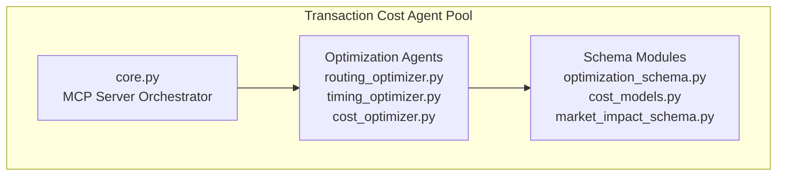
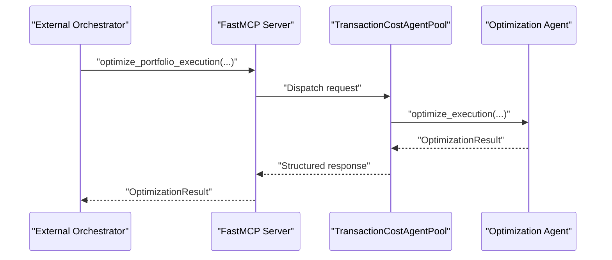
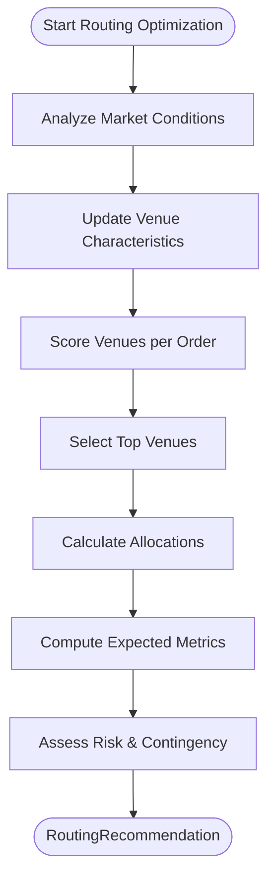
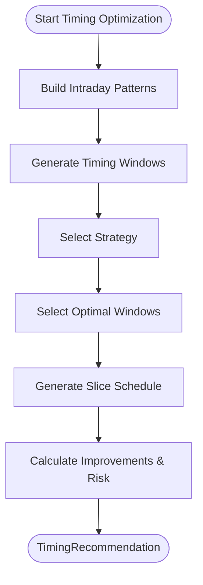
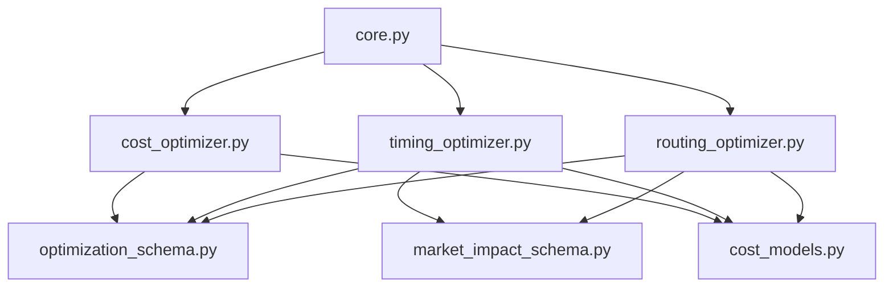

# Optimization Strategies

<cite>
**Referenced Files in This Document**
- [README.md](file://FinAgents/agent_pools/transaction_cost_agent_pool/README.md)
- [core.py](file://FinAgents/agent_pools/transaction_cost_agent_pool/core.py)
- [optimization_schema.py](file://FinAgents/agent_pools/transaction_cost_agent_pool/schema/optimization_schema.py)
- [cost_models.py](file://FinAgents/agent_pools/transaction_cost_agent_pool/schema/cost_models.py)
- [market_impact_schema.py](file://FinAgents/agent_pools/transaction_cost_agent_pool/schema/market_impact_schema.py)
- [routing_optimizer.py](file://FinAgents/agent_pools/transaction_cost_agent_pool/agents/optimization/routing_optimizer.py)
- [timing_optimizer.py](file://FinAgents/agent_pools/transaction_cost_agent_pool/agents/optimization/timing_optimizer.py)
- [cost_optimizer.py](file://FinAgents/agent_pools/transaction_cost_agent_pool/agents/optimization/cost_optimizer.py)
</cite>

## Table of Contents
1. [Introduction](#introduction)
2. [Project Structure](#project-structure)
3. [Core Components](#core-components)
4. [Architecture Overview](#architecture-overview)
5. [Detailed Component Analysis](#detailed-component-analysis)
6. [Dependency Analysis](#dependency-analysis)
7. [Performance Considerations](#performance-considerations)
8. [Troubleshooting Guide](#troubleshooting-guide)
9. [Conclusion](#conclusion)
10. [Appendices](#appendices)

## Introduction
This document presents the optimization strategies subsystem for minimizing transaction costs across multiple trades. It covers:
- Cost optimization algorithms for minimizing total transaction costs
- Routing optimization for splitting orders across venues and liquidity sources
- Timing optimization for executing large orders with minimal market impact
- Mathematical formulations, constraint handling, and real-time optimization implementations
- Configuration examples for different market regimes and portfolio sizes

The subsystem is part of the Transaction Cost Agent Pool, which provides pre-trade cost estimation, post-trade analysis, market impact modeling, venue selection optimization, and risk-adjusted cost analysis.

## Project Structure
The optimization strategies are implemented as specialized agents within the Transaction Cost Agent Pool, orchestrated via an MCP server. The core orchestration registers MCP tools for cost estimation, execution analysis, portfolio optimization, and risk-adjusted cost calculations. The optimization agents consume structured schemas for optimization requests, execution strategies, and market impact models.

**Diagram sources**
- [core.py:151-414](file://FinAgents/agent_pools/transaction_cost_agent_pool/core.py#L151-L414)
- [optimization_schema.py:88-547](file://FinAgents/agent_pools/transaction_cost_agent_pool/schema/optimization_schema.py#L88-L547)
- [cost_models.py:227-406](file://FinAgents/agent_pools/transaction_cost_agent_pool/schema/cost_models.py#L227-L406)
- [market_impact_schema.py:165-283](file://FinAgents/agent_pools/transaction_cost_agent_pool/schema/market_impact_schema.py#L165-L283)
- [routing_optimizer.py:80-841](file://FinAgents/agent_pools/transaction_cost_agent_pool/agents/optimization/routing_optimizer.py#L80-L841)
- [timing_optimizer.py:90-982](file://FinAgents/agent_pools/transaction_cost_agent_pool/agents/optimization/timing_optimizer.py#L90-L982)
- [cost_optimizer.py](file://FinAgents/agent_pools/transaction_cost_agent_pool/agents/optimization/cost_optimizer.py)

**Section sources**
- [README.md:13-137](file://FinAgents/agent_pools/transaction_cost_agent_pool/README.md#L13-L137)
- [core.py:64-120](file://FinAgents/agent_pools/transaction_cost_agent_pool/core.py#L64-L120)

## Core Components
- Optimization request models define multi-objective optimization parameters, constraints, and portfolio-level settings.
- Execution strategy models specify algorithm choices, venue allocations, timing distributions, and risk metrics.
- Market impact models decompose temporary and permanent impact components and provide scenario analysis.
- Cost models capture transaction cost breakdowns, performance benchmarks, and attribution analysis.

These models enable structured optimization workflows and consistent result reporting.

**Section sources**
- [optimization_schema.py:88-547](file://FinAgents/agent_pools/transaction_cost_agent_pool/schema/optimization_schema.py#L88-L547)
- [cost_models.py:227-406](file://FinAgents/agent_pools/transaction_cost_agent_pool/schema/cost_models.py#L227-L406)
- [market_impact_schema.py:165-283](file://FinAgents/agent_pools/transaction_cost_agent_pool/schema/market_impact_schema.py#L165-L283)

## Architecture Overview
The Transaction Cost Agent Pool exposes MCP tools for cost estimation, execution analysis, portfolio optimization, and risk-adjusted cost calculations. The orchestrator routes requests to specialized agents and aggregates results.

**Diagram sources**
- [core.py:292-351](file://FinAgents/agent_pools/transaction_cost_agent_pool/core.py#L292-L351)
- [core.py:321-337](file://FinAgents/agent_pools/transaction_cost_agent_pool/core.py#L321-L337)

**Section sources**
- [core.py:151-414](file://FinAgents/agent_pools/transaction_cost_agent_pool/core.py#L151-L414)

## Detailed Component Analysis

### Cost Optimization Algorithms
Cost optimization aims to minimize total transaction costs across multiple trades subject to constraints. The optimization schema defines:
- OptimizationParameters: objectives, constraints, risk aversion, venue preferences, impact model, solver parameters
- OptimizationRequest: multi-order requests with portfolio context and market conditions
- OptimizationResult: optimal strategies, portfolio-level metrics, constraint analysis, and solution quality

Mathematical formulation outline:
- Objective: minimize Σ_i (cost_i + penalty_i) across trades i
- Constraints:
  - Cost limit: Σ_i cost_i ≤ max_cost_limit
  - Risk limit: portfolio_risk ≤ max_risk_limit
  - Position limits: position_i ∈ [min_qty_i, max_qty_i]
  - Time limits: execution_duration_i ≤ max_time_i
  - Venue constraints: venue_i ∈ allowed_venues
  - Liquidity constraints: liquidity_i ≥ min_liquidity_i
- Penalty terms: soft constraints with penalty_factor and tolerance
- Multi-objective: weighted combination of objectives (minimize_cost, minimize_risk, minimize_impact, etc.)

Real-time implementation:
- Agents consume OptimizationRequest and produce OptimizationResult
- Agents compute expected cost_bps, expected_impact_bps, and risk metrics
- Agents provide alternative strategies and confidence scores

Configuration examples:
- High-cost-limit environments: set max_cost_limit to accommodate higher expected costs
- Risk-averse portfolios: increase risk_aversion_factor and max_risk_limit
- Multi-asset portfolios: populate portfolio_correlation_matrix for diversification benefits

**Section sources**
- [optimization_schema.py:88-155](file://FinAgents/agent_pools/transaction_cost_agent_pool/schema/optimization_schema.py#L88-L155)
- [optimization_schema.py:430-547](file://FinAgents/agent_pools/transaction_cost_agent_pool/schema/optimization_schema.py#L430-L547)
- [optimization_schema.py:260-342](file://FinAgents/agent_pools/transaction_cost_agent_pool/schema/optimization_schema.py#L260-L342)

### Routing Optimization
Routing optimization splits orders across venues to minimize transaction costs while considering venue characteristics, liquidity, and risk. The routing optimizer:
- Maintains a venue universe with typical cost_bps, fill_rate, speed_ms, and liquidity/adverse selection scores
- Updates venue characteristics based on market conditions (stress, volatility, outages)
- Scores venues for each order using weighted criteria (cost, fill rate, speed, liquidity, adverse selection)
- Allocates percentages across top venues with minimum allocation constraints
- Generates routing logic, risk assessment, contingency plans, and monitoring requirements

Mathematical formulation outline:
- Venue scoring: score_j = α₁/cost_j + α₂fill_rate_j + α₃speed_j⁻¹ + α₄liquidity_j + α₅(1−adverse_selection_j)
- Allocation: allocate_j ∝ score_j / Σ_k score_k, subject to min_allocation_pct and concentration limits
- Expected metrics: weighted averages over allocations

Real-time implementation:
- Analyzes market conditions and updates venue performance adjustments
- Computes expected cost_bps, expected fill_rate, and expected execution time
- Provides contingency plans for venue outages and liquidity deterioration

Configuration examples:
- High-stress markets: reduce dark pool allocations and increase exchange allocations
- Volatile environments: penalize adverse selection risk more heavily
- Large orders: prefer dark pools with sufficient liquidity

**Diagram sources**
- [routing_optimizer.py:212-282](file://FinAgents/agent_pools/transaction_cost_agent_pool/agents/optimization/routing_optimizer.py#L212-L282)
- [routing_optimizer.py:353-397](file://FinAgents/agent_pools/transaction_cost_agent_pool/agents/optimization/routing_optimizer.py#L353-L397)
- [routing_optimizer.py:475-504](file://FinAgents/agent_pools/transaction_cost_agent_pool/agents/optimization/routing_optimizer.py#L475-L504)

**Section sources**
- [routing_optimizer.py:80-841](file://FinAgents/agent_pools/transaction_cost_agent_pool/agents/optimization/routing_optimizer.py#L80-L841)

### Timing Optimization
Timing optimization determines optimal execution windows and slice schedules to minimize market impact and transaction costs. The timing optimizer:
- Builds intraday patterns for volume, volatility, spread, and market impact
- Generates timing windows with priority scores based on expected cost and liquidity
- Selects optimal windows per strategy (immediate, spread_evenly, volume_weighted, volatility_adjusted, momentum_based, contrarian, adaptive)
- Creates slice schedules distributing quantities across selected windows
- Calculates expected cost reductions, impact reductions, and risk metrics

Mathematical formulation outline:
- Window priority: priority_w = β₁volume_pct_w + β₂liquidity_score_w + β₃(1/σ_w) + β₄(1/impact_w)
- Slice size: q_slice_w ∝ volume_pct_w / Σ_v volume_pct_v for volume_weighted strategy
- Expected cost reduction: Δcost = baseline − Σ_w priority_w × cost_w
- Risk metrics: timing_risk ∝ σ × √(T), execution_risk ∝ 1 − liquidity_avg

Real-time implementation:
- Adapts to current market session, volatility, and stress levels
- Generates monitoring triggers for volatility spikes, liquidity drops, and execution progress
- Provides contingency windows and monitoring requirements

**Diagram sources**
- [timing_optimizer.py:172-246](file://FinAgents/agent_pools/transaction_cost_agent_pool/agents/optimization/timing_optimizer.py#L172-L246)
- [timing_optimizer.py:429-470](file://FinAgents/agent_pools/transaction_cost_agent_pool/agents/optimization/timing_optimizer.py#L429-L470)
- [timing_optimizer.py:504-551](file://FinAgents/agent_pools/transaction_cost_agent_pool/agents/optimization/timing_optimizer.py#L504-L551)

**Section sources**
- [timing_optimizer.py:90-982](file://FinAgents/agent_pools/transaction_cost_agent_pool/agents/optimization/timing_optimizer.py#L90-L982)

### Market Impact Modeling
Market impact models decompose temporary and permanent impact components to inform cost optimization. The market impact schema defines:
- TemporaryPermanentImpact: breakdown of impact into temporary and permanent components
- ImpactEstimate: comprehensive estimation results with confidence intervals and scenario analysis
- MarketMicrostructure: current liquidity, spread, order book depth, and regime indicators

Real-time implementation:
- Estimates temporary and permanent impact based on order size, participation rate, and market conditions
- Provides best/worst/base-case scenarios and sensitivity analysis
- Supports risk adjustments based on identified risk factors

**Section sources**
- [market_impact_schema.py:123-283](file://FinAgents/agent_pools/transaction_cost_agent_pool/schema/market_impact_schema.py#L123-L283)

### Cost Models and Attribution
Cost models capture transaction cost breakdowns, performance benchmarks, and attribution analysis:
- TransactionCost: complete cost representation with cost breakdown, market impact model, and execution metrics
- CostBreakdown: detailed decomposition of commission, spread, market impact, and optional components
- PerformanceBenchmark: benchmark comparisons against TWAP/VWAP/Arrival
- CostAttribute: cost attribution analysis for optimization opportunities

Real-time implementation:
- Validates cost breakdown consistency
- Provides confidence intervals and model accuracy metrics
- Supports performance benchmarking and attribution analysis

**Section sources**
- [cost_models.py:227-406](file://FinAgents/agent_pools/transaction_cost_agent_pool/schema/cost_models.py#L227-L406)

## Dependency Analysis
The optimization subsystem depends on:
- Schema modules for request/result structures and cost/impact models
- MCP orchestration for tool registration and request routing
- Real-time market condition analysis for venue and timing optimizations

**Diagram sources**
- [core.py:151-414](file://FinAgents/agent_pools/transaction_cost_agent_pool/core.py#L151-L414)
- [optimization_schema.py:88-547](file://FinAgents/agent_pools/transaction_cost_agent_pool/schema/optimization_schema.py#L88-L547)
- [cost_models.py:227-406](file://FinAgents/agent_pools/transaction_cost_agent_pool/schema/cost_models.py#L227-L406)
- [market_impact_schema.py:165-283](file://FinAgents/agent_pools/transaction_cost_agent_pool/schema/market_impact_schema.py#L165-L283)
- [routing_optimizer.py:80-841](file://FinAgents/agent_pools/transaction_cost_agent_pool/agents/optimization/routing_optimizer.py#L80-L841)
- [timing_optimizer.py:90-982](file://FinAgents/agent_pools/transaction_cost_agent_pool/agents/optimization/timing_optimizer.py#L90-L982)
- [cost_optimizer.py](file://FinAgents/agent_pools/transaction_cost_agent_pool/agents/optimization/cost_optimizer.py)

**Section sources**
- [core.py:151-414](file://FinAgents/agent_pools/transaction_cost_agent_pool/core.py#L151-L414)

## Performance Considerations
- Latency: Sub-10ms cost estimation for standard requests, high-throughput processing
- Scalability: Stateless design enables horizontal scaling of optimization agents
- Accuracy: Predictive analytics with forward-looking cost estimation and model validation
- Availability: 99.9% uptime with automatic failover and monitoring

[No sources needed since this section provides general guidance]

## Troubleshooting Guide
Common issues and resolutions:
- Venue outages: The routing optimizer excludes venues listed in market_conditions.outage lists and adjusts performance accordingly
- Market stress: Dark pool liquidity and adverse selection risk increase; adjust allocations and consider exchange venues
- Constrained allocations: Ensure minimum allocation percentages and avoid excessive concentration risk
- Timing risk: Monitor volatility and execution duration; use volatility-adjusted or volume-weighted strategies in high-stress conditions
- Model validation: Use confidence intervals and historical accuracy metrics to assess model reliability

**Section sources**
- [routing_optimizer.py:301-351](file://FinAgents/agent_pools/transaction_cost_agent_pool/agents/optimization/routing_optimizer.py#L301-L351)
- [timing_optimizer.py:616-669](file://FinAgents/agent_pools/transaction_cost_agent_pool/agents/optimization/timing_optimizer.py#L616-L669)

## Conclusion
The optimization strategies subsystem provides a comprehensive framework for minimizing transaction costs through:
- Structured optimization requests and results
- Venue routing with dynamic scoring and allocation
- Intraday timing with adaptive strategies and risk controls
- Robust market impact modeling and cost attribution

The modular design, schema-driven data models, and MCP orchestration enable scalable, real-time optimization across diverse market regimes and portfolio sizes.

[No sources needed since this section summarizes without analyzing specific files]

## Appendices

### Configuration Examples

- High-cost-limit environment
  - Set max_cost_limit to accommodate higher expected costs
  - Increase cost_penalty_factor for stricter adherence to cost constraints
  - Enable machine learning impact models for improved accuracy

- Risk-averse portfolio
  - Increase risk_aversion_factor and max_risk_limit
  - Use volatility-adjusted timing windows
  - Prefer exchanges over dark pools for lower adverse selection risk

- Multi-asset portfolio
  - Populate portfolio_correlation_matrix for diversification benefits
  - Set venue_preferences to balance liquidity across asset classes
  - Monitor portfolio_risk_score and adjust allocations dynamically

- Large orders
  - Prefer dark pools with sufficient liquidity
  - Use volume-weighted timing windows during high-volume periods
  - Implement iceberg or TWAP strategies to minimize market impact

[No sources needed since this section provides general guidance]