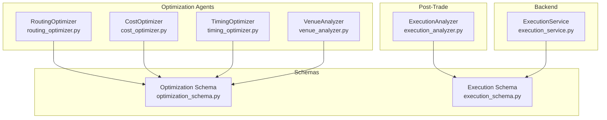
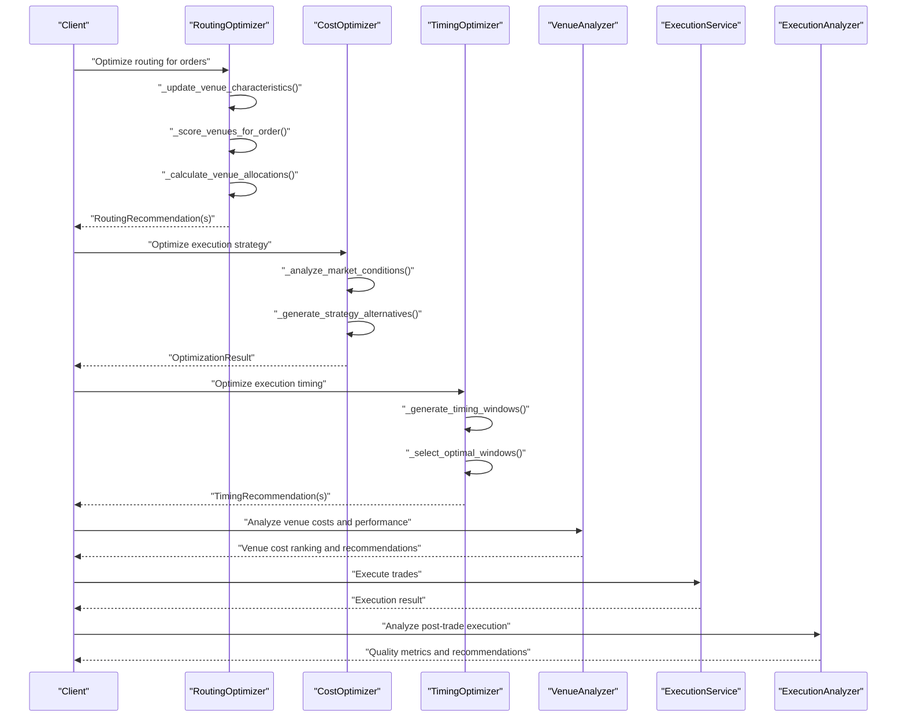
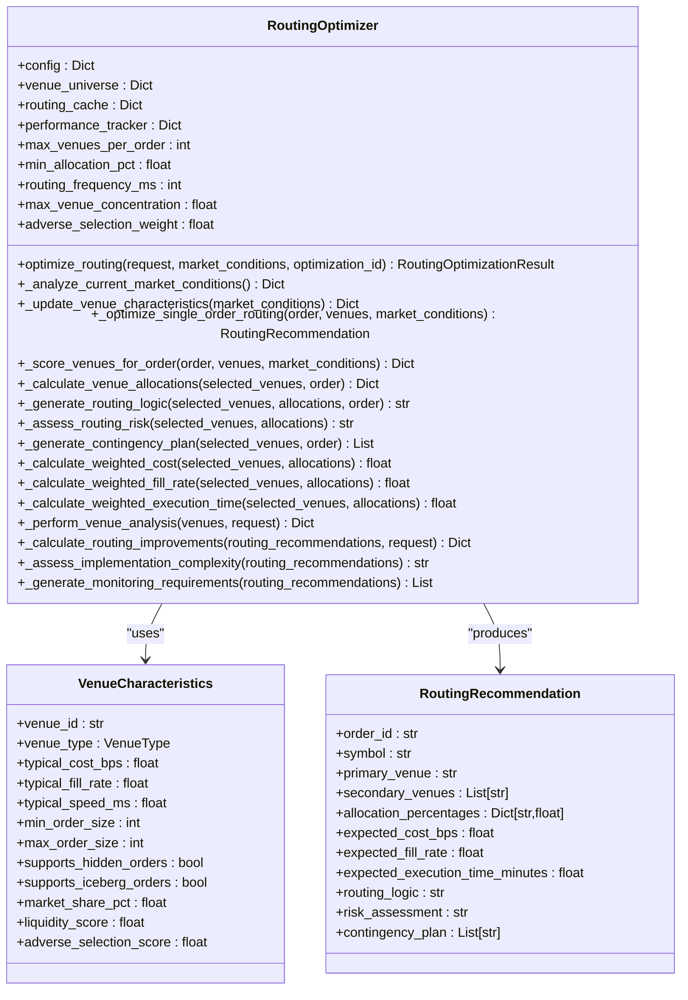
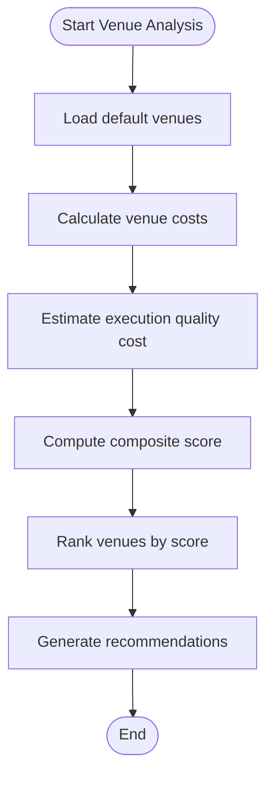
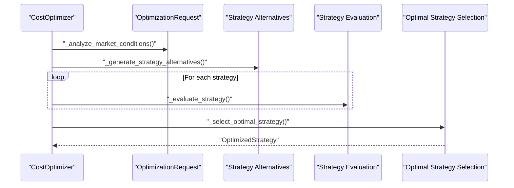
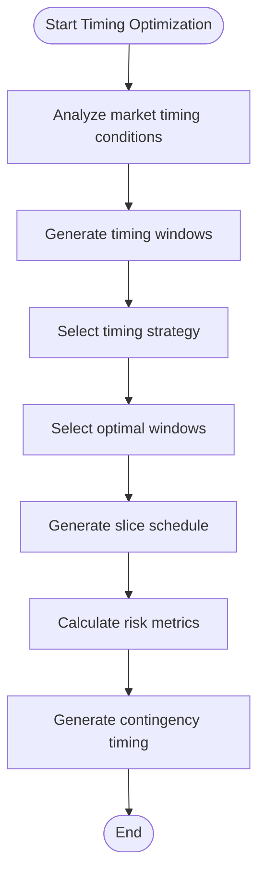
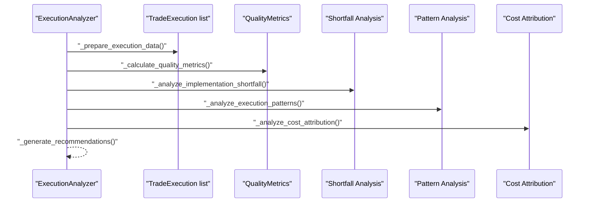
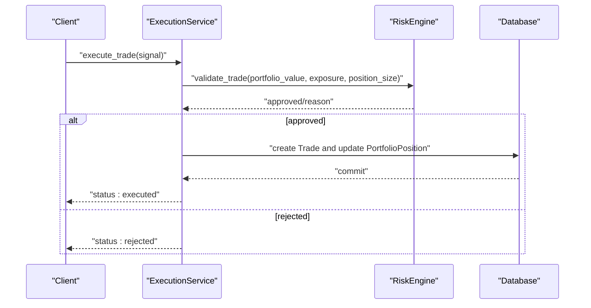
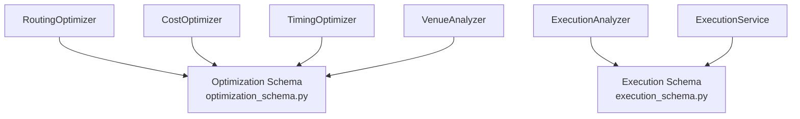

# Routing Optimization

<cite>
**Referenced Files in This Document**
- [routing_optimizer.py](file://FinAgents/agent_pools/transaction_cost_agent_pool/agents/optimization/routing_optimizer.py)
- [optimization_schema.py](file://FinAgents/agent_pools/transaction_cost_agent_pool/schema/optimization_schema.py)
- [cost_optimizer.py](file://FinAgents/agent_pools/transaction_cost_agent_pool/agents/optimization/cost_optimizer.py)
- [timing_optimizer.py](file://FinAgents/agent_pools/transaction_cost_agent_pool/agents/optimization/timing_optimizer.py)
- [venue_analyzer.py](file://FinAgents/agent_pools/transaction_cost_agent_pool/agents/pre_trade/venue_analyzer.py)
- [execution_analyzer.py](file://FinAgents/agent_pools/transaction_cost_agent_pool/agents/post_trade/execution_analyzer.py)
- [execution_schema.py](file://FinAgents/agent_pools/transaction_cost_agent_pool/schema/execution_schema.py)
- [execution_service.py](file://backend/services/execution_service.py)
</cite>

## Table of Contents
1. [Introduction](#introduction)
2. [Project Structure](#project-structure)
3. [Core Components](#core-components)
4. [Architecture Overview](#architecture-overview)
5. [Detailed Component Analysis](#detailed-component-analysis)
6. [Dependency Analysis](#dependency-analysis)
7. [Performance Considerations](#performance-considerations)
8. [Troubleshooting Guide](#troubleshooting-guide)
9. [Conclusion](#conclusion)

## Introduction
This document describes the routing optimization subsystem responsible for splitting orders across multiple venues and liquidity sources to achieve optimal execution. It explains venue selection algorithms, liquidity aggregation strategies, and smart order routing mechanisms. It also covers integration with market data providers, venue connectivity protocols, and execution venue management. Configuration examples for multi-venue routing, venue prioritization criteria, and performance monitoring are included, along with implementation patterns for dynamic venue switching and liquidity source diversification.

## Project Structure
The routing optimization subsystem is implemented as part of the transaction cost optimization agent pool. It includes:
- Routing optimizer: multi-venue cost analysis, venue scoring, allocation, and recommendations
- Supporting optimizers: cost and timing optimizers for complementary optimization dimensions
- Venue analysis: pre-trade venue profiling and selection
- Post-trade execution analysis: performance attribution and recommendations
- Execution service: backend trade execution and risk validation
- Shared schemas: optimization requests, recommendations, and execution reports

**Diagram sources**
- [routing_optimizer.py:80-282](file://FinAgents/agent_pools/transaction_cost_agent_pool/agents/optimization/routing_optimizer.py#L80-L282)
- [cost_optimizer.py:65-175](file://FinAgents/agent_pools/transaction_cost_agent_pool/agents/optimization/cost_optimizer.py#L65-L175)
- [timing_optimizer.py:90-246](file://FinAgents/agent_pools/transaction_cost_agent_pool/agents/optimization/timing_optimizer.py#L90-L246)
- [venue_analyzer.py:123-151](file://FinAgents/agent_pools/transaction_cost_agent_pool/agents/pre_trade/venue_analyzer.py#L123-L151)
- [execution_analyzer.py:56-147](file://FinAgents/agent_pools/transaction_cost_agent_pool/agents/post_trade/execution_analyzer.py#L56-L147)
- [execution_service.py:10-107](file://backend/services/execution_service.py#L10-L107)
- [optimization_schema.py:430-547](file://FinAgents/agent_pools/transaction_cost_agent_pool/schema/optimization_schema.py#L430-L547)
- [execution_schema.py:208-267](file://FinAgents/agent_pools/transaction_cost_agent_pool/schema/execution_schema.py#L208-L267)

**Section sources**
- [routing_optimizer.py:1-841](file://FinAgents/agent_pools/transaction_cost_agent_pool/agents/optimization/routing_optimizer.py#L1-L841)
- [optimization_schema.py:1-597](file://FinAgents/agent_pools/transaction_cost_agent_pool/schema/optimization_schema.py#L1-L597)
- [execution_schema.py:1-444](file://FinAgents/agent_pools/transaction_cost_agent_pool/schema/execution_schema.py#L1-L444)

## Core Components
- RoutingOptimizer: Computes venue allocations and routing recommendations across multiple venues, incorporating market conditions, venue characteristics, and risk constraints.
- CostOptimizer: Provides multi-objective optimization for execution strategies, including venue and routing considerations.
- TimingOptimizer: Optimizes execution timing to minimize market impact and improve cost efficiency.
- VenueAnalyzer: Pre-trade venue profiling and selection across cost, liquidity, speed, and risk dimensions.
- ExecutionAnalyzer: Post-trade analysis of execution quality, implementation shortfall, and performance attribution.
- ExecutionService: Backend trade execution with risk validation and portfolio updates.
- Schemas: Shared models for optimization requests, recommendations, and execution reports.

**Section sources**
- [routing_optimizer.py:80-282](file://FinAgents/agent_pools/transaction_cost_agent_pool/agents/optimization/routing_optimizer.py#L80-L282)
- [cost_optimizer.py:65-175](file://FinAgents/agent_pools/transaction_cost_agent_pool/agents/optimization/cost_optimizer.py#L65-L175)
- [timing_optimizer.py:90-246](file://FinAgents/agent_pools/transaction_cost_agent_pool/agents/optimization/timing_optimizer.py#L90-L246)
- [venue_analyzer.py:123-151](file://FinAgents/agent_pools/transaction_cost_agent_pool/agents/pre_trade/venue_analyzer.py#L123-L151)
- [execution_analyzer.py:56-147](file://FinAgents/agent_pools/transaction_cost_agent_pool/agents/post_trade/execution_analyzer.py#L56-L147)
- [execution_service.py:10-107](file://backend/services/execution_service.py#L10-L107)
- [optimization_schema.py:430-547](file://FinAgents/agent_pools/transaction_cost_agent_pool/schema/optimization_schema.py#L430-L547)
- [execution_schema.py:208-267](file://FinAgents/agent_pools/transaction_cost_agent_pool/schema/execution_schema.py#L208-L267)

## Architecture Overview
The routing optimization subsystem integrates pre-trade venue analysis, multi-dimensional optimization, and post-trade execution evaluation. It leverages shared schemas to exchange structured optimization requests and recommendations, and connects to backend execution services for trade execution.

**Diagram sources**
- [routing_optimizer.py:212-282](file://FinAgents/agent_pools/transaction_cost_agent_pool/agents/optimization/routing_optimizer.py#L212-L282)
- [cost_optimizer.py:103-175](file://FinAgents/agent_pools/transaction_cost_agent_pool/agents/optimization/cost_optimizer.py#L103-L175)
- [timing_optimizer.py:172-246](file://FinAgents/agent_pools/transaction_cost_agent_pool/agents/optimization/timing_optimizer.py#L172-L246)
- [venue_analyzer.py:234-301](file://FinAgents/agent_pools/transaction_cost_agent_pool/agents/pre_trade/venue_analyzer.py#L234-L301)
- [execution_service.py:16-101](file://backend/services/execution_service.py#L16-L101)
- [execution_analyzer.py:89-147](file://FinAgents/agent_pools/transaction_cost_agent_pool/agents/post_trade/execution_analyzer.py#L89-L147)

## Detailed Component Analysis

### RoutingOptimizer
The RoutingOptimizer performs multi-venue routing optimization by:
- Initializing a venue universe with typical characteristics
- Updating venue characteristics based on market conditions
- Scoring venues for each order using weighted criteria (cost, fill rate, speed, liquidity, adverse selection)
- Selecting top venues and allocating percentages respecting minimum allocation and concentration limits
- Generating routing logic, risk assessment, contingency plans, and expected performance metrics

**Diagram sources**
- [routing_optimizer.py:80-770](file://FinAgents/agent_pools/transaction_cost_agent_pool/agents/optimization/routing_optimizer.py#L80-L770)

**Section sources**
- [routing_optimizer.py:80-770](file://FinAgents/agent_pools/transaction_cost_agent_pool/agents/optimization/routing_optimizer.py#L80-L770)

### VenueAnalyzer
The VenueAnalyzer provides pre-trade venue profiling and selection by:
- Maintaining a default set of venues with categories and performance metrics
- Calculating venue costs considering maker/taker fees, flat fees, and minimum/maximum constraints
- Estimating execution quality costs from fill rate, speed, and liquidity
- Ranking venues by composite scores and generating recommendations
- Identifying risk factors such as size constraints, liquidity tiers, and credit/op operational risks

**Diagram sources**
- [venue_analyzer.py:153-233](file://FinAgents/agent_pools/transaction_cost_agent_pool/agents/pre_trade/venue_analyzer.py#L153-L233)
- [venue_analyzer.py:302-412](file://FinAgents/agent_pools/transaction_cost_agent_pool/agents/pre_trade/venue_analyzer.py#L302-L412)
- [venue_analyzer.py:455-482](file://FinAgents/agent_pools/transaction_cost_agent_pool/agents/pre_trade/venue_analyzer.py#L455-L482)
- [venue_analyzer.py:483-551](file://FinAgents/agent_pools/transaction_cost_agent_pool/agents/pre_trade/venue_analyzer.py#L483-L551)

**Section sources**
- [venue_analyzer.py:123-776](file://FinAgents/agent_pools/transaction_cost_agent_pool/agents/pre_trade/venue_analyzer.py#L123-L776)

### CostOptimizer
The CostOptimizer complements routing by:
- Analyzing market conditions and generating strategy alternatives (TWAP, VWAP, POV, Implementation Shortfall, Adaptive)
- Evaluating strategies with expected cost, risk, and market impact
- Selecting optimal strategies based on objectives and constraints
- Generating detailed recommendations and improvement timelines

**Diagram sources**
- [cost_optimizer.py:103-175](file://FinAgents/agent_pools/transaction_cost_agent_pool/agents/optimization/cost_optimizer.py#L103-L175)
- [cost_optimizer.py:207-303](file://FinAgents/agent_pools/transaction_cost_agent_pool/agents/optimization/cost_optimizer.py#L207-L303)
- [cost_optimizer.py:304-381](file://FinAgents/agent_pools/transaction_cost_agent_pool/agents/optimization/cost_optimizer.py#L304-L381)

**Section sources**
- [cost_optimizer.py:65-706](file://FinAgents/agent_pools/transaction_cost_agent_pool/agents/optimization/cost_optimizer.py#L65-L706)

### TimingOptimizer
The TimingOptimizer focuses on minimizing market impact through optimal timing:
- Analyzing market timing conditions (session, volatility, liquidity)
- Generating timing windows with expected cost, liquidity, and volatility
- Selecting optimal windows per strategy (immediate, volume-weighted, volatility-adjusted, etc.)
- Computing slice schedules, risk metrics, and contingency timing

**Diagram sources**
- [timing_optimizer.py:172-246](file://FinAgents/agent_pools/transaction_cost_agent_pool/agents/optimization/timing_optimizer.py#L172-L246)
- [timing_optimizer.py:284-353](file://FinAgents/agent_pools/transaction_cost_agent_pool/agents/optimization/timing_optimizer.py#L284-L353)
- [timing_optimizer.py:429-470](file://FinAgents/agent_pools/transaction_cost_agent_pool/agents/optimization/timing_optimizer.py#L429-L470)
- [timing_optimizer.py:504-552](file://FinAgents/agent_pools/transaction_cost_agent_pool/agents/optimization/timing_optimizer.py#L504-L552)

**Section sources**
- [timing_optimizer.py:90-982](file://FinAgents/agent_pools/transaction_cost_agent_pool/agents/optimization/timing_optimizer.py#L90-L982)

### ExecutionAnalyzer
The ExecutionAnalyzer evaluates post-trade execution quality:
- Preparing execution data and calculating quality metrics (implementation shortfall, market impact, timing cost)
- Performing implementation shortfall analysis by symbol, venue, and time period
- Analyzing cost attribution and identifying performance drivers
- Generating recommendations and benchmark comparisons

**Diagram sources**
- [execution_analyzer.py:89-147](file://FinAgents/agent_pools/transaction_cost_agent_pool/agents/post_trade/execution_analyzer.py#L89-L147)
- [execution_analyzer.py:148-175](file://FinAgents/agent_pools/transaction_cost_agent_pool/agents/post_trade/execution_analyzer.py#L148-L175)
- [execution_analyzer.py:214-274](file://FinAgents/agent_pools/transaction_cost_agent_pool/agents/post_trade/execution_analyzer.py#L214-L274)
- [execution_analyzer.py:275-323](file://FinAgents/agent_pools/transaction_cost_agent_pool/agents/post_trade/execution_analyzer.py#L275-L323)
- [execution_analyzer.py:324-366](file://FinAgents/agent_pools/transaction_cost_agent_pool/agents/post_trade/execution_analyzer.py#L324-L366)

**Section sources**
- [execution_analyzer.py:56-559](file://FinAgents/agent_pools/transaction_cost_agent_pool/agents/post_trade/execution_analyzer.py#L56-L559)

### ExecutionService
The ExecutionService handles backend trade execution:
- Validating signals and performing risk checks
- Creating trade records and updating portfolio positions
- Returning execution results with status and trade identifiers

**Diagram sources**
- [execution_service.py:16-101](file://backend/services/execution_service.py#L16-L101)

**Section sources**
- [execution_service.py:10-107](file://backend/services/execution_service.py#L10-L107)

## Dependency Analysis
The routing optimization subsystem relies on shared schemas to maintain consistency across components:
- OptimizationRequest and related models define the structure for optimization inputs and recommendations
- ExecutionReport and related models define the structure for post-trade analysis
- VenueAnalyzer and RoutingOptimizer both depend on venue characteristics and performance metrics
- ExecutionAnalyzer consumes execution reports produced by the execution pipeline

**Diagram sources**
- [optimization_schema.py:430-547](file://FinAgents/agent_pools/transaction_cost_agent_pool/schema/optimization_schema.py#L430-L547)
- [execution_schema.py:208-267](file://FinAgents/agent_pools/transaction_cost_agent_pool/schema/execution_schema.py#L208-L267)
- [routing_optimizer.py:16-22](file://FinAgents/agent_pools/transaction_cost_agent_pool/agents/optimization/routing_optimizer.py#L16-L22)
- [cost_optimizer.py:17-23](file://FinAgents/agent_pools/transaction_cost_agent_pool/agents/optimization/cost_optimizer.py#L17-L23)
- [timing_optimizer.py:17-21](file://FinAgents/agent_pools/transaction_cost_agent_pool/agents/optimization/timing_optimizer.py#L17-L21)
- [venue_analyzer.py:19-27](file://FinAgents/agent_pools/transaction_cost_agent_pool/agents/pre_trade/venue_analyzer.py#L19-L27)
- [execution_analyzer.py:14-27](file://FinAgents/agent_pools/transaction_cost_agent_pool/agents/post_trade/execution_analyzer.py#L14-L27)
- [execution_service.py:1-8](file://backend/services/execution_service.py#L1-L8)

**Section sources**
- [optimization_schema.py:1-597](file://FinAgents/agent_pools/transaction_cost_agent_pool/schema/optimization_schema.py#L1-L597)
- [execution_schema.py:1-444](file://FinAgents/agent_pools/transaction_cost_agent_pool/schema/execution_schema.py#L1-L444)

## Performance Considerations
- Venue scoring and allocation computations are lightweight and suitable for frequent recomputation; consider caching venue characteristics and market condition adjustments to reduce overhead.
- Routing frequency and minimum allocation thresholds help balance responsiveness and stability; tune these parameters based on market regime and order size.
- Risk constraints (e.g., maximum venue concentration) prevent overexposure; monitor and adjust these limits dynamically with market stress indicators.
- Timing windows and strategy selection adapt to volatility and liquidity; ensure intraday patterns and session transitions are updated regularly for accurate predictions.
- Post-trade analysis benefits from historical backtesting and model validation; periodically re-calibrate impact models and venue performance metrics.

## Troubleshooting Guide
Common issues and resolutions:
- Venue outages or degraded performance: The routing optimizer excludes venues with reported outages and adjusts performance multipliers; verify market condition inputs and venue availability.
- Excessive concentration risk: If a single venue receives more than the configured maximum allocation, consider diversifying across additional venues or reducing order size.
- Low liquidity windows: Timing optimizer flags low-liquidity windows; switch to higher-liquidity periods or adjust participation rates.
- Execution quality concerns: Use ExecutionAnalyzer to identify cost drivers and performance bottlenecks; adjust venue selection and timing strategies accordingly.
- Backend execution failures: ExecutionService validates signals and performs risk checks; inspect returned reasons and ensure signal payloads meet required fields.

**Section sources**
- [routing_optimizer.py:301-351](file://FinAgents/agent_pools/transaction_cost_agent_pool/agents/optimization/routing_optimizer.py#L301-L351)
- [timing_optimizer.py:616-669](file://FinAgents/agent_pools/transaction_cost_agent_pool/agents/optimization/timing_optimizer.py#L616-L669)
- [execution_analyzer.py:367-417](file://FinAgents/agent_pools/transaction_cost_agent_pool/agents/post_trade/execution_analyzer.py#L367-L417)
- [execution_service.py:16-101](file://backend/services/execution_service.py#L16-L101)

## Conclusion
The routing optimization subsystem provides a comprehensive framework for splitting orders across multiple venues and liquidity sources. By combining venue profiling, multi-objective optimization, timing strategies, and post-trade analysis, it enables traders to minimize transaction costs, manage risk, and improve execution quality. Integrations with backend execution services and shared schemas ensure consistent, scalable operation across diverse market conditions.